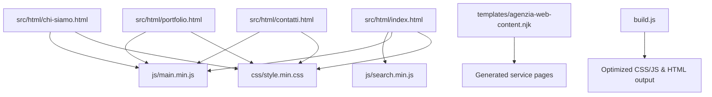
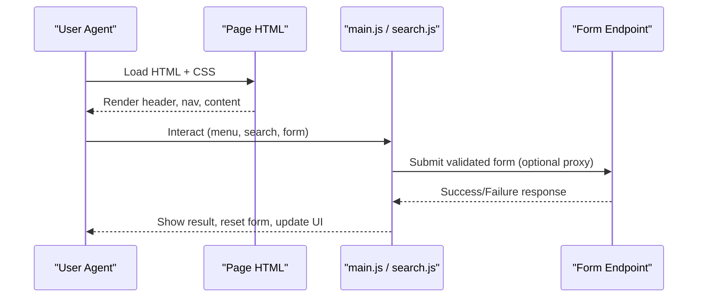
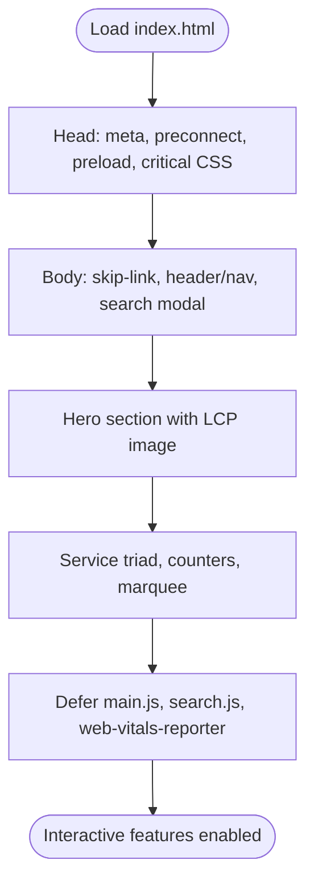
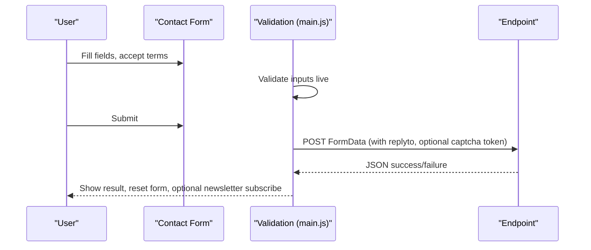
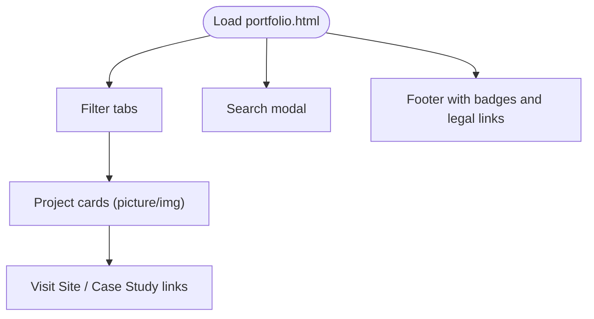
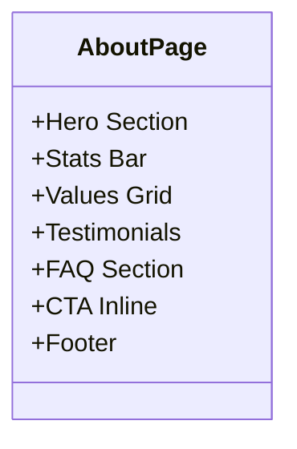
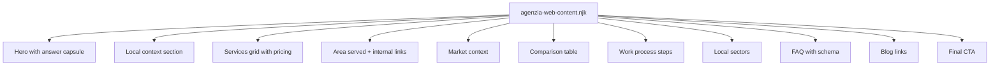
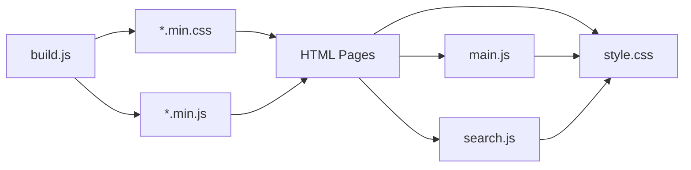

# Static Page Templates

<cite>
**Referenced Files in This Document**
- [index.html](file://src/html/index.html)
- [contatti.html](file://src/html/contatti.html)
- [portfolio.html](file://src/html/portfolio.html)
- [chi-siamo.html](file://src/html/chi-siamo.html)
- [agenzia-web-content.njk](file://templates/agenzia-web-content.njk)
- [main.js](file://js/main.js)
- [search.js](file://js/search.js)
- [build.js](file://build.js)
- [style.css](file://css/style.css)
</cite>

## Table of Contents
1. [Introduction](#introduction)
2. [Project Structure](#project-structure)
3. [Core Components](#core-components)
4. [Architecture Overview](#architecture-overview)
5. [Detailed Component Analysis](#detailed-component-analysis)
6. [Dependency Analysis](#dependency-analysis)
7. [Performance Considerations](#performance-considerations)
8. [Troubleshooting Guide](#troubleshooting-guide)
9. [Conclusion](#conclusion)
10. [Appendices](#appendices)

## Introduction
This document explains the static HTML page templates used across the WebNovis website. It covers the structure and layout patterns for main pages (index, contact, portfolio, about), consistent header/footer components, navigation includes, form handling, interactive elements, JavaScript integration points, responsive design, accessibility compliance, performance optimizations, and guidance for creating new pages while maintaining consistency and integrating with the build pipeline.

## Project Structure
The site uses a flat set of static HTML files under src/html for core pages, Nunjucks templates under templates for generated content sections, shared CSS under css, and shared JavaScript under js. The build script compiles and optimizes assets and can apply SEO transforms to produced HTML.

**Diagram sources**
- [index.html:1-31](file://src/html/index.html#L1-L31)
- [contatti.html:1-22](file://src/html/contatti.html#L1-L22)
- [portfolio.html:1-22](file://src/html/portfolio.html#L1-L22)
- [chi-siamo.html:1-22](file://src/html/chi-siamo.html#L1-L22)
- [agenzia-web-content.njk:15-277](file://templates/agenzia-web-content.njk#L15-L277)
- [build.js:31-112](file://build.js#L31-L112)

**Section sources**
- [index.html:1-31](file://src/html/index.html#L1-L31)
- [build.js:31-112](file://build.js#L31-L112)

## Core Components
- Header and Navigation:
  - All pages include a consistent header with logo, search bar, and navigation menu. The mobile menu toggles via JavaScript and is accessible with aria attributes.
  - Search modal is present on all pages and powered by search.js.

- Footer:
  - Consistent footer with brand info, NAP, social links, columns for Services, Company, Zones Served, Legal, review badges, and dynamic copyright year.

- Main Content Areas:
  - Hero sections vary per page (e.g., index hero, contact hero, portfolio hero).
  - Service and capability sections use reusable grid/card patterns.
  - SEO content blocks are included at the bottom of key pages.

- Forms:
  - Contact form uses client-side validation, optional Turnstile captcha, and submission to a configured endpoint with success feedback and newsletter opt-in.

- Accessibility:
  - Skip-to-content link, semantic landmarks, aria labels, focus states, reduced motion support, and proper roles.

**Section sources**
- [index.html:35-62](file://src/html/index.html#L35-L62)
- [contatti.html:24-47](file://src/html/contatti.html#L24-L47)
- [portfolio.html:24-47](file://src/html/portfolio.html#L24-L47)
- [chi-siamo.html:24-47](file://src/html/chi-siamo.html#L24-L47)
- [contatti.html:118-137](file://src/html/contatti.html#L118-L137)
- [portfolio.html:279-299](file://src/html/portfolio.html#L279-L299)
- [chi-siamo.html:163-182](file://src/html/chi-siamo.html#L163-L182)
- [contatti.html:80-108](file://src/html/contatti.html#L80-L108)
- [main.js:1066-1285](file://js/main.js#L1066-L1285)

## Architecture Overview
The template architecture follows a consistent pattern:
- Each page defines its own head metadata, preloads, critical styles, and minimal inline styles where needed.
- Shared UI components (header, footer, search modal) are duplicated across pages for static hosting simplicity but remain structurally consistent.
- JavaScript is loaded defer or async to avoid render blocking; noncritical scripts are deferred.
- Build pipeline minifies and optimizes CSS/JS and can transform HTML for SEO.

**Diagram sources**
- [index.html:35-62](file://src/html/index.html#L35-L62)
- [contatti.html:80-108](file://src/html/contatti.html#L80-L108)
- [main.js:1066-1285](file://js/main.js#L1066-L1285)
- [search.js:1-200](file://js/search.js#L1-L200)

## Detailed Component Analysis

### Index Page Template
- Purpose: Homepage showcasing services triad, hero LCP image, marquee, counters, and CTAs.
- Key patterns:
  - Critical CSS inline for fast first paint.
  - Preload high-priority resources (hero image, fonts).
  - Deferred scripts for interactivity and analytics.
  - Structured data for organization and breadcrumbs.

**Diagram sources**
- [index.html:1-31](file://src/html/index.html#L1-L31)
- [index.html:35-62](file://src/html/index.html#L35-L62)
- [index.html:63-80](file://src/html/index.html#L63-L80)

**Section sources**
- [index.html:1-31](file://src/html/index.html#L1-L31)
- [index.html:35-62](file://src/html/index.html#L35-L62)
- [index.html:63-80](file://src/html/index.html#L63-L80)

### Contact Page Template
- Purpose: Provide contact information, map embed, and a lead capture form.
- Form handling:
  - Client-side validation for required fields and terms acceptance.
  - Optional Turnstile captcha integration.
  - Submission to a configurable endpoint (default external service or proxy).
  - Success state updates and optional newsletter subscription.

**Diagram sources**
- [contatti.html:80-108](file://src/html/contatti.html#L80-L108)
- [main.js:1066-1285](file://js/main.js#L1066-L1285)

**Section sources**
- [contatti.html:80-108](file://src/html/contatti.html#L80-L108)
- [main.js:1066-1285](file://js/main.js#L1066-L1285)

### Portfolio Page Template
- Purpose: Showcase projects with category filters and case study links.
- Interactive elements:
  - Filter tabs that show/hide cards with transitions.
  - Responsive card grids using picture elements and srcset.
  - Back-to-top button and search modal.

**Diagram sources**
- [portfolio.html:48-56](file://src/html/portfolio.html#L48-L56)
- [portfolio.html:57-221](file://src/html/portfolio.html#L57-L221)
- [portfolio.html:279-299](file://src/html/portfolio.html#L279-L299)

**Section sources**
- [portfolio.html:48-56](file://src/html/portfolio.html#L48-L56)
- [portfolio.html:57-221](file://src/html/portfolio.html#L57-L221)
- [portfolio.html:279-299](file://src/html/portfolio.html#L279-L299)

### About Page Template
- Purpose: Present agency story, values, ecosystem, testimonials, FAQ, and CTAs.
- Patterns:
  - Hero section with tagline and intro.
  - Stats bar and value cards grid.
  - FAQ details with structured data.
  - Footer consistent with other pages.

**Diagram sources**
- [chi-siamo.html:48-65](file://src/html/chi-siamo.html#L48-L65)
- [chi-siamo.html:66-162](file://src/html/chi-siamo.html#L66-L162)
- [chi-siamo.html:163-182](file://src/html/chi-siamo.html#L163-L182)

**Section sources**
- [chi-siamo.html:48-65](file://src/html/chi-siamo.html#L48-L65)
- [chi-siamo.html:66-162](file://src/html/chi-siamo.html#L66-L162)
- [chi-siamo.html:163-182](file://src/html/chi-siamo.html#L163-L182)

### Generated Service Pages (Nunjucks Template)
- Purpose: Generate localized service pages with consistent sections: hero, local context, services grid, area served, market context, comparison table, process steps, sectors, FAQs, blog links, and CTA.
- Data-driven: Uses variables like city, services, faqs, editorial, tier flags to render unique content per location.

**Diagram sources**
- [agenzia-web-content.njk:15-277](file://templates/agenzia-web-content.njk#L15-L277)

**Section sources**
- [agenzia-web-content.njk:15-277](file://templates/agenzia-web-content.njk#L15-L277)

## Dependency Analysis
- Pages depend on shared CSS and JS bundles:
  - style.css provides base styles, responsive utilities, and component classes.
  - main.js handles navigation, scroll effects, reveal animations, and form logic.
  - search.js powers local and AI-enriched search with keyboard accessibility.
- Build pipeline:
  - build.js configures explicit inputs for JS and CSS minification, source maps disabled, and safe fallbacks.
  - HTML may be transformed for SEO during build.

**Diagram sources**
- [build.js:31-112](file://build.js#L31-L112)
- [style.css:5969-6025](file://css/style.css#L5969-L6025)
- [main.js:1-200](file://js/main.js#L1-L200)
- [search.js:1-200](file://js/search.js#L1-L200)

**Section sources**
- [build.js:31-112](file://build.js#L31-L112)
- [style.css:5969-6025](file://css/style.css#L5969-L6025)
- [main.js:1-200](file://js/main.js#L1-L200)
- [search.js:1-200](file://js/search.js#L1-L200)

## Performance Considerations
- Resource loading:
  - Use preload for critical resources (hero images, fonts) and media queries to serve appropriate sizes.
  - Defer noncritical scripts and load them after initial paint.
- CSS optimization:
  - Minified stylesheets with versioned cache busting.
  - Print-first loading for secondary stylesheets to avoid render blocking.
- JS optimization:
  - Terser minification with dead code elimination and console stripping.
  - Debounced search and lazy initialization of heavy features.
- Accessibility and UX:
  - Respects prefers-reduced-motion.
  - Mobile menu locks body scroll to prevent background scrolling.

[No sources needed since this section provides general guidance]

## Troubleshooting Guide
- Form submission issues:
  - Ensure required fields are valid and terms checkbox is accepted before submit.
  - If Turnstile is enabled, verify captcha token is present; otherwise submission will fail.
  - Check endpoint configuration; default is an external service, but a proxy URL can be set.
- Search not working:
  - Verify search modal elements exist and Fuse.js loads correctly.
  - Confirm remote AI endpoint availability if enabled; otherwise rely on local index.
- Mobile menu behavior:
  - If body scroll remains locked, ensure menu-open class is removed and scrollTop restored.

**Section sources**
- [main.js:1066-1285](file://js/main.js#L1066-L1285)
- [search.js:1-200](file://js/search.js#L1-L200)
- [style.css:5969-6025](file://css/style.css#L5969-L6025)

## Conclusion
The WebNovis static templates follow a consistent, accessible, and performant pattern across pages. Shared components (header, footer, search) and robust JavaScript interactions enable a cohesive user experience. The build pipeline ensures optimized assets and optional SEO transformations. Following the guidelines here will help maintain design consistency, improve performance, and streamline adding new pages.

[No sources needed since this section summarizes without analyzing specific files]

## Appendices

### Creating New Static Pages
- Copy an existing page structure from src/html and adjust:
  - Title, meta description, canonical URL, Open Graph/Twitter tags.
  - Hero content and main sections to match the page purpose.
  - Include consistent header/footer markup and search modal.
- Add page-specific CSS only when necessary; prefer reusing existing classes.
- Integrate JavaScript features selectively (e.g., forms, filters) via main.js or dedicated modules.
- Run the build pipeline to generate minified assets and optimize HTML.

**Section sources**
- [index.html:1-31](file://src/html/index.html#L1-L31)
- [build.js:31-112](file://build.js#L31-L112)

### Maintaining Design Consistency
- Use shared classes for layout (container, grid, cards) and typography.
- Keep navigation items aligned across pages.
- Maintain footer structure and legal links.
- Reuse component patterns (hero, sections, CTAs) to ensure visual coherence.

**Section sources**
- [contatti.html:24-47](file://src/html/contatti.html#L24-L47)
- [portfolio.html:24-47](file://src/html/portfolio.html#L24-L47)
- [chi-siamo.html:24-47](file://src/html/chi-siamo.html#L24-L47)

### Integrating With the Build Pipeline
- Add new JS/CSS files to the explicit inputs list in build.js to ensure they are minified and included.
- Reference minified outputs in HTML with versioned cache-busting parameters.
- Apply SEO transforms as needed through the build process.

**Section sources**
- [build.js:31-112](file://build.js#L31-L112)