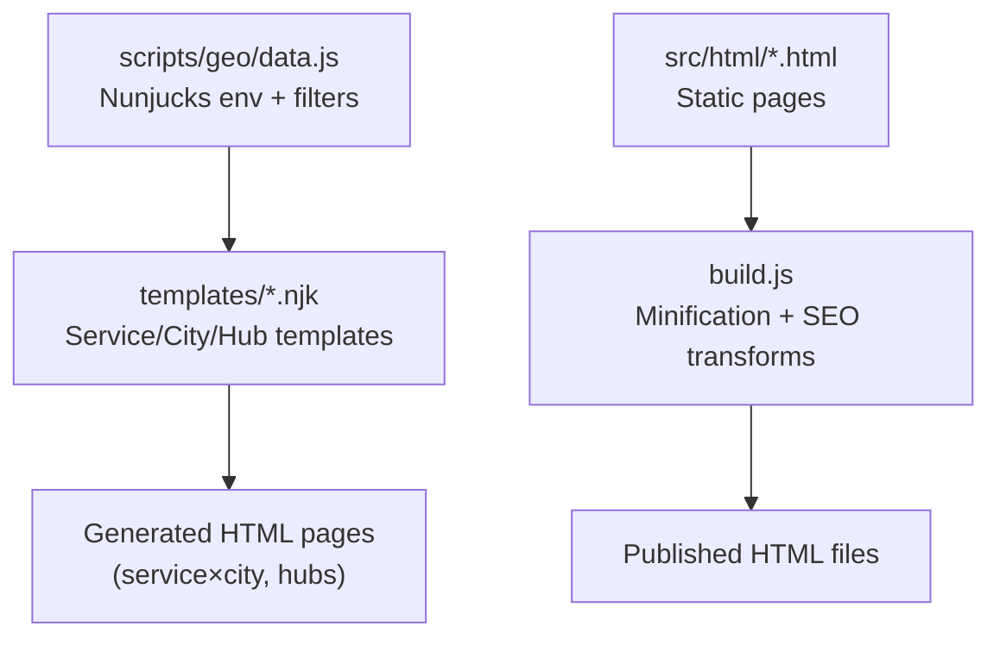
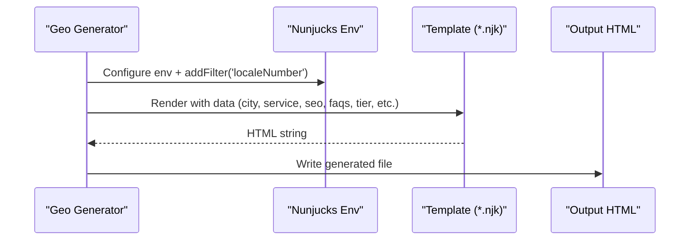
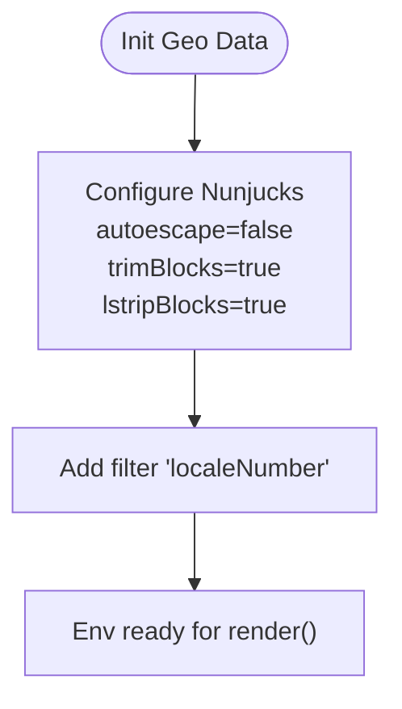
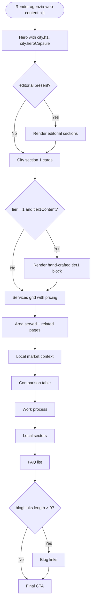
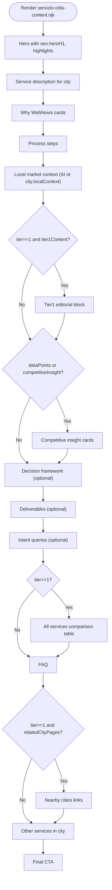
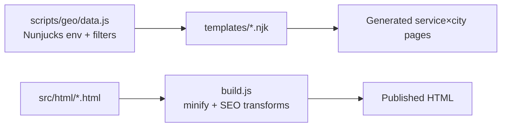

# Template Engine & Rendering

<cite>
**Referenced Files in This Document**
- [agenzia-web-content.njk](file://templates/agenzia-web-content.njk)
- [hub-agenzia-web.njk](file://templates/hub-agenzia-web.njk)
- [hub-realizzazione-siti-web.njk](file://templates/hub-realizzazione-siti-web.njk)
- [hub-zone-servite.njk](file://templates/hub-zone-servite.njk)
- [servizio-citta-content.njk](file://templates/servizio-citta-content.njk)
- [data.js](file://scripts/geo/data.js)
- [build.js](file://build.js)
- [contatti.html](file://src/html/contatti.html)
- [preventivo.html](file://src/html/preventivo.html)
</cite>

## Table of Contents
1. Introduction
2. Project Structure
3. Core Components
4. Architecture Overview
5. Detailed Component Analysis
6. Dependency Analysis
7. Performance Considerations
8. Troubleshooting Guide
9. Conclusion

## Introduction
This document explains the Nunjucks template system used by WebNovis for generating service and city pages, hub pages, and static HTML assets. It covers template inheritance patterns (as implemented), partial includes, component composition strategies, data binding, variable interpolation, conditional rendering, and service-specific templates for agency pages, service pages, and city-specific content. It also documents form handling and interactive elements in static pages, guidance for creating custom templates, responsive design patterns, performance optimization, testing, debugging techniques, and best practices for maintainable template code.

## Project Structure
The project separates templated content from static HTML:
- Nunjucks templates live under templates/ and are rendered during geo page generation to produce service×city and hub pages.
- Static HTML lives under src/html/ and is processed by the build pipeline into minified output.
- The geo generator configures a Nunjucks environment, registers filters, and supplies rich data contexts to templates.

**Diagram sources**
- [data.js:113-119](file://scripts/geo/data.js#L113-L119)
- [build.js:428-493](file://build.js#L428-L493)

**Section sources**
- [data.js:113-119](file://scripts/geo/data.js#L113-L119)
- [build.js:428-493](file://build.js#L428-L493)

## Core Components
- Nunjucks environment configuration and custom filter registration occur in the geo data module.
- Templates implement consistent sections: hero, local context, services grid, comparison tables, FAQs, related links, and CTAs.
- Hub templates aggregate city listings and service scopes across multiple pages.
- Static HTML pages provide forms and interactive UIs that are minified by the build script.

Key responsibilities:
- Data preparation and Nunjucks setup: scripts/geo/data.js
- Service×city and hub templates: templates/*.njk
- Static HTML processing: build.js

**Section sources**
- [data.js:113-119](file://scripts/geo/data.js#L113-L119)
- [agenzia-web-content.njk:1-278](file://templates/agenzia-web-content.njk#L1-L278)
- [hub-agenzia-web.njk:1-145](file://templates/hub-agenzia-web.njk#L1-L145)
- [hub-realizzazione-siti-web.njk:1-118](file://templates/hub-realizzazione-siti-web.njk#L1-L118)
- [hub-zone-servite.njk:1-165](file://templates/hub-zone-servite.njk#L1-L165)
- [servizio-citta-content.njk:1-374](file://templates/servizio-citta-content.njk#L1-L374)
- [build.js:428-493](file://build.js#L428-L493)

## Architecture Overview
The rendering architecture combines a Node-based geo generator with Nunjucks templates and a separate static HTML build pipeline.

**Diagram sources**
- [data.js:113-119](file://scripts/geo/data.js#L113-L119)
- [servizio-citta-content.njk:1-374](file://templates/servizio-citta-content.njk#L1-L374)
- [agenzia-web-content.njk:1-278](file://templates/agenzia-web-content.njk#L1-L278)

## Detailed Component Analysis

### Nunjucks Environment and Filters
- The environment is configured with autoescape disabled and block trimming enabled to allow raw HTML where needed and cleaner template syntax.
- A custom filter localeNumber formats numbers using Italian locale conventions for population and other numeric displays.

**Diagram sources**
- [data.js:113-119](file://scripts/geo/data.js#L113-L119)

**Section sources**
- [data.js:113-119](file://scripts/geo/data.js#L113-L119)

### Agency City Content Template
- Purpose: Renders a city-specific “Agenzia Web” page with structured sections: hero, local context, services grid, area served, market context, comparison table, work process, sectors, FAQ, blog links, and final CTA.
- Data binding: Uses variables like city, services, nearCitiesData, relatedPages, blogLinks, today, todayFormatted, editorial, tier, tier1Content, faqs.
- Conditional rendering:
  - Tier gating controls whether extra editorial blocks or link-heavy sections appear.
  - Local context sections conditionally render based on presence of fields.
- Filters: safe for trusted HTML; localeNumber not used here but available globally.

**Diagram sources**
- [agenzia-web-content.njk:15-278](file://templates/agenzia-web-content.njk#L15-L278)

**Section sources**
- [agenzia-web-content.njk:15-278](file://templates/agenzia-web-content.njk#L15-L278)

### Service×City Content Template
- Purpose: Renders a specific service in a specific city (e.g., /seo-locale-lainate.html). Includes hero highlights, local context, why choose us, process steps, AI-enriched content when available, decision framework, deliverables, intent queries, comparison table, FAQ, nearby cities, and other services in the same city.
- Data binding: city, service, seo, faqs, aiContent, competitiveInsight, dataPoints, relatedCityPages, relatedServicePages, allCoreServices, tier, tier1Content.
- Conditional rendering:
  - Tier >= 1 gates comparison table and nearby city links to avoid doorway-like patterns on de-amplified pages.
  - AI content fallback to city.localContext when unavailable.
  - Related services link count adapts based on tier.

**Diagram sources**
- [servizio-citta-content.njk:21-374](file://templates/servizio-citta-content.njk#L21-L374)

**Section sources**
- [servizio-citta-content.njk:21-374](file://templates/servizio-citta-content.njk#L21-L374)

### Hub Templates
- Hub Agenzia Web: Aggregates top territories and a full city grid linking to individual agency pages per city. Uses cities array and networkCoverageCount.
- Hub Realizzazione Siti Web: Similar structure focused on website realization services, with city grids and service explanations.
- Hub Zone Servite: Cross-service hub showing coverage scopes, featured cities, and service×city grids for each service slug.

Common patterns:
- Hero sections with answer capsules and CTAs.
- City grids with avatars and metadata.
- Service grids and tables for pricing/time estimates.
- Final CTAs driving to contact pages.

**Section sources**
- [hub-agenzia-web.njk:15-145](file://templates/hub-agenzia-web.njk#L15-L145)
- [hub-realizzazione-siti-web.njk:15-118](file://templates/hub-realizzazione-siti-web.njk#L15-L118)
- [hub-zone-servite.njk:17-165](file://templates/hub-zone-servite.njk#L17-L165)

### Static HTML Forms and Interactive Elements
- Contact page: Contains a form posting to an external endpoint, custom selects, validation messages, map embed, and schema markup.
- Quote page: Multi-field form with budget radio buttons, timeline select, message textarea, and success redirect.

These pages are not Nunjucks templates; they are static HTML processed by the build pipeline.

**Section sources**
- [contatti.html:48-118](file://src/html/contatti.html#L48-L118)
- [preventivo.html:48-140](file://src/html/preventivo.html#L48-L140)

## Dependency Analysis
- Nunjucks environment and filters are centralized in the geo data module and reused across template renders.
- Templates depend on JSON data sources (cities, services) prepared by the geo generator.
- Static HTML files are independent of Nunjucks and are minified by the build script.

**Diagram sources**
- [data.js:113-119](file://scripts/geo/data.js#L113-L119)
- [build.js:428-493](file://build.js#L428-L493)

**Section sources**
- [data.js:113-119](file://scripts/geo/data.js#L113-L119)
- [build.js:428-493](file://build.js#L428-L493)

## Performance Considerations
- Use tier gating to limit heavy sections (comparison tables, extensive link lists) on de-amplified pages to reduce DOM size and improve perceived performance.
- Prefer lazy-loading images and avoiding unnecessary inline styles in loops.
- Keep template logic simple; move complex computations to the data layer before rendering.
- For static HTML, rely on the build pipeline’s minification and asset discovery to keep payloads small.

[No sources needed since this section provides general guidance]

## Troubleshooting Guide
- Missing variables: Ensure the data layer passes required keys (city, service, seo, faqs, tier, etc.). Check template comments at the top of each .njk file for expected variables.
- Safe vs unsafe HTML: When rendering user or AI-generated HTML, use the safe filter only when content is trusted. Review where safe is applied in templates.
- Locale formatting: If numbers do not format correctly, verify the localeNumber filter is available and receives valid numeric input.
- Build issues: Confirm that src/html files exist and are referenced by the build script. Errors in CSS/JS minification will be logged by the build pipeline.

**Section sources**
- [servizio-citta-content.njk:1-20](file://templates/servizio-citta-content.njk#L1-L20)
- [agenzia-web-content.njk:1-14](file://templates/agenzia-web-content.njk#L1-L14)
- [data.js:113-119](file://scripts/geo/data.js#L113-L119)
- [build.js:428-493](file://build.js#L428-L493)

## Conclusion
WebNovis uses a hybrid approach: Nunjucks templates generate rich, data-driven service and city pages with consistent structure and conditional rendering, while static HTML pages handle forms and interactive features through a dedicated build pipeline. Centralized Nunjucks configuration and filters ensure consistency, and tier-based gating helps balance content depth with performance. Following the patterns documented here will help create maintainable, performant, and testable templates.

[No sources needed since this section summarizes without analyzing specific files]