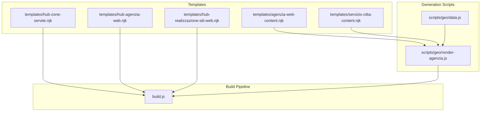
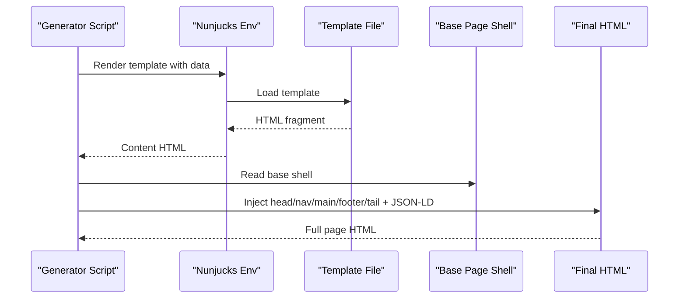
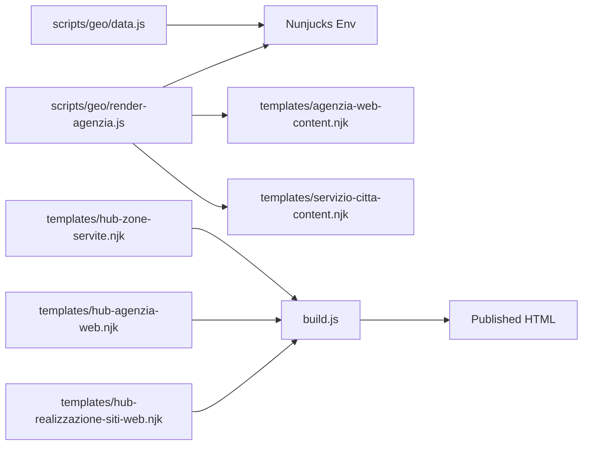

# Template Inheritance & Structure

<cite>
**Referenced Files in This Document**
- [agenzia-web-content.njk](file://templates/agenzia-web-content.njk)
- [hub-agenzia-web.njk](file://templates/hub-agenzia-web.njk)
- [hub-realizzazione-siti-web.njk](file://templates/hub-realizzazione-siti-web.njk)
- [hub-zone-servite.njk](file://templates/hub-zone-servite.njk)
- [servizio-citta-content.njk](file://templates/servizio-citta-content.njk)
- [render-agenzia.js](file://scripts/geo/render-agenzia.js)
- [data.js](file://scripts/geo/data.js)
- [build.js](file://build.js)
</cite>

## Table of Contents
1. Introduction
2. Project Structure
3. Core Components
4. Architecture Overview
5. Detailed Component Analysis
6. Dependency Analysis
7. Performance Considerations
8. Troubleshooting Guide
9. Conclusion

## Introduction
This document explains how WebNovis composes pages using Nunjucks templates to create a consistent, scalable site structure. It focuses on the template hierarchy from generic hubs and service-city content templates to specialized agency pages, and documents how data is passed into templates, how conditional rendering works, and how reusable sections are composed across pages.

The project uses a hybrid approach:
- Static HTML pages under src/html are processed by the build pipeline for minification and SEO transforms.
- Geo-driven pages (service×city and hub pages) are generated at build time with Nunjucks templates and injected into base shell pages.

## Project Structure
At a high level, the template system lives under templates and is driven by scripts under scripts/geo. The build pipeline processes static HTML and integrates generated content into final pages.

**Diagram sources**
- [hub-zone-servite.njk:1-165](file://templates/hub-zone-servite.njk#L1-L165)
- [hub-agenzia-web.njk:1-145](file://templates/hub-agenzia-web.njk#L1-L145)
- [hub-realizzazione-siti-web.njk:1-118](file://templates/hub-realizzazione-siti-web.njk#L1-L118)
- [agenzia-web-content.njk:1-278](file://templates/agenzia-web-content.njk#L1-L278)
- [servizio-citta-content.njk:1-374](file://templates/servizio-citta-content.njk#L1-L374)
- [render-agenzia.js:1-194](file://scripts/geo/render-agenzia.js#L1-L194)
- [data.js:1-197](file://scripts/geo/data.js#L1-L197)
- [build.js:428-493](file://build.js#L428-L493)

**Section sources**
- [build.js:428-493](file://build.js#L428-L493)
- [data.js:113-119](file://scripts/geo/data.js#L113-L119)

## Core Components
- Hub Zone Servite template: top-level navigation page that links to service hubs and city grids.
- Service Hubs: per-service index pages (e.g., Agenzia Web, Realizzazione Siti Web) that list cities and highlight key territories.
- Service×City Content Templates: dynamic pages for each service in each city, including hero, local context, process, comparison tables, FAQs, and related links.
- Agency City Content Template: specialized content layout for “Agenzia Web” city pages with optional Tier 1 editorial blocks.

These components share common UI patterns (hero, service grid, CTA) and are composed via loops, conditionals, and data-driven sections rather than traditional block inheritance.

**Section sources**
- [hub-zone-servite.njk:10-165](file://templates/hub-zone-servite.njk#L10-L165)
- [hub-agenzia-web.njk:6-145](file://templates/hub-agenzia-web.njk#L6-L145)
- [hub-realizzazione-siti-web.njk:6-118](file://templates/hub-realizzazione-siti-web.njk#L6-L118)
- [agenzia-web-content.njk:15-278](file://templates/agenzia-web-content.njk#L15-L278)
- [servizio-citta-content.njk:21-374](file://templates/servizio-citta-content.njk#L21-L374)

## Architecture Overview
WebNovis uses a two-layer composition model:

1. Generation layer (Nunjucks):
   - Data is prepared in Node scripts (cities, services, editorial, AI content).
   - Nunjucks renders content fragments or full pages using templates under templates/.
   - A custom environment is configured once and reused across generators.

2. Assembly layer (Base shell injection):
   - For geo-generated pages, a base shell (Rho source) provides head, nav, footer, and tail assets.
   - Generated content is injected into the shell, schemas are appended, and the final HTML is written.

**Diagram sources**
- [render-agenzia.js:146-186](file://scripts/geo/render-agenzia.js#L146-L186)
- [data.js:113-119](file://scripts/geo/data.js#L113-L119)

**Section sources**
- [render-agenzia.js:146-186](file://scripts/geo/render-agenzia.js#L146-L186)
- [data.js:113-119](file://scripts/geo/data.js#L113-L119)

## Detailed Component Analysis

### Hub Zone Servite Template
Purpose:
- Serves as the cross-service landing page (“Where we operate”).
- Presents coverage scopes, featured cities, and quick links to service hubs and service×city pages.

Key behaviors:
- Iterates over coverage scopes to show counts and helpers.
- Renders featured cities and compact city grids per service.
- Provides orientation guidance to help users choose the right service.

Data expectations:
- networkCoverageCount, coverageScopes, featuredCities, agenziaCities, realizzazioneCities, geoServices, serviceCities, today, todayFormatted.

Reuse pattern:
- Uses shared CSS classes (service-page-hero, service-detail, hub-city-grid) to maintain visual consistency across hubs.

**Section sources**
- [hub-zone-servite.njk:10-165](file://templates/hub-zone-servite.njk#L10-L165)

### Hub: Agenzia Web Template
Purpose:
- Index page for “Agenzia Web” across all supported municipalities.
- Highlights priority territories and lists all cities with avatars and metadata.

Key behaviors:
- Hero section with answer capsule and CTA.
- Grid of priority cities with short descriptions and links to city-specific pages.
- City selection grid linking to /agenzia-web-<slug>.html.
- Comparison table of core services with pricing and time estimates.

Data expectations:
- cities, networkCoverageCount, coreServices, today, todayFormatted.

**Section sources**
- [hub-agenzia-web.njk:6-145](file://templates/hub-agenzia-web.njk#L6-L145)

### Hub: Realizzazione Siti Web Template
Purpose:
- Index page for “Realizzazione Siti Web” across municipalities.
- Similar structure to Agenzia Web hub but tailored copy and emphasis.

Key behaviors:
- Hero with answer capsule and CTA.
- Priority territory cards with links to city pages.
- City selection grid linking to /realizzazione-siti-web-<slug>.html.
- Comparison table of core services.

Data expectations:
- cities, networkCoverageCount, coreServices, today, todayFormatted.

**Section sources**
- [hub-realizzazione-siti-web.njk:6-118](file://templates/hub-realizzazione-siti-web.njk#L6-L118)

### Agency City Content Template (Agenzia Web × City)
Purpose:
- Renders the content body for an “Agenzia Web” city page.
- Supports Tier 1 editorial override for unique, hand-crafted content.

Key behaviors:
- Breadcrumb, hero with answer capsule, and location info.
- Local context section with optional editorial overlay.
- Tier 1 editorial block when available and tier == 1.
- Services grid with pricing and time estimates.
- Area served with nearby cities and internal links.
- Local economic context and sectors served.
- FAQ section and blog links for authority building.
- Final CTA.

Data expectations:
- city, services, nearCitiesData, relatedPages, blogLinks, faqs, tier, tier1Content, editorial, today, todayFormatted, site.

Conditional rendering highlights:
- Editorial overlay only if present.
- Tier 1 block only when tier == 1 and tier1Content exists.
- Blog links shown only when available.

**Section sources**
- [agenzia-web-content.njk:1-278](file://templates/agenzia-web-content.njk#L1-L278)

### Service×City Content Template (Service × City)
Purpose:
- Renders dynamic pages for any service in any city (e.g., SEO locale in Lainate).
- Combines service catalog data with city-specific context and optional AI enrichment.

Key behaviors:
- Breadcrumb referencing the service hub anchor.
- Hero with tag, H1, answer capsule, highlights, and CTA.
- Service description tailored to the city, including distance-based messaging.
- Why WebNovis and process steps rendered as card grids.
- Local market context with optional AI content and local highlights.
- Optional Tier 1 editorial block for unique content.
- Competitive insight and decision framework sections.
- Comparison table of all services (only on indexable tiers).
- FAQ section and related pages (nearby cities and other services in same city).
- Final CTA.

Data expectations:
- city, service, seo, faqs, aiContent, competitiveInsight, dataPoints, relatedCityPages, relatedServicePages, allCoreServices, tier, today, todayFormatted.

Conditional rendering highlights:
- Tier gating for comparison table and link density.
- Related services limit adapts based on tier.
- AI content fallback to local context when not available.

**Section sources**
- [servizio-citta-content.njk:1-374](file://templates/servizio-citta-content.njk#L1-L374)

### Generator: Agency Page Rendering
Purpose:
- Prepares data and renders the “Agenzia Web” city content template, then injects it into a base shell.

Key behaviors:
- Loads base shell for Rho and extracts head, nav, footer, and tail.
- Builds template data: city details, services, FAQs, nearby cities, blog links, tier flags, and optional Tier 1 content.
- Renders content via Nunjucks and merges with shell to produce final HTML.
- Appends JSON-LD schemas and writes output.

Data preparation:
- Resolves nearest cities, builds related pages, computes blog links.
- Merges AI content blocks where available.
- Applies editorial overrides and SEO metadata.

**Section sources**
- [render-agenzia.js:34-188](file://scripts/geo/render-agenzia.js#L34-L188)

### Nunjucks Environment Configuration
Purpose:
- Centralizes template engine setup and filters used across generators.

Key behaviors:
- Configures autoescape, trimBlocks, lstripBlocks.
- Adds localeNumber filter for formatted numbers.
- Exposes njkEnv to all generators.

**Section sources**
- [data.js:113-119](file://scripts/geo/data.js#L113-L119)

## Dependency Analysis
The following diagram shows how templates depend on data and generation scripts, and how the build pipeline integrates everything.

**Diagram sources**
- [data.js:113-119](file://scripts/geo/data.js#L113-L119)
- [render-agenzia.js:146-186](file://scripts/geo/render-agenzia.js#L146-L186)
- [build.js:428-493](file://build.js#L428-L493)
- [hub-zone-servite.njk:10-165](file://templates/hub-zone-servite.njk#L10-L165)
- [hub-agenzia-web.njk:6-145](file://templates/hub-agenzia-web.njk#L6-L145)
- [hub-realizzazione-siti-web.njk:6-118](file://templates/hub-realizzazione-siti-web.njk#L6-L118)

**Section sources**
- [data.js:113-119](file://scripts/geo/data.js#L113-L119)
- [render-agenzia.js:146-186](file://scripts/geo/render-agenzia.js#L146-L186)
- [build.js:428-493](file://build.js#L428-L493)

## Performance Considerations
- Minification: The build pipeline minifies JS and CSS and optionally minifies static HTML under src/html. Geo-generated pages bypass this step; ensure they remain lean by avoiding heavy inline assets.
- Asset discovery: The build script discovers JS/CSS references in published HTML to include them in optimization. Keep asset paths relative to the publish root to avoid missing dependencies.
- Conditional rendering: Use tier flags to reduce link density and content size on de-amplified pages.
- Image handling: Avatars and images use lazy loading attributes in templates to improve initial load performance.

[No sources needed since this section provides general guidance]

## Troubleshooting Guide
Common issues and resolutions:

- Missing base shell for geo pages:
  - Symptom: Generator cannot find the Rho base page.
  - Resolution: Ensure the base page file exists and is referenced correctly by the generator.

- Empty or malformed template data:
  - Symptom: Sections do not render or show placeholders.
  - Resolution: Verify that required variables (city, services, seo, etc.) are provided by the generator and that arrays are non-empty before iteration.

- Tier 1 content not appearing:
  - Symptom: No editorial block on expected pages.
  - Resolution: Confirm tier == 1 and that the corresponding tier1 JSON file exists and is approved for inclusion.

- Nunjucks environment misconfiguration:
  - Symptom: Filters like localeNumber fail.
  - Resolution: Ensure the environment is configured once and filters are registered before rendering.

- Build pipeline skipping HTML minification:
  - Symptom: Static HTML not minified.
  - Resolution: Confirm html-minifier-terser is installed and that files reside under src/html.

**Section sources**
- [render-agenzia.js:34-39](file://scripts/geo/render-agenzia.js#L34-L39)
- [data.js:113-119](file://scripts/geo/data.js#L113-L119)
- [build.js:491-493](file://build.js#L491-L493)

## Conclusion
WebNovis achieves scalable template composition through:
- Reusable hub and content templates that emphasize consistent sections (hero, grids, CTAs).
- Data-driven rendering with clear variable contracts between generators and templates.
- Conditional logic to tailor content density and uniqueness per tier and city.
- A clean separation between generation (Nunjucks) and assembly (base shell injection), integrated by the build pipeline.

To extend the system:
- Add new hub pages by creating a template under templates and wiring it into the build flow.
- Create new service×city pages by preparing data in a generator and rendering the appropriate content template.
- Introduce new reusable sections by adding markup and CSS classes already recognized by existing templates.
- Use tier flags and editorial overrides to control uniqueness and indexability without duplicating large amounts of markup.

[No sources needed since this section summarizes without analyzing specific files]