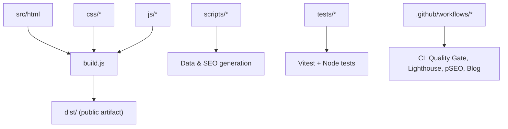
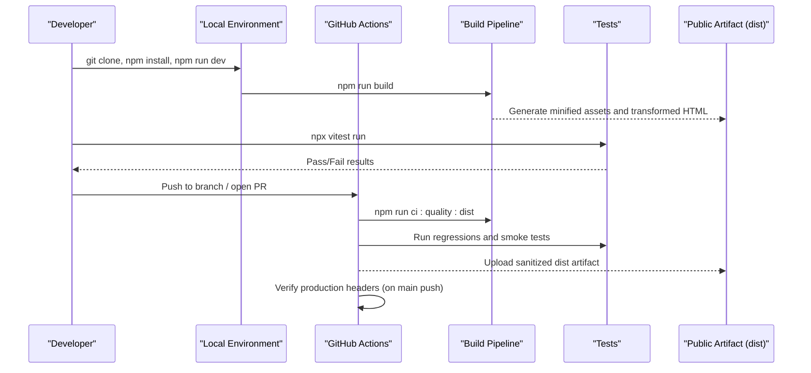
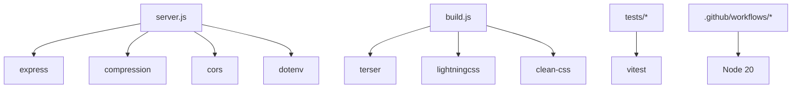

# Contributing Guidelines

<cite>
**Referenced Files in This Document**
- [CONTRIBUTING.md](file://CONTRIBUTING.md)
- [README.md](file://README.md)
- [package.json](file://package.json)
- [.eslintrc.json](file://.eslintrc.json)
- [.prettierrc.json](file://.prettierrc.json)
- [build.js](file://build.js)
- [lighthouserc.js](file://lighthouserc.js)
- [.github/workflows/quality-gate.yml](file://.github/workflows/quality-gate.yml)
- [.github/workflows/lighthouse-ci.yml](file://.github/workflows/lighthouse-ci.yml)
- [.github/workflows/daily-blog.yml](file://.github/workflows/daily-blog.yml)
- [.github/workflows/weekly-pseo.yml](file://.github/workflows/weekly-pseo.yml)
- [tests/health.test.js](file://tests/health.test.js)
- [tests/api-endpoints.test.js](file://tests/api-endpoints.test.js)
</cite>

## Table of Contents
1. Introduction
2. Project Structure
3. Core Components
4. Architecture Overview
5. Detailed Component Analysis
6. Dependency Analysis
7. Performance Considerations
8. Troubleshooting Guide
9. Conclusion
10. Appendices

## Introduction
This document provides comprehensive contributing guidelines for the WebNovis project. It covers development workflow, branching and commit conventions, pull request processes, code standards (ESLint and Prettier), coding style, quality requirements, testing expectations, code review process, acceptance criteria, release and versioning strategy, changelog maintenance, documentation contributions, translation efforts, community engagement, setup instructions, debugging tools, and local testing procedures.

## Project Structure
WebNovis is a static-first site with an optional Node/Express backend and extensive build tooling. The repository organizes source HTML under src/html, assets under css and js, data and configuration files at the root or in dedicated folders, and automation scripts under scripts. Tests live in tests, and CI workflows are defined under .github/workflows.

Key directories and responsibilities:
- src/html: Source HTML pages that are minified and transformed by the build pipeline.
- css and js: Source styles and scripts; minified outputs are generated during build.
- scripts: Build, validation, SEO normalization, content generation, and utilities.
- tests: Regression and smoke tests using Vitest and Node assertions.
- .github/workflows: CI pipelines for quality checks, performance, and automated content generation.

**Section sources**
- [CONTRIBUTING.md:22-37](file://CONTRIBUTING.md#L22-L37)
- [README.md:192-216](file://README.md#L192-L216)

## Core Components
- Development server and scripts: npm start runs the Express server; npm run dev uses nodemon for hot reload.
- Build system: build.js minifies JS (Terser), CSS (LightningCSS with CleanCSS fallback), and optionally minifies HTML from src/html.
- Testing: Vitest-based health and regression tests; Node-based API endpoint tests.
- CI/CD: Quality gate builds dist, validates artifacts, uploads sanitized public artifact, and verifies production headers on main pushes. Lighthouse CI enforces performance thresholds. Weekly pSEO and daily blog generators automate content creation.

Important commands:
- npm run dev: Start development server with hot reload.
- npm start: Start production server.
- npm run build: Run asset build pipeline.
- npm run build:search-index: Rebuild search index.
- npm run build:sitemap: Regenerate sitemap.xml.
- npx vitest run: Execute test suite.

**Section sources**
- [package.json:6-61](file://package.json#L6-L61)
- [build.js:1-113](file://build.js#L1-113)
- [tests/health.test.js:1-48](file://tests/health.test.js#L1-L48)
- [tests/api-endpoints.test.js:1-40](file://tests/api-endpoints.test.js#L1-L40)

## Architecture Overview
The WebNovis architecture follows a static-first approach with optional backend features. The build pipeline produces a sanitized dist artifact used by CI and deployment. Automated workflows generate SEO content and blog articles, while quality gates ensure consistency and security.

**Diagram sources**
- [.github/workflows/quality-gate.yml:1-47](file://.github/workflows/quality-gate.yml#L1-L47)
- [build.js:373-496](file://build.js#L373-L496)
- [tests/health.test.js:1-48](file://tests/health.test.js#L1-L48)

## Detailed Component Analysis

### Branching Strategy and Commit Conventions
- Branch naming: Use descriptive names such as fix/mojibake-portfolio or feat/skip-to-content. Create branches from main.
- Commit messages: Write in English with conventional prefixes like fix:, feat:, docs:, perf:, refactor:.
- Pull requests: Describe what changes and why. Ensure tests pass and regenerate sitemap/search index when HTML changes.

Acceptance criteria for PRs:
- All tests pass (npx vitest run).
- Build succeeds and dist artifact is clean.
- Sitemap regenerated if HTML pages changed.
- No secrets or sensitive files committed.

**Section sources**
- [CONTRIBUTING.md:46-52](file://CONTRIBUTING.md#L46-L52)
- [CONTRIBUTING.md:54-63](file://CONTRIBUTING.md#L54-L63)

### Code Standards: ESLint and Prettier
- ESLint configuration targets Node and Browser environments with ES2022 modules. Rules include no-unused-vars, no-undef, eqeqeq, no-var, prefer-const, and no-duplicate-imports. Minified files and specific directories are ignored.
- Prettier enforces consistent formatting: semicolons, single quotes, 4-space tabs, trailing commas (ES5), print width 120, arrow parens always, LF line endings.

Best practices:
- Run linters before committing.
- Format files consistently using Prettier.
- Avoid unused variables and enforce strict equality.

**Section sources**
- [.eslintrc.json:1-28](file://.eslintrc.json#L1-L28)
- [.prettierrc.json:1-10](file://.prettierrc.json#L1-L10)

### Coding Style Guidelines
- JavaScript: camelCase file names; use modern syntax (ES2022 modules); avoid var; prefer const/let; use === instead of ==.
- HTML: Keep source readable in src/html; minification occurs during build.
- CSS: Source files in css/; minified outputs generated automatically.
- Naming: kebab-case for HTML files; camelCase for JS files.

**Section sources**
- [CONTRIBUTING.md:39-44](file://CONTRIBUTING.md#L39-L44)

### Testing Requirements
- Health and smoke tests validate sitemap, robots.txt, manifest, search-index, required meta tags, skip-to-content links, canonical URLs, structured data, and security headers.
- API endpoint tests spawn the server, wait for readiness, and assert behavior for search, newsletter unsubscribe, redirects, and error handling.
- Regression tests cover image policy, header verifier, footer widgets loader, build pipeline, and more.

Running tests locally:
- npx vitest run: Execute all tests.
- npm run test:regressions: Run full regression suite.
- npm run test:api: Run API endpoint tests.

**Section sources**
- [tests/health.test.js:1-110](file://tests/health.test.js#L1-L110)
- [tests/api-endpoints.test.js:1-136](file://tests/api-endpoints.test.js#L1-L136)
- [package.json:42-47](file://package.json#L42-L47)

### Code Review Process and Acceptance Criteria
- Review checklist:
  - All tests pass.
  - Build completes without errors.
  - Dist artifact is clean and validated.
  - Security headers verified on main pushes via CI.
  - Documentation updated where applicable.
- Merge criteria:
  - CI quality gate passes.
  - Lighthouse thresholds met.
  - No regressions introduced.

**Section sources**
- [.github/workflows/quality-gate.yml:1-47](file://.github/workflows/quality-gate.yml#L1-L47)
- [lighthouserc.js:1-28](file://lighthouserc.js#L1-L28)

### Release Process, Versioning Strategy, and Changelog Maintenance
- Versioning: package.json defines the project version; updates should align with semantic versioning principles.
- Release steps:
  - Ensure all tests pass and build succeeds.
  - Update version in package.json.
  - Generate dist artifact and verify integrity.
  - Tag release and publish notes summarizing changes.
- Changelog: Maintain a changelog describing notable changes, fixes, and improvements per release.

Note: Specific changelog location is not defined in the referenced files; maintain it alongside package.json updates.

**Section sources**
- [package.json:1-10](file://package.json#L1-L10)

### Documentation Contributions, Translation Efforts, and Community Engagement
- Documentation:
  - Internal docs reside under docs/; keep them accurate and verifiable against code/pipeline state.
  - When audits are resolved by real fixes, update or archive documents accordingly.
- Translations:
  - Follow existing language patterns; ensure consistent naming and structure.
- Community engagement:
  - Open issues for bugs and feature requests.
  - Provide clear reproduction steps and expected outcomes.
  - Engage respectfully and follow contribution guidelines.

**Section sources**
- [docs/seo-strategy/README.md:29-34](file://docs/seo-strategy/README.md#L29-L34)

### Setup Instructions, Debugging Tools, and Local Testing Procedures
- Setup:
  - Clone repository and install dependencies.
  - Configure environment variables (.env.example -> .env).
  - Start development server with npm run dev.
- Debugging:
  - Use browser console (F12) for frontend issues.
  - Check server logs for backend problems.
  - Validate structured data with Google Rich Results Test after JSON-LD changes.
- Local testing:
  - Run npx vitest run for tests.
  - Regenerate sitemap and search index when HTML changes.
  - Verify encoding and avoid mojibake characters.

**Section sources**
- [CONTRIBUTING.md:3-20](file://CONTRIBUTING.md#L3-L20)
- [CONTRIBUTING.md:65-76](file://CONTRIBUTING.md#L65-L76)

## Dependency Analysis
The project relies on Node.js packages for server runtime, build tooling, and testing. Key dependencies include Express, compression, cors, dotenv, node-fetch, nunjucks, and devDependencies for minification, linting, and testing.

**Diagram sources**
- [package.json:69-90](file://package.json#L69-L90)
- [build.js:1-28](file://build.js#L1-L28)

**Section sources**
- [package.json:69-90](file://package.json#L69-L90)

## Performance Considerations
- Lighthouse CI enforces minimum scores for performance, SEO, and accessibility across key pages.
- Build pipeline minimizes JS and CSS, and optionally minifies HTML from src/html.
- Static mode vs Node mode: On static hosting, API endpoints are unavailable; design features accordingly.

Recommendations:
- Monitor Lighthouse reports regularly.
- Optimize images and assets.
- Prefer lazy loading for non-critical resources.

**Section sources**
- [lighthouserc.js:1-28](file://lighthouserc.js#L1-L28)
- [build.js:428-496](file://build.js#L428-L496)
- [README.md:53-58](file://README.md#L53-L58)

## Troubleshooting Guide
Common issues and resolutions:
- Chatbot not responding: Ensure chat script loads; check browser console; verify API endpoints if using backend.
- Animations not working: Confirm main script loaded; check browser compatibility; disable interfering extensions.
- Layout broken on mobile: Verify viewport meta tag; inspect media queries; test on real devices.
- Encoding issues: Use proper Unicode em-dash or entities; avoid mojibake.
- Header mismatches: CI verifies production headers on main pushes; ensure CSP and HSTS configured.

**Section sources**
- [README.md:251-267](file://README.md#L251-L267)
- [CONTRIBUTING.md:70-76](file://CONTRIBUTING.md#L70-L76)
- [.github/workflows/quality-gate.yml:41-47](file://.github/workflows/quality-gate.yml#L41-L47)

## Conclusion
Contributing to WebNovis involves following established workflows, maintaining code quality through ESLint and Prettier, ensuring robust testing, and adhering to CI/CD gates. By adhering to these guidelines, contributors help maintain a high-performance, secure, and accessible website while enabling automated content generation and SEO optimization.

## Appendices

### Contribution Workflows Examples
- Feature request:
  - Fork repo, create feature branch, implement changes, add/update tests, run linters, submit PR with description.
- Bug report:
  - Open issue with steps to reproduce, expected vs actual behavior, environment details, and logs.
- Content generation:
  - Use weekly pSEO workflow to regenerate geo pages and AI content blocks; validate output before merging.

**Section sources**
- [.github/workflows/weekly-pseo.yml:1-120](file://.github/workflows/weekly-pseo.yml#L1-L120)
- [.github/workflows/daily-blog.yml:1-56](file://.github/workflows/daily-blog.yml#L1-L56)