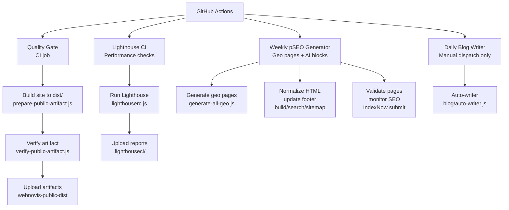
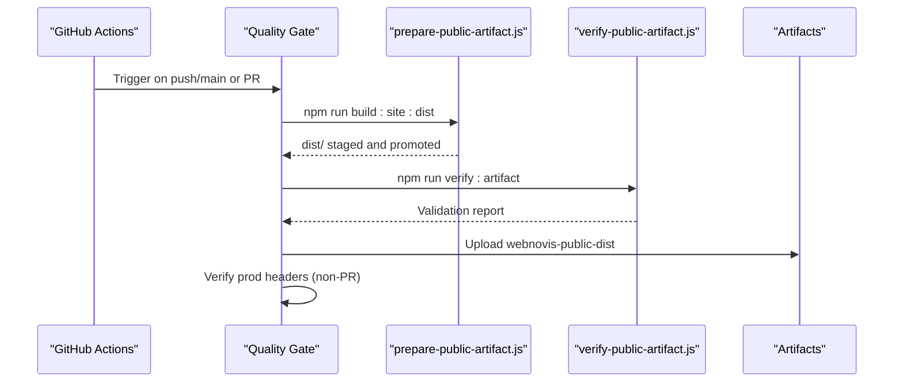
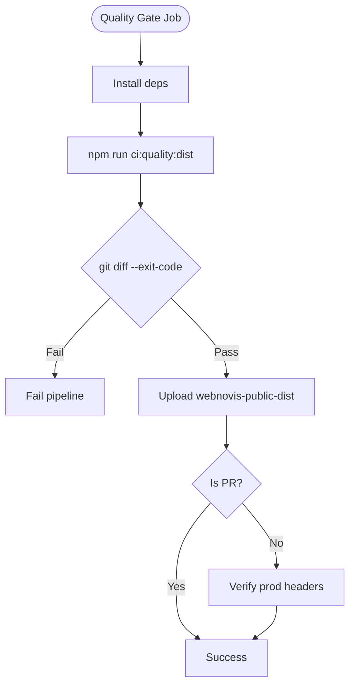
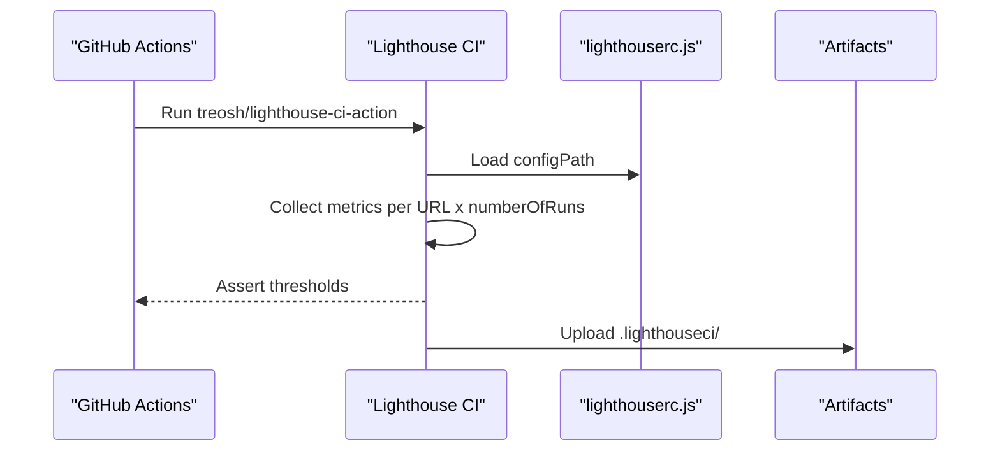
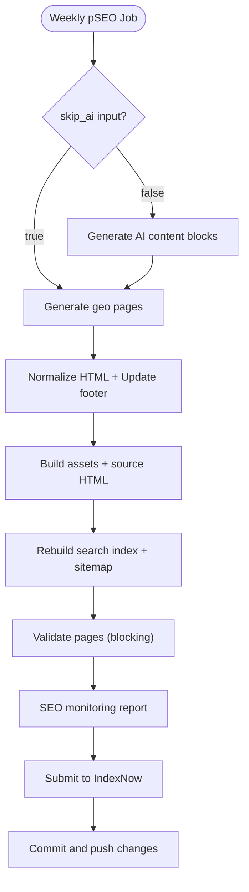
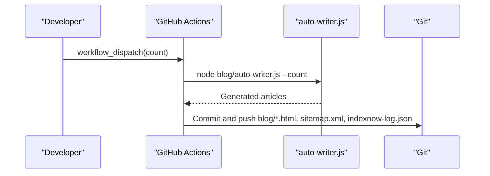
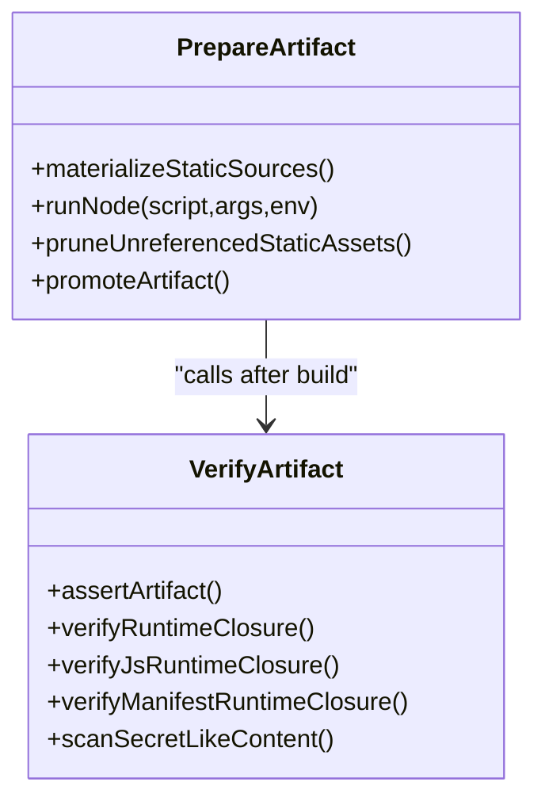
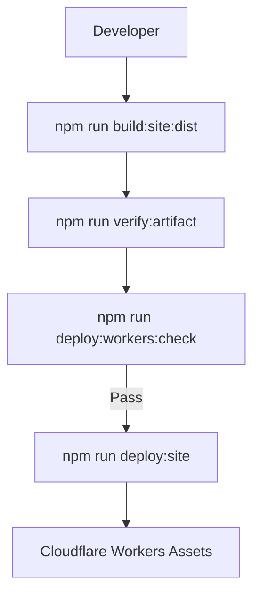
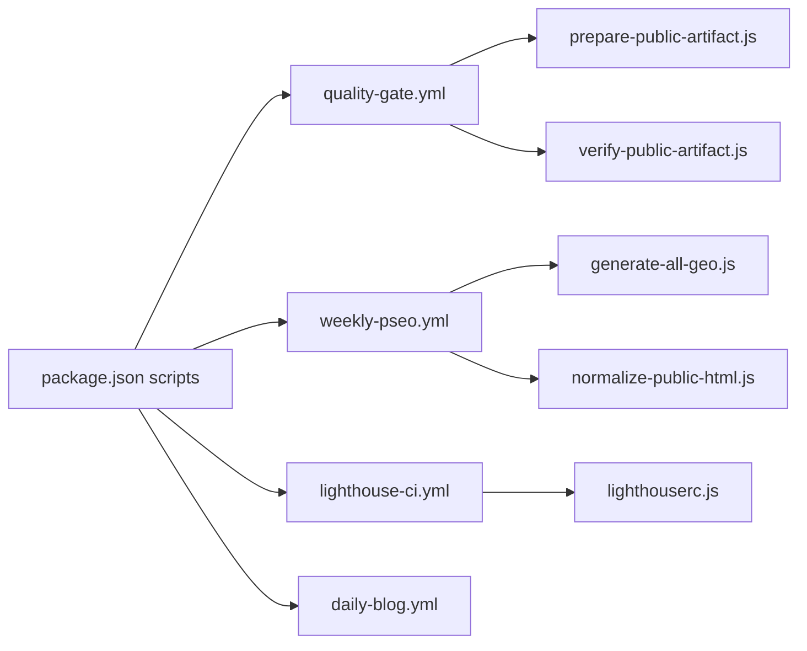

# CI/CD Pipeline & Automation

<cite>
**Referenced Files in This Document**
- [daily-blog.yml](file://.github/workflows/daily-blog.yml)
- [lighthouse-ci.yml](file://.github/workflows/lighthouse-ci.yml)
- [quality-gate.yml](file://.github/workflows/quality-gate.yml)
- [weekly-pseo.yml](file://.github/workflows/weekly-pseo.yml)
- [package.json](file://package.json)
- [build.js](file://build.js)
- [prepare-public-artifact.js](file://scripts/prepare-public-artifact.js)
- [verify-public-artifact.js](file://scripts/verify-public-artifact.js)
- [lighthouserc.js](file://lighthouserc.js)
- [wrangler.jsonc](file://wrangler.jsonc)
- [WORKERS-ASSETS-DIST.md](file://docs/deploy/WORKERS-ASSETS-DIST.md)
- [build-pipeline-regressions.test.js](file://tests/build-pipeline-regressions.test.js)
</cite>

## Table of Contents
1. Introduction
2. Project Structure
3. Core Components
4. Architecture Overview
5. Detailed Component Analysis
6. Dependency Analysis
7. Performance Considerations
8. Troubleshooting Guide
9. Conclusion
10. Appendices

## Introduction
This document explains the WebNovis CI/CD pipeline and automation workflows. It covers GitHub Actions jobs for daily blog generation, Lighthouse performance testing, quality gates, and weekly SEO tasks. It also details the build process, artifact management, release procedures, environment-specific deployment options, rollback strategies, and monitoring/alerting guidance for pipeline failures and performance regressions.

## Project Structure
The repository uses a dist-first approach: all public outputs are built into a sanitized `dist/` directory before any deployment. GitHub Actions orchestrate content generation, validation, and optional deployment. The core scripts handle asset minification, HTML normalization, search index and sitemap generation, and strict artifact verification.

**Diagram sources**
- [quality-gate.yml:1-47](file://.github/workflows/quality-gate.yml#L1-L47)
- [lighthouse-ci.yml:1-27](file://.github/workflows/lighthouse-ci.yml#L1-L27)
- [weekly-pseo.yml:1-120](file://.github/workflows/weekly-pseo.yml#L1-L120)
- [daily-blog.yml:1-56](file://.github/workflows/daily-blog.yml#L1-L56)
- [prepare-public-artifact.js:183-249](file://scripts/prepare-public-artifact.js#L183-L249)
- [verify-public-artifact.js:235-393](file://scripts/verify-public-artifact.js#L235-L393)
- [lighthouserc.js:1-28](file://lighthouserc.js#L1-L28)

**Section sources**
- [quality-gate.yml:1-47](file://.github/workflows/quality-gate.yml#L1-L47)
- [lighthouse-ci.yml:1-27](file://.github/workflows/lighthouse-ci.yml#L1-L27)
- [weekly-pseo.yml:1-120](file://.github/workflows/weekly-pseo.yml#L1-L120)
- [daily-blog.yml:1-56](file://.github/workflows/daily-blog.yml#L1-L56)
- [package.json:6-61](file://package.json#L6-L61)

## Core Components
- Quality Gate: Builds the public artifact to `dist/`, runs regression tests, ensures no tracked source mutation, uploads the sanitized artifact, and verifies production headers on non-PR pushes.
- Lighthouse CI: Runs performance, SEO, and accessibility audits against configured URLs with thresholds; uploads reports as artifacts.
- Weekly pSEO Generator: Generates AI content blocks (optional), regenerates geo pages, normalizes HTML, rebuilds search index and sitemap, validates pages, runs SEO monitoring, submits URLs to IndexNow, and commits changes.
- Daily Blog Writer: Manual-only workflow that generates a small number of articles via an auto-writer script and commits them for review.

Key build and verification scripts:
- prepare-public-artifact.js: Orchestrates a staged build, copies allowed assets, runs generators, normalizes output, prunes unreferenced media/fonts, validates pages, and atomically promotes the artifact.
- verify-public-artifact.js: Enforces sentinels, forbids sensitive paths, checks runtime closure, manifest integrity, sitemap/search-index alignment, header synchronization, and LCP image policy.

**Section sources**
- [quality-gate.yml:9-47](file://.github/workflows/quality-gate.yml#L9-L47)
- [lighthouse-ci.yml:8-27](file://.github/workflows/lighthouse-ci.yml#L8-L27)
- [weekly-pseo.yml:22-120](file://.github/workflows/weekly-pseo.yml#L22-L120)
- [daily-blog.yml:23-56](file://.github/workflows/daily-blog.yml#L23-L56)
- [prepare-public-artifact.js:183-249](file://scripts/prepare-public-artifact.js#L183-L249)
- [verify-public-artifact.js:235-393](file://scripts/verify-public-artifact.js#L235-L393)

## Architecture Overview
The pipeline enforces a strict separation between source code and public artifacts. All CI jobs operate on checked-out sources, but the canonical build path produces a hardened `dist/` artifact that is validated before upload or deployment.

**Diagram sources**
- [quality-gate.yml:9-47](file://.github/workflows/quality-gate.yml#L9-L47)
- [prepare-public-artifact.js:183-249](file://scripts/prepare-public-artifact.js#L183-L249)
- [verify-public-artifact.js:235-393](file://scripts/verify-public-artifact.js#L235-L393)

## Detailed Component Analysis

### Quality Gate
- Triggers: push to main, pull requests, manual dispatch.
- Steps:
  - Install dependencies and run the canonical dist-first quality command.
  - Ensure no tracked source files were mutated by the build.
  - Upload sanitized `dist/` artifact.
  - On non-PR events, verify production headers against live endpoints.

**Diagram sources**
- [quality-gate.yml:9-47](file://.github/workflows/quality-gate.yml#L9-L47)
- [package.json:46-53](file://package.json#L46-L53)

**Section sources**
- [quality-gate.yml:1-47](file://.github/workflows/quality-gate.yml#L1-L47)
- [package.json:46-53](file://package.json#L46-L53)

### Lighthouse CI
- Triggers: push to main, manual dispatch, weekly schedule.
- Audits: Performance, SEO, Accessibility with minimum score thresholds.
- Outputs: Reports uploaded as artifacts for 30 days.

**Diagram sources**
- [lighthouse-ci.yml:1-27](file://.github/workflows/lighthouse-ci.yml#L1-L27)
- [lighthouserc.js:1-28](file://lighthouserc.js#L1-L28)

**Section sources**
- [lighthouse-ci.yml:1-27](file://.github/workflows/lighthouse-ci.yml#L1-L27)
- [lighthouserc.js:1-28](file://lighthouserc.js#L1-L28)

### Weekly pSEO Generator
- Schedule: Weekly Sunday at 3 AM UTC; supports manual inputs to force AI regeneration or skip AI steps.
- Steps:
  - Generate AI content blocks (optional).
  - Generate all geo pages.
  - Normalize public HTML and update footers.
  - Build assets and source HTML.
  - Rebuild search index and sitemap.
  - Validate page quality (blocking).
  - Run SEO monitoring report.
  - Submit new/changed URLs to IndexNow.
  - Commit and push generated content.

**Diagram sources**
- [weekly-pseo.yml:22-120](file://.github/workflows/weekly-pseo.yml#L22-L120)

**Section sources**
- [weekly-pseo.yml:1-120](file://.github/workflows/weekly-pseo.yml#L1-L120)

### Daily Blog Writer
- Trigger: Manual dispatch only (cron disabled due to policy risk).
- Behavior: Generates a small number of articles using an auto-writer script and commits them for human review.

**Diagram sources**
- [daily-blog.yml:1-56](file://.github/workflows/daily-blog.yml#L1-L56)

**Section sources**
- [daily-blog.yml:1-56](file://.github/workflows/daily-blog.yml#L1-L56)

### Build Process and Artifact Management
- Dist-first build orchestrated by prepare-public-artifact.js:
  - Materialize static sources from allowlisted directories.
  - Generate geo pages and build assets.
  - Normalize HTML, update footer, rebuild search index and sitemap.
  - Prune unreferenced media/fonts.
  - Validate pages and assert artifact integrity.
  - Atomically promote staging to publish root.
- Verification by verify-public-artifact.js:
  - Ensures required sentinels exist.
  - Blocks forbidden paths and secret-like content.
  - Validates runtime closure for HTML/CSS/JS.
  - Checks manifest integrity and dynamic dependencies.
  - Confirms sitemap/search-index alignment and noindex rules.
  - Verifies `_headers` synchronization and LCP image policy.

**Diagram sources**
- [prepare-public-artifact.js:87-181](file://scripts/prepare-public-artifact.js#L87-L181)
- [prepare-public-artifact.js:183-249](file://scripts/prepare-public-artifact.js#L183-L249)
- [verify-public-artifact.js:108-145](file://scripts/verify-public-artifact.js#L108-L145)
- [verify-public-artifact.js:235-393](file://scripts/verify-public-artifact.js#L235-L393)

**Section sources**
- [prepare-public-artifact.js:183-249](file://scripts/prepare-public-artifact.js#L183-L249)
- [verify-public-artifact.js:235-393](file://scripts/verify-public-artifact.js#L235-L393)
- [build.js:373-496](file://build.js#L373-L496)

### Deployment Triggers and Release Procedures
- Local and CI-friendly commands:
  - Build site artifact: `npm run build:site:dist`.
  - Verify artifact: `npm run verify:artifact`.
  - Dry-run deploy: `npm run deploy:workers:check` (alias `deploy:site:dry`).
  - Deploy: `npm run deploy:site` (requires authentication; not for blind CI use).
- Cloudflare Workers Assets configuration targets `dist/` with explicit HTML handling to preserve `.html` URLs.

**Diagram sources**
- [package.json:46-53](file://package.json#L46-L53)
- [wrangler.jsonc:1-30](file://wrangler.jsonc#L1-L30)
- [WORKERS-ASSETS-DIST.md:1-91](file://docs/deploy/WORKERS-ASSETS-DIST.md#L1-L91)

**Section sources**
- [package.json:46-53](file://package.json#L46-L53)
- [wrangler.jsonc:1-30](file://wrangler.jsonc#L1-L30)
- [WORKERS-ASSETS-DIST.md:1-91](file://docs/deploy/WORKERS-ASSETS-DIST.md#L1-L91)

## Dependency Analysis
- Workflows depend on Node.js tooling and scripts defined in package.json.
- Quality Gate depends on the canonical dist-first command and regression tests.
- Weekly pSEO depends on geo generation, HTML normalization, search index/sitemap builders, and validators.
- Lighthouse CI depends on lighthouserc.js configuration and external action.

**Diagram sources**
- [package.json:6-61](file://package.json#L6-L61)
- [quality-gate.yml:9-47](file://.github/workflows/quality-gate.yml#L9-L47)
- [weekly-pseo.yml:22-120](file://.github/workflows/weekly-pseo.yml#L22-L120)
- [lighthouse-ci.yml:8-27](file://.github/workflows/lighthouse-ci.yml#L8-L27)

**Section sources**
- [package.json:6-61](file://package.json#L6-L61)
- [quality-gate.yml:9-47](file://.github/workflows/quality-gate.yml#L9-L47)
- [weekly-pseo.yml:22-120](file://.github/workflows/weekly-pseo.yml#L22-L120)
- [lighthouse-ci.yml:8-27](file://.github/workflows/lighthouse-ci.yml#L8-L27)

## Performance Considerations
- Lighthouse thresholds enforce minimum scores for performance, SEO, and accessibility.
- Asset minification uses optimized JS and CSS pipelines with fallbacks.
- Public artifact pruning removes unreferenced media/fonts to reduce payload size.
- Stable asset paths with bounded TTLs avoid aggressive caching policies that could break updates.

[No sources needed since this section provides general guidance]

## Troubleshooting Guide
Common failure points and how to diagnose:
- Quality Gate fails:
  - Check dist build logs and ensure `ci:quality:dist` completes.
  - Inspect `git diff` to confirm no tracked sources were mutated.
  - Review uploaded artifact contents if present.
- Lighthouse CI fails:
  - Inspect threshold violations in reports and adjust content or thresholds.
  - Confirm URLs in lighthouserc.js match production.
- Weekly pSEO fails:
  - Validate page quality step output; fix broken templates or data.
  - Check IndexNow submission and API keys.
  - Review SEO monitoring report for anomalies.
- Artifact verification fails:
  - Inspect missing runtime references, forbidden paths, or secret-like content.
  - Ensure `_headers` synchronization and LCP image policy compliance.

**Section sources**
- [quality-gate.yml:9-47](file://.github/workflows/quality-gate.yml#L9-L47)
- [lighthouse-ci.yml:8-27](file://.github/workflows/lighthouse-ci.yml#L8-L27)
- [weekly-pseo.yml:77-120](file://.github/workflows/weekly-pseo.yml#L77-L120)
- [verify-public-artifact.js:235-393](file://scripts/verify-public-artifact.js#L235-L393)

## Conclusion
WebNovis uses a robust, dist-first CI/CD pipeline with strong quality gates, automated SEO generation, performance auditing, and safe deployment practices. The artifact-centric approach minimizes risk by validating outputs before upload or deployment, while scheduled and manual workflows provide flexibility for content generation and maintenance.

[No sources needed since this section summarizes without analyzing specific files]

## Appendices

### Configuration Examples for Custom Workflows
- Add a new scheduled job: define a cron expression under `on.schedule` and add a job block with checkout, setup-node, and script execution steps.
- Add environment variables: inject secrets via `${{ secrets.* }}` in workflow steps.
- Use inputs for manual triggers: define `workflow_dispatch.inputs` and reference them in steps.

**Section sources**
- [weekly-pseo.yml:1-21](file://.github/workflows/weekly-pseo.yml#L1-L21)
- [daily-blog.yml:9-18](file://.github/workflows/daily-blog.yml#L9-L18)

### Environment-Specific Deployments
- Local development: use `npm run dev` and `npm run ai:dev` for local workers.
- Preview dry-run: `npm run deploy:workers:check` builds and validates without uploading.
- Production deploy: `npm run deploy:site` requires authentication and should be executed intentionally.

**Section sources**
- [package.json:54-58](file://package.json#L54-L58)
- [WORKERS-ASSETS-DIST.md:35-55](file://docs/deploy/WORKERS-ASSETS-DIST.md#L35-L55)

### Rollback Strategies
- Atomic promotion: prepare-public-artifact.js stages builds in a temporary directory and atomically renames to the publish root, enabling quick rollback by restoring previous artifacts if needed.
- Artifact retention: keep last known good `dist/` snapshots locally or in storage for fast recovery.
- Workers Assets: redeploy previous version by pointing back to prior artifact if platform supports versioned deployments.

**Section sources**
- [prepare-public-artifact.js:158-181](file://scripts/prepare-public-artifact.js#L158-L181)

### Monitoring and Alerting Setup
- Pipeline failures:
  - Enable GitHub Actions notifications for failed runs.
  - Use Slack/email integrations via GitHub Actions to alert on failures.
- Performance regressions:
  - Rely on Lighthouse CI thresholds to fail builds when metrics drop below targets.
  - Archive reports and track trends over time.
- SEO regressions:
  - Use weekly pSEO monitoring reports to detect anomalies.
  - Integrate IndexNow logs to monitor indexing status.

[No sources needed since this section provides general guidance]