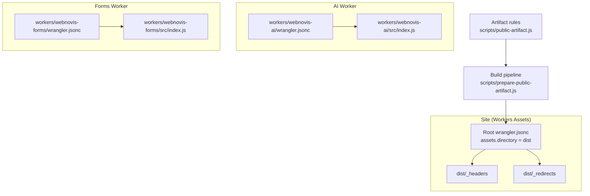
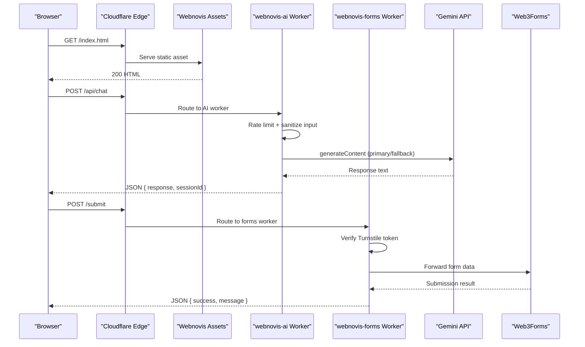
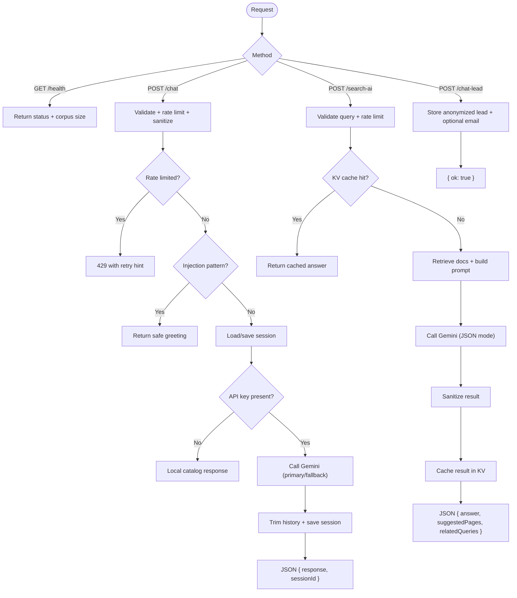
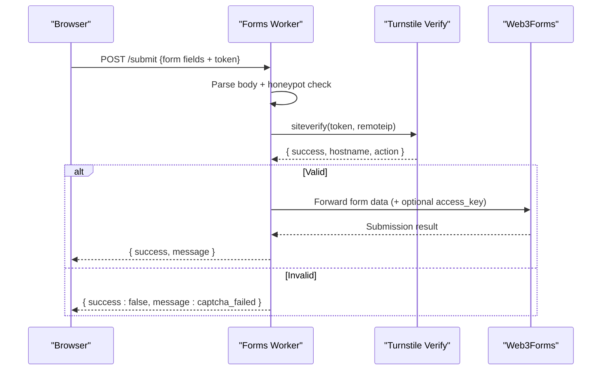
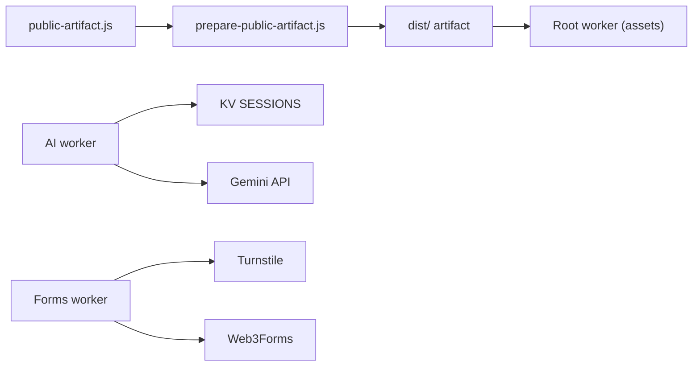

# Cloudflare Workers Configuration

<cite>
**Referenced Files in This Document**
- [wrangler.jsonc](file://wrangler.jsonc)
- [workers/webnovis-ai/wrangler.jsonc](file://workers/webnovis-ai/wrangler.jsonc)
- [workers/webnovis-forms/wrangler.jsonc](file://workers/webnovis-forms/wrangler.jsonc)
- [workers/webnovis-ai/src/index.js](file://workers/webnovis-ai/src/index.js)
- [workers/webnovis-forms/src/index.js](file://workers/webnovis-forms/src/index.js)
- [workers/webnovis-ai/.dev.vars.example](file://workers/webnovis-ai/.dev.vars.example)
- [scripts/prepare-public-artifact.js](file://scripts/prepare-public-artifact.js)
- [scripts/public-artifact.js](file://scripts/public-artifact.js)
- [docs/deploy/CLOUDFLARE-CONFIGURAZIONE-PASSO-PASSO.md](file://docs/deploy/CLOUDFLARE-CONFIGURAZIONE-PASSO-PASSO.md)
- [docs/deploy/CLOUDFLARE-ZONE-REDIRECTS.md](file://docs/deploy/CLOUDFLARE-ZONE-REDIRECTS.md)
- [docs/deploy/MIGRAZIONE-CLOUDFLARE-PAGES.md](file://docs/deploy/MIGRAZIONE-CLOUDFLARE-PAGES.md)
- [docs/deploy/WORKERS-ASSETS-DIST.md](file://docs/deploy/WORKERS-ASSETS-DIST.md)
- [scripts/setup-cloudflare-ai.sh](file://scripts/setup-cloudflare-ai.sh)
</cite>

## Table of Contents
1. Introduction
2. Project Structure
3. Core Components
4. Architecture Overview
5. Detailed Component Analysis
6. Dependency Analysis
7. Performance Considerations
8. Troubleshooting Guide
9. Conclusion
10. Appendices

## Introduction
This document explains how the WebNovis project uses Cloudflare Workers for static assets and two serverless APIs: an AI assistant API and a secure forms proxy. It covers configuration via wrangler.jsonc, assets handling, HTML processing options, environment variables and secrets, zone redirects, deployment workflows, performance optimizations, caching strategies, and monitoring.

## Project Structure
The repository contains:
- A root worker configuration for serving the built site as static assets.
- Two dedicated workers:
  - webnovis-ai: AI chat, search, and lead capture endpoints.
  - webnovis-forms: Turnstile verification plus forwarding to Web3Forms.
- Build tooling that produces a sanitized dist/ artifact for safe deployment.
- Deployment guides for GitHub Pages migration to Cloudflare Workers Assets and zone-level redirects.

**Diagram sources**
- [wrangler.jsonc:22-28](file://wrangler.jsonc#L22-L28)
- [workers/webnovis-ai/wrangler.jsonc:1-26](file://workers/webnovis-ai/wrangler.jsonc#L1-L26)
- [workers/webnovis-forms/wrangler.jsonc:1-20](file://workers/webnovis-forms/wrangler.jsonc#L1-L20)
- [scripts/prepare-public-artifact.js:183-249](file://scripts/prepare-public-artifact.js#L183-L249)
- [scripts/public-artifact.js:82-96](file://scripts/public-artifact.js#L82-L96)

**Section sources**
- [wrangler.jsonc:1-30](file://wrangler.jsonc#L1-L30)
- [docs/deploy/WORKERS-ASSETS-DIST.md:1-91](file://docs/deploy/WORKERS-ASSETS-DIST.md#L1-L91)
- [docs/deploy/MIGRAZIONE-CLOUDFLARE-PAGES.md:1-89](file://docs/deploy/MIGRAZIONE-CLOUDFLARE-PAGES.md#L1-L89)

## Core Components
- Root worker (static assets): Serves the sanitized build output from dist/ with explicit HTML handling to preserve .html URLs and custom 404 behavior.
- AI worker: Provides health, chat, search-AI, and chat-lead endpoints with rate limiting, session storage, Gemini fallbacks, CORS, and KV-backed caching.
- Forms worker: Validates Turnstile tokens server-side and forwards form submissions to Web3Forms with optional access key injection.

Key configuration highlights:
- Root assets: html_handling set to none to avoid unwanted redirects; not_found_handling set to use a 404 page.
- AI worker: Observability enabled, KV binding for sessions, vars for service identity and environment.
- Forms worker: Vars for allowed hostnames and endpoint; secrets for Turnstile secret and optional Web3Forms access key.

**Section sources**
- [wrangler.jsonc:22-28](file://wrangler.jsonc#L22-L28)
- [workers/webnovis-ai/wrangler.jsonc:1-26](file://workers/webnovis-ai/wrangler.jsonc#L1-L26)
- [workers/webnovis-forms/wrangler.jsonc:1-20](file://workers/webnovis-forms/wrangler.jsonc#L1-L20)

## Architecture Overview
The system routes requests to either static assets or one of two workers. The site is built into dist/ and served by the root worker. The AI worker exposes REST-like endpoints used by the frontend chat and search features. The forms worker secures form submissions via Turnstile before forwarding to Web3Forms.

**Diagram sources**
- [wrangler.jsonc:22-28](file://wrangler.jsonc#L22-L28)
- [workers/webnovis-ai/src/index.js:508-543](file://workers/webnovis-ai/src/index.js#L508-L543)
- [workers/webnovis-forms/src/index.js:87-171](file://workers/webnovis-forms/src/index.js#L87-L171)

## Detailed Component Analysis

### Static Assets Worker (Root)
- Purpose: Serve the sanitized public artifact from dist/ while preserving existing .html URLs and applying security headers and redirects defined in platform files.
- Key settings:
  - assets.directory: dist
  - html_handling: none (prevents automatic redirects from .html to extensionless URLs)
  - not_found_handling: 404-page
- Build artifact:
  - prepare-public-artifact.js materializes only allowed files into dist/, runs generation steps, prunes unreferenced media/fonts, and atomically promotes the artifact.
  - public-artifact.js defines allowlists, forbidden paths/names, and sentinel checks to ensure safety and completeness.

Operational notes:
- Do not change html_handling; it preserves SEO-critical .html URLs.
- _headers and _redirects are parsed by Cloudflare and must remain present in dist/.
- Use dry-run deploy to validate without publishing.

**Section sources**
- [wrangler.jsonc:15-28](file://wrangler.jsonc#L15-L28)
- [scripts/prepare-public-artifact.js:87-125](file://scripts/prepare-public-artifact.js#L87-L125)
- [scripts/prepare-public-artifact.js:127-156](file://scripts/prepare-public-artifact.js#L127-L156)
- [scripts/prepare-public-artifact.js:158-181](file://scripts/prepare-public-artifact.js#L158-L181)
- [scripts/prepare-public-artifact.js:183-249](file://scripts/prepare-public-artifact.js#L183-L249)
- [scripts/public-artifact.js:82-96](file://scripts/public-artifact.js#L82-L96)
- [docs/deploy/WORKERS-ASSETS-DIST.md:21-33](file://docs/deploy/WORKERS-ASSETS-DIST.md#L21-L33)
- [docs/deploy/MIGRAZIONE-CLOUDFLARE-PAGES.md:7-13](file://docs/deploy/MIGRAZIONE-CLOUDFLARE-PAGES.md#L7-L13)

### AI Worker (webnovis-ai)
Endpoints:
- GET /api/health, /health, /
- POST /api/chat
- POST /api/search-ai
- POST /api/chat-lead

Behavior:
- CORS: Dynamically allows configured origins plus defaults; handles preflight OPTIONS.
- Rate limiting: Per IP using KV bucket counters with configurable limits and windows.
- Sessions: Optional KV-backed chat sessions with TTL and message trimming.
- AI calls: Calls Gemini with primary and fallback models; supports JSON mode for structured responses.
- Search grounding: Builds context from a local search index to improve relevance.
- Lead capture: Stores anonymized leads in KV and optionally sends email notifications via Brevo.
- Injection protection: Filters prompt-injection patterns and returns a safe default response.

Environment and secrets:
- Vars: SERVICE_NAME, ENVIRONMENT.
- KV: SESSIONS namespace bound for sessions, rate-limit buckets, and caches.
- Secrets (via wrangler secret put): GEMINI_API_KEY_CHAT, GEMINI_API_KEY_SEARCH, BREVO_API_KEY, BREVO_SENDER_EMAIL, BREVO_SENDER_NAME, BREVO_NOTIFICATION_EMAIL.
- Dev example: .dev.vars.example shows local development keys.

Observability:
- Enabled with head sampling rate configured.

**Diagram sources**
- [workers/webnovis-ai/src/index.js:70-116](file://workers/webnovis-ai/src/index.js#L70-L116)
- [workers/webnovis-ai/src/index.js:141-151](file://workers/webnovis-ai/src/index.js#L141-L151)
- [workers/webnovis-ai/src/index.js:178-196](file://workers/webnovis-ai/src/index.js#L178-L196)
- [workers/webnovis-ai/src/index.js:198-247](file://workers/webnovis-ai/src/index.js#L198-L247)
- [workers/webnovis-ai/src/index.js:266-368](file://workers/webnovis-ai/src/index.js#L266-L368)
- [workers/webnovis-ai/src/index.js:370-440](file://workers/webnovis-ai/src/index.js#L370-L440)
- [workers/webnovis-ai/src/index.js:442-506](file://workers/webnovis-ai/src/index.js#L442-L506)
- [workers/webnovis-ai/src/index.js:508-543](file://workers/webnovis-ai/src/index.js#L508-L543)

**Section sources**
- [workers/webnovis-ai/wrangler.jsonc:1-26](file://workers/webnovis-ai/wrangler.jsonc#L1-L26)
- [workers/webnovis-ai/src/index.js:1-544](file://workers/webnovis-ai/src/index.js#L1-L544)
- [workers/webnovis-ai/.dev.vars.example:1-9](file://workers/webnovis-ai/.dev.vars.example#L1-L9)
- [scripts/setup-cloudflare-ai.sh:1-42](file://scripts/setup-cloudflare-ai.sh#L1-L42)

### Forms Worker (webnovis-forms)
Endpoint:
- POST /submit (with JSON or form-encoded payloads)
- GET /health

Behavior:
- Accepts multipart/form-data, application/x-www-form-urlencoded, or JSON bodies.
- Honeypot field support to filter bots.
- Server-side Turnstile verification with hostname validation and optional action check.
- Forwards verified submissions to Web3Forms endpoint; injects access key if provided via env var.
- Returns normalized JSON responses with appropriate status codes.

Environment and secrets:
- Vars: TURNSTILE_HOSTNAMES, WEB3FORMS_ENDPOINT, SERVICE_NAME, ENVIRONMENT.
- Secrets: TURNSTILE_SECRET (required), WEB3FORMS_ACCESS_KEY (optional override).

**Diagram sources**
- [workers/webnovis-forms/src/index.js:87-171](file://workers/webnovis-forms/src/index.js#L87-L171)

**Section sources**
- [workers/webnovis-forms/wrangler.jsonc:1-20](file://workers/webnovis-forms/wrangler.jsonc#L1-L20)
- [workers/webnovis-forms/src/index.js:1-172](file://workers/webnovis-forms/src/index.js#L1-L172)

## Dependency Analysis
- Build-time dependencies:
  - prepare-public-artifact.js orchestrates generation steps and sanitization.
  - public-artifact.js enforces allowlists, forbidden paths, and sentinel checks.
- Runtime dependencies:
  - AI worker depends on KV (SESSIONS) for sessions, rate limiting, and search caching.
  - Forms worker depends on external services: Turnstile and Web3Forms.
- Zone-level dependencies:
  - Security headers and redirects may be enforced at the zone level when running behind GitHub Pages.

**Diagram sources**
- [scripts/prepare-public-artifact.js:183-249](file://scripts/prepare-public-artifact.js#L183-L249)
- [scripts/public-artifact.js:82-96](file://scripts/public-artifact.js#L82-L96)
- [workers/webnovis-ai/wrangler.jsonc:19-25](file://workers/webnovis-ai/wrangler.jsonc#L19-L25)
- [workers/webnovis-forms/wrangler.jsonc:8-14](file://workers/webnovis-forms/wrangler.jsonc#L8-L14)

**Section sources**
- [scripts/prepare-public-artifact.js:183-249](file://scripts/prepare-public-artifact.js#L183-L249)
- [scripts/public-artifact.js:82-96](file://scripts/public-artifact.js#L82-L96)
- [workers/webnovis-ai/wrangler.jsonc:19-25](file://workers/webnovis-ai/wrangler.jsonc#L19-L25)
- [workers/webnovis-forms/wrangler.jsonc:8-14](file://workers/webnovis-forms/wrangler.jsonc#L8-L14)

## Performance Considerations
- Static assets:
  - Keep html_handling set to none to avoid extra redirects and preserve SEO.
  - Use _headers to set appropriate TTLs for HTML, CSS/JS, images, and fonts.
  - Versioned assets (e.g., ?v=...) can be cached aggressively at the edge.
- AI worker:
  - KV-backed caching for search results reduces latency and API costs.
  - Primary/fallback model strategy improves resilience under high demand.
  - Rate limiting protects against abuse and controls load.
- Forms worker:
  - Short timeouts for Turnstile and upstream calls prevent long tails.
  - Honeypot field reduces bot traffic before expensive verification.

[No sources needed since this section provides general guidance]

## Troubleshooting Guide
Common issues and resolutions:
- Missing security headers or incorrect values:
  - Configure Transform Rules to set CSP, Permissions-Policy, X-Frame-Options, Referrer-Policy, and X-XSS-Protection.
  - Validate with the provided verification command after changes.
- Source files exposed:
  - Create WAF custom rules to block sensitive directories and files.
- Legacy URL redirects:
  - Add Single Redirect rules for known legacy paths and apex-to-www redirection.
- AI worker not reachable or blocked:
  - Ensure CORS origins include your domain(s) and update security headers accordingly.
  - Confirm KV binding exists for sessions and caches.
- Forms submission failures:
  - Verify TURNSTILE_SECRET is set and TURNSTILE_HOSTNAMES includes your production domains.
  - Check Web3Forms endpoint and optional access key configuration.

**Section sources**
- [docs/deploy/CLOUDFLARE-CONFIGURAZIONE-PASSO-PASSO.md:28-100](file://docs/deploy/CLOUDFLARE-CONFIGURAZIONE-PASSO-PASSO.md#L28-L100)
- [docs/deploy/CLOUDFLARE-CONFIGURAZIONE-PASSO-PASSO.md:104-159](file://docs/deploy/CLOUDFLARE-CONFIGURAZIONE-PASSO-PASSO.md#L104-L159)
- [docs/deploy/CLOUDFLARE-CONFIGURAZIONE-PASSO-PASSO.md:162-205](file://docs/deploy/CLOUDFLARE-CONFIGURAZIONE-PASSO-PASSO.md#L162-L205)
- [docs/deploy/CLOUDFLARE-CONFIGURAZIONE-PASSO-PASSO.md:207-229](file://docs/deploy/CLOUDFLARE-CONFIGURAZIONE-PASSO-PASSO.md#L207-L229)
- [docs/deploy/CLOUDFLARE-ZONE-REDIRECTS.md:1-99](file://docs/deploy/CLOUDFLARE-ZONE-REDIRECTS.md#L1-L99)

## Conclusion
The WebNovis project uses Cloudflare Workers to serve a sanitized static site and power two focused APIs: an AI assistant and a secure forms proxy. The configuration emphasizes safety (allowlisted artifacts, strict HTML handling), reliability (rate limiting, fallbacks, KV caching), and maintainability (clear separation of concerns, documented deployment flows). Following the provided guides ensures correct setup of headers, redirects, secrets, and observability for production-grade performance and security.

[No sources needed since this section summarizes without analyzing specific files]

## Appendices

### Environment Variables and Secrets
- Root worker (assets): No runtime secrets; relies on dist/_headers and dist/_redirects.
- AI worker:
  - Vars: SERVICE_NAME, ENVIRONMENT.
  - KV: SESSIONS namespace.
  - Secrets: GEMINI_API_KEY_CHAT, GEMINI_API_KEY_SEARCH, BREVO_API_KEY, BREVO_SENDER_EMAIL, BREVO_SENDER_NAME, BREVO_NOTIFICATION_EMAIL.
  - Dev example: .dev.vars.example.
- Forms worker:
  - Vars: TURNSTILE_HOSTNAMES, WEB3FORMS_ENDPOINT, SERVICE_NAME, ENVIRONMENT.
  - Secrets: TURNSTILE_SECRET, WEB3FORMS_ACCESS_KEY (optional).

**Section sources**
- [workers/webnovis-ai/wrangler.jsonc:15-25](file://workers/webnovis-ai/wrangler.jsonc#L15-L25)
- [workers/webnovis-ai/.dev.vars.example:1-9](file://workers/webnovis-ai/.dev.vars.example#L1-L9)
- [workers/webnovis-forms/wrangler.jsonc:8-19](file://workers/webnovis-forms/wrangler.jsonc#L8-L19)
- [scripts/setup-cloudflare-ai.sh:27-42](file://scripts/setup-cloudflare-ai.sh#L27-L42)

### Zone Redirects and Security Headers
- Implement Single Redirect rules for legacy URLs and apex-to-www.
- Apply Transform Rules for security headers; start in report-only mode for CSP.
- Block source files via WAF custom rules to prevent exposure of internal assets.

**Section sources**
- [docs/deploy/CLOUDFLARE-ZONE-REDIRECTS.md:16-72](file://docs/deploy/CLOUDFLARE-ZONE-REDIRECTS.md#L16-L72)
- [docs/deploy/CLOUDFLARE-CONFIGURAZIONE-PASSO-PASSO.md:28-100](file://docs/deploy/CLOUDFLARE-CONFIGURAZIONE-PASSO-PASSO.md#L28-L100)
- [docs/deploy/CLOUDFLARE-CONFIGURAZIONE-PASSO-PASSO.md:104-159](file://docs/deploy/CLOUDFLARE-CONFIGURAZIONE-PASSO-PASSO.md#L104-L159)

### Migration to Workers Assets
- Build artifact: npm run build:site:dist produces dist/.
- Deploy: npx wrangler deploy publishes dist/ as static assets.
- Critical setting: html_handling must remain none to preserve .html URLs.
- Post-migration: disable workers.dev indexing and GitHub Pages after verification.

**Section sources**
- [docs/deploy/WORKERS-ASSETS-DIST.md:21-33](file://docs/deploy/WORKERS-ASSETS-DIST.md#L21-L33)
- [docs/deploy/WORKERS-ASSETS-DIST.md:35-65](file://docs/deploy/WORKERS-ASSETS-DIST.md#L35-L65)
- [docs/deploy/MIGRAZIONE-CLOUDFLARE-PAGES.md:7-13](file://docs/deploy/MIGRAZIONE-CLOUDFLARE-PAGES.md#L7-L13)
- [docs/deploy/MIGRAZIONE-CLOUDFLARE-PAGES.md:60-76](file://docs/deploy/MIGRAZIONE-CLOUDFLARE-PAGES.md#L60-L76)