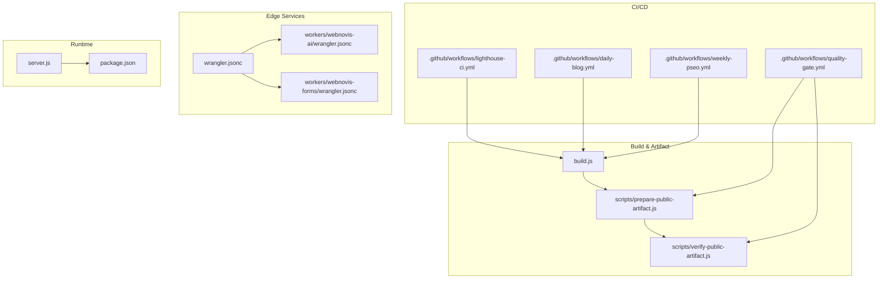
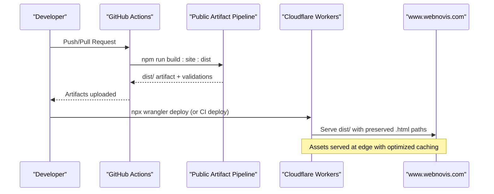
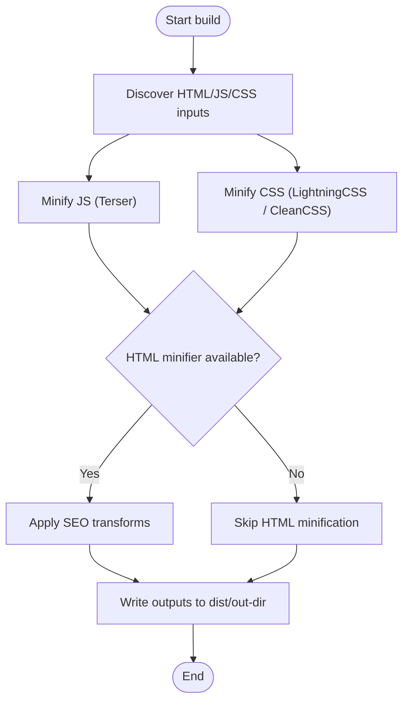
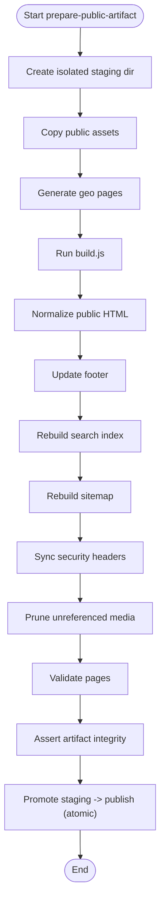
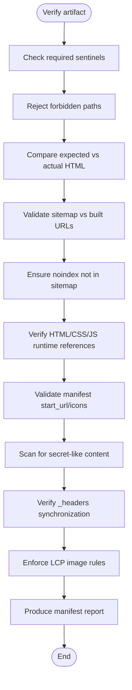
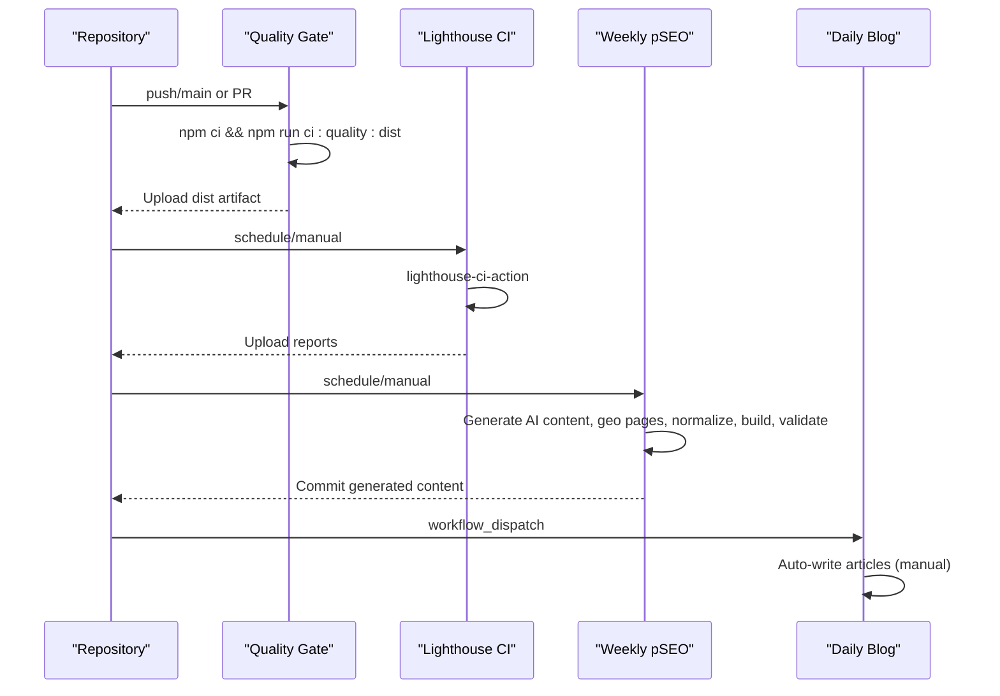
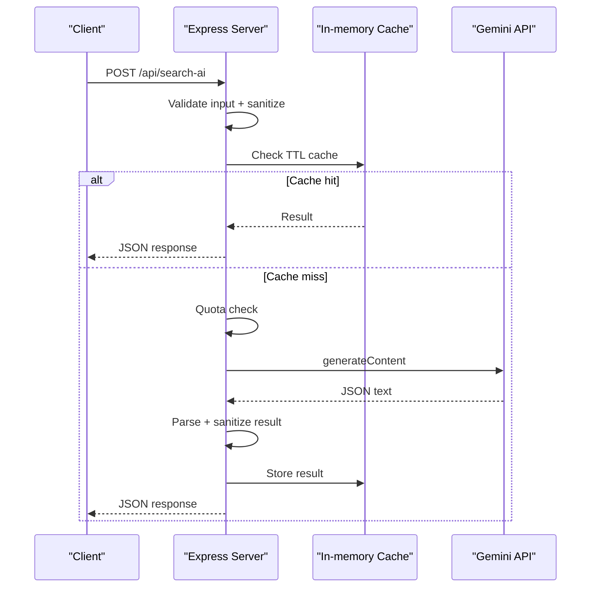
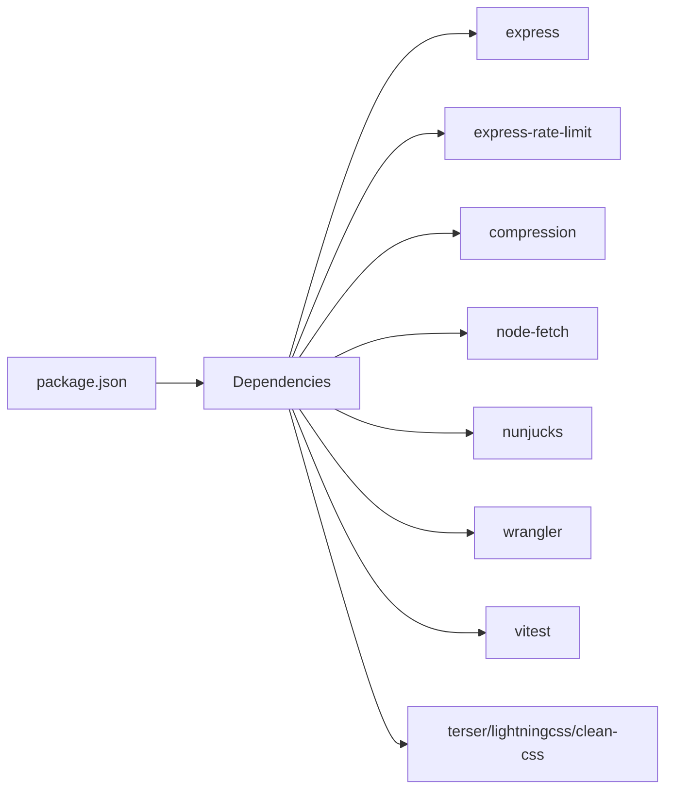

# Deployment & DevOps

<cite>
**Referenced Files in This Document**
- [package.json](file://package.json)
- [build.js](file://build.js)
- [server.js](file://server.js)
- [wrangler.jsonc](file://wrangler.jsonc)
- [.github/workflows/quality-gate.yml](file://.github/workflows/quality-gate.yml)
- [.github/workflows/lighthouse-ci.yml](file://.github/workflows/lighthouse-ci.yml)
- [.github/workflows/daily-blog.yml](file://.github/workflows/daily-blog.yml)
- [.github/workflows/weekly-pseo.yml](file://.github/workflows/weekly-pseo.yml)
- [scripts/prepare-public-artifact.js](file://scripts/prepare-public-artifact.js)
- [scripts/verify-public-artifact.js](file://scripts/verify-public-artifact.js)
- [workers/webnovis-ai/wrangler.jsonc](file://workers/webnovis-ai/wrangler.jsonc)
- [workers/webnovis-forms/wrangler.jsonc](file://workers/webnovis-forms/wrangler.jsonc)
</cite>

## Table of Contents
1. Introduction
2. Project Structure
3. Core Components
4. Architecture Overview
5. Detailed Component Analysis
6. Dependency Analysis
7. Performance Considerations
8. Troubleshooting Guide
9. Conclusion
10. Appendices

## Introduction
This document provides a comprehensive guide to WebNovis deployment and DevOps practices. It covers multi-platform strategies for static hosting (GitHub Pages, Netlify, Vercel) and dynamic hosting (Cloudflare Workers, traditional Node.js), CI/CD automation with GitHub Actions, Cloudflare Workers configuration, environment and secrets management, monitoring and logging, error tracking, production maintenance, scaling, backups, disaster recovery, environment drift prevention, and rollback procedures. Concrete examples reference actual repository files and workflows.

## Project Structure
The project is organized around:
- Static site build pipeline and asset optimization
- Public artifact preparation and validation
- CI/CD workflows for quality gates, performance checks, content generation, and SEO automation
- Cloudflare Workers for edge services (AI chat and forms)
- A Node.js server for dynamic endpoints and legacy/static serving when needed



**Diagram sources**
- [build.js:1-502](file://build.js#L1-L502)
- [scripts/prepare-public-artifact.js:1-280](file://scripts/prepare-public-artifact.js#L1-L280)
- [scripts/verify-public-artifact.js:1-426](file://scripts/verify-public-artifact.js#L1-L426)
- [.github/workflows/quality-gate.yml:1-47](file://.github/workflows/quality-gate.yml#L1-L47)
- [.github/workflows/lighthouse-ci.yml:1-27](file://.github/workflows/lighthouse-ci.yml#L1-L27)
- [.github/workflows/daily-blog.yml:1-56](file://.github/workflows/daily-blog.yml#L1-L56)
- [.github/workflows/weekly-pseo.yml:1-120](file://.github/workflows/weekly-pseo.yml#L1-L120)
- [wrangler.jsonc:1-30](file://wrangler.jsonc#L1-L30)
- [workers/webnovis-ai/wrangler.jsonc:1-26](file://workers/webnovis-ai/wrangler.jsonc#L1-L26)
- [workers/webnovis-forms/wrangler.jsonc:1-20](file://workers/webnovis-forms/wrangler.jsonc#L1-L20)
- [server.js:1-800](file://server.js#L1-L800)
- [package.json:1-92](file://package.json#L1-L92)

**Section sources**
- [package.json:1-92](file://package.json#L1-L92)
- [build.js:1-502](file://build.js#L1-L502)
- [scripts/prepare-public-artifact.js:1-280](file://scripts/prepare-public-artifact.js#L1-L280)
- [scripts/verify-public-artifact.js:1-426](file://scripts/verify-public-artifact.js#L1-L426)
- [.github/workflows/quality-gate.yml:1-47](file://.github/workflows/quality-gate.yml#L1-L47)
- [.github/workflows/lighthouse-ci.yml:1-27](file://.github/workflows/lighthouse-ci.yml#L1-L27)
- [.github/workflows/daily-blog.yml:1-56](file://.github/workflows/daily-blog.yml#L1-L56)
- [.github/workflows/weekly-pseo.yml:1-120](file://.github/workflows/weekly-pseo.yml#L1-L120)
- [wrangler.jsonc:1-30](file://wrangler.jsonc#L1-L30)
- [workers/webnovis-ai/wrangler.jsonc:1-26](file://workers/webnovis-ai/wrangler.jsonc#L1-L26)
- [workers/webnovis-forms/wrangler.jsonc:1-20](file://workers/webnovis-forms/wrangler.jsonc#L1-L20)
- [server.js:1-800](file://server.js#L1-L800)

## Core Components
- Build system: Asset discovery, JS minification (Terser), CSS minification (LightningCSS with CleanCSS fallback), HTML minification, and output to dist.
- Public artifact pipeline: Materializes only public assets, runs generators, normalizes HTML, builds search index/sitemap, validates pages, prunes unreferenced media, and promotes an immutable artifact.
- Quality gate CI: Installs dependencies, runs the full dist build, validates the artifact, uploads sanitized dist, and verifies production headers on non-PR pushes.
- Lighthouse CI: Runs performance audits weekly and on demand, uploads reports as artifacts.
- Content automation: Weekly pSEO generator and daily blog writer (manual trigger by default).
- Edge services: Cloudflare Workers for AI chat and form submissions with KV and secrets.
- Dynamic runtime: Node.js Express server with security headers, rate limiting, compression, bot logging, and API endpoints.

**Section sources**
- [build.js:1-502](file://build.js#L1-L502)
- [scripts/prepare-public-artifact.js:1-280](file://scripts/prepare-public-artifact.js#L1-L280)
- [scripts/verify-public-artifact.js:1-426](file://scripts/verify-public-artifact.js#L1-L426)
- [.github/workflows/quality-gate.yml:1-47](file://.github/workflows/quality-gate.yml#L1-L47)
- [.github/workflows/lighthouse-ci.yml:1-27](file://.github/workflows/lighthouse-ci.yml#L1-L27)
- [.github/workflows/weekly-pseo.yml:1-120](file://.github/workflows/weekly-pseo.yml#L1-L120)
- [.github/workflows/daily-blog.yml:1-56](file://.github/workflows/daily-blog.yml#L1-L56)
- [wrangler.jsonc:1-30](file://wrangler.jsonc#L1-L30)
- [workers/webnovis-ai/wrangler.jsonc:1-26](file://workers/webnovis-ai/wrangler.jsonc#L1-L26)
- [workers/webnovis-forms/wrangler.jsonc:1-20](file://workers/webnovis-forms/wrangler.jsonc#L1-L20)
- [server.js:1-800](file://server.js#L1-L800)
- [package.json:1-92](file://package.json#L1-L92)

## Architecture Overview
The deployment architecture supports both static and dynamic targets:
- Static hosting: GitHub Pages, Netlify, Vercel can consume the prepared dist artifact produced by the public artifact pipeline.
- Dynamic hosting: Cloudflare Workers serve static assets from dist with html_handling set to none to preserve .html URLs; Node.js server serves dynamic APIs and legacy static routes.



**Diagram sources**
- [.github/workflows/quality-gate.yml:1-47](file://.github/workflows/quality-gate.yml#L1-L47)
- [scripts/prepare-public-artifact.js:1-280](file://scripts/prepare-public-artifact.js#L1-L280)
- [wrangler.jsonc:1-30](file://wrangler.jsonc#L1-L30)

**Section sources**
- [wrangler.jsonc:1-30](file://wrangler.jsonc#L1-L30)
- [.github/workflows/quality-gate.yml:1-47](file://.github/workflows/quality-gate.yml#L1-L47)
- [scripts/prepare-public-artifact.js:1-280](file://scripts/prepare-public-artifact.js#L1-L280)

## Detailed Component Analysis

### Static Build Pipeline (build.js)
- Discovers HTML, JS, and CSS inputs across configured roots.
- Minifies JS via Terser with safe defaults and per-file overrides.
- Minifies CSS via LightningCSS with CleanCSS fallback for compatibility.
- Optionally minifies source HTML from src/html and applies SEO transforms.
- Outputs to dist or custom out-dir, reporting size savings and errors.



**Diagram sources**
- [build.js:1-502](file://build.js#L1-L502)

**Section sources**
- [build.js:1-502](file://build.js#L1-L502)

### Public Artifact Preparation (scripts/prepare-public-artifact.js)
- Copies only public assets (blog/portfolio HTML, Img, fonts, technical files).
- Generates geo pages, builds assets, normalizes HTML, updates footer, rebuilds search index and sitemap, syncs security headers, validates pages, and prunes unreferenced media.
- Promotes staging to publish atomically with backup and rollback on failure.



**Diagram sources**
- [scripts/prepare-public-artifact.js:1-280](file://scripts/prepare-public-artifact.js#L1-L280)

**Section sources**
- [scripts/prepare-public-artifact.js:1-280](file://scripts/prepare-public-artifact.js#L1-L280)

### Public Artifact Verification (scripts/verify-public-artifact.js)
- Validates sentinels, forbids sensitive paths, checks expected vs actual HTML, ensures sitemap consistency, detects noindex in sitemap, verifies runtime closure (HTML/CSS/JS), checks manifest references, scans for secret-like content, synchronizes _headers, and enforces LCP image rules.



**Diagram sources**
- [scripts/verify-public-artifact.js:1-426](file://scripts/verify-public-artifact.js#L1-L426)

**Section sources**
- [scripts/verify-public-artifact.js:1-426](file://scripts/verify-public-artifact.js#L1-L426)

### CI/CD Pipelines (GitHub Actions)
- Quality Gate: Builds dist, validates artifact, uploads sanitized dist, and verifies production headers on non-PR pushes.
- Lighthouse CI: Runs performance audits weekly and on demand, uploads reports.
- Weekly pSEO Generator: Regenerates AI content blocks, geo pages, normalizes HTML, rebuilds indexes/sitemaps, validates, monitors SEO, submits to IndexNow, and commits changes.
- Daily Blog Writer: Manual-triggered article generation with reduced defaults to mitigate scaled content abuse risks.



**Diagram sources**
- [.github/workflows/quality-gate.yml:1-47](file://.github/workflows/quality-gate.yml#L1-L47)
- [.github/workflows/lighthouse-ci.yml:1-27](file://.github/workflows/lighthouse-ci.yml#L1-L27)
- [.github/workflows/weekly-pseo.yml:1-120](file://.github/workflows/weekly-pseo.yml#L1-L120)
- [.github/workflows/daily-blog.yml:1-56](file://.github/workflows/daily-blog.yml#L1-L56)

**Section sources**
- [.github/workflows/quality-gate.yml:1-47](file://.github/workflows/quality-gate.yml#L1-L47)
- [.github/workflows/lighthouse-ci.yml:1-27](file://.github/workflows/lighthouse-ci.yml#L1-L27)
- [.github/workflows/weekly-pseo.yml:1-120](file://.github/workflows/weekly-pseo.yml#L1-L120)
- [.github/workflows/daily-blog.yml:1-56](file://.github/workflows/daily-blog.yml#L1-L56)

### Cloudflare Workers Configuration
- Static assets Worker: Uses dist directory, sets html_handling to none to preserve .html URLs identical to GitHub Pages, and configures not_found_handling for 404 page.
- AI Worker: Configured with nodejs_compat, observability enabled, vars for service name/environment, and KV namespace binding for sessions/rate-limit/search cache/leads.
- Forms Worker: Configured with Turnstile hostnames and Web3Forms endpoint; secrets managed via wrangler secret put.

```mermaid
classDiagram
class StaticWorker {
+name : "webnovis"
+assets.directory : "dist"
+assets.html_handling : "none"
+assets.not_found_handling : "404-page"
}
class AIWorker {
+name : "webnovis-ai"
+main : "src/index.js"
+compatibility_flags : ["nodejs_compat"]
+vars : {"SERVICE_NAME","ENVIRONMENT"}
+kv_namespaces : ["SESSIONS"]
}
class FormsWorker {
+name : "webnovis-forms"
+main : "src/index.js"
+vars : {"TURNSTILE_HOSTNAMES","WEB3FORMS_ENDPOINT"}
+secrets : ["TURNSTILE_SECRET","WEB3FORMS_ACCESS_KEY"]
}
StaticWorker <.. AIWorker : "same deployment model"
StaticWorker <.. FormsWorker : "same deployment model"
```

**Diagram sources**
- [wrangler.jsonc:1-30](file://wrangler.jsonc#L1-L30)
- [workers/webnovis-ai/wrangler.jsonc:1-26](file://workers/webnovis-ai/wrangler.jsonc#L1-L26)
- [workers/webnovis-forms/wrangler.jsonc:1-20](file://workers/webnovis-forms/wrangler.jsonc#L1-L20)

**Section sources**
- [wrangler.jsonc:1-30](file://wrangler.jsonc#L1-L30)
- [workers/webnovis-ai/wrangler.jsonc:1-26](file://workers/webnovis-ai/wrangler.jsonc#L1-L26)
- [workers/webnovis-forms/wrangler.jsonc:1-20](file://workers/webnovis-forms/wrangler.jsonc#L1-L20)

### Node.js Server (Dynamic Hosting)
- Express-based server with CORS, compression, rate limiting, security headers, canonical redirects, trailing slash normalization, UTM stripping, bot detection logging, and static file serving for core/public pages.
- API endpoints include search AI with Gemini integration, session management, quota monitoring, and injection guardrails.



**Diagram sources**
- [server.js:1-800](file://server.js#L1-L800)

**Section sources**
- [server.js:1-800](file://server.js#L1-L800)

## Dependency Analysis
Key runtime and dev dependencies:
- Runtime: express, cors, compression, dotenv, node-fetch, nunjucks, express-rate-limit
- Dev: vitest, wrangler, terser, lightningcss, clean-css, html-minifier-terser, sharp, knip

Scripts orchestrate build, validation, and deployment flows. Wrangler CLI integrates with Cloudflare Workers for edge deployments.



**Diagram sources**
- [package.json:1-92](file://package.json#L1-L92)

**Section sources**
- [package.json:1-92](file://package.json#L1-L92)

## Performance Considerations
- Asset minification: JS via Terser, CSS via LightningCSS with CleanCSS fallback, optional HTML minification.
- Caching: Long-lived immutable caching for stable assets; short TTL with stale-while-revalidate for HTML.
- Compression: Brotli/Gzip enabled where available.
- Edge delivery: Cloudflare Workers serve dist assets close to users with optimized caching.
- Search AI: In-memory cache with TTL and deduplication reduces API calls and latency.
- Lighthouse CI: Regular performance audits ensure continuous optimization.

[No sources needed since this section provides general guidance]

## Troubleshooting Guide
Common issues and resolutions:
- Build failures: Inspect build logs for JS/CSS minification errors; verify inputs exist and are valid.
- Missing public assets: Ensure prepare-public-artifact copies required directories and that prune step does not remove referenced files.
- Header mismatches: Verify _headers synchronized with security headers configuration; ensure frame-ancestors aligns with CSP.
- Secrets exposure: verify-public-artifact scans for secret-like content; remove any leaked keys.
- Workers deployment: Use dry-run before deploy; confirm KV namespaces and secrets are set; check compatibility flags.
- Rate limiting: Confirm express-rate-limit installed in production; adjust limits if necessary.

**Section sources**
- [scripts/verify-public-artifact.js:1-426](file://scripts/verify-public-artifact.js#L1-L426)
- [wrangler.jsonc:1-30](file://wrangler.jsonc#L1-L30)
- [workers/webnovis-ai/wrangler.jsonc:1-26](file://workers/webnovis-ai/wrangler.jsonc#L1-L26)
- [workers/webnovis-forms/wrangler.jsonc:1-20](file://workers/webnovis-forms/wrangler.jsonc#L1-L20)
- [server.js:1-800](file://server.js#L1-L800)

## Conclusion
WebNovis employs a robust, auditable build and deployment pipeline that produces a sanitized, validated public artifact suitable for static hosting platforms and Cloudflare Workers. CI/CD enforces quality, performance, and security standards. Edge services leverage Cloudflare Workers for low-latency responses, while the Node.js server provides dynamic capabilities. The combination of strict artifact verification, automated SEO/content generation, and comprehensive monitoring ensures reliable, scalable, and maintainable production operations.

[No sources needed since this section summarizes without analyzing specific files]

## Appendices

### Multi-Platform Deployment Strategy
- Static hosting (GitHub Pages, Netlify, Vercel): Deploy the prepared dist artifact produced by scripts/prepare-public-artifact.js. Ensure platform settings match routing expectations (e.g., preserve .html URLs).
- Dynamic hosting (Cloudflare Workers): Use wrangler.jsonc to serve dist with html_handling set to none, preserving .html paths identical to GitHub Pages. Configure KV and secrets appropriately.
- Traditional Node.js hosting: Run server.js with environment variables for API keys, admin secrets, and port configuration.

**Section sources**
- [scripts/prepare-public-artifact.js:1-280](file://scripts/prepare-public-artifact.js#L1-L280)
- [wrangler.jsonc:1-30](file://wrangler.jsonc#L1-L30)
- [server.js:1-800](file://server.js#L1-L800)
- [package.json:1-92](file://package.json#L1-L92)

### Environment Management and Secrets
- Use environment variables for API keys, admin secrets, and configuration.
- For Cloudflare Workers, manage secrets via wrangler secret put; never commit secrets.
- Ensure NODE_ENV, PORT, and other runtime variables are correctly set per environment.

**Section sources**
- [workers/webnovis-forms/wrangler.jsonc:1-20](file://workers/webnovis-forms/wrangler.jsonc#L1-L20)
- [server.js:1-800](file://server.js#L1-L800)

### Monitoring and Logging
- Bot access logging: server.js logs bot crawls to a rotating log file.
- Observability: Cloudflare Workers enable observability with head sampling.
- Lighthouse reports: Uploaded as CI artifacts for performance tracking.

**Section sources**
- [server.js:1-800](file://server.js#L1-L800)
- [workers/webnovis-ai/wrangler.jsonc:1-26](file://workers/webnovis-ai/wrangler.jsonc#L1-L26)
- [.github/workflows/lighthouse-ci.yml:1-27](file://.github/workflows/lighthouse-ci.yml#L1-L27)

### Scaling Considerations
- Stateless design: Workers and Node.js server scale horizontally; use KV for shared state where needed.
- Rate limiting: Protect APIs against abuse; tune limits based on traffic patterns.
- Caching: Leverage CDN and in-memory caches to reduce backend load.

**Section sources**
- [server.js:1-800](file://server.js#L1-L800)
- [workers/webnovis-ai/wrangler.jsonc:1-26](file://workers/webnovis-ai/wrangler.jsonc#L1-L26)

### Backup and Disaster Recovery
- Artifact promotion includes atomic swap with previous version backup; retain backups for quick rollback.
- CI artifacts: Keep dist and Lighthouse reports as recoverable snapshots.
- Data: Back up KV namespaces and any persistent data used by Workers.

**Section sources**
- [scripts/prepare-public-artifact.js:1-280](file://scripts/prepare-public-artifact.js#L1-L280)
- [.github/workflows/quality-gate.yml:1-47](file://.github/workflows/quality-gate.yml#L1-L47)

### Rollback Procedures
- Static sites: Redeploy previous dist artifact from CI artifacts.
- Workers: Re-deploy previous worker version using wrangler; ensure KV state compatibility.
- Node.js: Restart previous container/image with known-good environment variables.

**Section sources**
- [.github/workflows/quality-gate.yml:1-47](file://.github/workflows/quality-gate.yml#L1-L47)
- [wrangler.jsonc:1-30](file://wrangler.jsonc#L1-L30)