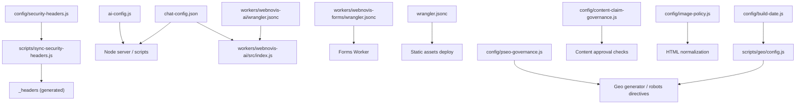
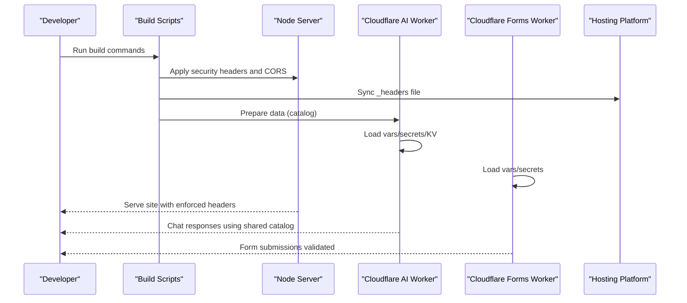
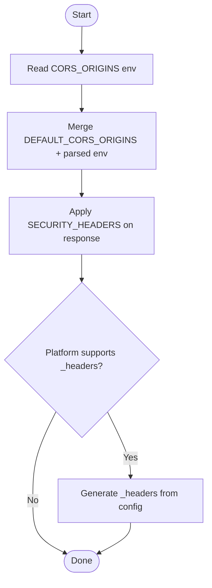
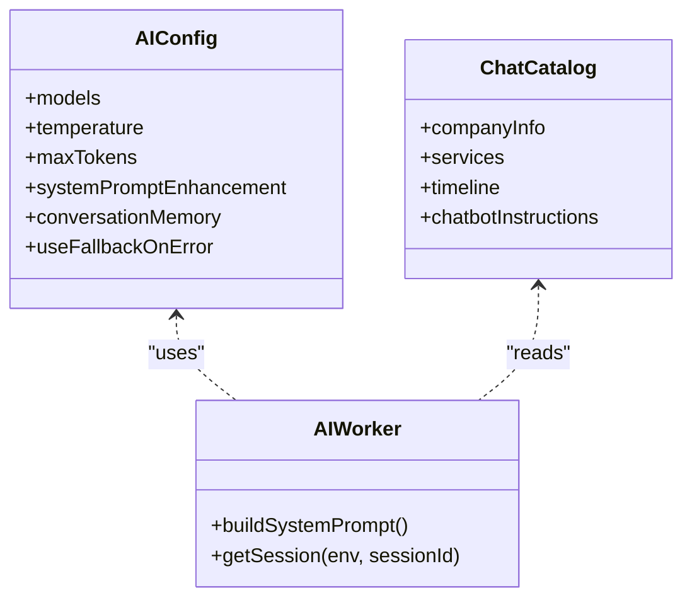
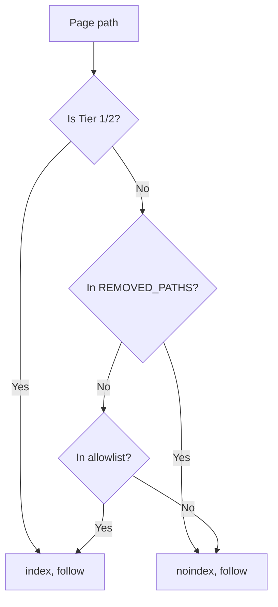
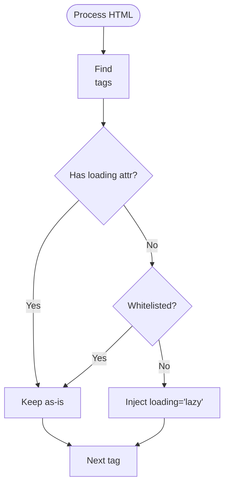
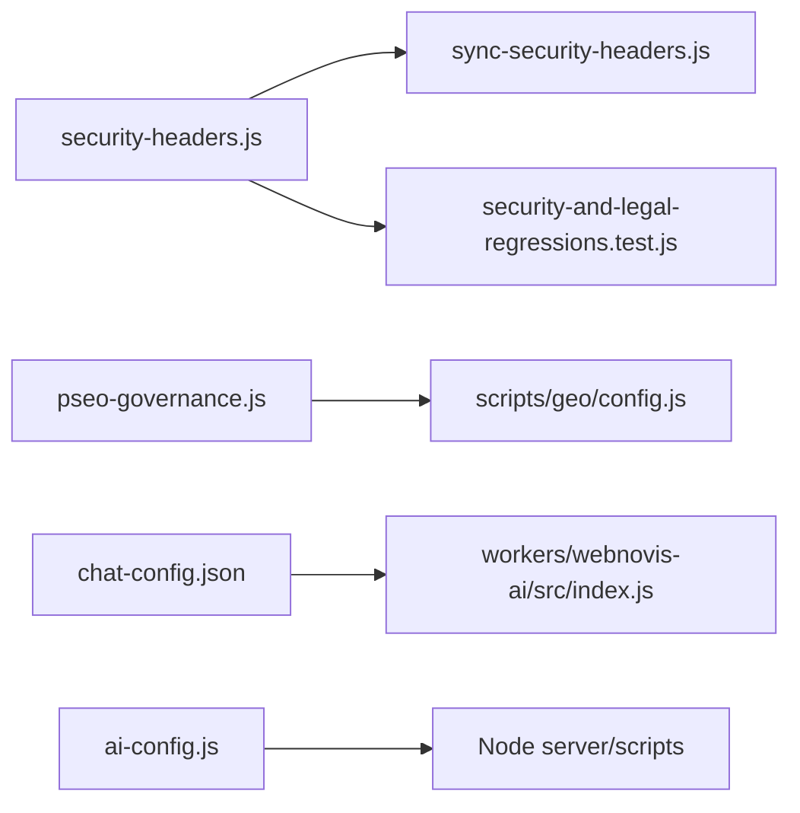

# Environment Management & Configuration

<cite>
**Referenced Files in This Document**
- [config/security-headers.js](file://config/security-headers.js)
- [scripts/sync-security-headers.js](file://scripts/sync-security-headers.js)
- [ai-config.js](file://ai-config.js)
- [chat-config.json](file://chat-config.json)
- [workers/webnovis-ai/wrangler.jsonc](file://workers/webnovis-ai/wrangler.jsonc)
- [workers/webnovis-forms/wrangler.jsonc](file://workers/webnovis-forms/wrangler.jsonc)
- [wrangler.jsonc](file://wrangler.jsonc)
- [config/pseo-governance.js](file://config/pseo-governance.js)
- [config/content-claim-governance.js](file://config/content-claim-governance.js)
- [config/image-policy.js](file://config/image-policy.js)
- [scripts/geo/config.js](file://scripts/geo/config.js)
- [config/build-date.js](file://config/build-date.js)
- [package.json](file://package.json)
- [tests/security-and-legal-regressions.test.js](file://tests/security-and-legal-regressions.test.js)
</cite>

## Table of Contents
1. Introduction
2. Project Structure
3. Core Components
4. Architecture Overview
5. Detailed Component Analysis
6. Dependency Analysis
7. Performance Considerations
8. Troubleshooting Guide
9. Conclusion

## Introduction
This document explains how WebNovis manages environment configuration, feature flags, and governance policies across the site build pipeline, runtime server, and Cloudflare Workers. It covers security headers, AI model settings, content governance, image loading policy, and environment-specific behaviors for development, staging, and production. It also provides best practices for secret management, configuration validation, drift prevention, version control strategies, and migration procedures.

## Project Structure
Configuration is centralized in dedicated modules under config/ and per-environment/runtime files:
- Security headers and CORS are defined centrally and synced to static headers for hosting platforms.
- AI models and chat behavior are configured via a shared JS module and a JSON catalog consumed by both Node server and Cloudflare Worker.
- Governance policies enforce indexation rules and claim compliance.
- Image loading policy optimizes performance with lazy loading defaults and whitelists.
- Build-time constants (dates, paths, CLI flags) are resolved from environment variables and CLI arguments.
- Cloudflare Workers declare runtime variables, secrets, and KV namespaces.

**Diagram sources**
- [config/security-headers.js:1-113](file://config/security-headers.js#L1-L113)
- [scripts/sync-security-headers.js:1-18](file://scripts/sync-security-headers.js#L1-L18)
- [ai-config.js:1-38](file://ai-config.js#L1-L38)
- [chat-config.json:1-109](file://chat-config.json#L1-L109)
- [workers/webnovis-ai/wrangler.jsonc:1-26](file://workers/webnovis-ai/wrangler.jsonc#L1-L26)
- [workers/webnovis-forms/wrangler.jsonc:1-20](file://workers/webnovis-forms/wrangler.jsonc#L1-L20)
- [wrangler.jsonc:1-30](file://wrangler.jsonc#L1-L30)
- [config/pseo-governance.js:1-311](file://config/pseo-governance.js#L1-L311)
- [config/content-claim-governance.js:1-240](file://config/content-claim-governance.js#L1-L240)
- [config/image-policy.js:1-58](file://config/image-policy.js#L1-L58)
- [scripts/geo/config.js:1-114](file://scripts/geo/config.js#L1-L114)
- [config/build-date.js:1-40](file://config/build-date.js#L1-L40)

**Section sources**
- [config/security-headers.js:1-113](file://config/security-headers.js#L1-L113)
- [scripts/sync-security-headers.js:1-18](file://scripts/sync-security-headers.js#L1-L18)
- [ai-config.js:1-38](file://ai-config.js#L1-L38)
- [chat-config.json:1-109](file://chat-config.json#L1-L109)
- [workers/webnovis-ai/wrangler.jsonc:1-26](file://workers/webnovis-ai/wrangler.jsonc#L1-L26)
- [workers/webnovis-forms/wrangler.jsonc:1-20](file://workers/webnovis-forms/wrangler.jsonc#L1-L20)
- [wrangler.jsonc:1-30](file://wrangler.jsonc#L1-L30)
- [config/pseo-governance.js:1-311](file://config/pseo-governance.js#L1-L311)
- [config/content-claim-governance.js:1-240](file://config/content-claim-governance.js#L1-L240)
- [config/image-policy.js:1-58](file://config/image-policy.js#L1-L58)
- [scripts/geo/config.js:1-114](file://scripts/geo/config.js#L1-L114)
- [config/build-date.js:1-40](file://config/build-date.js#L1-L40)

## Core Components
- Security headers and CORS: Centralized in a single module; includes CSP, HSTS, referrer policy, permissions policy, and dynamic CORS origin merging from environment.
- AI model settings: Shared model names, parameters, fallback behavior, and API key separation strategy.
- Chat catalog: Company info, services/pricing, and strict chatbot instructions used by both server and worker.
- Governance: Indexation allowlists and de-amplification logic; content claim validation and block preservation.
- Image policy: Automatic lazy-loading injection with whitelisted exceptions for critical images.
- Build-time configuration: Deterministic dates and time zones; CLI-driven geo generation targets.
- Workers configuration: Runtime variables, secrets, and KV bindings for sessions and rate limiting.

**Section sources**
- [config/security-headers.js:1-113](file://config/security-headers.js#L1-L113)
- [ai-config.js:1-38](file://ai-config.js#L1-L38)
- [chat-config.json:1-109](file://chat-config.json#L1-L109)
- [config/pseo-governance.js:1-311](file://config/pseo-governance.js#L1-L311)
- [config/content-claim-governance.js:1-240](file://config/content-claim-governance.js#L1-L240)
- [config/image-policy.js:1-58](file://config/image-policy.js#L1-L58)
- [scripts/geo/config.js:1-114](file://scripts/geo/config.js#L1-L114)
- [config/build-date.js:1-40](file://config/build-date.js#L1-L40)
- [workers/webnovis-ai/wrangler.jsonc:1-26](file://workers/webnovis-ai/wrangler.jsonc#L1-L26)
- [workers/webnovis-forms/wrangler.jsonc:1-20](file://workers/webnovis-forms/wrangler.jsonc#L1-L20)

## Architecture Overview
The system separates configuration into three layers:
- Static configuration files (JSON/JS) define business rules and defaults.
- Environment variables and secrets configure runtime behavior and credentials.
- Build/deploy tooling generates artifacts and enforces consistency.

**Diagram sources**
- [config/security-headers.js:1-113](file://config/security-headers.js#L1-L113)
- [scripts/sync-security-headers.js:1-18](file://scripts/sync-security-headers.js#L1-L18)
- [chat-config.json:1-109](file://chat-config.json#L1-L109)
- [workers/webnovis-ai/wrangler.jsonc:1-26](file://workers/webnovis-ai/wrangler.jsonc#L1-L26)
- [workers/webnovis-forms/wrangler.jsonc:1-20](file://workers/webnovis-forms/wrangler.jsonc#L1-L20)

## Detailed Component Analysis

### Security Headers and CORS
- Centralized header definitions include HSTS, nosniff, frame options, CSP, referrer policy, and permissions policy.
- CSP directives whitelist required third-party domains and use upgrade-insecure-requests.
- Dynamic CSP with nonce helper exists for future script execution hardening when inline scripts are injected with matching nonces.
- CORS origins merge default list with environment-provided comma-separated values.
- A sync script writes a static _headers file for platforms that support it, ensuring parity between runtime and platform headers.

**Diagram sources**
- [config/security-headers.js:1-113](file://config/security-headers.js#L1-L113)
- [scripts/sync-security-headers.js:1-18](file://scripts/sync-security-headers.js#L1-L18)

**Section sources**
- [config/security-headers.js:1-113](file://config/security-headers.js#L1-L113)
- [scripts/sync-security-headers.js:1-18](file://scripts/sync-security-headers.js#L1-L18)
- [tests/security-and-legal-regressions.test.js:13-39](file://tests/security-and-legal-regressions.test.js#L13-L39)

### AI Model Settings and Chat Catalog
- ai-config.js defines model names, temperature, max tokens, memory window, fallback behavior, and API key separation strategy.
- chat-config.json contains company info, service catalog, pricing, timelines, and strict chatbot instructions.
- The Node server builds a system prompt from the chat catalog; the Cloudflare AI Worker reads the same catalog and constructs prompts consistently.
- The AI Worker uses KV for session storage and exposes observability flags.

**Diagram sources**
- [ai-config.js:1-38](file://ai-config.js#L1-L38)
- [chat-config.json:1-109](file://chat-config.json#L1-L109)
- [workers/webnovis-ai/wrangler.jsonc:1-26](file://workers/webnovis-ai/wrangler.jsonc#L1-L26)

**Section sources**
- [ai-config.js:1-38](file://ai-config.js#L1-L38)
- [chat-config.json:1-109](file://chat-config.json#L1-L109)
- [workers/webnovis-ai/wrangler.jsonc:1-26](file://workers/webnovis-ai/wrangler.jsonc#L1-L26)

### Governance Policies (Indexation and Claims)
- pSEO governance defines tiered indexable GEO pages, removed paths, and helpers to compute robots directives and sitemap inclusion.
- Content claim governance validates approved provenance, strips unapproved Tier 1 editorial blocks, and detects unsupported claims in generated or published text.
- Geo generator re-exports governance helpers to compute robots directives and page tiers during build.

**Diagram sources**
- [config/pseo-governance.js:1-311](file://config/pseo-governance.js#L1-L311)
- [scripts/geo/config.js:1-114](file://scripts/geo/config.js#L1-L114)

**Section sources**
- [config/pseo-governance.js:1-311](file://config/pseo-governance.js#L1-L311)
- [config/content-claim-governance.js:1-240](file://config/content-claim-governance.js#L1-L240)
- [scripts/geo/config.js:1-114](file://scripts/geo/config.js#L1-L114)

### Image Loading Policy
- Automatically injects loading="lazy" on images unless they match whitelisted criteria (logo, hero, featured, LCP).
- Uses attribute extraction and keyword matching to decide exceptions.

**Diagram sources**
- [config/image-policy.js:1-58](file://config/image-policy.js#L1-L58)

**Section sources**
- [config/image-policy.js:1-58](file://config/image-policy.js#L1-L58)

### Build-Time Configuration and Dates
- Build instant resolution prioritizes SOURCE_DATE_EPOCH, then BUILD_DATE, falling back to current time.
- Rome calendar date formatting ensures consistent localized date strings for content.
- Geo generator CLI flags enable dry-run, validate-only, targeted city/service generation, and output/report directories.

**Section sources**
- [config/build-date.js:1-40](file://config/build-date.js#L1-L40)
- [scripts/geo/config.js:1-114](file://scripts/geo/config.js#L1-L114)

### Workers Configuration and Secrets
- AI Worker declares compatibility flags, observability, vars, and KV namespace binding for sessions.
- Forms Worker declares vars for Turnstile hostnames and endpoint; secrets are managed via wrangler secret commands and not committed.
- Site assets deployment uses wrangler.jsonc with html_handling set to none to preserve .html URLs.

**Section sources**
- [workers/webnovis-ai/wrangler.jsonc:1-26](file://workers/webnovis-ai/wrangler.jsonc#L1-L26)
- [workers/webnovis-forms/wrangler.jsonc:1-20](file://workers/webnovis-forms/wrangler.jsonc#L1-L20)
- [wrangler.jsonc:1-30](file://wrangler.jsonc#L1-L30)

## Dependency Analysis
- Security headers module is imported by tests to assert server usage and by sync script to generate static headers.
- Geo generator depends on pSEO governance to compute robots directives and page tiers.
- AI Worker depends on chat-config.json and AI config to build prompts and manage sessions.
- Build scripts orchestrate artifact preparation and deployment via package.json commands.

**Diagram sources**
- [config/security-headers.js:1-113](file://config/security-headers.js#L1-L113)
- [scripts/sync-security-headers.js:1-18](file://scripts/sync-security-headers.js#L1-L18)
- [tests/security-and-legal-regressions.test.js:13-39](file://tests/security-and-legal-regressions.test.js#L13-L39)
- [config/pseo-governance.js:1-311](file://config/pseo-governance.js#L1-L311)
- [scripts/geo/config.js:1-114](file://scripts/geo/config.js#L1-L114)
- [chat-config.json:1-109](file://chat-config.json#L1-L109)
- [ai-config.js:1-38](file://ai-config.js#L1-L38)

**Section sources**
- [package.json:1-92](file://package.json#L1-L92)

## Performance Considerations
- Use lazy loading for non-critical images while preserving fast rendering for logo/hero/LCP images.
- Enforce CSP without unsafe-eval; rely on domain whitelisting and optional nonce-based inline scripts when needed.
- Cache static assets via generated _headers with appropriate max-age and stale-while-revalidate values.
- Limit conversation memory and tune temperature/maxTokens to balance quality and cost in AI interactions.

[No sources needed since this section provides general guidance]

## Troubleshooting Guide
- If CSP blocks scripts, verify third-party domains are whitelisted and consider adding nonce attributes where inline scripts are injected.
- If CORS errors occur, ensure CORS_ORIGINS includes all required origins and matches the deployed environment.
- If AI Worker fails to start, check that required secrets (e.g., TURNSTILE_SECRET) are set via wrangler secret commands and that KV namespace IDs are valid.
- If robots directives are incorrect, review pSEO allowlists and ensure page paths match expected patterns.

**Section sources**
- [config/security-headers.js:1-113](file://config/security-headers.js#L1-L113)
- [workers/webnovis-forms/wrangler.jsonc:1-20](file://workers/webnovis-forms/wrangler.jsonc#L1-L20)
- [config/pseo-governance.js:1-311](file://config/pseo-governance.js#L1-L311)

## Conclusion
WebNovis centralizes configuration to reduce drift and improve security and performance. Security headers and CORS are managed in one place and synchronized to static files. AI behavior is driven by shared catalogs and environment variables. Governance policies enforce indexation and content claims rigorously. Workers isolate runtime secrets and state. Following the recommended practices below will help maintain stability across environments and streamline migrations.

[No sources needed since this section summarizes without analyzing specific files]

## Appendices

### Environment-Specific Configuration Practices
- Development:
  - Use local environment variables for CORS and test endpoints.
  - Enable verbose logging and preview URLs in workers for debugging.
- Staging:
  - Mirror production secrets and configurations; run full regression suite before promotion.
- Production:
  - Pin compatibility dates and versions; enforce CSP strictly; ensure _headers are synced and verified.

[No sources needed since this section provides general guidance]

### Secret Management
- Store secrets using wrangler secret commands for Workers; never commit secrets to repository.
- Separate API keys per function (chat, search, writer) to dilute consumption and limit blast radius.
- Validate presence of required secrets in CI to fail early on missing configuration.

**Section sources**
- [workers/webnovis-forms/wrangler.jsonc:1-20](file://workers/webnovis-forms/wrangler.jsonc#L1-L20)
- [ai-config.js:1-38](file://ai-config.js#L1-L38)

### Configuration Validation
- Use regression tests to assert server imports shared security config and applies headers.
- Ensure .env.example documents required variables like CORS_ORIGINS.
- Run linting and type checks on configuration files; validate JSON schemas for catalogs.

**Section sources**
- [tests/security-and-legal-regressions.test.js:13-39](file://tests/security-and-legal-regressions.test.js#L13-L39)

### Configuration Drift Prevention
- Centralize all mutable configuration in config/ modules; avoid ad-hoc changes in server code.
- Sync static headers from source of truth; treat generated files as outputs only.
- Enforce pSEO allowlists through tests and reports; require approvals for new indexable paths.

**Section sources**
- [scripts/sync-security-headers.js:1-18](file://scripts/sync-security-headers.js#L1-L18)
- [config/pseo-governance.js:1-311](file://config/pseo-governance.js#L1-L311)

### Version Control Strategies
- Commit configuration files and keep generated artifacts out of version control where possible.
- Tag releases and pin compatibility dates for Workers to ensure reproducible deployments.
- Maintain changelogs for configuration changes affecting security, SEO, and AI behavior.

[No sources needed since this section provides general guidance]

### Migration Procedures
- When changing CSP or CORS, update config/security-headers.js and regenerate _headers; verify with automated tests and live checks.
- For AI model updates, modify ai-config.js and validate prompts and costs; roll back if regressions detected.
- For governance changes, update allowlists and claim rules; run governance report and regression suite before deploying.

**Section sources**
- [config/security-headers.js:1-113](file://config/security-headers.js#L1-L113)
- [ai-config.js:1-38](file://ai-config.js#L1-L38)
- [config/pseo-governance.js:1-311](file://config/pseo-governance.js#L1-L311)