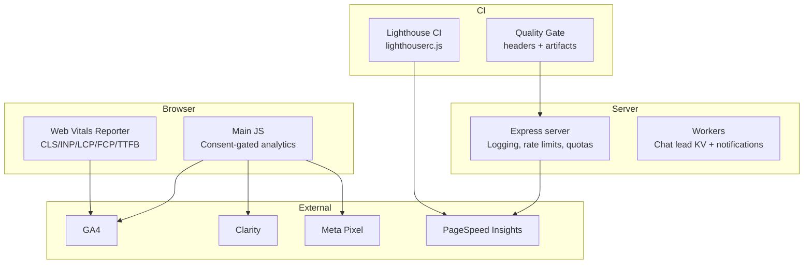
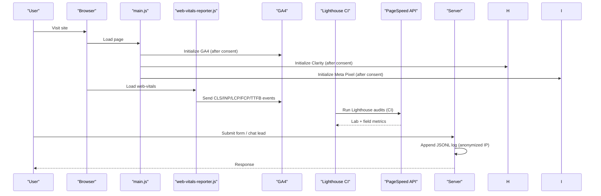
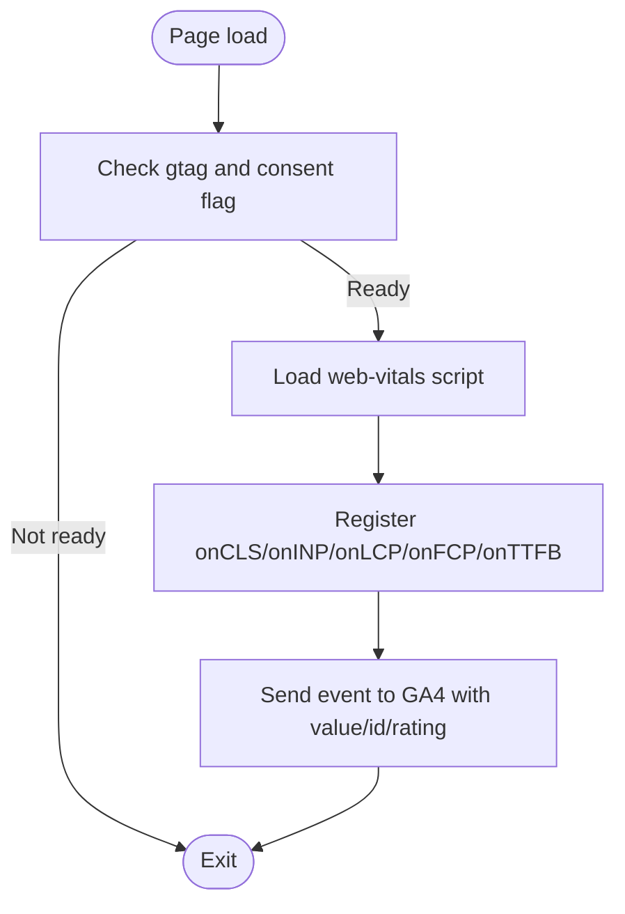
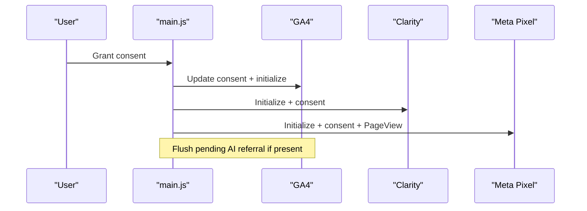
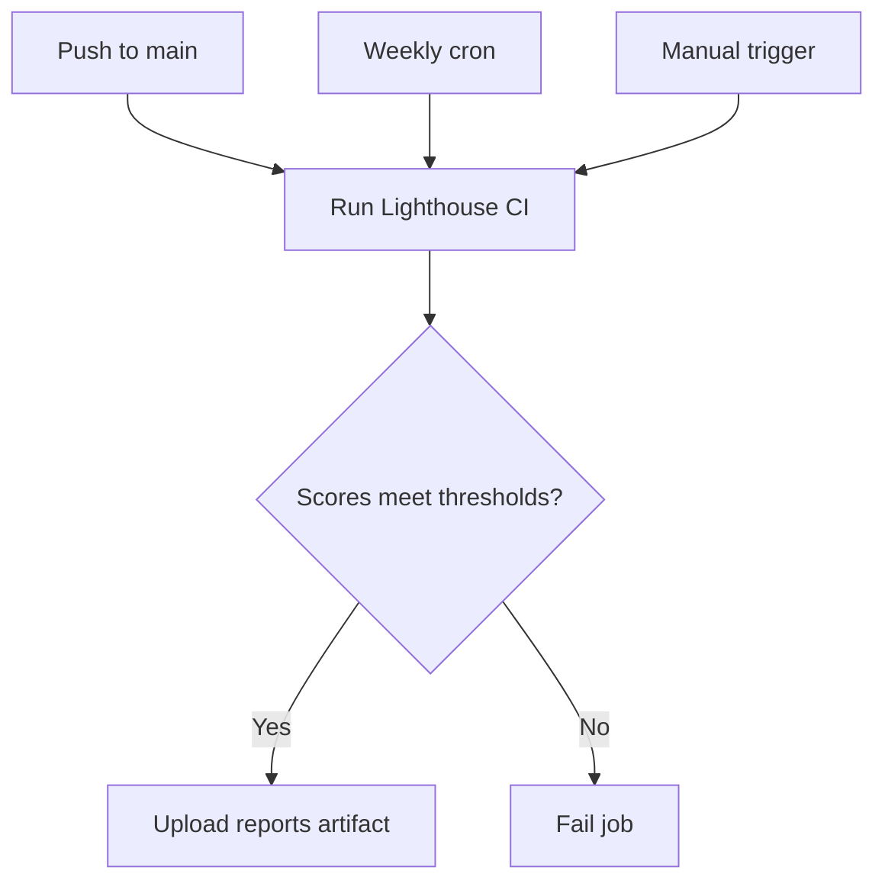
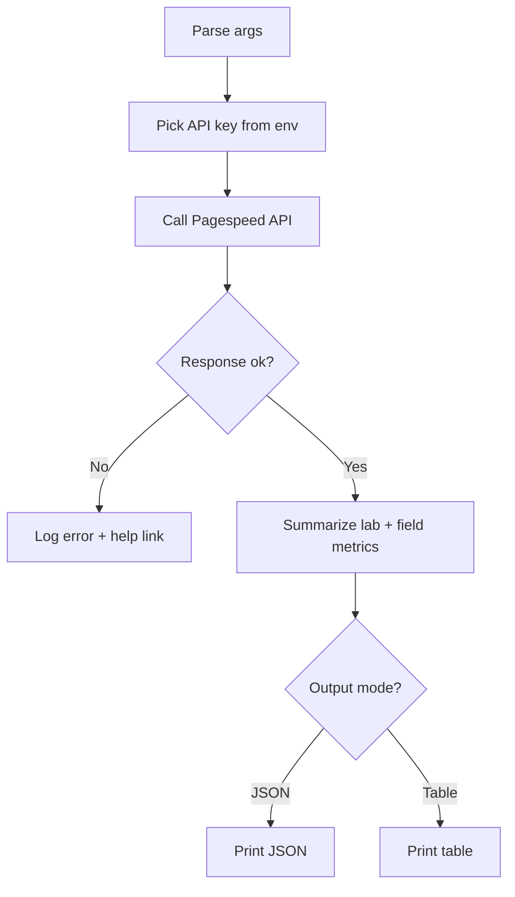
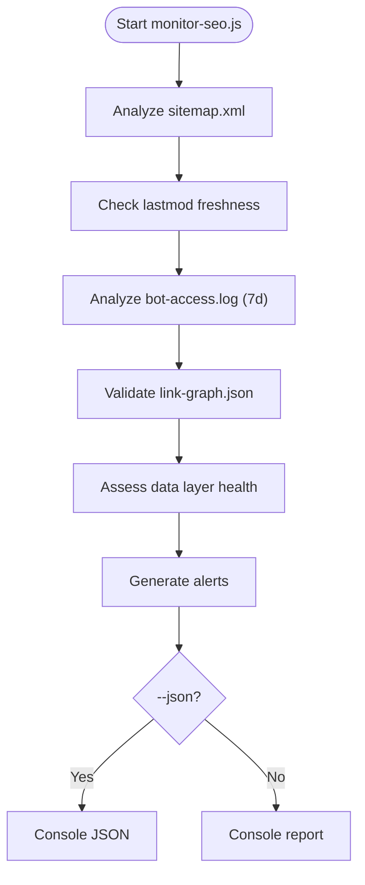
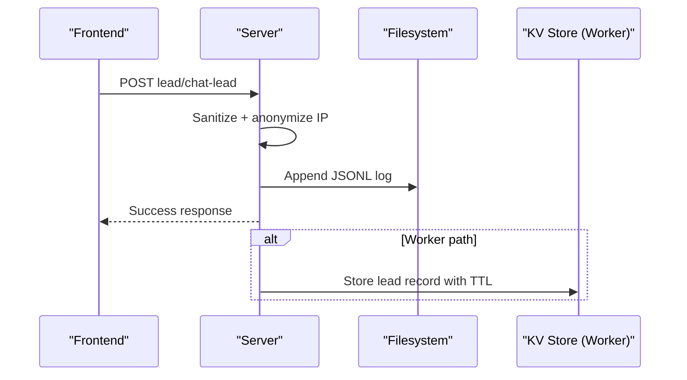
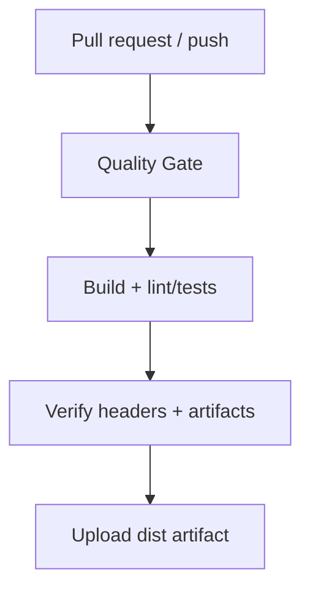
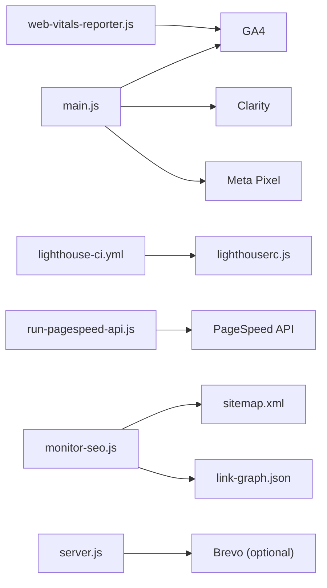

# Monitoring & Logging Strategy

<cite>
**Referenced Files in This Document**
- [web-vitals-reporter.js](file://js/web-vitals-reporter.js)
- [main.js](file://js/main.js)
- [site-config.js](file://js/site-config.js)
- [lighthouserc.js](file://lighthouserc.js)
- [lighthouse-ci.yml](file://.github/workflows/lighthouse-ci.yml)
- [run-pagespeed-api.js](file://scripts/run-pagespeed-api.js)
- [monitor-seo.js](file://scripts/monitor-seo.js)
- [server.js](file://server.js)
- [quality-gate.yml](file://.github/workflows/quality-gate.yml)
- [health.test.js](file://tests/health.test.js)
</cite>

## Table of Contents
1. Introduction
2. Project Structure
3. Core Components
4. Architecture Overview
5. Detailed Component Analysis
6. Dependency Analysis
7. Performance Considerations
8. Troubleshooting Guide
9. Conclusion

## Introduction
This document describes WebNovis monitoring and logging strategy with a focus on:
- Real User Monitoring (RUM) for Core Web Vitals to GA4
- Performance monitoring via Lighthouse CI and PageSpeed Insights
- Error tracking and operational logging on the server and workers
- SEO health monitoring and alerting
- Continuous performance checks, dashboards, and incident response procedures
- Debugging techniques and optimization guidance based on collected data

## Project Structure
Monitoring and logging span client-side scripts, server endpoints, CI workflows, and CLI tools:
- Client RUM: web-vitals reporter sends metrics to GA4 after consent
- Analytics bootstrap: main.js loads GA4, Clarity, Meta Pixel only after consent
- Site configuration: runtime config exposes non-sensitive settings
- Performance audits: Lighthouse CI runs on push/schedule; PageSpeed API script for lab/field metrics
- SEO monitoring: monitor-seo.js reports sitemap freshness, bot activity, link graph integrity
- Server logging: structured JSONL logs for leads/chat leads; rate limiting and quota monitoring
- Quality gates: GitHub Actions enforce build quality and production header verification

**Diagram sources**
- [main.js:1540-1644](file://js/main.js#L1540-L1644)
- [web-vitals-reporter.js:1-33](file://js/web-vitals-reporter.js#L1-L33)
- [lighthouserc.js:1-28](file://lighthouserc.js#L1-L28)
- [lighthouse-ci.yml:1-27](file://.github/workflows/lighthouse-ci.yml#L1-L27)
- [run-pagespeed-api.js:1-128](file://scripts/run-pagespeed-api.js#L1-L128)
- [server.js:910-942](file://server.js#L910-L942)
- [quality-gate.yml:1-47](file://.github/workflows/quality-gate.yml#L1-L47)

**Section sources**
- [web-vitals-reporter.js:1-33](file://js/web-vitals-reporter.js#L1-L33)
- [main.js:1540-1644](file://js/main.js#L1540-L1644)
- [site-config.js:1-19](file://js/site-config.js#L1-L19)
- [lighthouserc.js:1-28](file://lighthouserc.js#L1-L28)
- [lighthouse-ci.yml:1-27](file://.github/workflows/lighthouse-ci.yml#L1-L27)
- [run-pagespeed-api.js:1-128](file://scripts/run-pagespeed-api.js#L1-L128)
- [monitor-seo.js:1-415](file://scripts/monitor-seo.js#L1-L415)
- [server.js:910-942](file://server.js#L910-L942)
- [quality-gate.yml:1-47](file://.github/workflows/quality-gate.yml#L1-L47)

## Core Components
- Web Vitals RUM to GA4: Dynamically loads web-vitals library and reports CLS, INP, LCP, FCP, TTFB as GA4 events with rating and value fields.
- Consent-gated analytics: GA4, Clarity, and Meta Pixel are initialized only after user consent; disable functions revoke consent and stop tracking.
- Performance auditing: Lighthouse CI configured with thresholds for performance, SEO, accessibility; weekly scheduled runs and artifact uploads.
- Field/lab metrics: PageSpeed Insights script fetches lab and field metrics, prints or outputs JSON for dashboards/alerts.
- SEO monitoring: Sitemap parsing, content freshness checks, bot crawl log analysis, link graph integrity, and data layer health reporting.
- Operational logging: Structured JSONL logs for leads and chat leads; anonymized IPs; optional email notifications via Brevo.
- Quality gates: Build pipeline ensures no source mutation, uploads public artifact, and verifies production headers.

**Section sources**
- [web-vitals-reporter.js:1-33](file://js/web-vitals-reporter.js#L1-L33)
- [main.js:1540-1644](file://js/main.js#L1540-L1644)
- [lighthouserc.js:1-28](file://lighthouserc.js#L1-L28)
- [lighthouse-ci.yml:1-27](file://.github/workflows/lighthouse-ci.yml#L1-L27)
- [run-pagespeed-api.js:1-128](file://scripts/run-pagespeed-api.js#L1-L128)
- [monitor-seo.js:1-415](file://scripts/monitor-seo.js#L1-L415)
- [server.js:910-942](file://server.js#L910-L942)
- [quality-gate.yml:1-47](file://.github/workflows/quality-gate.yml#L1-L47)

## Architecture Overview
The monitoring architecture integrates browser-based RUM, server-side logging, CI-driven audits, and external services.

**Diagram sources**
- [main.js:1540-1644](file://js/main.js#L1540-L1644)
- [web-vitals-reporter.js:1-33](file://js/web-vitals-reporter.js#L1-L33)
- [lighthouse-ci.yml:1-27](file://.github/workflows/lighthouse-ci.yml#L1-L27)
- [run-pagespeed-api.js:1-128](file://scripts/run-pagespeed-api.js#L1-L128)
- [server.js:910-942](file://server.js#L910-L942)

## Detailed Component Analysis

### Web Vitals Reporting (RUM → GA4)
- Behavior: Conditionally loads web-vitals library and registers listeners for CLS, INP, LCP, FCP, TTFB.
- Data sent: Event name equals metric name; includes rounded delta/value, unique metric id, raw value, and rating.
- Guardrails: Only runs when GA4 is configured and consent granted.

**Diagram sources**
- [web-vitals-reporter.js:1-33](file://js/web-vitals-reporter.js#L1-L33)

**Section sources**
- [web-vitals-reporter.js:1-33](file://js/web-vitals-reporter.js#L1-L33)

### Consent-Gated Analytics Bootstrap
- Behavior: On consent, initializes GA4, Clarity, and Meta Pixel; flushes any pending AI referral event captured before consent.
- Disable path: Revokes consent and disables tracking for all three services.
- Custom events: Generic track helper ensures events are only sent when consent is active.

**Diagram sources**
- [main.js:1540-1644](file://js/main.js#L1540-L1644)

**Section sources**
- [main.js:1540-1644](file://js/main.js#L1540-L1644)

### Lighthouse CI and Thresholds
- Configuration: Targets key pages, runs multiple iterations, asserts minimum scores for performance, SEO, accessibility, and uploads reports.
- CI workflow: Runs on push to main, manual trigger, and weekly schedule; uploads artifacts for 30 days.

**Diagram sources**
- [lighthouserc.js:1-28](file://lighthouserc.js#L1-L28)
- [lighthouse-ci.yml:1-27](file://.github/workflows/lighthouse-ci.yml#L1-L27)

**Section sources**
- [lighthouserc.js:1-28](file://lighthouserc.js#L1-L28)
- [lighthouse-ci.yml:1-27](file://.github/workflows/lighthouse-ci.yml#L1-L27)

### PageSpeed Insights Integration
- Usage: CLI script calls Google PageSpeed API with configurable URL, strategy, locale, and output format.
- Output: Prints lab and field metrics or returns JSON for automation.
- Error handling: Reports activation/quota issues and exits with error code.

**Diagram sources**
- [run-pagespeed-api.js:1-128](file://scripts/run-pagespeed-api.js#L1-L128)

**Section sources**
- [run-pagespeed-api.js:1-128](file://scripts/run-pagespeed-api.js#L1-L128)

### SEO Monitoring Script
- Capabilities:
  - Sitemap analysis and categorization
  - Content freshness checks with warning/critical thresholds
  - Bot crawl log analysis (last 7 days)
  - Link graph integrity: broken links, orphan files, zero inbound, de-amplified targets, mismatches
  - Data layer health: cities/services coverage and potential pages
- Outputs: Human-readable report or JSON for CI/alerting pipelines.

**Diagram sources**
- [monitor-seo.js:1-415](file://scripts/monitor-seo.js#L1-L415)

**Section sources**
- [monitor-seo.js:1-415](file://scripts/monitor-seo.js#L1-L415)

### Server-Side Logging and Error Handling
- Lead capture logging: Appends structured JSONL entries with timestamp, sanitized inputs, anonymized IP, and type.
- Chat lead capture: Logs high-intent interactions and stores in KV for audit (workers).
- Rate limiting: Enforced in production; missing dependency fails fast.
- Quota monitoring: Tracks per-key daily usage with warn/hard-cap thresholds.

**Diagram sources**
- [server.js:910-942](file://server.js#L910-L942)

**Section sources**
- [server.js:910-942](file://server.js#L910-L942)

### Quality Gates and Production Checks
- Quality gate: Installs dependencies, runs dist quality checks, verifies no source mutations, uploads public artifact, and verifies production headers on non-fork PRs.
- Health tests: Validate sitemap, robots.txt, manifest icons, search index, HTML meta tags, security headers, and structured data.

**Diagram sources**
- [quality-gate.yml:1-47](file://.github/workflows/quality-gate.yml#L1-L47)
- [health.test.js:1-110](file://tests/health.test.js#L1-L110)

**Section sources**
- [quality-gate.yml:1-47](file://.github/workflows/quality-gate.yml#L1-L47)
- [health.test.js:1-110](file://tests/health.test.js#L1-L110)

## Dependency Analysis
- Client-side dependencies:
  - GA4, Clarity, Meta Pixel loaded conditionally by main.js
  - web-vitals library loaded dynamically by web-vitals-reporter.js
- CI dependencies:
  - Lighthouse CI action uses lighthouserc.js configuration
  - Node 20 environment for CI jobs
- External APIs:
  - Google PageSpeed Insights accessed via run-pagespeed-api.js
  - Optional Brevo integration for notifications (server and worker)
- Internal modules:
  - Express server uses rate limiting and quota tracking
  - monitor-seo.js depends on sitemap.xml, bot-access.log, link-graph.json, and data files

**Diagram sources**
- [main.js:1540-1644](file://js/main.js#L1540-L1644)
- [web-vitals-reporter.js:1-33](file://js/web-vitals-reporter.js#L1-L33)
- [lighthouse-ci.yml:1-27](file://.github/workflows/lighthouse-ci.yml#L1-L27)
- [lighthouserc.js:1-28](file://lighthouserc.js#L1-L28)
- [run-pagespeed-api.js:1-128](file://scripts/run-pagespeed-api.js#L1-L128)
- [monitor-seo.js:1-415](file://scripts/monitor-seo.js#L1-L415)
- [server.js:910-942](file://server.js#L910-L942)

**Section sources**
- [main.js:1540-1644](file://js/main.js#L1540-L1644)
- [web-vitals-reporter.js:1-33](file://js/web-vitals-reporter.js#L1-L33)
- [lighthouse-ci.yml:1-27](file://.github/workflows/lighthouse-ci.yml#L1-L27)
- [lighthouserc.js:1-28](file://lighthouserc.js#L1-L28)
- [run-pagespeed-api.js:1-128](file://scripts/run-pagespeed-api.js#L1-L128)
- [monitor-seo.js:1-415](file://scripts/monitor-seo.js#L1-L415)
- [server.js:910-942](file://server.js#L910-L942)

## Performance Considerations
- RUM overhead: web-vitals library is loaded dynamically to minimize initial payload; ensure CDN caching for /js/web-vitals.iife.js.
- Consent gating: Avoid unnecessary network requests until consent is granted to reduce wasted bandwidth.
- CI cadence: Weekly Lighthouse runs balance cost and insight; consider adding critical pages to CI for faster feedback.
- PageSpeed API: Use JSON output for automated dashboards; cache results to avoid quota exhaustion.
- Log volume: JSONL logs can grow quickly; implement rotation and retention policies.
- Cache headers: Static assets use immutable caching in production; verify CDN propagation.

[No sources needed since this section provides general guidance]

## Troubleshooting Guide
- Web Vitals not appearing in GA4:
  - Ensure GA4 is initialized and consent granted before loading web-vitals.
  - Verify web-vitals script loads successfully and that events are emitted.
- Analytics not firing:
  - Confirm enableAnalyticsTracking() is called after consent.
  - Check disableAnalyticsTracking() is not inadvertently revoking consent.
- Lighthouse CI failures:
  - Review thresholds in lighthouserc.js; adjust minScore if necessary.
  - Inspect uploaded artifacts for detailed reports.
- PageSpeed API errors:
  - Validate API key environment variables and quota activation.
  - Handle activation/help links printed on error.
- SEO monitoring alerts:
  - Address stale pages beyond thresholds.
  - Fix broken internal links and orphan files identified by monitor-seo.js.
- Server logging issues:
  - Check file permissions for JSONL log writes.
  - Validate environment variables for optional notification integrations.

**Section sources**
- [web-vitals-reporter.js:1-33](file://js/web-vitals-reporter.js#L1-L33)
- [main.js:1540-1644](file://js/main.js#L1540-L1644)
- [lighthouserc.js:1-28](file://lighthouserc.js#L1-L28)
- [run-pagespeed-api.js:1-128](file://scripts/run-pagespeed-api.js#L1-L128)
- [monitor-seo.js:1-415](file://scripts/monitor-seo.js#L1-L415)
- [server.js:910-942](file://server.js#L910-L942)

## Conclusion
WebNovis implements a comprehensive monitoring and logging strategy combining real-user metrics, CI-driven audits, SEO health checks, and robust server-side logging. The consent-first approach ensures compliance while enabling rich analytics. Lighthouse CI and PageSpeed Insights provide continuous performance validation, and the SEO monitoring script surfaces actionable insights for content freshness and link integrity. Operational logging and quality gates support reliable deployments and rapid incident response.

[No sources needed since this section summarizes without analyzing specific files]