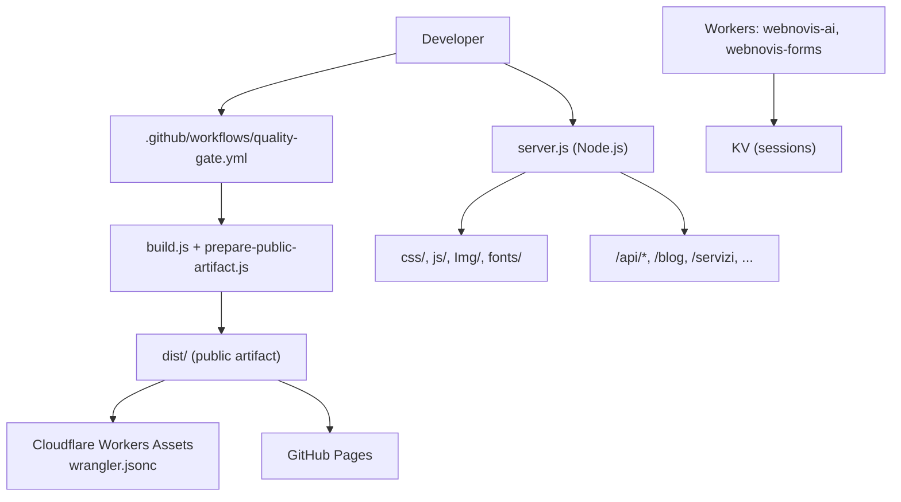
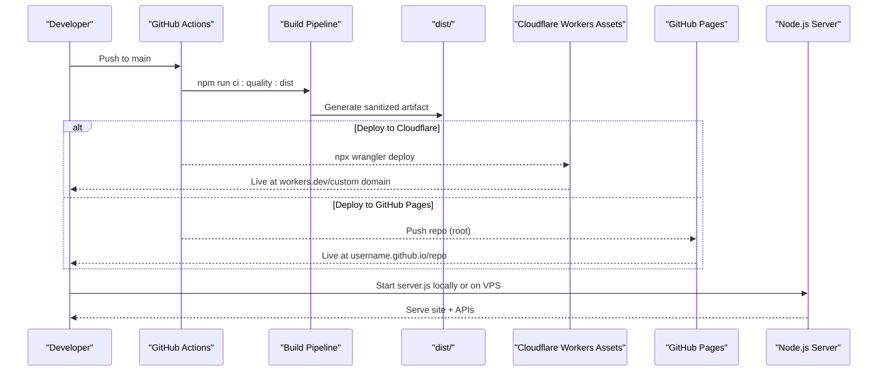
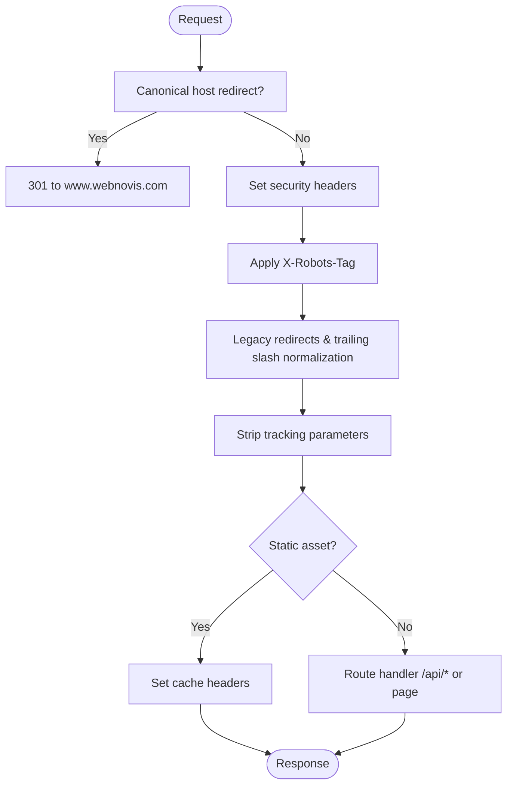
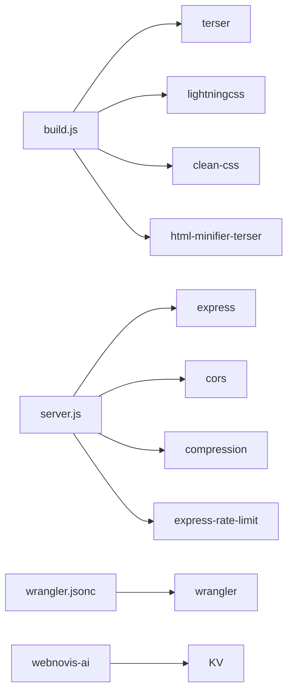

# Multi-Platform Deployment Strategy

<cite>
**Referenced Files in This Document**
- [package.json](file://package.json)
- [build.js](file://build.js)
- [wrangler.jsonc](file://wrangler.jsonc)
- [server.js](file://server.js)
- [prepare-public-artifact.js](file://scripts/prepare-public-artifact.js)
- [publish-targets.js](file://config/publish-targets.js)
- [quality-gate.yml](file://.github/workflows/quality-gate.yml)
- [DEPLOY-GITHUB.md](file://docs/deploy/DEPLOY-GITHUB.md)
- [CLOUDFLARE-CONFIGURAZIONE-PASSO-PASSO.md](file://docs/deploy/CLOUDFLARE-CONFIGURAZIONE-PASSO-PASSO.md)
- [workers/webnovis-ai/wrangler.jsonc](file://workers/webnovis-ai/wrangler.jsonc)
- [workers/webnovis-forms/wrangler.jsonc](file://workers/webnovis-forms/wrangler.jsonc)
</cite>

## Table of Contents
1. Introduction
2. Project Structure
3. Core Components
4. Architecture Overview
5. Detailed Component Analysis
6. Dependency Analysis
7. Performance Considerations
8. Troubleshooting Guide
9. Conclusion

## Introduction
This document explains WebNovis multi-platform deployment strategy, covering static hosting (GitHub Pages), dynamic runtime (traditional Node.js server), and edge/static hosting via Cloudflare Workers Assets. It details build differences, asset optimization, platform-specific configuration, automation workflows, environment variables, and troubleshooting guidance to help you choose the right target based on performance and feature needs.

## Project Structure
WebNovis separates source assets from a sanitized public artifact:
- Source tree includes HTML templates, CSS, JS, data, scripts, and configs.
- A deterministic build pipeline produces a minimal, auditable dist/ artifact suitable for static or edge hosting.
- A Node.js server serves the site dynamically with API endpoints when needed.
- Cloudflare Workers are used for both static assets and small serverless functions (AI chat, forms).

**Diagram sources**
- [quality-gate.yml:10-47](file://.github/workflows/quality-gate.yml#L10-L47)
- [prepare-public-artifact.js:183-249](file://scripts/prepare-public-artifact.js#L183-L249)
- [build.js:373-496](file://build.js#L373-L496)
- [wrangler.jsonc:22-28](file://wrangler.jsonc#L22-L28)
- [server.js:224-530](file://server.js#L224-L530)
- [workers/webnovis-ai/wrangler.jsonc:1-26](file://workers/webnovis-ai/wrangler.jsonc#L1-L26)

**Section sources**
- [package.json:6-60](file://package.json#L6-L60)
- [prepare-public-artifact.js:183-249](file://scripts/prepare-public-artifact.js#L183-L249)
- [build.js:373-496](file://build.js#L373-L496)
- [wrangler.jsonc:22-28](file://wrangler.jsonc#L22-L28)
- [server.js:224-530](file://server.js#L224-L530)

## Core Components
- Build system: minifies JS (Terser), CSS (Lightning CSS with CleanCSS fallback), and optional HTML minification; discovers assets referenced by HTML.
- Public artifact builder: materializes only necessary files, generates geo pages, search index, sitemap, LLM indexes, security headers, and prunes unreferenced media/fonts.
- Node.js server: Express app serving static directories and routes, applying SEO redirects, security headers, rate limiting, and API endpoints.
- Cloudflare Workers:
  - Static assets via wrangler.jsonc pointing to dist/.
  - AI worker (webnovis-ai) with KV for sessions.
  - Forms worker (webnovis-forms) with Turnstile and Web3Forms integration.
- CI quality gate: builds dist, validates artifact, uploads it as an artifact, and verifies production headers on main pushes.

**Section sources**
- [build.js:31-113](file://build.js#L31-L113)
- [build.js:242-279](file://build.js#L242-L279)
- [build.js:290-371](file://build.js#L290-L371)
- [build.js:428-496](file://build.js#L428-L496)
- [prepare-public-artifact.js:87-125](file://scripts/prepare-public-artifact.js#L87-L125)
- [prepare-public-artifact.js:127-156](file://scripts/prepare-public-artifact.js#L127-L156)
- [prepare-public-artifact.js:183-249](file://scripts/prepare-public-artifact.js#L183-L249)
- [server.js:224-530](file://server.js#L224-L530)
- [wrangler.jsonc:22-28](file://wrangler.jsonc#L22-L28)
- [workers/webnovis-ai/wrangler.jsonc:1-26](file://workers/webnovis-ai/wrangler.jsonc#L1-L26)
- [workers/webnovis-forms/wrangler.jsonc:1-20](file://workers/webnovis-forms/wrangler.jsonc#L1-L20)
- [quality-gate.yml:10-47](file://.github/workflows/quality-gate.yml#L10-L47)

## Architecture Overview
The project supports three primary deployment targets:

- GitHub Pages (static-only):
  - Publishes root HTML and assets directly from the repository.
  - No backend APIs; client-side fallbacks apply if configured.
  - Use npm run ci:quality before pushing to ensure build integrity.

- Traditional Node.js hosting (dynamic):
  - Runs server.js to serve static directories and API endpoints (/api/chat, /api/search-ai, newsletter endpoints).
  - Applies canonical host redirects, security headers, trailing slash normalization, UTM stripping, legacy redirects, and cache policies.
  - Requires environment variables for API keys and secrets.

- Cloudflare Workers Assets (static at edge):
  - Serves the prebuilt dist/ directory with html_handling set to "none" to preserve .html URLs.
  - Uses _redirects/_headers patterns via Cloudflare zone rules when origin is GitHub Pages.
  - Optional Workers for AI and forms with KV and secrets.

**Diagram sources**
- [quality-gate.yml:10-47](file://.github/workflows/quality-gate.yml#L10-L47)
- [wrangler.jsonc:22-28](file://wrangler.jsonc#L22-L28)
- [prepare-public-artifact.js:183-249](file://scripts/prepare-public-artifact.js#L183-L249)
- [DEPLOY-GITHUB.md:51-69](file://docs/deploy/DEPLOY-GITHUB.md#L51-L69)

## Detailed Component Analysis

### Static Hosting: GitHub Pages
- Purpose: Zero-cost static hosting with automatic HTTPS and custom domains.
- Build requirements: Ensure index.html and assets exist at repository root; no server execution.
- Automation: Run npm run ci:quality to validate build and tests before push.
- Custom domain: Configure DNS A records and CNAME per provider; enforce HTTPS.
- Limitations: No backend APIs; use client-side fallbacks or separate backend service.

Step-by-step summary:
- Initialize Git, create GitHub repository, push code.
- Enable GitHub Pages from main branch, root folder.
- Add custom domain and configure DNS.
- Verify site and links; test mobile responsiveness and performance.

Environment variables: Not required for static-only mode. If using a separate backend, point frontend endpoints to that service’s URL.

Common issues:
- 404 errors due to missing index.html or wrong paths.
- Domain not found due to DNS propagation delays.
- Chat/API features unavailable unless a backend is deployed separately.

**Section sources**
- [DEPLOY-GITHUB.md:51-69](file://docs/deploy/DEPLOY-GITHUB.md#L51-L69)
- [DEPLOY-GITHUB.md:129-214](file://docs/deploy/DEPLOY-GITHUB.md#L129-L214)
- [DEPLOY-GITHUB.md:346-401](file://docs/deploy/DEPLOY-GITHUB.md#L346-L401)
- [DEPLOY-GITHUB.md:484-518](file://docs/deploy/DEPLOY-GITHUB.md#L484-L518)

### Dynamic Hosting: Traditional Node.js
- Purpose: Full-featured site with server-side APIs, rate limiting, and SEO middleware.
- Build/run: npm start runs server.js; npm run dev uses nodemon for hot reload.
- Middleware stack:
  - Canonical host redirect (non-www to www in production).
  - Security headers (CSP, Permissions-Policy, X-Frame-Options, Referrer-Policy).
  - X-Robots-Tag directives for API paths and governed pages.
  - Legacy redirects and trailing slash normalization.
  - UTM/tracking parameter stripping to prevent duplicate content.
  - Static file serving for css/, js/, Img/, fonts/ with appropriate cache headers.
  - Route handlers for blog, servizi, portfolio, and other sections.
- Rate limiting: Protects chat, newsletter, and search endpoints.
- Environment variables:
  - GEMINI_API_KEY_CHAT, GEMINI_API_KEY_SEARCH
  - BREVO_API_KEY (newsletter)
  - NEWSLETTER_ADMIN_SECRET
  - PORT, NODE_ENV

**Diagram sources**
- [server.js:291-384](file://server.js#L291-L384)
- [server.js:441-530](file://server.js#L441-L530)

**Section sources**
- [server.js:224-530](file://server.js#L224-L530)
- [package.json:6-11](file://package.json#L6-L11)

### Edge Hosting: Cloudflare Workers Assets
- Purpose: Serve the prebuilt dist/ at the edge with zero cold starts for static assets.
- Configuration:
  - name: webnovis
  - compatibility_date: set
  - assets.directory: dist
  - html_handling: none (preserves .html URLs)
  - not_found_handling: 404-page
- Workflow:
  - Build artifact via npm run build:site:dist (prepares dist/).
  - Deploy with npx wrangler deploy.
  - Optionally use dry-run: npm run deploy:workers:check.
- When origin remains GitHub Pages:
  - Use Cloudflare zone rules for security headers, WAF blocking of sensitive paths, and redirects.
  - The verification script enforces header correctness and source exposure checks.

Environment variables:
- Set via Wrangler secrets or vars as needed for Workers (e.g., TURNSTILE_SECRET for forms).

**Section sources**
- [wrangler.jsonc:22-28](file://wrangler.jsonc#L22-L28)
- [package.json:51-53](file://package.json#L51-L53)
- [CLOUDFLARE-CONFIGURAZIONE-PASSO-PASSO.md:1-10](file://docs/deploy/CLOUDFLARE-CONFIGURAZIONE-PASSO-PASSO.md#L1-L10)
- [CLOUDFLARE-CONFIGURAZIONE-PASSO-PASSO.md:28-101](file://docs/deploy/CLOUDFLARE-CONFIGURAZIONE-PASSO-PASSO.md#L28-L101)
- [CLOUDFLARE-CONFIGURAZIONE-PASSO-PASSO.md:104-159](file://docs/deploy/CLOUDFLARE-CONFIGURAZIONE-PASSO-PASSO.md#L104-L159)
- [CLOUDFLARE-CONFIGURAZIONE-PASSO-PASSO.md:162-205](file://docs/deploy/CLOUDFLARE-CONFIGURAZIONE-PASSO-PASSO.md#L162-L205)

### AI Worker: webnovis-ai
- Purpose: Serverless function for AI-powered chat/search with session storage in KV.
- Configuration:
  - main: src/index.js
  - compatibility_flags: nodejs_compat
  - kv_namespaces: SESSIONS binding
  - vars: SERVICE_NAME, ENVIRONMENT
- Scripts:
  - ai:prepare prepares data for the worker.
  - ai:dev runs local development.
  - ai:deploy deploys to Cloudflare.

Environment variables:
- Secrets bound via Wrangler (e.g., API keys) — never commit secrets.

**Section sources**
- [workers/webnovis-ai/wrangler.jsonc:1-26](file://workers/webnovis-ai/wrangler.jsonc#L1-L26)
- [package.json:54-57](file://package.json#L54-L57)

### Forms Worker: webnovis-forms
- Purpose: Handles form submissions with Turnstile validation and Web3Forms delivery.
- Configuration:
  - main: src/index.js
  - vars: TURNSTILE_HOSTNAMES, WEB3FORMS_ENDPOINT
  - Secrets: TURNSTILE_SECRET, optional WEB3FORMS_ACCESS_KEY
- Scripts:
  - forms:dev for local testing.
  - forms:deploy to publish.

**Section sources**
- [workers/webnovis-forms/wrangler.jsonc:1-20](file://workers/webnovis-forms/wrangler.jsonc#L1-L20)
- [package.json:58-59](file://package.json#L58-L59)

### Build Process Differences Across Platforms
- GitHub Pages:
  - No build step enforced by the platform; ensure static files exist at root.
  - Use npm run ci:quality to validate locally before push.
- Node.js:
  - Runs server.js; can serve built assets or raw source depending on setup.
  - Applies server-side SEO and security logic.
- Cloudflare Workers Assets:
  - Requires building dist/ first; then deploy with Wrangler.
  - html_handling: none preserves .html URLs; _redirects/_headers managed via zone rules when origin is GitHub Pages.

Asset optimization strategies:
- JS minification via Terser with aggressive dead code elimination and console removal.
- CSS minification via Lightning CSS with CleanCSS fallback; safe cascade preservation.
- Optional HTML minification for src/html templates.
- Asset discovery from HTML references ensures only used assets are included.
- Artifact pruning removes unreferenced media/fonts to reduce size.

**Section sources**
- [build.js:31-113](file://build.js#L31-L113)
- [build.js:242-279](file://build.js#L242-L279)
- [build.js:290-371](file://build.js#L290-L371)
- [build.js:428-496](file://build.js#L428-L496)
- [prepare-public-artifact.js:127-156](file://scripts/prepare-public-artifact.js#L127-L156)
- [wrangler.jsonc:22-28](file://wrangler.jsonc#L22-L28)

### Platform-Specific Configurations
- GitHub Pages:
  - Repository settings: Deploy from main, root folder.
  - Custom domain: DNS A records and CNAME; enforce HTTPS.
- Node.js:
  - Environment variables for API keys and secrets.
  - Rate limiting and security headers applied server-side.
- Cloudflare Workers:
  - wrangler.jsonc defines assets directory and behavior.
  - Zone-level rules for headers, WAF, and redirects when origin is GitHub Pages.

**Section sources**
- [DEPLOY-GITHUB.md:129-214](file://docs/deploy/DEPLOY-GITHUB.md#L129-L214)
- [server.js:291-384](file://server.js#L291-L384)
- [wrangler.jsonc:22-28](file://wrangler.jsonc#L22-L28)
- [CLOUDFLARE-CONFIGURAZIONE-PASSO-PASSO.md:28-101](file://docs/deploy/CLOUDFLARE-CONFIGURAZIONE-PASSO-PASSO.md#L28-L101)

### Deployment Scripts and Automation Workflows
- Local scripts:
  - npm run build:site:dist prepares dist/ artifact.
  - npm run deploy:workers:check dry-runs Workers deployment.
  - npm run deploy:site deploys Workers.
  - npm run ai:prepare, ai:dev, ai:deploy manage AI worker lifecycle.
  - npm run forms:dev, forms:deploy manage forms worker lifecycle.
- CI workflow:
  - quality-gate.yml installs dependencies, runs ci:quality:dist, verifies no source mutations, uploads dist/ artifact, and verifies production headers on main pushes.

**Section sources**
- [package.json:51-59](file://package.json#L51-L59)
- [quality-gate.yml:10-47](file://.github/workflows/quality-gate.yml#L10-L47)

### Step-by-Step Setup Instructions

- GitHub Pages (static-only):
  - Prepare repository with index.html and assets at root.
  - Push to GitHub; enable Pages from main branch, root folder.
  - Configure custom domain and DNS; enforce HTTPS.
  - Run npm run ci:quality locally before pushing to catch issues early.

- Node.js (dynamic):
  - Install dependencies and set environment variables (API keys, secrets).
  - Run npm start to serve site and APIs.
  - Apply security headers and redirects via server.js middleware.
  - Test API endpoints and rate limiting.

- Cloudflare Workers Assets:
  - Build artifact: npm run build:site:dist.
  - Deploy: npx wrangler deploy (or npm run deploy:site).
  - If origin is GitHub Pages, configure zone-level rules for headers, WAF, and redirects.

Environment variable configuration:
- Node.js server:
  - GEMINI_API_KEY_CHAT, GEMINI_API_KEY_SEARCH
  - BREVO_API_KEY
  - NEWSLETTER_ADMIN_SECRET
  - PORT, NODE_ENV
- Workers:
  - Set secrets via Wrangler (e.g., TURNSTILE_SECRET).
  - Configure vars like TURNSTILE_HOSTNAMES and WEB3FORMS_ENDPOINT.

**Section sources**
- [DEPLOY-GITHUB.md:51-69](file://docs/deploy/DEPLOY-GITHUB.md#L51-L69)
- [DEPLOY-GITHUB.md:129-214](file://docs/deploy/DEPLOY-GITHUB.md#L129-L214)
- [server.js:224-530](file://server.js#L224-L530)
- [wrangler.jsonc:22-28](file://wrangler.jsonc#L22-L28)
- [workers/webnovis-forms/wrangler.jsonc:1-20](file://workers/webnovis-forms/wrangler.jsonc#L1-L20)

### Choosing the Right Deployment Platform
- Choose GitHub Pages if:
  - You need a free, simple static site without server-side APIs.
  - You prefer zero infrastructure maintenance and automatic HTTPS.
- Choose Node.js hosting if:
  - You require server-side APIs (chat, search, newsletter).
  - You need fine-grained control over caching, redirects, and security headers.
- Choose Cloudflare Workers Assets if:
  - You want edge-cached static assets with fast global delivery.
  - You plan to add small serverless functions (AI, forms) via Workers.
  - You can manage zone-level rules for headers and redirects when origin is GitHub Pages.

Performance considerations:
- Static sites benefit from CDN caching and immutable asset URLs.
- Node.js adds latency but enables dynamic features; ensure compression and proper cache headers.
- Workers provide low-latency edge responses for static assets and lightweight functions.

**Section sources**
- [DEPLOY-GITHUB.md:484-518](file://docs/deploy/DEPLOY-GITHUB.md#L484-L518)
- [server.js:234-249](file://server.js#L234-L249)
- [wrangler.jsonc:22-28](file://wrangler.jsonc#L22-L28)

## Dependency Analysis
Key dependencies and their roles:
- Build tools:
  - terser for JS minification.
  - lightningcss with clean-css fallback for CSS minification.
  - html-minifier-terser for optional HTML minification.
- Runtime:
  - express for Node.js server.
  - cors, compression, express-rate-limit for security and performance.
  - node-fetch for external API calls.
- Workers:
  - wrangler for deploying and managing Workers.
  - KV for session storage in AI worker.

**Diagram sources**
- [build.js:13-27](file://build.js#L13-L27)
- [server.js:224-287](file://server.js#L224-L287)
- [wrangler.jsonc:22-28](file://wrangler.jsonc#L22-L28)
- [workers/webnovis-ai/wrangler.jsonc:19-25](file://workers/webnovis-ai/wrangler.jsonc#L19-L25)

**Section sources**
- [package.json:69-89](file://package.json#L69-L89)
- [build.js:13-27](file://build.js#L13-L27)
- [server.js:224-287](file://server.js#L224-L287)
- [wrangler.jsonc:22-28](file://wrangler.jsonc#L22-L28)
- [workers/webnovis-ai/wrangler.jsonc:19-25](file://workers/webnovis-ai/wrangler.jsonc#L19-L25)

## Performance Considerations
- Minify and compress assets:
  - JS minified with Terser; remove debug logs and unused code.
  - CSS minified with Lightning CSS; fallback to CleanCSS for safety.
  - Optional HTML minification for templates.
- Caching:
  - Static assets served with long-lived cache headers in production.
  - HTML served with shorter TTL and stale-while-revalidate.
- Asset pruning:
  - Unreferenced media/fonts removed from dist/ to reduce payload size.
- Edge delivery:
  - Cloudflare Workers Assets deliver static content globally with low latency.
- Rate limiting:
  - Protects APIs from abuse and controls costs.

[No sources needed since this section provides general guidance]

## Troubleshooting Guide
Common issues and resolutions:
- GitHub Pages 404:
  - Ensure index.html exists at repository root; verify paths for CSS/JS.
- Domain not found:
  - Check DNS A records and CNAME; allow time for propagation.
- Chat/API not working on static hosting:
  - GitHub Pages cannot run server.js; deploy a separate backend or use client-side fallbacks.
- Missing security headers on production:
  - Configure Cloudflare zone rules for CSP, Permissions-Policy, and other headers; verify with npm run verify:prod-headers.
- Source files exposed:
  - Block sensitive paths via Cloudflare WAF rules; verify with curl checks.
- Workers deployment failures:
  - Ensure dist/ is built and valid; check wrangler configuration and secrets.

Verification commands:
- npm run verify:prod-headers to check production headers and redirects.
- npm run deploy:workers:check for dry-run Workers deployment.

**Section sources**
- [DEPLOY-GITHUB.md:346-401](file://docs/deploy/DEPLOY-GITHUB.md#L346-L401)
- [CLOUDFLARE-CONFIGURAZIONE-PASSO-PASSO.md:28-101](file://docs/deploy/CLOUDFLARE-CONFIGURAZIONE-PASSO-PASSO.md#L28-L101)
- [CLOUDFLARE-CONFIGURAZIONE-PASSO-PASSO.md:104-159](file://docs/deploy/CLOUDFLARE-CONFIGURAZIONE-PASSO-PASSO.md#L104-L159)
- [CLOUDFLARE-CONFIGURAZIONE-PASSO-PASSO.md:162-205](file://docs/deploy/CLOUDFLARE-CONFIGURAZIONE-PASSO-PASSO.md#L162-L205)
- [package.json:51-53](file://package.json#L51-L53)

## Conclusion
WebNovis supports flexible deployment across static, dynamic, and edge platforms:
- GitHub Pages for simple, cost-free static hosting.
- Node.js for full-featured applications requiring server-side logic and APIs.
- Cloudflare Workers Assets for high-performance static delivery and lightweight serverless functions.

Choose the platform based on your needs:
- Static-only: GitHub Pages.
- Dynamic APIs: Node.js hosting.
- Edge performance and serverless functions: Cloudflare Workers.

Ensure you follow the build and CI processes, configure environment variables securely, and apply platform-specific optimizations for headers, caching, and redirects.

[No sources needed since this section summarizes without analyzing specific files]