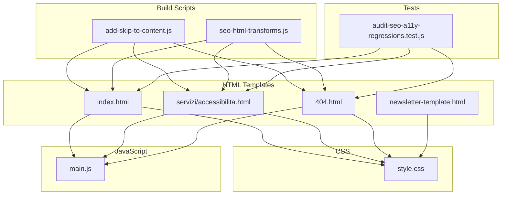
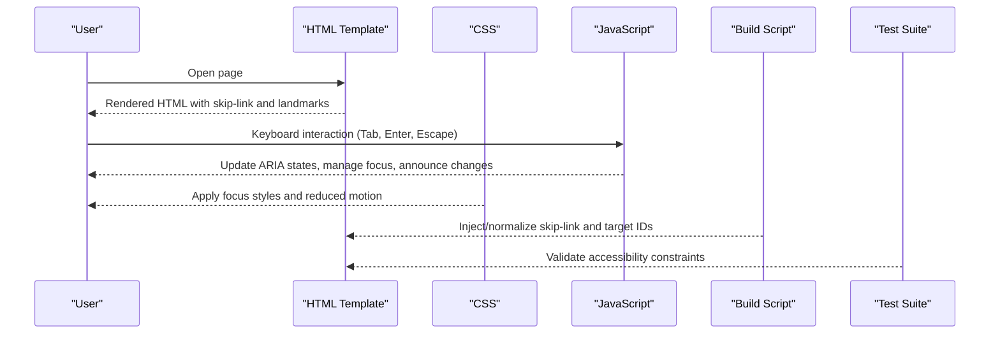
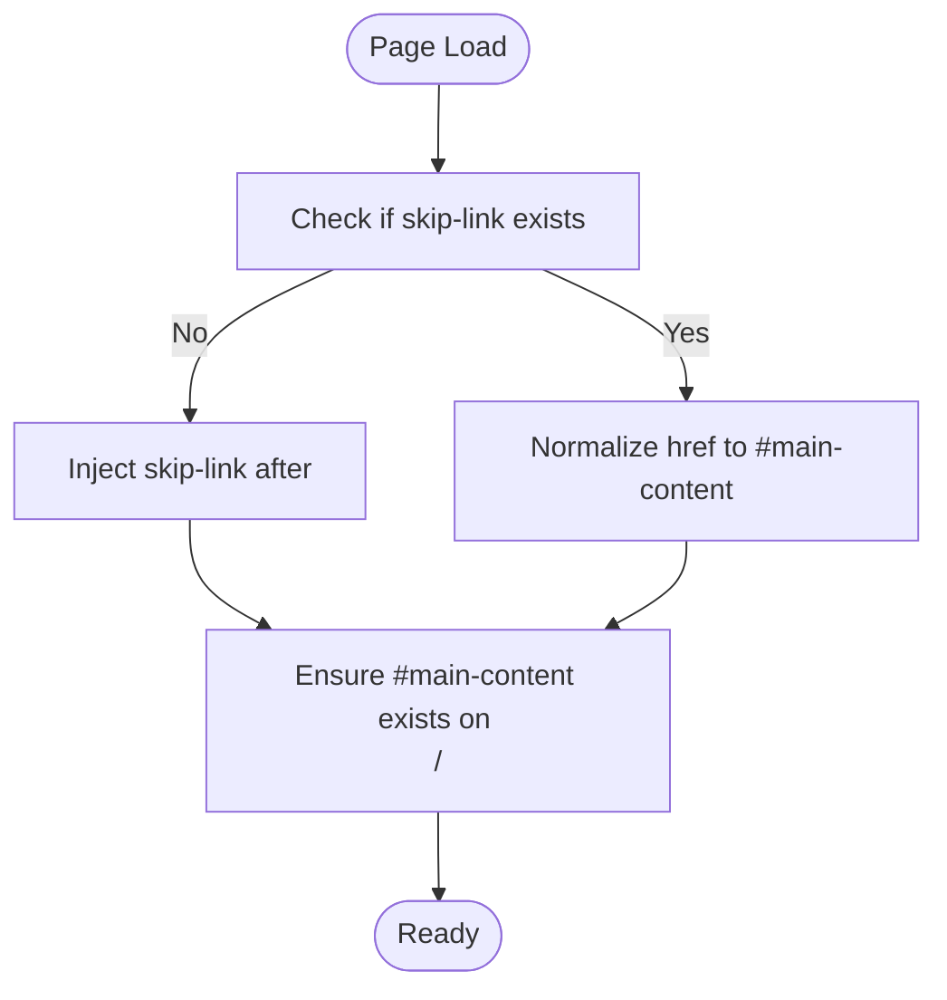
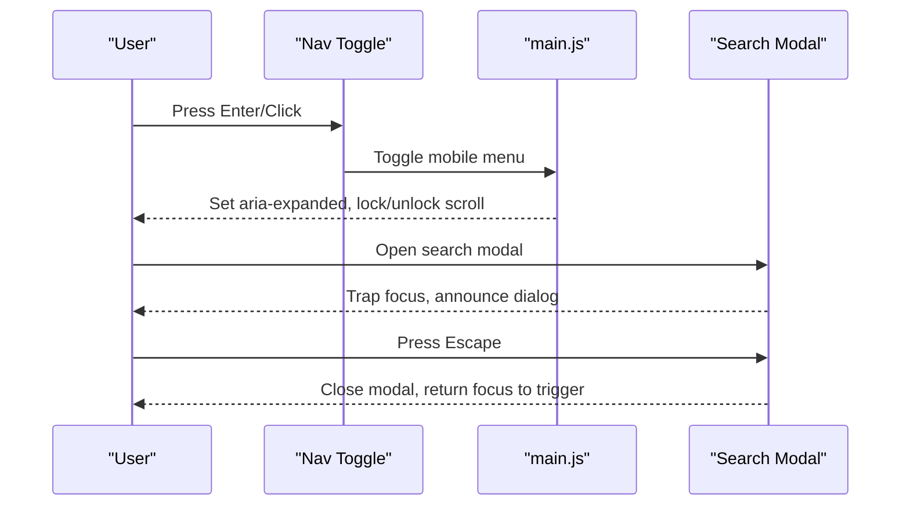
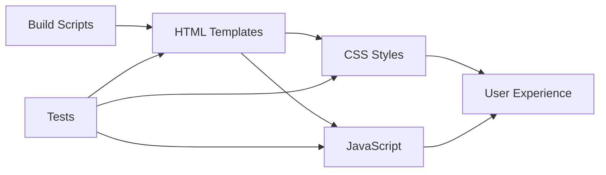

# Accessibility & A11y Features

<cite>
**Referenced Files in This Document**
- [src/html/index.html](file://src/html/index.html)
- [src/html/servizi/accessibilita.html](file://src/html/servizi/accessibilita.html)
- [src/html/404.html](file://src/html/404.html)
- [css/style.css](file://css/style.css)
- [js/main.js](file://js/main.js)
- [scripts/add-skip-to-content.js](file://scripts/add-skip-to-content.js)
- [config/seo-html-transforms.js](file://config/seo-html-transforms.js)
- [tests/audit-seo-a11y-regressions.test.js](file://tests/audit-seo-a11y-regressions.test.js)
- [newsletter-template.html](file://newsletter-template.html)
</cite>

## Table of Contents
1. [Introduction](#introduction)
2. [Project Structure](#project-structure)
3. [Core Components](#core-components)
4. [Architecture Overview](#architecture-overview)
5. [Detailed Component Analysis](#detailed-component-analysis)
6. [Dependency Analysis](#dependency-analysis)
7. [Performance Considerations](#performance-considerations)
8. [Troubleshooting Guide](#troubleshooting-guide)
9. [Conclusion](#conclusion)
10. [Appendices](#appendices)

## Introduction
This document provides a comprehensive overview of accessibility (a11y) and WCAG compliance across the project. It covers keyboard navigation, screen reader support with ARIA labels, focus management, color contrast ratios, semantic HTML structure, accessible forms, skip-to-content functionality, reduced motion preferences, high contrast mode considerations, internationalization, assistive technology compatibility, testing strategies, and ongoing maintenance practices. The goal is to make this information accessible to both technical and non-technical readers while grounding all claims in the repository’s actual implementation.

## Project Structure
Accessibility features are implemented across multiple layers:
- HTML templates define semantic structure, skip links, ARIA attributes, and form semantics.
- CSS defines focus styles, reduced motion handling, and utility classes for screen-reader-only text.
- JavaScript manages interactive components (navigation, search modal), focus control, and respects user preferences like reduced motion.
- Build-time scripts inject or normalize accessibility-related markup (e.g., skip links and main content targets).
- Automated tests enforce key accessibility constraints and regressions.

**Diagram sources**
- [src/html/index.html](file://src/html/index.html)
- [src/html/servizi/accessibilita.html](file://src/html/servizi/accessibilita.html)
- [src/html/404.html](file://src/html/404.html)
- [newsletter-template.html](file://newsletter-template.html)
- [css/style.css](file://css/style.css)
- [js/main.js](file://js/main.js)
- [scripts/add-skip-to-content.js](file://scripts/add-skip-to-content.js)
- [config/seo-html-transforms.js](file://config/seo-html-transforms.js)
- [tests/audit-seo-a11y-regressions.test.js](file://tests/audit-seo-a11y-regressions.test.js)

**Section sources**
- [src/html/index.html](file://src/html/index.html)
- [src/html/servizi/accessibilita.html](file://src/html/servizi/accessibilita.html)
- [src/html/404.html](file://src/html/404.html)
- [newsletter-template.html](file://newsletter-template.html)
- [css/style.css](file://css/style.css)
- [js/main.js](file://js/main.js)
- [scripts/add-skip-to-content.js](file://scripts/add-skip-to-content.js)
- [config/seo-html-transforms.js](file://config/seo-html-transforms.js)
- [tests/audit-seo-a11y-regressions.test.js](file://tests/audit-seo-a11y-regressions.test.js)

## Core Components
- Skip-to-content link: Present at the top of pages to allow keyboard users to bypass navigation and jump directly to the main content.
- Semantic landmarks: Pages use <header>, <nav>, <main>, and other landmarks to provide structure for assistive technologies.
- ARIA roles and states: Search inputs use role="combobox", dialogs use role="dialog" and aria-modal, toggles manage aria-expanded, and live regions announce updates.
- Focus management: Interactive elements have visible focus indicators; mobile menu and search modal manage focus on open/close.
- Reduced motion: Animations respect prefers-reduced-motion to avoid triggering vestibular issues.
- Color contrast: Tests assert that critical colors meet WCAG AA contrast requirements against the dark background.
- Accessible forms: Inputs include type, autocomplete, and labels; radio groups are wrapped in fieldset/legend where applicable.

**Section sources**
- [src/html/index.html](file://src/html/index.html)
- [src/html/servizi/accessibilita.html](file://src/html/servizi/accessibilita.html)
- [src/html/404.html](file://src/html/404.html)
- [css/style.css](file://css/style.css)
- [js/main.js](file://js/main.js)
- [tests/audit-seo-a11y-regressions.test.js](file://tests/audit-seo-a11y-regressions.test.js)

## Architecture Overview
The accessibility architecture combines static markup, runtime behavior, and build-time normalization:
- Markup establishes semantics and ARIA attributes.
- CSS ensures focus visibility, hidden text for screen readers, and reduced motion.
- JavaScript controls dynamic behaviors while preserving keyboard and screen reader expectations.
- Build scripts ensure consistent skip-link presence and target IDs.
- Tests enforce baseline accessibility rules and prevent regressions.

**Diagram sources**
- [src/html/index.html](file://src/html/index.html)
- [css/style.css](file://css/style.css)
- [js/main.js](file://js/main.js)
- [scripts/add-skip-to-content.js](file://scripts/add-skip-to-content.js)
- [tests/audit-seo-a11y-regressions.test.js](file://tests/audit-seo-a11y-regressions.test.js)

## Detailed Component Analysis

### Skip-to-Content Implementation
- Purpose: Allow keyboard users to bypass repetitive navigation and jump to the primary content area.
- Behavior:
  - A skip link is injected near the top of the body.
  - The main content target must exist and be focusable.
  - Build-time scripts ensure consistency across pages.
- Key files:
  - Injection script adds the skip link and normalizes legacy targets.
  - Transform function ensures the target ID exists on <main> or <section>.
  - Pages include the skip link and a focusable main content anchor.

**Diagram sources**
- [scripts/add-skip-to-content.js](file://scripts/add-skip-to-content.js)
- [config/seo-html-transforms.js](file://config/seo-html-transforms.js)
- [src/html/index.html](file://src/html/index.html)
- [src/html/servizi/accessibilita.html](file://src/html/servizi/accessibilita.html)
- [src/html/404.html](file://src/html/404.html)

**Section sources**
- [scripts/add-skip-to-content.js](file://scripts/add-skip-to-content.js)
- [config/seo-html-transforms.js](file://config/seo-html-transforms.js)
- [src/html/index.html](file://src/html/index.html)
- [src/html/servizi/accessibilita.html](file://src/html/servizi/accessibilita.html)
- [src/html/404.html](file://src/html/404.html)

### Keyboard Navigation and Focus Management
- Navigation toggle:
  - Updates aria-expanded state when opening/closing the mobile menu.
  - Locks body scroll during menu open and restores it on close.
- Search modal:
  - Uses role="dialog" and aria-modal to trap focus within the dialog.
  - Provides clear labels for inputs and actions.
- Focus indicators:
  - Global focus ring variables ensure visible focus outlines.
  - Custom components (e.g., custom select triggers) expose focus-visible styles.

**Diagram sources**
- [js/main.js](file://js/main.js)
- [src/html/index.html](file://src/html/index.html)
- [src/html/servizi/accessibilita.html](file://src/html/servizi/accessibilita.html)
- [src/html/404.html](file://src/html/404.html)
- [css/style.css](file://css/style.css)

**Section sources**
- [js/main.js](file://js/main.js)
- [src/html/index.html](file://src/html/index.html)
- [src/html/servizi/accessibilita.html](file://src/html/servizi/accessibilita.html)
- [src/html/404.html](file://src/html/404.html)
- [css/style.css](file://css/style.css)

### Screen Reader Support and ARIA Labels
- Landmarks and headings:
  - Proper use of <header>, <nav>, <main>, and heading hierarchy improves structure.
- Live regions:
  - Dynamic updates use aria-live to announce changes to screen readers.
- Combobox pattern:
  - Search inputs implement role="combobox" with aria-controls and aria-expanded.
- Decorative elements:
  - Decorative SVGs and images use aria-hidden or empty alt to avoid noise.

Examples across pages:
- Search inputs and results containers use combobox/listbox patterns.
- Dialogs and modals declare role and aria-modal.
- Buttons and links include descriptive aria-labels.

**Section sources**
- [src/html/index.html](file://src/html/index.html)
- [src/html/servizi/accessibilita.html](file://src/html/servizi/accessibilita.html)
- [src/html/404.html](file://src/html/404.html)

### Color Contrast and Visual Design
- Contrast checks:
  - Automated tests assert that critical color variables meet WCAG AA contrast ratios against the dark background.
- Focus visibility:
  - Global focus ring variables ensure sufficient contrast for focus outlines.
- Reduced motion:
  - Animations are suppressed when users prefer reduced motion.

Key references:
- Contrast assertion in test suite.
- Focus ring variable definitions.
- Reduced motion media queries.

**Section sources**
- [tests/audit-seo-a11y-regressions.test.js](file://tests/audit-seo-a11y-regressions.test.js)
- [css/style.css](file://css/style.css)

### Semantic HTML Structure
- Landmarks:
  - Use of <header>, <nav>, <main>, and sections provides meaningful structure.
- Headings:
  - Hierarchical headings describe page sections.
- Images:
  - Informative images include alt text; decorative images use empty alt or aria-hidden.
- Lists and links:
  - Navigation uses lists and links with descriptive titles.

**Section sources**
- [src/html/index.html](file://src/html/index.html)
- [src/html/servizi/accessibilita.html](file://src/html/servizi/accessibilita.html)
- [src/html/404.html](file://src/html/404.html)

### Accessible Form Handling
- Input types and autocomplete:
  - Email and URL fields specify type and autocomplete attributes.
- Fieldsets and legends:
  - Radio groups are wrapped in fieldset/legend to group related options.
- Error and success messages:
  - Status and alert roles convey feedback to assistive technologies.

**Section sources**
- [src/html/404.html](file://src/html/404.html)
- [tests/audit-seo-a11y-regressions.test.js](file://tests/audit-seo-a11y-regressions.test.js)

### Internationalization and Language Declaration
- Language attribute:
  - Pages declare lang="it" to indicate Italian content.
- Locale metadata:
  - Open Graph locale meta tags reflect language settings.

**Section sources**
- [src/html/index.html](file://src/html/index.html)
- [src/html/servizi/accessibilita.html](file://src/html/servizi/accessibilita.html)
- [src/html/404.html](file://src/html/404.html)
- [newsletter-template.html](file://newsletter-template.html)

### Assistive Technology Compatibility
- Screen readers:
  - ARIA roles, states, and live regions improve compatibility with NVDA, VoiceOver, and JAWS.
- Keyboard navigation:
  - All interactive elements are reachable via Tab and operable with Enter/Space.
- Focus management:
  - Modals and menus manage focus trapping and restoration.

**Section sources**
- [js/main.js](file://js/main.js)
- [src/html/index.html](file://src/html/index.html)
- [src/html/servizi/accessibilita.html](file://src/html/servizi/accessibilita.html)
- [src/html/404.html](file://src/html/404.html)

### Testing Accessibility with Automated Tools
- Regression tests:
  - Assertions check for missing skip links, incorrect ARIA attributes, and insufficient contrast.
- Coverage:
  - Tests validate FAQ buttons’ aria-expanded and aria-controls, search input types, noscript fallbacks, and more.

Recommended tools:
- Lighthouse for automated audits.
- axe DevTools for developer workflow integration.
- WAVE for quick visual checks.

**Section sources**
- [tests/audit-seo-a11y-regressions.test.js](file://tests/audit-seo-a11y-regressions.test.js)

### Manual Accessibility Audits
- Checklist items:
  - Verify skip-to-content works.
  - Confirm keyboard-only navigation.
  - Test screen reader announcements.
  - Validate color contrast manually.
  - Review form labeling and error messaging.
- Frequency:
  - Conduct periodic manual audits alongside automated checks.

[No sources needed since this section provides general guidance]

### High Contrast Mode Support
- Considerations:
  - Ensure focus rings remain visible under system high contrast settings.
  - Avoid relying solely on color to convey meaning.
- Current state:
  - Focus styles and semantic structure support high contrast environments.

[No sources needed since this section provides general guidance]

### Reduced Motion Preferences
- Implementation:
  - CSS suppresses animations and transitions when prefers-reduced-motion is enabled.
- JavaScript:
  - Checks for reduced motion preference before enabling certain effects.

**Section sources**
- [css/style.css](file://css/style.css)
- [js/main.js](file://js/main.js)

## Dependency Analysis
Accessibility features depend on coordinated interactions between HTML, CSS, JS, and build/test layers:
- HTML templates provide the base semantics and ARIA attributes.
- CSS enhances focus visibility and respects user preferences.
- JavaScript manages dynamic behavior and focus control.
- Build scripts ensure consistent skip-link presence and target IDs.
- Tests enforce accessibility constraints and prevent regressions.

**Diagram sources**
- [src/html/index.html](file://src/html/index.html)
- [css/style.css](file://css/style.css)
- [js/main.js](file://js/main.js)
- [scripts/add-skip-to-content.js](file://scripts/add-skip-to-content.js)
- [tests/audit-seo-a11y-regressions.test.js](file://tests/audit-seo-a11y-regressions.test.js)

**Section sources**
- [src/html/index.html](file://src/html/index.html)
- [css/style.css](file://css/style.css)
- [js/main.js](file://js/main.js)
- [scripts/add-skip-to-content.js](file://scripts/add-skip-to-content.js)
- [tests/audit-seo-a11y-regressions.test.js](file://tests/audit-seo-a11y-regressions.test.js)

## Performance Considerations
- Deferred scripts:
  - site-config.js and other scripts are deferred to avoid blocking rendering.
- Noscript fallbacks:
  - Async styles include noscript fallbacks to ensure usability without JavaScript.
- Reduced motion:
  - Disabling animations reduces CPU usage and improves performance for sensitive users.

**Section sources**
- [tests/audit-seo-a11y-regressions.test.js](file://tests/audit-seo-a11y-regressions.test.js)
- [css/style.css](file://css/style.css)

## Troubleshooting Guide
Common issues and resolutions:
- Skip link not working:
  - Ensure the target ID exists and is focusable.
  - Verify the skip link is present and correctly linked.
- Focus not trapped in modal:
  - Confirm role="dialog" and aria-modal are set.
  - Check JavaScript focus management logic.
- Missing ARIA attributes:
  - Validate combobox patterns and aria-expanded states.
  - Ensure aria-controls targets exist.
- Low contrast:
  - Adjust color variables to meet WCAG AA ratios.
  - Test with automated contrast checks.

**Section sources**
- [scripts/add-skip-to-content.js](file://scripts/add-skip-to-content.js)
- [config/seo-html-transforms.js](file://config/seo-html-transforms.js)
- [js/main.js](file://js/main.js)
- [tests/audit-seo-a11y-regressions.test.js](file://tests/audit-seo-a11y-regressions.test.js)

## Conclusion
The project demonstrates a solid foundation for accessibility through semantic HTML, ARIA attributes, focus management, reduced motion support, and automated regression tests. Continuous maintenance—via build-time normalization and test enforcement—ensures long-term compliance. Integrating manual audits and tool-based checks will further strengthen accessibility outcomes.

[No sources needed since this section summarizes without analyzing specific files]

## Appendices
- Best practices checklist:
  - Always include skip-to-content links.
  - Use semantic landmarks and headings.
  - Provide descriptive labels and ARIA attributes.
  - Ensure keyboard operability and visible focus indicators.
  - Respect reduced motion preferences.
  - Validate color contrast ratios.
  - Wrap related form controls in fieldset/legend.
  - Announce dynamic updates with live regions.
  - Run automated tests regularly and conduct manual audits.

[No sources needed since this section provides general guidance]