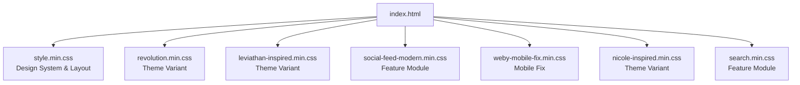
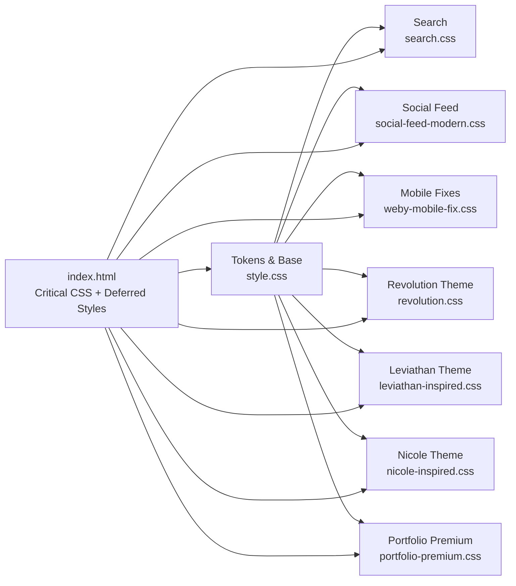
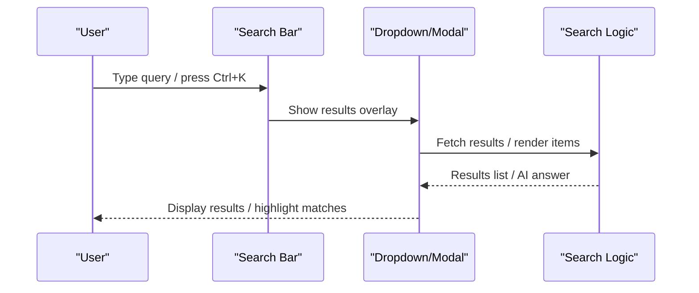
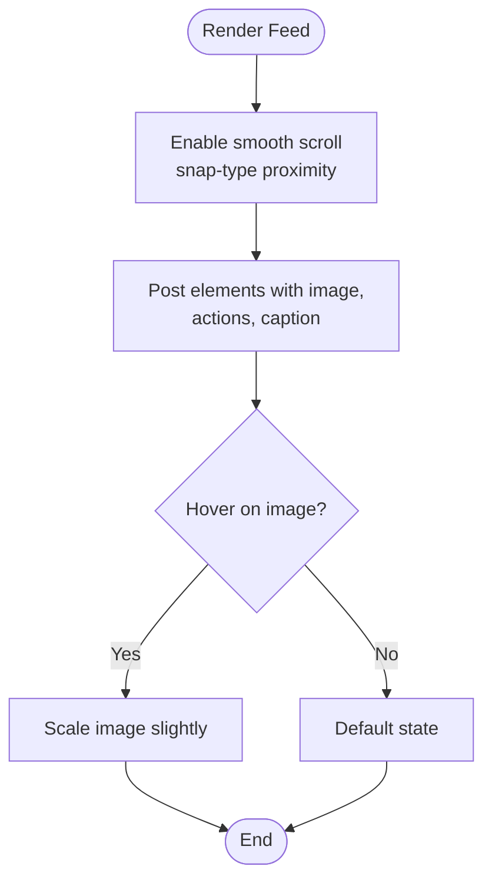
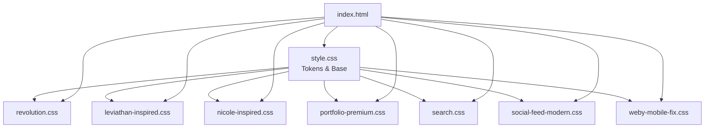

# CSS Architecture & Styling

<cite>
**Referenced Files in This Document**
- [style.css](file://css/style.css)
- [revolution.css](file://css/revolution.css)
- [search.css](file://css/search.css)
- [social-feed-modern.css](file://css/social-feed-modern.css)
- [weby-mobile-fix.css](file://css/weby-mobile-fix.css)
- [leviathan-inspired.css](file://css/leviathan-inspired.css)
- [nicole-inspired.css](file://css/nicole-inspired.css)
- [portfolio-premium.css](file://css/portfolio-premium.css)
- [index.html](file://src/html/index.html)
</cite>

## Table of Contents
1. [Introduction](#introduction)
2. [Project Structure](#project-structure)
3. [Core Components](#core-components)
4. [Architecture Overview](#architecture-overview)
5. [Detailed Component Analysis](#detailed-component-analysis)
6. [Dependency Analysis](#dependency-analysis)
7. [Performance Considerations](#performance-considerations)
8. [Troubleshooting Guide](#troubleshooting-guide)
9. [Conclusion](#conclusion)
10. [Appendices](#appendices)

## Introduction
This document explains the CSS architecture and styling system used across the project. It covers modular organization, theme tokens, component-based styles, responsive strategy (mobile-first), utility classes, naming conventions, and how to create new themes or override existing styles. It also addresses browser compatibility, performance optimization, and maintainability practices grounded in the actual codebase.

## Project Structure
The CSS is organized into a core design system plus feature/theme-specific modules:
- Core design system and layout: style.css
- Feature modules: search.css, social-feed-modern.css, weby-mobile-fix.css
- Theme variants: revolution.css, leviathan-inspired.css, nicole-inspired.css, portfolio-premium.css
- Page-level integration: index.html loads critical CSS inline and defers non-critical styles via media="print" + onload

**Diagram sources**
- [index.html:26-31](file://src/html/index.html#L26-L31)

**Section sources**
- [index.html:26-31](file://src/html/index.html#L26-L31)

## Core Components
- Design tokens and base layer: color palette, typography, spacing, radius, shadows, animations, and global resets are centralized in :root variables and base rules.
- Layout primitives: container, grid/flex patterns, hero section, navigation, cards, sections, and footer.
- Feature components: intelligent search UI with dropdown/modal, Instagram-style social feed mockup, mobile chat popup fixes.
- Theme variants: distinct visual treatments for hero, buttons, cards, and sections that can be layered on top of the base.

Key responsibilities by file:
- style.css: Base tokens, reset, utilities, layout, navigation, hero, cookie banner, accessibility helpers, and global animations.
- revolution.css: Hero background effects, button variants, card hover states, scroll reveal utilities, and responsive overrides.
- search.css: Search bar, results dropdown, AI answer block, loading shimmer, and mobile modal behavior.
- social-feed-modern.css: Phone mockup, feed posts, actions, captions, and responsive adjustments.
- weby-mobile-fix.css: Mobile-only overrides for chat widget positioning and sizing.
- leviathan-inspired.css: Impact numbers, modern services grid, testimonials, CTAs, marquee text, pill tags.
- nicole-inspired.css: Highlighter effects, infinite marquee, rotating words, counters, process timeline, feature cards, FAQ accordion, WhatsApp float.
- portfolio-premium.css: Portfolio grid/cards, capability sections, filters, and legacy portfolio styles.

**Section sources**
- [style.css:15-334](file://css/style.css#L15-L334)
- [revolution.css:1-120](file://css/revolution.css#L1-L120)
- [search.css:1-120](file://css/search.css#L1-L120)
- [social-feed-modern.css:1-120](file://css/social-feed-modern.css#L1-L120)
- [weby-mobile-fix.css:1-67](file://css/weby-mobile-fix.css#L1-L67)
- [leviathan-inspired.css:1-120](file://css/leviathan-inspired.css#L1-L120)
- [nicole-inspired.css:1-120](file://css/nicole-inspired.css#L1-L120)
- [portfolio-premium.css:1-120](file://css/portfolio-premium.css#L1-L120)

## Architecture Overview
The architecture follows a layered approach:
- Layer 1: Tokens and base (style.css)
- Layer 2: Feature modules (search.css, social-feed-modern.css, weby-mobile-fix.css)
- Layer 3: Theme variants (revolution.css, leviathan-inspired.css, nicole-inspired.css, portfolio-premium.css)
- Layer 4: Page composition (HTML includes inline critical CSS and loads deferred styles)

**Diagram sources**
- [index.html:26-31](file://src/html/index.html#L26-L31)
- [style.css:168-334](file://css/style.css#L168-L334)

**Section sources**
- [index.html:26-31](file://src/html/index.html#L26-L31)
- [style.css:168-334](file://css/style.css#L168-L334)

## Detailed Component Analysis

### Design Tokens and Theming
- Centralized tokens in :root include colors, gradients, typography, spacing, radii, shadows, durations, and easings. These provide consistent theming across all modules.
- Theme variants reuse these tokens to produce different visual identities without duplicating logic.

Practical implications:
- Changing a token updates the entire site consistently.
- New themes should extend or override tokens where necessary, keeping shared tokens intact.

**Section sources**
- [style.css:168-334](file://css/style.css#L168-L334)

### Layout Patterns (Grid/Flexbox)
- Flexbox is used extensively for navigation, hero content alignment, search bar, and small components.
- CSS Grid powers larger layouts like service grids, impact numbers, and portfolio grids.
- Responsive breakpoints adjust column counts and spacing to ensure readability and usability across devices.

Examples:
- Navigation menu uses flex row with gap and wrap behavior.
- Service and impact grids switch from multi-column to single-column at smaller breakpoints.
- Portfolio grid adapts columns based on available width.

**Section sources**
- [style.css:483-636](file://css/style.css#L483-L636)
- [leviathan-inspired.css:22-75](file://css/leviathan-inspired.css#L22-L75)
- [portfolio-premium.css:74-93](file://css/portfolio-premium.css#L74-L93)

### Mobile-First and Media Query Strategy
- The base styles define defaults; media queries progressively enhance for larger screens.
- Mobile-specific behaviors are isolated in dedicated files (e.g., weby-mobile-fix.css) and within feature modules (search modal).
- Breakpoints commonly used: 480px, 768px, 1024px.

Behavior highlights:
- Search input size and modal behavior adapt for touch targets and safe areas.
- Social feed mockup scales down and adjusts aspect ratios on smaller screens.
- Chat popup repositions and resizes for landscape orientation and very narrow widths.

**Section sources**
- [search.css:613-787](file://css/search.css#L613-L787)
- [social-feed-modern.css:224-365](file://css/social-feed-modern.css#L224-L365)
- [weby-mobile-fix.css:1-67](file://css/weby-mobile-fix.css#L1-L67)

### Component-Based Styling and Naming Conventions
- BEM-like class names are used consistently: .hero, .hero-title, .service-card, .pf-card, .feed-post, etc.
- Utility classes provide reusable behaviors: .gradient-text, .glass, .hover-glow, .sr-only.
- Feature-specific prefixes help scope styles (e.g., pf-* for portfolio).

Guidelines:
- Prefer semantic, descriptive class names aligned with component purpose.
- Keep utilities minimal and focused on cross-cutting concerns.
- Avoid deep nesting; rely on flat, composable classes.

**Section sources**
- [style.css:422-456](file://css/style.css#L422-L456)
- [portfolio-premium.css:73-245](file://css/portfolio-premium.css#L73-L245)
- [social-feed-modern.css:53-209](file://css/social-feed-modern.css#L53-L209)

### Creating New Themes
To add a new theme:
- Create a new CSS file under css/ (e.g., custom-theme.css).
- Use existing tokens from :root for consistency.
- Override component styles selectively (e.g., .hero, .btn, .card) to achieve the desired look.
- Load the theme via index.html using the same deferred pattern as other themes.

Example steps:
- Define any additional tokens if needed.
- Scope overrides to specific components to avoid unintended side effects.
- Test across breakpoints and devices.

**Section sources**
- [style.css:168-334](file://css/style.css#L168-L334)
- [index.html:26-31](file://src/html/index.html#L26-L31)

### Overriding Styles
- To override a theme variant, place your custom CSS after the theme stylesheet in index.html so it takes precedence.
- Use more specific selectors or !important sparingly when absolutely necessary.
- Prefer token overrides in :root for global changes.

Best practices:
- Keep overrides localized to components you intend to change.
- Maintain a clear hierarchy: base → features → themes → overrides.

**Section sources**
- [index.html:26-31](file://src/html/index.html#L26-L31)
- [style.css:168-334](file://css/style.css#L168-L334)

### Implementing Custom Components
- Follow the established naming convention and structure.
- Use tokens for colors, spacing, and typography to stay consistent.
- Ensure responsive behavior via media queries and flexible layouts.
- Add accessibility helpers (e.g., sr-only) and focus states where applicable.

Example pattern:
- Container with grid/flex layout
- Card with hover effects and transitions
- Section header with tag, title, subtitle
- CTA buttons using primary/secondary variants

**Section sources**
- [revolution.css:237-400](file://css/revolution.css#L237-L400)
- [nicole-inspired.css:406-487](file://css/nicole-inspired.css#L406-L487)

### Search Component Flow
The search component provides both desktop dropdown and mobile modal experiences with keyboard shortcuts and AI suggestions.

**Diagram sources**
- [search.css:1-120](file://css/search.css#L1-L120)
- [search.css:142-180](file://css/search.css#L142-L180)
- [search.css:549-787](file://css/search.css#L549-L787)

**Section sources**
- [search.css:1-120](file://css/search.css#L1-L120)
- [search.css:142-180](file://css/search.css#L142-L180)
- [search.css:549-787](file://css/search.css#L549-L787)

### Social Feed Mockup Behavior
The social feed simulates an Instagram-style scrolling experience inside a phone mockup with snap scrolling and hover interactions.

**Diagram sources**
- [social-feed-modern.css:37-61](file://css/social-feed-modern.css#L37-L61)
- [social-feed-modern.css:128-145](file://css/social-feed-modern.css#L128-L145)

**Section sources**
- [social-feed-modern.css:37-61](file://css/social-feed-modern.css#L37-L61)
- [social-feed-modern.css:128-145](file://css/social-feed-modern.css#L128-L145)

## Dependency Analysis
- All theme and feature modules depend on the base tokens and utilities defined in style.css.
- index.html orchestrates load order: critical CSS inline, then deferred styles via media="print" + onload for faster initial paint.
- Some modules have internal dependencies (e.g., search.css defines both desktop dropdown and mobile modal behaviors).

**Diagram sources**
- [index.html:26-31](file://src/html/index.html#L26-L31)
- [style.css:168-334](file://css/style.css#L168-L334)

**Section sources**
- [index.html:26-31](file://src/html/index.html#L26-L31)
- [style.css:168-334](file://css/style.css#L168-L334)

## Performance Considerations
- Critical CSS is inlined in index.html to prevent FOUC and improve LCP.
- Non-critical styles are loaded asynchronously using media="print" + onload to avoid blocking rendering.
- Images use preload with media queries to optimize LCP per viewport.
- Animations and transforms are used judiciously; backdrop-filter and blur are applied where appropriate but balanced against performance.
- Font fallbacks and swap strategies reduce CLS during font loading.

Recommendations:
- Keep deferred styles scoped and minimal.
- Avoid heavy animations on low-power devices; respect prefers-reduced-motion where implemented.
- Monitor Lighthouse metrics for LCP, CLS, and TBT; adjust preload priorities and animation usage accordingly.

**Section sources**
- [index.html:26-31](file://src/html/index.html#L26-L31)
- [style.css:150-153](file://css/style.css#L150-L153)
- [revolution.css:576-603](file://css/revolution.css#L576-L603)

## Troubleshooting Guide
Common issues and resolutions:
- Search not visible on mobile: Ensure the mobile toggle and modal classes are toggled correctly; verify media queries hide desktop search and show mobile controls.
- Chat popup overlapping on small screens: Check weby-mobile-fix.css overrides for bottom/right positioning and height constraints.
- Horizontal scroll caused by large orbs: Adjust orb sizes and positions in theme variants at smaller breakpoints.
- Focus states missing: Add focus-visible outlines for interactive elements; leverage existing focus ring tokens.

Debugging tips:
- Inspect computed styles in DevTools to confirm token values and cascade order.
- Temporarily disable deferred styles to isolate rendering issues.
- Use media query debugging to verify breakpoint behavior.

**Section sources**
- [search.css:549-787](file://css/search.css#L549-L787)
- [weby-mobile-fix.css:1-67](file://css/weby-mobile-fix.css#L1-L67)
- [revolution.css:623-677](file://css/revolution.css#L623-L677)

## Conclusion
The CSS architecture is modular, token-driven, and performance-conscious. The base design system provides a robust foundation, while feature modules and theme variants enable flexible customization. The mobile-first approach ensures usability across devices, and the deferred loading strategy optimizes performance. Following the established naming conventions and token usage will keep the codebase maintainable and scalable.

## Appendices

### Browser Compatibility Notes
- Backdrop-filter and advanced gradients are widely supported; vendor prefixes are included where necessary.
- Modern layout features (grid, flex) are broadly supported; fallbacks are implicit through progressive enhancement.
- Respect user preferences (e.g., reduced motion) where implemented.

[No sources needed since this section provides general guidance]

### Accessibility Practices
- Screen reader-only text via .sr-only.
- Keyboard shortcuts and focus management in search.
- Semantic HTML combined with accessible attributes (aria-label, role).

**Section sources**
- [style.css:409-420](file://css/style.css#L409-L420)
- [search.css:1-120](file://css/search.css#L1-L120)