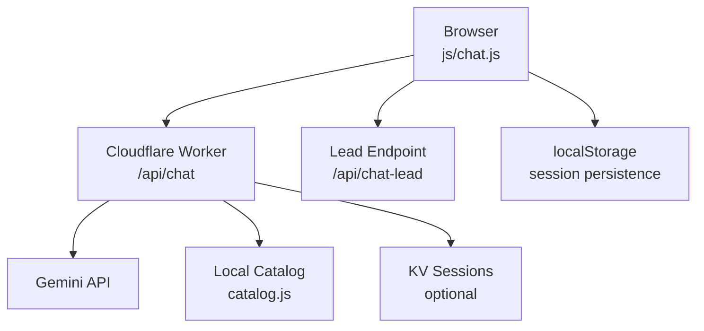
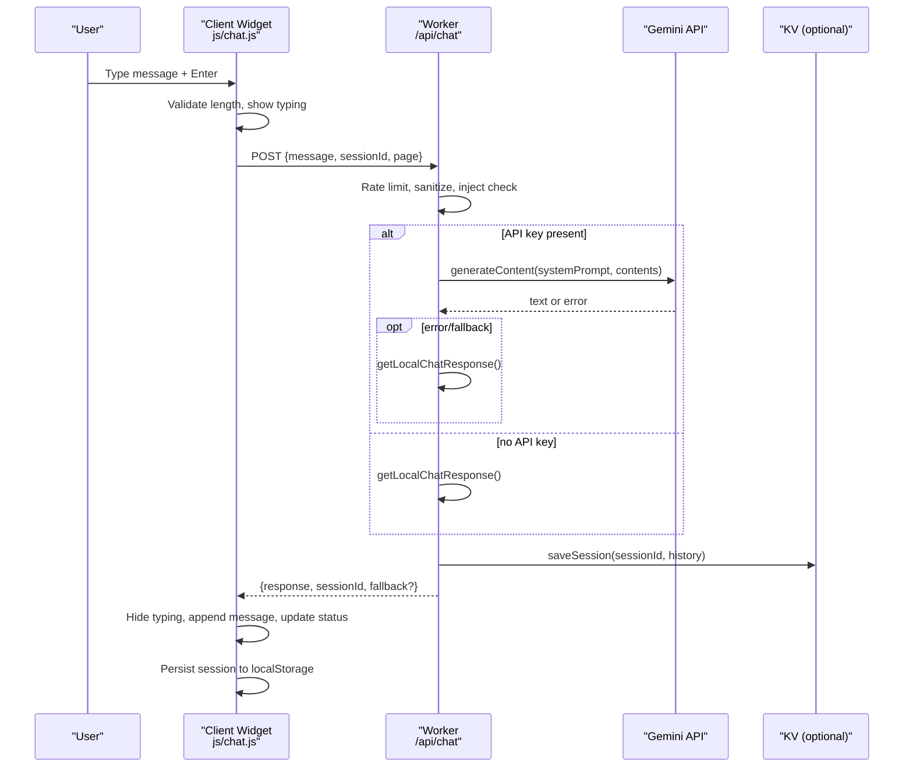
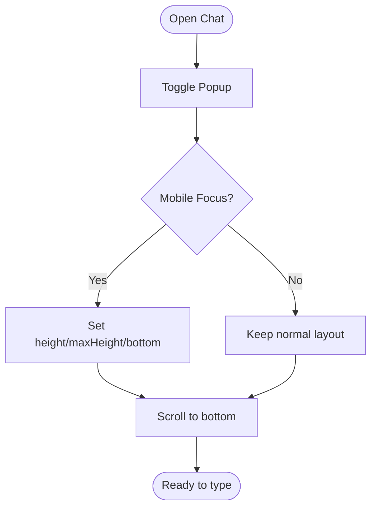
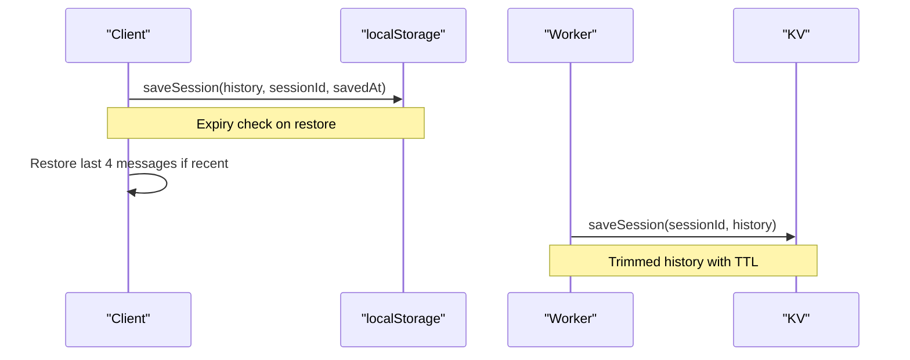
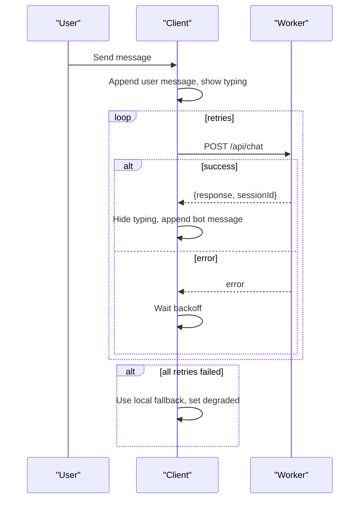
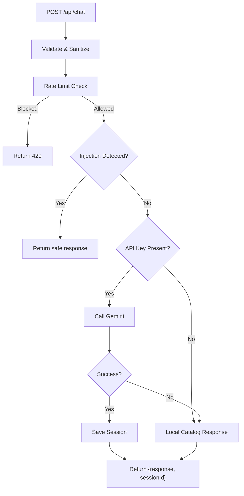
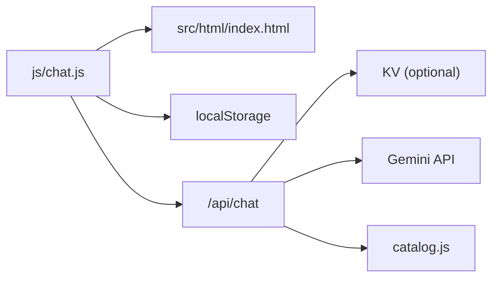

# Chatbot Interface & UI

<cite>
**Referenced Files in This Document**
- [js/chat.js](file://js/chat.js)
- [workers/webnovis-ai/src/index.js](file://workers/webnovis-ai/src/index.js)
- [workers/webnovis-ai/src/catalog.js](file://workers/webnovis-ai/src/catalog.js)
- [chat-config.json](file://chat-config.json)
- [workers/webnovis-ai/data/chat-config.json](file://workers/webnovis-ai/data/chat-config.json)
- [ai-config.js](file://ai-config.js)
- [src/html/index.html](file://src/html/index.html)
- [docs/chatbot/README-CHAT.md](file://docs/chatbot/README-CHAT.md)
- [docs/chatbot/MODELLI-AI.md](file://docs/chatbot/MODELLI-AI.md)
</cite>

## Table of Contents
1. [Introduction](#introduction)
2. [Project Structure](#project-structure)
3. [Core Components](#core-components)
4. [Architecture Overview](#architecture-overview)
5. [Detailed Component Analysis](#detailed-component-analysis)
6. [Dependency Analysis](#dependency-analysis)
7. [Performance Considerations](#performance-considerations)
8. [Troubleshooting Guide](#troubleshooting-guide)
9. [Conclusion](#conclusion)
10. [Appendices](#appendices)

## Introduction
This document explains the AI-powered chatbot interface and user experience, focusing on the chat window component, message history, typing indicators, real-time conversation flow, backend integration with the AI service, error handling and fallbacks, configuration options, message formatting, customization, mobile responsiveness, accessibility, performance optimization, conversation state management, and session persistence.

The chat is a lightweight client widget that renders messages, manages state, and communicates with a Cloudflare Worker backend to obtain AI-generated responses. It includes robust fallback behavior when the AI service is unavailable or returns empty results, ensuring users always receive helpful guidance.

## Project Structure
The chat system spans frontend JavaScript, HTML markup, and a backend worker:
- Frontend widget: js/chat.js handles UI, events, state, retries, and local fallbacks.
- Backend API: workers/webnovis-ai/src/index.js implements endpoints for chat, health, search, and lead capture.
- Configuration: chat-config.json (client-side) and workers/webnovis-ai/data/chat-config.json (server-side) define company info, services, pricing, and bot instructions.
- AI model config: ai-config.js defines models and parameters used by server-side logic.
- Markup: src/html/index.html contains the chat button, popup container, messages area, input, and send controls.

**Diagram sources**
- [js/chat.js:430-580](file://js/chat.js#L430-L580)
- [workers/webnovis-ai/src/index.js:266-368](file://workers/webnovis-ai/src/index.js#L266-L368)
- [workers/webnovis-ai/src/catalog.js:57-133](file://workers/webnovis-ai/src/catalog.js#L57-L133)

**Section sources**
- [js/chat.js:1-797](file://js/chat.js#L1-L797)
- [workers/webnovis-ai/src/index.js:1-544](file://workers/webnovis-ai/src/index.js#L1-L544)
- [chat-config.json:1-109](file://chat-config.json#L1-L109)
- [workers/webnovis-ai/data/chat-config.json:1-109](file://workers/webnovis-ai/data/chat-config.json#L1-L109)
- [ai-config.js:1-38](file://ai-config.js#L1-L38)
- [src/html/index.html:723-758](file://src/html/index.html#L723-L758)

## Core Components
- Chat widget (js/chat.js): Initializes UI, manages open/close states, handles input, sends messages, shows typing indicators, formats bot content, persists sessions, detects lead intent, and manages connection status.
- Backend worker (index.js): Validates requests, rate limits, sanitizes inputs, builds system prompts from chat-config, retrieves/saves sessions, calls Gemini with fallback, and returns responses or local fallbacks.
- Catalog (catalog.js): Provides consistent pricing and fallback responses aligned with public service data.
- Config files: chat-config.json (client), workers/webnovis-ai/data/chat-config.json (server), ai-config.js (models and generation parameters).
- HTML elements: chatButton, chatPopup, chatMessages, chatInput, chatSend, bubble, close controls.

Key responsibilities:
- Real-time conversation flow with retry and adaptive typing delay.
- Error handling with degraded mode and offline guide.
- Session persistence via localStorage and optional server-side KV.
- Accessibility features: ARIA roles, live regions, keyboard navigation.
- Mobile UX: full-screen popup on focus, scroll lock, safe viewport adjustments.

**Section sources**
- [js/chat.js:35-797](file://js/chat.js#L35-L797)
- [workers/webnovis-ai/src/index.js:153-368](file://workers/webnovis-ai/src/index.js#L153-L368)
- [workers/webnovis-ai/src/catalog.js:57-133](file://workers/webnovis-ai/src/catalog.js#L57-L133)
- [chat-config.json:1-109](file://chat-config.json#L1-L109)
- [workers/webnovis-ai/data/chat-config.json:1-109](file://workers/webnovis-ai/data/chat-config.json#L1-L109)
- [ai-config.js:1-38](file://ai-config.js#L1-L38)
- [src/html/index.html:723-758](file://src/html/index.html#L723-L758)

## Architecture Overview
The chat follows a client-server architecture with resilient fallbacks:
- The client sends POST /api/chat with message, sessionId, and currentPage.
- The worker validates, rate-limits, and checks for prompt injection patterns.
- If configured, it calls Gemini with a system prompt built from chat-config; otherwise, it uses local catalog responses.
- Responses are saved into session history and returned to the client.
- On failure or empty response, the worker returns a local fallback marked as degraded; the client displays a status bar and continues offering help.

**Diagram sources**
- [js/chat.js:430-580](file://js/chat.js#L430-L580)
- [workers/webnovis-ai/src/index.js:266-368](file://workers/webnovis-ai/src/index.js#L266-L368)
- [workers/webnovis-ai/src/catalog.js:57-133](file://workers/webnovis-ai/src/catalog.js#L57-L133)

## Detailed Component Analysis

### Chat Window Component
- Elements: chatButton opens/closes chatPopup; chatMessages logs conversation; chatInput accepts text; chatSend triggers sendMessage; bubble indicates availability; close hides popup.
- State: isOpen, isTyping, history, hasInteracted, scrollLocked, leadCaptured, messageCount, sessionId, connection.
- Events: click handlers for toggle/close/send; quick replies; outside-click close on desktop; keyboard Enter to send; focus/blur for mobile UX.
- Formatting: Bot messages support inline icons, bold, code, email links, WhatsApp links, URLs; lists are auto-detected and rendered as ordered or unordered lists.
- Typing indicator: Shows animated dots while waiting for response; hidden after response arrives.
- Connection status: Displays a status bar when degraded; updates to online when healthy.

**Diagram sources**
- [js/chat.js:258-335](file://js/chat.js#L258-L335)

**Section sources**
- [js/chat.js:35-335](file://js/chat.js#L35-L335)
- [src/html/index.html:723-758](file://src/html/index.html#L723-L758)

### Message History and Persistence
- In-memory history: Maintains recent messages up to a configurable limit to keep context concise.
- Local storage: Saves history and sessionId with timestamp; restores last few messages on reload if within expiry window.
- Server-side session: Optional KV store keeps trimmed history per sessionId with TTL; worker saves each turn.

**Diagram sources**
- [js/chat.js:605-644](file://js/chat.js#L605-L644)
- [workers/webnovis-ai/src/index.js:178-196](file://workers/webnovis-ai/src/index.js#L178-L196)

**Section sources**
- [js/chat.js:605-644](file://js/chat.js#L605-L644)
- [workers/webnovis-ai/src/index.js:178-196](file://workers/webnovis-ai/src/index.js#L178-L196)

### Real-Time Conversation Flow and Typing Indicators
- sendMessage validates input, appends user message, shows typing indicator, and calls fetchResponseWithRetry.
- Adaptive typing delay: Ensures minimum perceived response time proportional to response length.
- Retry logic: Exponential backoff with max retries; falls back to local guide if all attempts fail.
- Degraded mode: When fallback is used, sets connection state to degraded and shows a status bar explaining offline guidance.

**Diagram sources**
- [js/chat.js:430-580](file://js/chat.js#L430-L580)
- [workers/webnovis-ai/src/index.js:266-368](file://workers/webnovis-ai/src/index.js#L266-L368)

**Section sources**
- [js/chat.js:430-580](file://js/chat.js#L430-L580)
- [workers/webnovis-ai/src/index.js:266-368](file://workers/webnovis-ai/src/index.js#L266-L368)

### Backend Integration and Error Handling
- Endpoints:
  - /api/chat: Handles chat messages, rate limiting, prompt injection detection, session retrieval/saving, Gemini call with fallback, and response formatting.
  - /api/chat-lead: Captures lead signals (fire-and-forget) and optionally emails notifications.
  - /api/health: Health check endpoint for keep-alive warm-up.
- Error handling:
  - Input validation and sanitization.
  - Rate limiting with 429 responses.
  - Prompt injection protection with safe responses.
  - Fallback to local catalog responses on API errors or missing keys.
  - Empty response treated as error to trigger degraded mode.

**Diagram sources**
- [workers/webnovis-ai/src/index.js:266-368](file://workers/webnovis-ai/src/index.js#L266-L368)
- [workers/webnovis-ai/src/catalog.js:57-133](file://workers/webnovis-ai/src/catalog.js#L57-L133)

**Section sources**
- [workers/webnovis-ai/src/index.js:266-368](file://workers/webnovis-ai/src/index.js#L266-L368)
- [workers/webnovis-ai/src/catalog.js:57-133](file://workers/webnovis-ai/src/catalog.js#L57-L133)

### Chat Configuration Options
- Client-side CHAT_CONFIG:
  - apiEndpoint, leadEndpoint, healthCheckUrl
  - maxMessageLength, maxHistoryLength
  - minTypingTime, maxTypingTime
  - keepAliveInterval, maxRetries, retryDelay
  - storageKey, storageExpiry
- Server-side chat-config.json:
  - companyInfo, services, timeline, chatbotInstructions
- AI model config:
  - Models for chat/search/writer, temperature, maxTokens, memory, fallback behavior.

Customization points:
- Adjust message length limits, history size, typing delays, retries, and storage expiry in CHAT_CONFIG.
- Update company info, services, pricing, and bot instructions in chat-config.json files.
- Modify model selection and generation parameters in ai-config.js.

**Section sources**
- [js/chat.js:8-21](file://js/chat.js#L8-L21)
- [chat-config.json:1-109](file://chat-config.json#L1-L109)
- [workers/webnovis-ai/data/chat-config.json:1-109](file://workers/webnovis-ai/data/chat-config.json#L1-L109)
- [ai-config.js:1-38](file://ai-config.js#L1-L38)

### Message Formatting and Custom Styling
- Inline formatting:
  - Icons via placeholders mapped to SVG strings.
  - Bold text, code snippets, email links, WhatsApp links, and URLs.
  - Lists auto-detected and rendered as ordered or unordered lists.
- Styling hooks:
  - CSS classes for messages, avatars, rich content, typing indicator, status bar, and input wrapper.
  - Character counter injected near input with live region for accessibility.
- Appearance customization:
  - Override CSS classes to adjust colors, fonts, spacing, and responsive behavior.
  - Replace avatar images or inline icon definitions in the widget.

**Section sources**
- [js/chat.js:355-428](file://js/chat.js#L355-L428)
- [js/chat.js:740-771](file://js/chat.js#L740-L771)

### Initialization, Event Handling, and Customization Examples
- Initialization:
  - DOMContentLoaded triggers initWebyChatbot; ensures critical elements exist before setup.
  - Sets up event listeners for toggle, close, input, send, quick replies, and outside clicks.
- Event handling:
  - Enter key sends message; Shift+Enter allows new lines.
  - Quick reply buttons populate input and send automatically.
  - Mobile focus/blur adjusts popup layout and scroll behavior.
- Customization examples:
  - Change API endpoints and timeouts in CHAT_CONFIG.
  - Update chatbot personality and services in chat-config.json.
  - Extend formatting rules in formatInlineBotContent/formatBotMessage.
  - Add custom styles via CSS overrides for chat-popup, chat-messages, and input components.

**Section sources**
- [js/chat.js:35-244](file://js/chat.js#L35-L244)
- [js/chat.js:781-797](file://js/chat.js#L781-L797)

### Mobile Responsiveness and Accessibility
- Mobile responsiveness:
  - Detects touch devices and small screens; switches to full-height popup on focus.
  - Locks background scroll during chat open; restores on close.
  - Delays keep-alive warm-up on mobile to reduce unnecessary network activity.
- Accessibility:
  - ARIA roles: log for messages, status for notices and counters, polite live regions for dynamic updates.
  - Keyboard navigation: Enter to send; focus management on open/close.
  - Screen reader announcements for character count thresholds and connection status changes.
  - AI transparency notice included for compliance and clarity.

**Section sources**
- [js/chat.js:112-144](file://js/chat.js#L112-L144)
- [js/chat.js:168-224](file://js/chat.js#L168-L224)
- [js/chat.js:258-335](file://js/chat.js#L258-L335)
- [js/chat.js:504-531](file://js/chat.js#L504-L531)

### Performance Optimization
- Client-side:
  - Adaptive typing delay prevents premature hiding of typing indicator.
  - AbortController with timeout for fetch requests; longer timeouts on retries.
  - Local fallback avoids blocking UX when backend fails.
  - Minimal DOM updates; requestAnimationFrame for scrolling.
- Server-side:
  - Rate limiting protects against abuse.
  - Session trimming reduces payload sizes.
  - Optional KV caching for search responses.
  - System prompt caching to avoid recomputation.

[No sources needed since this section provides general guidance]

## Dependency Analysis
- Client dependencies:
  - DOM APIs for element queries, event listeners, and rendering.
  - Fetch API for HTTP requests with CORS and abort signals.
  - localStorage for session persistence.
- Server dependencies:
  - Cloudflare Workers runtime.
  - Optional KV storage for sessions and caches.
  - Google Gemini API for AI responses.
  - Optional Brevo email for lead notifications.

**Diagram sources**
- [js/chat.js:430-580](file://js/chat.js#L430-L580)
- [workers/webnovis-ai/src/index.js:266-368](file://workers/webnovis-ai/src/index.js#L266-L368)
- [workers/webnovis-ai/src/catalog.js:57-133](file://workers/webnovis-ai/src/catalog.js#L57-L133)

**Section sources**
- [js/chat.js:430-580](file://js/chat.js#L430-L580)
- [workers/webnovis-ai/src/index.js:266-368](file://workers/webnovis-ai/src/index.js#L266-L368)
- [workers/webnovis-ai/src/catalog.js:57-133](file://workers/webnovis-ai/src/catalog.js#L57-L133)

## Performance Considerations
- Keep message payloads small by truncating long inputs and trimming history.
- Use adaptive timeouts and retries to balance responsiveness and reliability.
- Avoid excessive polling; use one-time keep-alive warm-up instead of periodic heartbeats.
- Leverage local fallbacks to maintain UX under degraded conditions.
- Cache frequently used data (system prompt, search results) where possible.

[No sources needed since this section provides general guidance]

## Troubleshooting Guide
Common issues and resolutions:
- Chat does not open:
  - Ensure required DOM elements exist (chatButton, chatPopup).
  - Check browser console for initialization errors.
- Backend unavailable:
  - Verify CORS settings and allowed origins.
  - Confirm API endpoint URL and environment variables.
  - Check rate limit responses (429) and retry strategy.
- Generic responses:
  - Confirm AI API key presence and quota.
  - Inspect worker logs for errors; verify fallback activation.
- No responses or empty output:
  - Treat empty responses as errors; ensure fallback path is triggered.
  - Review message sanitization and length constraints.

Operational tips:
- Use /api/health to verify service status.
- Monitor lead capture endpoint for successful notifications.
- Adjust retryDelay and maxRetries based on observed latency.

**Section sources**
- [workers/webnovis-ai/src/index.js:519-541](file://workers/webnovis-ai/src/index.js#L519-L541)
- [js/chat.js:472-479](file://js/chat.js#L472-L479)
- [docs/chatbot/README-CHAT.md:148-166](file://docs/chatbot/README-CHAT.md#L148-L166)

## Conclusion
The chatbot interface delivers a responsive, accessible, and resilient conversational experience. It integrates seamlessly with a Cloudflare Worker backend that leverages Google Gemini with robust fallbacks, ensuring users receive helpful guidance even under degraded conditions. Configuration files allow easy customization of personality, services, and pricing, while client-side optimizations improve performance and mobile usability. Session persistence maintains continuity across reloads, and comprehensive error handling safeguards the user experience.

[No sources needed since this section summarizes without analyzing specific files]

## Appendices

### API Endpoints Summary
- GET /api/health: Service health and metadata.
- POST /api/chat: Send message, receive AI or fallback response.
- POST /api/chat-lead: Capture lead signals and notify team.
- POST /api/search-ai: Search bar AI query (related feature).

**Section sources**
- [workers/webnovis-ai/src/index.js:519-541](file://workers/webnovis-ai/src/index.js#L519-L541)

### Model Configuration Reference
- Primary chat model: gemini-2.5-flash-lite
- Fallback chat model: gemini-2.5-flash
- Parameters: temperature 0.7, maxTokens 800, conversation memory up to 20 messages.

**Section sources**
- [ai-config.js:1-38](file://ai-config.js#L1-L38)
- [docs/chatbot/MODELLI-AI.md:1-54](file://docs/chatbot/MODELLI-AI.md#L1-L54)