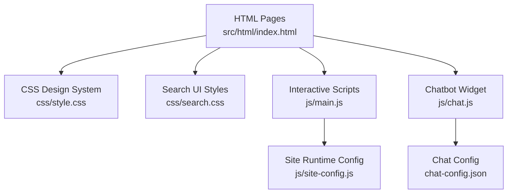
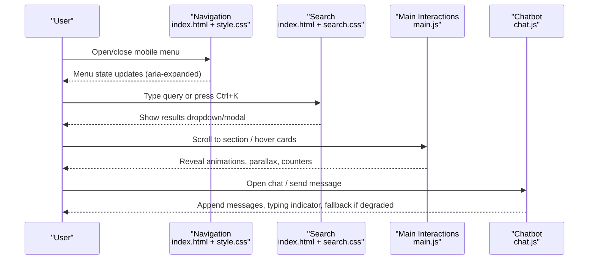
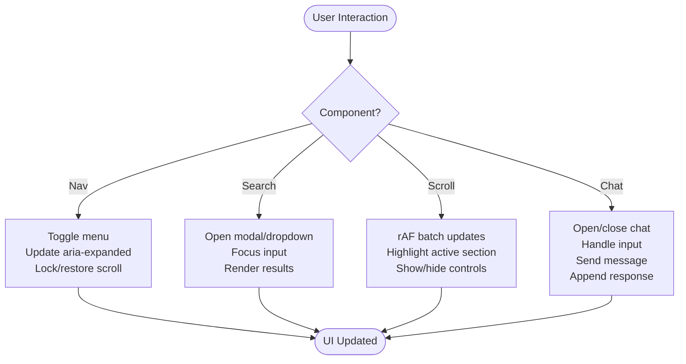
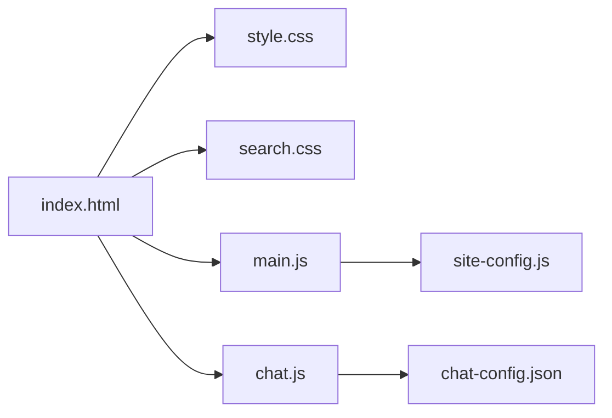

# Frontend Components & UI

<cite>
**Referenced Files in This Document**
- [index.html](file://src/html/index.html)
- [style.css](file://css/style.css)
- [search.css](file://css/search.css)
- [main.js](file://js/main.js)
- [chat.js](file://js/chat.js)
- [site-config.js](file://js/site-config.js)
- [chat-config.json](file://chat-config.json)
</cite>

## Update Summary
**Changes Made**
- Added documentation for new tertiary link style 'link-arrow' with animated underline effects and accessibility focus states
- Enhanced Hero section documentation with microcopy support through .hero-microcopy class
- Updated CSS architecture section to include new link styling patterns
- Added examples for using the new link-arrow component

## Table of Contents
1. [Introduction](#introduction)
2. [Project Structure](#project-structure)
3. [Core Components](#core-components)
4. [Architecture Overview](#architecture-overview)
5. [Detailed Component Analysis](#detailed-component-analysis)
6. [Dependency Analysis](#dependency-analysis)
7. [Performance Considerations](#performance-considerations)
8. [Troubleshooting Guide](#troubleshooting-guide)
9. [Conclusion](#conclusion)
10. [Appendices](#appendices)

## Introduction
This document explains the WebNovis frontend components and user interface with a focus on responsive design, CSS architecture, interactive JavaScript features, accessibility, performance, and cross-browser strategies. It provides concrete examples for extending the UI while maintaining consistency across pages.

## Project Structure
The frontend is organized into:
- HTML templates under src/html (e.g., index.html)
- Styles under css (design system, search, theme variants)
- Client-side scripts under js (navigation, animations, chatbot, site config)
- Configuration files for runtime behavior (chat-config.json, site-config.js)

**Diagram sources**
- [index.html:35-62](file://src/html/index.html#L35-L62)
- [style.css:168-315](file://css/style.css#L168-L315)
- [search.css:1-120](file://css/search.css#L1-L120)
- [main.js:1-120](file://js/main.js#L1-L120)
- [chat.js:35-145](file://js/chat.js#L35-L145)
- [chat-config.json:1-20](file://chat-config.json#L1-L20)
- [site-config.js:10-18](file://js/site-config.js#L10-L18)

**Section sources**
- [index.html:35-62](file://src/html/index.html#L35-L62)
- [style.css:168-315](file://css/style.css#L168-L315)
- [search.css:1-120](file://css/search.css#L1-L120)
- [main.js:1-120](file://js/main.js#L1-L120)
- [chat.js:35-145](file://js/chat.js#L35-L145)
- [chat-config.json:1-20](file://chat-config.json#L1-L20)
- [site-config.js:10-18](file://js/site-config.js#L10-L18)

## Core Components
- Navigation: floating nav with mobile menu toggle, scroll-aware styling, and active link highlighting.
- Search: inline search bar with dropdown results and a full-screen modal on mobile; keyboard shortcuts and accessible roles.
- Chatbot: persistent widget with message history, typing indicators, fallback offline mode, and lead intent detection.
- Animations: Intersection Observer-based reveals, parallax orbs, particle canvas, magnetic/tilt effects, counters, and smooth scrolling.
- Forms and configuration: site-wide form submission settings via site-config.js; chat behavior via chat-config.json.
- **New**: Tertiary link style 'link-arrow' with animated underline effects and proper focus states for accessibility.
- **Enhanced**: Hero section with microcopy support through .hero-microcopy class positioned below main CTA buttons.

**Section sources**
- [index.html:35-62](file://src/html/index.html#L35-L62)
- [style.css:464-599](file://css/style.css#L464-L599)
- [style.css:979-1004](file://css/style.css#L979-L1004)
- [style.css:851-860](file://css/style.css#L851-L860)
- [search.css:1-120](file://css/search.css#L1-L120)
- [main.js:56-156](file://js/main.js#L56-L156)
- [chat.js:35-145](file://js/chat.js#L35-L145)
- [site-config.js:10-18](file://js/site-config.js#L10-L18)
- [chat-config.json:1-20](file://chat-config.json#L1-L20)

## Architecture Overview
The UI follows a modular, component-driven approach:
- HTML defines semantic structure and accessibility attributes.
- CSS uses custom properties for theming, fluid typography, spacing tokens, and media queries for responsive breakpoints.
- JS orchestrates interactions, lazy initialization, and performance optimizations (rAF throttling, IntersectionObserver).

**Diagram sources**
- [index.html:35-62](file://src/html/index.html#L35-L62)
- [search.css:142-180](file://css/search.css#L142-L180)
- [main.js:44-176](file://js/main.js#L44-L176)
- [chat.js:146-228](file://js/chat.js#L146-L228)

## Detailed Component Analysis

### Responsive Design System (Mobile-First, CSS Grid/Flexbox, Themes)
- Mobile-first base styles with progressive enhancement at larger breakpoints.
- Fluid typography using clamp() and consistent spacing tokens.
- Color tokens and gradients define brand themes; dark mode defaults with light accents.
- Layouts use Flexbox for navigation and hero content; CSS Grid for service sections and cards.
- Media queries adjust layouts at common breakpoints (e.g., 768px, 1024px) and include mobile-specific fixes.

Examples:
- Custom properties for colors, typography, spacing, shadows, and animation durations are centralized in :root.
- Hero uses flex centering and a responsive background image strategy to optimize LCP.
- Service sections switch from stacked to side-by-side layouts at larger widths.
- **Updated**: New tertiary link style 'link-arrow' provides elegant text links with animated underline effects using CSS gradients and proper focus states for accessibility.

**Section sources**
- [style.css:168-315](file://css/style.css#L168-L315)
- [style.css:439-454](file://css/style.css#L439-L454)
- [style.css:612-731](file://css/style.css#L612-L731)
- [style.css:979-1004](file://css/style.css#L979-L1004)
- [index.html:63-76](file://src/html/index.html#L63-L76)

### Interactive JavaScript Components
- Navigation:
  - Mobile menu toggles with body scroll lock and aria-expanded state management.
  - Smooth anchor scrolling with offset for fixed header; prefers native smooth on mobile for performance.
  - Active link highlighting based on scroll position using cached section geometry.
- Animations:
  - IntersectionObserver triggers reveal classes for fade-in/staggered animations.
  - Unified scroll controller batches DOM reads/writes per frame (rAF) for nav states, parallax orbs, progress bar, back-to-top visibility, and WhatsApp float.
  - Particle canvas runs only when visible and reduced on mobile or when motion is preferred.
  - Magnetic and 3D tilt effects bound to pointer movement with requestAnimationFrame throttling.
  - Number counters animate when entering viewport.
- Search:
  - Desktop dropdown and mobile modal with keyboard support and accessible roles (combobox, listbox, dialog).
  - Results styled with glassmorphism and optimized transitions.
- Chatbot:
  - Toggle open/close with mobile keyboard handling and scroll locking.
  - Message formatting supports lists, code snippets, icons, and links; includes AI transparency notice.
  - Retry logic with exponential backoff; local fallback responses when API is unavailable; connection status bar announced to assistive tech.
  - Session persistence via localStorage with expiry; quick replies and character counter with live region announcements.

**Diagram sources**
- [main.js:56-156](file://js/main.js#L56-L156)
- [main.js:178-284](file://js/main.js#L178-L284)
- [main.js:430-550](file://js/main.js#L430-L550)
- [search.css:549-787](file://css/search.css#L549-L787)
- [chat.js:146-228](file://js/chat.js#L146-L228)

**Section sources**
- [main.js:44-176](file://js/main.js#L44-L176)
- [main.js:178-284](file://js/main.js#L178-L284)
- [main.js:430-550](file://js/main.js#L430-550)
- [main.js:552-598](file://js/main.js#L552-L598)
- [main.js:600-731](file://js/main.js#L600-L731)
- [search.css:142-180](file://css/search.css#L142-L180)
- [search.css:549-787](file://css/search.css#L549-L787)
- [chat.js:146-228](file://js/chat.js#L146-L228)
- [chat.js:430-479](file://js/chat.js#L430-L479)
- [chat.js:581-644](file://js/chat.js#L581-L644)

### CSS Architecture: Custom Properties, Media Queries, Browser Compatibility
- Custom properties centralize colors, typography, spacing, shadows, and animation tokens for consistent theming.
- Fluid typography and spacing improve readability across devices without excessive breakpoints.
- Media queries target common breakpoints (e.g., 768px, 1024px) and include mobile-only adjustments (e.g., hiding desktop search, showing mobile toggle).
- Backdrop filters and glass effects are used with vendor prefixes where needed; graceful degradation applies when unsupported.
- Safe font fallbacks prevent layout shifts during web font loading.

Examples:
- Theme tokens in :root enable easy customization of brand colors and gradients.
- Search modal switches to full-screen overlay on small screens with safe-area padding.
- Hero avoids opacity:0 initial state to ensure LCP is measurable and paint-ready.
- **Updated**: New tertiary link style 'link-arrow' uses CSS gradients for animated underline effects with proper focus-visible states for accessibility compliance.
- **Enhanced**: Hero microcopy support through .hero-microcopy class provides subtle positioning below main CTA buttons with appropriate spacing and visual hierarchy.

**Section sources**
- [style.css:168-315](file://css/style.css#L168-L315)
- [style.css:439-454](file://css/style.css#L439-L454)
- [style.css:851-860](file://css/style.css#L851-L860)
- [style.css:979-1004](file://css/style.css#L979-L1004)
- [search.css:549-787](file://css/search.css#L549-L787)
- [index.html:27-31](file://src/html/index.html#L27-L31)

### Accessibility Features: Keyboard Navigation and Screen Reader Support
- Skip-to-content link for keyboard users.
- Semantic roles and attributes:
  - Search combobox/listbox/dialog with aria-controls, aria-expanded, aria-modal.
  - Chat inputs and status regions use aria-live for dynamic updates.
  - Buttons have descriptive aria-labels; decorative icons use aria-hidden.
- Focus management:
  - Input focus after opening chat; modal close button available.
- Motion preferences:
  - Reduced motion respected for heavy animations; particles disabled when preferred.
- **Enhanced**: Link arrow component includes proper focus-visible states with outline and border-radius for keyboard navigation accessibility.

**Section sources**
- [index.html:32-35](file://src/html/index.html#L32-L35)
- [index.html:40-62](file://src/html/index.html#L40-L62)
- [style.css:1000-1004](file://css/style.css#L1000-L1004)
- [search.css:142-180](file://css/search.css#L142-L180)
- [chat.js:112-145](file://js/chat.js#L112-L145)
- [chat.js:168-228](file://js/chat.js#L168-L228)
- [main.js:21-40](file://js/main.js#L21-L40)

### Progressive Enhancement and Graceful Degradation
- Critical CSS inlined for fast first paint; non-critical styles loaded asynchronously.
- Non-JS fallbacks:
  - NoScript block loads essential styles.
  - Search works with basic markup; JS enhances interactivity.
- Performance-conscious enhancements:
  - requestIdleCallback defers heavy tasks (particles, hero FX).
  - IntersectionObserver gates animations and lazy loading.
  - rAF-throttled scroll handlers avoid jank.

**Section sources**
- [index.html:27-31](file://src/html/index.html#L27-L31)
- [main.js:21-40](file://js/main.js#L21-L40)
- [main.js:430-550](file://js/main.js#L430-L550)
- [main.js:178-284](file://js/main.js#L178-L284)

### Cross-Browser Compatibility, Mobile Touch, and Responsive Breakpoints
- Vendor prefixes for backdrop-filter and text-fill-color; fallbacks provided.
- Touch-friendly targets (minimum 44x44px) for buttons and toggles.
- Mobile-specific behaviors:
  - Body scroll lock when menus or chat are open.
  - Full-screen search modal with safe-area insets.
  - Reduced particle count and skipped continuous tilt on touch devices.
- Breakpoints:
  - Common thresholds at 768px and 1024px; additional fine-grained rules for very small screens.

**Section sources**
- [search.css:549-787](file://css/search.css#L549-L787)
- [style.css:587-609](file://css/style.css#L587-L609)
- [main.js:566-598](file://js/main.js#L566-L598)
- [chat.js:256-335](file://js/chat.js#L256-L335)

### Extending the UI: Guidelines and Best Practices
- Use existing tokens:
  - Colors, typography, spacing, and shadows from :root to maintain consistency.
- Follow component patterns:
  - Cards and sections use consistent spacing, borders, and hover states.
  - Buttons follow primary/secondary patterns with gradient backgrounds and subtle transforms.
  - **New**: Use link-arrow class for tertiary links requiring subtle interaction feedback with animated underline effects.
- Add new components:
  - Keep mobile-first; enhance with media queries for larger screens.
  - Ensure accessibility: semantic elements, roles, labels, and focus management.
  - Gate animations behind IntersectionObserver and respect prefers-reduced-motion.
- Event handling:
  - Use passive listeners for scroll/resize where possible.
  - Debounce or throttle expensive operations; prefer rAF for visual updates.

**Section sources**
- [style.css:168-315](file://css/style.css#L168-L315)
- [style.css:403-454](file://css/style.css#L403-L454)
- [style.css:979-1004](file://css/style.css#L979-L1004)
- [main.js:178-284](file://js/main.js#L178-L284)
- [main.js:430-550](file://js/main.js#L430-L550)

## Dependency Analysis
- HTML depends on CSS for presentation and JS for interactivity.
- main.js coordinates multiple UI aspects (nav, scroll, animations) and relies on CSS classes defined in style.css.
- chat.js depends on chat-config.json for endpoints and behavior; it also integrates with site-config.js for form submission modes.
- search.css defines styles consumed by search elements in index.html; JS enhances behavior (not shown here but implied by roles and IDs).

**Diagram sources**
- [index.html:35-62](file://src/html/index.html#L35-L62)
- [style.css:168-315](file://css/style.css#L168-L315)
- [search.css:1-120](file://css/search.css#L1-L120)
- [main.js:1-120](file://js/main.js#L1-L120)
- [chat.js:35-145](file://js/chat.js#L35-L145)
- [chat-config.json:1-20](file://chat-config.json#L1-L20)
- [site-config.js:10-18](file://js/site-config.js#L10-L18)

**Section sources**
- [index.html:35-62](file://src/html/index.html#L35-L62)
- [style.css:168-315](file://css/style.css#L168-L315)
- [search.css:1-120](file://css/search.css#L1-L120)
- [main.js:1-120](file://js/main.js#L1-L120)
- [chat.js:35-145](file://js/chat.js#L35-L145)
- [chat-config.json:1-20](file://chat-config.json#L1-L20)
- [site-config.js:10-18](file://js/site-config.js#L10-L18)

## Performance Considerations
- LCP optimization:
  - Hero uses an  element with high priority preload and no opacity:0 initial state.
  - Critical CSS inlined; non-critical styles deferred.
- Animation efficiency:
  - IntersectionObserver triggers animations only when visible.
  - rAF-throttled scroll handlers reduce reflows.
  - Particles disabled or reduced on mobile and when reduced motion is preferred.
- Memory and CPU:
  - Debounced resize and idle callbacks defer heavy work.
  - Cached section geometry avoids forced reflow on every scroll.
- Network:
  - Preconnect and dns-prefetch for external resources.
  - Lazy loading for images beyond the fold.

**Section sources**
- [index.html:27-31](file://src/html/index.html#L27-L31)
- [index.html:63-68](file://src/html/index.html#L63-L68)
- [main.js:21-40](file://js/main.js#L21-L40)
- [main.js:178-284](file://js/main.js#L178-L284)
- [main.js:430-550](file://js/main.js#L430-L550)

## Troubleshooting Guide
- Chatbot not responding:
  - Check network requests and health endpoint; degraded mode shows a status bar and offers offline guidance.
  - Verify chat-config.json endpoints and CORS settings.
- Search modal not opening on mobile:
  - Ensure .search-mobile-toggle is present and that media queries show the modal at <=768px.
  - Confirm focus management and aria-modal attributes.
- Animations causing jank:
  - Reduce particle counts or disable on low-end devices; ensure prefers-reduced-motion is respected.
  - Use rAF-throttled handlers and avoid layout thrashing in scroll events.
- Form submission issues:
  - Confirm FORM_SUBMIT_MODE and TURNSTILE_SITEKEY in site-config.js; verify proxy URL if using server-side verification.
- Link arrow styling issues:
  - Ensure proper CSS gradient implementation and focus-visible states are applied correctly.
  - Check that color variables are properly defined in custom properties.

**Section sources**
- [chat.js:481-580](file://js/chat.js#L481-L580)
- [chat.js:504-531](file://js/chat.js#L504-L531)
- [search.css:549-787](file://css/search.css#L549-L787)
- [main.js:430-550](file://js/main.js#L430-L550)
- [style.css:979-1004](file://css/style.css#L979-L1004)
- [site-config.js:10-18](file://js/site-config.js#L10-L18)

## Conclusion
WebNovis's frontend combines a robust design system, responsive layouts, and performant interactions. The architecture emphasizes accessibility, progressive enhancement, and cross-browser compatibility. By leveraging custom properties, media queries, and efficient JavaScript patterns, the UI remains scalable and maintainable. Following the guidelines above ensures consistent extensions and reliable user experiences across devices.

## Appendices

### Example Usage: Adding a New Section
- Markup:
  - Wrap content in a semantic <section> with an id for navigation.
  - Use existing grid/flex patterns for layout.
- Styling:
  - Apply spacing tokens and typography variables from :root.
  - Add media queries for stacking on smaller screens.
- Interactivity:
  - Attach reveal class for IntersectionObserver animations.
  - If needed, bind event listeners with passive options and rAF for visuals.

**Section sources**
- [style.css:168-315](file://css/style.css#L168-L315)
- [main.js:44-176](file://js/main.js#L44-L176)

### Example Usage: Customizing Theme Tokens
- Override color tokens in :root to match brand variations.
- Adjust gradients and shadows for emphasis.
- Test contrast ratios for accessibility.

**Section sources**
- [style.css:168-315](file://css/style.css#L168-L315)

### Example Usage: Handling Events Safely
- Use passive listeners for scroll/resize.
- Debounce/throttle expensive computations.
- Respect prefers-reduced-motion for animations.

**Section sources**
- [main.js:178-284](file://js/main.js#L178-L284)
- [main.js:430-550](file://js/main.js#L430-L550)

### Example Usage: Implementing Link Arrow Component
- **Markup**: Use the link-arrow class for tertiary links that need subtle interaction feedback
- **Styling**: The component automatically provides animated underline effects using CSS gradients
- **Accessibility**: Includes proper focus-visible states for keyboard navigation
- **Usage**: Apply to any anchor element requiring tertiary link styling

**Section sources**
- [style.css:979-1004](file://css/style.css#L979-L1004)

### Example Usage: Adding Hero Microcopy
- **Placement**: Position .hero-microcopy element below main CTA buttons in hero section
- **Styling**: Automatically receives appropriate spacing, typography, and visual hierarchy
- **Responsive**: Adapts to mobile viewports with adjusted padding and font sizes
- **Purpose**: Provides supplementary information about CTAs without overwhelming primary actions

**Section sources**
- [style.css:851-860](file://css/style.css#L851-L860)
- [index.html:70-76](file://src/html/index.html#L70-L76)