# Interactive Components & Animations

<cite>
**Referenced Files in This Document**
- [main.js](file://js/main.js)
- [cursor.js](file://js/cursor.js)
- [text-effects.js](file://js/text-effects.js)
- [globe.js](file://js/globe.js)
- [style.css](file://css/style.css)
- [revolution.css](file://css/revolution.css)
- [noncritical-loader.js](file://js/noncritical-loader.js)
</cite>

## Table of Contents
1. [Introduction](#introduction)
2. [Project Structure](#project-structure)
3. [Core Components](#core-components)
4. [Architecture Overview](#architecture-overview)
5. [Detailed Component Analysis](#detailed-component-analysis)
6. [Dependency Analysis](#dependency-analysis)
7. [Performance Considerations](#performance-considerations)
8. [Troubleshooting Guide](#troubleshooting-guide)
9. [Conclusion](#conclusion)

## Introduction
This document explains the interactive components and animation system used across the WebNovis site. It covers:
- Particle canvas with performance optimizations
- Magnetic hover effects on cards
- 3D tilt interactions
- Scroll-triggered animations via Intersection Observer
- Unified scroll controller for parallax, smooth scrolling, back-to-top, and progress bar
- Testimonial slider with auto-rotation
- Counter animations
- Ripple click effects
- Custom cursor implementation
- Text typing and reveal effects
- Lazy loading patterns
- Performance considerations, requestAnimationFrame usage, and graceful degradation for older or low-power devices

## Project Structure
The interactive layer is implemented primarily in JavaScript modules that are loaded at runtime, with supporting CSS classes defining visual states and transitions. Key files:
- js/main.js: Core interactions (scroll controller, particles, magnetic/tilt, counters, testimonials, ripple, lazy load)
- js/cursor.js: Custom non-Newtonian fluid cursor with magnetic attraction
- js/text-effects.js: Scroll-linked text reveal and morphing text cycling
- js/globe.js: Lazy-initialized WebGL globe using an external library
- css/style.css and css/revolution.css: Styles for magnetic, floating 3D, reveal, and card effects
- js/noncritical-loader.js: Defers heavy features until user interaction or idle time

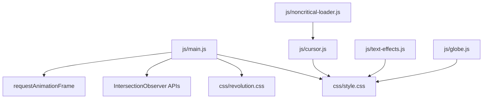

**Diagram sources**
- [main.js:178-284](file://js/main.js#L178-L284)
- [cursor.js:1-167](file://js/cursor.js#L1-L167)
- [text-effects.js:1-220](file://js/text-effects.js#L1-L220)
- [globe.js:1-108](file://js/globe.js#L1-L108)
- [style.css:3290-3489](file://css/style.css#L3290-L3489)
- [revolution.css:577-603](file://css/revolution.css#L577-L603)
- [noncritical-loader.js:73-99](file://js/noncritical-loader.js#L73-L99)

**Section sources**
- [main.js:178-284](file://js/main.js#L178-L284)
- [style.css:3290-3489](file://css/style.css#L3290-L3489)
- [revolution.css:577-603](file://css/revolution.css#L577-L603)
- [noncritical-loader.js:73-99](file://js/noncritical-loader.js#L73-L99)

## Core Components
- Unified scroll controller: centralizes scroll-driven updates (nav state, parallax orbs, background changes, back-to-top visibility, scroll progress, active nav highlighting) using a single rAF-gated passive listener.
- Particle canvas: runs only when visible, reduces particle count and connection frequency on mobile, pauses offscreen.
- Magnetic hover: pointer-based transform with frame throttling to avoid layout thrash.
- 3D tilt: perspective transforms bound to pointer movement; touch fallback uses tap feedback.
- Scroll reveal: Intersection Observer toggles .active on elements with CSS transitions.
- Testimonials slider: auto-rotates while section is visible; pauses otherwise.
- Counters: animate numbers when scrolled into view using requestAnimationFrame.
- Ripple effect: dynamically created element animates on button clicks.
- Custom cursor: physics-based blob with spring, damping, stretch, rotation, and magnetic attraction to targets.
- Text effects: scroll-linked word opacity reveal and morphing text cycling.
- Globe: lazy-loaded via Intersection Observer and dynamic import; paused when offscreen.
- Lazy loading: images with data-src loaded when intersecting.

**Section sources**
- [main.js:44-54](file://js/main.js#L44-L54)
- [main.js:178-284](file://js/main.js#L178-L284)
- [main.js:432-550](file://js/main.js#L432-L550)
- [main.js:552-598](file://js/main.js#L552-L598)
- [main.js:600-633](file://js/main.js#L600-L633)
- [main.js:635-665](file://js/main.js#L635-L665)
- [main.js:673-705](file://js/main.js#L673-L705)
- [main.js:733-768](file://js/main.js#L733-L768)
- [cursor.js:1-167](file://js/cursor.js#L1-L167)
- [text-effects.js:1-220](file://js/text-effects.js#L1-L220)
- [globe.js:1-108](file://js/globe.js#L1-L108)

## Architecture Overview
The system follows a modular, event-driven architecture:
- Centralized scroll handling minimizes reflows and ensures consistent UI state.
- Feature modules initialize conditionally based on device capabilities and user preferences.
- Visual states are managed by CSS classes toggled by JS, keeping logic thin and styles declarative.
- Heavy features are deferred until needed (lazy initialization), improving initial page performance.

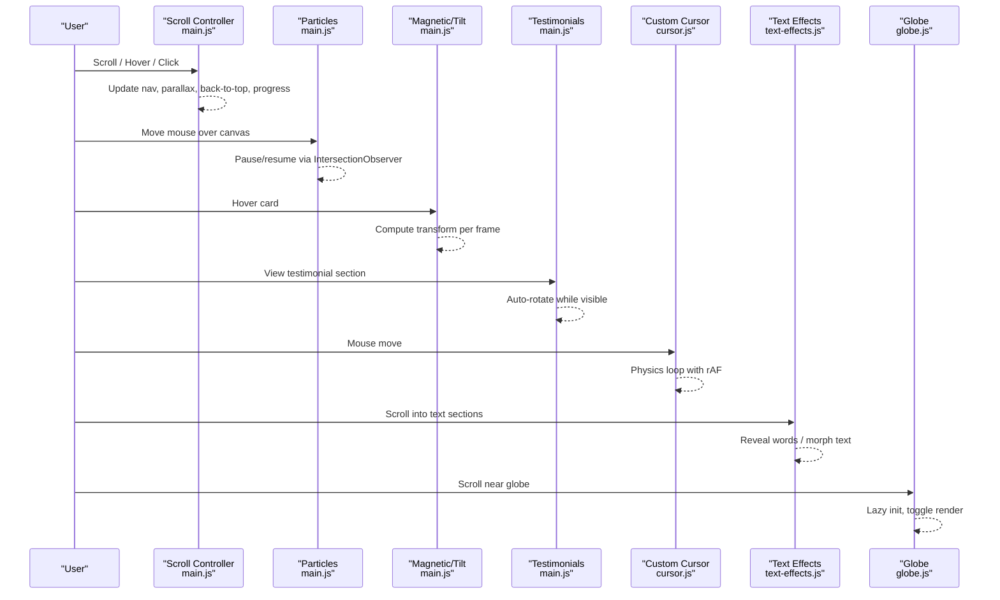

**Diagram sources**
- [main.js:178-284](file://js/main.js#L178-L284)
- [main.js:432-550](file://js/main.js#L432-L550)
- [main.js:552-598](file://js/main.js#L552-L598)
- [main.js:733-768](file://js/main.js#L733-L768)
- [cursor.js:1-167](file://js/cursor.js#L1-L167)
- [text-effects.js:1-220](file://js/text-effects.js#L1-L220)
- [globe.js:1-108](file://js/globe.js#L1-L108)

## Detailed Component Analysis

### Particle Canvas System
- Initializes only if the canvas exists and reduced motion is not preferred.
- Uses IntersectionObserver to pause rendering when offscreen.
- Reduces particle count and connection distance on mobile; draws connections every other frame to save CPU/GPU.
- Resizes on window resize; uses requestAnimationFrame for smooth animation.

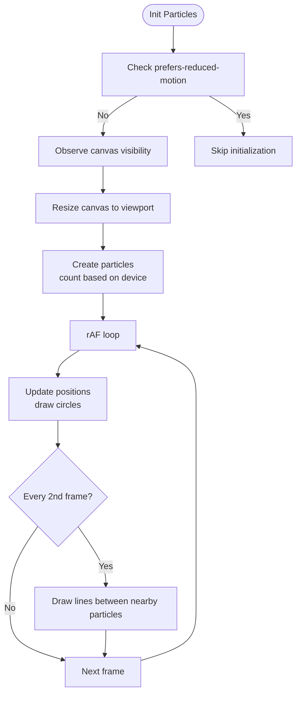

**Diagram sources**
- [main.js:432-550](file://js/main.js#L432-L550)

**Section sources**
- [main.js:432-550](file://js/main.js#L432-L550)

### Magnetic Hover Effects on Cards
- Elements with class .magnetic respond to pointer movement with subtle translation and scale.
- Uses a shared helper to throttle updates to once per frame and cache bounding rectangles.

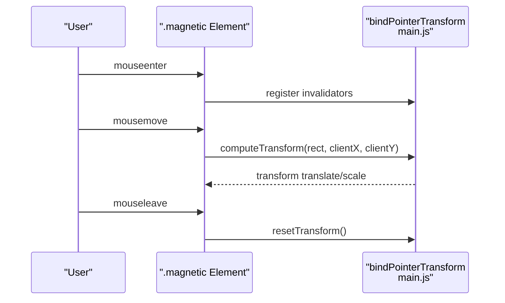

**Diagram sources**
- [main.js:367-427](file://js/main.js#L367-L427)
- [main.js:552-564](file://js/main.js#L552-L564)
- [style.css:3299-3302](file://css/style.css#L3299-L3302)

**Section sources**
- [main.js:367-427](file://js/main.js#L367-L427)
- [main.js:552-564](file://js/main.js#L552-L564)
- [style.css:3299-3302](file://css/style.css#L3299-L3302)

### 3D Tilt Interactions
- Floating cards with .floating-3d rotate based on pointer position relative to the card’s rectangle.
- Disabled on touch devices; instead, a brief tap-active state is applied.

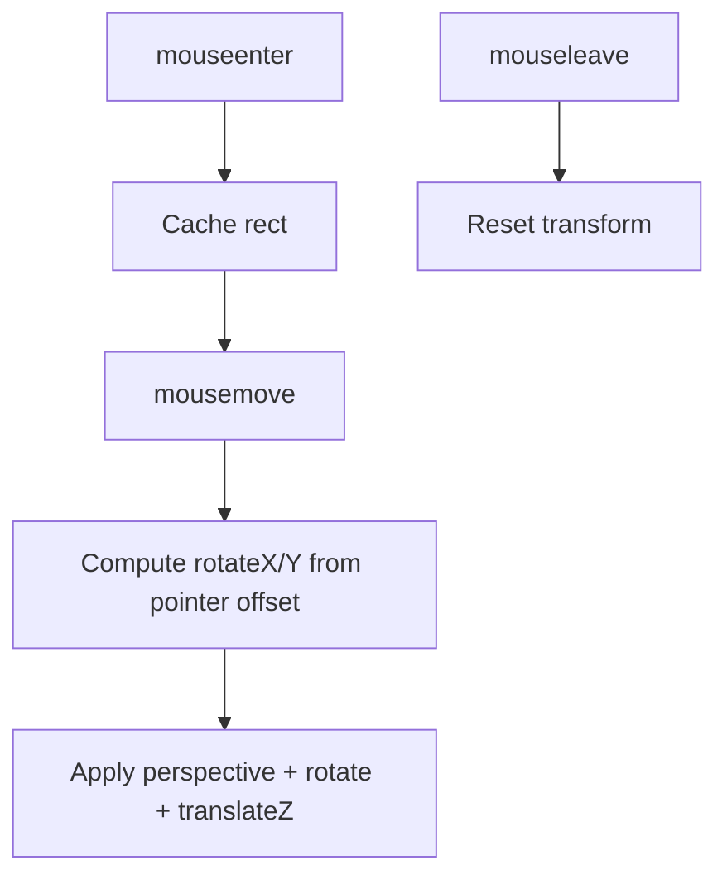

**Diagram sources**
- [main.js:566-592](file://js/main.js#L566-L592)
- [style.css:3324-3331](file://css/style.css#L3324-L3331)

**Section sources**
- [main.js:566-592](file://js/main.js#L566-L592)
- [style.css:3324-3331](file://css/style.css#L3324-L3331)

### Scroll-Triggered Animations (Intersection Observer)
- Multiple observers manage different behaviors:
  - Reveal animations by adding .active to elements with .reveal or .reveal-stagger.
  - Code typing effect triggered when code lines enter the viewport.
  - Image lazy loading for img[data-src].
  - Number counter animation when counters become visible.
  - Testimonial rotation starts/stops based on section visibility.

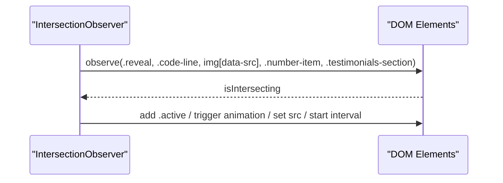

**Diagram sources**
- [main.js:44-54](file://js/main.js#L44-L54)
- [main.js:635-665](file://js/main.js#L635-L665)
- [main.js:673-705](file://js/main.js#L673-L705)
- [main.js:733-768](file://js/main.js#L733-L768)
- [revolution.css:577-603](file://css/revolution.css#L577-L603)

**Section sources**
- [main.js:44-54](file://js/main.js#L44-L54)
- [main.js:635-665](file://js/main.js#L635-L665)
- [main.js:673-705](file://js/main.js#L673-L705)
- [main.js:733-768](file://js/main.js#L733-L768)
- [revolution.css:577-603](file://css/revolution.css#L577-L603)

### Unified Scroll Controller (Parallax, Smooth Scrolling, Back-to-Top)
- Consolidates all scroll-related updates into one passive listener with rAF gating.
- Updates:
  - Nav scrolled state
  - Parallax gradient orbs (desktop only)
  - Homepage background color transitions
  - Back-to-top button visibility
  - Scroll progress bar width via transform
  - Active navigation highlight using cached section geometry

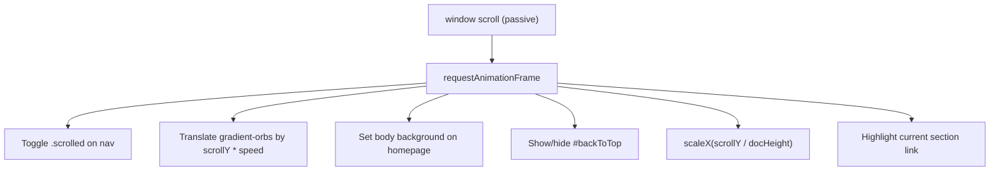

**Diagram sources**
- [main.js:178-284](file://js/main.js#L178-L284)
- [main.js:298-345](file://js/main.js#L298-L345)

**Section sources**
- [main.js:178-284](file://js/main.js#L178-L284)
- [main.js:298-345](file://js/main.js#L298-L345)

### Testimonial Slider with Auto-Rotation
- Rotates through .testimonial-card elements by scaling and fading.
- Starts when the section enters the viewport; pauses when it leaves.
- Interval runs every 5 seconds.

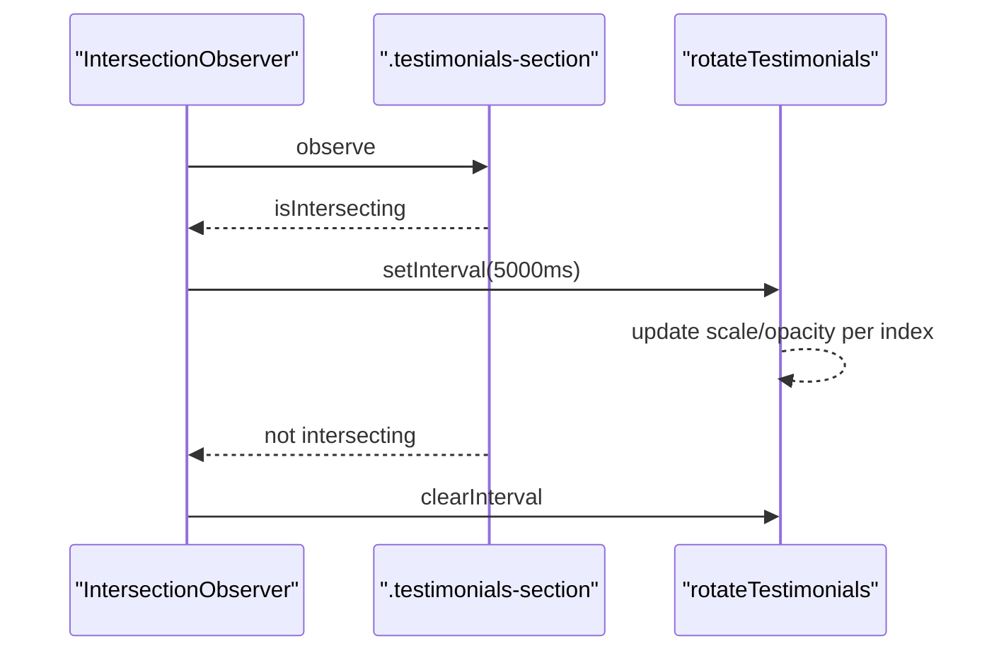

**Diagram sources**
- [main.js:733-768](file://js/main.js#L733-L768)

**Section sources**
- [main.js:733-768](file://js/main.js#L733-L768)

### Counter Animations
- Numbers animate from 0 to target value using requestAnimationFrame.
- Triggered when .number-item enters the viewport; observer unobserves after animation starts.

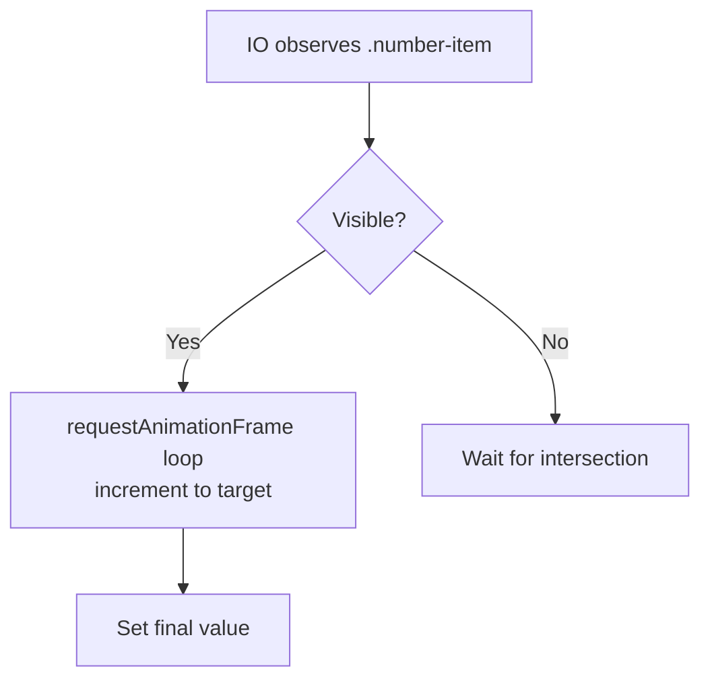

**Diagram sources**
- [main.js:673-705](file://js/main.js#L673-L705)

**Section sources**
- [main.js:673-705](file://js/main.js#L673-L705)

### Ripple Click Effects
- On any click within a .btn, a temporary circle element is created and animated to expand and fade out.
- Uses CSS keyframes injected at runtime.

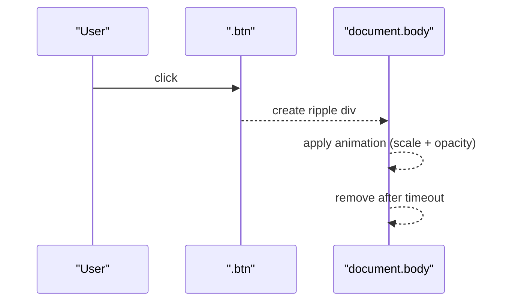

**Diagram sources**
- [main.js:600-633](file://js/main.js#L600-L633)

**Section sources**
- [main.js:600-633](file://js/main.js#L600-L633)

### Custom Cursor Implementation
- Non-Newtonian fluid cursor with spring physics, damping, velocity-based stretch, and rotation aligned to movement direction.
- Magnetic attraction to specific targets (buttons, CTAs, etc.) within a radius.
- Only enabled on devices with hover capability; hidden when leaving the viewport.

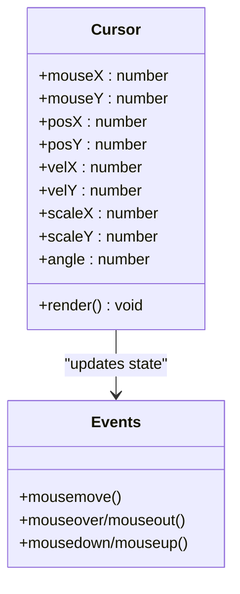

**Diagram sources**
- [cursor.js:1-167](file://js/cursor.js#L1-L167)

**Section sources**
- [cursor.js:1-167](file://js/cursor.js#L1-L167)

### Text Typing and Reveal Effects
- Scroll-linked text reveal splits paragraphs into word spans and adjusts opacity based on scroll progress.
- Morphing text cycles between configured strings with cross-fade transitions; pauses when tab is hidden.

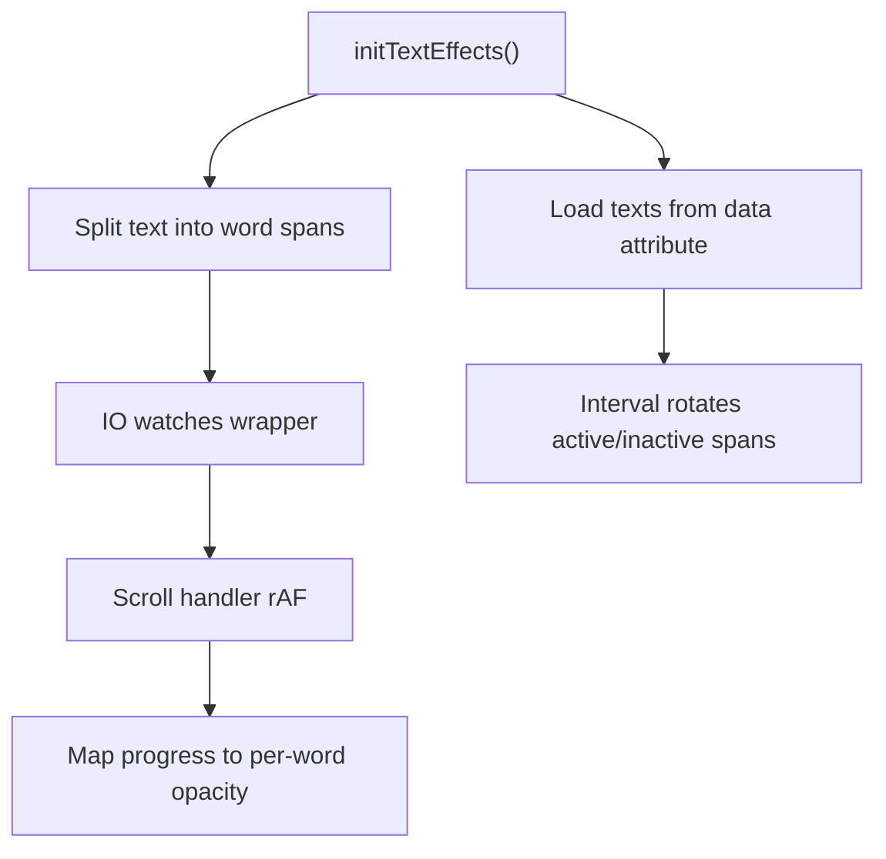

**Diagram sources**
- [text-effects.js:1-220](file://js/text-effects.js#L1-L220)

**Section sources**
- [text-effects.js:1-220](file://js/text-effects.js#L1-L220)

### Lazy Loading Patterns
- Images with data-src are loaded when they enter the viewport; observer unobserves after loading.
- Globe module is lazily initialized when near the viewport and dynamically imports its library.

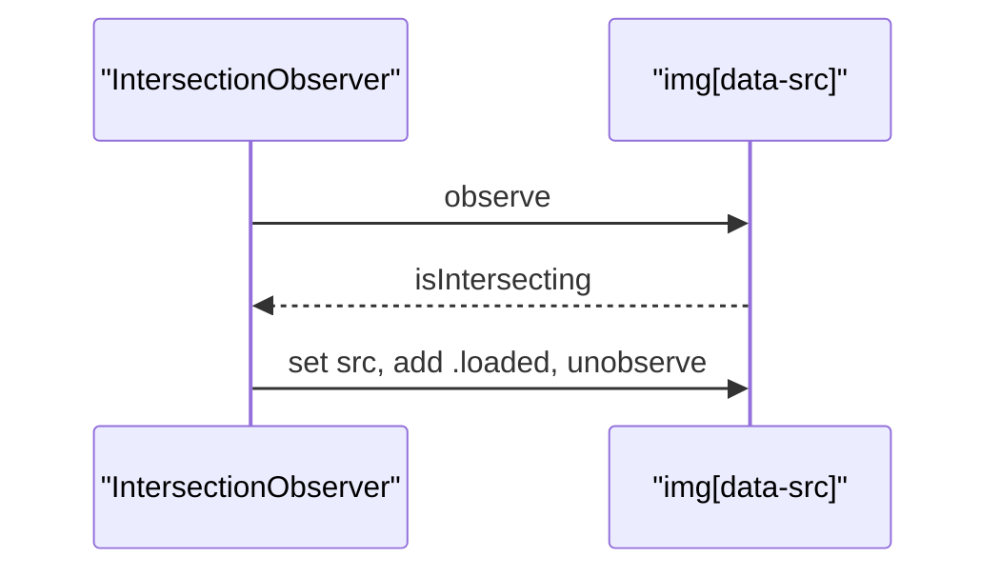

**Diagram sources**
- [main.js:650-665](file://js/main.js#L650-L665)
- [globe.js:89-107](file://js/globe.js#L89-L107)

**Section sources**
- [main.js:650-665](file://js/main.js#L650-L665)
- [globe.js:89-107](file://js/globe.js#L89-L107)

## Dependency Analysis
- main.js depends on CSS classes defined in revolution.css and style.css for visual states (.reveal, .reveal-stagger, .magnetic, .floating-3d).
- cursor.js is conditionally loaded only on hover-capable devices and after first user interaction to defer cost.
- globe.js dynamically imports an external library only when the canvas becomes visible.
- All major animations use requestAnimationFrame to synchronize with the display refresh rate.
- IntersectionObserver is used extensively to gate expensive operations until elements are visible.

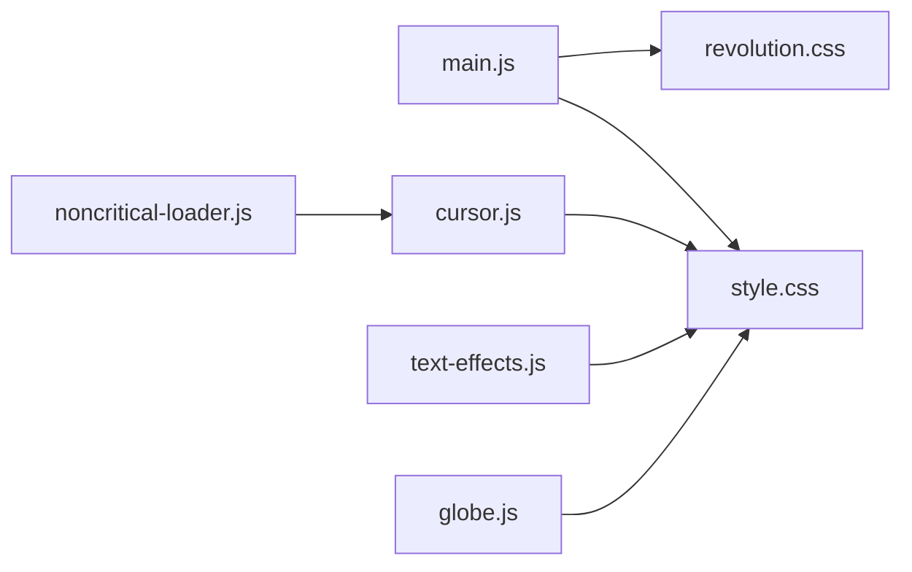

**Diagram sources**
- [main.js:178-284](file://js/main.js#L178-L284)
- [cursor.js:1-167](file://js/cursor.js#L1-L167)
- [text-effects.js:1-220](file://js/text-effects.js#L1-L220)
- [globe.js:1-108](file://js/globe.js#L1-L108)
- [noncritical-loader.js:73-99](file://js/noncritical-loader.js#L73-L99)
- [revolution.css:577-603](file://css/revolution.css#L577-L603)
- [style.css:3290-3489](file://css/style.css#L3290-L3489)

**Section sources**
- [main.js:178-284](file://js/main.js#L178-L284)
- [cursor.js:1-167](file://js/cursor.js#L1-L167)
- [text-effects.js:1-220](file://js/text-effects.js#L1-L220)
- [globe.js:1-108](file://js/globe.js#L1-L108)
- [noncritical-loader.js:73-99](file://js/noncritical-loader.js#L73-L99)
- [revolution.css:577-603](file://css/revolution.css#L577-L603)
- [style.css:3290-3489](file://css/style.css#L3290-L3489)

## Performance Considerations
- Passive scroll listeners and rAF gating prevent jank during frequent scroll events.
- IntersectionObserver pauses animations when offscreen (particles, globe, testimonials).
- Mobile-specific reductions: fewer particles, lower connection frequency, disabled 3D tilt, slower morph intervals.
- Reduced motion support: disables or slows certain animations when prefers-reduced-motion is set.
- Deferred initialization: heavy features like custom cursor and globe are loaded lazily after user interaction or when near viewport.
- Transform-based updates: scroll progress uses transform to avoid layout recalculations.
- Debounce/throttle patterns: pointer transforms are computed once per frame; resize handlers are debounced via rAF.

[No sources needed since this section provides general guidance]

## Troubleshooting Guide
- If particles do not appear:
  - Ensure the canvas element exists and reduced motion is not preferred.
  - Verify the canvas is visible; the animation loop starts only when intersecting.
- If magnetic/tilt effects feel laggy:
  - Confirm transforms are applied via the shared bindPointerTransform helper to ensure rAF throttling.
- If testimonials do not rotate:
  - Check that the section has the expected class and that the IntersectionObserver is observing it.
- If counters do not animate:
  - Ensure the element has the correct class and data attributes; verify the observer threshold.
- If custom cursor does not show:
  - It is only enabled on hover-capable devices and after first mousemove or pointerdown.
- If globe fails to load:
  - Dynamic import may fail; check network and console warnings; the module gracefully stops without breaking the page.

**Section sources**
- [main.js:432-550](file://js/main.js#L432-L550)
- [main.js:552-598](file://js/main.js#L552-L598)
- [main.js:733-768](file://js/main.js#L733-L768)
- [main.js:673-705](file://js/main.js#L673-L705)
- [cursor.js:1-167](file://js/cursor.js#L1-L167)
- [globe.js:29-43](file://js/globe.js#L29-L43)

## Conclusion
The WebNovis interactive system balances rich visuals with performance and accessibility:
- Centralized scroll control ensures consistent behavior and minimal repaints.
- IntersectionObserver gates expensive work until necessary.
- Device and preference detection provide graceful degradation.
- Modular design allows independent optimization of each feature.
These practices deliver smooth, engaging interactions across devices while maintaining strong performance characteristics.

[No sources needed since this section summarizes without analyzing specific files]