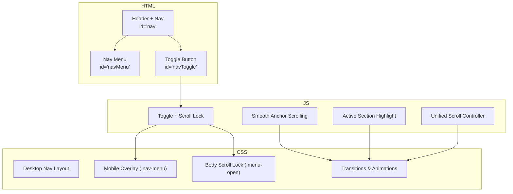
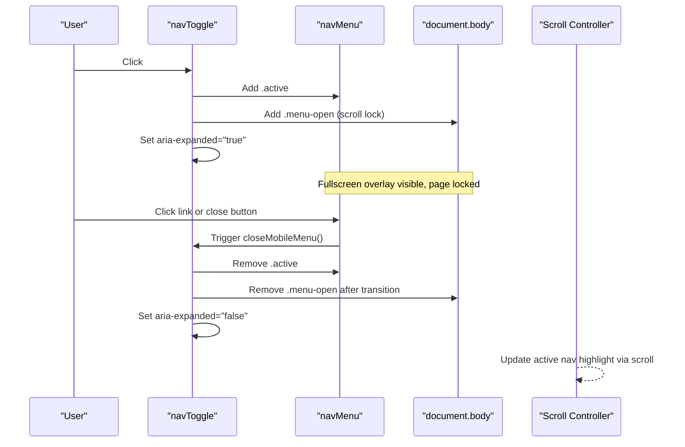
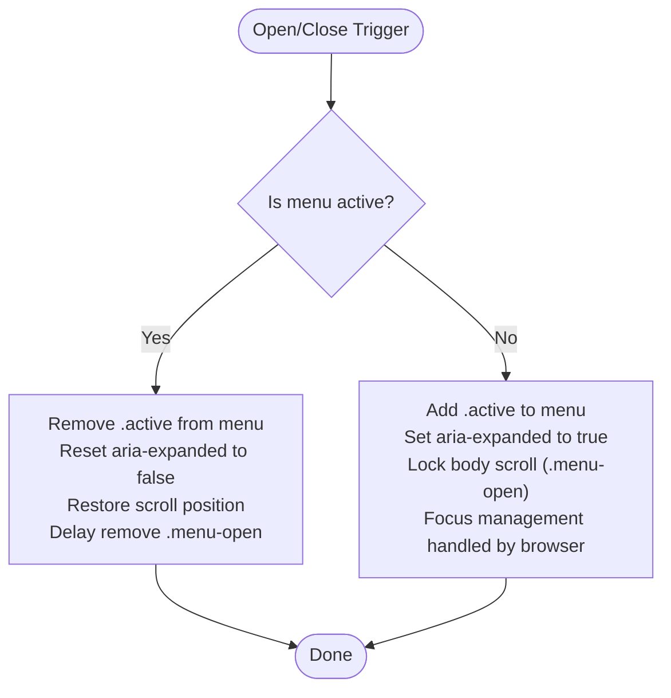
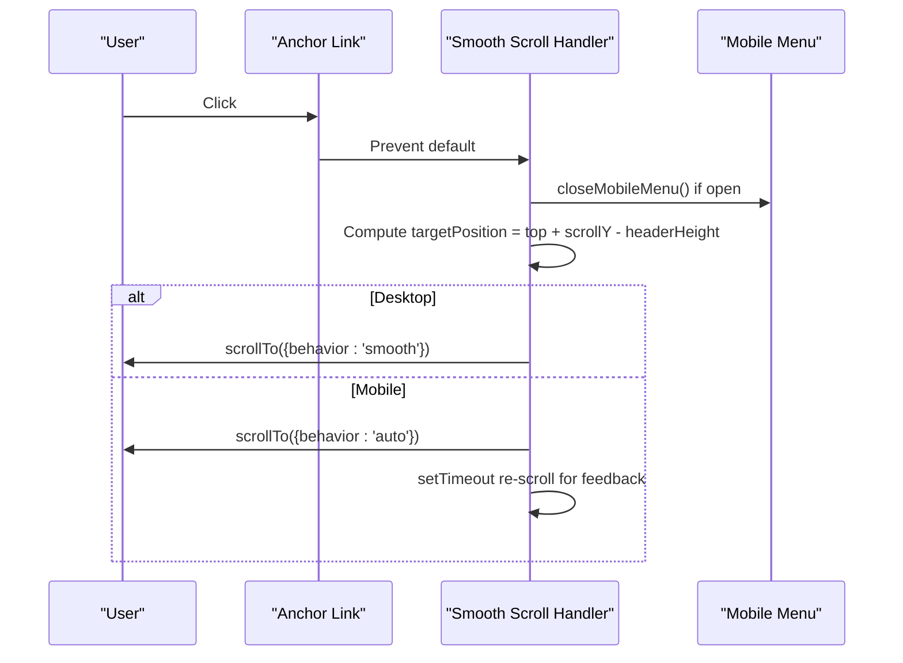
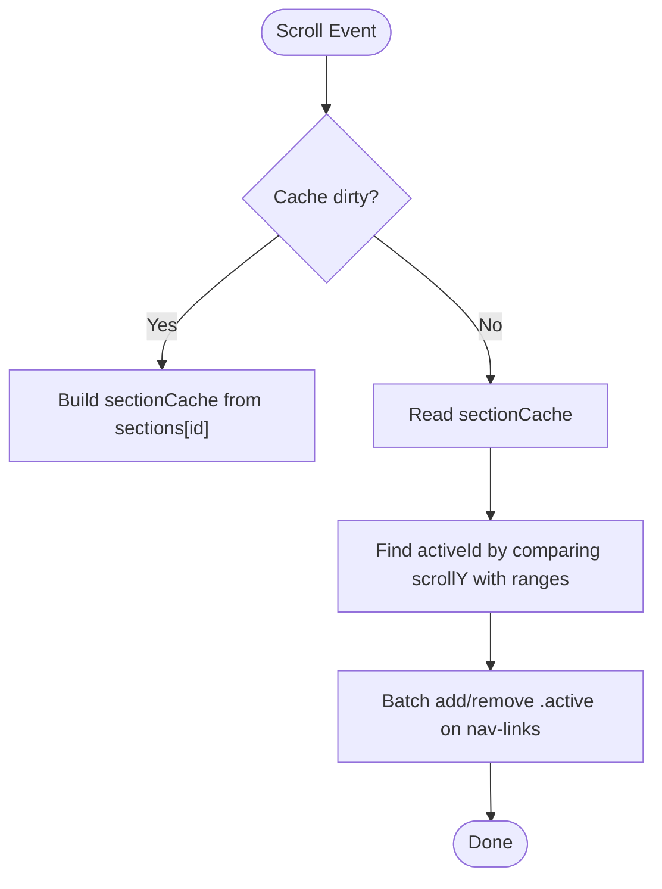
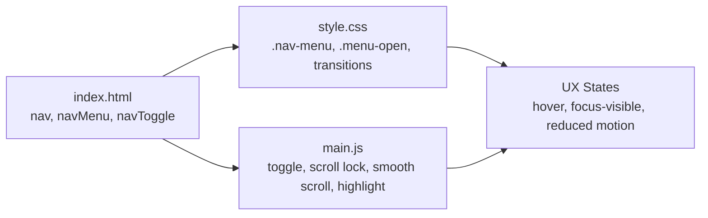

# Navigation & Menu System

<cite>
**Referenced Files in This Document**
- [index.html](file://src/html/index.html)
- [main.js](file://js/main.js)
- [style.css](file://css/style.css)
- [search.js](file://js/search.js)
</cite>

## Table of Contents
1. [Introduction](#introduction)
2. [Project Structure](#project-structure)
3. [Core Components](#core-components)
4. [Architecture Overview](#architecture-overview)
5. [Detailed Component Analysis](#detailed-component-analysis)
6. [Dependency Analysis](#dependency-analysis)
7. [Performance Considerations](#performance-considerations)
8. [Troubleshooting Guide](#troubleshooting-guide)
9. [Conclusion](#conclusion)
10. [Appendices](#appendices)

## Introduction
This document explains the website navigation and menu system with a focus on:
- Mobile hamburger menu behavior, including body scroll lock and smooth transitions
- Accessibility features such as ARIA attributes and keyboard support
- Active section highlighting based on scroll position
- Smooth scrolling to anchors across devices
- Responsive behavior and touch interactions
- Customization guidance for adding or modifying navigation items and behaviors
- SEO considerations for navigation links and search engine crawling

## Project Structure
The navigation is implemented using:
- Semantic HTML structure for the header and nav elements
- CSS for responsive layout, mobile menu overlay, and animations
- JavaScript for interactivity (toggle, scroll lock, active state, smooth scroll)
- Search module providing keyboard navigation and modal behavior

**Diagram sources**
- [index.html:35-52](file://src/html/index.html#L35-L52)
- [style.css:554-628](file://css/style.css#L554-L628)
- [style.css:2953-3051](file://css/style.css#L2953-L3051)
- [style.css:5961-6013](file://css/style.css#L5961-L6013)
- [main.js:62-121](file://js/main.js#L62-L121)
- [main.js:123-156](file://js/main.js#L123-L156)
- [main.js:322-345](file://js/main.js#L322-L345)
- [main.js:178-284](file://js/main.js#L178-L284)

**Section sources**
- [index.html:35-52](file://src/html/index.html#L35-L52)
- [style.css:554-628](file://css/style.css#L554-L628)
- [style.css:2953-3051](file://css/style.css#L2953-L3051)
- [style.css:5961-6013](file://css/style.css#L5961-L6013)
- [main.js:62-121](file://js/main.js#L62-L121)
- [main.js:123-156](file://js/main.js#L123-L156)
- [main.js:322-345](file://js/main.js#L322-L345)
- [main.js:178-284](file://js/main.js#L178-L284)

## Core Components
- Header and navigation markup: semantic <header>, <nav>, and accessible toggle button
- Mobile menu overlay: full-screen slide-in panel with close button
- Toggle logic: open/close with aria-expanded updates and body scroll lock
- Smooth anchor scrolling: native smooth behavior on desktop; instant scroll on mobile with fallback
- Active section highlight: Intersection Observer-based cache and batched class updates
- Unified scroll controller: debounced rAF loop updating multiple UI states efficiently

Key implementation references:
- Toggle and scroll lock: [main.js:62-121](file://js/main.js#L62-L121)
- Smooth scrolling: [main.js:123-156](file://js/main.js#L123-L156)
- Active section highlight: [main.js:322-345](file://js/main.js#L322-L345)
- Unified scroll controller: [main.js:178-284](file://js/main.js#L178-L284)
- Mobile overlay styles: [style.css:2953-3051](file://css/style.css#L2953-L3051)
- Body scroll lock: [style.css:5961-6013](file://css/style.css#L5961-L6013)
- Nav link styles and hover effects: [style.css:554-628](file://css/style.css#L554-L628)
- Nav HTML structure: [index.html:35-52](file://src/html/index.html#L35-L52)

**Section sources**
- [main.js:62-121](file://js/main.js#L62-L121)
- [main.js:123-156](file://js/main.js#L123-L156)
- [main.js:322-345](file://js/main.js#L322-L345)
- [main.js:178-284](file://js/main.js#L178-L284)
- [style.css:2953-3051](file://css/style.css#L2953-L3051)
- [style.css:5961-6013](file://css/style.css#L5961-L6013)
- [style.css:554-628](file://css/style.css#L554-L628)
- [index.html:35-52](file://src/html/index.html#L35-L52)

## Architecture Overview
The navigation system integrates three layers:
- Markup layer: semantic nav with accessible controls
- Style layer: responsive rules and transitions for desktop/mobile
- Behavior layer: JS orchestrating toggling, scroll lock, smooth scrolling, and active state

**Diagram sources**
- [main.js:62-121](file://js/main.js#L62-L121)
- [style.css:2953-3051](file://css/style.css#L2953-L3051)
- [style.css:5961-6013](file://css/style.css#L5961-L6013)
- [main.js:178-284](file://js/main.js#L178-L284)

## Detailed Component Analysis

### Mobile Hamburger Menu with Body Scroll Lock
- Behavior:
  - Opens by adding classes to menu and toggle, sets aria-expanded, and locks body scroll
  - Closes by removing classes, restoring scroll position, and resetting scroll behavior
  - Injects a close button into the menu for accessibility
- Performance:
  - Uses requestAnimationFrame to reset scrollBehavior after restore
  - Delays removal of .menu-open to allow CSS transform to complete
- Accessibility:
  - aria-expanded toggles correctly
  - Close button has an explicit aria-label

References:
- Toggle and close functions: [main.js:62-121](file://js/main.js#L62-L121)
- Body scroll lock styles: [style.css:5961-6013](file://css/style.css#L5961-L6013)
- Mobile overlay styles: [style.css:2953-3051](file://css/style.css#L2953-L3051)

**Diagram sources**
- [main.js:62-121](file://js/main.js#L62-L121)
- [style.css:5961-6013](file://css/style.css#L5961-L6013)

**Section sources**
- [main.js:62-121](file://js/main.js#L62-L121)
- [style.css:5961-6013](file://css/style.css#L5961-L6013)
- [style.css:2953-3051](file://css/style.css#L2953-L3051)

### Smooth Scrolling to Anchors
- Behavior:
  - Prevents default anchor click
  - Computes target position with header offset
  - Uses native smooth scroll on desktop; instant scroll on mobile with a small delay for visual feedback
  - Closes mobile menu before scrolling
- Performance:
  - Avoids heavy calculations; uses getBoundingClientRect and window.pageYOffset
  - Uses requestAnimationFrame for scrollBehavior reset where needed

References:
- Anchor click handler: [main.js:123-156](file://js/main.js#L123-L156)

**Diagram sources**
- [main.js:123-156](file://js/main.js#L123-L156)

**Section sources**
- [main.js:123-156](file://js/main.js#L123-L156)

### Active Section Highlighting Based on Scroll Position
- Behavior:
  - Builds a cache of sections with id, top, bottom offsets
  - On scroll, determines which section contains the viewport center
  - Updates .active class on corresponding nav-link
- Performance:
  - Uses a cached array to avoid forced reflows
  - Batched writes to DOM classes
  - Debounced via unified scroll controller

References:
- Cache build and update: [main.js:305-345](file://js/main.js#L305-L345)
- Unified scroll controller integration: [main.js:178-284](file://js/main.js#L178-L284)

**Diagram sources**
- [main.js:305-345](file://js/main.js#L305-L345)
- [main.js:178-284](file://js/main.js#L178-L284)

**Section sources**
- [main.js:305-345](file://js/main.js#L305-L345)
- [main.js:178-284](file://js/main.js#L178-L284)

### Responsive Behavior Across Screen Sizes
- Desktop:
  - Horizontal nav with hover underline effect
  - No body scroll lock
- Mobile (≤768px):
  - Hamburger toggle appears
  - Fullscreen overlay slides in with staggered list item animations
  - Touch-friendly targets and reduced motion respected
- Reduced Motion:
  - Animations and transforms minimized when prefers-reduced-motion is set

References:
- Desktop nav styles: [style.css:554-628](file://css/style.css#L554-L628)
- Mobile overlay and stagger: [style.css:2953-3051](file://css/style.css#L2953-L3051)
- Reduced motion rules: [style.css:6015-6050](file://css/style.css#L6015-L6050)

**Section sources**
- [style.css:554-628](file://css/style.css#L554-L628)
- [style.css:2953-3051](file://css/style.css#L2953-L3051)
- [style.css:6015-6050](file://css/style.css#L6015-L6050)

### Touch Interactions and Keyboard Navigation
- Touch:
  - Minimum 44x44px targets for toggle and links
  - Touch-active states for 3D cards and buttons
- Keyboard:
  - Toggle uses aria-expanded for screen readers
  - Search module provides arrow key navigation and Escape handling
  - Global Ctrl/Cmd+K shortcut opens search

References:
- Touch-friendly styles: [style.css:6052-6089](file://css/style.css#L6052-L6089)
- Search keyboard navigation: [search.js:840-877](file://js/search.js#L840-L877)
- Global shortcut and modal behavior: [search.js:974-997](file://js/search.js#L974-L997)

**Section sources**
- [style.css:6052-6089](file://css/style.css#L6052-L6089)
- [search.js:840-877](file://js/search.js#L840-L877)
- [search.js:974-997](file://js/search.js#L974-L997)

### Accessibility Features (ARIA Attributes)
- Toggle button:
  - aria-label describes action
  - aria-controls points to navMenu
  - aria-expanded toggles with open/close
- Close button:
  - Dynamically injected with aria-label
- Search inputs:
  - role="combobox", aria-controls, aria-expanded, aria-label
- Focus management:
  - Consistent focus restoration on close actions

References:
- Toggle attributes and updates: [main.js:62-121](file://js/main.js#L62-L121)
- Close button injection: [main.js:71-76](file://js/main.js#L71-L76)
- Search combobox attributes: [index.html:40-44](file://src/html/index.html#L40-L44)

**Section sources**
- [main.js:62-121](file://js/main.js#L62-L121)
- [main.js:71-76](file://js/main.js#L71-L76)
- [index.html:40-44](file://src/html/index.html#L40-L44)

## Dependency Analysis
The navigation components depend on:
- HTML structure for IDs and roles
- CSS classes for state-driven styling (.active, .menu-open)
- JS modules for behavior coordination

**Diagram sources**
- [index.html:35-52](file://src/html/index.html#L35-L52)
- [style.css:2953-3051](file://css/style.css#L2953-L3051)
- [style.css:5961-6013](file://css/style.css#L5961-L6013)
- [main.js:62-121](file://js/main.js#L62-L121)

**Section sources**
- [index.html:35-52](file://src/html/index.html#L35-L52)
- [style.css:2953-3051](file://css/style.css#L2953-L3051)
- [style.css:5961-6013](file://css/style.css#L5961-L6013)
- [main.js:62-121](file://js/main.js#L62-L121)

## Performance Considerations
- Unified scroll controller:
  - Single passive scroll listener with requestAnimationFrame throttling
  - Batched DOM writes to minimize reflows
- Section cache:
  - Rebuild only on resize/load events
- Smooth scroll strategy:
  - Native smooth on desktop; instant on mobile to avoid jank
- Reduced motion:
  - Disables heavy animations and canvas effects when preferred

References:
- Unified scroll controller: [main.js:178-284](file://js/main.js#L178-L284)
- Section cache rebuild triggers: [main.js:317-320](file://js/main.js#L317-L320)
- Reduced motion rules: [style.css:6015-6050](file://css/style.css#L6015-L6050)

[No sources needed since this section provides general guidance]

## Troubleshooting Guide
Common issues and resolutions:
- Menu does not close on link click:
  - Ensure navLinks are queried and event listeners attached
  - Verify closeMobileMenu is called on link click
- Body scroll remains locked:
  - Confirm .menu-open is removed after transition
  - Check that scrollBehavior reset occurs via requestAnimationFrame
- Active highlight not updating:
  - Validate sections have ids and correct offsets
  - Ensure sectionCacheDirty flags are reset on load/resize
- Smooth scroll not working on mobile:
  - Use auto behavior with fallback re-scroll for visual feedback
- Accessibility problems:
  - Verify aria-expanded toggles correctly
  - Ensure close button has aria-label and is focusable

References:
- Close on link click: [main.js:115-121](file://js/main.js#L115-L121)
- Scroll lock cleanup: [main.js:88-103](file://js/main.js#L88-L103)
- Active highlight logic: [main.js:322-345](file://js/main.js#L322-L345)
- Smooth scroll mobile fallback: [main.js:145-153](file://js/main.js#L145-L153)

**Section sources**
- [main.js:115-121](file://js/main.js#L115-L121)
- [main.js:88-103](file://js/main.js#L88-L103)
- [main.js:322-345](file://js/main.js#L322-L345)
- [main.js:145-153](file://js/main.js#L145-L153)

## Conclusion
The navigation system combines semantic markup, responsive CSS, and efficient JavaScript to deliver a robust, accessible, and performant user experience. It supports mobile-first design patterns, respects user preferences, and maintains high performance through caching and throttled scroll handlers. The modular approach allows easy customization and extension while preserving accessibility and SEO best practices.

[No sources needed since this section summarizes without analyzing specific files]

## Appendices

### Customization Guide
- Adding a new navigation item:
  - Insert a new <li><a href="...">Label</a></li> inside .nav-menu
  - Ensure href matches a section id for active highlighting
  - Optionally add title attribute for SEO and tooltips
- Changing menu behavior:
  - Modify openMobileMenu/closeMobileMenu in main.js
  - Adjust CSS transitions in .nav-menu.active and related selectors
  - Update aria-labels for accessibility
- Implementing custom navigation behaviors:
  - Extend the unified scroll controller to trigger additional UI updates
  - Integrate analytics or tracking on link clicks
  - Add custom keyboard shortcuts via global keydown listeners

References:
- Nav menu structure: [index.html:48-50](file://src/html/index.html#L48-L50)
- Toggle functions: [main.js:62-121](file://js/main.js#L62-L121)
- Mobile overlay styles: [style.css:2953-3051](file://css/style.css#L2953-L3051)

**Section sources**
- [index.html:48-50](file://src/html/index.html#L48-L50)
- [main.js:62-121](file://js/main.js#L62-L121)
- [style.css:2953-3051](file://css/style.css#L2953-L3051)

### SEO Considerations for Navigation Links
- Use descriptive, keyword-rich text in link labels
- Include meaningful title attributes for context
- Ensure all critical content is present in initial HTML (not JS-injected)
- Maintain consistent internal linking structure
- Respect robots.txt and meta robots directives

References:
- Nav link examples with titles: [index.html:48-50](file://src/html/index.html#L48-L50)
- Robots policy testing: [tests/robots-policy-regressions.test.js:82-132](file://tests/robots-policy-regressions.test.js#L82-L132)

**Section sources**
- [index.html:48-50](file://src/html/index.html#L48-L50)
- [tests/robots-policy-regressions.test.js:82-132](file://tests/robots-policy-regressions.test.js#L82-L132)