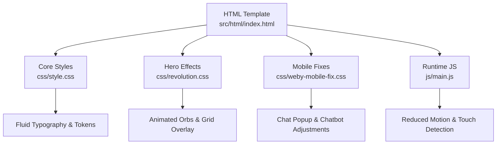
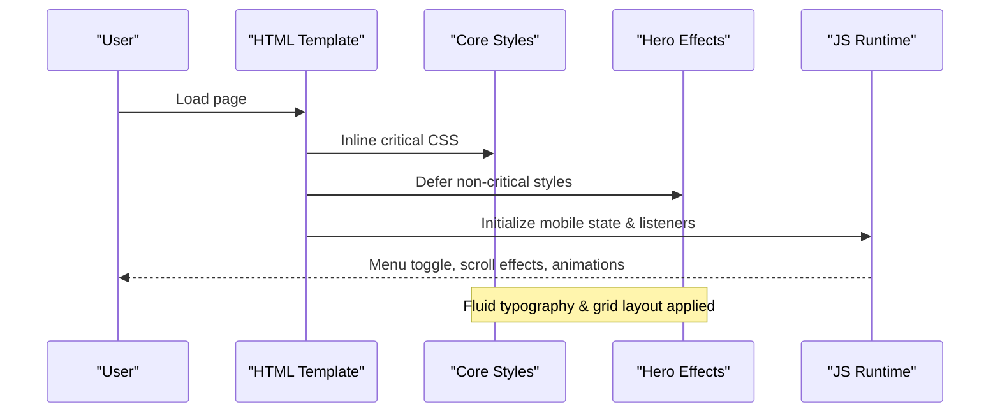
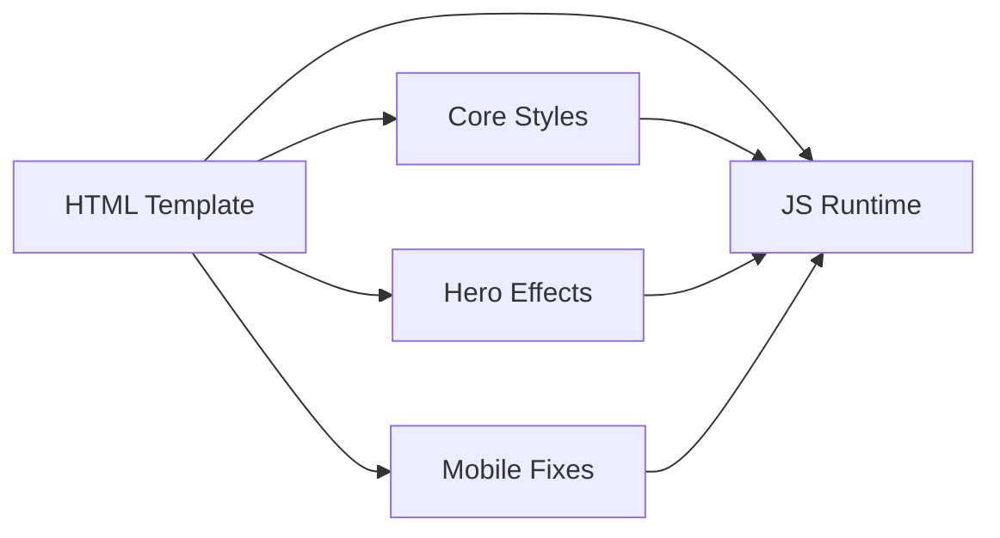

# Responsive Design System

<cite>
**Referenced Files in This Document**
- [style.css](file://css/style.css)
- [revolution.css](file://css/revolution.css)
- [weby-mobile-fix.css](file://css/weby-mobile-fix.css)
- [index.html](file://src/html/index.html)
- [main.js](file://js/main.js)
- [text-effects.js](file://js/text-effects.js)
- [image-policy.js](file://config/image-policy.js)
- [design-system.md](file://.kiro/steering/design-system.md)
</cite>

## Table of Contents
1. [Introduction](#introduction)
2. [Project Structure](#project-structure)
3. [Core Components](#core-components)
4. [Architecture Overview](#architecture-overview)
5. [Detailed Component Analysis](#detailed-component-analysis)
6. [Dependency Analysis](#dependency-analysis)
7. [Performance Considerations](#performance-considerations)
8. [Troubleshooting Guide](#troubleshooting-guide)
9. [Conclusion](#conclusion)
10. [Appendices](#appendices)

## Introduction
This document explains the WebNovis responsive design system with a mobile-first approach, CSS Grid and Flexbox layouts, custom properties for theming, and a clear breakpoint strategy. It covers media query organization, fluid typography scaling, adaptive image handling, touch device detection, mobile menu behavior, performance optimizations for mobile devices, accessibility features such as reduced motion support, cross-browser compatibility strategies, and guidelines for extending the system with new breakpoints while maintaining consistency across devices.

## Project Structure
The responsive system is implemented primarily through:
- A central stylesheet defining tokens, base styles, components, and media queries
- Feature-specific stylesheets (e.g., hero effects, social feed, mobile fixes)
- An HTML template that loads critical CSS inline and defers non-critical assets
- JavaScript for runtime behaviors like mobile menu toggling, scroll effects, and performance-sensitive animations

**Diagram sources**
- [index.html:26-31](file://src/html/index.html#L26-L31)
- [style.css:168-315](file://css/style.css#L168-L315)
- [revolution.css:45-98](file://css/revolution.css#L45-L98)
- [weby-mobile-fix.css:3-66](file://css/weby-mobile-fix.css#L3-L66)
- [main.js:3-19](file://js/main.js#L3-L19)

**Section sources**
- [index.html:26-31](file://src/html/index.html#L26-L31)
- [style.css:168-315](file://css/style.css#L168-L315)
- [revolution.css:45-98](file://css/revolution.css#L45-L98)
- [weby-mobile-fix.css:3-66](file://css/weby-mobile-fix.css#L3-L66)
- [main.js:3-19](file://js/main.js#L3-L19)

## Core Components
- Custom properties (tokens) for colors, gradients, typography, spacing, radius, shadows, durations, and easings are centralized in the root stylesheet to ensure consistent theming and easy overrides.
- Fluid typography uses clamp-based variables to scale smoothly between small and large screens without hard breakpoints.
- Layouts rely on CSS Grid and Flexbox for responsive structures, including service sections, cards, and navigation.
- Media queries are organized by feature and screen size, with mobile-first defaults and progressive enhancements for larger screens.

Key token areas:
- Colors and gradients
- Typography scales and line heights
- Spacing and section spacing
- Border radius and shadows
- Animation durations and easing curves

**Section sources**
- [style.css:168-315](file://css/style.css#L168-L315)

## Architecture Overview
The responsive architecture combines:
- Mobile-first CSS with fluid typography and flexible grids
- Deferred loading of non-critical stylesheets to improve initial paint
- Adaptive images via picture elements and media-split preloads
- Runtime JS for mobile menu, scroll effects, and performance-aware animations
- Accessibility hooks for reduced motion and keyboard navigation

**Diagram sources**
- [index.html:26-31](file://src/html/index.html#L26-L31)
- [style.css:168-315](file://css/style.css#L168-L315)
- [revolution.css:45-98](file://css/revolution.css#L45-L98)
- [main.js:3-19](file://js/main.js#L3-L19)

## Detailed Component Analysis

### Breakpoints and Media Query Strategy
- The project documents a breakpoint set and mobile-first approach in the steering design guide, recommending min-width media queries for small, medium, large, XL, and 2XL.
- In practice, the core stylesheet includes mobile-first defaults and targeted max-width adjustments for specific components (e.g., social section stacking, web-section padding, hero CTA stacking).
- The mobile chat popup has dedicated breakpoints at 768px and 480px to adapt positioning and sizing.

Guidelines:
- Start with mobile defaults and enhance for larger screens using min-width where appropriate.
- Use component-level media queries to avoid global overrides.
- Keep breakpoints consistent with the documented set when adding new rules.

**Section sources**
- [design-system.md:286-306](file://.kiro/steering/design-system.md#L286-L306)
- [style.css:3081-3140](file://css/style.css#L3081-L3140)
- [weby-mobile-fix.css:3-66](file://css/weby-mobile-fix.css#L3-L66)

### Fluid Typography Scaling
- Fluid type tokens use clamp() to interpolate font sizes based on viewport width, ensuring readable text from small phones to large desktops.
- Section titles, hero titles, and body text leverage these tokens to maintain visual hierarchy across devices.

Best practices:
- Prefer clamp-based tokens for scalable text instead of fixed px values.
- Maintain line-height and letter-spacing tokens for readability.

**Section sources**
- [style.css:232-242](file://css/style.css#L232-L242)
- [style.css:770-780](file://css/style.css#L770-L780)
- [style.css:1093-1100](file://css/style.css#L1093-L1100)

### Adaptive Image Handling
- The hero uses a picture element with media-specific sources and a high-priority preload split by viewport width to optimize LCP on mobile vs desktop.
- Non-critical images can be lazy-loaded; build-time scripts enforce default lazy loading except for whitelisted LCP candidates.

Recommendations:
- Use picture elements for art direction and srcset for density.
- Preload only the true LCP image with fetchpriority="high".
- Ensure non-LCP images are lazy-loaded to reduce initial payload.

**Section sources**
- [index.html:26-28](file://src/html/index.html#L26-L28)
- [index.html:63-68](file://src/html/index.html#L63-L68)
- [image-policy.js:10-52](file://config/image-policy.js#L10-L52)

### Touch Device Detection and Reduced Motion
- Runtime detects touch devices and prefers reduced motion to disable heavy animations or adjust behavior accordingly.
- Particle canvas initialization respects both mobile context and reduced motion preferences, reducing resource usage on constrained devices.
- Text morphing effects slow down or delay on low-priority modes (mobile or reduced motion).

Accessibility note:
- Respect user preferences for motion to avoid discomfort or distraction.

**Section sources**
- [main.js:3-8](file://js/main.js#L3-L8)
- [main.js:21-40](file://js/main.js#L21-L40)
- [main.js:432-550](file://js/main.js#L432-L550)
- [text-effects.js:175-195](file://js/text-effects.js#L175-L195)

### Mobile Menu Implementation
- The mobile menu toggles visibility and locks body scroll to prevent background scrolling while the menu is open.
- A close button is injected into the menu for better UX and accessibility.
- Navigation links close the menu upon selection.

Interaction flow:
- Open: capture scroll position, lock body, add active classes, update aria attributes.
- Close: restore scroll, remove active classes, reset scroll behavior, then remove lock after transition.

**Section sources**
- [main.js:61-121](file://js/main.js#L61-L121)

### Performance Optimizations for Mobile
- Critical CSS is inlined to ensure fast first paint and avoid FOUC.
- Non-critical stylesheets are deferred using print media onload pattern.
- Animations and heavy effects are gated by device capability and reduced motion preferences.
- Scroll handlers are throttled via requestAnimationFrame and passive listeners.
- Canvas particle counts and connection distances are reduced on mobile.

Impact:
- Faster LCP and smoother interactions on mobile devices.
- Lower CPU and memory usage during scroll and animation phases.

**Section sources**
- [index.html:26-31](file://src/html/index.html#L26-L31)
- [main.js:178-284](file://js/main.js#L178-L284)
- [main.js:432-550](file://js/main.js#L432-L550)

### Cross-Browser Compatibility Strategies
- Backdrop filters include vendor prefixes for broader support.
- Font display swap prevents invisible text during font load.
- Safe fallback fonts are defined to avoid layout shifts.
- Modern features are guarded by feature checks (e.g., IntersectionObserver, matchMedia).

**Section sources**
- [style.css:7-13](file://css/style.css#L7-L13)
- [style.css:150-152](file://css/style.css#L150-L152)
- [style.css:411-416](file://css/style.css#L411-L416)

### Accessibility Features
- Skip-to-content link and sr-only utilities improve keyboard navigation and screen reader experience.
- Search inputs declare type="search" and proper ARIA roles/attributes.
- Reduced motion support disables or slows animations for users who prefer it.
- Contrast checks are enforced via tests to meet WCAG AA thresholds.

**Section sources**
- [index.html:32-34](file://src/html/index.html#L32-L34)
- [index.html:40-61](file://src/html/index.html#L40-L61)
- [main.js:3-8](file://js/main.js#L3-L8)
- [text-effects.js:175-195](file://js/text-effects.js#L175-L195)

### Responsive Components Examples
- Hero: Uses picture element for adaptive images, fluid typography, and optimized LCP.
- Service sections: Two-column grid collapses to single column on smaller screens.
- Social section: Visual and content stack vertically on mobile with reordered order.
- Chat popup: Adjusts positioning and sizing for mobile viewports.

**Section sources**
- [index.html:63-75](file://src/html/index.html#L63-L75)
- [style.css:1277-1290](file://css/style.css#L1277-L1290)
- [style.css:3097-3125](file://css/style.css#L3097-L3125)
- [weby-mobile-fix.css:3-66](file://css/weby-mobile-fix.css#L3-L66)

## Dependency Analysis
The responsive system depends on coordinated layers:
- HTML defines structure and critical resources
- Core styles define tokens, base, and responsive rules
- Feature styles add specialized effects and mobile fixes
- JavaScript adds interactivity and performance-aware behaviors

**Diagram sources**
- [index.html:26-31](file://src/html/index.html#L26-L31)
- [style.css:168-315](file://css/style.css#L168-L315)
- [revolution.css:45-98](file://css/revolution.css#L45-L98)
- [weby-mobile-fix.css:3-66](file://css/weby-mobile-fix.css#L3-L66)
- [main.js:3-19](file://js/main.js#L3-L19)

**Section sources**
- [index.html:26-31](file://src/html/index.html#L26-L31)
- [style.css:168-315](file://css/style.css#L168-L315)
- [revolution.css:45-98](file://css/revolution.css#L45-L98)
- [weby-mobile-fix.css:3-66](file://css/weby-mobile-fix.css#L3-L66)
- [main.js:3-19](file://js/main.js#L3-L19)

## Performance Considerations
- Inline critical CSS to minimize render-blocking resources.
- Defer non-critical stylesheets to improve initial paint time.
- Use picture elements and media-split preloads to optimize LCP.
- Gate heavy animations behind device capability and reduced motion preferences.
- Throttle scroll events and use passive listeners to keep main thread responsive.
- Reduce particle counts and connection distances on mobile to lower CPU usage.

[No sources needed since this section provides general guidance]

## Troubleshooting Guide
Common issues and resolutions:
- Mobile menu not closing: Ensure click handlers on nav links invoke close function and aria-expanded updates.
- Lighthouse NO_LCP on mobile: Verify hero title/content do not start with opacity:0 and that a real LCP image is present with high priority.
- Excessive animations on mobile: Confirm reduced motion and touch detection paths disable or throttle effects.
- Chat popup misalignment: Check mobile-specific media queries for positioning and sizing.

**Section sources**
- [main.js:61-121](file://js/main.js#L61-L121)
- [lcp-hero-regressions.test.js:1-39](file://tests/lcp-hero-regressions.test.js#L1-L39)
- [weby-mobile-fix.css:3-66](file://css/weby-mobile-fix.css#L3-L66)

## Conclusion
WebNovis implements a robust, mobile-first responsive design system grounded in CSS custom properties, fluid typography, and well-organized media queries. The system balances visual richness with performance and accessibility by gating animations, optimizing images, and respecting user preferences. Extending the system involves following the documented breakpoint strategy, leveraging existing tokens, and keeping component-level media queries focused and minimal.

[No sources needed since this section summarizes without analyzing specific files]

## Appendices

### Guidelines for Extending the Design System
- Add new breakpoints by referencing the documented set and using min-width media queries for progressive enhancement.
- Introduce new tokens under the same categories (colors, typography, spacing) to maintain consistency.
- Place component-specific rules in feature stylesheets to avoid cluttering the core file.
- Test fluid typography and adaptive images across devices to ensure readability and performance.
- Validate accessibility with reduced motion and contrast checks.

**Section sources**
- [design-system.md:286-306](file://.kiro/steering/design-system.md#L286-L306)
- [style.css:168-315](file://css/style.css#L168-L315)