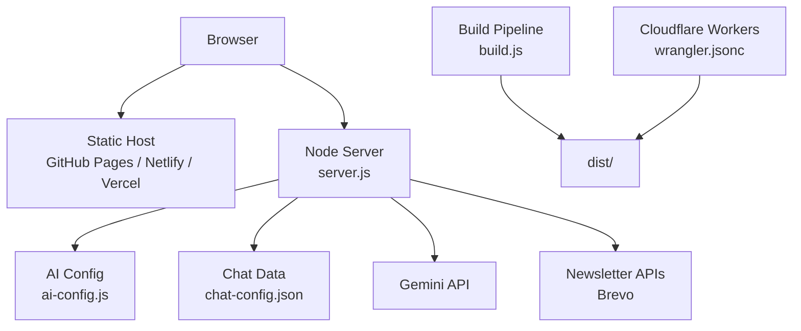
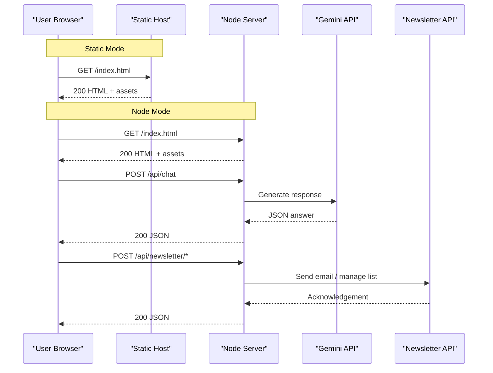
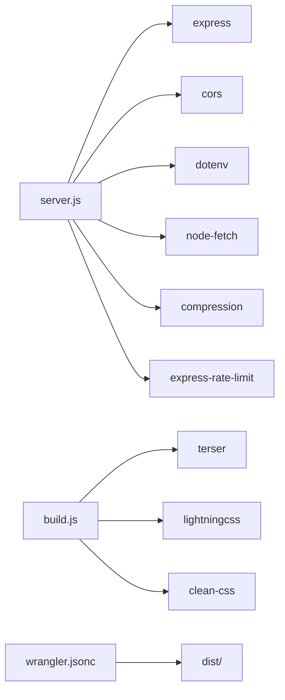

# Getting Started

<cite>
**Referenced Files in This Document**
- [README.md](file://README.md)
- [package.json](file://package.json)
- [server.js](file://server.js)
- [build.js](file://build.js)
- [ai-config.js](file://ai-config.js)
- [chat-config.json](file://chat-config.json)
- [wrangler.jsonc](file://wrangler.jsonc)
- [docs/deploy/DEPLOY-GITHUB.md](file://docs/deploy/DEPLOY-GITHUB.md)
- [docs/deploy/GITHUB-SETUP-RAPIDO.md](file://docs/deploy/GITHUB-SETUP-RAPIDO.md)
- [docs/chatbot/QUICK-START.md](file://docs/chatbot/QUICK-START.md)
- [docs/chatbot/README-CHAT.md](file://docs/chatbot/README-CHAT.md)
- [workers/webnovis-ai/.dev.vars.example](file://workers/webnovis-ai/.dev.vars.example)
</cite>

## Table of Contents
1. Introduction
2. Project Structure
3. Core Components
4. Architecture Overview
5. Detailed Component Analysis
6. Dependency Analysis
7. Performance Considerations
8. Troubleshooting Guide
9. Conclusion
10. Appendices

## Introduction
This guide helps you install, configure, and deploy WebNovis in two modes:
- Static mode (GitHub Pages or any static host): serves HTML/CSS/JS only; server-side endpoints are not available.
- Node.js mode (Express backend): enables AI chat/search, newsletter automation, security headers, canonical redirects, and more.

You will find step-by-step setup instructions, environment configuration, first-time contributor guidance, verification steps, and troubleshooting tips for both deployment modes.

## Project Structure
At a high level:
- Frontend assets: index.html, css/, js/, Img/, fonts/
- Backend server: server.js (Express), ai-config.js, chat-config.json
- Build pipeline: build.js (minification, asset discovery, HTML transforms)
- Workers and Cloudflare: wrangler.jsonc, workers/
- Documentation: docs/deploy/*, docs/chatbot/*
- Scripts and data: scripts/, config/, data/

**Diagram sources**
- [server.js:224-530](file://server.js#L224-L530)
- [build.js:373-496](file://build.js#L373-L496)
- [wrangler.jsonc:1-29](file://wrangler.jsonc#L1-L29)

**Section sources**
- [README.md:33-58](file://README.md#L33-L58)
- [package.json:69-90](file://package.json#L69-L90)

## Core Components
- Express server (server.js): Serves static files, applies SEO/security middleware, rate limits, canonical redirects, and exposes /api endpoints when running in Node mode.
- Build system (build.js): Discovers JS/CSS from HTML, minifies with Terser/Lightning CSS, and optionally minifies src/html pages to the publish root.
- AI configuration (ai-config.js): Centralizes model names and generation parameters used by the server and scripts.
- Chat content (chat-config.json): Defines company info, services, pricing, and chatbot behavior.
- Cloudflare Workers (wrangler.jsonc): Publishes the built dist/ artifact as static assets with specific html_handling rules.

Key responsibilities:
- Static hosting: Serve index.html and assets directly.
- Node hosting: Start server.js, load .env, serve static files, and handle /api routes.
- Build: Prepare optimized assets and optional HTML minification for production.

**Section sources**
- [server.js:224-530](file://server.js#L224-L530)
- [build.js:373-496](file://build.js#L373-L496)
- [ai-config.js:1-38](file://ai-config.js#L1-L38)
- [chat-config.json:1-109](file://chat-config.json#L1-L109)
- [wrangler.jsonc:1-29](file://wrangler.jsonc#L1-L29)

## Architecture Overview
WebNovis supports two runtime modes:

- Static-only (GitHub Pages, Netlify, etc.):
  - Serves index.html and assets.
  - No server-side endpoints (/api/*).
  - Chat uses local fallback responses.

- Node.js (Express):
  - Runs server.js to serve static assets and expose /api endpoints.
  - Integrates Gemini AI for chat and search.
  - Applies security headers, canonical redirects, and rate limiting.
  - Supports newsletter automation via Brevo.

**Diagram sources**
- [server.js:224-530](file://server.js#L224-L530)
- [server.js:643-800](file://server.js#L643-L800)

**Section sources**
- [README.md:47-58](file://README.md#L47-L58)
- [docs/deploy/DEPLOY-GITHUB.md:51-69](file://docs/deploy/DEPLOY-GITHUB.md#L51-L69)

## Detailed Component Analysis

### Installation and Environment Setup
- Prerequisites:
  - Git
  - Node.js (for Node mode)
  - Optional: Wrangler CLI (for Cloudflare Workers)

- Clone and install dependencies:
  - git clone <repo-url>
  - cd webnovis-site
  - npm install

- Environment variables (Node mode):
  - Create .env from example if provided by your platform or copy keys into your hosting provider’s environment settings.
  - Required keys include Gemini API keys for chat/search/writer, Brevo API key, and admin secret for newsletter endpoints.
  - Example reference for worker dev vars is available at workers/webnovis-ai/.dev.vars.example.

- Start development server:
  - npm run dev
  - Open http://localhost:3000

- Verify installation:
  - Static mode: open index.html locally or via a simple HTTP server.
  - Node mode: confirm server starts on port 3000 and that /api endpoints respond when configured.

**Section sources**
- [README.md:60-93](file://README.md#L60-L93)
- [CONTRIBUTING.md:3-20](file://CONTRIBUTING.md#L3-L20)
- [docs/chatbot/QUICK-START.md:5-32](file://docs/chatbot/QUICK-START.md#L5-L32)
- [docs/chatbot/README-CHAT.md:5-45](file://docs/chatbot/README-CHAT.md#L5-L45)
- [workers/webnovis-ai/.dev.vars.example:1-8](file://workers/webnovis-ai/.dev.vars.example#L1-L8)

### Deployment Mode 1: Static Hosting (GitHub Pages)
- Steps:
  - Ensure index.html is in the repository root.
  - Push code to GitHub.
  - Enable GitHub Pages: Settings → Pages → Source: main branch, Folder: /.
  - Wait for deployment and verify site URL.

- Notes:
  - Only static files are served; no server-side endpoints.
  - Use local fallback responses for the chatbot.
  - For custom domains, configure DNS records as documented.

- Verification:
  - Visit https://<username>.github.io/<repo>/
  - Confirm assets load and chat shows local responses.

**Section sources**
- [docs/deploy/DEPLOY-GITHUB.md:10-69](file://docs/deploy/DEPLOY-GITHUB.md#L10-L69)
- [docs/deploy/GITHUB-SETUP-RAPIDO.md:12-37](file://docs/deploy/GITHUB-SETUP-RAPIDO.md#L12-L37)
- [README.md:97-107](file://README.md#L97-L107)

### Deployment Mode 2: Node.js Backend (Full AI Functionality)
- Steps:
  - Install dependencies: npm install
  - Configure environment variables (Gemini keys, Brevo key, newsletter admin secret).
  - Start server: npm start or npm run dev
  - Open http://localhost:3000

- Endpoints enabled in Node mode:
  - /api/chat, /api/search-ai, /api/newsletter/*, /api/lead (when configured)

- Production considerations:
  - Set NODE_ENV=production
  - Configure CORS origins and rate limiting
  - Secure secrets using your hosting provider’s environment management

- Verification:
  - Confirm server logs show compression, security headers, and public file counts.
  - Test /api/search-ai with a sample query.
  - Test newsletter endpoints with proper authentication headers.

**Section sources**
- [README.md:75-93](file://README.md#L75-L93)
- [server.js:224-530](file://server.js#L224-L530)
- [server.js:643-800](file://server.js#L643-L800)
- [package.json:6-60](file://package.json#L6-L60)

### Build System and Publishing
- Build commands:
  - npm run build: minify JS/CSS and optionally minify src/html pages.
  - npm run build:site:dist: prepare a curated dist/ artifact for publishing.
  - npm run build:search-index: generate search index.
  - npm run build:sitemap: generate sitemap.xml.

- Publishing to Cloudflare Workers:
  - Use npx wrangler deploy with wrangler.jsonc pointing to dist/.
  - html_handling is set to none to preserve .html URLs.

- Local preview:
  - After building, serve dist/ with any static server to validate output.

**Section sources**
- [package.json:6-60](file://package.json#L6-L60)
- [build.js:373-496](file://build.js#L373-L496)
- [wrangler.jsonc:1-29](file://wrangler.jsonc#L1-L29)

### First-Time Contributor Guidance
- Local setup:
  - npm install
  - npm run dev
  - Edit files under js/, css/, and src/html/ as needed.

- Code conventions:
  - JavaScript: ESLint and Prettier configured.
  - HTML: Minified in production; keep source readable.
  - CSS: Minified with PostCSS; source in css/.

- Workflow:
  - Create feature branches with descriptive names.
  - Commit messages in English with prefixes (fix:, feat:, docs:, perf:, refactor:).
  - Run tests before committing: npx vitest run
  - Regenerate sitemap after adding/removing HTML pages.

- Useful commands:
  - npm run dev
  - npm start
  - node generate-sitemap.js
  - node build-search-index.js
  - npx vitest run

**Section sources**
- [CONTRIBUTING.md:3-76](file://CONTRIBUTING.md#L3-L76)
- [package.json:6-60](file://package.json#L6-L60)

## Dependency Analysis
Core runtime dependencies:
- express, cors, dotenv, node-fetch, nunjucks
- compression, express-rate-limit (optional but recommended in production)

Development dependencies:
- terser, clean-css, lightningcss, html-minifier-terser, vitest, wrangler

Build-time relationships:
- build.js discovers assets referenced by HTML and minifies them.
- wrangler.jsonc publishes the curated dist/ artifact.

**Diagram sources**
- [package.json:69-90](file://package.json#L69-L90)
- [build.js:15-27](file://build.js#L15-L27)
- [wrangler.jsonc:22-28](file://wrangler.jsonc#L22-L28)

**Section sources**
- [package.json:69-90](file://package.json#L69-L90)

## Performance Considerations
- Compression: Enabled in server.js when available; reduces payload size significantly.
- Caching: Static assets use long-lived caching in production; HTML uses short TTL with stale-while-revalidate.
- Minification: build.js minifies JS/CSS and optionally HTML for smaller payloads.
- Rate limiting: Protects AI endpoints against abuse and controls costs.
- CDN: Cloudflare Workers can cache and serve static assets efficiently.

[No sources needed since this section provides general guidance]

## Troubleshooting Guide
Common issues and resolutions:
- Chatbot does not respond:
  - In static mode, expect local fallback responses.
  - In Node mode, ensure server is running and API keys are configured.
  - Check browser console for errors.

- Animations not working:
  - Ensure main JS is loaded and compatible with the browser.
  - Disable interfering extensions.

- Layout broken on mobile:
  - Verify viewport meta tag and media queries.
  - Test on real devices.

- Port already in use:
  - Kill processes on port 3000 or change PORT in .env.

- Domain not found:
  - Verify DNS records and propagation time.

- Build failures:
  - Reinstall dependencies and rerun build scripts.
  - Inspect logs for missing modules or syntax errors.

- AI quota exceeded:
  - Monitor daily usage and adjust thresholds or keys.

**Section sources**
- [README.md:251-266](file://README.md#L251-L266)
- [docs/deploy/DEPLOY-GITHUB.md:346-385](file://docs/deploy/DEPLOY-GITHUB.md#L346-L385)
- [docs/chatbot/README-CHAT.md:148-163](file://docs/chatbot/README-CHAT.md#L148-L163)

## Conclusion
You now have the complete path to install, configure, and deploy WebNovis in both static and Node.js modes. Use static hosting for quick, low-maintenance deployments and Node.js mode when you need full AI capabilities and server-side features. Follow the verification steps and troubleshooting tips to ensure a smooth launch.

[No sources needed since this section summarizes without analyzing specific files]

## Appendices

### Environment Variables Reference
- GEMINI_API_KEY_CHAT: Chatbot AI key
- GEMINI_API_KEY_SEARCH: Search AI key
- GEMINI_API_KEY_WRITER: Blog writer key
- GROQ_API_KEY: Newsletter AI/fallback writer
- BREVO_API_KEY: Newsletter and lead workflow
- NEWSLETTER_ADMIN_SECRET: Admin secret for protected endpoints
- NODE_ENV: Environment mode
- PORT: Server port

**Section sources**
- [README.md:218-232](file://README.md#L218-L232)
- [ai-config.js:1-38](file://ai-config.js#L1-L38)
- [workers/webnovis-ai/.dev.vars.example:1-8](file://workers/webnovis-ai/.dev.vars.example#L1-L8)

### Quick Commands
- Start development: npm run dev
- Start production: npm start
- Build assets: npm run build
- Build site artifact: npm run build:site:dist
- Generate search index: npm run build:search-index
- Generate sitemap: npm run build:sitemap
- Run tests: npx vitest run

**Section sources**
- [package.json:6-60](file://package.json#L6-L60)
- [CONTRIBUTING.md:54-63](file://CONTRIBUTING.md#L54-L63)