# Asset Optimization Pipeline

<cite>
**Referenced Files in This Document**
- [build.js](file://build.js)
- [package.json](file://package.json)
- [config/publish-targets.js](file://config/publish-targets.js)
- [scripts/prepare-public-artifact.js](file://scripts/prepare-public-artifact.js)
- [scripts/public-artifact.js](file://scripts/public-artifact.js)
- [scripts/fix-cache-busting.js](file://scripts/fix-cache-busting.js)
- [bump-css-version.js](file://bump-css-version.js)
- [config/image-policy.js](file://config/image-policy.js)
- [scripts/legacy/root-oneoff/convert-webp.js](file://scripts/legacy/root-oneoff/convert-webp.js)
- [scripts/legacy/root-oneoff/compress-mockups.js](file://scripts/legacy/root-oneoff/compress-mockups.js)
- [scripts/legacy/root-oneoff/fix-lcp.js](file://scripts/legacy/root-oneoff/fix-lcp.js)
- [config/seo-html-transforms.js](file://config/seo-html-transforms.js)
- [docs/deploy/MIGRAZIONE-CLOUDFLARE-PAGES.md](file://docs/deploy/MIGRAZIONE-CLOUDFLARE-PAGES.md)
</cite>

## Table of Contents
1. Introduction
2. Project Structure
3. Core Components
4. Architecture Overview
5. Detailed Component Analysis
6. Dependency Analysis
7. Performance Considerations
8. Troubleshooting Guide
9. Conclusion
10. Appendices

## Introduction
This document explains the WebNovis asset optimization pipeline, covering CSS minification with Lightning CSS (with CleanCSS fallback), JavaScript bundling and minification with Terser, image optimization strategies including WebP conversion and lazy loading, build script architecture for discovering, processing, and optimizing static assets, asset versioning and cache busting, dependency management, configuration examples, adding new asset types, troubleshooting, and integration with the static site generation process and production serving.

## Project Structure
The build system is orchestrated by a Node-based pipeline:
- Build entry: build.js performs JS/CSS minification and optional HTML minification.
- Public artifact preparation: scripts/prepare-public-artifact.js orchestrates the full build sequence, materializes static sources, runs generators, normalizations, validations, and promotes a safe artifact to dist/.
- Configuration: config/publish-targets.js defines source and publish roots; config/seo-html-transforms.js applies SEO-related HTML transformations during build.
- Image policy: config/image-policy.js injects lazy loading attributes into images based on heuristics.
- Legacy image utilities: scripts/legacy/root-oneoff/* provide one-off or manual WebP conversion and LCP fixes using sharp.
- Cache busting: scripts/fix-cache-busting.js adds content-hash query parameters to CSS/JS references in HTML.
- Version bumping: bump-css-version.js updates CSS version query strings across HTML files.
- Package scripts: package.json exposes npm commands that wire everything together.

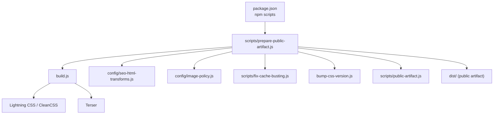

**Diagram sources**
- [package.json:6-53](file://package.json#L6-L53)
- [scripts/prepare-public-artifact.js:183-253](file://scripts/prepare-public-artifact.js#L183-L253)
- [build.js:1-113](file://build.js#L1-L113)
- [config/seo-html-transforms.js:1-20](file://config/seo-html-transforms.js#L1-L20)
- [config/image-policy.js:1-58](file://config/image-policy.js#L1-L58)
- [scripts/fix-cache-busting.js:1-99](file://scripts/fix-cache-busting.js#L1-L99)
- [bump-css-version.js:1-35](file://bump-css-version.js#L1-L35)
- [scripts/public-artifact.js:145-253](file://scripts/public-artifact.js#L145-L253)

**Section sources**
- [package.json:6-53](file://package.json#L6-L53)
- [scripts/prepare-public-artifact.js:183-253](file://scripts/prepare-public-artifact.js#L183-L253)
- [build.js:1-113](file://build.js#L1-L113)
- [config/publish-targets.js:1-36](file://config/publish-targets.js#L1-L36)

## Core Components
- CSS Minification: Lightning CSS is used first; if unavailable or failing, CleanCSS is used as a safe fallback. Per-file overrides are supported.
- JavaScript Minification: Terser is used with aggressive compression options and per-file overrides.
- HTML Minification: Optional html-minifier-terser is used for src/html/ pages only, after applying SEO transforms.
- Asset Discovery: The build scans published HTML to discover referenced .js and .css, merges with explicit inputs, and builds a deduplicated input set.
- Image Policy: Lazy loading is injected for non-whitelisted images; legacy scripts handle WebP conversion and LCP adjustments.
- Cache Busting: Content-hash query parameters are added to CSS/JS references in HTML.
- Artifact Promotion: A staging directory is built and atomically promoted to dist/ with safety checks and reports.

**Section sources**
- [build.js:16-113](file://build.js#L16-L113)
- [build.js:209-279](file://build.js#L209-L279)
- [build.js:290-371](file://build.js#L290-L371)
- [build.js:428-493](file://build.js#L428-L493)
- [config/image-policy.js:37-53](file://config/image-policy.js#L37-L53)
- [scripts/fix-cache-busting.js:1-99](file://scripts/fix-cache-busting.js#L1-L99)
- [scripts/prepare-public-artifact.js:183-253](file://scripts/prepare-public-artifact.js#L183-L253)

## Architecture Overview
The pipeline composes multiple Node scripts to produce a deterministic, validated public artifact:
- prepare-public-artifact.js sets up an isolated staging environment, copies static media/fonts, runs geo generation, build.js, normalization, footer updates, search index, sitemap, LLMs indexes, security headers sync, pruning unreferenced assets, validation, and finally promotes the artifact to dist/.
- build.js discovers assets from HTML, minifies JS/CSS, optionally minifies HTML, and writes outputs under the configured publish root.
- config/publish-targets.js centralizes path resolution for source, publish, and report directories.
- config/seo-html-transforms.js applies SEO-specific HTML changes during build.
- config/image-policy.js ensures appropriate loading behavior for images.

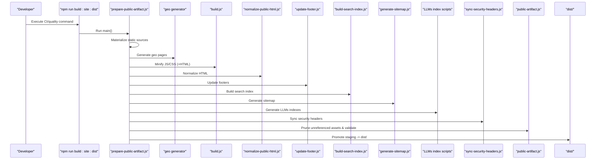

**Diagram sources**
- [scripts/prepare-public-artifact.js:183-253](file://scripts/prepare-public-artifact.js#L183-L253)
- [build.js:373-493](file://build.js#L373-L493)
- [scripts/public-artifact.js:145-253](file://scripts/public-artifact.js#L145-L253)

**Section sources**
- [scripts/prepare-public-artifact.js:183-253](file://scripts/prepare-public-artifact.js#L183-L253)
- [build.js:373-493](file://build.js#L373-L493)
- [scripts/public-artifact.js:145-253](file://scripts/public-artifact.js#L145-L253)

## Detailed Component Analysis

### CSS Minification with Lightning CSS and CleanCSS Fallback
- Primary engine: Lightning CSS transform with minify enabled and drafts for nesting/custom media.
- Fallback: CleanCSS level-1 transforms to avoid risky reordering.
- Per-file overrides: Merge deep options via overrides map.
- Output: Writes .min.css next to source paths under publish root.

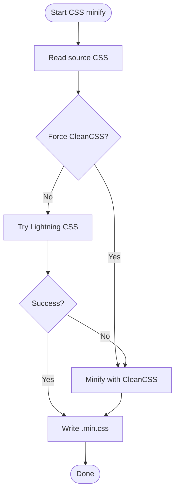

**Diagram sources**
- [build.js:315-371](file://build.js#L315-L371)

**Section sources**
- [build.js:77-113](file://build.js#L77-L113)
- [build.js:315-371](file://build.js#L315-L371)

### JavaScript Minification with Terser
- Inputs: Explicit list plus discovered .js from HTML.
- Options: Aggressive compression, dead code elimination, mangle disabled at top-level/properties, comments removed.
- Per-file overrides: Deep merge with terserOptions.
- Output: Writes .min.js next to source paths under publish root.

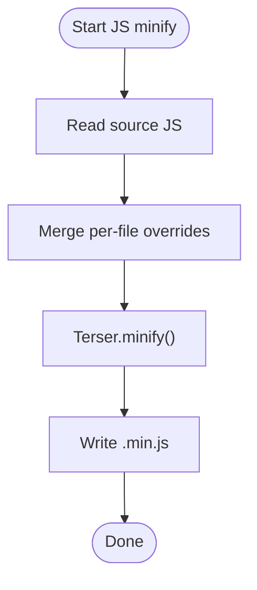

**Diagram sources**
- [build.js:290-313](file://build.js#L290-L313)

**Section sources**
- [build.js:36-76](file://build.js#L36-L76)
- [build.js:290-313](file://build.js#L290-L313)

### HTML Minification and SEO Transforms
- Scope: Only src/html/ pages are minified; other generated HTML is not touched by this step.
- Transform: applySeoHtmlTransforms is applied before minification.
- Minifier: html-minifier-terser with conservative settings.

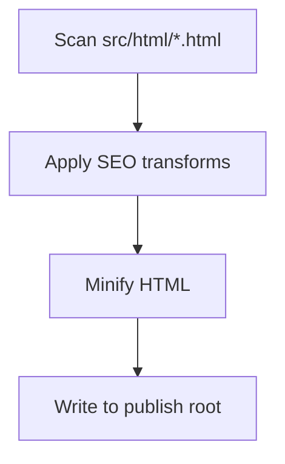

**Diagram sources**
- [build.js:428-493](file://build.js#L428-L493)
- [config/seo-html-transforms.js:1-20](file://config/seo-html-transforms.js#L1-L20)

**Section sources**
- [build.js:428-493](file://build.js#L428-L493)
- [config/seo-html-transforms.js:1-20](file://config/seo-html-transforms.js#L1-L20)

### Asset Discovery and Input Collection
- Scans published HTML for <script src="..."> and <link rel="stylesheet" href="...">.
- Resolves local assets relative to HTML location, filters out external/data URIs.
- Merges with explicit inputs and deduplicates, ensuring only existing source files are included.

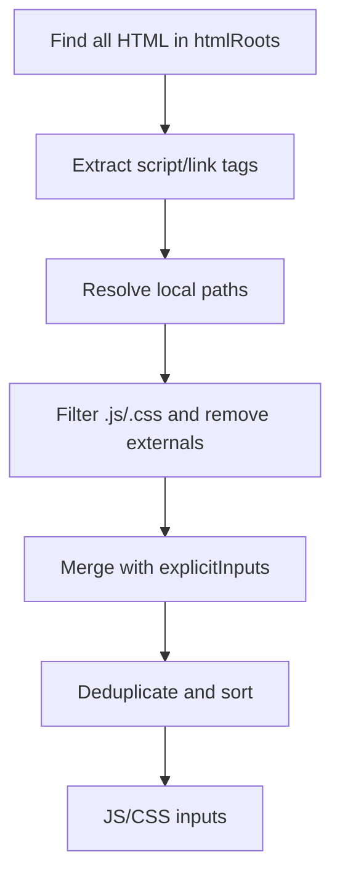

**Diagram sources**
- [build.js:159-207](file://build.js#L159-L207)
- [build.js:209-279](file://build.js#L209-L279)

**Section sources**
- [build.js:159-207](file://build.js#L159-L207)
- [build.js:209-279](file://build.js#L209-L279)

### Image Optimization Strategies
- Lazy Loading: config/image-policy.js injects loading="lazy" unless whitelisted by class/alt/src keywords (e.g., logo, hero).
- WebP Conversion: Legacy scripts use sharp to convert PNG/JPG to WebP with quality tuning; some scripts also generate AVIF.
- LCP Fixes: One-off scripts adjust preload/fetchpriority for hero images and ensure critical images load eagerly.

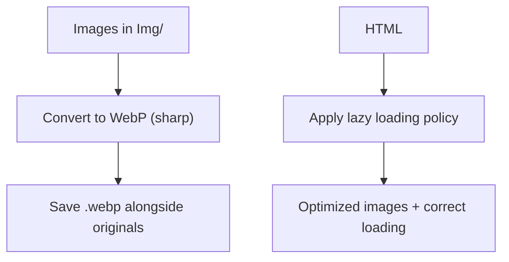

**Diagram sources**
- [config/image-policy.js:37-53](file://config/image-policy.js#L37-L53)
- [scripts/legacy/root-oneoff/convert-webp.js:1-95](file://scripts/legacy/root-oneoff/convert-webp.js#L1-L95)
- [scripts/legacy/root-oneoff/compress-mockups.js:1-38](file://scripts/legacy/root-oneoff/compress-mockups.js#L1-L38)
- [scripts/legacy/root-oneoff/fix-lcp.js:1-125](file://scripts/legacy/root-oneoff/fix-lcp.js#L1-L125)

**Section sources**
- [config/image-policy.js:1-58](file://config/image-policy.js#L1-L58)
- [scripts/legacy/root-oneoff/convert-webp.js:1-95](file://scripts/legacy/root-oneoff/convert-webp.js#L1-L95)
- [scripts/legacy/root-oneoff/compress-mockups.js:1-38](file://scripts/legacy/root-oneoff/compress-mockups.js#L1-L38)
- [scripts/legacy/root-oneoff/fix-lcp.js:1-125](file://scripts/legacy/root-oneoff/fix-lcp.js#L1-L125)

### Build Script Architecture and Orchestration
- prepare-public-artifact.js coordinates the entire pipeline:
  - Materializes static sources (blog/portfolio HTML, Img, fonts, technical files).
  - Runs geo generation, build.js, normalization, footer update, search index, sitemap, LLMs indexes, security headers sync.
  - Prunes unreferenced assets and validates pages.
  - Promotes staging to dist/ safely.
- publish-targets.js provides consistent root resolution for source, publish, and report directories.

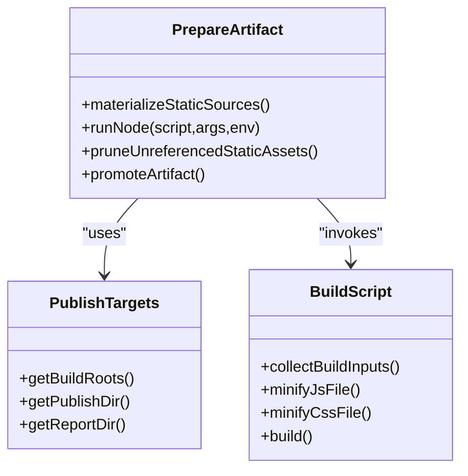

**Diagram sources**
- [scripts/prepare-public-artifact.js:87-156](file://scripts/prepare-public-artifact.js#L87-L156)
- [scripts/prepare-public-artifact.js:183-253](file://scripts/prepare-public-artifact.js#L183-L253)
- [config/publish-targets.js:1-36](file://config/publish-targets.js#L1-L36)
- [build.js:242-279](file://build.js#L242-L279)
- [build.js:373-493](file://build.js#L373-L493)

**Section sources**
- [scripts/prepare-public-artifact.js:87-156](file://scripts/prepare-public-artifact.js#L87-L156)
- [scripts/prepare-public-artifact.js:183-253](file://scripts/prepare-public-artifact.js#L183-L253)
- [config/publish-targets.js:1-36](file://config/publish-targets.js#L1-L36)
- [build.js:242-279](file://build.js#L242-L279)
- [build.js:373-493](file://build.js#L373-L493)

### Asset Versioning and Cache Busting
- Content-hash versioning: scripts/fix-cache-busting.js computes MD5 hashes of CSS/JS files and appends ?v=HASH to references in HTML.
- Manual version bumping: bump-css-version.js updates specific CSS version query strings across HTML files.
- Integration: These scripts can be invoked post-build to ensure browsers fetch updated assets when content changes.

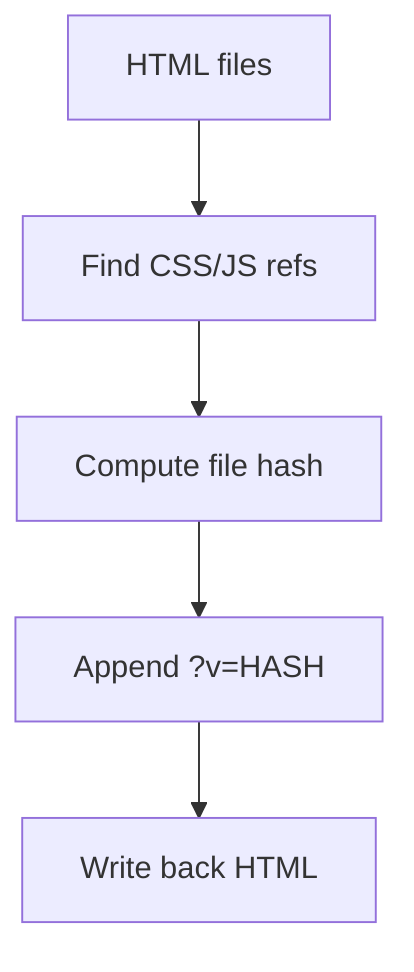

**Diagram sources**
- [scripts/fix-cache-busting.js:1-99](file://scripts/fix-cache-busting.js#L1-L99)
- [bump-css-version.js:1-35](file://bump-css-version.js#L1-L35)

**Section sources**
- [scripts/fix-cache-busting.js:1-99](file://scripts/fix-cache-busting.js#L1-L99)
- [bump-css-version.js:1-35](file://bump-css-version.js#L1-L35)

### Static Site Generation Integration and Production Serving
- prepare-public-artifact.js generates geo pages, runs build.js, normalizes HTML, updates footers, builds search index, sitemaps, LLMs indexes, and syncs security headers.
- dist/ contains platform files like _headers and _redirects for Cloudflare Pages, generated/copied by the pipeline.
- The final artifact is validated and promoted atomically to dist/, which is then served by the hosting platform.

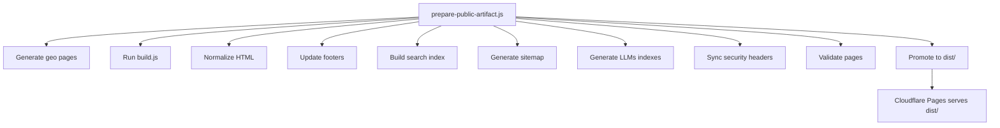

**Diagram sources**
- [scripts/prepare-public-artifact.js:183-253](file://scripts/prepare-public-artifact.js#L183-L253)
- [docs/deploy/MIGRAZIONE-CLOUDFLARE-PAGES.md:82-89](file://docs/deploy/MIGRAZIONE-CLOUDFLARE-PAGES.md#L82-L89)

**Section sources**
- [scripts/prepare-public-artifact.js:183-253](file://scripts/prepare-public-artifact.js#L183-L253)
- [docs/deploy/MIGRAZIONE-CLOUDFLARE-PAGES.md:82-89](file://docs/deploy/MIGRAZIONE-CLOUDFLARE-PAGES.md#L82-L89)

## Dependency Analysis
- Core dependencies:
  - terser for JS minification.
  - lightningcss for modern CSS minification.
  - clean-css as fallback.
  - html-minifier-terser for HTML minification (optional).
  - sharp for image conversions (used in legacy scripts).
- Orchestration:
  - prepare-public-artifact.js calls multiple scripts via child processes.
  - publish-targets.js centralizes path configuration.
- Safety:
  - public-artifact.js enforces safe publish targets, avoids symlinks, and validates artifacts.

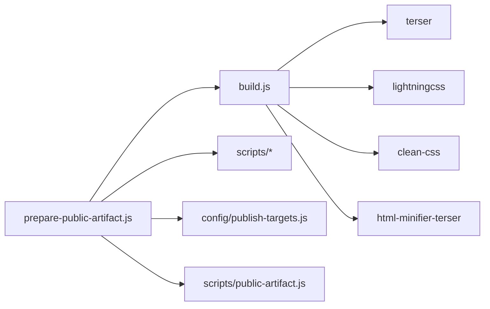

**Diagram sources**
- [package.json:78-90](file://package.json#L78-L90)
- [build.js:1-27](file://build.js#L1-L27)
- [scripts/prepare-public-artifact.js:183-253](file://scripts/prepare-public-artifact.js#L183-L253)
- [scripts/public-artifact.js:145-253](file://scripts/public-artifact.js#L145-L253)
- [config/publish-targets.js:1-36](file://config/publish-targets.js#L1-L36)

**Section sources**
- [package.json:78-90](file://package.json#L78-L90)
- [build.js:1-27](file://build.js#L1-L27)
- [scripts/prepare-public-artifact.js:183-253](file://scripts/prepare-public-artifact.js#L183-L253)
- [scripts/public-artifact.js:145-253](file://scripts/public-artifact.js#L145-L253)
- [config/publish-targets.js:1-36](file://config/publish-targets.js#L1-L36)

## Performance Considerations
- Prefer Lightning CSS for modern features; fallback to CleanCSS only when necessary.
- Use per-file overrides sparingly to avoid divergent configs.
- Keep explicitInputs minimal and rely on discovery to reduce maintenance.
- Ensure images are converted to WebP/AVIF where possible and lazy-loaded except for critical above-the-fold assets.
- Apply content-hash cache busting to prevent stale caching.
- Prune unreferenced assets to minimize payload.

[No sources needed since this section provides general guidance]

## Troubleshooting Guide
- Lightning CSS fails: Check error logs; force CleanCSS fallback via css.forceCleanCss for problematic files.
- Empty Terser output: Validate JS syntax and ensure no unsupported features; inspect per-file overrides.
- HTML minification skipped: Verify html-minifier-terser is installed; check src/html/ presence.
- Missing assets: Confirm discovery paths and skipDirs; ensure referenced assets exist under SOURCE_ROOT.
- Cache busting not applied: Run fix-cache-busting.js; ensure HTML paths match expected patterns.
- Artifact promotion errors: Ensure staging directory is valid and not symlink-backed; check permissions.

**Section sources**
- [build.js:315-371](file://build.js#L315-L371)
- [build.js:290-313](file://build.js#L290-L313)
- [build.js:428-493](file://build.js#L428-L493)
- [scripts/fix-cache-busting.js:1-99](file://scripts/fix-cache-busting.js#L1-L99)
- [scripts/public-artifact.js:145-253](file://scripts/public-artifact.js#L145-L253)

## Conclusion
The WebNovis asset optimization pipeline combines robust minification engines, intelligent asset discovery, image optimization policies, and a secure artifact promotion process. It integrates seamlessly with static site generation and production hosting, ensuring fast, cache-friendly, and maintainable delivery of optimized assets.

[No sources needed since this section summarizes without analyzing specific files]

## Appendices

### How to Configure Optimization Settings
- CSS overrides: Add per-file entries in build.js css.overrides to tweak Lightning CSS or CleanCSS options.
- JS overrides: Add per-file entries in build.js js.overrides to customize Terser options.
- Skip lists: Use js.skip and css.skip to exclude files from processing.
- Explicit inputs: Extend js.explicitInputs and css.explicitInputs to include additional source files.

**Section sources**
- [build.js:36-113](file://build.js#L36-L113)

### How to Add New Asset Types
- Extend collectBuildInputs to recognize new extensions and add them to the candidate sets.
- Implement minification handlers similar to minifyJsFile/minifyCssFile.
- Update outputPathFor suffix mapping for new asset types.
- Integrate into prepare-public-artifact.js if they need to be copied/pruned.

[No sources needed since this section provides general guidance]

### How to Optimize Images
- Convert images to WebP/AVIF using sharp-based scripts in scripts/legacy/root-oneoff.
- Apply lazy loading via config/image-policy.js; whitelist critical images as needed.
- Adjust LCP for hero images using one-off scripts to set eager loading and high priority.

**Section sources**
- [scripts/legacy/root-oneoff/convert-webp.js:1-95](file://scripts/legacy/root-oneoff/convert-webp.js#L1-L95)
- [scripts/legacy/root-oneoff/compress-mockups.js:1-38](file://scripts/legacy/root-oneoff/compress-mockups.js#L1-L38)
- [scripts/legacy/root-oneoff/fix-lcp.js:1-125](file://scripts/legacy/root-oneoff/fix-lcp.js#L1-L125)
- [config/image-policy.js:37-53](file://config/image-policy.js#L37-L53)

### How to Manage Dependencies
- Install devDependencies for build tools: terser, lightningcss, clean-css, html-minifier-terser, sharp.
- Use npm scripts defined in package.json to orchestrate builds and deployments.

**Section sources**
- [package.json:78-90](file://package.json#L78-L90)
- [package.json:6-53](file://package.json#L6-L53)

### Serving in Production Environments
- The pipeline produces dist/ with static assets and platform files (_headers, _redirects).
- Deploy dist/ to Cloudflare Pages or similar static hosts; ensure headers and redirects are present.

**Section sources**
- [docs/deploy/MIGRAZIONE-CLOUDFLARE-PAGES.md:82-89](file://docs/deploy/MIGRAZIONE-CLOUDFLARE-PAGES.md#L82-L89)