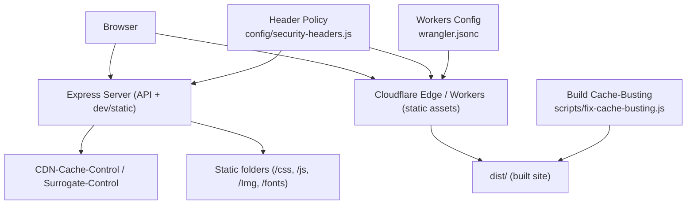
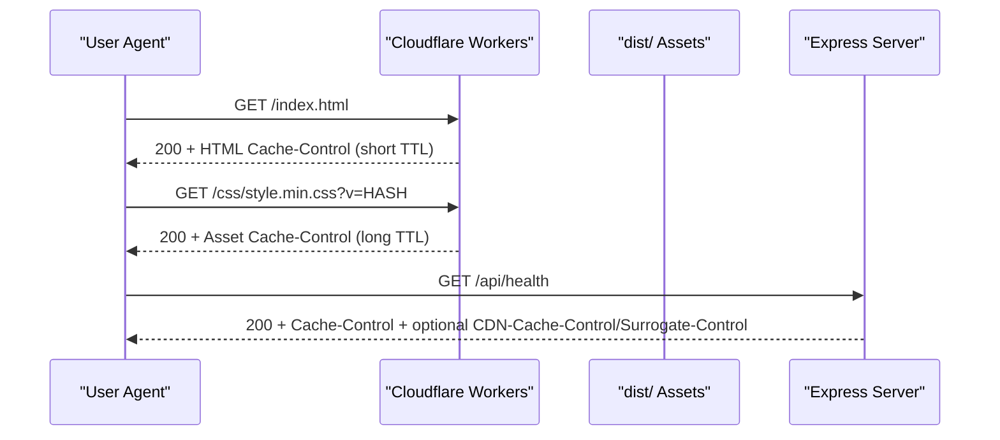
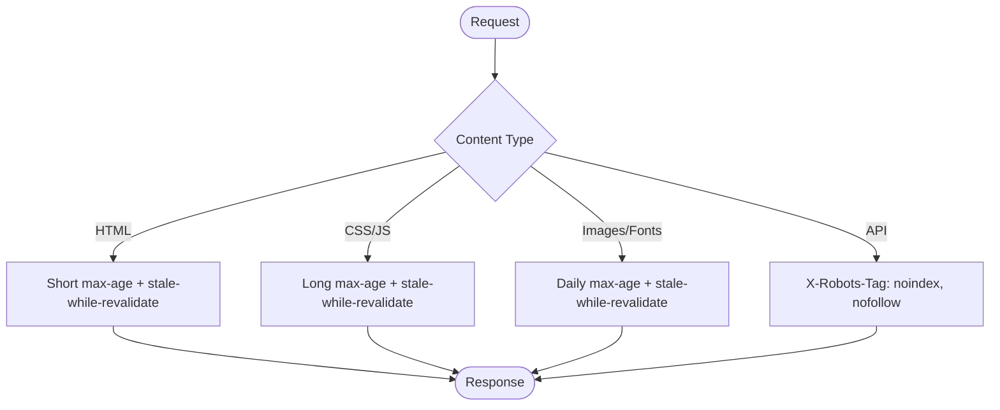
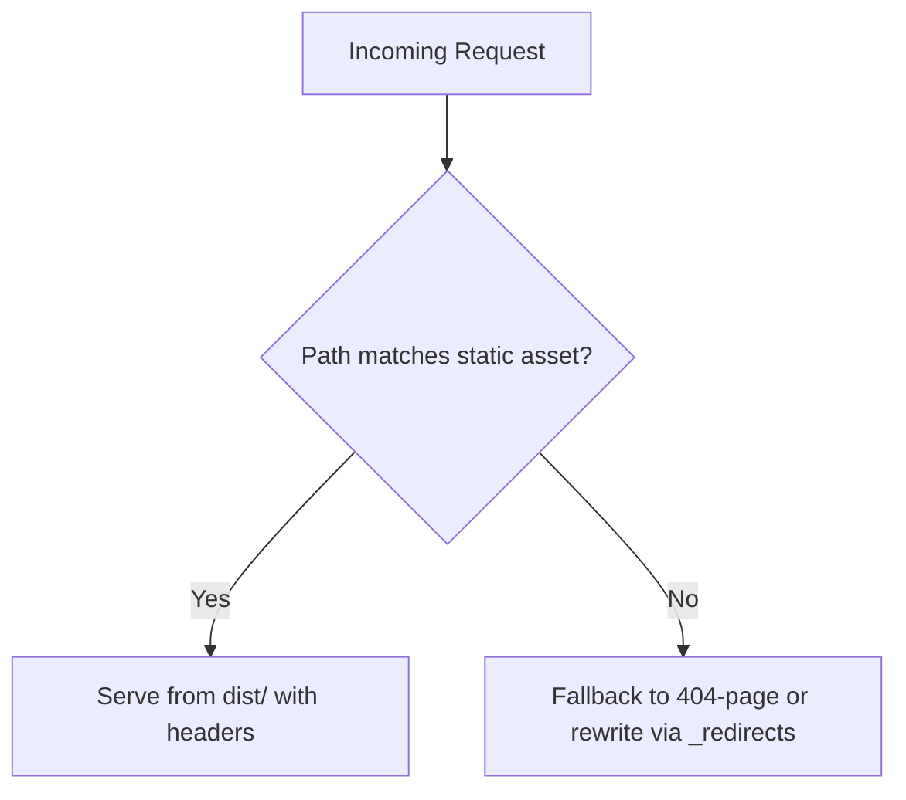
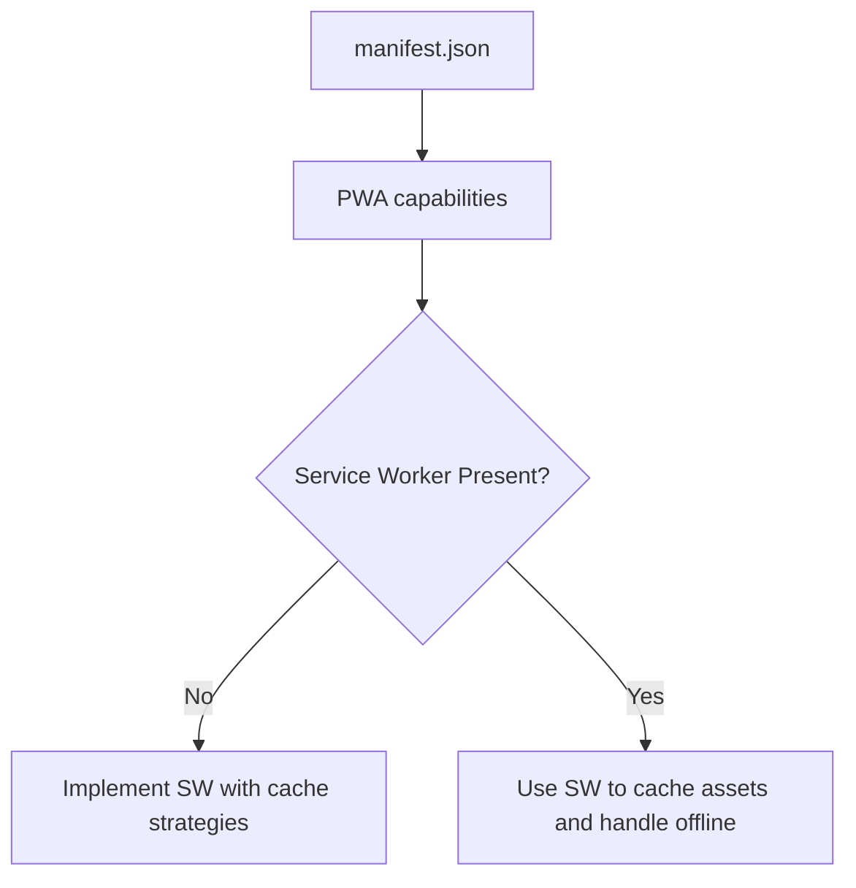
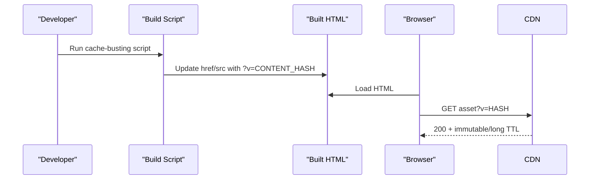
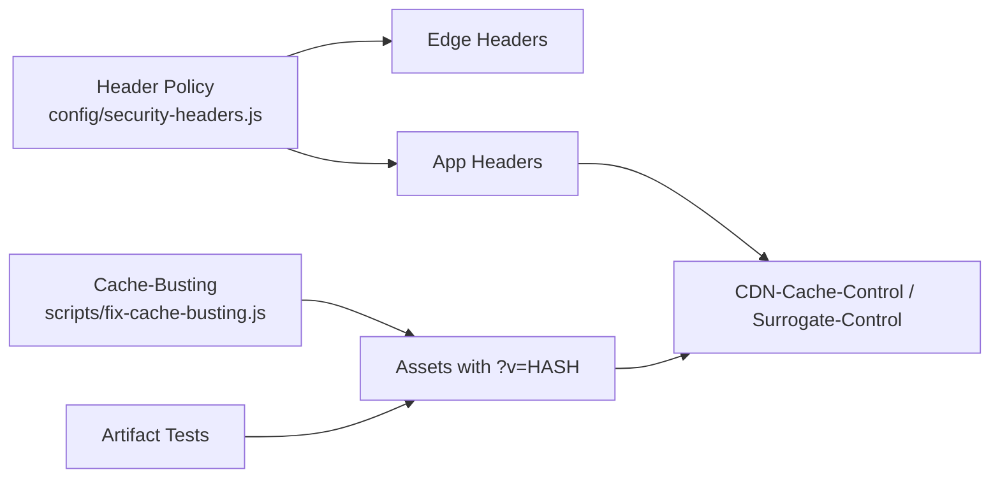

# Caching & CDN Configuration

<cite>
**Referenced Files in This Document**
- [config/security-headers.js](file://config/security-headers.js)
- [server.js](file://server.js)
- [wrangler.jsonc](file://wrangler.jsonc)
- [workers/webnovis-ai/wrangler.jsonc](file://workers/webnovis-ai/wrangler.jsonc)
- [workers/webnovis-forms/wrangler.jsonc](file://workers/webnovis-forms/wrangler.jsonc)
- [manifest.json](file://manifest.json)
- [js/web-vitals-reporter.js](file://js/web-vitals-reporter.js)
- [scripts/fix-cache-busting.js](file://scripts/fix-cache-busting.js)
- [scripts/bust-cache-preventivo.js](file://scripts/bust-cache-preventivo.js)
- [scripts/verify-prod-headers.js](file://scripts/verify-prod-headers.js)
- [docs/deploy-header-matrix.md](file://docs/deploy-header-matrix.md)
- [docs/deploy/WORKERS-ASSETS-DIST.md](file://docs/deploy/WORKERS-ASSETS-DIST.md)
- [docs/deploy/MIGRAZIONE-CLOUDFLARE-PAGES.md](file://docs/deploy/MIGRAZIONE-CLOUDFLARE-PAGES.md)
- [docs/CLOUDFLARE-AI-SETUP.md](file://docs/CLOUDFLARE-AI-SETUP.md)
- [docs/PERFORMANCE-OPTIMIZATION-REPORT.md](file://docs/PERFORMANCE-OPTIMIZATION-REPORT.md)
- [tests/public-artifact-regressions.test.js](file://tests/public-artifact-regressions.test.js)
</cite>

## Table of Contents
1. [Introduction](#introduction)
2. [Project Structure](#project-structure)
3. [Core Components](#core-components)
4. [Architecture Overview](#architecture-overview)
5. [Detailed Component Analysis](#detailed-component-analysis)
6. [Dependency Analysis](#dependency-analysis)
7. [Performance Considerations](#performance-considerations)
8. [Troubleshooting Guide](#troubleshooting-guide)
9. [Conclusion](#conclusion)
10. [Appendices](#appendices)

## Introduction
This document explains WebNovis caching strategies and CDN configuration with a focus on HTTP caching headers, Cloudflare Workers static assets, browser caching policies, cache invalidation patterns, performance monitoring, mobile/offline considerations, and troubleshooting. It consolidates repository-defined header policies, Express runtime behavior, and Cloudflare deployment settings to provide a single source of truth for how assets and HTML are cached across the stack.

## Project Structure
Caching-related configuration spans several layers:
- Central header policy and static header generation live in the config module.
- The Node server sets production asset caching and propagates shared cache headers to CDNs.
- Cloudflare Workers is configured to serve static assets from a dist directory with explicit HTML handling to preserve existing URLs.
- Build-time scripts add content-hash cache-busting to CSS/JS references.
- Runtime verification scripts assert that production responses match expected headers.

**Diagram sources**
- [config/security-headers.js:64-100](file://config/security-headers.js#L64-L100)
- [server.js:458-481](file://server.js#L458-L481)
- [wrangler.jsonc:22-28](file://wrangler.jsonc#L22-L28)
- [scripts/fix-cache-busting.js:46-99](file://scripts/fix-cache-busting.js#L46-L99)

**Section sources**
- [config/security-headers.js:64-100](file://config/security-headers.js#L64-L100)
- [server.js:458-481](file://server.js#L458-L481)
- [wrangler.jsonc:22-28](file://wrangler.jsonc#L22-L28)
- [scripts/fix-cache-busting.js:46-99](file://scripts/fix-cache-busting.js#L46-L99)

## Core Components
- Centralized security and cache headers: defines global security headers and per-path Cache-Control rules for HTML, CSS, JS, images, fonts, and API routes.
- Express runtime caching: applies immutable long-lived caching for static assets in production and forwards shared cache directives to CDNs via custom headers.
- Cloudflare Workers static assets: serves built artifacts from dist with html_handling set to none to preserve .html URLs and redirects managed by _redirects.
- Cache-busting automation: injects content-hash query parameters into CSS/JS references to ensure cache invalidation when files change.
- Production header verification: validates that deployed endpoints return expected headers and status codes.

**Section sources**
- [config/security-headers.js:40-100](file://config/security-headers.js#L40-L100)
- [server.js:458-481](file://server.js#L458-L481)
- [wrangler.jsonc:22-28](file://wrangler.jsonc#L22-L28)
- [scripts/fix-cache-busting.js:46-99](file://scripts/fix-cache-busting.js#L46-L99)
- [scripts/verify-prod-headers.js:34-57](file://scripts/verify-prod-headers.js#L34-L57)

## Architecture Overview
The request path and caching decisions:
- Browser requests HTML or assets.
- Cloudflare Workers serves static assets from dist with configured headers; HTML handling is disabled to keep .html URLs intact.
- For API routes or development paths, Express responds with appropriate Cache-Control and may propagate shared cache headers to upstream caches.
- Build-time cache-busting ensures stable filenames with versioned queries for reliable invalidation.

**Diagram sources**
- [wrangler.jsonc:22-28](file://wrangler.jsonc#L22-L28)
- [config/security-headers.js:76-98](file://config/security-headers.js#L76-L98)
- [server.js:458-481](file://server.js#L458-L481)

## Detailed Component Analysis

### HTTP Caching Headers Strategy
- Global security headers are defined centrally and applied at the edge and/or application layer.
- Static asset paths receive longer TTLs with stale-while-revalidate to improve perceived performance while keeping freshness.
- HTML pages use short TTLs with stale-while-revalidate to balance freshness and resilience.
- API routes are marked noindex/nofollow via robots tag to avoid indexing dynamic endpoints.

**Diagram sources**
- [config/security-headers.js:76-98](file://config/security-headers.js#L76-L98)

**Section sources**
- [config/security-headers.js:40-100](file://config/security-headers.js#L40-L100)
- [docs/deploy-header-matrix.md:7-17](file://docs/deploy-header-matrix.md#L7-L17)

### Cloudflare Workers Caching Configuration
- Static assets are served from the dist directory.
- HTML handling is explicitly disabled to prevent automatic URL rewriting that would break existing .html URLs used by search engines and canonical tags.
- Redirects and index rewrites are handled via _redirects within the built artifact.

**Diagram sources**
- [wrangler.jsonc:22-28](file://wrangler.jsonc#L22-L28)
- [docs/deploy/MIGRAZIONE-CLOUDFLARE-PAGES.md:7-12](file://docs/deploy/MIGRAZIONE-CLOUDFLARE-PAGES.md#L7-L12)

**Section sources**
- [wrangler.jsonc:22-28](file://wrangler.jsonc#L22-L28)
- [docs/deploy/MIGRAZIONE-CLOUDFLARE-PAGES.md:7-12](file://docs/deploy/MIGRAZIONE-CLOUDFLARE-PAGES.md#L7-L12)
- [docs/deploy/WORKERS-ASSETS-DIST.md:74-82](file://docs/deploy/WORKERS-ASSETS-DIST.md#L74-L82)

### Service Worker Implementation and Offline Support
- The project includes a web app manifest defining icons and display mode suitable for PWA-like experiences.
- There is no service worker implementation present in the repository; offline-first caching must be added if required.
- When adding a service worker, coordinate cache keys with build-time content hashing to ensure updates propagate reliably.

**Diagram sources**
- [manifest.json:1-28](file://manifest.json#L1-L28)

**Section sources**
- [manifest.json:1-28](file://manifest.json#L1-L28)

### Browser Caching Policies and Cache Invalidation
- Development: Express disables caching for static assets to aid iteration.
- Production: Express sets immutable long-lived caching for static assets and forwards shared cache directives to CDNs.
- Cache invalidation: Build-time script adds content-hash query parameters to CSS/JS references, ensuring browsers and CDNs fetch updated resources when file contents change.

**Diagram sources**
- [server.js:458-481](file://server.js#L458-L481)
- [scripts/fix-cache-busting.js:46-99](file://scripts/fix-cache-busting.js#L46-L99)

**Section sources**
- [server.js:458-481](file://server.js#L458-L481)
- [scripts/fix-cache-busting.js:46-99](file://scripts/fix-cache-busting.js#L46-L99)
- [scripts/bust-cache-preventivo.js:1-12](file://scripts/bust-cache-preventivo.js#L1-L12)

### Conditional Caching Based on Content Type
- HTML receives short TTLs with stale-while-revalidate to keep content fresh while allowing background refreshes.
- CSS/JS receive moderate TTLs with stale-while-revalidate in the generated static headers file; production Express serves them with immutable long TTLs when served directly.
- Images and fonts receive daily TTLs with stale-while-revalidate.
- API endpoints are marked noindex/nofollow to avoid indexing.

**Section sources**
- [config/security-headers.js:76-98](file://config/security-headers.js#L76-L98)
- [server.js:458-481](file://server.js#L458-L481)

### Performance Monitoring for Cache Effectiveness
- Real User Monitoring sends Core Web Vitals metrics to analytics when GA4 is configured, enabling measurement of cache effectiveness in the field.
- Lighthouse-based scripts can analyze lab metrics and field data to correlate caching changes with performance improvements.

**Section sources**
- [js/web-vitals-reporter.js:1-33](file://js/web-vitals-reporter.js#L1-L33)
- [scripts/run-pagespeed-api.js:37-68](file://scripts/run-pagespeed-api.js#L37-L68)

### Mobile Caching Considerations
- Stable asset URLs with content-hash busting reduce unnecessary re-downloads on mobile networks.
- Short HTML TTLs with stale-while-revalidate help maintain responsiveness on variable connections.
- Ensure third-party scripts referenced in CSP are reachable and cached appropriately to avoid blocking critical rendering on mobile.

[No sources needed since this section provides general guidance]

### CDN Setup for Optimal Asset Delivery
- Workers serves static assets from dist with explicit HTML handling to preserve existing URLs.
- Security and cache headers are centralized and verified against production responses.
- AI and forms Workers expose additional services with environment variables and bindings for KV and secrets.

**Section sources**
- [wrangler.jsonc:22-28](file://wrangler.jsonc#L22-L28)
- [workers/webnovis-ai/wrangler.jsonc:1-26](file://workers/webnovis-ai/wrangler.jsonc#L1-L26)
- [workers/webnovis-forms/wrangler.jsonc:1-20](file://workers/webnovis-forms/wrangler.jsonc#L1-L20)
- [scripts/verify-prod-headers.js:34-57](file://scripts/verify-prod-headers.js#L34-L57)

## Dependency Analysis
Caching dependencies and relationships:
- Header policy drives both edge and application-layer responses.
- Express static middleware sets production caching and forwards shared cache headers to CDNs.
- Build-time cache-busting ensures asset URLs change when content changes, aligning with immutable caching policies.
- Tests validate that static dependencies referenced in code resolve to actual artifacts, preventing broken cache chains.

**Diagram sources**
- [config/security-headers.js:40-100](file://config/security-headers.js#L40-L100)
- [server.js:458-481](file://server.js#L458-L481)
- [scripts/fix-cache-busting.js:46-99](file://scripts/fix-cache-busting.js#L46-L99)
- [tests/public-artifact-regressions.test.js:89-114](file://tests/public-artifact-regressions.test.js#L89-L114)

**Section sources**
- [config/security-headers.js:40-100](file://config/security-headers.js#L40-L100)
- [server.js:458-481](file://server.js#L458-L481)
- [scripts/fix-cache-busting.js:46-99](file://scripts/fix-cache-busting.js#L46-L99)
- [tests/public-artifact-regressions.test.js:89-114](file://tests/public-artifact-regressions.test.js#L89-L114)

## Performance Considerations
- Prefer content-hashed asset URLs with immutable caching to maximize reuse and minimize revalidation.
- Use short HTML TTLs with stale-while-revalidate to balance freshness and availability.
- Monitor Core Web Vitals in production to detect regressions caused by caching misconfiguration.
- Validate that third-party resources referenced in CSP are accessible and do not block critical rendering.

[No sources needed since this section provides general guidance]

## Troubleshooting Guide
Common issues and resolutions:
- Stale assets after updates: ensure cache-busting is applied and immutable policies are only used for content-hashed assets.
- CSP blocking external resources: update CSP to include necessary hosts and regenerate headers.
- KV/session issues in AI Worker: verify KV binding presence and redeploy with correct configuration.
- Header mismatches in production: run the header verification script to compare expected vs actual responses.

**Section sources**
- [docs/CLOUDFLARE-AI-SETUP.md:256-274](file://docs/CLOUDFLARE-AI-SETUP.md#L256-L274)
- [scripts/verify-prod-headers.js:34-57](file://scripts/verify-prod-headers.js#L34-L57)
- [docs/PERFORMANCE-OPTIMIZATION-REPORT.md:831-862](file://docs/PERFORMANCE-OPTIMIZATION-REPORT.md#L831-L862)

## Conclusion
WebNovis employs a layered caching strategy: centralized header policies define consistent rules, Express enforces production caching and communicates with CDNs, and Cloudflare Workers serves static assets with preserved .html URLs. Build-time cache-busting ensures reliable invalidation, while runtime verification and monitoring help maintain correctness and performance. Adding a service worker can extend offline support and fine-tune client-side caching strategies aligned with the existing content-hash approach.

## Appendices

### Cache-Busting Patterns
- Automated content-hash injection for CSS/JS references during build.
- Manual cache-buster updates for specific pages when needed.

**Section sources**
- [scripts/fix-cache-busting.js:46-99](file://scripts/fix-cache-busting.js#L46-L99)
- [scripts/bust-cache-preventivo.js:1-12](file://scripts/bust-cache-preventivo.js#L1-L12)

### Production Header Verification
- Targets include key HTML pages, static assets, API endpoints, and error pages.
- Verifier compares actual responses against expected headers and flags edge-managed differences.

**Section sources**
- [scripts/verify-prod-headers.js:34-57](file://scripts/verify-prod-headers.js#L34-L57)
- [docs/PRODUCTION-HEADER-VERIFICATION.md:1-47](file://docs/PRODUCTION-HEADER-VERIFICATION.md#L1-L47)