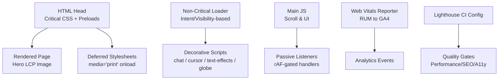
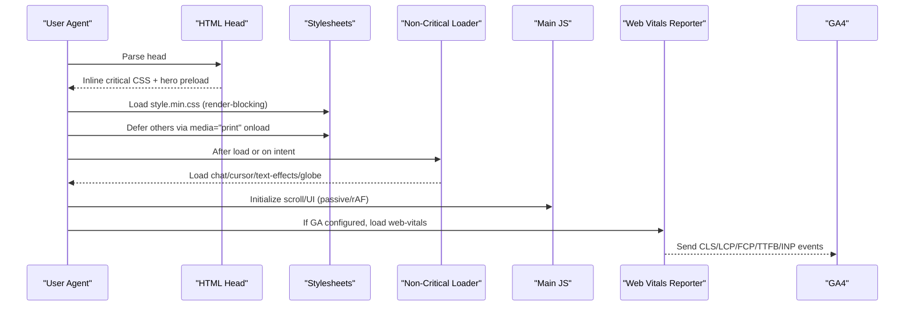
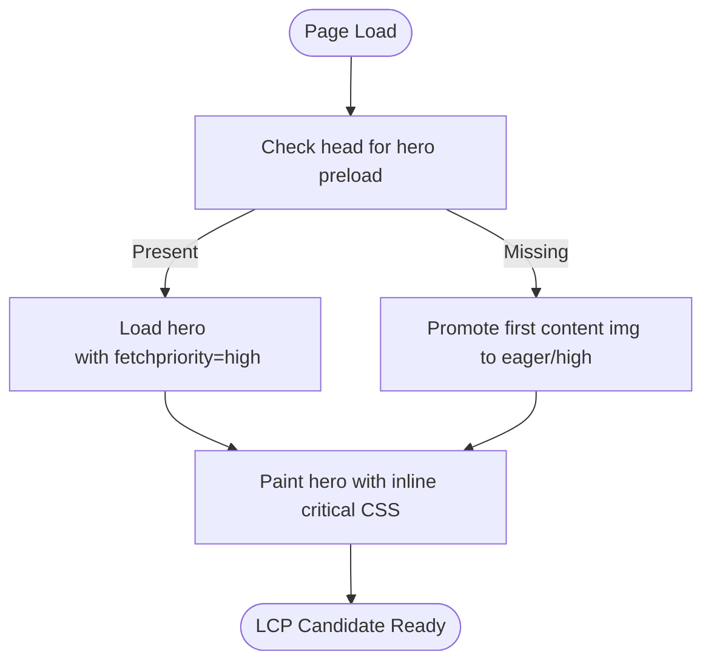
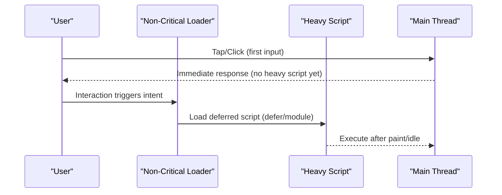
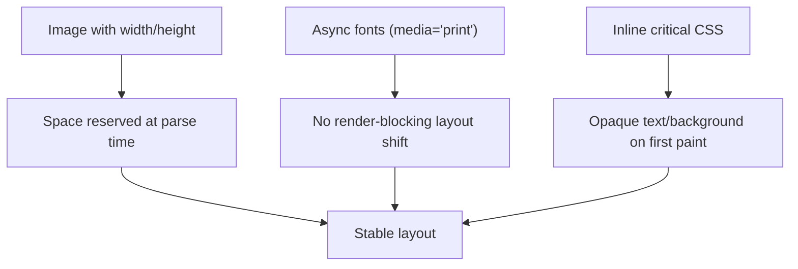
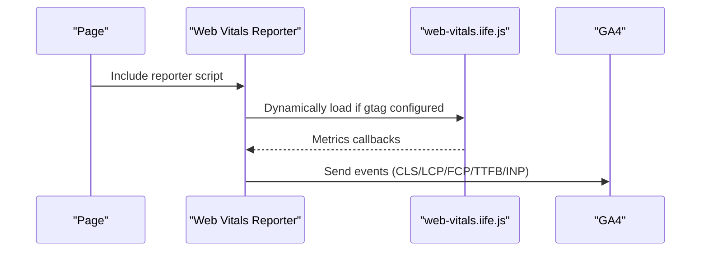
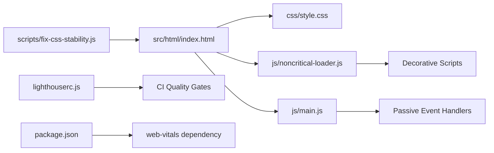

# Core Web Vitals Optimization

<cite>
**Referenced Files in This Document**
- [src/html/index.html](file://src/html/index.html)
- [css/style.css](file://css/style.css)
- [js/web-vitals-reporter.js](file://js/web-vitals-reporter.js)
- [lighthouserc.js](file://lighthouserc.js)
- [js/noncritical-loader.js](file://js/noncritical-loader.js)
- [js/main.js](file://js/main.js)
- [scripts/fix-css-stability.js](file://scripts/fix-css-stability.js)
- [scripts/migrate-portfolio-page-debt.js](file://scripts/migrate-portfolio-page-debt.js)
- [tests/lcp-hero-regressions.test.js](file://tests/lcp-hero-regressions.test.js)
- [tests/public-html-regressions.test.js](file://tests/public-html-regressions.test.js)
- [package.json](file://package.json)
</cite>

## Table of Contents
1. [Introduction](#introduction)
2. [Project Structure](#project-structure)
3. [Core Components](#core-components)
4. [Architecture Overview](#architecture-overview)
5. [Detailed Component Analysis](#detailed-component-analysis)
6. [Dependency Analysis](#dependency-analysis)
7. [Performance Considerations](#performance-considerations)
8. [Troubleshooting Guide](#troubleshooting-guide)
9. [Conclusion](#conclusion)

## Introduction
This document explains how WebNovis optimizes Core Web Vitals across Largest Contentful Paint (LCP), First Input Delay (FID)/Interaction to Next Paint (INP), and Cumulative Layout Shift (CLS). It covers critical CSS inlining, resource preloading, hero image optimization, JavaScript execution strategies, event listener management, font loading, dynamic content handling, mobile-specific optimizations, progressive enhancement, measurement tools, and continuous monitoring.

## Project Structure
WebNovis implements a performance-first build and runtime strategy:
- Critical HTML includes inline styles for above-the-fold rendering and high-priority preload hints for the hero image.
- Non-critical CSS is deferred using media="print" onload patterns with noscript fallbacks.
- Heavy scripts are loaded lazily based on user intent or viewport visibility.
- Real User Monitoring (RUM) sends Core Web Vitals metrics to analytics after consent.
- Lighthouse CI enforces quality gates on key pages.

**Diagram sources**
- [src/html/index.html:25-30](file://src/html/index.html#L25-L30)
- [js/noncritical-loader.js:62-90](file://js/noncritical-loader.js#L62-L90)
- [js/web-vitals-reporter.js:19-31](file://js/web-vitals-reporter.js#L19-L31)
- [lighthouserc.js:1-27](file://lighthouserc.js#L1-L27)

**Section sources**
- [src/html/index.html:25-30](file://src/html/index.html#L25-L30)
- [js/noncritical-loader.js:62-90](file://js/noncritical-loader.js#L62-L90)
- [js/web-vitals-reporter.js:19-31](file://js/web-vitals-reporter.js#L19-L31)
- [lighthouserc.js:1-27](file://lighthouserc.js#L1-L27)

## Core Components
- Hero LCP pipeline: Inline critical CSS ensures opaque text and solid background; hero picture uses explicit width/height and fetchpriority=high; only one high-priority preload per page.
- Deferred non-critical assets: CSS files use media="print" onload with noscript fallbacks; heavy JS loaded via noncritical loader triggered by user intent or near-viewport detection.
- Main thread protection: Scroll and UI logic consolidate listeners, use passive events, requestAnimationFrame gating, and idle scheduling for low-priority tasks.
- Font loading: Google Fonts linked with media="print" onload and preconnect hints; noscript blocks preserve blocking fallback when needed.
- Measurement and CI: RUM reporter sends CLS/LCP/FCP/TTFB/INP to GA4; Lighthouse CI asserts minimum scores on key URLs.

**Section sources**
- [src/html/index.html:25-30](file://src/html/index.html#L25-L30)
- [scripts/fix-css-stability.js:68-103](file://scripts/fix-css-stability.js#L68-L103)
- [js/noncritical-loader.js:62-90](file://js/noncritical-loader.js#L62-L90)
- [js/main.js:178-200](file://js/main.js#L178-L200)
- [js/web-vitals-reporter.js:19-31](file://js/web-vitals-reporter.js#L19-L31)
- [lighthouserc.js:1-27](file://lighthouserc.js#L1-L27)

## Architecture Overview
The runtime architecture separates critical path from optional enhancements:
- Critical path: HTML head, inline critical CSS, hero image preload, and render-blocking style.min.css.
- Deferred path: Additional stylesheets and heavy scripts loaded after first paint or on user interaction.
- Observability: Web Vitals reporter conditionally loads web-vitals library and reports metrics to GA4.
- Quality gates: Lighthouse CI runs against multiple pages and enforces thresholds.

**Diagram sources**
- [src/html/index.html:25-30](file://src/html/index.html#L25-L30)
- [js/noncritical-loader.js:54-90](file://js/noncritical-loader.js#L54-L90)
- [js/web-vitals-reporter.js:19-31](file://js/web-vitals-reporter.js#L19-L31)

## Detailed Component Analysis

### Largest Contentful Paint (LCP) Optimization
- Hero image as real : The homepage uses a dedicated hero image element with explicit width/height and fetchpriority=high to ensure it is recognized as LCP candidate even on mobile.
- Single high-priority preload: Only the hero image is preloaded with high priority; other assets like the logo use low priority to avoid contention.
- Media-split preloads: Separate preloads for mobile and desktop images reduce unnecessary downloads.
- Critical CSS inlining: Inline styles set body background and hero text opacity to prevent FOUC and ensure immediate paint.
- Build-time promotion: Scripts promote the first content image to eager/high priority where appropriate and defer fonts to avoid blocking.

**Diagram sources**
- [src/html/index.html:25-30](file://src/html/index.html#L25-L30)
- [scripts/migrate-portfolio-page-debt.js:64-96](file://scripts/migrate-portfolio-page-debt.js#L64-L96)

**Section sources**
- [src/html/index.html:25-30](file://src/html/index.html#L25-L30)
- [tests/lcp-hero-regressions.test.js:24-68](file://tests/lcp-hero-regressions.test.js#L24-L68)
- [scripts/migrate-portfolio-page-debt.js:64-96](file://scripts/migrate-portfolio-page-debt.js#L64-L96)

### First Input Delay (FID) / INP Improvements
- Passive event listeners: Mouse and pointer events used for lazy-loading decorative features are marked passive to avoid main-thread jank.
- Intent-driven loading: Non-critical scripts (chat, cursor, text effects, globe) are loaded only after user interaction or when near viewport, reducing initial main-thread work.
- Idle scheduling: Low-priority tasks use requestIdleCallback with timeouts to keep the main thread responsive during first interactions.
- Unified scroll controller: Scroll-related updates are consolidated and gated with requestAnimationFrame to minimize layout thrashing.

**Diagram sources**
- [js/noncritical-loader.js:62-90](file://js/noncritical-loader.js#L62-L90)
- [js/noncritical-loader.js:136-144](file://js/noncritical-loader.js#L136-L144)
- [js/main.js:178-200](file://js/main.js#L178-L200)

**Section sources**
- [js/noncritical-loader.js:62-90](file://js/noncritical-loader.js#L62-L90)
- [js/noncritical-loader.js:136-144](file://js/noncritical-loader.js#L136-L144)
- [js/main.js:178-200](file://js/main.js#L178-L200)
- [tests/public-html-regressions.test.js:29-44](file://tests/public-html-regressions.test.js#L29-L44)

### Cumulative Layout Shift (CLS) Prevention
- Dimension attributes: Hero and feed images include explicit width/height to reserve space before download, preventing reflow.
- Font loading optimization: Google Fonts links use media="print" onload to avoid render-blocking; preconnect hints reduce connection latency; noscript blocks provide fallbacks when JS is disabled.
- Stable hero text: Inline critical CSS forces hero title/content to be visible immediately, avoiding opacity transitions that can delay LCP and cause shifts.
- Mobile fixes: Dedicated mobile stylesheet ensures chat popup and UI elements do not shift unexpectedly on small screens.

**Diagram sources**
- [src/html/index.html:63-68](file://src/html/index.html#L63-L68)
- [scripts/fix-css-stability.js:68-103](file://scripts/fix-css-stability.js#L68-L103)
- [css/style.css:150-153](file://css/style.css#L150-L153)

**Section sources**
- [src/html/index.html:63-68](file://src/html/index.html#L63-L68)
- [scripts/fix-css-stability.js:68-103](file://scripts/fix-css-stability.js#L68-L103)
- [css/style.css:150-153](file://css/style.css#L150-L153)

### Measurement Tools and Continuous Monitoring
- Real User Monitoring: The web-vitals reporter dynamically loads the web-vitals library and sends CLS, INP, LCP, FCP, and TTFB to GA4 after consent is granted.
- Lighthouse CI: A configuration file defines target URLs, number of runs, and assertion thresholds for performance, SEO, and accessibility categories.
- Regression tests: Automated checks enforce LCP-safe hero rules and ensure non-critical scripts are loaded progressively.

**Diagram sources**
- [js/web-vitals-reporter.js:19-31](file://js/web-vitals-reporter.js#L19-L31)
- [lighthouserc.js:1-27](file://lighthouserc.js#L1-L27)
- [tests/lcp-hero-regressions.test.js:24-68](file://tests/lcp-hero-regressions.test.js#L24-L68)

**Section sources**
- [js/web-vitals-reporter.js:19-31](file://js/web-vitals-reporter.js#L19-L31)
- [lighthouserc.js:1-27](file://lighthouserc.js#L1-L27)
- [tests/lcp-hero-regressions.test.js:24-68](file://tests/lcp-hero-regressions.test.js#L24-L68)

### Mobile-Specific Optimizations and Progressive Enhancement
- Mobile preloads: Separate hero image preload for mobile reduces bandwidth and improves LCP on smaller devices.
- Deferred enhancements: Chat shell and runtime are loaded after window load or on first pointerdown, with longer delays on mobile to prioritize interactivity.
- Mobile UX fixes: Dedicated stylesheet adjusts chat popup sizing and positioning to avoid layout shifts on narrow screens.
- Progressive activation: Decorative features (cursor, text effects, globe) are loaded only when hover/pointer capabilities exist or when near viewport.

**Section sources**
- [src/html/index.html:25-30](file://src/html/index.html#L25-L30)
- [js/noncritical-loader.js:136-144](file://js/noncritical-loader.js#L136-L144)
- [css/weby-mobile-fix.css:1-67](file://css/weby-mobile-fix.css#L1-L67)
- [js/noncritical-loader.js:92-100](file://js/noncritical-loader.js#L92-L100)

## Dependency Analysis
Key dependencies and their roles:
- src/html/index.html: Defines critical CSS, preloads, and hero image structure.
- css/style.css: Provides core design tokens, font fallbacks, and mobile adjustments.
- js/noncritical-loader.js: Orchestrates deferred loading of heavy scripts based on intent and visibility.
- js/main.js: Implements UI behaviors with passive listeners and rAF gating.
- scripts/fix-css-stability.js: Normalizes async font loading and adds noscript fallbacks.
- lighthouserc.js: Enforces performance/SEO/a11y thresholds in CI.
- package.json: Declares dev dependencies including web-vitals and tooling used in the build/test pipeline.

**Diagram sources**
- [src/html/index.html:25-30](file://src/html/index.html#L25-L30)
- [js/noncritical-loader.js:62-90](file://js/noncritical-loader.js#L62-L90)
- [scripts/fix-css-stability.js:68-103](file://scripts/fix-css-stability.js#L68-L103)
- [lighthouserc.js:1-27](file://lighthouserc.js#L1-L27)
- [package.json:78-90](file://package.json#L78-L90)

**Section sources**
- [src/html/index.html:25-30](file://src/html/index.html#L25-L30)
- [js/noncritical-loader.js:62-90](file://js/noncritical-loader.js#L62-L90)
- [scripts/fix-css-stability.js:68-103](file://scripts/fix-css-stability.js#L68-L103)
- [lighthouserc.js:1-27](file://lighthouserc.js#L1-L27)
- [package.json:78-90](file://package.json#L78-L90)

## Performance Considerations
- Keep hero image as the sole high-priority preload to avoid contention with other resources.
- Ensure all images have explicit width/height to prevent layout shifts.
- Defer non-critical CSS and JS; use media="print" onload and IntersectionObserver-based loading.
- Use passive event listeners and rAF gating for scroll-heavy interactions.
- Prefer modern image formats (WebP) and size descriptors to reduce payload and improve decoding.
- Monitor CLS carefully when injecting dynamic content; reserve space for banners and late-loaded widgets.

[No sources needed since this section provides general guidance]

## Troubleshooting Guide
- LCP not detected on mobile: Verify hero uses a real  with dimensions and fetchpriority=high; ensure no animation hides hero content on first paint.
- Excessive CLS: Check for missing width/height on images/videos; confirm fonts are async-loaded and fallbacks are stable; ensure dynamic panels reserve space.
- Slow interactions: Audit heavy scripts; ensure they are loaded only on intent or near viewport; verify passive listeners and idle scheduling.
- Missing noscript fallbacks: Confirm async CSS has corresponding noscript blocks mirroring hrefs and versions.

**Section sources**
- [tests/lcp-hero-regressions.test.js:24-68](file://tests/lcp-hero-regressions.test.js#L24-L68)
- [scripts/fix-css-stability.js:68-103](file://scripts/fix-css-stability.js#L68-L103)
- [js/noncritical-loader.js:62-90](file://js/noncritical-loader.js#L62-L90)

## Conclusion
WebNovis applies a comprehensive Core Web Vitals strategy:
- LCP: Hero image prioritization, critical CSS inlining, and media-split preloads.
- FID/INP: Deferred heavy scripts, passive listeners, and idle scheduling to keep the main thread responsive.
- CLS: Explicit dimensions, async fonts, and stable hero text to prevent layout shifts.
- Measurement and CI: RUM reporting to GA4 and Lighthouse CI assertions to maintain quality over time.
These practices, combined with mobile-specific tweaks and progressive enhancement, deliver fast, stable, and interactive experiences across devices.

[No sources needed since this section summarizes without analyzing specific files]