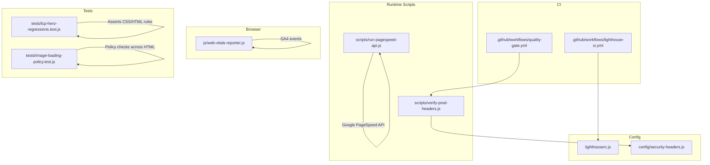
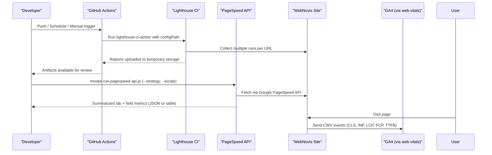
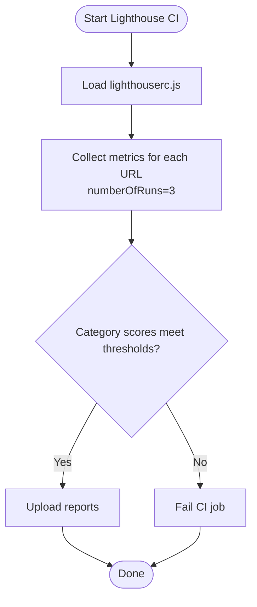
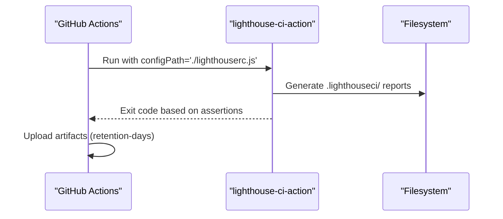
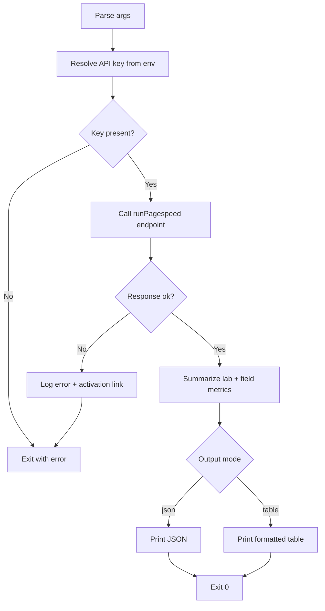
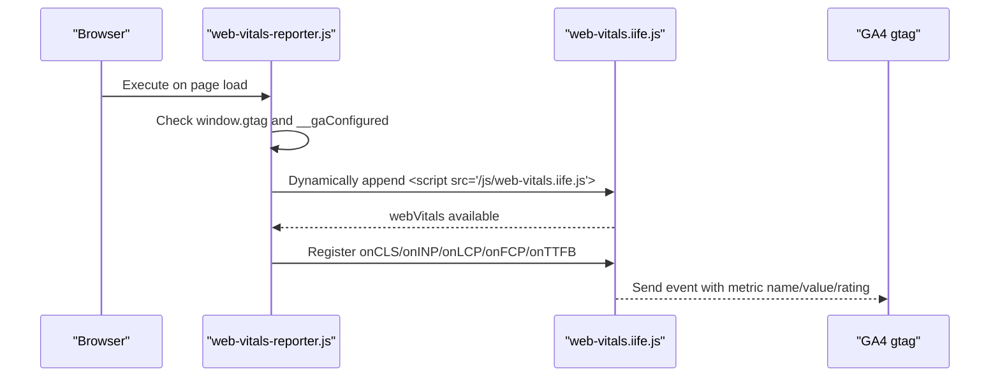
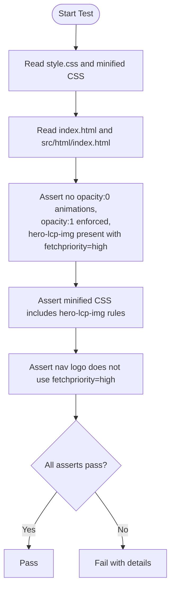
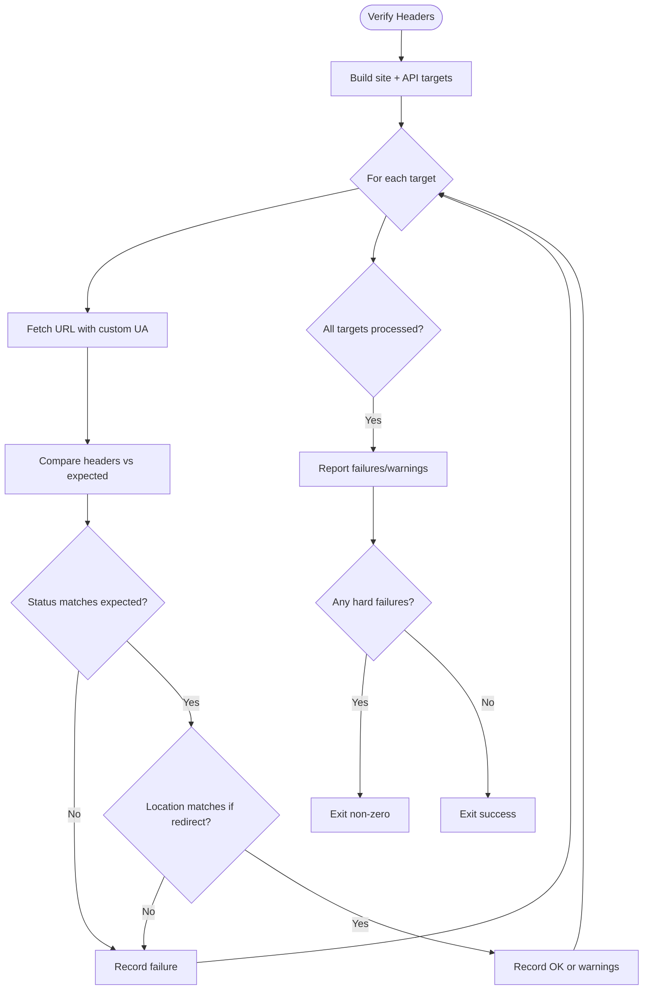
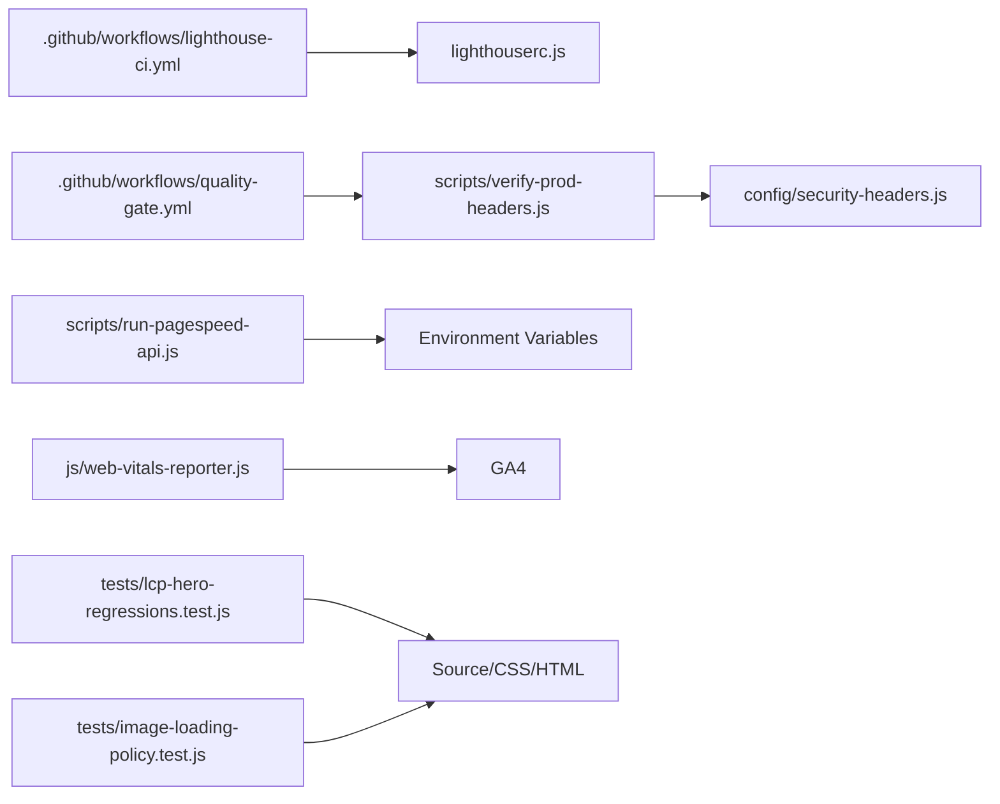

# Performance Monitoring & Testing

<cite>
**Referenced Files in This Document**
- [lighthouserc.js](file://lighthouserc.js)
- [.github/workflows/lighthouse-ci.yml](file://.github/workflows/lighthouse-ci.yml)
- [scripts/run-pagespeed-api.js](file://scripts/run-pagespeed-api.js)
- [js/web-vitals-reporter.js](file://js/web-vitals-reporter.js)
- [package.json](file://package.json)
- [.github/workflows/quality-gate.yml](file://.github/workflows/quality-gate.yml)
- [tests/lcp-hero-regressions.test.js](file://tests/lcp-hero-regressions.test.js)
- [tests/image-loading-policy.test.js](file://tests/image-loading-policy.test.js)
- [config/security-headers.js](file://config/security-headers.js)
- [scripts/verify-prod-headers.js](file://scripts/verify-prod-headers.js)
- [docs/PAGESPEED-MOBILE-AUDIT-2026-02-27.md](file://docs/PAGESPEED-MOBILE-AUDIT-2026-02-27.md)
</cite>

## Table of Contents
1. Introduction
2. Project Structure
3. Core Components
4. Architecture Overview
5. Detailed Component Analysis
6. Dependency Analysis
7. Performance Considerations
8. Troubleshooting Guide
9. Conclusion

## Introduction
This document explains WebNovis performance monitoring and testing infrastructure with a focus on:
- Lighthouse CI configuration for automated performance testing
- PageSpeed API integration for real-world performance monitoring
- Custom Web Vitals reporting to analytics
- Performance budget enforcement, regression detection, and continuous integration workflows
- Setup guidance for dashboards, alerting, and profiling
- Examples of test scripts, monitoring configurations, and troubleshooting regressions
- Mobile performance testing, network simulation, and cross-browser validation approaches

## Project Structure
The performance system spans configuration files, CI workflows, runtime scripts, and tests:
- Lighthouse CI configuration defines target URLs, thresholds, and upload behavior
- GitHub Actions run Lighthouse CI and quality gates on push/schedule/manual triggers
- A Node script calls the Google PageSpeed Insights API to fetch lab and field metrics
- A browser-side reporter sends Core Web Vitals to GA4 when consent is granted
- Tests enforce performance-related policies (e.g., LCP hero guard, image loading policy)
- Security headers are centrally configured and verified against production

**Diagram sources**
- [.github/workflows/lighthouse-ci.yml:1-27](file://.github/workflows/lighthouse-ci.yml#L1-L27)
- [.github/workflows/quality-gate.yml:1-47](file://.github/workflows/quality-gate.yml#L1-L47)
- [lighthouserc.js:1-28](file://lighthouserc.js#L1-L28)
- [scripts/run-pagespeed-api.js:1-128](file://scripts/run-pagespeed-api.js#L1-L128)
- [js/web-vitals-reporter.js:1-33](file://js/web-vitals-reporter.js#L1-L33)
- [tests/lcp-hero-regressions.test.js:1-74](file://tests/lcp-hero-regressions.test.js#L1-L74)
- [tests/image-loading-policy.test.js:1-60](file://tests/image-loading-policy.test.js#L1-L60)
- [config/security-headers.js:1-113](file://config/security-headers.js#L1-L113)
- [scripts/verify-prod-headers.js:1-172](file://scripts/verify-prod-headers.js#L1-L172)

**Section sources**
- [lighthouserc.js:1-28](file://lighthouserc.js#L1-L28)
- [.github/workflows/lighthouse-ci.yml:1-27](file://.github/workflows/lighthouse-ci.yml#L1-L27)
- [.github/workflows/quality-gate.yml:1-47](file://.github/workflows/quality-gate.yml#L1-L47)
- [scripts/run-pagespeed-api.js:1-128](file://scripts/run-pagespeed-api.js#L1-L128)
- [js/web-vitals-reporter.js:1-33](file://js/web-vitals-reporter.js#L1-L33)
- [tests/lcp-hero-regressions.test.js:1-74](file://tests/lcp-hero-regressions.test.js#L1-L74)
- [tests/image-loading-policy.test.js:1-60](file://tests/image-loading-policy.test.js#L1-L60)
- [config/security-headers.js:1-113](file://config/security-headers.js#L1-L113)
- [scripts/verify-prod-headers.js:1-172](file://scripts/verify-prod-headers.js#L1-L172)

## Core Components
- Lighthouse CI configuration: Defines target URLs, number of runs, category assertions, and report upload target
- GitHub Actions workflows: Execute Lighthouse CI and quality gate builds/tests; upload artifacts
- PageSpeed API script: Calls Google PageSpeed Insights v5, summarizes lab and field metrics, supports mobile/desktop strategies and locale
- Web Vitals reporter: Dynamically loads web-vitals IIFE and reports CLS, INP, LCP, FCP, TTFB to GA4 when consent is granted
- Regression tests: Enforce LCP hero constraints and image loading policy across HTML
- Production header verification: Validates security headers and status codes against expected values

**Section sources**
- [lighthouserc.js:1-28](file://lighthouserc.js#L1-L28)
- [.github/workflows/lighthouse-ci.yml:1-27](file://.github/workflows/lighthouse-ci.yml#L1-L27)
- [.github/workflows/quality-gate.yml:1-47](file://.github/workflows/quality-gate.yml#L1-L47)
- [scripts/run-pagespeed-api.js:1-128](file://scripts/run-pagespeed-api.js#L1-L128)
- [js/web-vitals-reporter.js:1-33](file://js/web-vitals-reporter.js#L1-L33)
- [tests/lcp-hero-regressions.test.js:1-74](file://tests/lcp-hero-regressions.test.js#L1-L74)
- [tests/image-loading-policy.test.js:1-60](file://tests/image-loading-policy.test.js#L1-L60)
- [scripts/verify-prod-headers.js:1-172](file://scripts/verify-prod-headers.js#L1-L172)

## Architecture Overview
The performance pipeline integrates CI-driven audits, live API measurements, and real-user monitoring:

**Diagram sources**
- [.github/workflows/lighthouse-ci.yml:1-27](file://.github/workflows/lighthouse-ci.yml#L1-L27)
- [lighthouserc.js:1-28](file://lighthouserc.js#L1-L28)
- [scripts/run-pagespeed-api.js:1-128](file://scripts/run-pagespeed-api.js#L1-L128)
- [js/web-vitals-reporter.js:1-33](file://js/web-vitals-reporter.js#L1-L33)

## Detailed Component Analysis

### Lighthouse CI Configuration
- Targets: Multiple key pages are audited per run
- Runs: Multiple runs per URL to stabilize scores
- Assertions: Category-level thresholds for performance, SEO, and accessibility
- Upload: Reports uploaded to temporary public storage for artifact access

**Diagram sources**
- [lighthouserc.js:1-28](file://lighthouserc.js#L1-L28)

**Section sources**
- [lighthouserc.js:1-28](file://lighthouserc.js#L1-L28)

### GitHub Actions Workflows
- Lighthouse CI workflow: Triggers on push to main, manual dispatch, and weekly schedule; uses treosh/lighthouse-ci-action; uploads artifacts
- Quality Gate workflow: Builds site, runs validations and regression tests, verifies production headers, and uploads sanitized dist artifact

**Diagram sources**
- [.github/workflows/lighthouse-ci.yml:1-27](file://.github/workflows/lighthouse-ci.yml#L1-L27)

**Section sources**
- [.github/workflows/lighthouse-ci.yml:1-27](file://.github/workflows/lighthouse-ci.yml#L1-L27)
- [.github/workflows/quality-gate.yml:1-47](file://.github/workflows/quality-gate.yml#L1-L47)

### PageSpeed API Integration
- CLI options: url, strategy (mobile/desktop), locale, output (table/json)
- API key resolution: Environment variables fallback chain
- Response handling: Parses lighthouseResult and loadingExperience into a concise summary
- Error handling: Logs API errors and activation/quota help links

**Diagram sources**
- [scripts/run-pagespeed-api.js:1-128](file://scripts/run-pagespeed-api.js#L1-L128)

**Section sources**
- [scripts/run-pagespeed-api.js:1-128](file://scripts/run-pagespeed-api.js#L1-L128)

### Web Vitals Real User Monitoring
- Conditional execution: Only when GA4 is configured and consent is granted
- Dynamic loading: Loads web-vitals IIFE from local path
- Metrics reported: CLS, INP, LCP, FCP, TTFB sent as GA4 events with normalized values and ratings

**Diagram sources**
- [js/web-vitals-reporter.js:1-33](file://js/web-vitals-reporter.js#L1-L33)

**Section sources**
- [js/web-vitals-reporter.js:1-33](file://js/web-vitals-reporter.js#L1-L33)

### Regression Tests for Performance
- LCP hero guard: Ensures hero elements do not start hidden or animated away from initial paint; enforces high-priority LCP image usage and prevents competing high-priority logo
- Image loading policy: Scans all HTML files to ensure non-critical images declare loading attributes unless whitelisted

**Diagram sources**
- [tests/lcp-hero-regressions.test.js:1-74](file://tests/lcp-hero-regressions.test.js#L1-L74)

**Section sources**
- [tests/lcp-hero-regressions.test.js:1-74](file://tests/lcp-hero-regressions.test.js#L1-L74)
- [tests/image-loading-policy.test.js:1-60](file://tests/image-loading-policy.test.js#L1-L60)

### Production Header Verification
- Centralized security headers defined in configuration
- Verifies expected status codes, redirects, and header presence/values across endpoints
- Supports optional API base URL for API-specific checks

**Diagram sources**
- [scripts/verify-prod-headers.js:1-172](file://scripts/verify-prod-headers.js#L1-L172)
- [config/security-headers.js:1-113](file://config/security-headers.js#L1-L113)

**Section sources**
- [scripts/verify-prod-headers.js:1-172](file://scripts/verify-prod-headers.js#L1-L172)
- [config/security-headers.js:1-113](file://config/security-headers.js#L1-L113)

## Dependency Analysis
- CI depends on lighthouserc.js for audit configuration and treosh/lighthouse-ci-action for execution
- PageSpeed script depends on environment variables for API keys and standard fetch
- Web Vitals reporter depends on GA4 being configured and web-vitals IIFE availability
- Regression tests depend on built artifacts and source files being consistent
- Header verification depends on centralized security headers configuration

**Diagram sources**
- [.github/workflows/lighthouse-ci.yml:1-27](file://.github/workflows/lighthouse-ci.yml#L1-L27)
- [.github/workflows/quality-gate.yml:1-47](file://.github/workflows/quality-gate.yml#L1-L47)
- [lighthouserc.js:1-28](file://lighthouserc.js#L1-L28)
- [scripts/run-pagespeed-api.js:1-128](file://scripts/run-pagespeed-api.js#L1-L128)
- [js/web-vitals-reporter.js:1-33](file://js/web-vitals-reporter.js#L1-L33)
- [tests/lcp-hero-regressions.test.js:1-74](file://tests/lcp-hero-regressions.test.js#L1-L74)
- [tests/image-loading-policy.test.js:1-60](file://tests/image-loading-policy.test.js#L1-L60)
- [scripts/verify-prod-headers.js:1-172](file://scripts/verify-prod-headers.js#L1-L172)
- [config/security-headers.js:1-113](file://config/security-headers.js#L1-L113)

**Section sources**
- [package.json:1-92](file://package.json#L1-L92)

## Performance Considerations
- Budget enforcement: Use Lighthouse CI assertions to fail builds when category scores drop below thresholds
- Regression detection: Maintain targeted tests like LCP hero guards and image loading policy checks to catch early regressions
- Real-world monitoring: Combine PageSpeed API runs (lab + field) with GA4 CWV events for comprehensive visibility
- Network simulation: Leverage PageSpeed strategy parameter for mobile/desktop emulation; consider throttling in local Lighthouse runs
- Cross-browser validation: Validate critical paths across browsers using CI-friendly tools and headless environments; verify CSP and permissions policies consistently

[No sources needed since this section provides general guidance]

## Troubleshooting Guide
- Missing PageSpeed API key: Ensure one of PAGESPEED_API_KEY, GOOGLE_PAGESHEAD_API_KEY, or GOOGLE_API_KEY is set; the script will exit with an error otherwise
- Lighthouse CI failures: Review category assertion thresholds and URL list; check uploaded artifacts for detailed reports
- GA4 CWV not firing: Confirm GA4 is initialized and consent is granted; verify web-vitals IIFE is reachable at /js/web-vitals.iife.js
- Header mismatches: Use the header verifier to compare expected vs actual headers; edge-managed headers may differ and should be noted
- LCP issues on mobile: Follow the documented mobile audit recommendations to reduce first-paint work and stabilize above-the-fold content

**Section sources**
- [scripts/run-pagespeed-api.js:1-128](file://scripts/run-pagespeed-api.js#L1-L128)
- [lighthouserc.js:1-28](file://lighthouserc.js#L1-L28)
- [js/web-vitals-reporter.js:1-33](file://js/web-vitals-reporter.js#L1-L33)
- [scripts/verify-prod-headers.js:1-172](file://scripts/verify-prod-headers.js#L1-L172)
- [docs/PAGESPEED-MOBILE-AUDIT-2026-02-27.md:1-36](file://docs/PAGESPEED-MOBILE-AUDIT-2026-02-27.md#L1-L36)

## Conclusion
WebNovis implements a robust performance monitoring and testing system that combines automated Lighthouse CI audits, PageSpeed API measurements, and real-user CWV reporting. Regression tests safeguard critical performance characteristics, while header verification ensures secure and consistent delivery. Together, these components enable proactive performance budget enforcement, early regression detection, and actionable insights for continuous improvement.

[No sources needed since this section summarizes without analyzing specific files]