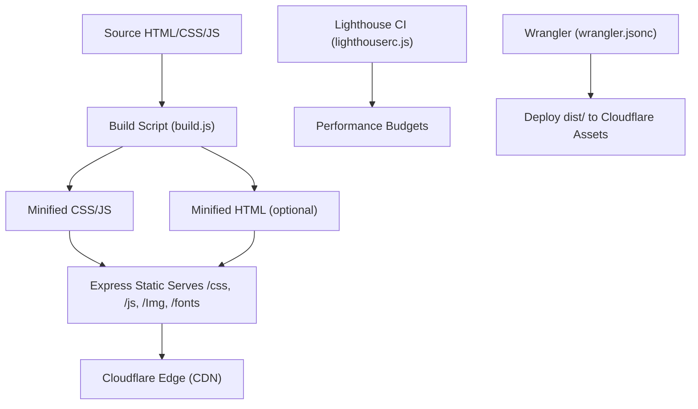
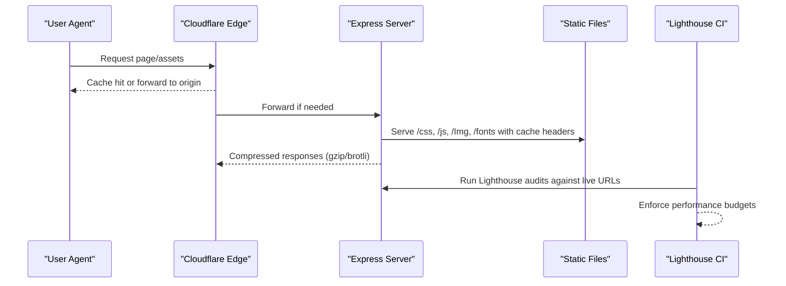
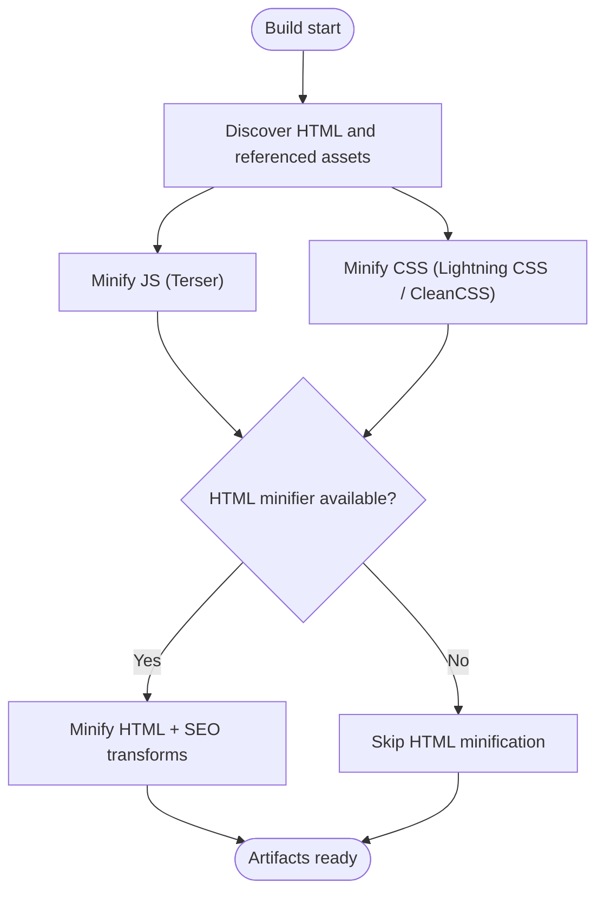
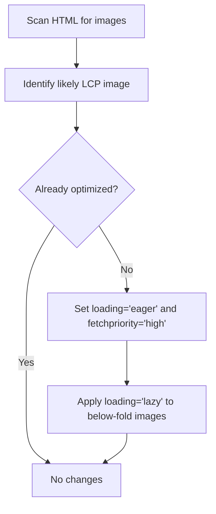
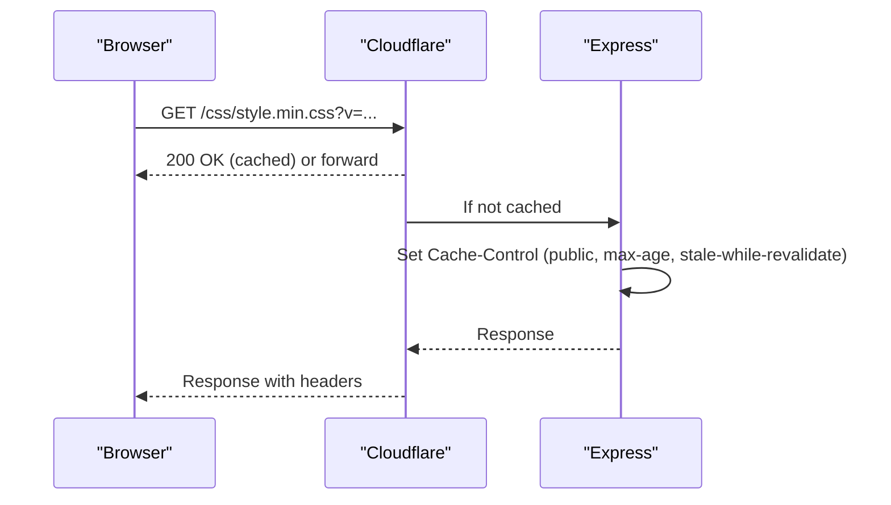
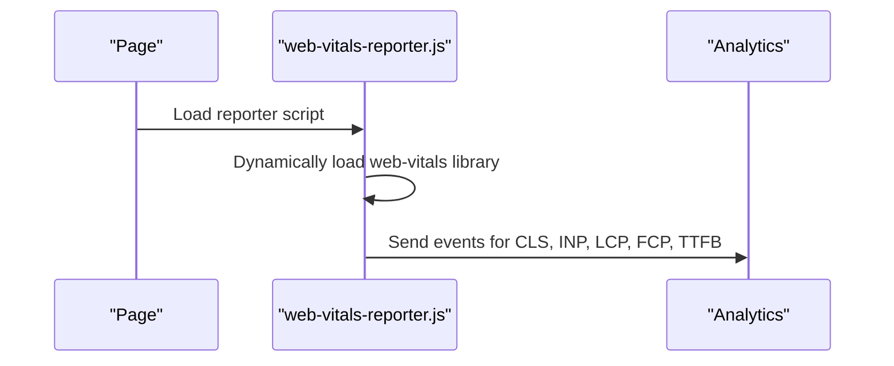
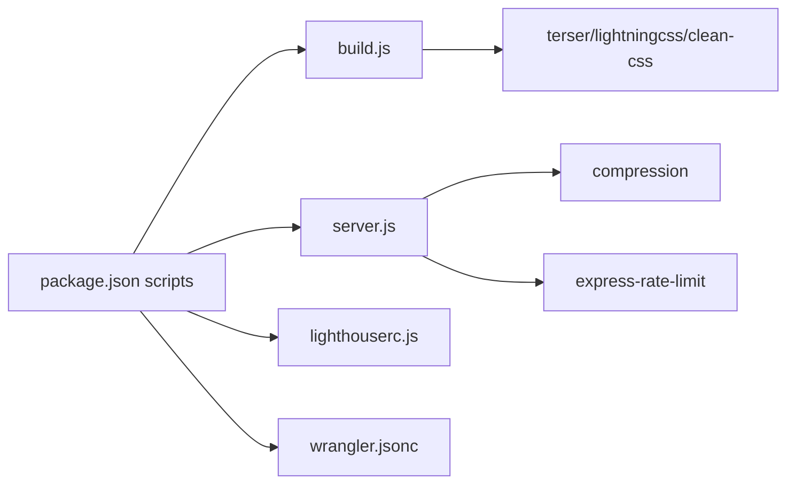

# Performance Optimization

<cite>
**Referenced Files in This Document**
- [build.js](file://build.js)
- [server.js](file://server.js)
- [lighthouserc.js](file://lighthouserc.js)
- [package.json](file://package.json)
- [config/security-headers.js](file://config/security-headers.js)
- [js/web-vitals-reporter.js](file://js/web-vitals-reporter.js)
- [wrangler.jsonc](file://wrangler.jsonc)
- [docs/PERFORMANCE-OPTIMIZATION-REPORT.md](file://docs/PERFORMANCE-OPTIMIZATION-REPORT.md)
- [scripts/migrate-portfolio-page-debt.js](file://scripts/migrate-portfolio-page-debt.js)
- [docs/deploy/CLOUDFLARE-CONFIGURAZIONE-PASSO-PASSO.md](file://docs/deploy/CLOUDFLARE-CONFIGURAZIONE-PASSO-PASSO.md)
- [tests/security-header-regressions.test.js](file://tests/security-header-regressions.test.js)
</cite>

## Table of Contents
1. Introduction
2. Project Structure
3. Core Components
4. Architecture Overview
5. Detailed Component Analysis
6. Dependency Analysis
7. Performance Considerations
8. Troubleshooting Guide
9. Conclusion
10. Appendices

## Introduction
This document explains WebNovis performance optimization strategies across the build pipeline, runtime serving, caching, CDN configuration, and Core Web Vitals. It covers CSS minification, JavaScript bundling/minification, image optimization guidance, lazy loading, progressive loading, resource prioritization, critical path optimization, mobile considerations, network optimizations, browser caching, monitoring dashboards, and budget enforcement via CI.

## Project Structure
WebNovis uses a Node-based build system to minify JS and CSS, optionally minify HTML, and produce a dist artifact for deployment to Cloudflare Workers Assets. The Express server serves static assets with cache headers and compression, while Lighthouse CI enforces performance budgets.

**Diagram sources**
- [build.js:31-113](file://build.js#L31-L113)
- [build.js:373-495](file://build.js#L373-L495)
- [server.js:234-249](file://server.js#L234-L249)
- [server.js:458-526](file://server.js#L458-L526)
- [lighthouserc.js:1-27](file://lighthouserc.js#L1-L27)
- [wrangler.jsonc:22-28](file://wrangler.jsonc#L22-L28)

**Section sources**
- [build.js:31-113](file://build.js#L31-L113)
- [build.js:373-495](file://build.js#L373-L495)
- [server.js:234-249](file://server.js#L234-L249)
- [server.js:458-526](file://server.js#L458-L526)
- [lighthouserc.js:1-27](file://lighthouserc.js#L1-L27)
- [wrangler.jsonc:22-28](file://wrangler.jsonc#L22-L28)

## Core Components
- Build pipeline: JS minification with Terser; CSS minification with Lightning CSS and CleanCSS fallback; optional HTML minification; asset discovery from HTML references.
- Runtime serving: Express middleware for compression, security headers, rate limiting, canonical redirects, trailing slash normalization, and long-lived cache headers for static assets.
- Monitoring and budgets: Lighthouse CI with minimum scores; web-vitals reporter sending CLS, INP, LCP, FCP, TTFB to analytics.
- Deployment: Cloudflare Workers Assets with html_handling disabled to preserve .html URLs.

**Section sources**
- [build.js:31-113](file://build.js#L31-L113)
- [build.js:290-371](file://build.js#L290-L371)
- [build.js:428-495](file://build.js#L428-L495)
- [server.js:234-249](file://server.js#L234-L249)
- [server.js:291-384](file://server.js#L291-L384)
- [server.js:458-526](file://server.js#L458-L526)
- [lighthouserc.js:1-27](file://lighthouserc.js#L1-L27)
- [js/web-vitals-reporter.js:1-32](file://js/web-vitals-reporter.js#L1-L32)
- [wrangler.jsonc:22-28](file://wrangler.jsonc#L22-L28)

## Architecture Overview
The performance architecture combines pre-rendered artifacts, efficient serving, and edge caching.

**Diagram sources**
- [server.js:234-249](file://server.js#L234-L249)
- [server.js:458-526](file://server.js#L458-L526)
- [lighthouserc.js:1-27](file://lighthouserc.js#L1-L27)

## Detailed Component Analysis

### Asset Optimization Pipeline (CSS, JS, HTML)
- JS minification: Uses Terser with dead code elimination, console removal, and multiple passes. Outputs per-file .min.js files.
- CSS minification: Prefers Lightning CSS for modern features; falls back to CleanCSS when necessary. Outputs per-file .min.css files.
- HTML minification: Optional step that minifies source HTML under src/html and writes to output paths, applying SEO transforms before minification.
- Asset discovery: Scans published HTML to find referenced local JS/CSS and includes them in the build inputs.

**Diagram sources**
- [build.js:31-113](file://build.js#L31-L113)
- [build.js:242-279](file://build.js#L242-L279)
- [build.js:290-371](file://build.js#L290-L371)
- [build.js:428-495](file://build.js#L428-L495)

**Section sources**
- [build.js:31-113](file://build.js#L31-L113)
- [build.js:242-279](file://build.js#L242-L279)
- [build.js:290-371](file://build.js#L290-L371)
- [build.js:428-495](file://build.js#L428-L495)

### Image Optimization and Lazy Loading
- Guidance and scripts promote LCP images by setting eager loading and high priority on first content images.
- Recommendations include using modern formats (AVIF/WebP), explicit dimensions, and lazy loading for below-the-fold images.
- Automated suggestions exist for generating AVIF/WebP variants and adding preload for LCP images.

**Diagram sources**
- [scripts/migrate-portfolio-page-debt.js:64-96](file://scripts/migrate-portfolio-page-debt.js#L64-L96)
- [docs/PERFORMANCE-OPTIMIZATION-REPORT.md:891-914](file://docs/PERFORMANCE-OPTIMIZATION-REPORT.md#L891-L914)
- [docs/PERFORMANCE-OPTIMIZATION-REPORT.md:1098-1147](file://docs/PERFORMANCE-OPTIMIZATION-REPORT.md#L1098-L1147)

**Section sources**
- [scripts/migrate-portfolio-page-debt.js:64-96](file://scripts/migrate-portfolio-page-debt.js#L64-L96)
- [docs/PERFORMANCE-OPTIMIZATION-REPORT.md:891-914](file://docs/PERFORMANCE-OPTIMIZATION-REPORT.md#L891-L914)
- [docs/PERFORMANCE-OPTIMIZATION-REPORT.md:1098-1147](file://docs/PERFORMANCE-OPTIMIZATION-REPORT.md#L1098-L1147)

### Caching Strategies and CDN Configuration
- Express sets long-lived cache headers for static assets in production and short TTLs for HTML with stale-while-revalidate.
- Security headers are centralized and can be synced to static host rules for platforms like Cloudflare Pages.
- Cloudflare configuration preserves .html URLs and supports versioned asset caching rules.

**Diagram sources**
- [server.js:458-526](file://server.js#L458-L526)
- [config/security-headers.js:64-100](file://config/security-headers.js#L64-L100)
- [wrangler.jsonc:22-28](file://wrangler.jsonc#L22-L28)
- [docs/deploy/CLOUDFLARE-CONFIGURAZIONE-PASSO-PASSO.md:207-229](file://docs/deploy/CLOUDFLARE-CONFIGURAZIONE-PASSO-PASSO.md#L207-L229)

**Section sources**
- [server.js:458-526](file://server.js#L458-L526)
- [config/security-headers.js:64-100](file://config/security-headers.js#L64-L100)
- [wrangler.jsonc:22-28](file://wrangler.jsonc#L22-L28)
- [docs/deploy/CLOUDFLARE-CONFIGURAZIONE-PASSO-PASSO.md:207-229](file://docs/deploy/CLOUDFLARE-CONFIGURAZIONE-PASSO-PASSO.md#L207-L229)

### Bandwidth Optimization Techniques
- Compression middleware enabled in Express reduces transfer sizes for text assets.
- Asset minification (JS/CSS/HTML) further reduces payload size.
- CDN-level caching and versioning reduce repeated downloads.

**Section sources**
- [server.js:234-249](file://server.js#L234-L249)
- [build.js:31-113](file://build.js#L31-L113)
- [build.js:428-495](file://build.js#L428-L495)

### Core Web Vitals Optimization
- Real User Monitoring: web-vitals reporter sends CLS, INP, LCP, FCP, TTFB to analytics when configured.
- Lighthouse CI enforces minimum performance thresholds across key pages.
- LCP improvements: prioritize hero images, preload critical resources, defer non-critical CSS/JS.
- INP improvements: avoid heavy synchronous work, defer non-critical scripts, keep DOM manageable.
- CLS improvements: set explicit dimensions for media, reserve space for dynamic content.

**Diagram sources**
- [js/web-vitals-reporter.js:1-32](file://js/web-vitals-reporter.js#L1-L32)
- [lighthouserc.js:1-27](file://lighthouserc.js#L1-L27)

**Section sources**
- [js/web-vitals-reporter.js:1-32](file://js/web-vitals-reporter.js#L1-L32)
- [lighthouserc.js:1-27](file://lighthouserc.js#L1-L27)
- [docs/PERFORMANCE-OPTIMIZATION-REPORT.md:1-200](file://docs/PERFORMANCE-OPTIMIZATION-REPORT.md#L1-L200)

### Progressive Loading and Resource Prioritization
- Defer non-critical CSS via print media trick to avoid render-blocking.
- Use preload for LCP images and critical fonts; prefer dns-prefetch/preconnect for third-party domains where appropriate.
- Scripts loaded with defer or async to minimize blocking.

**Section sources**
- [docs/PERFORMANCE-OPTIMIZATION-REPORT.md:138-200](file://docs/PERFORMANCE-OPTIMIZATION-REPORT.md#L138-L200)

### Mobile Performance Considerations
- Emphasize mobile-first design, smaller payloads, and efficient networking.
- Ensure touch targets and readable text; avoid heavy libraries; optimize images for mobile networks.

**Section sources**
- [docs/PERFORMANCE-OPTIMIZATION-REPORT.md:1-200](file://docs/PERFORMANCE-OPTIMIZATION-REPORT.md#L1-L200)

### Network Optimization and Browser Caching
- Express sets Cache-Control for static assets and HTML with stale-while-revalidate.
- Security headers centralized and synchronized for consistent behavior across hosting layers.
- Cloudflare rules support immutable caching for versioned assets.

**Section sources**
- [server.js:458-526](file://server.js#L458-L526)
- [config/security-headers.js:64-100](file://config/security-headers.js#L64-L100)
- [docs/deploy/CLOUDFLARE-CONFIGURAZIONE-PASSO-PASSO.md:207-229](file://docs/deploy/CLOUDFLARE-CONFIGURAZIONE-PASSO-PASSO.md#L207-L229)

### Performance Monitoring and Dashboards
- Lighthouse CI runs multiple pages with minimum score thresholds and uploads reports.
- Web Vitals metrics sent to analytics enable ongoing RUM dashboards.

**Section sources**
- [lighthouserc.js:1-27](file://lighthouserc.js#L1-L27)
- [js/web-vitals-reporter.js:1-32](file://js/web-vitals-reporter.js#L1-L32)

### Performance Budget Enforcement
- Lighthouse CI asserts minimum performance, SEO, and accessibility scores.
- Regression tests ensure header policies remain consistent with generated outputs.

**Section sources**
- [lighthouserc.js:1-27](file://lighthouserc.js#L1-L27)
- [tests/security-header-regressions.test.js:26-73](file://tests/security-header-regressions.test.js#L26-L73)

## Dependency Analysis
Key dependencies enabling performance:
- Build tools: terser, lightningcss, clean-css, html-minifier-terser (optional).
- Runtime: express, compression, cors, express-rate-limit.
- Dev tooling: lighthouse config for CI, wrangler for deployment.

**Diagram sources**
- [package.json:6-59](file://package.json#L6-L59)
- [package.json:69-89](file://package.json#L69-L89)
- [build.js:31-113](file://build.js#L31-L113)
- [server.js:234-249](file://server.js#L234-L249)
- [wrangler.jsonc:22-28](file://wrangler.jsonc#L22-L28)

**Section sources**
- [package.json:6-59](file://package.json#L6-L59)
- [package.json:69-89](file://package.json#L69-L89)
- [build.js:31-113](file://build.js#L31-L113)
- [server.js:234-249](file://server.js#L234-L249)
- [wrangler.jsonc:22-28](file://wrangler.jsonc#L22-L28)

## Performance Considerations
- Keep critical CSS minimal and inline only above-the-fold rules; defer the rest.
- Prefer modern image formats and explicit dimensions; lazy-load below-fold images.
- Use compression and CDN caching aggressively; version assets for immutable caching.
- Monitor Core Web Vitals continuously; enforce budgets in CI to prevent regressions.
- Maintain a lean DOM and avoid heavy synchronous JS in the critical path.

[No sources needed since this section provides general guidance]

## Troubleshooting Guide
- If builds fail due to missing HTML minifier, the pipeline continues without HTML minification.
- If Lightning CSS fails, CleanCSS is used automatically; check logs for engine selection.
- Verify production headers and redirects using provided verification scripts and tests.
- For CDN caching issues, ensure versioned asset URLs and Cloudflare cache rules are configured.

**Section sources**
- [build.js:428-495](file://build.js#L428-L495)
- [build.js:337-371](file://build.js#L337-L371)
- [tests/security-header-regressions.test.js:26-73](file://tests/security-header-regressions.test.js#L26-L73)
- [docs/deploy/CLOUDFLARE-CONFIGURAZIONE-PASSO-PASSO.md:207-229](file://docs/deploy/CLOUDFLARE-CONFIGURAZIONE-PASSO-PASSO.md#L207-L229)

## Conclusion
WebNovis employs a robust performance strategy combining efficient build-time optimizations, safe runtime serving with compression and caching, and continuous monitoring through Lighthouse CI and real-user metrics. By enforcing budgets, optimizing the critical rendering path, and leveraging CDN capabilities, the site maintains strong Core Web Vitals and scalable performance as it grows.

[No sources needed since this section summarizes without analyzing specific files]

## Appendices

### Build and Deploy Commands
- Build artifacts: npm run build, npm run build:site:dist
- Deploy to Cloudflare: npm run deploy:site
- Lighthouse CI: configured via lighthouserc.js

**Section sources**
- [package.json:6-59](file://package.json#L6-L59)
- [lighthouserc.js:1-27](file://lighthouserc.js#L1-L27)
- [wrangler.jsonc:22-28](file://wrangler.jsonc#L22-L28)