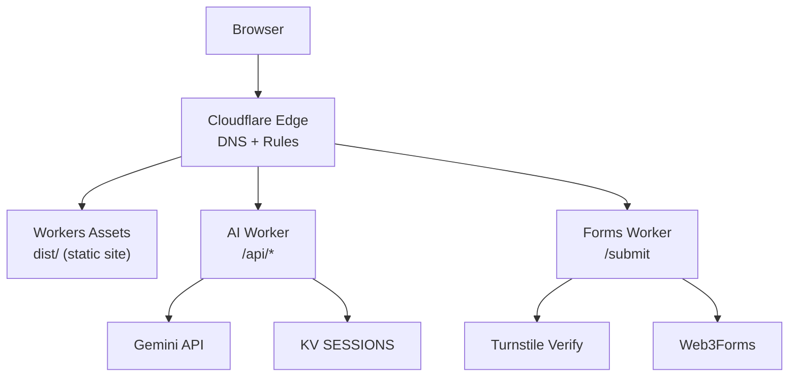
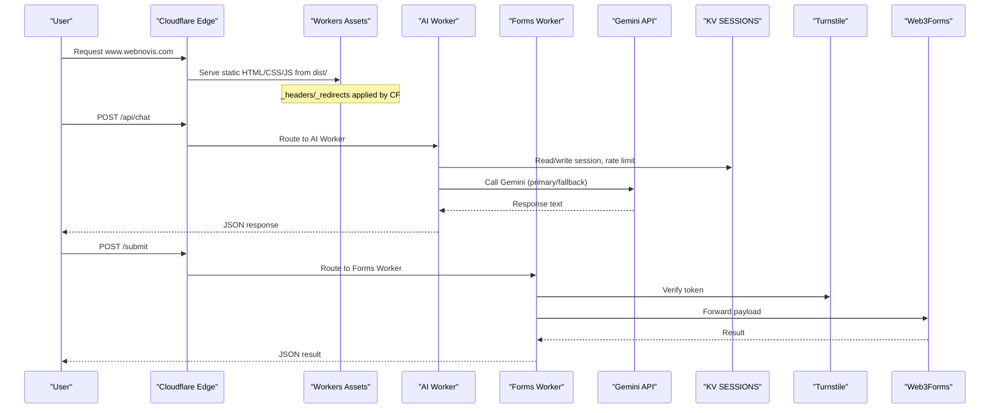
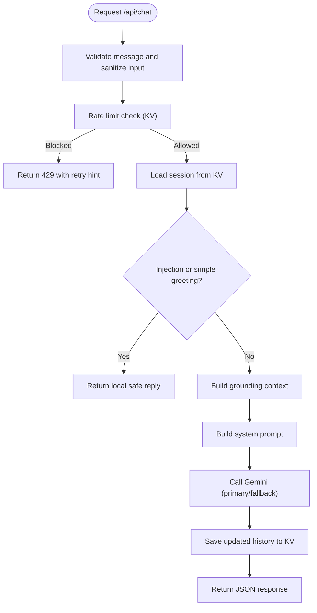
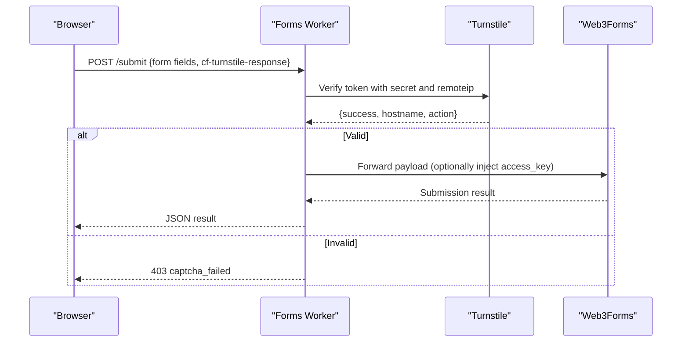
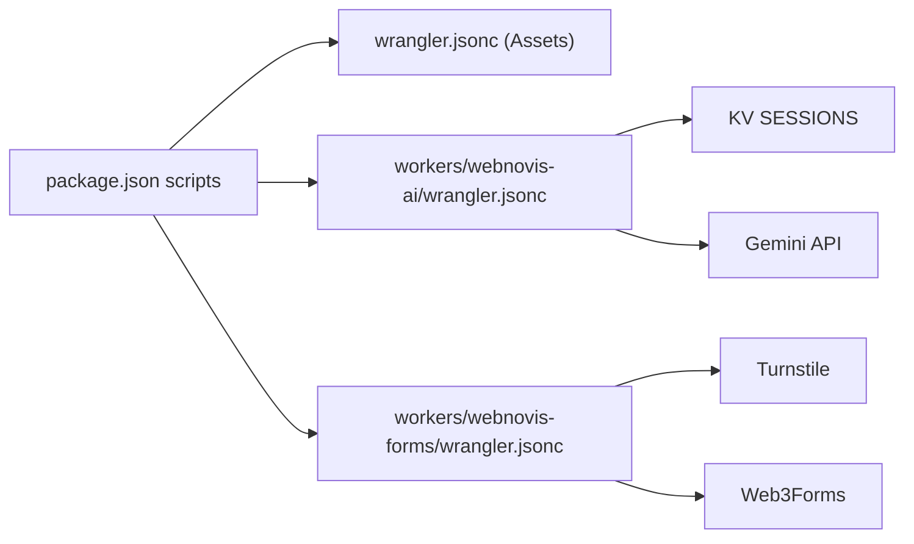

# Cloudflare Workers Deployment

<cite>
**Referenced Files in This Document**
- [wrangler.jsonc](file://wrangler.jsonc)
- [workers/webnovis-ai/wrangler.jsonc](file://workers/webnovis-ai/wrangler.jsonc)
- [workers/webnovis-forms/wrangler.jsonc](file://workers/webnovis-forms/wrangler.jsonc)
- [workers/webnovis-ai/src/index.js](file://workers/webnovis-ai/src/index.js)
- [workers/webnovis-forms/src/index.js](file://workers/webnovis-forms/src/index.js)
- [package.json](file://package.json)
- [scripts/setup-cloudflare-ai.sh](file://scripts/setup-cloudflare-ai.sh)
- [docs/deploy/WORKERS-ASSETS-DIST.md](file://docs/deploy/WORKERS-ASSETS-DIST.md)
- [docs/deploy/MIGRAZIONE-CLOUDFLARE-PAGES.md](file://docs/deploy/MIGRAZIONE-CLOUDFLARE-PAGES.md)
- [docs/deploy/CLOUDFLARE-CONFIGURAZIONE-PASSO-PASSO.md](file://docs/deploy/CLOUDFLARE-CONFIGURAZIONE-PASSO-PASSO.md)
- [docs/CLOUDFLARE-AI-SETUP.md](file://docs/CLOUDFLARE-AI-SETUP.md)
</cite>

## Table of Contents
1. Introduction
2. Project Structure
3. Core Components
4. Architecture Overview
5. Detailed Component Analysis
6. Dependency Analysis
7. Performance Considerations
8. Troubleshooting Guide
9. Conclusion
10. Appendices

## Introduction
This document explains how to deploy WebNovis on Cloudflare Workers, covering both the static site (Workers Assets) and specialized workers for AI chatbot and form processing. It describes the edge computing model versus traditional server deployments, Wrangler configuration, worker scripts structure, environment variables and secrets management, DNS and custom domain setup, performance benefits, caching strategies, global distribution, troubleshooting, and optimization techniques.

## Project Structure
WebNovis deploys three main targets:
- Static site via Workers Assets from a sanitized build artifact
- AI API Worker exposing endpoints for chat, search, health, and lead capture
- Forms proxy Worker that validates Turnstile tokens and forwards submissions to an email provider

**Diagram sources**
- [wrangler.jsonc:22-28](file://wrangler.jsonc#L22-L28)
- [workers/webnovis-ai/wrangler.jsonc:1-26](file://workers/webnovis-ai/wrangler.jsonc#L1-L26)
- [workers/webnovis-forms/wrangler.jsonc:1-20](file://workers/webnovis-forms/wrangler.jsonc#L1-L20)
- [workers/webnovis-ai/src/index.js:508-543](file://workers/webnovis-ai/src/index.js#L508-L543)
- [workers/webnovis-forms/src/index.js:87-171](file://workers/webnovis-forms/src/index.js#L87-L171)

**Section sources**
- [wrangler.jsonc:1-30](file://wrangler.jsonc#L1-L30)
- [docs/deploy/WORKERS-ASSETS-DIST.md:1-91](file://docs/deploy/WORKERS-ASSETS-DIST.md#L1-L91)
- [docs/deploy/MIGRAZIONE-CLOUDFLARE-PAGES.md:1-89](file://docs/deploy/MIGRAZIONE-CLOUDFLARE-PAGES.md#L1-L89)

## Core Components
- Static site deployment: configured in root wrangler.jsonc to serve only the sanitized dist/ directory with html_handling set to none to preserve existing .html URLs and SEO.
- AI Worker: exposes /api/health, /api/chat, /api/search-ai, /api/chat-lead; uses KV for sessions and rate limiting; integrates Gemini models with fallback; includes CORS and injection protection.
- Forms Worker: validates Turnstile tokens server-side and forwards payloads to Web3Forms; supports JSON or form-encoded bodies; includes honeypot anti-bot.

Key environment and secrets:
- AI Worker: GEMINI_API_KEY_CHAT, GEMINI_API_KEY_SEARCH, BREVO_* keys, CORS_ORIGINS; KV namespace bound as SESSIONS.
- Forms Worker: TURNSTILE_SECRET (secret), TURNSTILE_HOSTNAMES, WEB3FORMS_ENDPOINT, optional WEB3FORMS_ACCESS_KEY.

Build and deploy commands are provided via npm scripts and Wrangler configurations.

**Section sources**
- [wrangler.jsonc:22-28](file://wrangler.jsonc#L22-L28)
- [workers/webnovis-ai/wrangler.jsonc:1-26](file://workers/webnovis-ai/wrangler.jsonc#L1-L26)
- [workers/webnovis-forms/wrangler.jsonc:1-20](file://workers/webnovis-forms/wrangler.jsonc#L1-L20)
- [workers/webnovis-ai/src/index.js:12-24](file://workers/webnovis-ai/src/index.js#L12-L24)
- [workers/webnovis-ai/src/index.js:141-151](file://workers/webnovis-ai/src/index.js#L141-L151)
- [workers/webnovis-ai/src/index.js:198-247](file://workers/webnovis-ai/src/index.js#L198-L247)
- [workers/webnovis-forms/src/index.js:36-85](file://workers/webnovis-forms/src/index.js#L36-L85)
- [package.json:51-59](file://package.json#L51-L59)

## Architecture Overview
Edge computing runs code close to users at Cloudflare’s global network. Unlike traditional servers, Workers have no persistent processes between requests, use event-driven request handlers, and integrate tightly with Cloudflare services like KV, Cache Rules, Transform Rules, and WAF. The static site is served from a prebuilt artifact, while dynamic logic lives in lightweight workers.

**Diagram sources**
- [wrangler.jsonc:22-28](file://wrangler.jsonc#L22-L28)
- [workers/webnovis-ai/src/index.js:508-543](file://workers/webnovis-ai/src/index.js#L508-L543)
- [workers/webnovis-forms/src/index.js:87-171](file://workers/webnovis-forms/src/index.js#L87-L171)
- [workers/webnovis-ai/wrangler.jsonc:15-25](file://workers/webnovis-ai/wrangler.jsonc#L15-L25)

## Detailed Component Analysis

### Static Site (Workers Assets)
- Serves only the sanitized dist/ artifact, preventing exposure of source files.
- Uses html_handling: none to keep existing .html URLs intact for SEO.
- Not found handling points to a 404 page.
- Build pipeline prepares dist/ with platform files (_headers, _redirects, .assetsignore).

Operational notes:
- Use npm run build:site:dist to prepare dist/.
- Use npm run deploy:workers:check for dry-run and npm run deploy:site for production.
- In CI, configure build command to npm ci && npm run build:site:dist and deploy command to npx wrangler deploy.

**Section sources**
- [wrangler.jsonc:15-28](file://wrangler.jsonc#L15-L28)
- [docs/deploy/WORKERS-ASSETS-DIST.md:8-33](file://docs/deploy/WORKERS-ASSETS-DIST.md#L8-L33)
- [docs/deploy/WORKERS-ASSETS-DIST.md:35-66](file://docs/deploy/WORKERS-ASSETS-DIST.md#L35-L66)
- [package.json:32-53](file://package.json#L32-L53)

### AI Worker (Chat, Search, Health, Lead)
Endpoints:
- GET /api/health
- POST /api/chat
- POST /api/search-ai
- POST /api/chat-lead

Features:
- Rate limiting per IP using KV-based counters.
- Session persistence and trimming via KV.
- Grounded responses using a local search index and system prompt built from chat config.
- Gemini integration with primary and fallback models and retryable error handling.
- CORS enforcement based on allowed origins.
- Injection detection to protect system prompts.

Environment and secrets:
- Secrets: GEMINI_API_KEY_CHAT, GEMINI_API_KEY_SEARCH, BREVO_API_KEY, BREVO_SENDER_EMAIL, BREVO_SENDER_NAME, BREVO_NOTIFICATION_EMAIL.
- Vars: SERVICE_NAME, ENVIRONMENT, CORS_ORIGINS.
- KV binding: SESSIONS.

Local development:
- Copy .dev.vars.example to .dev.vars and fill secrets.
- Run npm run ai:dev to start locally.

Deployment automation:
- Use scripts/setup-cloudflare-ai.sh to prepare data, authenticate, deploy, set secrets, and smoke test health.

**Diagram sources**
- [workers/webnovis-ai/src/index.js:266-368](file://workers/webnovis-ai/src/index.js#L266-L368)
- [workers/webnovis-ai/src/index.js:141-151](file://workers/webnovis-ai/src/index.js#L141-L151)
- [workers/webnovis-ai/src/index.js:178-196](file://workers/webnovis-ai/src/index.js#L178-L196)
- [workers/webnovis-ai/src/index.js:198-247](file://workers/webnovis-ai/src/index.js#L198-L247)

**Section sources**
- [workers/webnovis-ai/src/index.js:1-117](file://workers/webnovis-ai/src/index.js#L1-L117)
- [workers/webnovis-ai/src/index.js:141-151](file://workers/webnovis-ai/src/index.js#L141-L151)
- [workers/webnovis-ai/src/index.js:178-196](file://workers/webnovis-ai/src/index.js#L178-L196)
- [workers/webnovis-ai/src/index.js:198-247](file://workers/webnovis-ai/src/index.js#L198-L247)
- [workers/webnovis-ai/src/index.js:266-368](file://workers/webnovis-ai/src/index.js#L266-L368)
- [workers/webnovis-ai/src/index.js:370-440](file://workers/webnovis-ai/src/index.js#L370-L440)
- [workers/webnovis-ai/src/index.js:442-506](file://workers/webnovis-ai/src/index.js#L442-L506)
- [workers/webnovis-ai/src/index.js:508-543](file://workers/webnovis-ai/src/index.js#L508-L543)
- [workers/webnovis-ai/wrangler.jsonc:1-26](file://workers/webnovis-ai/wrangler.jsonc#L1-L26)
- [docs/CLOUDFLARE-AI-SETUP.md:16-28](file://docs/CLOUDFLARE-AI-SETUP.md#L16-L28)
- [scripts/setup-cloudflare-ai.sh:14-67](file://scripts/setup-cloudflare-ai.sh#L14-L67)

### Forms Worker (Turnstile + Web3Forms)
Endpoint:
- POST /submit

Behavior:
- Accepts multipart/form-data, application/x-www-form-urlencoded, or JSON.
- Validates Turnstile token server-side against expected hostnames and optional action.
- Forwards validated payload to Web3Forms endpoint.
- Returns standardized JSON success/error responses.

Environment and secrets:
- Secret: TURNSTILE_SECRET.
- Vars: TURNSTILE_HOSTNAMES, WEB3FORMS_ENDPOINT, optional WEB3FORMS_ACCESS_KEY.

**Diagram sources**
- [workers/webnovis-forms/src/index.js:36-85](file://workers/webnovis-forms/src/index.js#L36-L85)
- [workers/webnovis-forms/src/index.js:87-171](file://workers/webnovis-forms/src/index.js#L87-L171)

**Section sources**
- [workers/webnovis-forms/src/index.js:1-172](file://workers/webnovis-forms/src/index.js#L1-L172)
- [workers/webnovis-forms/wrangler.jsonc:1-20](file://workers/webnovis-forms/wrangler.jsonc#L1-L20)

## Dependency Analysis
- Root project depends on Wrangler for deploying both static assets and workers.
- AI Worker depends on Gemini API and KV for sessions/rate-limit/cache.
- Forms Worker depends on Turnstile verification service and Web3Forms.
- Frontend assets reference the AI and Forms endpoints and must be aligned with deployed URLs and CSP allowlists.

**Diagram sources**
- [package.json:51-59](file://package.json#L51-L59)
- [wrangler.jsonc:22-28](file://wrangler.jsonc#L22-L28)
- [workers/webnovis-ai/wrangler.jsonc:15-25](file://workers/webnovis-ai/wrangler.jsonc#L15-L25)
- [workers/webnovis-forms/wrangler.jsonc:8-19](file://workers/webnovis-forms/wrangler.jsonc#L8-L19)

**Section sources**
- [package.json:51-59](file://package.json#L51-L59)
- [workers/webnovis-ai/wrangler.jsonc:15-25](file://workers/webnovis-ai/wrangler.jsonc#L15-L25)
- [workers/webnovis-forms/wrangler.jsonc:8-19](file://workers/webnovis-forms/wrangler.jsonc#L8-L19)

## Performance Considerations
- Edge runtime executes code near users, reducing latency and improving Time to First Byte.
- Static assets are cached at the edge; versioned CSS/JS can be set immutable for long TTLs.
- KV-backed rate limiting protects APIs without heavy compute.
- KV cache for search results reduces repeated LLM calls.
- Primary/fallback model selection improves resilience under high demand.
- Global distribution ensures low-latency responses worldwide.

[No sources needed since this section provides general guidance]

## Troubleshooting Guide
Common issues and resolutions:
- Authentication failures with Wrangler: re-run interactive login in a terminal.
- Chat returning 503 or HTML “Service Suspended”: ensure frontend points to the Worker URL and not a legacy service.
- CSP blocking connections: update security headers to include the Worker’s host and sync headers.
- Missing chat memory across messages: verify KV SESSIONS binding exists and redeploy if necessary.
- Incorrect pricing or stale content: hard refresh browser or purge CDN cache.
- Gemini high demand errors: rely on built-in fallback model; monitor logs.

Additional steps:
- Verify production headers and redirects using provided scripts.
- Ensure sensitive paths are blocked via WAF rules.
- Confirm redirect rules for legacy URLs and apex-to-www routing.

**Section sources**
- [docs/CLOUDFLARE-AI-SETUP.md:256-274](file://docs/CLOUDFLARE-AI-SETUP.md#L256-L274)
- [docs/deploy/CLOUDFLARE-CONFIGURAZIONE-PASSO-PASSO.md:28-100](file://docs/deploy/CLOUDFLARE-CONFIGURAZIONE-PASSO-PASSO.md#L28-L100)
- [docs/deploy/CLOUDFLARE-CONFIGURAZIONE-PASSO-PASSO.md:104-159](file://docs/deploy/CLOUDFLARE-CONFIGURAZIONE-PASSO-PASSO.md#L104-L159)
- [docs/deploy/CLOUDFLARE-CONFIGURAZIONE-PASSO-PASSO.md:162-205](file://docs/deploy/CLOUDFLARE-CONFIGURAZIONE-PASSO-PASSO.md#L162-L205)
- [docs/deploy/CLOUDFLARE-CONFIGURAZIONE-PASSO-PASSO.md:207-230](file://docs/deploy/CLOUDFLARE-CONFIGURAZIONE-PASSO-PASSO.md#L207-L230)

## Conclusion
Deploying WebNovis on Cloudflare Workers enables fast, secure, and globally distributed delivery of both static content and dynamic AI-powered features. By serving a sanitized dist/ artifact, configuring Workers for AI and forms, managing secrets securely, and applying robust security and caching rules, you achieve improved performance, reliability, and maintainability compared to traditional server setups.

[No sources needed since this section summarizes without analyzing specific files]

## Appendices

### Environment Variables and Secrets
- AI Worker:
  - Secrets: GEMINI_API_KEY_CHAT, GEMINI_API_KEY_SEARCH, BREVO_API_KEY, BREVO_SENDER_EMAIL, BREVO_SENDER_NAME, BREVO_NOTIFICATION_EMAIL
  - Vars: SERVICE_NAME, ENVIRONMENT, CORS_ORIGINS
  - KV: SESSIONS
- Forms Worker:
  - Secret: TURNSTILE_SECRET
  - Vars: TURNSTILE_HOSTNAMES, WEB3FORMS_ENDPOINT, WEB3FORMS_ACCESS_KEY (optional)

**Section sources**
- [workers/webnovis-ai/wrangler.jsonc:15-25](file://workers/webnovis-ai/wrangler.jsonc#L15-L25)
- [workers/webnovis-forms/wrangler.jsonc:8-19](file://workers/webnovis-forms/wrangler.jsonc#L8-L19)
- [docs/CLOUDFLARE-AI-SETUP.md:31-43](file://docs/CLOUDFLARE-AI-SETUP.md#L31-L43)
- [scripts/setup-cloudflare-ai.sh:27-49](file://scripts/setup-cloudflare-ai.sh#L27-L49)

### DNS and Custom Domain Setup
- Add domain to Cloudflare account and ensure nameservers point to Cloudflare.
- Attach custom domain to Workers Assets project and disable workers.dev URL after verification.
- Configure apex-to-www redirect rule.
- Set SSL/TLS to Full (strict).

**Section sources**
- [docs/deploy/MIGRAZIONE-CLOUDFLARE-PAGES.md:60-76](file://docs/deploy/MIGRAZIONE-CLOUDFLARE-PAGES.md#L60-L76)

### Build and Deploy Commands
- Prepare and verify static artifact: npm run build:site:dist, npm run verify:artifact
- Dry-run deploy: npm run deploy:workers:check
- Deploy site: npm run deploy:site
- AI Worker: npm run ai:prepare, npm run ai:deploy, npm run ai:tail
- Forms Worker: npm run forms:dev, npm run forms:deploy

**Section sources**
- [package.json:51-59](file://package.json#L51-L59)
- [docs/deploy/WORKERS-ASSETS-DIST.md:35-66](file://docs/deploy/WORKERS-ASSETS-DIST.md#L35-L66)
- [docs/CLOUDFLARE-AI-SETUP.md:71-104](file://docs/CLOUDFLARE-AI-SETUP.md#L71-L104)