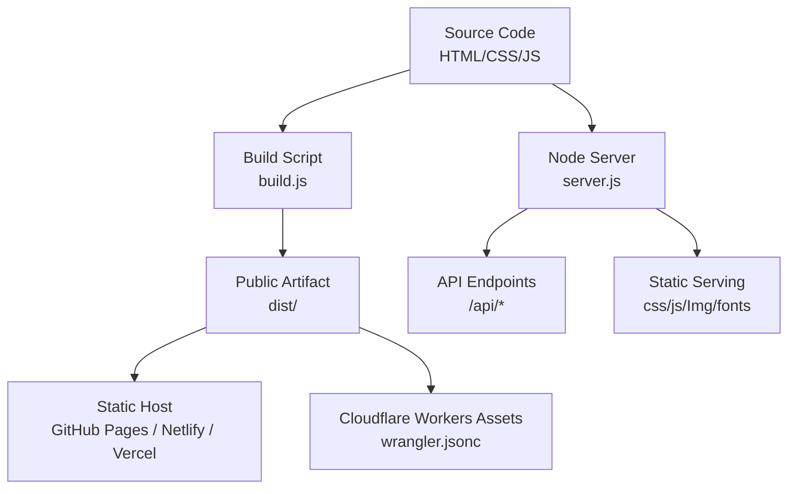
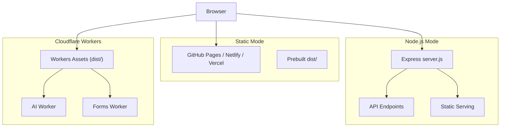
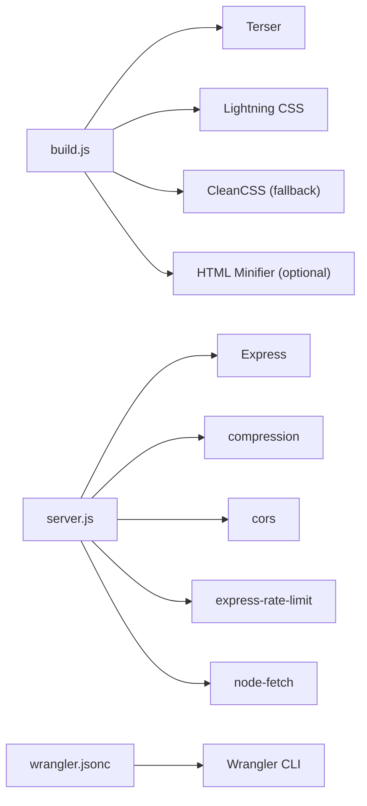

# Deployment Mode Comparison

<cite>
**Referenced Files in This Document**
- [package.json](file://package.json)
- [build.js](file://build.js)
- [server.js](file://server.js)
- [wrangler.jsonc](file://wrangler.jsonc)
- [workers/webnovis-ai/wrangler.jsonc](file://workers/webnovis-ai/wrangler.jsonc)
- [workers/webnovis-forms/wrangler.jsonc](file://workers/webnovis-forms/wrangler.jsonc)
- [docs/deploy/DEPLOY-GITHUB.md](file://docs/deploy/DEPLOY-GITHUB.md)
- [docs/deploy/MIGRAZIONE-CLOUDFLARE-PAGES.md](file://docs/deploy/MIGRAZIONE-CLOUDFLARE-PAGES.md)
- [docs/deploy/WORKERS-ASSETS-DIST.md](file://docs/deploy/WORKERS-ASSETS-DIST.md)
- [docs/deploy/CLOUDFLARE-CONFIGURAZIONE-PASSO-PASSO.md](file://docs/deploy/CLOUDFLARE-CONFIGURAZIONE-PASSO-PASSO.md)
</cite>

## Table of Contents
1. Introduction
2. Project Structure
3. Core Components
4. Architecture Overview
5. Detailed Component Analysis
6. Dependency Analysis
7. Performance Considerations
8. Troubleshooting Guide
9. Conclusion
10. Appendices

## Introduction
This document compares three deployment modes for WebNovis: Static (GitHub Pages), Node.js (Express server), and Cloudflare Workers (static assets plus optional Workers). It provides a feature matrix, performance and scalability characteristics, cost implications, migration strategies, compatibility considerations, decision guidance, and pros/cons with recommended use cases.

## Project Structure
WebNovis supports multiple runtime targets through build scripts and configuration:
- Static build pipeline produces optimized assets into a public artifact directory suitable for static hosting or Cloudflare Workers Assets.
- A Node.js Express server serves the site and exposes backend APIs when running in Node mode.
- Cloudflare Workers are configured to serve a sanitized dist artifact as static assets while keeping URL semantics identical to GitHub Pages.

**Diagram sources**
- [build.js:242-495](file://build.js#L242-L495)
- [wrangler.jsonc:22-29](file://wrangler.jsonc#L22-L29)
- [server.js:458-526](file://server.js#L458-L526)

**Section sources**
- [package.json:6-59](file://package.json#L6-L59)
- [build.js:242-495](file://build.js#L242-L495)
- [wrangler.jsonc:22-29](file://wrangler.jsonc#L22-L29)
- [server.js:458-526](file://server.js#L458-L526)

## Core Components
- Build pipeline: minifies JS/CSS/HTML, discovers assets referenced by HTML, and outputs a production-ready artifact.
- Node server: Express app serving static files, applying security headers, redirects, rate limiting, and exposing AI/search/newsletter endpoints.
- Cloudflare Workers: Static asset serving with explicit html_handling to preserve .html URLs; separate Workers for AI and forms.

Key responsibilities:
- Asset optimization and output path mapping.
- Runtime behavior differences across deployment modes.
- Security headers and redirects managed via platform-specific mechanisms.

**Section sources**
- [build.js:31-113](file://build.js#L31-L113)
- [build.js:242-495](file://build.js#L242-L495)
- [server.js:224-526](file://server.js#L224-L526)
- [wrangler.jsonc:22-29](file://wrangler.jsonc#L22-L29)

## Architecture Overview
The system can be deployed in three modes:

**Diagram sources**
- [wrangler.jsonc:22-29](file://wrangler.jsonc#L22-L29)
- [server.js:224-526](file://server.js#L224-L526)
- [workers/webnovis-ai/wrangler.jsonc:1-26](file://workers/webnovis-ai/wrangler.jsonc#L1-L26)
- [workers/webnovis-forms/wrangler.jsonc:1-20](file://workers/webnovis-forms/wrangler.jsonc#L1-L20)

## Detailed Component Analysis

### Static Mode (GitHub Pages / Netlify / Vercel)
- What it serves: Prebuilt HTML/CSS/JS and media from the repository root or a configured publish directory.
- Backend capabilities: None. The Express server is not executed; /api/* endpoints are unavailable.
- SEO and headers: Platform defaults apply; custom headers and redirects must be handled at the platform level or via DNS/CDN rules if supported.
- Build artifacts: Optional prebuild step can produce an optimized dist/ but is not required by all platforms.

Feature availability:
- Static pages: Yes
- Minified assets: Depends on platform build step or manual prebuild
- Custom headers: Limited (platform-dependent)
- Redirects: Limited (platform-dependent)
- API endpoints: No
- AI chat/search: No (unless integrated client-side only)
- Newsletter/lead capture: No (unless third-party)

Performance and scalability:
- CDN-backed static delivery; excellent global caching.
- No server-side processing; minimal cold starts.
- Bandwidth typically free or very low cost on major platforms.

Cost:
- Free tiers available on most static hosts; domain cost applies.

Migration notes:
- If using a prebuilt dist/, ensure paths and cache-busting work on the target host.
- For GitHub Pages, verify that index.html is at the root or configure the correct source folder.

Compatibility:
- Works with any standard static hosting.
- Ensure relative paths and asset references are correct.

**Section sources**
- [docs/deploy/DEPLOY-GITHUB.md:51-69](file://docs/deploy/DEPLOY-GITHUB.md#L51-L69)
- [docs/deploy/DEPLOY-GITHUB.md:256-309](file://docs/deploy/DEPLOY-GITHUB.md#L256-L309)
- [README.md:97-122](file://README.md#L97-L122)

### Node.js Mode (Express server)
- What it serves: Dynamic Express server that serves static assets and exposes API endpoints.
- Backend capabilities: Full Express stack with compression, CORS, rate limiting, canonical redirects, security headers, bot logging, and API endpoints for AI search/chat and newsletter.
- SEO and headers: Centralized security headers and redirects applied at runtime.
- Build artifacts: Can serve both source and built assets; static directories served directly.

Feature availability:
- Static pages: Yes
- Minified assets: Yes (via build script or direct serving)
- Custom headers: Yes (runtime middleware)
- Redirects: Yes (middleware-based)
- API endpoints: Yes (/api/*)
- AI chat/search: Yes (server-side Gemini integration)
- Newsletter/lead capture: Yes (with secrets)

Performance and scalability:
- Single process model; scaling requires horizontal replication behind a load balancer or container orchestration.
- Compression reduces transfer size.
- Rate limiting protects endpoints.

Cost:
- Requires a hosted Node environment (VPS, Render, Railway, etc.) with associated costs.

Migration notes:
- Ensure environment variables (API keys, secrets) are set.
- Confirm CORS origins and allowed domains.
- Validate redirects and header policies match requirements.

Compatibility:
- Requires Node.js runtime.
- Compatible with any platform that runs Node processes.

**Section sources**
- [server.js:224-526](file://server.js#L224-L526)
- [server.js:625-644](file://server.js#L625-L644)
- [server.js:742-800](file://server.js#L742-L800)
- [package.json:69-77](file://package.json#L69-L77)

### Cloudflare Workers (Static Assets + Optional Workers)
- What it serves: Static assets from a sanitized dist/ directory with explicit html_handling to preserve .html URLs. Separate Workers handle AI and forms.
- Backend capabilities: Static serving only for the main site; AI and forms run as dedicated Workers with KV and secrets.
- SEO and headers: Managed via _headers and _redirects included in dist/; additional Transform Rules can enforce security headers and block sensitive paths.
- Build artifacts: Built via npm scripts producing dist/; deploy uses Wrangler.

Feature availability:
- Static pages: Yes
- Minified assets: Yes (prebuilt dist/)
- Custom headers: Yes (_headers)
- Redirects: Yes (_redirects)
- API endpoints: No for main site; yes for AI/forms Workers
- AI chat/search: Yes (dedicated Worker)
- Newsletter/lead capture: Yes (forms Worker)

Performance and scalability:
- Edge delivery with near-zero latency globally.
- Stateless static assets scale automatically.
- Workers provide serverless compute for specialized tasks.

Cost:
- Free tier includes generous limits; paid plans for higher usage.

Migration notes:
- Use wrangler.jsonc with assets.directory set to dist/ and html_handling set to none to keep .html URLs unchanged.
- Verify redirects and headers via smoke tests before switching DNS.
- Keep workers.dev disabled in production after validation.

Compatibility:
- Requires Wrangler CLI and Cloudflare account.
- Dist artifact must include platform files (_headers, _redirects, .assetsignore).

**Section sources**
- [wrangler.jsonc:22-29](file://wrangler.jsonc#L22-L29)
- [docs/deploy/WORKERS-ASSETS-DIST.md:8-19](file://docs/deploy/WORKERS-ASSETS-DIST.md#L8-L19)
- [docs/deploy/WORKERS-ASSETS-DIST.md:21-33](file://docs/deploy/WORKERS-ASSETS-DIST.md#L21-L33)
- [docs/deploy/MIGRAZIONE-CLOUDFLARE-PAGES.md:1-13](file://docs/deploy/MIGRAZIONE-CLOUDFLARE-PAGES.md#L1-L13)
- [docs/deploy/CLOUDFLARE-CONFIGURAZIONE-PASSO-PASSO.md:28-100](file://docs/deploy/CLOUDFLARE-CONFIGURAZIONE-PASSO-PASSO.md#L28-L100)
- [workers/webnovis-ai/wrangler.jsonc:1-26](file://workers/webnovis-ai/wrangler.jsonc#L1-L26)
- [workers/webnovis-forms/wrangler.jsonc:1-20](file://workers/webnovis-forms/wrangler.jsonc#L1-L20)

## Dependency Analysis
- Build-time dependencies: Terser for JS minification, Lightning CSS with CleanCSS fallback, optional HTML minifier.
- Runtime dependencies (Node): Express, compression, cors, express-rate-limit, node-fetch, nunjucks.
- Platform dependencies: Wrangler for Cloudflare Workers; GitHub Pages for static hosting.

**Diagram sources**
- [build.js:13-27](file://build.js#L13-L27)
- [build.js:51-75](file://build.js#L51-L75)
- [build.js:92-112](file://build.js#L92-L112)
- [package.json:69-89](file://package.json#L69-L89)
- [wrangler.jsonc:22-29](file://wrangler.jsonc#L22-L29)

**Section sources**
- [build.js:13-27](file://build.js#L13-L27)
- [build.js:51-75](file://build.js#L51-L75)
- [build.js:92-112](file://build.js#L92-L112)
- [package.json:69-89](file://package.json#L69-L89)

## Performance Considerations
- Static mode: Fastest initial load due to CDN caching; no server-side processing; ideal for content-heavy sites.
- Node.js mode: Adds server-side logic; consider horizontal scaling and caching strategies; compression enabled; rate limiting protects endpoints.
- Cloudflare Workers: Edge delivery minimizes latency; static assets cached globally; Workers enable lightweight serverless functions where needed.

Recommendations:
- Prefer static mode for marketing/content sites without dynamic features.
- Use Node.js mode when you need centralized server-side logic, session management, or complex API integrations.
- Choose Cloudflare Workers for edge performance, global distribution, and modular serverless capabilities.

[No sources needed since this section provides general guidance]

## Troubleshooting Guide
Common issues and resolutions:
- Missing headers on GitHub Pages: Configure Transform Rules or migrate to Cloudflare Workers to enforce security headers and redirects.
- .html URL redirects on Cloudflare: Ensure html_handling is set to none to avoid unwanted 307 redirects.
- Source exposure on GitHub Pages: Block sensitive paths via WAF rules or migrate to Workers Assets with a sanitized dist/.
- Chatbot not responding in static mode: Expected; either use local responses or deploy a backend/Worker for AI features.

Verification steps:
- Use provided commands to verify headers and redirects.
- Smoke test on workers.dev before switching DNS.
- Confirm that sensitive paths return 403/404.

**Section sources**
- [docs/deploy/CLOUDFLARE-CONFIGURAZIONE-PASSO-PASSO.md:28-100](file://docs/deploy/CLOUDFLARE-CONFIGURAZIONE-PASSO-PASSO.md#L28-L100)
- [docs/deploy/MIGRAZIONE-CLOUDFLARE-PAGES.md:37-58](file://docs/deploy/MIGRAZIONE-CLOUDFLARE-PAGES.md#L37-L58)
- [docs/deploy/WORKERS-ASSETS-DIST.md:21-33](file://docs/deploy/WORKERS-ASSETS-DIST.md#L21-L33)

## Conclusion
- Static mode excels for simple, content-focused sites with zero operational overhead.
- Node.js mode suits projects requiring server-side APIs, session handling, and centralized control over headers and redirects.
- Cloudflare Workers offer edge performance, robust security controls, and modular serverless capabilities while preserving URL semantics.

Choose based on:
- Need for dynamic features and APIs.
- Desired performance and global reach.
- Operational complexity and cost constraints.

[No sources needed since this section summarizes without analyzing specific files]

## Appendices

### Feature Matrix
- Static (GitHub Pages / Netlify / Vercel)
  - Static pages: Yes
  - Minified assets: Optional (prebuild)
  - Custom headers: Limited
  - Redirects: Limited
  - API endpoints: No
  - AI chat/search: No
  - Newsletter/lead capture: No
- Node.js (Express)
  - Static pages: Yes
  - Minified assets: Yes
  - Custom headers: Yes
  - Redirects: Yes
  - API endpoints: Yes
  - AI chat/search: Yes
  - Newsletter/lead capture: Yes
- Cloudflare Workers (Static Assets + Workers)
  - Static pages: Yes
  - Minified assets: Yes (prebuilt dist/)
  - Custom headers: Yes (_headers)
  - Redirects: Yes (_redirects)
  - API endpoints: No (main site); Yes (AI/forms Workers)
  - AI chat/search: Yes (dedicated Worker)
  - Newsletter/lead capture: Yes (forms Worker)

[No sources needed since this section aggregates information without analyzing specific files]

### Migration Strategies
- From GitHub Pages to Cloudflare Workers:
  - Build dist/ and deploy via Wrangler.
  - Verify headers and redirects; keep html_handling set to none.
  - Test on workers.dev before updating DNS.
  - Disable GitHub Pages after successful migration.
- From Static to Node.js:
  - Set up a Node environment; configure environment variables.
  - Point frontend to backend endpoints; adjust CORS.
  - Apply security headers and redirects in server middleware.
- From Node.js to Cloudflare Workers:
  - Move static assets to dist/ and serve via Workers Assets.
  - Extract serverless logic into Workers (AI, forms).
  - Enforce security headers via _headers and Transform Rules.

**Section sources**
- [docs/deploy/MIGRAZIONE-CLOUDFLARE-PAGES.md:16-80](file://docs/deploy/MIGRAZIONE-CLOUDFLARE-PAGES.md#L16-L80)
- [docs/deploy/WORKERS-ASSETS-DIST.md:35-72](file://docs/deploy/WORKERS-ASSETS-DIST.md#L35-L72)
- [server.js:224-526](file://server.js#L224-L526)

### Compatibility Considerations
- URL semantics: Preserve .html URLs by setting html_handling to none on Workers.
- Headers and redirects: Use _headers and _redirects in dist/ for Workers; rely on platform defaults for static hosts.
- Environment variables: Required for Node.js and Workers (secrets via Wrangler).
- Asset versioning: Use cache-busting query parameters to ensure fresh assets.

**Section sources**
- [wrangler.jsonc:22-29](file://wrangler.jsonc#L22-L29)
- [docs/deploy/WORKERS-ASSETS-DIST.md:74-82](file://docs/deploy/WORKERS-ASSETS-DIST.md#L74-L82)
- [server.js:458-526](file://server.js#L458-L526)

### Decision-Making Guidance
- Choose Static if:
  - You need a fast, low-cost site with no backend logic.
  - Your content is mostly marketing and portfolio pages.
- Choose Node.js if:
  - You require server-side APIs, sessions, or complex integrations.
  - You want centralized control over headers, redirects, and analytics.
- Choose Cloudflare Workers if:
  - You prioritize edge performance and global distribution.
  - You want modular serverless capabilities for AI and forms while serving static assets efficiently.

[No sources needed since this section provides general guidance]

### Pros and Cons
- Static
  - Pros: Simple, cheap, fast CDN delivery.
  - Cons: No backend features; limited header/redirect control.
- Node.js
  - Pros: Full control over runtime; rich API surface.
  - Cons: Operational overhead; scaling requires infrastructure management.
- Cloudflare Workers
  - Pros: Edge performance; strong security controls; modular serverless.
  - Cons: Learning curve; platform-specific configuration.

[No sources needed since this section provides general guidance]

### Recommended Use Cases
- Static: Brochure sites, portfolios, landing pages.
- Node.js: Sites needing authentication, newsletters, AI-driven search/chat, and complex workflows.
- Cloudflare Workers: High-performance global sites with modular serverless features and strict security requirements.

[No sources needed since this section provides general guidance]