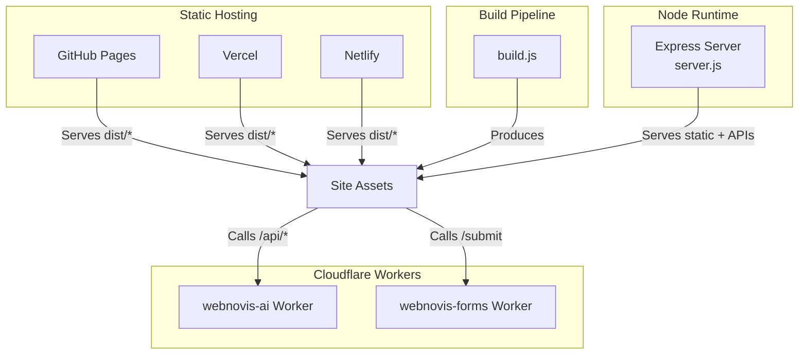
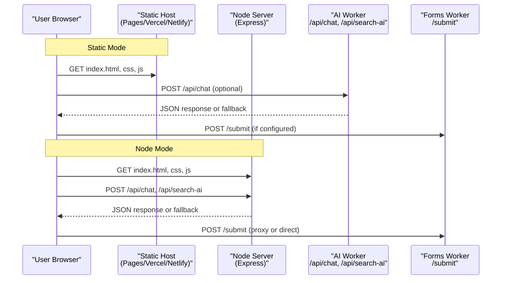
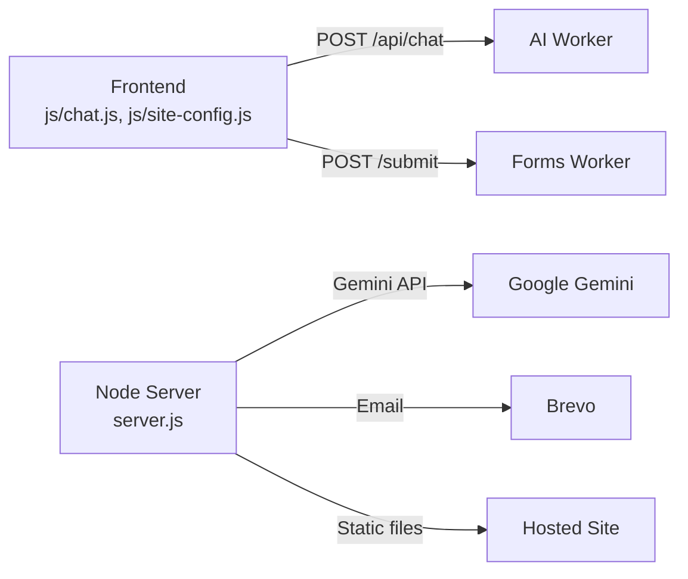
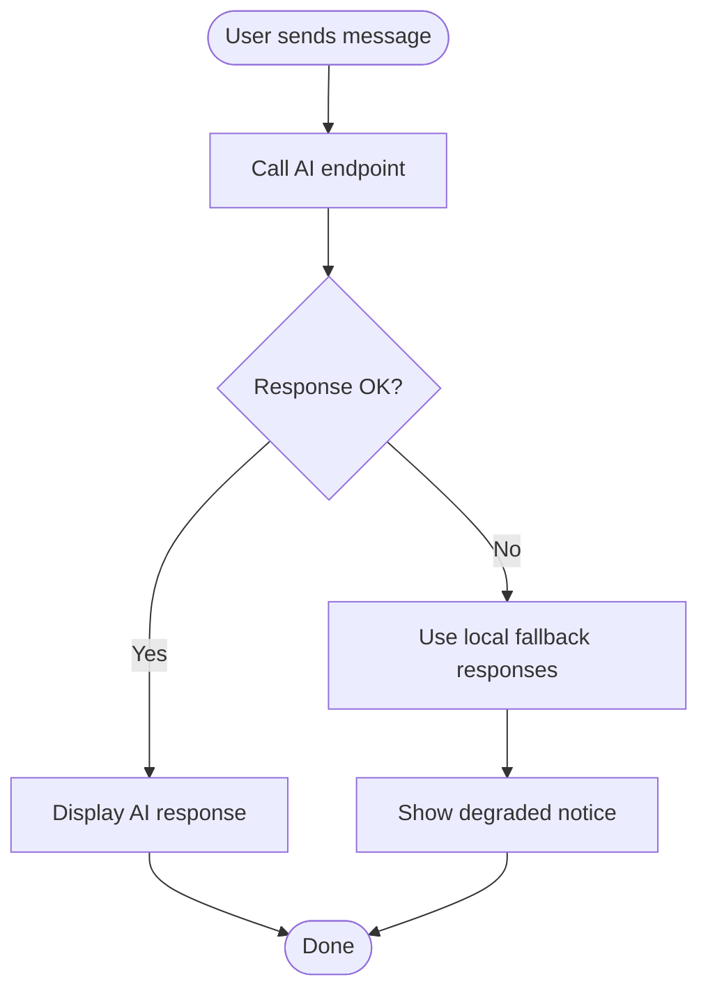

# Deployment Modes & Architecture

<cite>
**Referenced Files in This Document**
- [README.md](file://README.md)
- [package.json](file://package.json)
- [server.js](file://server.js)
- [build.js](file://build.js)
- [ai-config.js](file://ai-config.js)
- [chat-config.json](file://chat-config.json)
- [wrangler.jsonc](file://wrangler.jsonc)
- [workers/webnovis-ai/wrangler.jsonc](file://workers/webnovis-ai/wrangler.jsonc)
- [workers/webnovis-ai/src/index.js](file://workers/webnovis-ai/src/index.js)
- [workers/webnovis-forms/wrangler.jsonc](file://workers/webnovis-forms/wrangler.jsonc)
- [workers/webnovis-forms/src/index.js](file://workers/webnovis-forms/src/index.js)
- [js/chat.js](file://js/chat.js)
- [js/site-config.js](file://js/site-config.js)
- [docs/deploy/DEPLOY-GITHUB.md](file://docs/deploy/DEPLOY-GITHUB.md)
- [scripts/verify-prod-headers.js](file://scripts/verify-prod-headers.js)
</cite>

## Table of Contents
1. Introduction
2. Project Structure
3. Core Components
4. Architecture Overview
5. Detailed Component Analysis
6. Dependency Analysis
7. Performance Considerations
8. Troubleshooting Guide
9. Conclusion

## Introduction
This document explains WebNovis dual deployment modes and architecture:
- Static mode for GitHub Pages, Vercel, Netlify (HTML/CSS/JS only; no server-side APIs).
- Node.js mode using an Express server with full AI capabilities (chat, search, newsletter, admin endpoints).

It covers architectural differences, feature availability per mode, migration strategies, environment configuration, platform setup steps, graceful degradation when backend features are unavailable, and troubleshooting common deployment issues.

## Project Structure
WebNovis is a static-first site with optional runtime services:
- Static assets and generated pages live under the repository root and build outputs.
- A Node.js server serves static files and exposes API routes when running in Node mode.
- Cloudflare Workers provide serverless AI and form proxy services that can be used by both static and Node deployments.
- Build scripts produce optimized assets and HTML for production hosting.

**Diagram sources**
- [wrangler.jsonc:1-30](file://wrangler.jsonc#L1-L30)
- [workers/webnovis-ai/wrangler.jsonc:1-26](file://workers/webnovis-ai/wrangler.jsonc#L1-L26)
- [workers/webnovis-forms/wrangler.jsonc:1-20](file://workers/webnovis-forms/wrangler.jsonc#L1-L20)
- [build.js:373-495](file://build.js#L373-L495)
- [server.js:441-530](file://server.js#L441-L530)

**Section sources**
- [README.md:53-58](file://README.md#L53-L58)
- [package.json:6-59](file://package.json#L6-L59)
- [wrangler.jsonc:1-30](file://wrangler.jsonc#L1-L30)

## Core Components
- Static build pipeline: minifies JS/CSS, discovers assets from HTML, and produces a deployable artifact.
- Express server: serves static content, enforces SEO redirects and headers, and exposes API endpoints for chat, search, newsletter, and admin functions.
- Cloudflare Workers:
  - webnovis-ai: provides /api/chat, /api/search-ai, /api/chat-lead with Gemini-backed responses, rate limiting, KV sessions, and fallback to local catalog.
  - webnovis-forms: proxies form submissions with Turnstile verification to Web3Forms.
- Frontend chat client: calls the AI worker or falls back to local responses when backend is unreachable.

Key responsibilities:
- Build: deterministic, fast, and safe asset processing with fallbacks.
- Server: secure, cache-aware, redirect-normalized static serving plus protected APIs.
- Workers: scalable AI and forms with robust error handling and quotas.

**Section sources**
- [build.js:31-113](file://build.js#L31-L113)
- [build.js:242-279](file://build.js#L242-L279)
- [build.js:373-495](file://build.js#L373-L495)
- [server.js:224-319](file://server.js#L224-L319)
- [server.js:441-530](file://server.js#L441-L530)
- [workers/webnovis-ai/src/index.js:508-543](file://workers/webnovis-ai/src/index.js#L508-L543)
- [workers/webnovis-forms/src/index.js:87-170](file://workers/webnovis-forms/src/index.js#L87-L170)

## Architecture Overview
Two runtime modes coexist with shared frontend:

- Static mode (GitHub Pages, Vercel, Netlify):
  - Serves only HTML/CSS/JS.
  - No Express APIs.
  - Chat uses the Cloudflare Worker endpoint or degrades to local responses.
  - Forms use the forms Worker or direct Web3Forms path depending on configuration.

- Node.js mode (Express):
  - Serves static files and runs middleware stack (security headers, canonical redirects, trailing slash normalization, bot logging).
  - Exposes /api/* endpoints for chat, search, newsletter, and admin.
  - Integrates with Gemini via server-side keys and rate limits.

**Diagram sources**
- [js/chat.js:8-21](file://js/chat.js#L8-L21)
- [workers/webnovis-ai/src/index.js:508-543](file://workers/webnovis-ai/src/index.js#L508-L543)
- [workers/webnovis-forms/src/index.js:87-170](file://workers/webnovis-forms/src/index.js#L87-L170)
- [server.js:224-319](file://server.js#L224-L319)

## Detailed Component Analysis

### Static Mode (GitHub Pages, Vercel, Netlify)
- What it serves:
  - Built HTML, CSS, JS, images, fonts, and generated pSEO pages.
  - Static assets are served with appropriate cache headers in production.
- What it does not serve:
  - Express routes (/api/*) are unavailable.
- Chat behavior:
  - The chat client targets the AI Worker endpoint by default and falls back to local responses if unreachable.
- Forms behavior:
  - Uses site config to choose between direct Web3Forms submission or proxying through the forms Worker with Turnstile verification.

Setup highlights:
- GitHub Pages: push to main, enable Pages from root folder.
- Vercel: install CLI and deploy with vercel --prod.
- Netlify: connect repo, leave build command empty, publish directory /.

Environment notes:
- No .env needed for static-only.
- If you want AI features without a Node server, configure the frontend to call the AI Worker (already set by default in chat client).

Graceful degradation:
- When the AI Worker is unreachable or returns errors, the chat client shows degraded state and displays local guidance instead of failing silently.

**Section sources**
- [README.md:62-122](file://README.md#L62-L122)
- [docs/deploy/DEPLOY-GITHUB.md:51-69](file://docs/deploy/DEPLOY-GITHUB.md#L51-L69)
- [docs/deploy/DEPLOY-GITHUB.md:256-309](file://docs/deploy/DEPLOY-GITHUB.md#L256-L309)
- [js/chat.js:8-21](file://js/chat.js#L8-L21)
- [js/chat.js:481-498](file://js/chat.js#L481-L498)
- [js/site-config.js:1-19](file://js/site-config.js#L1-L19)

### Node.js Mode (Express Server)
- What it serves:
  - All static assets with optimized caching.
  - Canonical redirects, trailing slash normalization, security headers, X-Robots-Tag for API/admin paths.
- APIs exposed:
  - Chat, search-ai, newsletter, admin endpoints with rate limiting and quota tracking.
- AI integration:
  - Gemini models configured centrally; server tracks usage and applies daily caps.
- Security:
  - IP anonymization, prompt injection guard, session store, admin secret checks.

Environment variables:
- GEMINI_API_KEY_CHAT, GEMINI_API_KEY_SEARCH, GEMINI_API_KEY_WRITER
- BREVO_API_KEY, NEWSLETTER_ADMIN_SECRET
- NODE_ENV, PORT

Startup and run:
- npm start or npm run dev for development.

Graceful degradation:
- If API keys are missing or quotas exceeded, endpoints return safe fallbacks rather than exposing errors.

**Section sources**
- [package.json:6-59](file://package.json#L6-L59)
- [server.js:224-319](file://server.js#L224-L319)
- [server.js:441-530](file://server.js#L441-L530)
- [ai-config.js:1-38](file://ai-config.js#L1-L38)
- [server.js:180-220](file://server.js#L180-L220)

### Cloudflare Workers (Serverless AI and Forms)
- webnovis-ai:
  - Endpoints: /api/health, /api/chat, /api/search-ai, /api/chat-lead.
  - Rate limiting, KV-based sessions and caches, Gemini fallback chain, local catalog fallback.
- webnovis-forms:
  - Endpoint: /submit with Turnstile siteverify and forwarding to Web3Forms.
  - Supports JSON or form data payloads.

Configuration:
- wrangler.jsonc defines names, compatibility, vars, and KV namespaces.
- Secrets managed via Wrangler (e.g., TURNSTILE_SECRET).

**Section sources**
- [workers/webnovis-ai/wrangler.jsonc:1-26](file://workers/webnovis-ai/wrangler.jsonc#L1-L26)
- [workers/webnovis-ai/src/index.js:508-543](file://workers/webnovis-ai/src/index.js#L508-L543)
- [workers/webnovis-forms/wrangler.jsonc:1-20](file://workers/webnovis-forms/wrangler.jsonc#L1-L20)
- [workers/webnovis-forms/src/index.js:87-170](file://workers/webnovis-forms/src/index.js#L87-L170)

### Build Pipeline and Artifact
- Discovers JS/CSS inputs from explicit lists and HTML references.
- Minifies JS with Terser; CSS with Lightning CSS and CleanCSS fallback.
- Optionally minifies selected HTML and applies SEO transforms.
- Produces a clean dist artifact suitable for static hosts and Cloudflare Workers assets.

**Section sources**
- [build.js:31-113](file://build.js#L31-L113)
- [build.js:242-279](file://build.js#L242-L279)
- [build.js:373-495](file://build.js#L373-L495)

## Dependency Analysis
Runtime dependencies differ by mode:

- Static mode:
  - Zero runtime dependencies at host.
  - Optional dependency on Cloudflare Workers for AI and forms.

- Node mode:
  - Express, compression, cors, dotenv, express-rate-limit, node-fetch, nunjucks.
  - Scripts rely on build-time tools (terser, lightningcss/cleancss, html-minifier-terser).

External integrations:
- Google Gemini API for AI responses.
- Brevo for newsletter/email notifications.
- Cloudflare Turnstile for CAPTCHA verification.
- Web3Forms for email delivery.

**Diagram sources**
- [js/chat.js:8-21](file://js/chat.js#L8-L21)
- [js/site-config.js:1-19](file://js/site-config.js#L1-L19)
- [workers/webnovis-ai/src/index.js:508-543](file://workers/webnovis-ai/src/index.js#L508-L543)
- [workers/webnovis-forms/src/index.js:87-170](file://workers/webnovis-forms/src/index.js#L87-L170)
- [server.js:224-319](file://server.js#L224-L319)

**Section sources**
- [package.json:69-89](file://package.json#L69-L89)
- [workers/webnovis-ai/src/index.js:198-247](file://workers/webnovis-ai/src/index.js#L198-L247)
- [workers/webnovis-forms/src/index.js:36-85](file://workers/webnovis-forms/src/index.js#L36-L85)

## Performance Considerations
- Use the build pipeline to minify and optimize assets before deploying.
- Prefer static hosting for best performance; leverage CDN caching.
- In Node mode, compression middleware reduces payload sizes.
- Workers provide low-latency AI endpoints with KV caching and rate limiting.
- Avoid heavy client-side work; keep chat client lightweight with retries and adaptive timeouts.

[No sources needed since this section provides general guidance]

## Troubleshooting Guide

Common issues and resolutions:
- Chatbot not responding in static mode:
  - Expected if no backend or AI Worker is reachable; verify network and CORS.
  - Check browser console for fetch errors.
  - Confirm the AI Worker health endpoint responds.

- Domain or DNS problems on GitHub Pages:
  - Ensure A records and CNAME are correct and propagated.
  - Verify HTTPS enforcement.

- CSS/JS not loading:
  - Use relative paths; avoid absolute paths that break on different hosts.

- API endpoints returning 404 in static mode:
  - This is expected; use the AI Worker endpoints or run Node mode.

- Header and redirect checks:
  - Use provided verification script to assert production headers and redirects.

Environment misconfiguration:
- Missing API keys in Node mode will cause fallback responses; ensure .env is set and secrets are not committed.
- For forms, ensure TURNSTILE_HOSTNAMES includes your domain and TURNSTILE_SECRET is configured.

**Section sources**
- [docs/deploy/DEPLOY-GITHUB.md:346-401](file://docs/deploy/DEPLOY-GITHUB.md#L346-L401)
- [scripts/verify-prod-headers.js:34-58](file://scripts/verify-prod-headers.js#L34-L58)
- [js/chat.js:481-498](file://js/chat.js#L481-L498)
- [workers/webnovis-forms/src/index.js:36-85](file://workers/webnovis-forms/src/index.js#L36-L85)

## Migration Strategies

From Static to Node mode:
- Install dependencies and create .env with required keys.
- Run npm start and expose the server behind a reverse proxy or platform that supports Node processes.
- Update frontend API endpoints if necessary (default points to AI Worker; Node mode also exposes /api/*).

From Node to Static:
- Stop the Node process; continue serving built assets.
- Keep AI features by pointing the frontend to the AI Worker (already configured by default).
- Remove any Node-specific routing; rely on static hosting.

Migrating to Cloudflare Workers for static assets:
- Build the site and deploy the dist directory as assets.
- Configure html_handling to preserve existing .html URLs.
- Use _redirects in dist for index rewrites if needed.

Migrating forms to serverless:
- Use the forms Worker to handle Turnstile verification and forward to Web3Forms.
- Set TURNSTILE_HOSTNAMES and TURNSTILE_SECRET in Worker secrets.

**Section sources**
- [README.md:75-93](file://README.md#L75-L93)
- [wrangler.jsonc:1-30](file://wrangler.jsonc#L1-L30)
- [workers/webnovis-forms/wrangler.jsonc:1-20](file://workers/webnovis-forms/wrangler.jsonc#L1-L20)

## Graceful Degradation in Static Deployments
When backend features are unavailable:
- Chat client detects failures and switches to local fallback responses.
- UI shows a degraded status message to inform users that responses are offline guidance.
- Lead capture attempts are fire-and-forget and do not block UX.
- Search AI returns safe fallback results when API keys are missing or quotas exceeded.

**Diagram sources**
- [js/chat.js:481-498](file://js/chat.js#L481-L498)
- [js/chat.js:504-531](file://js/chat.js#L504-L531)
- [workers/webnovis-ai/src/index.js:370-439](file://workers/webnovis-ai/src/index.js#L370-L439)

**Section sources**
- [js/chat.js:481-531](file://js/chat.js#L481-L531)
- [workers/webnovis-ai/src/index.js:370-439](file://workers/webnovis-ai/src/index.js#L370-L439)

## Conclusion
WebNovis supports two complementary deployment modes:
- Static mode for fast, reliable hosting on GitHub Pages, Vercel, and Netlify with zero server maintenance.
- Node.js mode for full-featured AI, newsletter, and admin capabilities behind an Express server.

Both modes share a single frontend that gracefully degrades when backend services are unavailable. Cloudflare Workers extend functionality serverlessly for AI and forms. Use the provided build pipeline and configuration to ensure consistent, optimized deployments across platforms.

[No sources needed since this section summarizes without analyzing specific files]