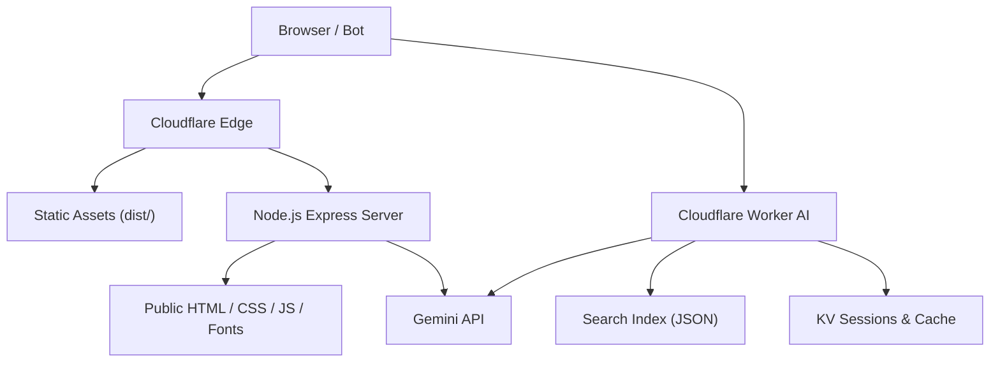
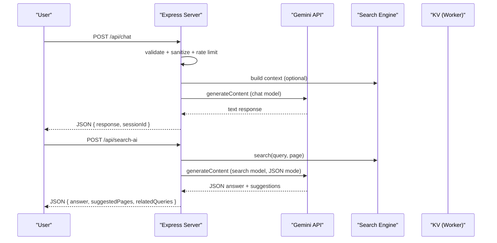
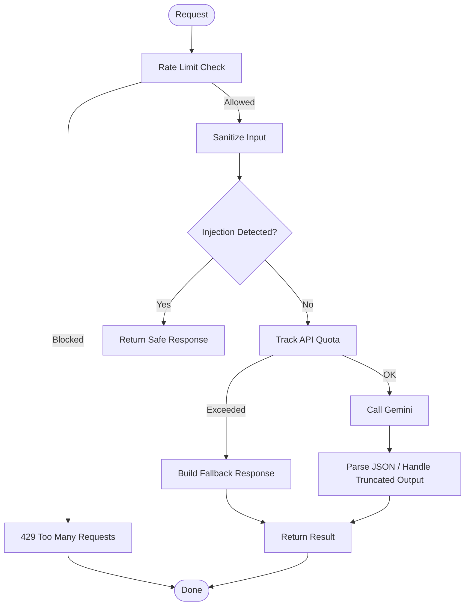
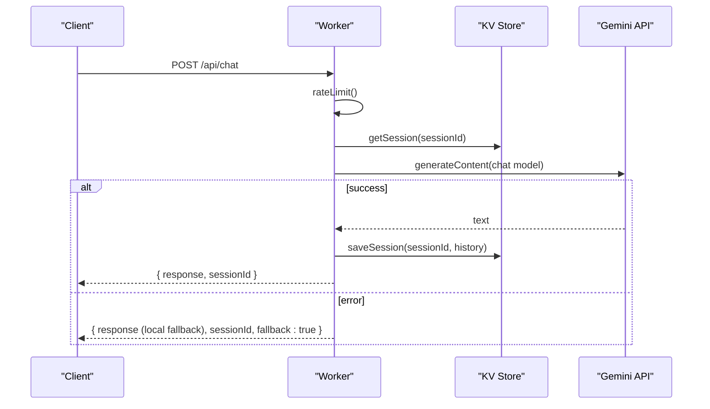
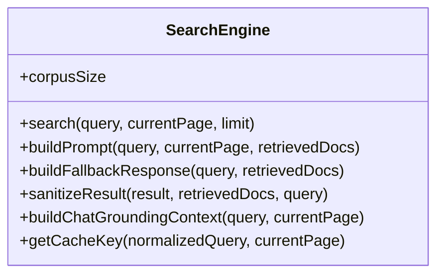
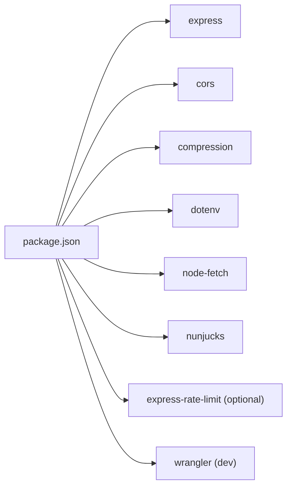

# Node.js Deployment Mode

<cite>
**Referenced Files in This Document**
- [server.js](file://server.js)
- [package.json](file://package.json)
- [ai-config.js](file://ai-config.js)
- [chat-config.json](file://chat-config.json)
- [search-ai-engine.js](file://search-ai-engine.js)
- [config/security-headers.js](file://config/security-headers.js)
- [workers/webnovis-ai/src/index.js](file://workers/webnovis-ai/src/index.js)
- [workers/webnovis-ai/src/search-engine.js](file://workers/webnovis-ai/src/search-engine.js)
- [workers/webnovis-ai/wrangler.jsonc](file://workers/webnovis-ai/wrangler.jsonc)
- [wrangler.jsonc](file://wrangler.jsonc)
- [docs/CLOUDFLARE-AI-SETUP.md](file://docs/CLOUDFLARE-AI-SETUP.md)
- [docs/deploy/CLOUDFLARE-CONFIGURAZIONE-PASSO-PASSO.md](file://docs/deploy/CLOUDFLARE-CONFIGURAZIONE-PASSO-PASSO.md)
</cite>

## Table of Contents
1. Introduction
2. Project Structure
3. Core Components
4. Architecture Overview
5. Detailed Component Analysis
6. Dependency Analysis
7. Performance Considerations
8. Troubleshooting Guide
9. Conclusion
10. Appendices

## Introduction
This document explains the Node.js deployment mode with full AI capabilities for the WebNovis project. It covers the Express.js server architecture, middleware stack, API endpoints, environment configuration (including Google Gemini integration), rate limiting and security headers, concurrent request handling, AI session management, fallback mechanisms, and production monitoring/logging. It also provides guidance for deploying to traditional Node.js hosting, Cloudflare Workers, and containerized environments.

## Project Structure
The runtime consists of two complementary parts:
- A Node.js/Express server that serves static site assets, applies security headers, and exposes internal APIs (chat and search).
- A Cloudflare Worker that provides a scalable AI API (chat, search, health, lead capture) backed by Google Gemini and an in-worker search engine.

**Diagram sources**
- [server.js:224-530](file://server.js#L224-L530)
- [workers/webnovis-ai/src/index.js:508-543](file://workers/webnovis-ai/src/index.js#L508-L543)
- [wrangler.jsonc:22-29](file://wrangler.jsonc#L22-L29)

**Section sources**
- [server.js:224-530](file://server.js#L224-L530)
- [wrangler.jsonc:22-29](file://wrangler.jsonc#L22-L29)

## Core Components
- Express server: loads environment variables, sets up CORS, compression, security headers, SEO redirects, static file serving, and API routes for chat and search.
- AI configuration: model selection, generation parameters, and separation of keys for chat vs search.
- Search engine: token/intent-based ranking over a JSON corpus; used both in Node and Worker.
- Cloudflare Worker: implements /api/chat, /api/search-ai, /api/health, /api/chat-lead with KV-backed sessions, rate limiting, and Gemini calls with fallbacks.

Key responsibilities:
- Security: CSP, HSTS, X-Frame-Options, Referrer-Policy, Permissions-Policy, IP anonymization, prompt injection guard.
- Rate limiting: per-IP limits for chat and search.
- Quota tracking: daily counters for Gemini keys to prevent runaway spend.
- Session management: in-memory map on Node; KV-backed sessions in Worker.
- Fallbacks: local responses when Gemini is unavailable or quota exceeded.

**Section sources**
- [server.js:95-127](file://server.js#L95-L127)
- [server.js:129-187](file://server.js#L129-L187)
- [server.js:252-319](file://server.js#L252-L319)
- [ai-config.js:1-38](file://ai-config.js#L1-L38)
- [workers/webnovis-ai/src/index.js:12-24](file://workers/webnovis-ai/src/index.js#L12-L24)
- [workers/webnovis-ai/src/index.js:141-151](file://workers/webnovis-ai/src/index.js#L141-L151)

## Architecture Overview
The system supports two execution modes:
- Traditional Node.js hosting: Express server handles requests, proxies to Gemini, and serves static content.
- Cloudflare Workers: Stateless edge functions handle chat/search with KV storage and global Gemini access.

**Diagram sources**
- [server.js:742-800](file://server.js#L742-L800)
- [search-ai-engine.js:201-271](file://search-ai-engine.js#L201-L271)

**Section sources**
- [server.js:742-800](file://server.js#L742-L800)
- [search-ai-engine.js:201-271](file://search-ai-engine.js#L201-L271)

## Detailed Component Analysis

### Express Server (Node.js)
- Middleware stack order:
  - CORS with origin allowlist
  - Trust proxy
  - JSON body parser with size limit
  - Canonical host redirect (non-www → www)
  - Security headers from centralized config
  - X-Robots-Tag for API paths and governed pages
  - Legacy redirects and trailing slash normalization
  - UTM/tracking parameter stripping
  - Bot detection logging
  - Public file serving with cache policies
- API endpoints:
  - POST /api/chat: chat with Gemini, session history, injection guard, quota tracking, fallback
  - POST /api/search-ai: search with Gemini, in-memory cache, deduplication, fallback
  - Protected admin endpoints gated by header secret
- Concurrency and sessions:
  - In-memory Map of sessions with max concurrent cap and TTL cleanup
  - Periodic eviction of oldest sessions
- Rate limiting:
  - express-rate-limit for chat and newsletter endpoints
- Quota monitoring:
  - Daily counters per key with warnings and hard caps

**Diagram sources**
- [server.js:252-262](file://server.js#L252-L262)
- [server.js:180-220](file://server.js#L180-L220)
- [server.js:742-800](file://server.js#L742-L800)

**Section sources**
- [server.js:224-530](file://server.js#L224-L530)
- [server.js:584-619](file://server.js#L584-L619)
- [server.js:625-644](file://server.js#L625-L644)
- [server.js:675-740](file://server.js#L675-L740)
- [server.js:742-800](file://server.js#L742-L800)

### Cloudflare Worker AI
- Endpoints:
  - GET /api/health: service status and corpus size
  - POST /api/chat: chat with Gemini, grounded by search index, KV sessions, fallback
  - POST /api/search-ai: search with Gemini JSON mode, KV cache, fallback
  - POST /api/chat-lead: store leads and send email via Brevo
- Features:
  - KV-backed rate limiting and sessions
  - CORS enforcement based on env
  - Prompt injection guard
  - Model fallback chain (lite → standard)
  - Local catalog fallback when API keys missing

**Diagram sources**
- [workers/webnovis-ai/src/index.js:266-368](file://workers/webnovis-ai/src/index.js#L266-L368)
- [workers/webnovis-ai/src/index.js:178-196](file://workers/webnovis-ai/src/index.js#L178-L196)
- [workers/webnovis-ai/src/index.js:141-151](file://workers/webnovis-ai/src/index.js#L141-L151)

**Section sources**
- [workers/webnovis-ai/src/index.js:12-24](file://workers/webnovis-ai/src/index.js#L12-L24)
- [workers/webnovis-ai/src/index.js:141-151](file://workers/webnovis-ai/src/index.js#L141-L151)
- [workers/webnovis-ai/src/index.js:178-196](file://workers/webnovis-ai/src/index.js#L178-L196)
- [workers/webnovis-ai/src/index.js:266-368](file://workers/webnovis-ai/src/index.js#L266-L368)
- [workers/webnovis-ai/src/index.js:370-440](file://workers/webnovis-ai/src/index.js#L370-L440)
- [workers/webnovis-ai/src/index.js:442-506](file://workers/webnovis-ai/src/index.js#L442-L506)
- [workers/webnovis-ai/src/index.js:508-543](file://workers/webnovis-ai/src/index.js#L508-L543)

### Search Engine (Node and Worker)
- Token/intent hybrid ranking over a JSON corpus
- Normalization, stop words, safe truncation, path normalization
- Intent inference guides result boosts (pricing, contact, portfolio, about, informational, local, commercial)
- Build prompts for Gemini with strict JSON instructions
- Fallback responses when no relevant docs or API errors
- Sanitization ensures only allowed URLs are returned

**Diagram sources**
- [search-ai-engine.js:201-389](file://search-ai-engine.js#L201-L389)
- [workers/webnovis-ai/src/search-engine.js:188-379](file://workers/webnovis-ai/src/search-engine.js#L188-L379)

**Section sources**
- [search-ai-engine.js:14-68](file://search-ai-engine.js#L14-L68)
- [search-ai-engine.js:70-117](file://search-ai-engine.js#L70-L117)
- [search-ai-engine.js:151-199](file://search-ai-engine.js#L151-L199)
- [search-ai-engine.js:201-389](file://search-ai-engine.js#L201-L389)
- [workers/webnovis-ai/src/search-engine.js:6-65](file://workers/webnovis-ai/src/search-engine.js#L6-L65)
- [workers/webnovis-ai/src/search-engine.js:72-105](file://workers/webnovis-ai/src/search-engine.js#L72-L105)
- [workers/webnovis-ai/src/search-engine.js:107-157](file://workers/webnovis-ai/src/search-engine.js#L107-L157)
- [workers/webnovis-ai/src/search-engine.js:188-379](file://workers/webnovis-ai/src/search-engine.js#L188-L379)

### Environment Variables and Configuration
- Node.js server:
  - PORT, NODE_ENV
  - NEWSLETTER_ADMIN_SECRET (admin auth)
  - CORS_ORIGINS (extend allowed origins)
  - GEMINI_API_KEY_CHAT, GEMINI_API_KEY_SEARCH (separated keys)
- AI configuration:
  - Models for chat, search, writer and fallbacks
  - Generation parameters (temperature, maxTokens)
  - Conversation memory and fallback behavior
- Chat configuration:
  - Company info, services/pricing, timeline, chatbot instructions
- Cloudflare Worker:
  - Secrets: GEMINI_API_KEY_CHAT, GEMINI_API_KEY_SEARCH, BREVO_*
  - CORS_ORIGINS
  - KV namespace binding for sessions/cache

**Section sources**
- [server.js:224-232](file://server.js#L224-L232)
- [server.js:252-282](file://server.js#L252-L282)
- [ai-config.js:1-38](file://ai-config.js#L1-L38)
- [chat-config.json:1-109](file://chat-config.json#L1-L109)
- [workers/webnovis-ai/.dev.vars.example:1-9](file://workers/webnovis-ai/.dev.vars.example#L1-L9)
- [workers/webnovis-ai/wrangler.jsonc:15-25](file://workers/webnovis-ai/wrangler.jsonc#L15-L25)

### Security Headers and CORS
- Centralized security headers: HSTS, X-Content-Type-Options, X-Frame-Options, CSP, Referrer-Policy, Permissions-Policy
- Dynamic CSP with nonce support
- CORS allowlist derived from defaults and env
- Production verification script available

**Section sources**
- [config/security-headers.js:1-113](file://config/security-headers.js#L1-L113)
- [docs/deploy/CLOUDFLARE-CONFIGURAZIONE-PASSO-PASSO.md:28-100](file://docs/deploy/CLOUDFLARE-CONFIGURAZIONE-PASSO-PASSO.md#L28-L100)

### API Endpoints Summary
- Node.js Express:
  - POST /api/chat: chat with Gemini, session history, injection guard, quota tracking
  - POST /api/search-ai: search with Gemini, caching, deduplication
  - Admin endpoints protected by header secret
- Cloudflare Worker:
  - GET /api/health
  - POST /api/chat
  - POST /api/search-ai
  - POST /api/chat-lead

**Section sources**
- [server.js:742-800](file://server.js#L742-L800)
- [workers/webnovis-ai/src/index.js:508-543](file://workers/webnovis-ai/src/index.js#L508-L543)

### Concurrent Requests, Sessions, and Fallbacks
- Concurrency:
  - Node: in-memory Map with max concurrent sessions and periodic cleanup
  - Worker: KV-backed sessions with TTL; rate limiting per window
- Fallbacks:
  - Node: quota exceeded or API error returns local fallback responses
  - Worker: model fallback chain (lite → standard); local catalog if keys missing; KV cache for search results

**Section sources**
- [server.js:584-619](file://server.js#L584-L619)
- [server.js:180-220](file://server.js#L180-L220)
- [workers/webnovis-ai/src/index.js:178-196](file://workers/webnovis-ai/src/index.js#L178-L196)
- [workers/webnovis-ai/src/index.js:238-247](file://workers/webnovis-ai/src/index.js#L238-L247)
- [workers/webnovis-ai/src/index.js:311-320](file://workers/webnovis-ai/src/index.js#L311-L320)

### Monitoring, Logging, and Debugging
- Node.js:
  - Bot access log with rotation
  - Console logs for quota warnings/errors
  - Compression and rate limiter diagnostics
- Worker:
  - Observability enabled in wrangler config
  - Tail logs via Wrangler
  - Health endpoint for readiness checks

**Section sources**
- [server.js:395-429](file://server.js#L395-L429)
- [workers/webnovis-ai/wrangler.jsonc:11-14](file://workers/webnovis-ai/wrangler.jsonc#L11-L14)
- [docs/CLOUDFLARE-AI-SETUP.md:247-252](file://docs/CLOUDFLARE-AI-SETUP.md#L247-L252)

## Dependency Analysis
- Runtime dependencies include Express, CORS, compression, dotenv, node-fetch, nunjucks, and optional express-rate-limit.
- Dev dependencies include testing, minification, linting, and Wrangler for Workers.
- The search engine module is shared between Node and Worker implementations.

**Diagram sources**
- [package.json:69-89](file://package.json#L69-L89)

**Section sources**
- [package.json:1-92](file://package.json#L1-L92)

## Performance Considerations
- Compression enabled for text assets to reduce transfer size.
- Static assets served with long cache times in production; HTML with short cache and stale-while-revalidate.
- In-memory cache for search results with TTL and max entries; in-flight deduplication prevents duplicate API calls.
- KV cache in Worker for search results and sessions.
- Model selection uses fast lite models where possible with fallback to standard models.
- Request timeouts on Gemini calls to avoid hanging.

[No sources needed since this section provides general guidance]

## Troubleshooting Guide
- Missing secrets:
  - Ensure GEMINI_API_KEY_CHAT and GEMINI_API_KEY_SEARCH are set in environment or Worker secrets.
- CSP blocking:
  - Update CSP connect-src and CORS origins; run header sync script.
- Rate limiting:
  - Adjust limits if legitimate traffic is blocked; verify per-IP keys.
- Quota exceeded:
  - Monitor console warnings; consider increasing quotas or using separate projects.
- Fallback behavior:
  - If Gemini is down, responses fall back to local logic; verify fallback messages.
- Worker KV:
  - Ensure KV namespace binding exists for sessions and cache.

**Section sources**
- [docs/CLOUDFLARE-AI-SETUP.md:256-266](file://docs/CLOUDFLARE-AI-SETUP.md#L256-L266)
- [docs/deploy/CLOUDFLARE-CONFIGURAZIONE-PASSO-PASSO.md:104-159](file://docs/deploy/CLOUDFLARE-CONFIGURAZIONE-PASSO-PASSO.md#L104-L159)
- [server.js:95-107](file://server.js#L95-L107)
- [server.js:180-220](file://server.js#L180-L220)

## Conclusion
The Node.js deployment mode integrates a secure Express server with robust AI features powered by Google Gemini. It provides comprehensive security headers, rate limiting, quota tracking, and fallback mechanisms. The Cloudflare Worker offers a scalable alternative with KV-backed sessions and caching. Together, they deliver reliable chat and search experiences across traditional hosting and edge deployments.

## Appendices

### Deployment Guides
- Traditional Node.js hosting:
  - Install dependencies, set environment variables, start server.
  - Use compression and rate limiting in production.
  - Serve static files from dist or root as configured.
- Cloudflare Workers:
  - Prepare data, deploy worker, set secrets, verify endpoints.
  - Optionally configure custom domain and update frontend references.
- Containerized environments:
  - Package Node app with required dependencies; expose PORT; ensure .env is mounted securely.
  - Apply same security headers and rate limiting as in-process.

**Section sources**
- [docs/CLOUDFLARE-AI-SETUP.md:31-113](file://docs/CLOUDFLARE-AI-SETUP.md#L31-L113)
- [docs/CLOUDFLARE-AI-SETUP.md:115-171](file://docs/CLOUDFLARE-AI-SETUP.md#L115-L171)
- [wrangler.jsonc:1-29](file://wrangler.jsonc#L1-L29)