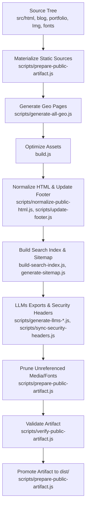
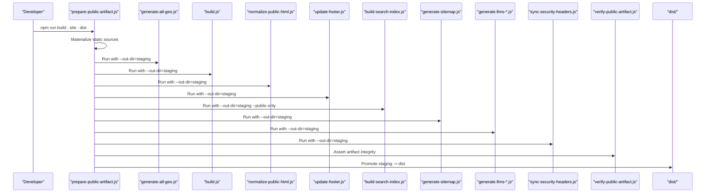
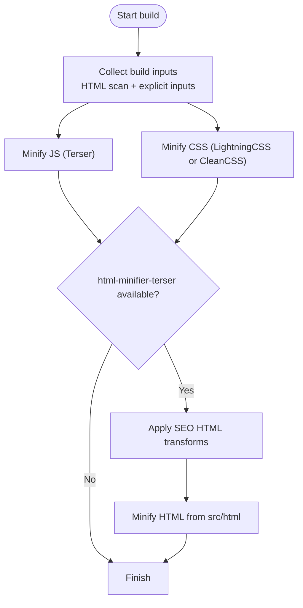
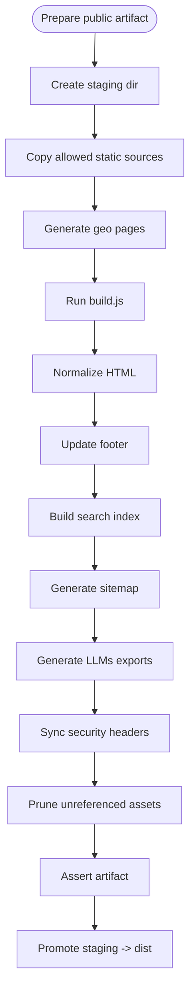
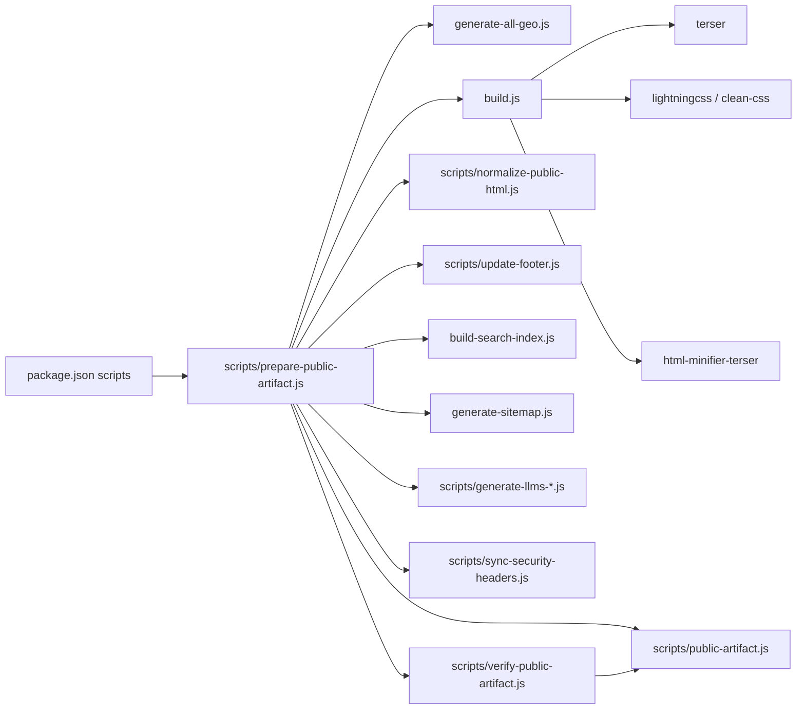

# Static Deployment Mode

<cite>
**Referenced Files in This Document**
- [build.js](file://build.js)
- [package.json](file://package.json)
- [scripts/prepare-public-artifact.js](file://scripts/prepare-public-artifact.js)
- [scripts/public-artifact.js](file://scripts/public-artifact.js)
- [scripts/verify-public-artifact.js](file://scripts/verify-public-artifact.js)
- [config/publish-targets.js](file://config/publish-targets.js)
- [config/security-headers.js](file://config/security-headers.js)
- [wrangler.jsonc](file://wrangler.jsonc)
- [.github/workflows/quality-gate.yml](file://.github/workflows/quality-gate.yml)
- [docs/deploy/DEPLOY-GITHUB.md](file://docs/deploy/DEPLOY-GITHUB.md)
- [docs/deploy/GITHUB-SETUP-RAPIDO.md](file://docs/deploy/GITHUB-SETUP-RAPIDO.md)
</cite>

## Table of Contents
1. Introduction
2. Project Structure
3. Core Components
4. Architecture Overview
5. Detailed Component Analysis
6. Dependency Analysis
7. Performance Considerations
8. Troubleshooting Guide
9. Conclusion
10. Appendices

## Introduction
This document explains WebNovis static deployment mode: how the build system generates optimized static assets (HTML, CSS, JavaScript, images), how the asset pipeline processes templates and content, and how to produce a deployment-ready artifact for GitHub Pages, Vercel, Netlify, Cloudflare Pages, and similar platforms. It covers environment configuration, build scripts, customization options, SEO optimization, performance features, and the public artifact creation process.

## Project Structure
The static build is orchestrated by Node scripts that:
- Materialize a sanitized dist artifact from source trees
- Generate geo pages and other dynamic HTML
- Minify JS/CSS and optionally minify HTML
- Normalize HTML, update footers, generate search index, sitemap, LLMs files, and security headers
- Prune unreferenced media/fonts and validate the final artifact

**Diagram sources**
- [scripts/prepare-public-artifact.js:87-233](file://scripts/prepare-public-artifact.js#L87-L233)
- [build.js:373-496](file://build.js#L373-L496)
- [scripts/verify-public-artifact.js:235-393](file://scripts/verify-public-artifact.js#L235-L393)

**Section sources**
- [scripts/prepare-public-artifact.js:1-280](file://scripts/prepare-public-artifact.js#L1-L280)
- [build.js:1-502](file://build.js#L1-L502)
- [scripts/public-artifact.js:1-311](file://scripts/public-artifact.js#L1-L311)
- [scripts/verify-public-artifact.js:1-426](file://scripts/verify-public-artifact.js#L1-L426)
- [config/publish-targets.js:1-37](file://config/publish-targets.js#L1-L37)

## Core Components
- Build orchestrator: materializes staging, runs generators, optimizers, validators, and promotes the final dist artifact.
- Asset optimizer: discovers and minifies JS/CSS; optionally minifies HTML with SEO transforms.
- Public artifact policy: enforces allowed paths, excludes forbidden files, validates runtime closure, and ensures required sentinels.
- Validation suite: checks sitemap/search index alignment, noindex rules, missing references, secrets scanning, and header synchronization.
- Configuration: publish targets, report directories, and security headers generation.

Key responsibilities:
- Deterministic builds via SOURCE_DATE_EPOCH and isolated staging directories.
- Safe outputs by refusing symlinks and enforcing allowlists.
- Performance-focused optimizations (minification, pruning, cacheable headers).
- SEO correctness (sitemap, search index, robots/noindex checks).

**Section sources**
- [scripts/prepare-public-artifact.js:183-259](file://scripts/prepare-public-artifact.js#L183-L259)
- [build.js:31-113](file://build.js#L31-L113)
- [scripts/public-artifact.js:8-134](file://scripts/public-artifact.js#L8-L134)
- [scripts/verify-public-artifact.js:235-393](file://scripts/verify-public-artifact.js#L235-L393)
- [config/publish-targets.js:11-27](file://config/publish-targets.js#L11-L27)
- [config/security-headers.js:64-101](file://config/security-headers.js#L64-L101)

## Architecture Overview
The static deployment pipeline is a multi-stage process that produces a hardened, optimized, and validated dist folder suitable for any static host.

**Diagram sources**
- [scripts/prepare-public-artifact.js:205-248](file://scripts/prepare-public-artifact.js#L205-L248)
- [build.js:373-496](file://build.js#L373-L496)
- [scripts/verify-public-artifact.js:235-393](file://scripts/verify-public-artifact.js#L235-L393)

## Detailed Component Analysis

### Build Script (build.js)
- Discovers HTML roots and scans for referenced JS/CSS to include in the build.
- Minifies JS using Terser with strict production settings (console removal, dead code elimination, mangle disabled for compatibility).
- Minifies CSS using Lightning CSS with CleanCSS fallback; supports per-file overrides and safe cascade preservation.
- Optionally minifies HTML from src/html into root output paths, applying SEO transforms before minification.
- Enforces non-zero inputs when building to a separate publish root.

**Diagram sources**
- [build.js:242-279](file://build.js#L242-L279)
- [build.js:290-371](file://build.js#L290-L371)
- [build.js:428-493](file://build.js#L428-L493)

**Section sources**
- [build.js:16-113](file://build.js#L16-L113)
- [build.js:242-279](file://build.js#L242-L279)
- [build.js:290-371](file://build.js#L290-L371)
- [build.js:428-493](file://build.js#L428-L493)

### Public Artifact Preparation (scripts/prepare-public-artifact.js)
- Creates an isolated staging directory and copies only allowed static sources (blog/portfolio HTML, Img, fonts, technical files).
- Generates geo pages, runs the asset builder, normalizes HTML, updates footer, builds search index, sitemap, LLMs exports, and syncs security headers.
- Prunes unreferenced media/fonts and writes a closure report.
- Validates the artifact and atomically promotes staging to dist.

**Diagram sources**
- [scripts/prepare-public-artifact.js:87-125](file://scripts/prepare-public-artifact.js#L87-L125)
- [scripts/prepare-public-artifact.js:205-248](file://scripts/prepare-public-artifact.js#L205-L248)
- [scripts/prepare-public-artifact.js:127-156](file://scripts/prepare-public-artifact.js#L127-L156)
- [scripts/prepare-public-artifact.js:158-181](file://scripts/prepare-public-artifact.js#L158-L181)

**Section sources**
- [scripts/prepare-public-artifact.js:1-280](file://scripts/prepare-public-artifact.js#L1-L280)

### Public Artifact Policy (scripts/public-artifact.js)
- Defines allowed public file sets, forbidden prefixes/names, and media/font extensions.
- Provides utilities to walk files safely, assert safe publish targets, and collect expected HTML.
- Declares dynamic runtime dependencies and sentinel files required in the artifact.

Key guarantees:
- No symlinks in artifact.
- No sensitive or internal paths published.
- Required sentinels present (e.g., _headers, _redirects, key HTML/JS/CSS files).

**Section sources**
- [scripts/public-artifact.js:8-134](file://scripts/public-artifact.js#L8-L134)
- [scripts/public-artifact.js:164-193](file://scripts/public-artifact.js#L164-L193)
- [scripts/public-artifact.js:195-216](file://scripts/public-artifact.js#L195-L216)
- [scripts/public-artifact.js:252-282](file://scripts/public-artifact.js#L252-L282)

### Artifact Verification (scripts/verify-public-artifact.js)
- Checks required sentinels and forbids unsafe paths.
- Compares expected vs actual HTML, validates sitemap URLs against physical files, and ensures noindex consistency.
- Verifies runtime closure across HTML/CSS/JS and manifest references.
- Scans for secret-like content and synchronizes _headers with config.
- Produces a detailed report and manifest.

**Section sources**
- [scripts/verify-public-artifact.js:235-393](file://scripts/verify-public-artifact.js#L235-L393)

### Configuration and Targets (config/publish-targets.js)
- Resolves ROOT_DIR, SOURCE_ROOT, PUBLISH_DIR, REPORT_DIR from CLI args and environment variables.
- Ensures consistent paths across all build steps.

**Section sources**
- [config/publish-targets.js:1-37](file://config/publish-targets.js#L1-L37)

### Security Headers (config/security-headers.js)
- Centralized CSP, HSTS, X-Frame-Options, Permissions-Policy, and more.
- Generates a static _headers file compatible with Netlify/Cloudflare Pages.

**Section sources**
- [config/security-headers.js:40-48](file://config/security-headers.js#L40-L48)
- [config/security-headers.js:64-101](file://config/security-headers.js#L64-L101)

## Dependency Analysis
The build pipeline depends on well-defined modules and scripts. The following diagram shows core relationships and data flow between components.

**Diagram sources**
- [package.json:6-61](file://package.json#L6-L61)
- [scripts/prepare-public-artifact.js:205-248](file://scripts/prepare-public-artifact.js#L205-L248)
- [build.js:15-27](file://build.js#L15-L27)
- [scripts/public-artifact.js:1-311](file://scripts/public-artifact.js#L1-L311)
- [scripts/verify-public-artifact.js:1-40](file://scripts/verify-public-artifact.js#L1-L40)

**Section sources**
- [package.json:6-61](file://package.json#L6-L61)
- [scripts/prepare-public-artifact.js:205-248](file://scripts/prepare-public-artifact.js#L205-L248)
- [build.js:15-27](file://build.js#L15-L27)

## Performance Considerations
- JS minification removes console/debugger calls, unused code, and dead branches; mangle disabled to preserve compatibility.
- CSS uses Lightning CSS with safe nesting/media drafts; falls back to CleanCSS if needed.
- HTML minification is optional and applied only to src/html files; SEO transforms are applied prior to minification.
- Unreferenced media/fonts are pruned to reduce artifact size.
- Cache headers are generated for static assets and HTML; immutable caching is avoided for stable paths.

[No sources needed since this section provides general guidance]

## Troubleshooting Guide
Common issues and resolutions:
- Missing runtime references: ensure all linked JS/CSS/images exist in dist; verify dynamic loader policies.
- Sitemap mismatch: rebuild sitemap and search index; confirm URL canonicalization.
- Secrets found in artifact: remove sensitive files and re-run the build; check .gitignore and artifact allowlist.
- Header drift: regenerate _headers via sync script; ensure CSP and frame-ancestors align.
- Build fails due to zero inputs: ensure at least one JS and one CSS input exists when publishing to a separate root.

**Section sources**
- [scripts/verify-public-artifact.js:300-348](file://scripts/verify-public-artifact.js#L300-L348)
- [scripts/prepare-public-artifact.js:127-156](file://scripts/prepare-public-artifact.js#L127-L156)
- [build.js:373-381](file://build.js#L373-L381)

## Conclusion
WebNovis static deployment mode produces a hardened, optimized, and validated dist artifact ready for any static hosting platform. The pipeline enforces safety, performance, and SEO correctness while remaining customizable through configuration and per-file overrides. Use the provided scripts and CI workflows to build, validate, and deploy consistently.

[No sources needed since this section summarizes without analyzing specific files]

## Appendices

### Environment Configuration
- PUBLISH_DIR: Output directory for the build (default current directory or resolved via CLI).
- REPORT_DIR: Directory for build reports and manifests.
- SOURCE_DATE_EPOCH: Optional deterministic timestamp for reproducible builds.
- CORS_ORIGINS: Comma-separated list of allowed origins appended to defaults.

**Section sources**
- [config/publish-targets.js:11-27](file://config/publish-targets.js#L11-L27)
- [scripts/prepare-public-artifact.js:190-197](file://scripts/prepare-public-artifact.js#L190-L197)
- [config/security-headers.js:57-62](file://config/security-headers.js#L57-L62)

### Build Scripts Usage
- npm run build: Optimizes JS/CSS and optionally HTML in place.
- npm run build:dist: Builds to dist/.
- npm run build:site:dist: Full artifact preparation, validation, and promotion to dist/.
- npm run ci:quality:dist: End-to-end quality gate including artifact verification.

**Section sources**
- [package.json:6-61](file://package.json#L6-L61)

### Customization Options
- JS/CSS overrides: per-file terser/lightning options via config objects.
- Skip lists: exclude specific files from minification.
- Explicit inputs: define additional JS/CSS sources beyond discovery.
- HTML minification toggles: controlled by presence of html-minifier-terser.

**Section sources**
- [build.js:31-113](file://build.js#L31-L113)

### Platform-Specific Setup

#### GitHub Pages
- Deploy static-only mode: push built dist contents to a branch configured for Pages.
- Custom domain setup includes A records and CNAME as documented.
- Chatbot in static mode uses local responses unless a separate backend is deployed.

**Section sources**
- [docs/deploy/DEPLOY-GITHUB.md:51-64](file://docs/deploy/DEPLOY-GITHUB.md#L51-L64)
- [docs/deploy/DEPLOY-GITHUB.md:129-214](file://docs/deploy/DEPLOY-GITHUB.md#L129-L214)
- [docs/deploy/GITHUB-SETUP-RAPIDO.md:75-101](file://docs/deploy/GITHUB-SETUP-RAPIDO.md#L75-L101)

#### Vercel
- Configure build command to run the full artifact preparation and set output directory to dist/.
- Ensure static headers (_headers) are included; Vercel respects them for response headers.

[No sources needed since this section provides general guidance]

#### Netlify
- Set build command to npm run build:site:dist and publish directory to dist/.
- Netlify will apply _headers automatically for security and caching.

[No sources needed since this section provides general guidance]

#### Cloudflare Pages
- Use wrangler.jsonc with assets.directory set to dist and html_handling set to none to preserve .html URLs.
- Build command: npm ci && npm run build:site:dist; deploy via npx wrangler deploy.

**Section sources**
- [wrangler.jsonc:1-30](file://wrangler.jsonc#L1-L30)

### CI/CD Integration
- Quality Gate workflow installs dependencies, runs the full artifact build and verification, uploads dist/, and verifies production headers.

**Section sources**
- [.github/workflows/quality-gate.yml:10-47](file://.github/workflows/quality-gate.yml#L10-L47)