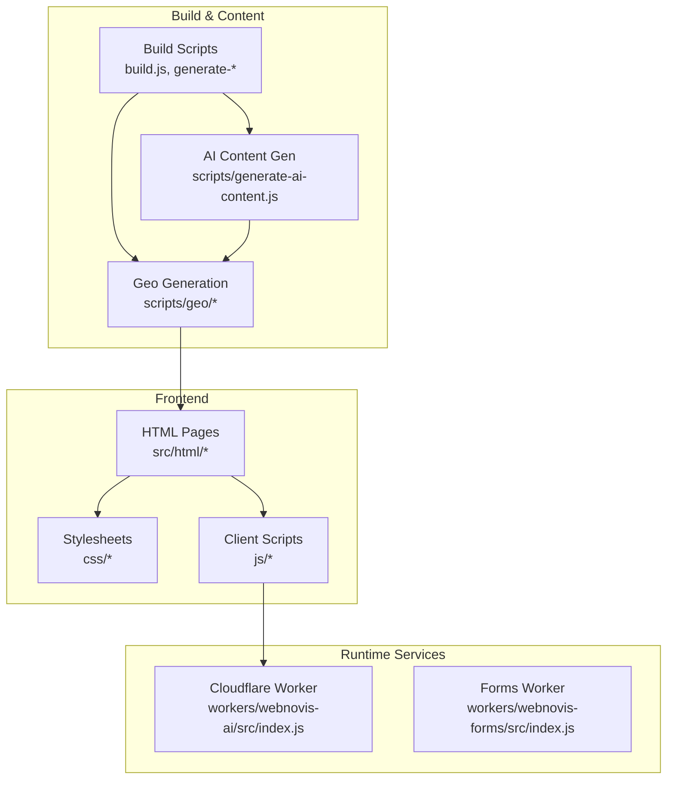
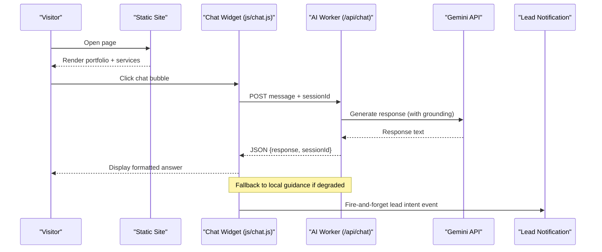
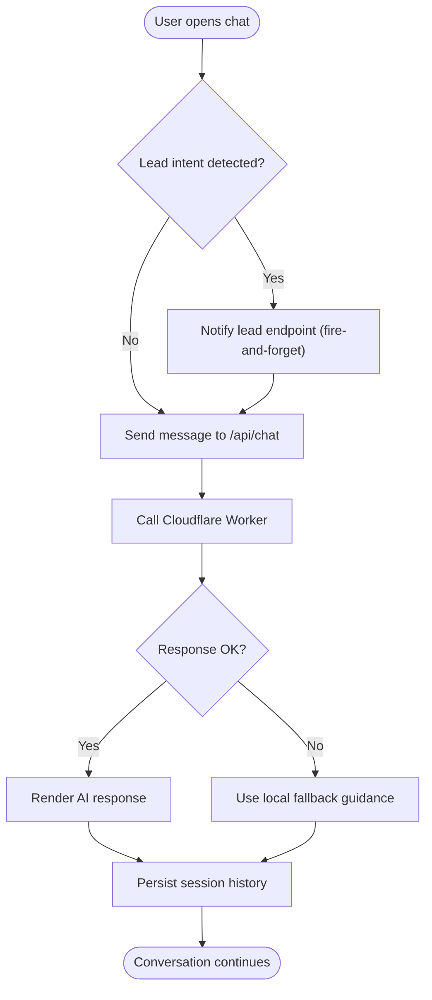
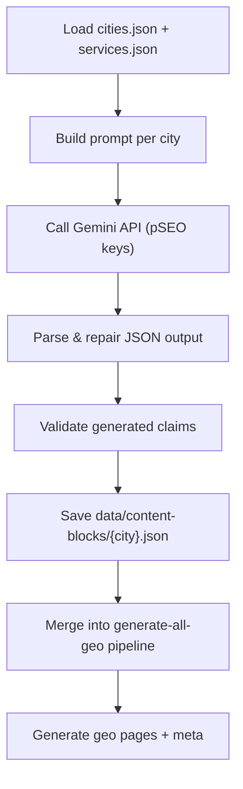
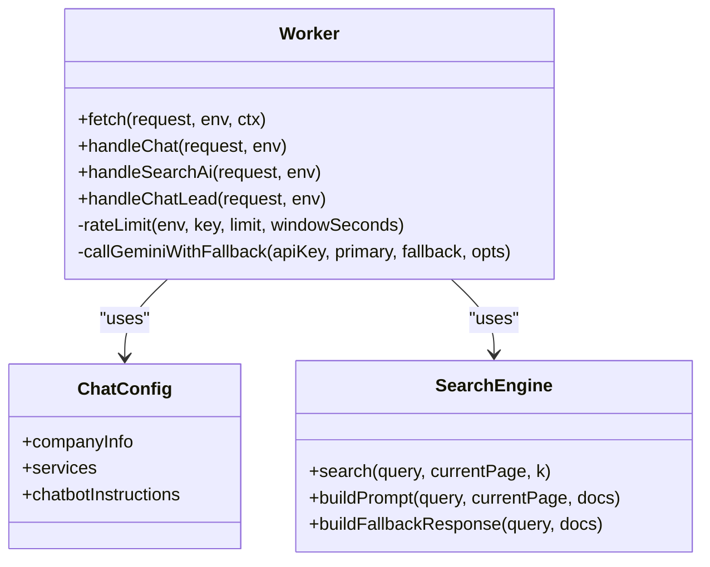
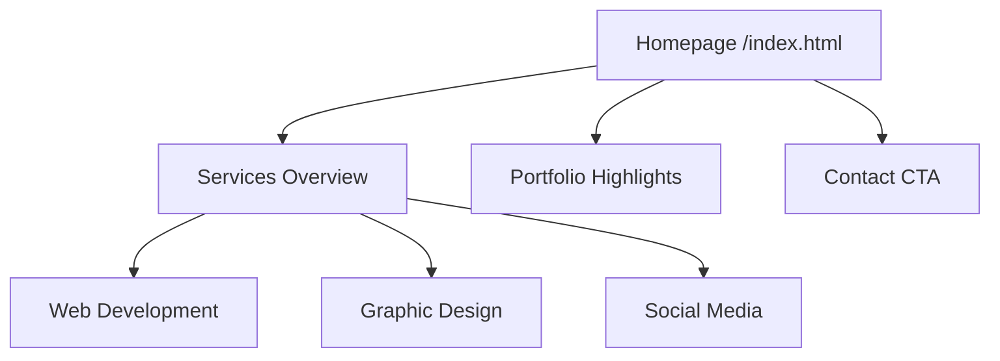
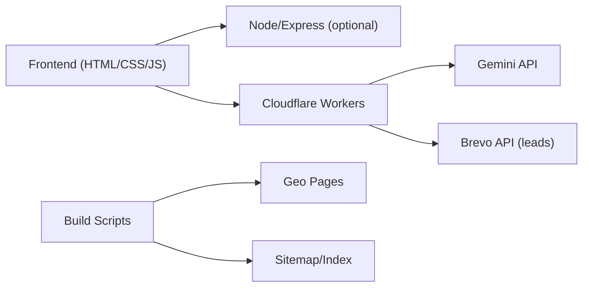

# Introduction & Purpose

<cite>
**Referenced Files in This Document**
- [README.md](file://README.md)
- [package.json](file://package.json)
- [src/html/index.html](file://src/html/index.html)
- [js/chat.js](file://js/chat.js)
- [workers/webnovis-ai/src/index.js](file://workers/webnovis-ai/src/index.js)
- [chat-config.json](file://chat-config.json)
- [scripts/generate-ai-content.js](file://scripts/generate-ai-content.js)
- [data/services.json](file://data/services.json)
</cite>

## Table of Contents
1. [Introduction](#introduction)
2. [Project Structure](#project-structure)
3. [Core Components](#core-components)
4. [Architecture Overview](#architecture-overview)
5. [Detailed Component Analysis](#detailed-component-analysis)
6. [Dependency Analysis](#dependency-analysis)
7. [Performance Considerations](#performance-considerations)
8. [Troubleshooting Guide](#troubleshooting-guide)
9. [Conclusion](#conclusion)

## Introduction
WebNovis is a professional digital agency website that showcases Web Development, Graphic Design, and Social Media Management services. It was built to serve as a modern, high-performance professional portfolio and conversion-focused platform for potential clients seeking reliable digital services, while also demonstrating the agency’s own technical capabilities to developers interested in its AI-powered features.

The project’s core value proposition combines cutting-edge web design with intelligent automation: an integrated chatbot assistant (Weby) powered by AI, plus geo-targeted content generation that produces localized market insights and FAQs per city. This approach addresses real business needs for web agencies looking to establish their online presence with technology that both engages visitors and scales personalized content efficiently.

Key audience segments:
- Potential clients: businesses and professionals in need of web development, graphic design, branding, and social media management.
- Developers and tech-savvy users: those interested in exploring the AI-powered chatbot, Cloudflare Workers integration, and automated geo-content pipelines.

Why it was built:
- To present a credible, modern professional portfolio that converts visitors into leads.
- To demonstrate how AI can enhance user experience and operational efficiency without compromising performance or accessibility.
- To provide scalable, localized content that improves relevance and SEO across multiple cities and service areas.

[No sources needed since this section provides general context]

## Project Structure
At a high level, the site is a static-first front-end enhanced by lightweight JavaScript, with optional backend features via Node.js and serverless workers for AI and form handling. The build system generates search indexes, sitemaps, and geo-specific pages, while CI/CD pipelines ensure quality and performance.

**Diagram sources**
- [src/html/index.html](file://src/html/index.html)
- [js/chat.js](file://js/chat.js)
- [workers/webnovis-ai/src/index.js](file://workers/webnovis-ai/src/index.js)
- [scripts/generate-ai-content.js](file://scripts/generate-ai-content.js)

**Section sources**
- [README.md](file://README.md)
- [package.json](file://package.json)

## Core Components
- Professional Portfolio and Service Pages: Clean, responsive layouts showcasing Web Development, Graphic Design, and Social Media Management with clear CTAs and structured data.
- AI-Powered Chatbot (Weby): A mobile-optimized chat widget with session persistence, lead intent detection, graceful fallbacks, and transparent AI disclosure.
- Geo-Targeted Content Generation: Automated scripts that produce unique local market descriptions and FAQs per city using AI, merged into the build pipeline for scalable localization.
- Serverless AI API: Cloudflare Worker endpoints for chat, search-augmented responses, health checks, and lead notifications, with rate limiting and CORS controls.

These components together deliver a modern, intelligent, and conversion-oriented digital agency website.

**Section sources**
- [src/html/index.html](file://src/html/index.html)
- [js/chat.js](file://js/chat.js)
- [workers/webnovis-ai/src/index.js](file://workers/webnovis-ai/src/index.js)
- [scripts/generate-ai-content.js](file://scripts/generate-ai-content.js)
- [data/services.json](file://data/services.json)

## Architecture Overview
The architecture emphasizes fast static delivery with intelligent runtime augmentation:
- Static HTML/CSS/JS for core pages and portfolio.
- Client-side chat widget communicates with a Cloudflare Worker for AI responses and lead capture.
- Build-time scripts generate geo-localized content and indexes, ensuring scalability and consistency.

**Diagram sources**
- [js/chat.js](file://js/chat.js)
- [workers/webnovis-ai/src/index.js](file://workers/webnovis-ai/src/index.js)

**Section sources**
- [README.md](file://README.md)
- [package.json](file://package.json)

## Detailed Component Analysis

### AI-Powered Chatbot (Weby)
The chatbot integrates directly into the site UI, providing instant assistance about services, pricing, timelines, and contact options. It detects lead intents, persists sessions locally, and gracefully falls back to curated offline guidance when the AI endpoint is unavailable. It also includes transparency notices aligned with AI regulations.

**Diagram sources**
- [js/chat.js](file://js/chat.js)
- [workers/webnovis-ai/src/index.js](file://workers/webnovis-ai/src/index.js)

**Section sources**
- [js/chat.js](file://js/chat.js)
- [workers/webnovis-ai/src/index.js](file://workers/webnovis-ai/src/index.js)
- [chat-config.json](file://chat-config.json)

### Geo-Targeted Content Generation
The geo content generator creates unique, localized market analyses and FAQs per city using AI prompts grounded in repository data. Outputs are saved as JSON and merged into the build pipeline to produce location-specific pages and metadata, improving local SEO and relevance.

**Diagram sources**
- [scripts/generate-ai-content.js](file://scripts/generate-ai-content.js)
- [data/services.json](file://data/services.json)

**Section sources**
- [scripts/generate-ai-content.js](file://scripts/generate-ai-content.js)
- [data/services.json](file://data/services.json)

### Cloudflare Worker AI API
The worker exposes endpoints for chat, search-augmented answers, health checks, and lead notifications. It enforces rate limits, CORS policies, prompt injection safeguards, and session storage. It calls Gemini models with primary/fallback strategies and caches results where possible.

**Diagram sources**
- [workers/webnovis-ai/src/index.js](file://workers/webnovis-ai/src/index.js)
- [chat-config.json](file://chat-config.json)

**Section sources**
- [workers/webnovis-ai/src/index.js](file://workers/webnovis-ai/src/index.js)
- [chat-config.json](file://chat-config.json)

### Professional Portfolio and Services
The site presents a clean, responsive portfolio and service pages highlighting Web Development, Graphic Design, and Social Media Management. Structured data and performance optimizations support discoverability and user experience.

**Diagram sources**
- [src/html/index.html](file://src/html/index.html)
- [data/services.json](file://data/services.json)

**Section sources**
- [src/html/index.html](file://src/html/index.html)
- [data/services.json](file://data/services.json)

## Dependency Analysis
- Frontend dependencies are minimal: vanilla JS, CSS Grid/Flexbox, and lightweight libraries for animations and performance monitoring.
- Backend/runtime dependencies include Express (optional), Cloudflare Workers for AI and forms, and external APIs (Gemini, Brevo).
- Build tools handle asset optimization, sitemap generation, geo content creation, and validation.

**Diagram sources**
- [package.json](file://package.json)
- [workers/webnovis-ai/src/index.js](file://workers/webnovis-ai/src/index.js)

**Section sources**
- [package.json](file://package.json)
- [README.md](file://README.md)

## Performance Considerations
- Static-first delivery ensures fast initial load; deferred scripts avoid render-blocking.
- Non-critical CSS loaded asynchronously; resource hints and preloading optimize critical assets.
- Chat widget uses adaptive typing delays and retry logic to balance UX and reliability.
- Geo content generation runs at build time, avoiding runtime overhead.

[No sources needed since this section provides general guidance]

## Troubleshooting Guide
- Chatbot not responding: verify client script loading, check browser console, confirm worker health endpoint availability.
- Animations not working: ensure main JS is loaded and compatible with the browser; disable interfering extensions.
- Mobile layout issues: validate viewport meta tag and media queries; test on real devices.
- Geo content missing: ensure .env has pSEO keys configured and run the geo generation script.

**Section sources**
- [README.md](file://README.md)
- [js/chat.js](file://js/chat.js)

## Conclusion
WebNovis is a professional digital agency website designed to showcase Web Development, Graphic Design, and Social Media Management services through a modern, high-performance interface. Its AI-powered chatbot and geo-targeted content generation provide intelligent automation and localized relevance, addressing real business needs for agencies establishing a strong online presence. By combining cutting-edge technology with accessible design, the site serves both prospective clients and developers interested in advanced, scalable digital solutions.

[No sources needed since this section summarizes without analyzing specific files]