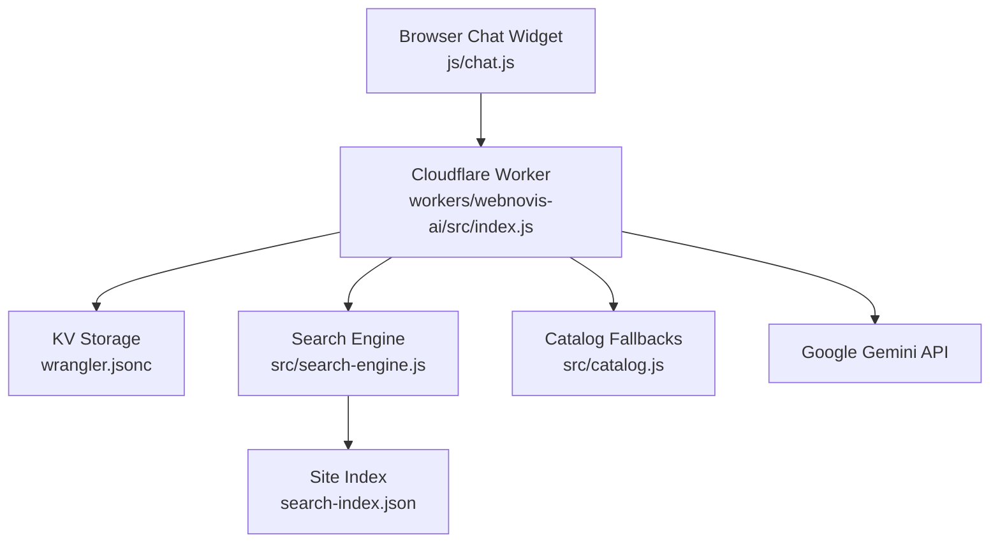
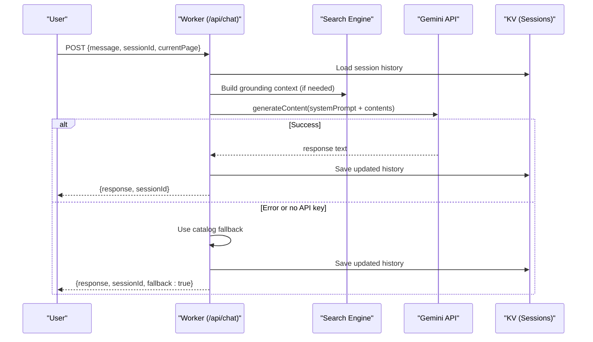
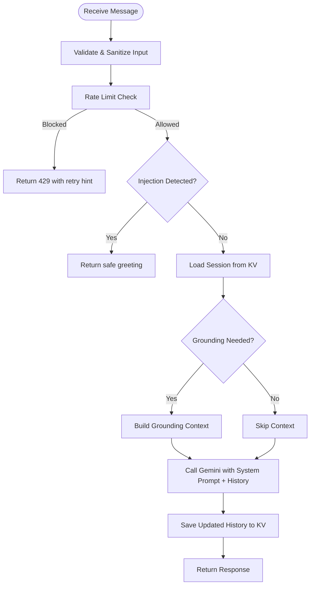
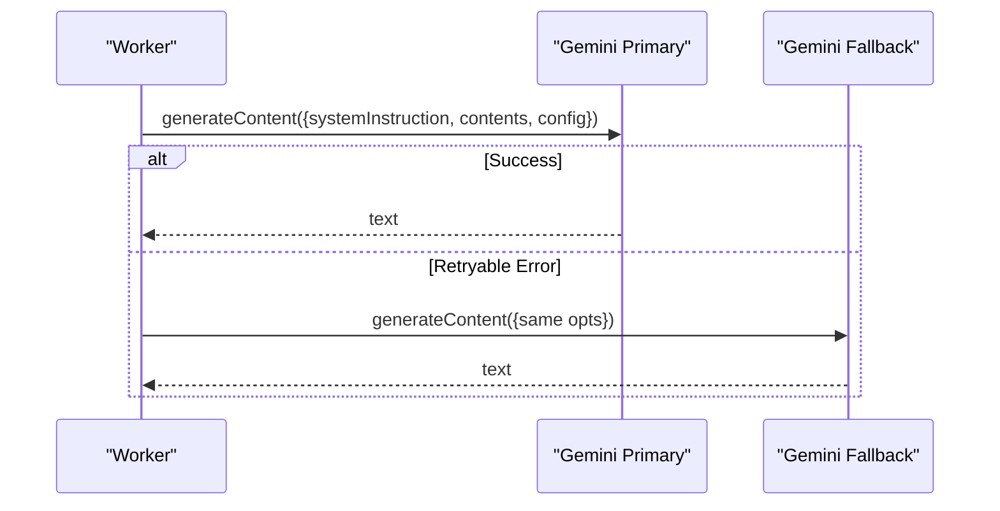
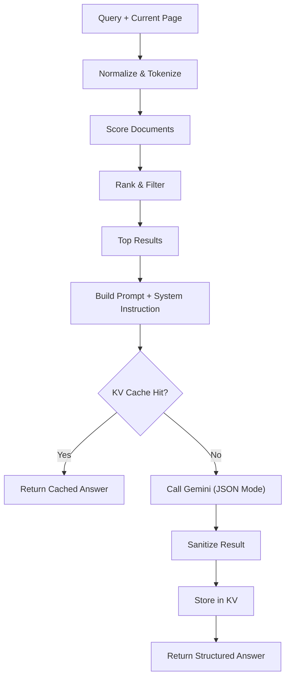
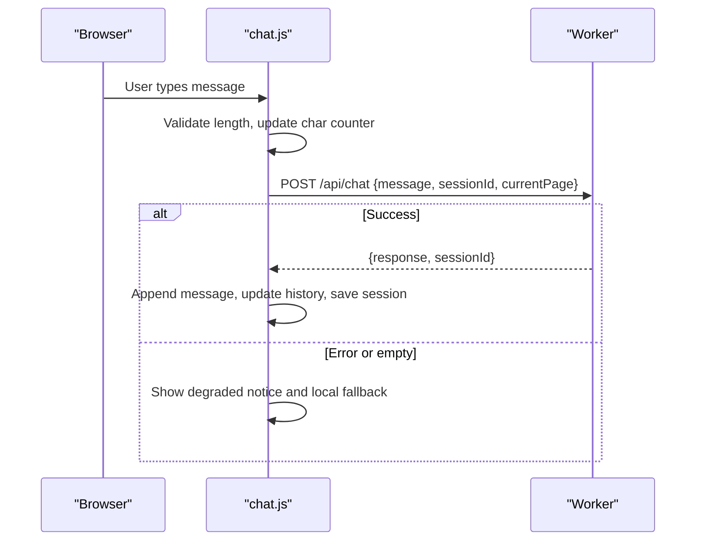
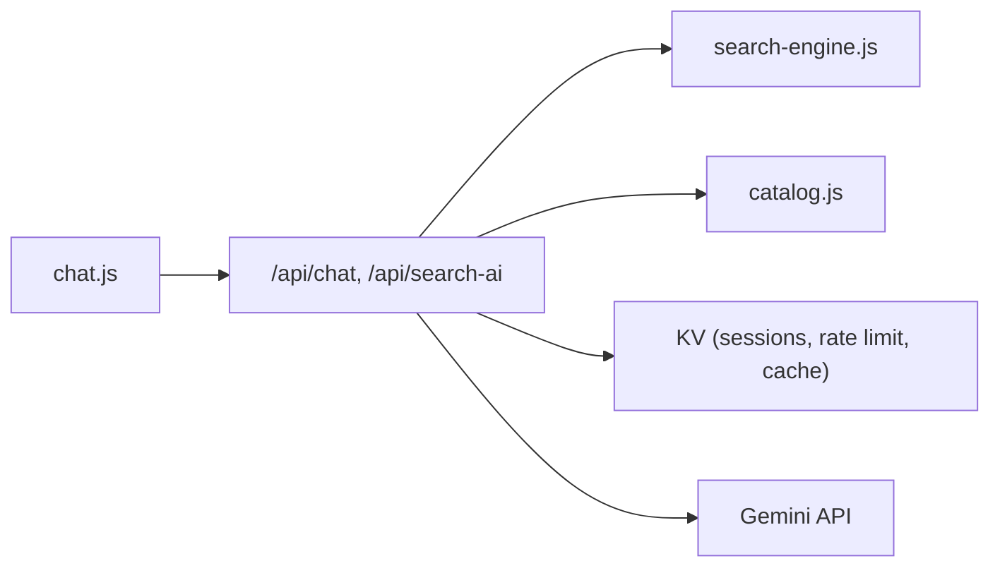

# AI-Powered Chatbot System

<cite>
**Referenced Files in This Document**
- [index.js](file://workers/webnovis-ai/src/index.js)
- [search-engine.js](file://workers/webnovis-ai/src/search-engine.js)
- [catalog.js](file://workers/webnovis-ai/src/catalog.js)
- [chat-config.json](file://workers/webnovis-ai/data/chat-config.json)
- [wrangler.jsonc](file://workers/webnovis-ai/wrangler.jsonc)
- [chat.js](file://js/chat.js)
- [README-CHAT.md](file://docs/chatbot/README-CHAT.md)
- [QUICK-START.md](file://docs/chatbot/QUICK-START.md)
- [MODELLI-AI.md](file://docs/chatbot/MODELLI-AI.md)
- [search-index.json](file://search-index.json)
</cite>

## Table of Contents
1. [Introduction](#introduction)
2. [Project Structure](#project-structure)
3. [Core Components](#core-components)
4. [Architecture Overview](#architecture-overview)
5. [Detailed Component Analysis](#detailed-component-analysis)
6. [Dependency Analysis](#dependency-analysis)
7. [Performance Considerations](#performance-considerations)
8. [Troubleshooting Guide](#troubleshooting-guide)
9. [Conclusion](#conclusion)
10. [Appendices](#appendices)

## Introduction
This document explains the AI-powered chatbot system that powers “Weby,” a conversational assistant for WebNovis. It covers conversation flow, context memory management, Google Gemini API integration, the chat interface implementation, message handling and fallbacks, configuration options for personality and safety, knowledge base usage, performance considerations (including caching and quotas), worker deployment architecture, and real-time communication patterns.

The system is composed of:
- A Cloudflare Worker backend exposing REST endpoints for chat, search, health, and lead capture.
- A browser-based chat widget that manages UI state, session persistence, retries, and adaptive typing.
- A search engine module that ranks site content to ground responses and build structured answers.
- Configuration files that define company info, services/pricing, and detailed bot instructions.

## Project Structure
At a high level:
- Backend: Cloudflare Worker under workers/webnovis-ai with routing, rate limiting, KV-backed sessions, Gemini calls, and search grounding.
- Frontend: js/chat.js provides the chat widget, local fallbacks, and retry logic.
- Data: chat-config.json defines persona, services, pricing, and safety rules; search-index.json feeds the search engine.
- Docs: docs/chatbot/* provide setup and model guidance.

**Diagram sources**
- [index.js:1-544](file://workers/webnovis-ai/src/index.js#L1-L544)
- [search-engine.js:1-379](file://workers/webnovis-ai/src/search-engine.js#L1-L379)
- [catalog.js:1-134](file://workers/webnovis-ai/src/catalog.js#L1-L134)
- [wrangler.jsonc:1-26](file://workers/webnovis-ai/wrangler.jsonc#L1-L26)
- [chat.js:1-797](file://js/chat.js#L1-L797)
- [search-index.json](file://search-index.json)

**Section sources**
- [index.js:1-544](file://workers/webnovis-ai/src/index.js#L1-L544)
- [chat.js:1-797](file://js/chat.js#L1-L797)
- [wrangler.jsonc:1-26](file://workers/webnovis-ai/wrangler.jsonc#L1-L26)

## Core Components
- Worker entrypoint and routing: handles /api/health, /api/chat, /api/search-ai, /api/chat-lead, CORS, rate limiting, and error responses.
- Session and memory: per-session history stored in KV with TTL and message limits.
- Gemini integration: primary/fallback models, timeouts, JSON mode for search, and safe text cleaning.
- Search engine: token-based ranking, intent inference, prompt building, result sanitization, and KV caching.
- Catalog fallbacks: deterministic responses when API keys are missing or errors occur.
- Chat widget: UI, retries, adaptive typing, localStorage persistence, lead detection, and offline status indication.

**Section sources**
- [index.js:12-25](file://workers/webnovis-ai/src/index.js#L12-L25)
- [index.js:178-196](file://workers/webnovis-ai/src/index.js#L178-L196)
- [index.js:198-247](file://workers/webnovis-ai/src/index.js#L198-L247)
- [search-engine.js:56-65](file://workers/webnovis-ai/src/search-engine.js#L56-L65)
- [catalog.js:57-133](file://workers/webnovis-ai/src/catalog.js#L57-L133)
- [chat.js:8-21](file://js/chat.js#L8-L21)
- [chat.js:430-498](file://js/chat.js#L430-L498)

## Architecture Overview
The chat flow uses a layered approach:
- The client sends messages to the Worker.
- The Worker validates input, applies rate limits, detects injection attempts, loads session history, optionally grounds the query using the search engine, and calls Gemini with a system prompt built from chat-config.json.
- On failure or missing API key, it falls back to catalog-based deterministic replies.
- The search endpoint builds a grounded answer with suggested pages and related queries, cached in KV.

**Diagram sources**
- [index.js:266-368](file://workers/webnovis-ai/src/index.js#L266-L368)
- [index.js:370-440](file://workers/webnovis-ai/src/index.js#L370-L440)
- [search-engine.js:188-219](file://workers/webnovis-ai/src/search-engine.js#L188-L219)

**Section sources**
- [index.js:266-368](file://workers/webnovis-ai/src/index.js#L266-L368)
- [index.js:370-440](file://workers/webnovis-ai/src/index.js#L370-L440)

## Detailed Component Analysis

### Conversation Flow and Context Memory
- Input validation and sanitization ensure safe messages and prevent XSS.
- Rate limiting protects against abuse using KV buckets per IP and time window.
- Prompt injection detection blocks known attack patterns and returns a safe greeting.
- Session memory:
  - Each session has an ID and a trimmed history list.
  - History is persisted to KV with TTL and limited to a maximum number of messages.
  - The client also persists recent history in localStorage for UX continuity.

**Diagram sources**
- [index.js:141-151](file://workers/webnovis-ai/src/index.js#L141-L151)
- [index.js:178-196](file://workers/webnovis-ai/src/index.js#L178-L196)
- [index.js:266-368](file://workers/webnovis-ai/src/index.js#L266-L368)

**Section sources**
- [index.js:141-151](file://workers/webnovis-ai/src/index.js#L141-L151)
- [index.js:178-196](file://workers/webnovis-ai/src/index.js#L178-L196)
- [index.js:266-368](file://workers/webnovis-ai/src/index.js#L266-L368)

### Google Gemini API Integration
- Models:
  - Chat primary: gemini-2.5-flash-lite; fallback: gemini-2.5-flash.
  - Search primary: gemini-2.5-flash-lite; fallback: gemini-2.5-flash.
- Parameters:
  - Temperature and max tokens tuned per use case (e.g., lower temperature for search).
  - JSON mode enabled for search to enforce structured output.
- Resilience:
  - Timeout protection via AbortController.
  - Retryable error detection (rate limits, server errors) triggers fallback model.
  - Text cleaning removes markdown artifacts for consistent rendering.

**Diagram sources**
- [index.js:12-17](file://workers/webnovis-ai/src/index.js#L12-L17)
- [index.js:198-247](file://workers/webnovis-ai/src/index.js#L198-L247)

**Section sources**
- [index.js:12-17](file://workers/webnovis-ai/src/index.js#L12-L17)
- [index.js:198-247](file://workers/webnovis-ai/src/index.js#L198-L247)
- [MODELLI-AI.md:1-54](file://docs/chatbot/MODELLI-AI.md#L1-L54)

### Search Engine and Knowledge Base
- Index preparation:
  - Normalizes titles, descriptions, content, headings, keywords, and URLs.
  - Builds token sets per field for efficient scoring.
- Ranking:
  - Lexical matching across fields plus token presence boosts.
  - Intent inference (pricing, contact, portfolio, about, informational, local, commercial) adjusts weights.
  - Commercial and conversion-oriented pages get targeted boosts.
- Prompt building:
  - Constructs a system instruction and user prompt with retrieved documents.
  - Enforces JSON-only output for search results.
- Caching:
  - KV cache keyed by normalized query and current page reduces repeated LLM calls.
- Safety:
  - Result sanitization restricts suggested pages to allowed URLs and normalizes them.

**Diagram sources**
- [search-engine.js:72-105](file://workers/webnovis-ai/src/search-engine.js#L72-L105)
- [search-engine.js:107-157](file://workers/webnovis-ai/src/search-engine.js#L107-L157)
- [search-engine.js:188-219](file://workers/webnovis-ai/src/search-engine.js#L188-L219)
- [search-engine.js:221-260](file://workers/webnovis-ai/src/search-engine.js#L221-L260)
- [search-engine.js:312-349](file://workers/webnovis-ai/src/search-engine.js#L312-L349)

**Section sources**
- [search-engine.js:1-379](file://workers/webnovis-ai/src/search-engine.js#L1-L379)
- [index.js:370-440](file://workers/webnovis-ai/src/index.js#L370-L440)

### Chat Interface Implementation
- Endpoints:
  - Uses a configurable API endpoint for chat and health checks.
  - Sends message, sessionId, and currentPage to the Worker.
- UI behavior:
  - Adaptive typing delay proportional to response length.
  - Character counter with accessibility attributes.
  - Mobile keyboard handling and scroll locking.
  - Quick replies and inline link/email formatting.
- Reliability:
  - Retry logic with exponential backoff.
  - Local fallback if API fails or returns empty responses.
  - Degraded mode indicator informs users when offline guidance is used.
- Persistence:
  - LocalStorage stores recent history and sessionId for up to 30 minutes.
  - Server-side session history stored in KV for cross-tab/session continuity.

**Diagram sources**
- [chat.js:8-21](file://js/chat.js#L8-L21)
- [chat.js:430-498](file://js/chat.js#L430-L498)
- [chat.js:533-580](file://js/chat.js#L533-L580)
- [chat.js:605-644](file://js/chat.js#L605-L644)

**Section sources**
- [chat.js:1-797](file://js/chat.js#L1-L797)

### Configuration Options: Personality, Response Length, Safety Filters
- Personality and tone:
  - Defined in chat-config.json under chatbotInstructions. Controls identity, style, objection handling, and call-to-action behavior.
- Services and pricing:
  - services object defines offerings and starting prices used by both the system prompt and fallbacks.
- Safety filters:
  - Injection pattern detection prevents prompt injection and role-play overrides.
  - Strict scope enforcement ensures only WebNovis services are discussed.
- Response length:
  - maxOutputTokens controls Gemini output size.
  - Client enforces maxMessageLength and truncates oversized inputs.
- Environment variables:
  - GEMINI_API_KEY_CHAT and GEMINI_API_KEY_SEARCH control API access.
  - CORS_ORIGINS allows custom origins.
  - SESSIONS KV namespace enables sessions, rate limiting, and search caching.

**Section sources**
- [chat-config.json:1-109](file://workers/webnovis-ai/data/chat-config.json#L1-L109)
- [index.js:12-25](file://workers/webnovis-ai/src/index.js#L12-L25)
- [index.js:35-69](file://workers/webnovis-ai/src/index.js#L35-L69)
- [index.js:198-247](file://workers/webnovis-ai/src/index.js#L198-L247)
- [chat.js:8-21](file://js/chat.js#L8-L21)
- [wrangler.jsonc:15-25](file://workers/webnovis-ai/wrangler.jsonc#L15-L25)

### Customizing Bot Behavior, Adding Knowledge Bases, Implementing Flows
- Customize personality:
  - Edit chatbotInstructions in chat-config.json to adjust tone, safety boundaries, and CTAs.
- Add knowledge bases:
  - Update search-index.json with new pages, headings, descriptions, and keywords.
  - The search engine will automatically incorporate new content into ranking and prompts.
- Implement conversation flows:
  - Use quick replies in the UI to guide users through common paths.
  - Leverage lead intent detection to trigger follow-up actions (e.g., notify backend for CRM integration).
  - Extend catalog.js with additional deterministic responses for specific intents.

**Section sources**
- [chat-config.json:1-109](file://workers/webnovis-ai/data/chat-config.json#L1-L109)
- [search-index.json](file://search-index.json)
- [catalog.js:57-133](file://workers/webnovis-ai/src/catalog.js#L57-L133)
- [chat.js:230-243](file://js/chat.js#L230-L243)
- [chat.js:582-601](file://js/chat.js#L582-L601)

## Dependency Analysis
- Worker depends on:
  - search-engine.js for indexing and prompting.
  - catalog.js for deterministic fallbacks.
  - KV storage for sessions, rate limits, and search cache.
  - Gemini API for generative responses.
- Frontend depends on:
  - Worker endpoints for chat and health.
  - LocalStorage for session persistence.
  - Optional lead notification endpoint.

**Diagram sources**
- [index.js:508-543](file://workers/webnovis-ai/src/index.js#L508-L543)
- [search-engine.js:188-219](file://workers/webnovis-ai/src/search-engine.js#L188-L219)
- [catalog.js:57-133](file://workers/webnovis-ai/src/catalog.js#L57-L133)
- [chat.js:430-498](file://js/chat.js#L430-L498)

**Section sources**
- [index.js:508-543](file://workers/webnovis-ai/src/index.js#L508-L543)
- [chat.js:430-498](file://js/chat.js#L430-L498)

## Performance Considerations
- Caching:
  - Search results cached in KV with short TTL to reduce LLM calls.
  - System prompt prebuilt and reused per request.
- Quota management:
  - Separate API keys for chat and search to distribute free-tier usage.
  - Rate limiting per IP with KV buckets prevents bursts.
- Token efficiency:
  - Max tokens capped for chat and search.
  - History trimmed to avoid excessive context.
- Network resilience:
  - Timeouts and retries on the client side.
  - Fallback model on the server side for transient errors.
- Observability:
  - Worker observability enabled for sampling and diagnostics.

**Section sources**
- [index.js:19-24](file://workers/webnovis-ai/src/index.js#L19-L24)
- [index.js:198-247](file://workers/webnovis-ai/src/index.js#L198-L247)
- [index.js:397-435](file://workers/webnovis-ai/src/index.js#L397-L435)
- [wrangler.jsonc:11-14](file://workers/webnovis-ai/wrangler.jsonc#L11-L14)
- [MODELLI-AI.md:1-54](file://docs/chatbot/MODELLI-AI.md#L1-L54)

## Troubleshooting Guide
- No response or generic fallback:
  - Verify GEMINI_API_KEY_CHAT and GEMINI_API_KEY_SEARCH are set.
  - Check KV binding name SESSIONS in wrangler.jsonc.
  - Inspect console for network errors and ensure CORS allows your origin.
- Too many requests:
  - Rate limiting may be active; wait for the retry window indicated in the response.
- Injection attempts blocked:
  - Messages matching injection patterns return a safe greeting; rephrase without override commands.
- Search not returning suggestions:
  - Ensure search-index.json includes relevant pages and metadata.
  - Confirm query length and normalization; very short or noisy queries may not match.
- Offline mode:
  - If the API is unreachable, the widget shows a degraded notice and uses local fallbacks.

**Section sources**
- [index.js:141-151](file://workers/webnovis-ai/src/index.js#L141-L151)
- [index.js:284-286](file://workers/webnovis-ai/src/index.js#L284-L286)
- [index.js:370-440](file://workers/webnovis-ai/src/index.js#L370-L440)
- [chat.js:504-531](file://js/chat.js#L504-L531)
- [wrangler.jsonc:19-25](file://workers/webnovis-ai/wrangler.jsonc#L19-L25)

## Conclusion
The Weby chatbot combines a robust Cloudflare Worker backend with a responsive browser widget to deliver reliable, grounded, and safe AI-powered conversations. It integrates Google Gemini with resilient fallbacks, leverages a token-based search engine to keep responses relevant to the site’s content, and offers extensive configuration for personality, safety, and performance. With KV-backed sessions, caching, and rate limiting, it scales efficiently while protecting API quotas. The modular design makes it straightforward to customize behavior, expand knowledge bases, and integrate with external systems like email or CRM.

## Appendices

### Worker Deployment and Real-Time Communication Patterns
- Deployment:
  - The worker is configured via wrangler.jsonc with main entry point, compatibility flags, and KV namespaces.
  - Observability is enabled for production monitoring.
- Real-time aspects:
  - Communication is request/response over HTTPS; there is no persistent WebSocket connection.
  - The frontend simulates real-time experience with typing indicators and adaptive delays.
  - Health checks can warm the worker and detect availability.

**Section sources**
- [wrangler.jsonc:1-26](file://workers/webnovis-ai/wrangler.jsonc#L1-L26)
- [chat.js:70-104](file://js/chat.js#L70-L104)
- [chat.js:533-580](file://js/chat.js#L533-L580)

### Setup and Usage References
- Quick start and configuration steps are documented for local development and production deployment.
- Model selection and cost guidance are provided for optimizing usage.

**Section sources**
- [QUICK-START.md:1-80](file://docs/chatbot/QUICK-START.md#L1-L80)
- [README-CHAT.md:1-176](file://docs/chatbot/README-CHAT.md#L1-L176)
- [MODELLI-AI.md:1-54](file://docs/chatbot/MODELLI-AI.md#L1-L54)