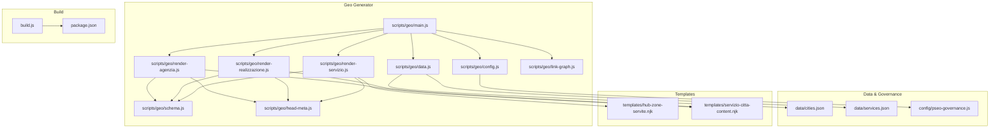
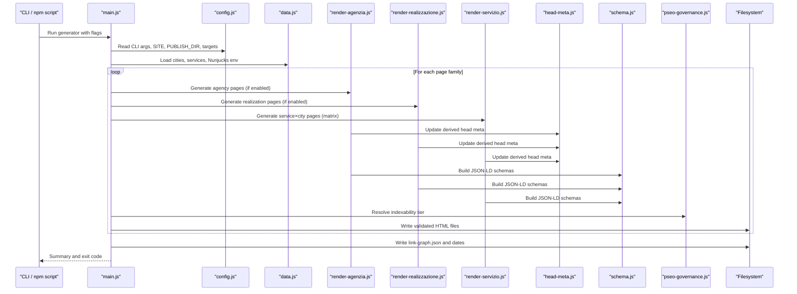
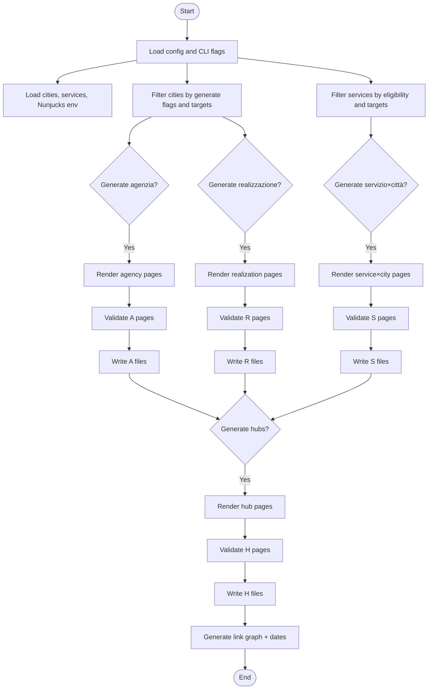
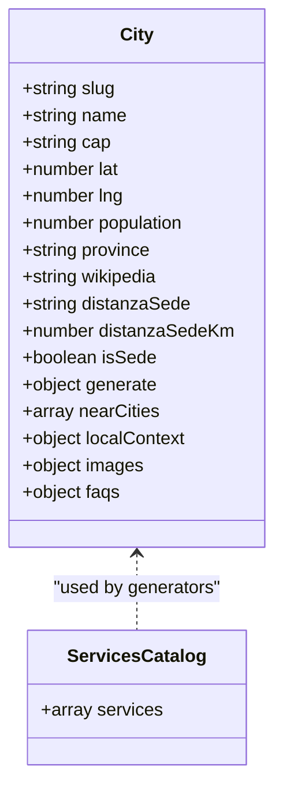
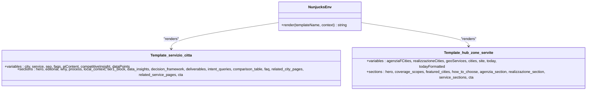
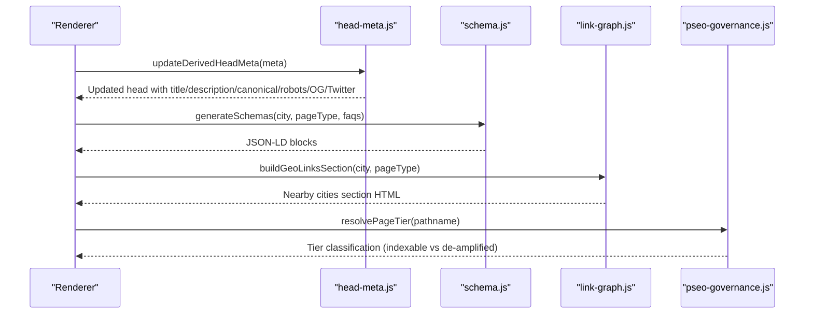
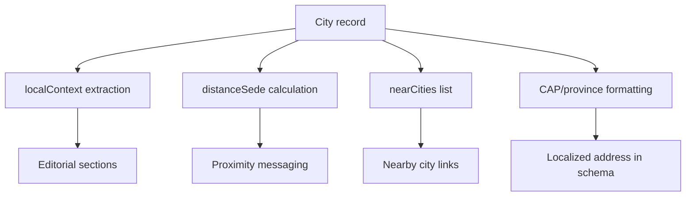
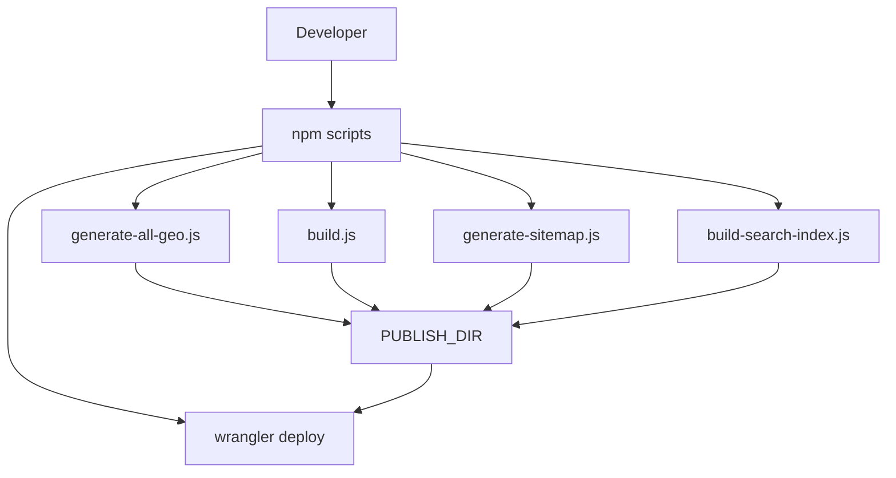
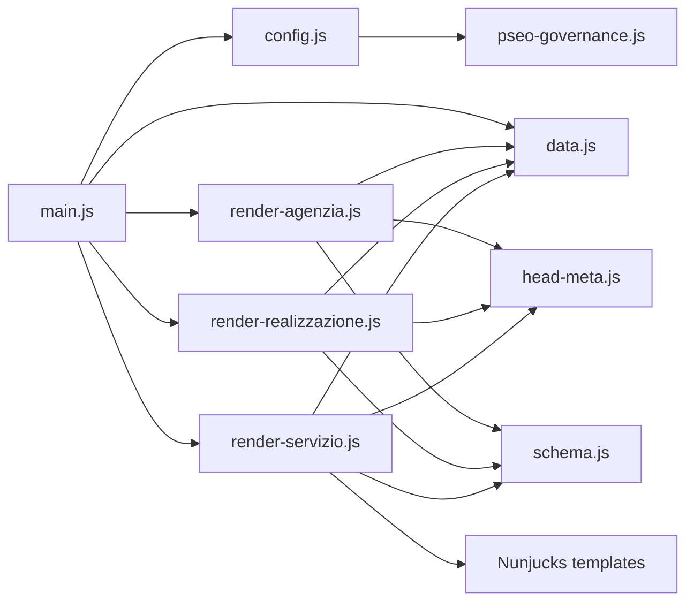

# Geo-Targeted Content Generation

<cite>
**Referenced Files in This Document**
- [scripts/geo/main.js](file://scripts/geo/main.js)
- [scripts/geo/config.js](file://scripts/geo/config.js)
- [scripts/geo/data.js](file://scripts/geo/data.js)
- [scripts/geo/render-agenzia.js](file://scripts/geo/render-agenzia.js)
- [scripts/geo/render-realizzazione.js](file://scripts/geo/render-realizzazione.js)
- [scripts/geo/render-servizio.js](file://scripts/geo/render-servizio.js)
- [scripts/geo/schema.js](file://scripts/geo/schema.js)
- [scripts/geo/head-meta.js](file://scripts/geo/head-meta.js)
- [scripts/geo/link-graph.js](file://scripts/geo/link-graph.js)
- [config/pseo-governance.js](file://config/pseo-governance.js)
- [data/cities.json](file://data/cities.json)
- [data/services.json](file://data/services.json)
- [templates/hub-zone-servite.njk](file://templates/hub-zone-servite.njk)
- [templates/servizio-citta-content.njk](file://templates/servizio-citta-content.njk)
- [build.js](file://build.js)
- [package.json](file://package.json)
</cite>

## Table of Contents
1. [Introduction](#introduction)
2. [Project Structure](#project-structure)
3. [Core Components](#core-components)
4. [Architecture Overview](#architecture-overview)
5. [Detailed Component Analysis](#detailed-component-analysis)
6. [Dependency Analysis](#dependency-analysis)
7. [Performance Considerations](#performance-considerations)
8. [Troubleshooting Guide](#troubleshooting-guide)
9. [Conclusion](#conclusion)
10. [Appendices](#appendices)

## Introduction
This document explains the geo-targeted content generation system that automatically creates localized landing pages for cities and services, manages city data, and renders templates with SEO optimization. It covers automated page creation, city data management, template rendering, schema markup, meta tag generation, internal linking strategies, content personalization by location, service availability mapping, localized business information, examples for adding new cities and customizing templates, and build pipeline integration for deployment.

## Project Structure
The system is implemented as a Node.js-based generator orchestrated by scripts under scripts/geo, with configuration and governance modules, JSON data sources, Nunjucks templates, and a general build pipeline.

**Diagram sources**
- [scripts/geo/main.js:1-292](file://scripts/geo/main.js#L1-L292)
- [scripts/geo/config.js:1-114](file://scripts/geo/config.js#L1-L114)
- [scripts/geo/data.js:1-197](file://scripts/geo/data.js#L1-L197)
- [scripts/geo/render-agenzia.js:1-194](file://scripts/geo/render-agenzia.js#L1-L194)
- [scripts/geo/render-realizzazione.js:1-241](file://scripts/geo/render-realizzazione.js#L1-L241)
- [scripts/geo/render-servizio.js:1-289](file://scripts/geo/render-servizio.js#L1-L289)
- [scripts/geo/schema.js:1-199](file://scripts/geo/schema.js#L1-L199)
- [scripts/geo/head-meta.js:1-156](file://scripts/geo/head-meta.js#L1-L156)
- [scripts/geo/link-graph.js:1-96](file://scripts/geo/link-graph.js#L1-L96)
- [config/pseo-governance.js:1-311](file://config/pseo-governance.js#L1-L311)
- [data/cities.json:1-800](file://data/cities.json#L1-L800)
- [data/services.json:1-307](file://data/services.json#L1-L307)
- [templates/hub-zone-servite.njk:1-165](file://templates/hub-zone-servite.njk#L1-L165)
- [templates/servizio-citta-content.njk:1-374](file://templates/servizio-citta-content.njk#L1-L374)
- [build.js:1-502](file://build.js#L1-L502)
- [package.json:1-92](file://package.json#L1-L92)

**Section sources**
- [scripts/geo/main.js:1-292](file://scripts/geo/main.js#L1-L292)
- [scripts/geo/config.js:1-114](file://scripts/geo/config.js#L1-L114)
- [scripts/geo/data.js:1-197](file://scripts/geo/data.js#L1-L197)
- [config/pseo-governance.js:1-311](file://config/pseo-governance.js#L1-L311)
- [data/cities.json:1-800](file://data/cities.json#L1-L800)
- [data/services.json:1-307](file://data/services.json#L1-L307)
- [templates/hub-zone-servite.njk:1-165](file://templates/hub-zone-servite.njk#L1-L165)
- [templates/servizio-citta-content.njk:1-374](file://templates/servizio-citta-content.njk#L1-L374)
- [build.js:1-502](file://build.js#L1-L502)
- [package.json:1-92](file://package.json#L1-L92)

## Core Components
- Orchestration: The main entry point coordinates generation across three page families (agency, realization, service×city), hub pages, validation, link graph output, and date indexing.
- Configuration: Central CLI flags, site constants, indexation directives, and target filters for cities and services.
- Data layer: Loads cities and services catalogs, prepares Nunjucks environment, and exposes helpers for pricing, avatars, and blog links.
- Renderers: Dedicated generators for agency pages, realization pages, and service×city pages using Nunjucks or regex-based base template substitution.
- Schema and head meta: Generates JSON-LD schemas (WebPage, Service, FAQPage, BreadcrumbList, LocalBusiness) and rewrites meta tags, canonicals, robots, and OpenGraph/Twitter fields.
- Link graph: Builds internal link graphs and injects “nearby cities” sections to strengthen internal linking.
- Governance: Tiered allowlist controls which generated pages are indexable vs de-amplified.

**Section sources**
- [scripts/geo/main.js:1-292](file://scripts/geo/main.js#L1-L292)
- [scripts/geo/config.js:1-114](file://scripts/geo/config.js#L1-L114)
- [scripts/geo/data.js:1-197](file://scripts/geo/data.js#L1-L197)
- [scripts/geo/render-agenzia.js:1-194](file://scripts/geo/render-agenzia.js#L1-L194)
- [scripts/geo/render-realizzazione.js:1-241](file://scripts/geo/render-realizzazione.js#L1-L241)
- [scripts/geo/render-servizio.js:1-289](file://scripts/geo/render-servizio.js#L1-L289)
- [scripts/geo/schema.js:1-199](file://scripts/geo/schema.js#L1-L199)
- [scripts/geo/head-meta.js:1-156](file://scripts/geo/head-meta.js#L1-L156)
- [scripts/geo/link-graph.js:1-96](file://scripts/geo/link-graph.js#L1-L96)
- [config/pseo-governance.js:1-311](file://config/pseo-governance.js#L1-L311)

## Architecture Overview
The generator follows a clear pipeline: load configuration and data, iterate over eligible cities and services, render HTML via templates or base-page substitutions, apply SEO metadata and schema, validate outputs, write files, and produce reports.

**Diagram sources**
- [scripts/geo/main.js:1-292](file://scripts/geo/main.js#L1-L292)
- [scripts/geo/config.js:1-114](file://scripts/geo/config.js#L1-L114)
- [scripts/geo/data.js:1-197](file://scripts/geo/data.js#L1-L197)
- [scripts/geo/render-agenzia.js:1-194](file://scripts/geo/render-agenzia.js#L1-L194)
- [scripts/geo/render-realizzazione.js:1-241](file://scripts/geo/render-realizzazione.js#L1-L241)
- [scripts/geo/render-servizio.js:1-289](file://scripts/geo/render-servizio.js#L1-L289)
- [scripts/geo/head-meta.js:1-156](file://scripts/geo/head-meta.js#L1-L156)
- [scripts/geo/schema.js:1-199](file://scripts/geo/schema.js#L1-L199)
- [config/pseo-governance.js:1-311](file://config/pseo-governance.js#L1-L311)

## Detailed Component Analysis

### Automated Page Creation Pipeline
- Entry: main.js orchestrates generation based on GEN_TYPE (all, agenzia, realizzazione, servizio, hubs).
- Filtering: matchesTargetCity and matchesTargetService use CLI flags to scope runs.
- Families:
  - Agenzia: one page per city where generate.agenzia is true.
  - Realizzazione: one page per city where generate.realizzazione is true.
  - Servizio×Città: matrix of eligible services × eligible cities.
- Validation: Each page is validated; failures block the run when issues are critical.
- Output: Finalized HTML written to PUBLISH_DIR; link graph and editorial dates persisted.

**Diagram sources**
- [scripts/geo/main.js:1-292](file://scripts/geo/main.js#L1-L292)
- [scripts/geo/config.js:1-114](file://scripts/geo/config.js#L1-L114)
- [scripts/geo/data.js:1-197](file://scripts/geo/data.js#L1-L197)

**Section sources**
- [scripts/geo/main.js:1-292](file://scripts/geo/main.js#L1-L292)

### City Data Management
- Source: data/cities.json contains centralized city records including slug, name, CAP, coordinates, population, province, Wikipedia link, distance from headquarters, generate flags, nearCities, localContext (highlights, economic fabric, key sectors, digital opportunity), images, and FAQs per page type.
- Usage: data.js loads and exposes cities, builds maps, formats prices, and provides avatar paths.
- Editorial corpus: config/geo-editorial.js validates and indexes hand-crafted editorial records tied to governance tiers.

**Diagram sources**
- [data/cities.json:1-800](file://data/cities.json#L1-L800)
- [data/services.json:1-307](file://data/services.json#L1-L307)
- [scripts/geo/data.js:1-197](file://scripts/geo/data.js#L1-L197)

**Section sources**
- [data/cities.json:1-800](file://data/cities.json#L1-L800)
- [scripts/geo/data.js:1-197](file://scripts/geo/data.js#L1-L197)

### Template Rendering Engine
- Nunjucks templates:
  - servizio-citta-content.njk: Renders service×city pages with dynamic sections, AI-enriched content, data points, decision frameworks, deliverables, intent queries, comparison tables, FAQs, and related links.
  - hub-zone-servite.njk: Aggregates coverage scopes, featured cities, and service×city grids for cross-linking.
- Base-page substitution:
  - render-agenzia.js and render-realizzazione.js derive head/body/footer from base templates and inject personalized content, FAQs, and schemas.

**Diagram sources**
- [templates/servizio-citta-content.njk:1-374](file://templates/servizio-citta-content.njk#L1-L374)
- [templates/hub-zone-servite.njk:1-165](file://templates/hub-zone-servite.njk#L1-L165)
- [scripts/geo/data.js:1-197](file://scripts/geo/data.js#L1-L197)

**Section sources**
- [templates/servizio-citta-content.njk:1-374](file://templates/servizio-citta-content.njk#L1-L374)
- [templates/hub-zone-servite.njk:1-165](file://templates/hub-zone-servite.njk#L1-L165)
- [scripts/geo/render-agenzia.js:1-194](file://scripts/geo/render-agenzia.js#L1-L194)
- [scripts/geo/render-realizzazione.js:1-241](file://scripts/geo/render-realizzazione.js#L1-L241)
- [scripts/geo/render-servizio.js:1-289](file://scripts/geo/render-servizio.js#L1-L289)

### SEO Optimization Features
- Local schema markup:
  - WebPage, Service, FAQPage, BreadcrumbList, LocalBusiness entities are generated per page type.
  - Area served includes primary city plus nearCities and administrative areas.
- Meta tag generation:
  - Title, description, canonical, robots, OpenGraph, Twitter cards, keywords, hreflang updated via head-meta utilities.
- Internal linking strategies:
  - Nearby cities sections and related service pages enhance topical relevance and crawl distribution.
  - Hub pages aggregate coverage and provide structured navigation.

**Diagram sources**
- [scripts/geo/head-meta.js:1-156](file://scripts/geo/head-meta.js#L1-L156)
- [scripts/geo/schema.js:1-199](file://scripts/geo/schema.js#L1-L199)
- [scripts/geo/link-graph.js:1-96](file://scripts/geo/link-graph.js#L1-L96)
- [config/pseo-governance.js:1-311](file://config/pseo-governance.js#L1-L311)

**Section sources**
- [scripts/geo/schema.js:1-199](file://scripts/geo/schema.js#L1-L199)
- [scripts/geo/head-meta.js:1-156](file://scripts/geo/head-meta.js#L1-L156)
- [scripts/geo/link-graph.js:1-96](file://scripts/geo/link-graph.js#L1-L96)
- [config/pseo-governance.js:1-311](file://config/pseo-governance.js#L1-L311)

### Content Personalization by Geographic Location
- City-specific copy: localContext fields (highlights, economic fabric, key sectors, digital opportunity) drive unique sections.
- Distance and proximity: distanzaSede used to tailor messaging and nearby city recommendations.
- Service availability mapping: shouldGenerateGeoForService and serviceCoverageCitySlugs determine which combinations are generated.
- Localized business info: CAP, province display, and coordinates injected into content and schemas.

**Diagram sources**
- [data/cities.json:1-800](file://data/cities.json#L1-L800)
- [scripts/geo/data.js:1-197](file://scripts/geo/data.js#L1-L197)
- [scripts/geo/render-servizio.js:1-289](file://scripts/geo/render-servizio.js#L1-L289)

**Section sources**
- [data/cities.json:1-800](file://data/cities.json#L1-L800)
- [scripts/geo/data.js:1-197](file://scripts/geo/data.js#L1-L197)
- [scripts/geo/render-servizio.js:1-289](file://scripts/geo/render-servizio.js#L1-L289)

### Examples: Adding New Cities, Customizing Templates, Managing Variants
- Add a new city:
  - Insert a new object in data/cities.json with required fields (slug, name, cap, lat, lng, province, generate flags, nearCities, localContext, images, faqs).
  - Ensure generate.agenzia and/or generate.realizzazione flags are set appropriately.
  - Optionally add tier1 content overrides under data/content-blocks/tier1-<city>-<service>.json if needed.
- Customize templates:
  - Edit templates/servizio-citta-content.njk and templates/hub-zone-servite.njk to adjust sections, variables, and styling hooks.
  - For base-page substitution flows, modify render-agenzia.js and render-realizzazione.js to handle new placeholders or patterns.
- Manage content variants:
  - Use editorial records in data/geo-editorial to override titles, descriptions, h1, answer capsule, intro, sections, FAQs, and CTA per path.
  - Leverage pseo-governance tiers to control indexability and feature sets per page.

**Section sources**
- [data/cities.json:1-800](file://data/cities.json#L1-L800)
- [templates/servizio-citta-content.njk:1-374](file://templates/servizio-citta-content.njk#L1-L374)
- [templates/hub-zone-servite.njk:1-165](file://templates/hub-zone-servite.njk#L1-L165)
- [scripts/geo/render-agenzia.js:1-194](file://scripts/geo/render-agenzia.js#L1-L194)
- [scripts/geo/render-realizzazione.js:1-241](file://scripts/geo/render-realizzazione.js#L1-L241)
- [config/geo-editorial.js:1-527](file://config/geo-editorial.js#L1-L527)
- [config/pseo-governance.js:1-311](file://config/pseo-governance.js#L1-L311)

### Build Pipeline Integration and Deployment
- Scripts: package.json defines commands for building geo pages, avatars, search index, sitemap, and CI quality gates.
- Build: build.js minifies JS/CSS and optionally minifies src/html files; geo-generated pages bypass HTML minification to preserve structure.
- Deployment: Commands support dist output and Cloudflare Workers deployment; publish directory can be configured via CLI flags.

**Diagram sources**
- [package.json:1-92](file://package.json#L1-L92)
- [build.js:1-502](file://build.js#L1-L502)

**Section sources**
- [package.json:1-92](file://package.json#L1-L92)
- [build.js:1-502](file://build.js#L1-L502)

## Dependency Analysis
- Coupling:
  - main.js depends on config, data, renderers, validation, link-graph, and dates modules.
  - Renderers depend on head-meta and schema utilities, and on data for services and cities.
  - Governance module influences indexability and robots directives across all renderers.
- Cohesion:
  - Each renderer encapsulates logic for its page family, keeping concerns separated.
  - Data module centralizes loading and helpers, reducing duplication.
- External dependencies:
  - Nunjucks for templating.
  - Filesystem for reading/writing assets and reports.
  - Optional html-minifier-terser for src/html minification.

**Diagram sources**
- [scripts/geo/main.js:1-292](file://scripts/geo/main.js#L1-L292)
- [scripts/geo/config.js:1-114](file://scripts/geo/config.js#L1-L114)
- [scripts/geo/data.js:1-197](file://scripts/geo/data.js#L1-L197)
- [scripts/geo/render-agenzia.js:1-194](file://scripts/geo/render-agenzia.js#L1-L194)
- [scripts/geo/render-realizzazione.js:1-241](file://scripts/geo/render-realizzazione.js#L1-L241)
- [scripts/geo/render-servizio.js:1-289](file://scripts/geo/render-servizio.js#L1-L289)
- [scripts/geo/head-meta.js:1-156](file://scripts/geo/head-meta.js#L1-L156)
- [scripts/geo/schema.js:1-199](file://scripts/geo/schema.js#L1-L199)
- [config/pseo-governance.js:1-311](file://config/pseo-governance.js#L1-L311)

**Section sources**
- [scripts/geo/main.js:1-292](file://scripts/geo/main.js#L1-L292)
- [scripts/geo/config.js:1-114](file://scripts/geo/config.js#L1-L114)
- [scripts/geo/data.js:1-197](file://scripts/geo/data.js#L1-L197)
- [scripts/geo/render-agenzia.js:1-194](file://scripts/geo/render-agenzia.js#L1-L194)
- [scripts/geo/render-realizzazione.js:1-241](file://scripts/geo/render-realizzazione.js#L1-L241)
- [scripts/geo/render-servizio.js:1-289](file://scripts/geo/render-servizio.js#L1-L289)
- [scripts/geo/head-meta.js:1-156](file://scripts/geo/head-meta.js#L1-L156)
- [scripts/geo/schema.js:1-199](file://scripts/geo/schema.js#L1-L199)
- [config/pseo-governance.js:1-311](file://config/pseo-governance.js#L1-L311)

## Performance Considerations
- Avoid heavy DOM parsing in renderers; prefer targeted regex replacements and minimal template rendering.
- Cache approved content blocks and editorial corpora to reduce repeated file reads.
- Limit internal link sections to nearest cities to keep page size manageable.
- De-amplify non-strategic pages to reduce indexation footprint and improve crawl efficiency.
- Minimize asset sizes through build pipeline optimizations while preserving geo-generated HTML structure.

[No sources needed since this section provides general guidance]

## Troubleshooting Guide
- Common errors:
  - Missing base pages: ensure base templates exist for agenzia and realizzazione.
  - Validation failures: check critical issues flagged during validation; blocked pages will halt generation.
  - Governance mismatches: verify tier classifications and allowlists for indexability.
  - Schema inconsistencies: ensure FAQ lists match visible content and JSON-LD structures.
- Debugging steps:
  - Use --dry-run and --validate-only flags to preview outputs without writing files.
  - Inspect link-graph.json to identify broken or missing internal links.
  - Review geo-page-dates.json to confirm editorial timestamps are updated.

**Section sources**
- [scripts/geo/main.js:1-292](file://scripts/geo/main.js#L1-L292)
- [scripts/geo/config.js:1-114](file://scripts/geo/config.js#L1-L114)
- [scripts/geo/link-graph.js:1-96](file://scripts/geo/link-graph.js#L1-L96)

## Conclusion
The geo-targeted content generation system provides a robust, scalable approach to creating localized landing pages with strong SEO foundations. Through modular renderers, governed indexability, and rich data-driven personalization, it ensures high-quality, maintainable outputs aligned with strategic SEO goals. Integrating with the build pipeline enables reliable deployments and continuous improvement.

[No sources needed since this section summarizes without analyzing specific files]

## Appendices
- Best practices:
  - Keep city data consistent and complete to avoid rendering gaps.
  - Use editorial overrides judiciously to maintain uniqueness and compliance.
  - Regularly review governance tiers to align with performance signals.
- References:
  - See referenced files for detailed implementation specifics and usage patterns.

[No sources needed since this section provides general guidance]