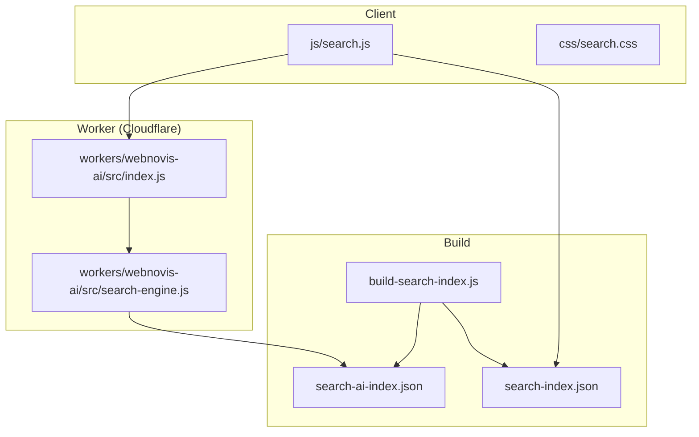
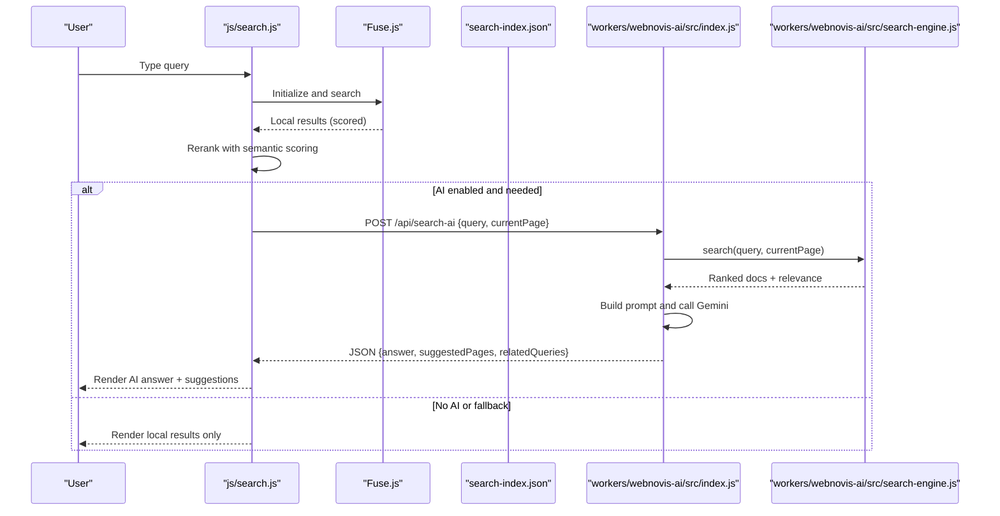
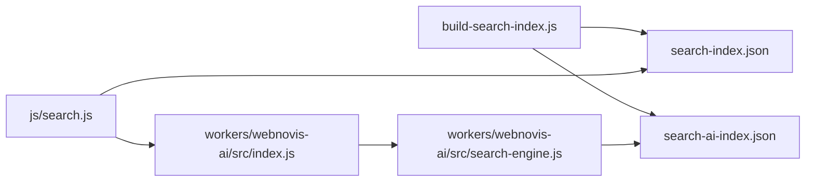

# Intelligent Site Search

<cite>
**Referenced Files in This Document**
- [search-ai-engine.js](file://search-ai-engine.js)
- [build-search-index.js](file://build-search-index.js)
- [js/search.js](file://js/search.js)
- [workers/webnovis-ai/src/index.js](file://workers/webnovis-ai/src/index.js)
- [workers/webnovis-ai/src/search-engine.js](file://workers/webnovis-ai/src/search-engine.js)
- [css/search.css](file://css/search.css)
- [package.json](file://package.json)
- [ai-config.js](file://ai-config.js)
</cite>

## Table of Contents
1. [Introduction](#introduction)
2. [Project Structure](#project-structure)
3. [Core Components](#core-components)
4. [Architecture Overview](#architecture-overview)
5. [Detailed Component Analysis](#detailed-component-analysis)
6. [Dependency Analysis](#dependency-analysis)
7. [Performance Considerations](#performance-considerations)
8. [Troubleshooting Guide](#troubleshooting-guide)
9. [Conclusion](#conclusion)
10. [Appendices](#appendices)

## Introduction
This document explains the intelligent site search system implemented for the WebNovis website. It covers:
- The search algorithm and weighted scoring mechanisms
- Semantic understanding via intent inference and token-based matching
- Index generation from HTML content, including content indexing strategies
- Real-time search with local fuzzy search and optional remote AI enrichment
- Search interface components, result ranking, and query optimization techniques
- Configuration examples for weights, custom content types, and analytics hooks
- Performance optimizations such as caching and lazy loading

The system combines a client-side Fuse.js index for instant results with a server-side AI engine that generates concise answers and suggested pages grounded on the site’s indexed corpus.

## Project Structure
The search feature spans build scripts, client-side JavaScript, CSS, and a Cloudflare Worker API:
- Build pipeline produces two indexes: a public lightweight index for Fuse.js and a richer private corpus for AI retrieval
- Client-side search uses Fuse.js to provide fast, fuzzy search with debounced input
- Server-side AI engine ranks documents by lexical and semantic signals and builds prompts for Gemini to generate answers
- UI is styled with dedicated CSS and supports keyboard navigation and accessibility

**Diagram sources**
- [build-search-index.js](file://build-search-index.js)
- [js/search.js](file://js/search.js)
- [workers/webnovis-ai/src/index.js](file://workers/webnovis-ai/src/index.js)
- [workers/webnovis-ai/src/search-engine.js](file://workers/webnovis-ai/src/search-engine.js)

**Section sources**
- [build-search-index.js](file://build-search-index.js)
- [js/search.js](file://js/search.js)
- [workers/webnovis-ai/src/index.js](file://workers/webnovis-ai/src/index.js)
- [workers/webnovis-ai/src/search-engine.js](file://workers/webnovis-ai/src/search-engine.js)
- [css/search.css](file://css/search.css)
- [package.json](file://package.json)

## Core Components
- Index builder: extracts metadata and snippets from HTML, classifies page types, and writes both public and AI indexes
- Client search engine: loads Fuse.js, performs fuzzy search, reranks with semantic scoring, and optionally calls the AI endpoint
- Server AI engine: normalizes text, infers user intent, scores documents, builds prompts, and sanitizes responses
- UI layer: renders results, highlights matches, shows AI answer sections, related queries, and handles keyboard interactions

Key responsibilities:
- Content extraction and normalization
- Tokenization and stop-word filtering
- Intent inference for commercial, contact, portfolio, informational, and local queries
- Weighted scoring across title, URL, description, headings, keywords, and content
- Fallback logic when AI is unavailable or returns unexpected data
- Accessibility announcements and keyboard navigation

**Section sources**
- [build-search-index.js](file://build-search-index.js)
- [js/search.js](file://js/search.js)
- [search-ai-engine.js](file://search-ai-engine.js)
- [workers/webnovis-ai/src/search-engine.js](file://workers/webnovis-ai/src/search-engine.js)

## Architecture Overview
The architecture follows a hybrid approach:
- Local-first search using Fuse.js for immediate feedback
- Optional remote AI enrichment via a Cloudflare Worker endpoint
- Grounding of AI responses on the curated corpus to ensure factual accuracy

**Diagram sources**
- [js/search.js](file://js/search.js)
- [workers/webnovis-ai/src/index.js](file://workers/webnovis-ai/src/index.js)
- [workers/webnovis-ai/src/search-engine.js](file://workers/webnovis-ai/src/search-engine.js)

## Detailed Component Analysis

### Index Builder (build-search-index.js)
Responsibilities:
- Walks published HTML files, excluding specific root pages and directories
- Extracts title, meta description, meta keywords, headings, and body paragraphs
- Normalizes text, strips HTML, and truncates at sentence boundaries
- Classifies page types based on URL patterns (e.g., blog articles, services, portfolios, legal pages, locale hubs)
- Respects noindex directives and governance rules
- Produces:
  - Public index (lightweight fields for Fuse.js)
  - AI index (includes longer AI snippet for grounding)

Key behaviors:
- Stop words are filtered during keyword extraction
- Descriptions inferred from meta tags or paragraph leads
- Keywords built from meta, title, description, headings, and path tokens
- Indexable flag derived from robots meta and governance directives

Configuration points:
- Excluded root files and allowed subdirectories
- Classification rules for page types
- Truncation lengths for descriptions and snippets

**Section sources**
- [build-search-index.js](file://build-search-index.js)

### Client Search Engine (js/search.js)
Responsibilities:
- Loads Fuse.js dynamically and fetches search-index.json
- Performs fuzzy search with configurable field weights
- Applies semantic reranking based on normalized text and tokens
- Infers user intent and boosts relevant page types accordingly
- Optionally calls the AI endpoint for synthesized answers and suggestions
- Renders results with highlighting, type icons, labels, and related queries
- Provides accessibility announcements via live region
- Supports keyboard navigation and mobile modal

Search flow:
- Debounce input to reduce requests
- Fuse search yields initial results
- Semantic reranking refines order using normalized fields and tokens
- If conditions met (length, conversational cues, weak local match), trigger AI search
- Append AI section incrementally without full re-render flicker

Weights and thresholds:
- Fuse keys weights: title, description, keywords, headings, url, content
- Thresholds for triggering AI: word count, character count, conversational patterns, local score thresholds
- Relevance normalization clamps values between bounds

Accessibility:
- Live region announces result counts and AI presence
- Keyboard shortcuts: arrows, Enter, Escape, Ctrl+K

**Section sources**
- [js/search.js](file://js/search.js)
- [css/search.css](file://css/search.css)

### Server AI Engine (search-ai-engine.js and workers/webnovis-ai/src/search-engine.js)
Responsibilities:
- Normalize text, tokenize, and infer intent
- Prepare corpus with normalized fields and token sets
- Score documents using lexical matches and intent-based boosts
- Build prompts for Gemini with context blocks and system instructions
- Sanitize AI responses to ensure valid URLs and safe formatting
- Provide fallback responses when AI is unavailable or irrelevant

Scoring details:
- Base lexical scores for exact and token matches across fields
- Intent-specific boosts for service pages, contact pages, portfolio, about, informational, and local
- Penalize non-local generic queries against locale clones
- Respect indexable flags and current page section similarity

Prompt construction:
- System instruction enforces JSON-only output and strict grounding
- User prompt includes query, current page, and relevant indexed context
- Safety checks prevent injection and hallucination

Sanitization:
- Deduplicate suggested pages
- Validate URLs against allowed set
- Clamp relevance values and truncate text safely

**Section sources**
- [search-ai-engine.js](file://search-ai-engine.js)
- [workers/webnovis-ai/src/search-engine.js](file://workers/webnovis-ai/src/search-engine.js)

### Cloudflare Worker API (workers/webnovis-ai/src/index.js)
Responsibilities:
- Route endpoints: health, chat, chat-lead, search-ai
- Rate limiting per IP and endpoint
- CORS handling and origin allowlist
- KV-backed caching for search responses
- Call Gemini with primary and fallback models
- Parse and sanitize JSON responses
- Store leads and send notifications if configured

Search endpoint behavior:
- Validates query length and sanitizes input
- Retrieves ranked docs from the search engine
- Builds prompt and calls Gemini with JSON mode
- Caches response in KV with TTL
- Returns sanitized result or fallback

Security:
- Injection pattern detection to neutralize prompt attacks
- Anonymized IP logging for lead storage

**Section sources**
- [workers/webnovis-ai/src/index.js](file://workers/webnovis-ai/src/index.js)

### UI Styling (css/search.css)
Responsibilities:
- Pill-shaped search bar with focus states and hover effects
- Dropdown results panel with backdrop blur and animations
- Result items with icons, titles, descriptions, and type labels
- AI answer section with badges, lists, inline links, and footnotes
- Related query tags and footer keyboard hints
- Loading shimmer and AI loading indicators
- Mobile modal with overlay and responsive layout

Design considerations:
- Dark theme variables and consistent spacing
- Smooth transitions and animations for UX
- Accessible focus states and touch targets on mobile

**Section sources**
- [css/search.css](file://css/search.css)

## Dependency Analysis
The system has clear separation between build-time, client runtime, and server runtime:
- build-search-index.js depends on publish targets and governance configuration
- js/search.js depends on Fuse.js CDN and search-index.json
- workers/webnovis-ai/src/index.js depends on search-engine.js and environment variables
- workers/webnovis-ai/src/search-engine.js depends on normalized text utilities and intent inference

**Diagram sources**
- [build-search-index.js](file://build-search-index.js)
- [js/search.js](file://js/search.js)
- [workers/webnovis-ai/src/index.js](file://workers/webnovis-ai/src/index.js)
- [workers/webnovis-ai/src/search-engine.js](file://workers/webnovis-ai/src/search-engine.js)

**Section sources**
- [package.json](file://package.json)

## Performance Considerations
Optimizations implemented:
- Debounced search input reduces unnecessary processing
- Fuse.js provides fast fuzzy search with minimal latency
- Lazy loading of Fuse.js script avoids blocking initial render
- Incremental AI section append prevents full re-render flicker
- Server-side KV caching for AI responses reduces repeated LLM calls
- Lightweight public index excludes heavy AI snippets
- Stop words and tokenization minimize noise in scoring

Recommendations:
- Monitor topScore thresholds to balance precision and recall
- Adjust Fuse weights based on observed query patterns
- Use related queries to guide users toward high-intent pages
- Cache busting for assets ensures fresh search assets after deploy

[No sources needed since this section provides general guidance]

## Troubleshooting Guide
Common issues and resolutions:
- No results returned:
  - Verify search-index.json exists and contains indexable entries
  - Check Fuse initialization and minMatchCharLength
  - Ensure normalizeText and tokenize functions handle special characters correctly
- AI not triggered:
  - Confirm shouldRunAiSearch conditions (word count, char count, conversational cues)
  - Check ENABLE_REMOTE_AI flag and endpoint availability
  - Inspect rate limiting and KV cache status
- Incorrect rankings:
  - Review intent inference patterns and boosts
  - Adjust semantic reranking bonuses and thresholds
  - Validate page type classification rules
- Accessibility problems:
  - Ensure live region exists and updates with debounce
  - Verify keyboard navigation and selected state management

**Section sources**
- [js/search.js](file://js/search.js)
- [workers/webnovis-ai/src/index.js](file://workers/webnovis-ai/src/index.js)

## Conclusion
The intelligent site search system delivers fast, accurate, and context-aware results through a hybrid architecture. Local fuzzy search ensures immediate feedback, while AI enrichment provides synthesized answers grounded on the site’s corpus. The modular design allows easy tuning of weights, intents, and content types, and performance optimizations keep the experience smooth and accessible.

[No sources needed since this section summarizes without analyzing specific files]

## Appendices

### Search Algorithm Implementation
- Text normalization and tokenization remove noise and unify formats
- Intent inference detects commercial, contact, portfolio, informational, and local queries
- Scoring combines lexical matches and intent-based boosts
- Relevance normalization ensures consistent ranking across queries

**Section sources**
- [search-ai-engine.js](file://search-ai-engine.js)
- [workers/webnovis-ai/src/search-engine.js](file://workers/webnovis-ai/src/search-engine.js)

### Weighted Scoring Mechanisms
- Field-level weights: title, URL, description, headings, keywords, content
- Token-level bonuses for matches in specific fields
- Intent-specific adjustments favor service pages and canonical routes
- Penalization for non-local generic queries against locale clones

**Section sources**
- [js/search.js](file://js/search.js)
- [workers/webnovis-ai/src/search-engine.js](file://workers/webnovis-ai/src/search-engine.js)

### Semantic Understanding Capabilities
- Intent inference based on regex patterns for key terms
- Contextual boosting for current page section similarity
- Related query generation from top-ranked titles
- Fallback responses tailored to detected intent

**Section sources**
- [js/search.js](file://js/search.js)
- [search-ai-engine.js](file://search-ai-engine.js)

### Search Index Generation Process
- HTML traversal and exclusion rules
- Metadata extraction and normalization
- Page type classification by URL patterns
- Governance-compliant indexable flags

**Section sources**
- [build-search-index.js](file://build-search-index.js)

### Content Indexing Strategies
- Short client snippets for Fuse.js
- Longer AI snippets for grounding
- Headings limited and truncated
- Keywords extracted from multiple sources

**Section sources**
- [build-search-index.js](file://build-search-index.js)

### Real-Time Search Functionality
- Debounced input handling
- Fuse.js initialization and search execution
- Semantic reranking and AI decision logic
- Incremental AI section rendering

**Section sources**
- [js/search.js](file://js/search.js)

### Search Interface Components
- Search bar with focus states and keyboard shortcuts
- Results dropdown with type icons and labels
- AI answer section with badges and footnotes
- Related query tags and footer hints

**Section sources**
- [css/search.css](file://css/search.css)
- [js/search.js](file://js/search.js)

### Result Ranking Algorithms
- Fuse scoring combined with semantic reranking
- Intent-based boosts and penalties
- Relevance normalization and threshold filtering

**Section sources**
- [js/search.js](file://js/search.js)
- [workers/webnovis-ai/src/search-engine.js](file://workers/webnovis-ai/src/search-engine.js)

### Query Optimization Techniques
- Stop words and tokenization
- Minimize payload size for client index
- Debounce and conditional AI triggers
- Cache-busting for assets

**Section sources**
- [js/search.js](file://js/search.js)
- [build-search-index.js](file://build-search-index.js)

### Configuring Search Weights
- Adjust Fuse key weights in client initialization
- Tune semantic reranking bonuses in rerank function
- Modify intent inference patterns for new query types

**Section sources**
- [js/search.js](file://js/search.js)

### Adding Custom Content Types
- Extend page type classification in index builder
- Add intent patterns for new content categories
- Update UI labels and icons for new types

**Section sources**
- [build-search-index.js](file://build-search-index.js)
- [js/search.js](file://js/search.js)

### Implementing Search Analytics
- GA4 integration with consent gating
- Event tracking for AI referrals and interactions
- Privacy-compliant logging and anonymization

**Section sources**
- [package.json](file://package.json)
- [ai-config.js](file://ai-config.js)

### Performance Optimizations
- Lazy loading of Fuse.js
- Incremental AI section append
- Server-side KV caching
- Lightweight public index

**Section sources**
- [js/search.js](file://js/search.js)
- [workers/webnovis-ai/src/index.js](file://workers/webnovis-ai/src/index.js)