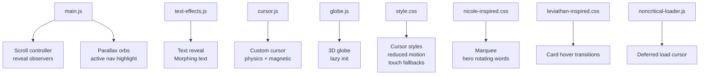
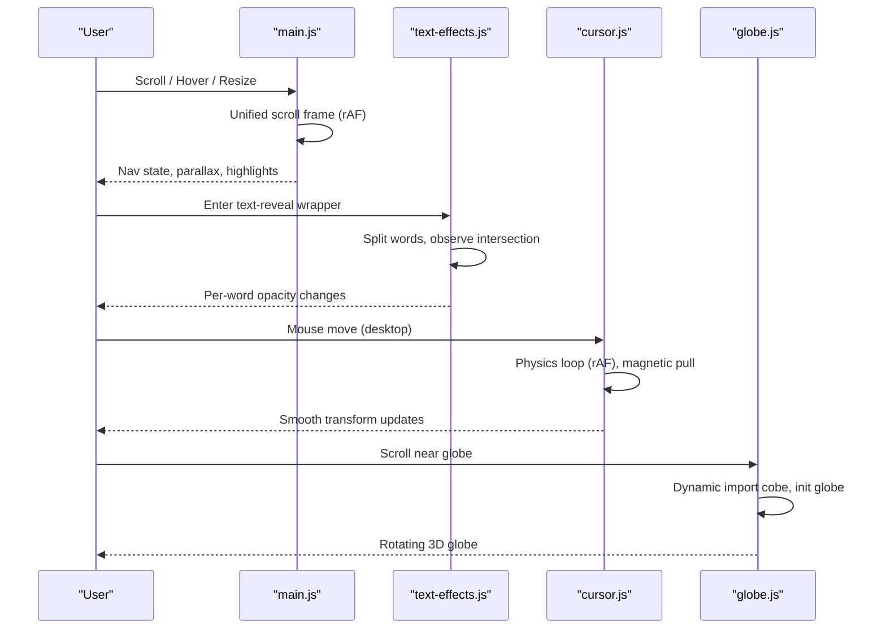
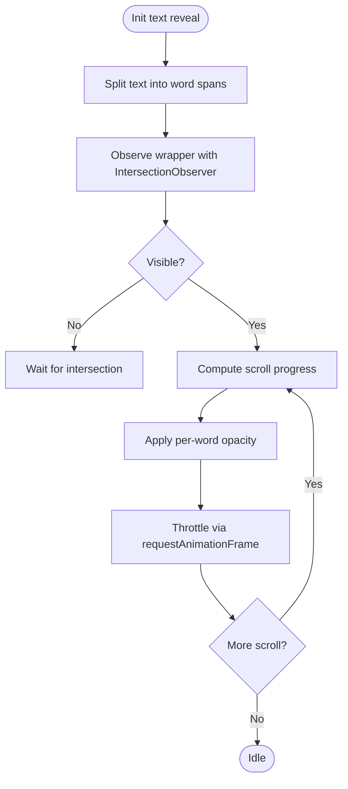
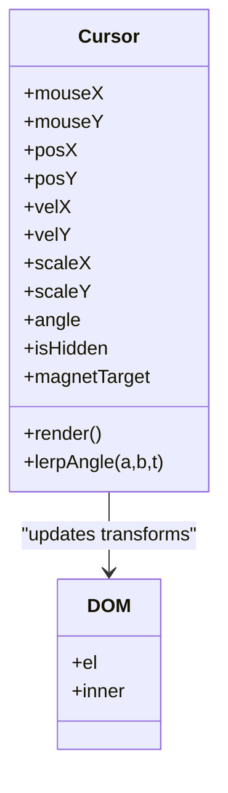
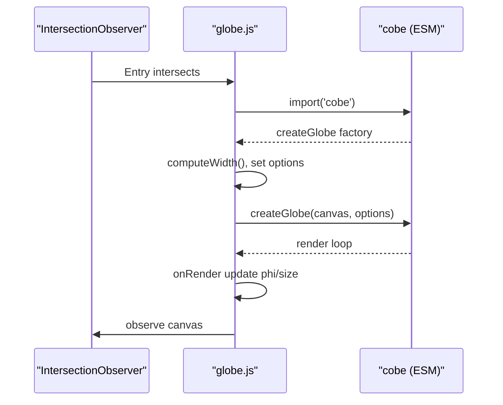
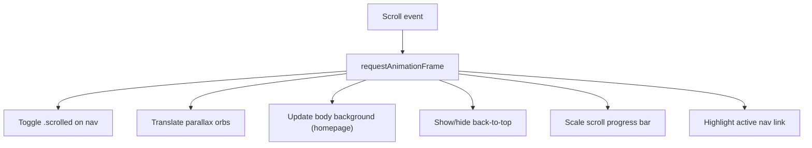
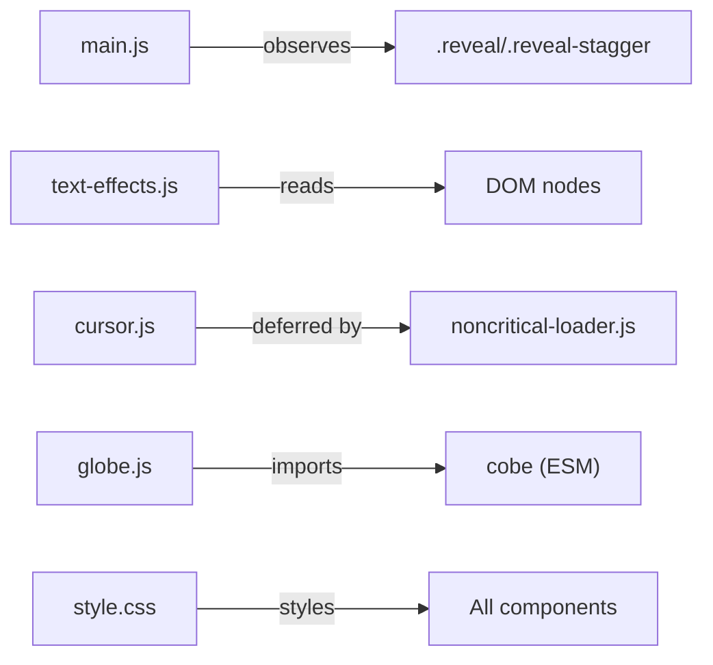

# Interactive Animations & Effects

<cite>
**Referenced Files in This Document**
- [text-effects.js](file://js/text-effects.js)
- [cursor.js](file://js/cursor.js)
- [globe.js](file://js/globe.js)
- [main.js](file://js/main.js)
- [style.css](file://css/style.css)
- [nicole-inspired.css](file://css/nicole-inspired.css)
- [leviathan-inspired.css](file://css/leviathan-inspired.css)
- [noncritical-loader.js](file://js/noncritical-loader.js)
</cite>

## Table of Contents
1. [Introduction](#introduction)
2. [Project Structure](#project-structure)
3. [Core Components](#core-components)
4. [Architecture Overview](#architecture-overview)
5. [Detailed Component Analysis](#detailed-component-analysis)
6. [Dependency Analysis](#dependency-analysis)
7. [Performance Considerations](#performance-considerations)
8. [Troubleshooting Guide](#troubleshooting-guide)
9. [Conclusion](#conclusion)
10. [Appendices](#appendices)

## Introduction
This document explains the interactive animations and visual effects system implemented across the project. It covers:
- Text animation library (scroll-linked text reveal, morphing text transitions)
- Custom cursor with physics-based movement and magnetic hover behavior
- 3D globe visualization using a lightweight WebGL library via dynamic import
- Performance-conscious techniques using requestAnimationFrame, IntersectionObserver, passive listeners, and CSS transforms
- Scroll-triggered animations, hover effects, micro-interactions, accessibility compliance, browser compatibility, and graceful degradation strategies

## Project Structure
The animation system is split into focused modules:
- js/text-effects.js: Scroll-driven text reveal and cycling morphing text
- js/cursor.js: Physics-based custom cursor with hover/magnetic behaviors
- js/globe.js: Lazy-initialized 3D globe with reduced-motion support
- js/main.js: Unified scroll controller, reveal observers, parallax orbs, active nav highlighting
- css/style.css: Core styles including custom cursor visuals, reduced motion overrides, touch-friendly adjustments
- css/nicole-inspired.css: Marquee, hero rotating words, text reveal styling
- css/leviathan-inspired.css: Card hover transitions and micro-interactions
- js/noncritical-loader.js: Deferred loading of heavy features like the custom cursor

**Diagram sources**
- [main.js:44-54](file://js/main.js#L44-L54)
- [main.js:178-284](file://js/main.js#L178-L284)
- [text-effects.js:8-85](file://js/text-effects.js#L8-L85)
- [text-effects.js:88-208](file://js/text-effects.js#L88-L208)
- [cursor.js:1-166](file://js/cursor.js#L1-L166)
- [globe.js:4-107](file://js/globe.js#L4-L107)
- [style.css:3709-3784](file://css/style.css#L3709-L3784)
- [nicole-inspired.css:49-121](file://css/nicole-inspired.css#L49-L121)
- [leviathan-inspired.css:84-109](file://css/leviathan-inspired.css#L84-L109)
- [noncritical-loader.js:73-99](file://js/noncritical-loader.js#L73-L99)

**Section sources**
- [main.js:44-54](file://js/main.js#L44-L54)
- [main.js:178-284](file://js/main.js#L178-L284)
- [text-effects.js:8-85](file://js/text-effects.js#L8-L85)
- [text-effects.js:88-208](file://js/text-effects.js#L88-L208)
- [cursor.js:1-166](file://js/cursor.js#L1-L166)
- [globe.js:4-107](file://js/globe.js#L4-L107)
- [style.css:3709-3784](file://css/style.css#L3709-L3784)
- [nicole-inspired.css:49-121](file://css/nicole-inspired.css#L49-L121)
- [leviathan-inspired.css:84-109](file://css/leviathan-inspired.css#L84-L109)
- [noncritical-loader.js:73-99](file://js/noncritical-loader.js#L73-L99)

## Core Components
- Text Reveal: Splits text into word spans and animates opacity based on scroll progress using IntersectionObserver and requestAnimationFrame for performance.
- Morphing Text: Cycles between multiple texts with cross-fade and width adaptation; respects reduced motion and device capabilities.
- Custom Cursor: Physics-based blob that follows the pointer with spring dynamics, stretch along velocity, rotation toward movement direction, and magnetic attraction to targets.
- 3D Globe: Lazy-loaded via dynamic import when visible; adapts resolution and spin speed for mobile and reduced motion preferences; toggles rendering when out of view.
- Unified Scroll Controller: Consolidates scroll work into one rAF-gated handler; updates nav state, parallax orbs, background gradients, back-to-top visibility, scroll progress bar, and active section highlighting.

**Section sources**
- [text-effects.js:8-85](file://js/text-effects.js#L8-L85)
- [text-effects.js:88-208](file://js/text-effects.js#L88-L208)
- [cursor.js:1-166](file://js/cursor.js#L1-L166)
- [globe.js:4-107](file://js/globe.js#L4-L107)
- [main.js:178-284](file://js/main.js#L178-L284)

## Architecture Overview
The system composes several independent modules that share common performance patterns:
- Event-driven initialization with capability detection (hover, fine pointer, reduced motion)
- Lazy loading of heavy features (globe, custom cursor)
- Centralized scroll handling to avoid layout thrashing
- CSS-driven micro-interactions where possible, JS only when necessary

**Diagram sources**
- [main.js:178-284](file://js/main.js#L178-L284)
- [text-effects.js:8-85](file://js/text-effects.js#L8-L85)
- [cursor.js:1-166](file://js/cursor.js#L1-L166)
- [globe.js:4-107](file://js/globe.js#L4-L107)

## Detailed Component Analysis

### Text Animation Library
- Scroll-linked text reveal:
  - Splits content into word spans using a DocumentFragment to minimize reflows.
  - Uses IntersectionObserver to activate only when near viewport.
  - Maps scroll progress to per-word opacity with a throttled update via requestAnimationFrame.
- Morphing text:
  - Measures text widths with an off-screen element to size containers accurately.
  - Cross-fades between two elements while updating width smoothly.
  - Respects prefers-reduced-motion by slowing or disabling cycles; pauses on tab hide.

**Diagram sources**
- [text-effects.js:8-85](file://js/text-effects.js#L8-L85)

**Section sources**
- [text-effects.js:8-85](file://js/text-effects.js#L8-L85)
- [text-effects.js:88-208](file://js/text-effects.js#L88-L208)
- [nicole-inspired.css:1213-1288](file://css/nicole-inspired.css#L1213-L1288)

### Custom Cursor Implementations
- Physics model:
  - Spring-based position follow with damping to create smooth overshoot.
  - Velocity-driven stretch preserving area (scaleX * scaleY ≈ 1).
  - Adaptive shape damping for playful motion and quick settle at rest.
  - Rotation aligned to velocity direction using angle interpolation.
- Magnetic effect:
  - Detects nearby targets and pulls the cursor toward their center within a radius.
- Interaction states:
  - Hover classes expand glow and scale.
  - Click class shrinks and intensifies glow.
- Device and accessibility:
  - Disabled on non-hover/coarse devices.
  - Hidden by default until first interaction.

**Diagram sources**
- [cursor.js:1-166](file://js/cursor.js#L1-L166)
- [style.css:3709-3784](file://css/style.css#L3709-L3784)

**Section sources**
- [cursor.js:1-166](file://js/cursor.js#L1-L166)
- [style.css:3709-3784](file://css/style.css#L3709-L3784)

### 3D Globe Visualization
- Lazy initialization:
  - Dynamically imports the globe library only when the canvas enters the viewport.
  - Adjusts device pixel ratio and map samples for mobile vs desktop.
  - Slows spin speed when reduced motion is preferred.
- Lifecycle management:
  - Pauses rendering when out of view via toggle.
  - Cleans up event listeners and destroys instance on page unload.

**Diagram sources**
- [globe.js:4-107](file://js/globe.js#L4-L107)

**Section sources**
- [globe.js:4-107](file://js/globe.js#L4-L107)

### Scroll-Triggered Animations and Micro-Interactions
- Reveal animations:
  - Elements gain an active class when intersecting, triggering CSS transitions/animations.
- Parallax orbs:
  - Translated vertically based on scroll position on desktop.
- Background gradient shifts:
  - Homepage body background switches based on current section ranges.
- Back-to-top and scroll progress:
  - Visibility toggled by scroll thresholds.
  - Progress bar uses transform scaling to avoid repaint.
- Active navigation:
  - Section geometry cached to avoid forced reflow; batch writes to update active link.

**Diagram sources**
- [main.js:178-284](file://js/main.js#L178-L284)
- [main.js:298-345](file://js/main.js#L298-L345)

**Section sources**
- [main.js:44-54](file://js/main.js#L44-L54)
- [main.js:178-284](file://js/main.js#L178-L284)
- [main.js:298-345](file://js/main.js#L298-L345)
- [style.css:6027-6061](file://css/style.css#L6027-L6061)

### Hover Effects and Micro-Interactions
- Cards:
  - Lift and subtle scale on hover; top border reveal via transform scaleX.
- Marquee:
  - Continuous horizontal scroll with pause on hover; gradient background animation.
- Hero rotating words:
  - Staggered entrance/exit transitions for word cycling.

**Section sources**
- [leviathan-inspired.css:84-109](file://css/leviathan-inspired.css#L84-L109)
- [nicole-inspired.css:49-121](file://css/nicole-inspired.css#L49-L121)
- [nicole-inspired.css:124-178](file://css/nicole-inspired.css#L124-L178)

## Dependency Analysis
- main.js orchestrates global scroll behavior and reveals; it does not depend on other animation modules directly but coordinates UI state.
- text-effects.js operates independently once DOM nodes are present; relies on IntersectionObserver and requestAnimationFrame.
- cursor.js depends on pointer events and media queries; can be deferred via noncritical-loader.js.
- globe.js depends on dynamic import of a third-party library; guarded by IntersectionObserver and reduced motion checks.
- Styles in style.css provide base visuals and accessibility overrides; nicole-inspired.css and leviathan-inspired.css add feature-specific effects.

**Diagram sources**
- [main.js:44-54](file://js/main.js#L44-L54)
- [text-effects.js:8-85](file://js/text-effects.js#L8-L85)
- [cursor.js:1-166](file://js/cursor.js#L1-L166)
- [globe.js:4-107](file://js/globe.js#L4-L107)
- [style.css:3709-3784](file://css/style.css#L3709-L3784)
- [noncritical-loader.js:73-99](file://js/noncritical-loader.js#L73-L99)

**Section sources**
- [main.js:44-54](file://js/main.js#L44-L54)
- [text-effects.js:8-85](file://js/text-effects.js#L8-L85)
- [cursor.js:1-166](file://js/cursor.js#L1-L166)
- [globe.js:4-107](file://js/globe.js#L4-L107)
- [style.css:3709-3784](file://css/style.css#L3709-L3784)
- [noncritical-loader.js:73-99](file://js/noncritical-loader.js#L73-L99)

## Performance Considerations
- Use requestAnimationFrame for all high-frequency updates (scroll handlers, cursor physics, globe render loop).
- Debounce/throttle expensive operations:
  - Scroll updates are consolidated into a single rAF-gated handler.
  - Resize recalculations are coalesced via rAF.
- Minimize layout thrashing:
  - Cache geometry (section ranges, homepage backgrounds) and invalidate only on resize/load.
  - Batch DOM writes after reads.
- Prefer CSS transforms and opacity for animations to leverage GPU acceleration.
- Respect user preferences:
  - Reduce or disable animations when prefers-reduced-motion is enabled.
  - Lower globe resolution and spin speed on mobile/reduced motion.
- Defer heavy scripts:
  - Load custom cursor only on first pointer activity or idle timeout.
  - Lazy-load globe when near viewport.

[No sources needed since this section provides general guidance]

## Troubleshooting Guide
- Text reveal not triggering:
  - Ensure the wrapper has the correct class and is observed by IntersectionObserver.
  - Check that the script runs after DOMContentLoaded.
- Morphing text not resizing:
  - Verify fonts have loaded before measuring; use font readiness callbacks.
  - Confirm container has proper overflow and sizing rules.
- Custom cursor not appearing:
  - Confirm device supports hover/fine pointer; otherwise it is intentionally hidden.
  - Ensure the loader triggers on mousemove/pointerdown/idle.
- Globe not rendering:
  - Check network errors during dynamic import; fallback logs warnings.
  - Verify canvas exists and has dimensions; ensure IntersectionObserver fires.
- Reduced motion issues:
  - Confirm CSS and JS respect prefers-reduced-motion; animations should be minimal or disabled.

**Section sources**
- [text-effects.js:8-85](file://js/text-effects.js#L8-L85)
- [text-effects.js:88-208](file://js/text-effects.js#L88-L208)
- [cursor.js:1-166](file://js/cursor.js#L1-L166)
- [globe.js:4-107](file://js/globe.js#L4-L107)
- [style.css:6027-6061](file://css/style.css#L6027-L6061)

## Conclusion
The animation system combines performant JavaScript with expressive CSS to deliver engaging interactions while respecting user preferences and device capabilities. Key strengths include:
- Efficient scroll handling and lazy initialization
- Physics-based cursor for delightful micro-interactions
- Accessible design with reduced motion support
- Graceful degradation on non-hover devices and older browsers

Adopt these patterns when building new animations: prefer transforms, throttle with rAF, defer heavy work, and honor accessibility signals.

[No sources needed since this section summarizes without analyzing specific files]

## Appendices

### Creating Custom Animations
- Text reveal pattern:
  - Wrap content in a container, split into word spans, observe intersection, and animate opacity based on scroll progress.
- Morphing text pattern:
  - Maintain two overlapping elements; swap content and transition classes for cross-fade; measure and animate width changes.
- Custom cursor pattern:
  - Track pointer position, apply spring physics, compute stretch and rotation from velocity, and detect magnetic targets.
- Globe pattern:
  - Use IntersectionObserver to trigger dynamic import; configure devicePixelRatio and samples based on device; toggle visibility when out of view.

**Section sources**
- [text-effects.js:8-85](file://js/text-effects.js#L8-L85)
- [text-effects.js:88-208](file://js/text-effects.js#L88-L208)
- [cursor.js:1-166](file://js/cursor.js#L1-L166)
- [globe.js:4-107](file://js/globe.js#L4-L107)

### Optimizing Animation Performance
- Consolidate scroll listeners into a single rAF-gated handler.
- Cache computed geometry and invalidate on resize/load.
- Use will-change sparingly; rely on transform and opacity for smoothness.
- Defer non-critical animations until first interaction or idle time.

**Section sources**
- [main.js:178-284](file://js/main.js#L178-L284)
- [main.js:298-345](file://js/main.js#L298-L345)
- [noncritical-loader.js:73-99](file://js/noncritical-loader.js#L73-L99)

### Accessibility Compliance
- Honor prefers-reduced-motion to minimize or disable animations.
- Ensure interactive elements remain keyboard accessible and focus-visible.
- Avoid flashing or rapid motion; keep marquee speeds reasonable.
- Provide clear visual feedback for hover and click states without relying solely on color.

**Section sources**
- [style.css:6027-6061](file://css/style.css#L6027-L6061)
- [nicole-inspired.css:115-121](file://css/nicole-inspired.css#L115-L121)

### Browser Compatibility and Graceful Degradation
- Feature detection:
  - Disable custom cursor on coarse pointers; defer loading until hover detected.
  - Fallback for IntersectionObserver absence by scheduling idle callbacks.
- Reduced motion:
  - Globally reduce animation durations and disable certain effects.
- Touch-friendly adjustments:
  - Simplify 3D transforms on touch devices; increase touch target sizes.

**Section sources**
- [cursor.js:1-166](file://js/cursor.js#L1-L166)
- [noncritical-loader.js:73-99](file://js/noncritical-loader.js#L73-L99)
- [style.css:6063-6089](file://css/style.css#L6063-L6089)