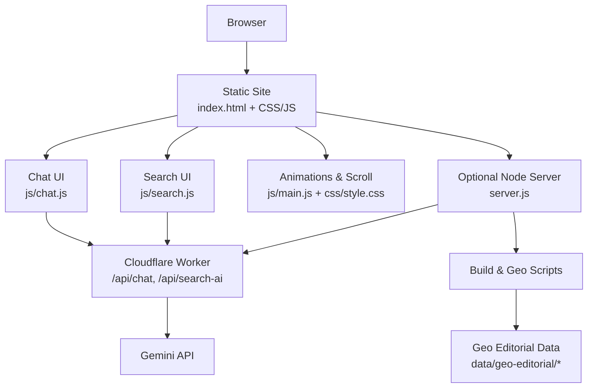
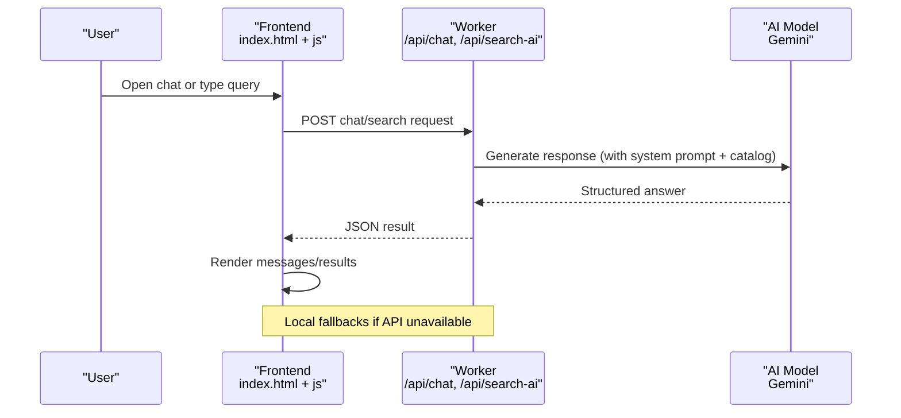
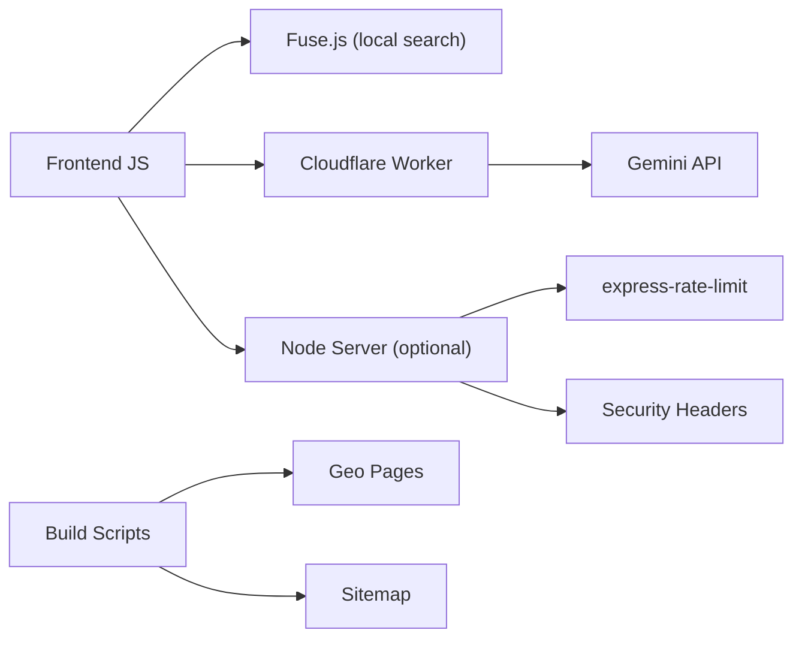

# Key Features & Capabilities

<cite>
**Referenced Files in This Document**
- [README.md](file://README.md)
- [package.json](file://package.json)
- [chat-config.json](file://chat-config.json)
- [ai-config.js](file://ai-config.js)
- [js/site-config.js](file://js/site-config.js)
- [src/html/index.html](file://src/html/index.html)
- [css/style.css](file://css/style.css)
- [js/main.js](file://js/main.js)
- [js/chat.js](file://js/chat.js)
- [js/search.js](file://js/search.js)
- [server.js](file://server.js)
- [workers/webnovis-ai/src/index.js](file://workers/webnovis-ai/src/index.js)
- [search-index.json](file://search-index.json)
- [data/geo-editorial/manifest.json](file://data/geo-editorial/manifest.json)
</cite>

## Table of Contents
1. Introduction
2. Project Structure
3. Core Components
4. Architecture Overview
5. Detailed Component Analysis
6. Dependency Analysis
7. Performance Considerations
8. Troubleshooting Guide
9. Conclusion

## Introduction
This document explains WebNovis key features and capabilities with a focus on modern responsive design, an integrated chatbot system, intelligent site search, geo-targeted content generation, dark theme support, and advanced animations. It covers how each feature works, user benefits, implementation details (frontend and backend), configuration options, performance optimizations, and accessibility considerations.

## Project Structure
WebNovis is a hybrid static + optional Node runtime project:
- Static assets (HTML/CSS/JS) render the site and power client-side features like search and chat UI.
- Optional Node server enables AI endpoints, rate limiting, security headers, and automation scripts.
- Cloudflare Worker exposes AI APIs for chat and search enrichment.
- Geo editorial data drives localized pages and search results.

**Diagram sources**
- [src/html/index.html:35-62](file://src/html/index.html#L35-L62)
- [js/chat.js:8-21](file://js/chat.js#L8-L21)
- [js/search.js:13-29](file://js/search.js#L13-L29)
- [js/main.js:44-54](file://js/main.js#L44-L54)
- [css/style.css:168-200](file://css/style.css#L168-L200)
- [workers/webnovis-ai/src/index.js:12-24](file://workers/webnovis-ai/src/index.js#L12-L24)
- [server.js:1-11](file://server.js#L1-L11)
- [data/geo-editorial/manifest.json:1-47](file://data/geo-editorial/manifest.json#L1-L47)

**Section sources**
- [README.md:11-58](file://README.md#L11-L58)
- [package.json:6-60](file://package.json#L6-L60)

## Core Components
- Modern Responsive Design: Mobile-first layout, breakpoints, fluid typography, and adaptive components.
- Integrated Chatbot System: Weby chat widget with local fallbacks and remote AI enrichment via Cloudflare Worker.
- Intelligent Site Search: Fuse.js fuzzy search with optional AI synthesis grounded in a local index.
- Geo-Targeted Content Generation: Editorial manifest and scripts generate location-specific pages and metadata.
- Dark Theme Support: Centralized tokens and theme-aware styles across components.
- Advanced Animations: Scroll reveals, hero effects, marquee, counters, and motion-safe behavior.

**Section sources**
- [css/style.css:168-200](file://css/style.css#L168-L200)
- [js/chat.js:8-21](file://js/chat.js#L8-L21)
- [js/search.js:13-29](file://js/search.js#L13-L29)
- [data/geo-editorial/manifest.json:1-47](file://data/geo-editorial/manifest.json#L1-L47)
- [js/main.js:44-54](file://js/main.js#L44-L54)

## Architecture Overview
The site runs as static HTML/CSS/JS with optional Node runtime and a Cloudflare Worker for AI services. The chatbot and search are progressive enhancements: they work locally first and can enrich responses via the worker when available.

**Diagram sources**
- [js/chat.js:8-21](file://js/chat.js#L8-L21)
- [js/search.js:13-29](file://js/search.js#L13-L29)
- [workers/webnovis-ai/src/index.js:12-24](file://workers/webnovis-ai/src/index.js#L12-L24)
- [workers/webnovis-ai/src/index.js:153-176](file://workers/webnovis-ai/src/index.js#L153-L176)

## Detailed Component Analysis

### Modern Responsive Design
- Breakpoints and mobile-first rules ensure consistent layouts from small phones to large desktops.
- Fluid typography and flexible grids adapt to viewport changes without horizontal scrolling.
- Critical CSS avoids FOUC; deferred styles load non-critical visuals.

Implementation highlights:
- Root tokens define colors and surfaces for light/dark modes.
- Media queries adjust spacing, font sizes, and component stacking order.
- Skip links and semantic structure improve keyboard navigation.

Benefits:
- Fast, accessible experiences across devices.
- Predictable visual hierarchy and readability.

Configuration:
- Adjust breakpoints and tokens in CSS variables.
- Use print media for optimized printing.

Accessibility:
- Skip-to-content link and proper roles/labels.
- Respect reduced-motion preferences where applicable.

**Section sources**
- [css/style.css:168-200](file://css/style.css#L168-L200)
- [css/style.css:6374-6401](file://css/style.css#L6374-L6401)
- [src/html/index.html:32-35](file://src/html/index.html#L32-L35)
- [src/html/index.html:26-31](file://src/html/index.html#L26-L31)

### Integrated Chatbot System (Weby)
How it works:
- A floating chat widget opens a popup with message history persisted in localStorage.
- Messages are sent to a Cloudflare Worker endpoint (/api/chat). If unavailable, local fallback responses are used.
- The worker builds a system prompt from chat-config.json and returns concise, conversion-focused answers.

User benefits:
- Instant, multilingual-ready assistance.
- Lead qualification flows and direct contact prompts.

Implementation details:
- Frontend config sets endpoints, max message length, retry logic, and session persistence.
- Worker enforces rate limits, CORS, injection protection, and model selection.
- Safety filters block prompt injection attempts.

Configuration:
- Edit chat-config.json to update company info, services, pricing, and instructions.
- Toggle remote AI vs local fallback via environment and frontend flags.

Accessibility:
- Live region announces character counter and status.
- Clear disclosure that the assistant is AI-powered.

**Section sources**
- [js/chat.js:8-21](file://js/chat.js#L8-L21)
- [js/chat.js:112-144](file://js/chat.js#L112-L144)
- [js/chat.js:168-200](file://js/chat.js#L168-L200)
- [chat-config.json:1-109](file://chat-config.json#L1-L109)
- [workers/webnovis-ai/src/index.js:12-24](file://workers/webnovis-ai/src/index.js#L12-L24)
- [workers/webnovis-ai/src/index.js:153-176](file://workers/webnovis-ai/src/index.js#L153-L176)

### Intelligent Site Search
How it works:
- Fuse.js performs fast fuzzy matching against a local search index built at build time.
- For longer queries, the frontend optionally calls /api/search-ai to synthesize a grounded answer using the same index.
- Results include highlighted matches and suggested pages.

User benefits:
- Immediate, relevant results even with typos.
- AI-generated summaries that cite source pages.

Implementation details:
- Debounced input reduces network churn.
- Stop words and token normalization improve relevance.
- Remote AI calls are proxied through the worker; no API keys in the browser.

Configuration:
- Enable/disable remote AI via window flag.
- Tune thresholds for local scoring and AI activation.

Accessibility:
- Keyboard shortcuts (Ctrl+K), combobox role, and listbox results.
- Escape to close, arrow keys to navigate.

**Section sources**
- [js/search.js:13-29](file://js/search.js#L13-L29)
- [js/search.js:82-100](file://js/search.js#L82-L100)
- [js/search.js:194-200](file://js/search.js#L194-L200)
- [search-index.json:1-24](file://search-index.json#L1-L24)

### Geo-Targeted Content Generation
How it works:
- An editorial manifest defines clusters (agency, ecommerce, seo-locale, etc.) and records mapped to paths and tiers.
- Build scripts generate localized pages and metadata based on this manifest and city/service datasets.

User benefits:
- Location-relevant content improves discoverability and trust.
- Consistent messaging across many cities and services.

Implementation details:
- Manifest includes checksums and record counts for reproducibility.
- Scripts produce pages, internal linking graphs, and schema markup.

Configuration:
- Update manifest entries to add/remove locations or services.
- Adjust tiers to prioritize high-value pages.

**Section sources**
- [data/geo-editorial/manifest.json:1-47](file://data/geo-editorial/manifest.json#L1-L47)
- [data/geo-editorial/manifest.json:48-449](file://data/geo-editorial/manifest.json#L48-L449)

### Dark Theme Support
How it works:
- Centralized CSS variables define brand colors, surfaces, and accents for dark mode.
- Components use semantic tokens so themes apply consistently.

User benefits:
- Reduced eye strain and better contrast in low-light environments.
- Cohesive brand experience.

Implementation details:
- Tokens include primary, secondary, electric accent, and dark surfaces.
- Styles avoid hard-coded colors; rely on variables.

Configuration:
- Modify :root tokens to rebrand or adjust contrast.

**Section sources**
- [css/style.css:168-200](file://css/style.css#L168-L200)

### Advanced Animations
How it works:
- IntersectionObserver triggers reveal animations as elements enter the viewport.
- Hero effects, marquee, counters, and gradient orbs enhance engagement.
- Motion preferences are respected to reduce animations for sensitive users.

User benefits:
- Engaging storytelling without sacrificing performance.
- Smooth transitions guide attention to key content.

Implementation details:
- Unified scroll controller batches updates to avoid jank.
- CSS keyframes and transforms provide GPU-accelerated effects.

Configuration:
- Toggle hero effects on mobile after idle to preserve LCP.
- Disable heavy effects for reduced-motion users.

**Section sources**
- [js/main.js:44-54](file://js/main.js#L44-L54)
- [js/main.js:158-176](file://js/main.js#L158-L176)
- [js/main.js:178-200](file://js/main.js#L178-L200)
- [css/style.css:6374-6395](file://css/style.css#L6374-L6395)

## Dependency Analysis
Key runtime dependencies and their roles:
- Express and middleware enable secure, rate-limited API endpoints when running Node mode.
- Cloudflare Worker provides edge AI endpoints with minimal cold start latency.
- Fuse.js powers client-side fuzzy search.
- Build scripts orchestrate geo generation, sitemap creation, and artifact preparation.

**Diagram sources**
- [package.json:69-77](file://package.json#L69-L77)
- [workers/webnovis-ai/src/index.js:12-24](file://workers/webnovis-ai/src/index.js#L12-L24)
- [js/search.js:29](file://js/search.js#L29)
- [server.js:95-107](file://server.js#L95-L107)

**Section sources**
- [package.json:6-60](file://package.json#L6-L60)
- [server.js:1-11](file://server.js#L1-L11)

## Performance Considerations
- Preload critical resources and defer non-critical CSS/fonts to improve LCP and FCP.
- Use IntersectionObserver for lazy animations and scroll-triggered effects.
- Debounce search input and limit AI enrichment to longer queries.
- Keep chat payloads small; persist sessions locally to reduce retries.
- Respect prefers-reduced-motion to avoid unnecessary repaints.
- Leverage worker caching and rate limits to protect AI quotas and reduce latency.

[No sources needed since this section provides general guidance]

## Troubleshooting Guide
Common issues and resolutions:
- Chatbot not responding:
  - Verify worker health endpoint and CORS settings.
  - Check local vs remote endpoint configuration in chat script.
  - Ensure rate limits are not exceeded.
- Search not returning results:
  - Confirm search index exists and is up to date.
  - Validate stop words and thresholds for your language.
- Animations not working:
  - Ensure main.js is loaded and no console errors block initialization.
  - Check reduced-motion preference and browser compatibility.
- Layout issues on mobile:
  - Verify viewport meta tag and media queries.
  - Test on real devices; some emulators misreport touch capabilities.

**Section sources**
- [js/chat.js:8-21](file://js/chat.js#L8-L21)
- [js/search.js:13-29](file://js/search.js#L13-L29)
- [js/main.js:44-54](file://js/main.js#L44-L54)
- [src/html/index.html:5](file://src/html/index.html#L5)

## Conclusion
WebNovis combines a modern, responsive interface with powerful AI-driven features. The chatbot and search deliver instant value while remaining resilient without backend connectivity. Geo-targeted content scales coverage across markets, and the dark theme plus advanced animations elevate the user experience. With careful configuration and performance-conscious defaults, the platform supports both static hosting and richer Node-based deployments.