# Performance Optimizations

<cite>
**Referenced Files in This Document**
- [build.js](file://build.js)
- [package.json](file://package.json)
- [config/security-headers.js](file://config/security-headers.js)
- [server.js](file://server.js)
- [js/web-vitals-reporter.js](file://js/web-vitals-reporter.js)
- [js/noncritical-loader.js](file://js/noncritical-loader.js)
- [config/image-policy.js](file://config/image-policy.js)
- [lighthouserc.js](file://lighthouserc.js)
- [wrangler.jsonc](file://wrangler.jsonc)
- [scripts/prepare-public-artifact.js](file://scripts/prepare-public-artifact.js)
- [docs/PERFORMANCE-OPTIMIZATION-REPORT.md](file://docs/PERFORMANCE-OPTIMIZATION-REPORT.md)
- [docs/deploy/CLOUDFLARE-CONFIGURAZIONE-PASSO-PASSO.md](file://docs/deploy/CLOUDFLARE-CONFIGURAZIONE-PASSO-PASSO.md)
- [tests/security-header-regressions.test.js](file://tests/security-header-regressions.test.js)
- [tests/public-html-regressions.test.js](file://tests/public-html-regressions.test.js)
</cite>

## Table of Contents
1. [Introduction](#introduction)
2. [Project Structure](#project-structure)
3. [Core Components](#core-components)
4. [Architecture Overview](#architecture-overview)
5. [Detailed Component Analysis](#detailed-component-analysis)
6. [Dependency Analysis](#dependency-analysis)
7. [Performance Considerations](#performance-considerations)
8. [Troubleshooting Guide](#troubleshooting-guide)
9. [Conclusion](#conclusion)
10. [Appendices](#appendices)

## Introduction
This document explains WebNovis performance optimizations across the asset pipeline, runtime loading, caching, CDN configuration, and monitoring. It focuses on how images are optimized, CSS/JS minification works, code splitting is achieved without a bundler, lazy loading and critical rendering path improvements are implemented, and how Core Web Vitals are monitored with budgets enforced via CI.

## Project Structure
The project uses a Node-based build pipeline that:
- Minifies JavaScript with Terser
- Minifies CSS with Lightning CSS (with CleanCSS fallback)
- Optionally minifies HTML templates from src/html
- Discovers referenced assets from generated HTML to include only what is used
- Produces a public artifact for deployment to Cloudflare Workers Assets

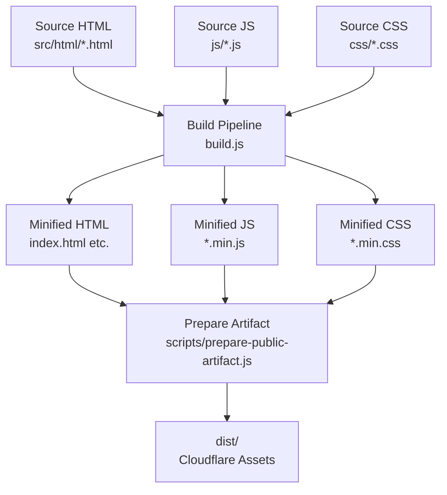

**Diagram sources**
- [build.js:242-495](file://build.js#L242-L495)
- [scripts/prepare-public-artifact.js:183-233](file://scripts/prepare-public-artifact.js#L183-L233)

**Section sources**
- [build.js:1-113](file://build.js#L1-L113)
- [scripts/prepare-public-artifact.js:183-233](file://scripts/prepare-public-artifact.js#L183-L233)

## Core Components
- Asset minification and discovery: build.js orchestrates JS/CSS minification and HTML minification, discovering assets referenced by HTML.
- Progressive and lazy loading: js/noncritical-loader.js loads non-critical scripts on idle or when near viewport; config/image-policy.js injects loading="lazy" for below-the-fold images.
- Runtime metrics: js/web-vitals-reporter.js reports Core Web Vitals to GA4 after consent.
- Security and caching headers: config/security-headers.js defines CSP and static cache rules; server.js serves static assets with production cache headers.
- CDN and deployment: wrangler.jsonc configures Cloudflare Assets; docs/deploy/CLOUDFLARE-CONFIGURAZIONE-PASSO-PASSO.md documents immutable caching for versioned assets.
- CI quality gates: lighthouserc.js enforces performance thresholds.

**Section sources**
- [build.js:31-113](file://build.js#L31-L113)
- [js/noncritical-loader.js:1-166](file://js/noncritical-loader.js#L1-L166)
- [config/image-policy.js:1-58](file://config/image-policy.js#L1-L58)
- [js/web-vitals-reporter.js:1-33](file://js/web-vitals-reporter.js#L1-L33)
- [config/security-headers.js:40-100](file://config/security-headers.js#L40-L100)
- [server.js:458-481](file://server.js#L458-L481)
- [wrangler.jsonc:22-28](file://wrangler.jsonc#L22-L28)
- [docs/deploy/CLOUDFLARE-CONFIGURAZIONE-PASSO-PASSO.md:207-229](file://docs/deploy/CLOUDFLARE-CONFIGURAZIONE-PASSO-PASSO.md#L207-L229)
- [lighthouserc.js:1-28](file://lighthouserc.js#L1-L28)

## Architecture Overview
End-to-end flow from source to CDN delivery:

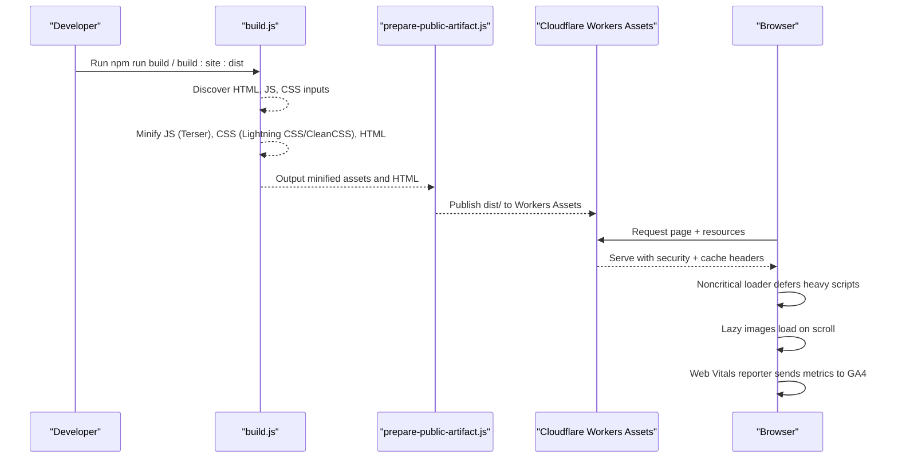

**Diagram sources**
- [build.js:242-495](file://build.js#L242-L495)
- [scripts/prepare-public-artifact.js:183-233](file://scripts/prepare-public-artifact.js#L183-L233)
- [config/security-headers.js:64-100](file://config/security-headers.js#L64-L100)
- [server.js:458-481](file://server.js#L458-L481)
- [js/noncritical-loader.js:1-166](file://js/noncritical-loader.js#L1-L166)
- [js/web-vitals-reporter.js:1-33](file://js/web-vitals-reporter.js#L1-L33)

## Detailed Component Analysis

### Asset Pipeline: JS, CSS, and HTML Minification
- JS minification: Uses Terser with dead code elimination, console removal, and safe mangling options. Explicit input list ensures deterministic builds.
- CSS minification: Prefers Lightning CSS for modern features; falls back to CleanCSS if needed. Safe level-1 transforms in fallback mode preserve cascade behavior.
- HTML minification: Optional html-minifier-terser step processes templates under src/html into the publish root, applying SEO transforms before minification.
- Asset discovery: Scans generated HTML to find local JS/CSS references, ensuring only used files are included in the artifact.

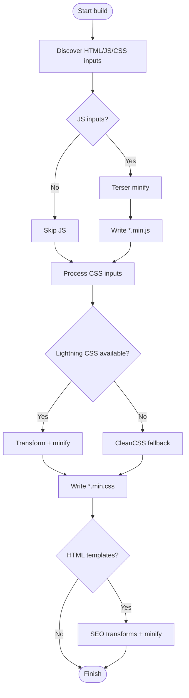

**Diagram sources**
- [build.js:242-495](file://build.js#L242-L495)

**Section sources**
- [build.js:31-113](file://build.js#L31-L113)
- [build.js:242-495](file://build.js#L242-L495)

### Image Optimization and Lazy Loading
- Policy-driven lazy loading: The image policy scans HTML  tags and adds loading="lazy" unless whitelisted for above-the-fold or LCP candidates (logo, hero, featured).
- LCP promotion helpers: Legacy scripts demonstrate promoting first content images to eager with fetchpriority="high" where appropriate.
- Image format guidance: Documentation outlines generating WebP/AVIF variants using Sharp for smaller payloads.

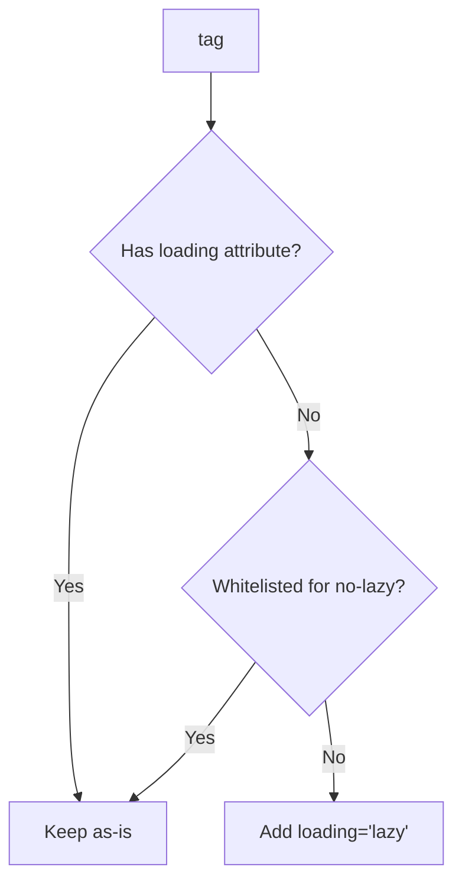

**Diagram sources**
- [config/image-policy.js:37-53](file://config/image-policy.js#L37-L53)

**Section sources**
- [config/image-policy.js:1-58](file://config/image-policy.js#L1-L58)
- [docs/PERFORMANCE-OPTIMIZATION-REPORT.md:891-914](file://docs/PERFORMANCE-OPTIMIZATION-REPORT.md#L891-L914)
- [docs/PERFORMANCE-OPTIMIZATION-REPORT.md:1098-1147](file://docs/PERFORMANCE-OPTIMIZATION-REPORT.md#L1098-L1147)

### Code Splitting Without a Bundler
- Manual split strategy: Separate concerns into focused modules (e.g., chat, search, text effects, globe) loaded on demand.
- Deferred execution: Noncritical loader uses defer for scripts and schedules them on idle or when elements enter the viewport.
- Module support: Some features load ES modules via type="module".

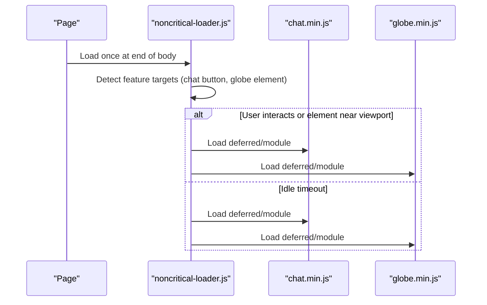

**Diagram sources**
- [js/noncritical-loader.js:1-166](file://js/noncritical-loader.js#L1-L166)

**Section sources**
- [js/noncritical-loader.js:1-166](file://js/noncritical-loader.js#L1-L166)
- [docs/PERFORMANCE-OPTIMIZATION-REPORT.md:1197-1223](file://docs/PERFORMANCE-OPTIMIZATION-REPORT.md#L1197-L1223)

### Critical Rendering Path and Critical CSS
- Render-blocking analytics moved off the critical path per recommendations.
- Non-critical CSS deferred via media="print" onload pattern; critical styles remain inline or early.
- Resource hints (preconnect/dns-prefetch/preload) recommended to reduce handshake costs and prioritize LCP assets.

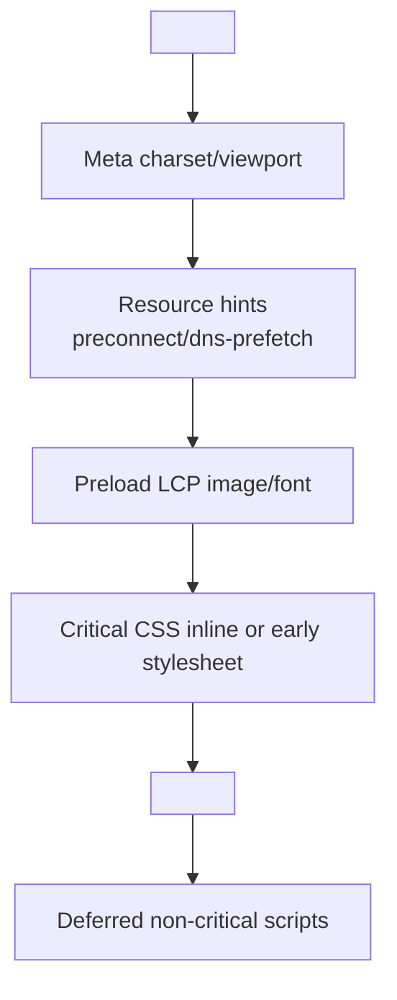

**Diagram sources**
- [docs/PERFORMANCE-OPTIMIZATION-REPORT.md:79-122](file://docs/PERFORMANCE-OPTIMIZATION-REPORT.md#L79-L122)
- [docs/PERFORMANCE-OPTIMIZATION-REPORT.md:138-169](file://docs/PERFORMANCE-OPTIMIZATION-REPORT.md#L138-L169)

**Section sources**
- [docs/PERFORMANCE-OPTIMIZATION-REPORT.md:79-169](file://docs/PERFORMANCE-OPTIMIZATION-REPORT.md#L79-L169)

### Caching Strategy and CDN Configuration
- Static asset caching: Express sets long-lived immutable cache for production assets; development disables caching.
- Static host headers: Generated _headers file applies bounded TTLs for stable paths and short TTLs for HTML; API responses get noindex robots tags.
- CDN rule for versioned assets: Cloudflare Cache Rule can serve versioned CSS/JS with one-year edge and browser TTLs when query contains version parameter.
- Deployment target: Cloudflare Workers Assets configured to serve dist/ with html_handling disabled to preserve .html URLs.

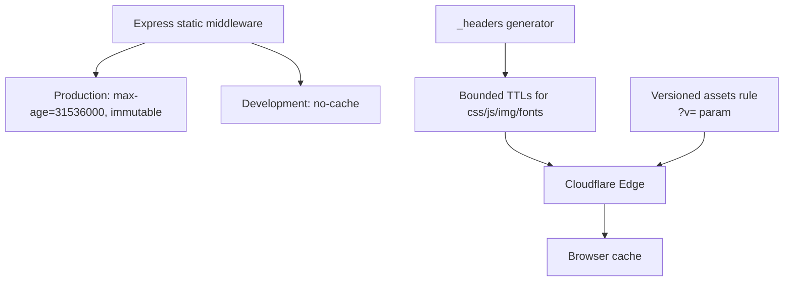

**Diagram sources**
- [server.js:458-481](file://server.js#L458-L481)
- [config/security-headers.js:64-100](file://config/security-headers.js#L64-L100)
- [docs/deploy/CLOUDFLARE-CONFIGURAZIONE-PASSO-PASSO.md:207-229](file://docs/deploy/CLOUDFLARE-CONFIGURAZIONE-PASSO-PASSO.md#L207-L229)
- [wrangler.jsonc:22-28](file://wrangler.jsonc#L22-L28)

**Section sources**
- [server.js:458-481](file://server.js#L458-L481)
- [config/security-headers.js:64-100](file://config/security-headers.js#L64-L100)
- [docs/deploy/CLOUDFLARE-CONFIGURAZIONE-PASSO-PASSO.md:207-229](file://docs/deploy/CLOUDFLARE-CONFIGURAZIONE-PASSO-PASSO.md#L207-L229)
- [wrangler.jsonc:22-28](file://wrangler.jsonc#L22-L28)

### Security Headers
- Centralized header policy: CSP, HSTS, X-Frame-Options, Referrer-Policy, Permissions-Policy defined in a single module and synchronized to static headers.
- Tests ensure alignment between generated headers and policy, including frame-ancestors and absence of immutable on stable paths.

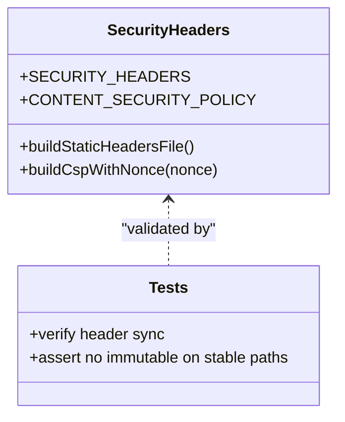

**Diagram sources**
- [config/security-headers.js:40-112](file://config/security-headers.js#L40-L112)
- [tests/security-header-regressions.test.js:26-73](file://tests/security-header-regressions.test.js#L26-L73)

**Section sources**
- [config/security-headers.js:40-112](file://config/security-headers.js#L40-L112)
- [tests/security-header-regressions.test.js:26-73](file://tests/security-header-regressions.test.js#L26-L73)

### Monitoring Core Web Vitals and Performance Budgets
- Real-user monitoring: web-vitals-reporter.js dynamically loads the web-vitals library and reports CLS, INP, LCP, FCP, TTFB to GA4 events after consent.
- CI performance budgets: Lighthouse CI asserts minimum scores for performance, SEO, and accessibility across key pages.

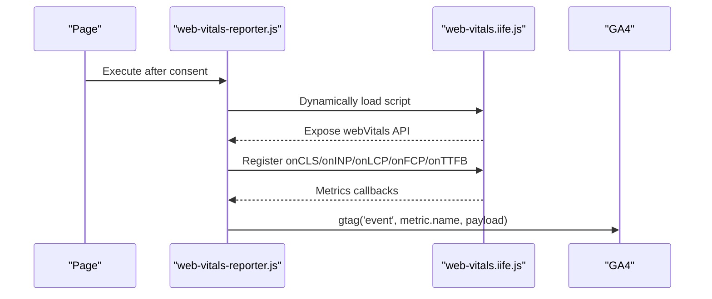

**Diagram sources**
- [js/web-vitals-reporter.js:1-33](file://js/web-vitals-reporter.js#L1-L33)
- [lighthouserc.js:1-28](file://lighthouserc.js#L1-L28)

**Section sources**
- [js/web-vitals-reporter.js:1-33](file://js/web-vitals-reporter.js#L1-L33)
- [lighthouserc.js:1-28](file://lighthouserc.js#L1-L28)

### Progressive Enhancement and Fallbacks
- Non-critical loader provides robust fallbacks:
  - Uses requestIdleCallback with setTimeout fallback for scheduling
  - Uses IntersectionObserver with idle fallback for viewport detection
  - Loads modules conditionally and retries with non-minified versions if minified fails
- Public HTML regression test ensures the progressive loader exists and is central to non-critical UI initialization.

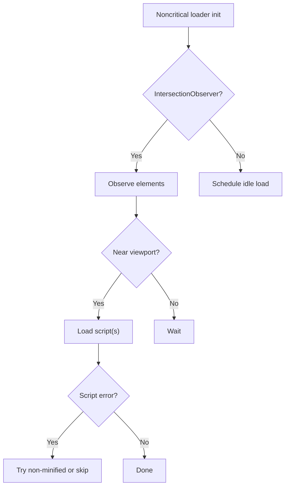

**Diagram sources**
- [js/noncritical-loader.js:62-90](file://js/noncritical-loader.js#L62-L90)
- [js/noncritical-loader.js:146-164](file://js/noncritical-loader.js#L146-L164)
- [tests/public-html-regressions.test.js:22-27](file://tests/public-html-regressions.test.js#L22-L27)

**Section sources**
- [js/noncritical-loader.js:1-166](file://js/noncritical-loader.js#L1-L166)
- [tests/public-html-regressions.test.js:22-27](file://tests/public-html-regressions.test.js#L22-L27)

## Dependency Analysis
Key dependencies and their roles:
- terser: JS minification
- lightningcss and clean-css: CSS transformation/minification with fallback
- html-minifier-terser: optional HTML minification
- sharp: image optimization (documented usage)
- express: static serving with cache headers
- cloudflare workers: deployment target for static assets

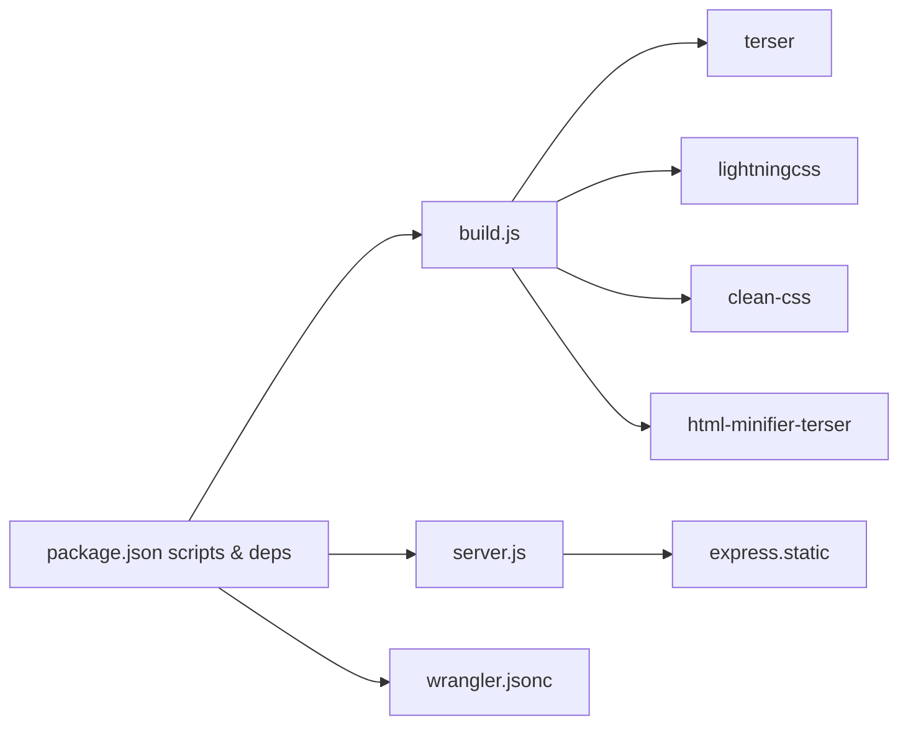

**Diagram sources**
- [package.json:6-90](file://package.json#L6-L90)
- [build.js:13-27](file://build.js#L13-L27)
- [server.js:458-481](file://server.js#L458-L481)
- [wrangler.jsonc:22-28](file://wrangler.jsonc#L22-L28)

**Section sources**
- [package.json:6-90](file://package.json#L6-L90)
- [build.js:13-27](file://build.js#L13-L27)
- [server.js:458-481](file://server.js#L458-L481)
- [wrangler.jsonc:22-28](file://wrangler.jsonc#L22-L28)

## Performance Considerations
- Prefer deferred and lazy loading for non-critical scripts and below-the-fold images to improve FCP/LCP.
- Use resource hints judiciously to reduce DNS/TLS overhead for third-party domains.
- Keep CSS render-blocking minimal; defer non-critical styles.
- Ensure assets are cached aggressively in production with bounded TTLs for stable filenames and longer TTLs for versioned assets.
- Monitor Core Web Vitals in production and enforce budgets in CI to prevent regressions.

[No sources needed since this section provides general guidance]

## Troubleshooting Guide
- If CSS/JS changes do not appear in production:
  - Verify version bumping for assets with query parameters and confirm Cloudflare Cache Rule for versioned assets is active.
  - Confirm static headers apply correct TTLs and that immutable is not set on stable paths unintentionally.
- If performance regresses:
  - Re-run Lighthouse CI assertions and inspect failures.
  - Validate that non-critical loader still exists and is referenced correctly.
- If security headers mismatch:
  - Regenerate static headers and verify synchronization via tests.

**Section sources**
- [docs/deploy/CLOUDFLARE-CONFIGURAZIONE-PASSO-PASSO.md:207-229](file://docs/deploy/CLOUDFLARE-CONFIGURAZIONE-PASSO-PASSO.md#L207-L229)
- [tests/security-header-regressions.test.js:26-73](file://tests/security-header-regressions.test.js#L26-L73)
- [tests/public-html-regressions.test.js:22-27](file://tests/public-html-regressions.test.js#L22-L27)
- [lighthouserc.js:1-28](file://lighthouserc.js#L1-L28)

## Conclusion
WebNovis implements a robust, maintainable performance pipeline: deterministic minification, progressive loading, strategic lazy loading, strong caching policies, and continuous performance enforcement. These measures collectively improve Core Web Vitals, reduce bandwidth, and provide a resilient user experience across devices and networks.

[No sources needed since this section summarizes without analyzing specific files]

## Appendices

### Build Commands and Artifacts
- Build and prepare artifact for deployment:
  - npm run build:site:dist
  - npm run deploy:site
- The artifact includes minified assets, generated HTML, and static headers synchronized from the shared policy.

**Section sources**
- [package.json:32-53](file://package.json#L32-L53)
- [scripts/prepare-public-artifact.js:183-233](file://scripts/prepare-public-artifact.js#L183-L233)