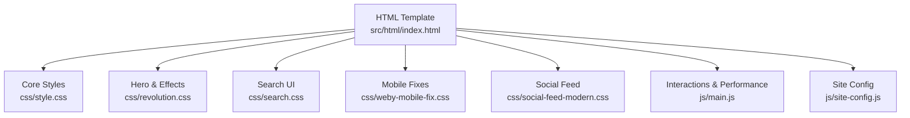
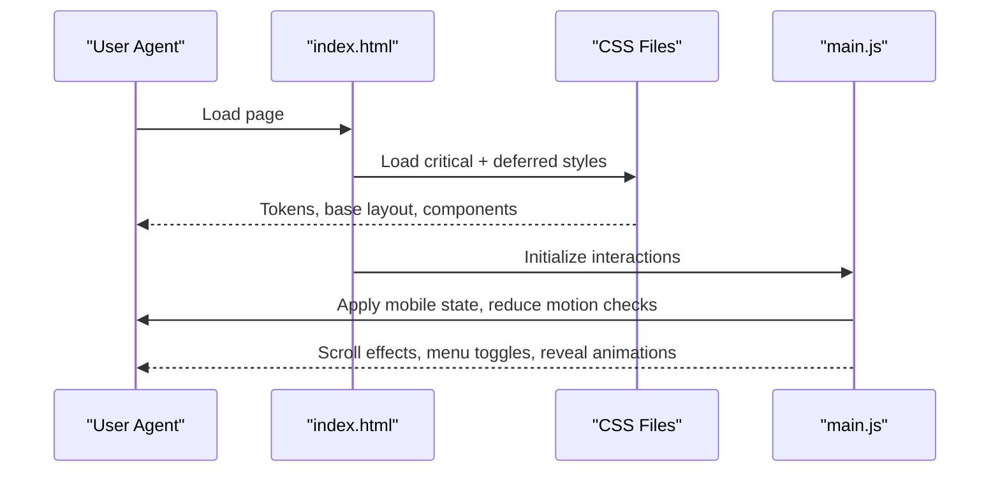
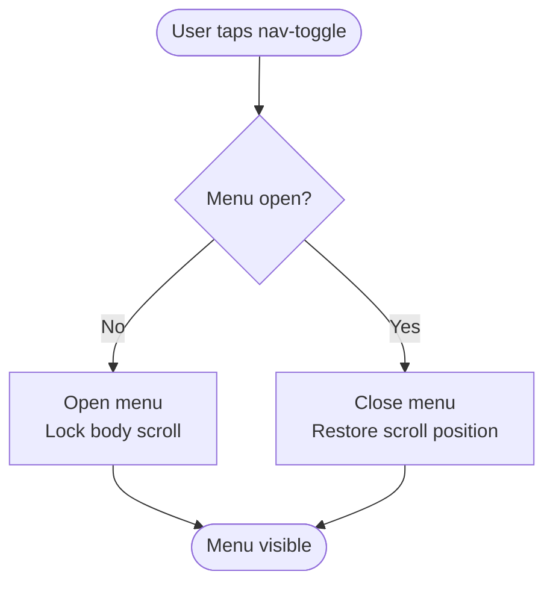
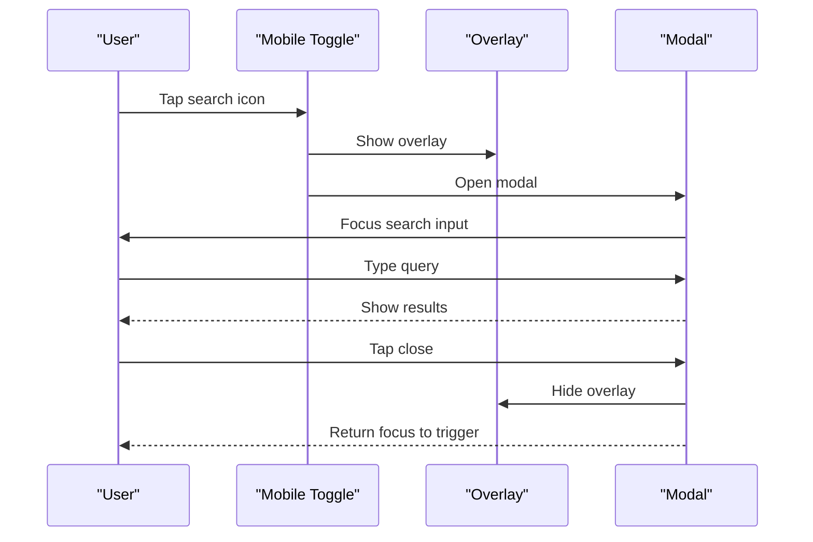
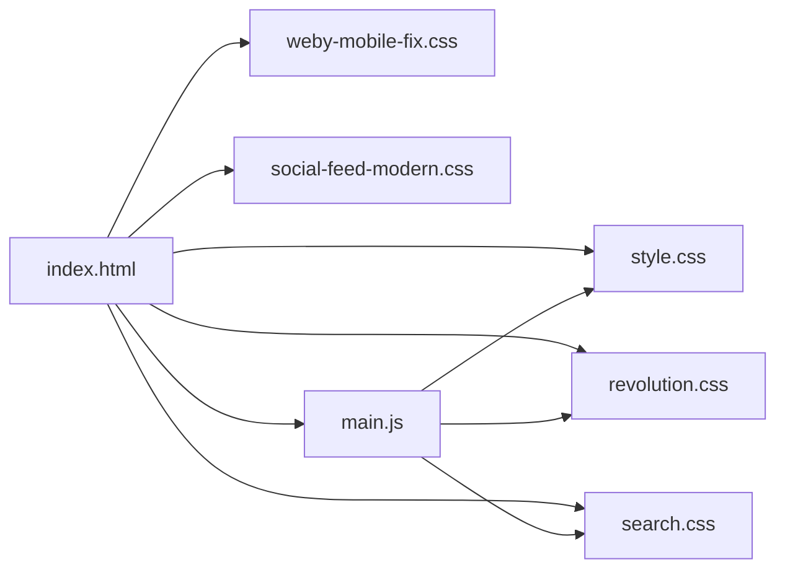

# Responsive Design System

<cite>
**Referenced Files in This Document**
- [style.css](file://css/style.css)
- [revolution.css](file://css/revolution.css)
- [search.css](file://css/search.css)
- [weby-mobile-fix.css](file://css/weby-mobile-fix.css)
- [social-feed-modern.css](file://css/social-feed-modern.css)
- [main.js](file://js/main.js)
- [site-config.js](file://js/site-config.js)
- [index.html](file://src/html/index.html)
</cite>

## Table of Contents
1. [Introduction](#introduction)
2. [Project Structure](#project-structure)
3. [Core Components](#core-components)
4. [Architecture Overview](#architecture-overview)
5. [Detailed Component Analysis](#detailed-component-analysis)
6. [Dependency Analysis](#dependency-analysis)
7. [Performance Considerations](#performance-considerations)
8. [Troubleshooting Guide](#troubleshooting-guide)
9. [Conclusion](#conclusion)

## Introduction
This document explains the WebNovis responsive design system with a focus on:
- Mobile-first layout and breakpoint strategy
- CSS custom properties for theming and consistent tokens
- Fluid typography and spacing
- Adaptive images and performance-conscious rendering
- Dark theme implementation via CSS variables
- Responsive components (navigation, search modal, social feed)
- Accessibility patterns such as focus management and touch-friendly interactions

The goal is to help developers understand how the site scales across devices while maintaining performance and accessibility.

## Project Structure
The responsive system is implemented primarily through:
- A central stylesheet defining tokens, base styles, and component styles
- Feature-specific stylesheets for hero/revolution effects, search UI, mobile fixes, and social feed
- JavaScript that enhances interactivity, manages scroll behavior, and optimizes animations based on device capabilities
- An HTML template that sets up critical resources, preloads, and semantic structure

**Diagram sources**
- [index.html:26-31](file://src/html/index.html#L26-L31)
- [style.css:168-334](file://css/style.css#L168-L334)
- [revolution.css:1-120](file://css/revolution.css#L1-L120)
- [search.css:1-120](file://css/search.css#L1-L120)
- [weby-mobile-fix.css:1-67](file://css/weby-mobile-fix.css#L1-L67)
- [social-feed-modern.css:1-120](file://css/social-feed-modern.css#L1-L120)
- [main.js:1-40](file://js/main.js#L1-L40)
- [site-config.js:1-19](file://js/site-config.js#L1-L19)

**Section sources**
- [index.html:26-31](file://src/html/index.html#L26-L31)
- [style.css:168-334](file://css/style.css#L168-L334)

## Core Components
- Theme tokens and fluid typography are centralized in CSS custom properties for consistency and easy overrides.
- Navigation adapts to mobile with a toggle and accessible attributes.
- Search has a desktop dropdown and a full-screen modal on small screens.
- Hero section uses an LCP-safe image and responsive background orbs.
- Social feed mockup demonstrates adaptive layouts and touch-friendly scrolling.

Key token categories include colors, gradients, typography, spacing, border radius, shadows, and animation durations/easings. These tokens power buttons, cards, sections, and interactive states.

**Section sources**
- [style.css:168-334](file://css/style.css#L168-L334)
- [style.css:458-473](file://css/style.css#L458-L473)
- [revolution.css:237-403](file://css/revolution.css#L237-L403)
- [search.css:1-120](file://css/search.css#L1-L120)
- [weby-mobile-fix.css:1-67](file://css/weby-mobile-fix.css#L1-L67)
- [social-feed-modern.css:1-120](file://css/social-feed-modern.css#L1-L120)

## Architecture Overview
The responsive architecture follows a mobile-first approach:
- Base styles define tokens and minimal layout.
- Media queries progressively enhance for tablet and desktop.
- JavaScript augments behavior only when appropriate (e.g., disabling heavy effects on reduced-motion or small screens).
- Critical CSS ensures fast first paint; non-critical styles load asynchronously.

**Diagram sources**
- [index.html:26-31](file://src/html/index.html#L26-L31)
- [main.js:1-40](file://js/main.js#L1-L40)
- [style.css:168-334](file://css/style.css#L168-L334)

## Detailed Component Analysis

### Breakpoint Strategy and Mobile-First Approach
- The codebase uses media queries to adapt layout at common breakpoints (e.g., 768px, 1024px), with mobile-first defaults.
- Navigation collapses into a toggle below 768px; search switches to a modal on mobile.
- Grids and columns stack vertically on smaller screens and expand on larger ones.

Examples:
- Navigation toggle visibility and search wrapper hiding on mobile.
- Search modal overlay and full-screen input on small screens.
- Social feed container sizing adjustments for tablets and phones.

**Section sources**
- [style.css:51-55](file://css/style.css#L51-L55)
- [search.css:613-787](file://css/search.css#L613-L787)
- [revolution.css:623-677](file://css/revolution.css#L623-L677)
- [social-feed-modern.css:224-365](file://css/social-feed-modern.css#L224-L365)

### CSS Custom Properties for Theming
- Centralized tokens define brand colors, neutrals, gradients, typography, spacing, radii, shadows, and animation timing.
- These variables enable consistent styling across components and simplify theme maintenance.
- Buttons, cards, and sections reference these tokens for color, spacing, and transitions.

Practical implications:
- Changing a single variable updates related components consistently.
- Token-based spacing and typography ensure rhythm and scale across breakpoints.

**Section sources**
- [style.css:168-334](file://css/style.css#L168-L334)
- [revolution.css:237-403](file://css/revolution.css#L237-L403)

### Fluid Typography Scaling
- Font sizes use clamp() to scale smoothly between min and max values based on viewport width.
- This avoids abrupt jumps at breakpoints and improves readability across devices.

Where used:
- Hero titles and subtitles
- Section headings and descriptions
- Utility text classes

**Section sources**
- [style.css:232-242](file://css/style.css#L232-L242)
- [revolution.css:151-175](file://css/revolution.css#L151-L175)
- [revolution.css:223-233](file://css/revolution.css#L223-L233)

### Adaptive Image Handling
- The hero uses a picture element with media-specific sources to serve optimized images per screen size.
- Preloading strategies prioritize the LCP image and defer non-critical assets.
- Images within the social feed use srcset/sizes for responsive delivery.

Benefits:
- Faster initial render and better Core Web Vitals
- Reduced bandwidth on smaller devices

**Section sources**
- [index.html:26-28](file://src/html/index.html#L26-L28)
- [index.html:63-68](file://src/html/index.html#L63-L68)
- [social-feed-modern.css:128-145](file://css/social-feed-modern.css#L128-L145)

### Dark Theme Implementation
- The default theme is dark, driven by CSS variables for backgrounds, surfaces, and text.
- Tokens provide contrast-safe text and accent colors.
- Site configuration exposes a theme setting for external widgets (e.g., Turnstile).

Notes:
- No automatic light/dark switching was found in the analyzed files; the system is designed around a dark theme with robust tokens.

**Section sources**
- [style.css:168-214](file://css/style.css#L168-L214)
- [site-config.js:10-18](file://js/site-config.js#L10-L18)

### Responsive Components

#### Navigation
- Desktop shows a horizontal menu; mobile hides it behind a toggle button.
- Accessible attributes manage expanded state and focus behavior.
- Smooth scroll anchors adjust for fixed navigation height.

**Diagram sources**
- [main.js:61-121](file://js/main.js#L61-L121)
- [style.css:483-629](file://css/style.css#L483-L629)

**Section sources**
- [main.js:61-121](file://js/main.js#L61-L121)
- [style.css:483-629](file://css/style.css#L483-L629)

#### Search
- Desktop: inline search bar with dropdown results.
- Mobile: full-screen modal with accessible header, close button, and keyboard support.
- Focus management ensures predictable tab order and clear exit paths.

**Diagram sources**
- [search.css:549-787](file://css/search.css#L549-L787)
- [index.html:40-62](file://src/html/index.html#L40-L62)

**Section sources**
- [search.css:1-120](file://css/search.css#L1-L120)
- [search.css:549-787](file://css/search.css#L549-L787)
- [index.html:40-62](file://src/html/index.html#L40-L62)

#### Social Feed
- Phone mockup adapts size and content density on different screens.
- Touch-friendly scrolling with snap points and hidden scrollbars.
- Aspect ratios and padding adjust for readability on small devices.

**Section sources**
- [social-feed-modern.css:1-120](file://css/social-feed-modern.css#L1-L120)
- [social-feed-modern.css:224-365](file://css/social-feed-modern.css#L224-L365)

#### Hero Section
- Uses an LCP-safe image to improve performance metrics.
- Background orbs animate subtly; reduced on mobile to avoid layout shifts.
- CTA buttons stack vertically on narrow screens.

**Section sources**
- [index.html:63-75](file://src/html/index.html#L63-L75)
- [revolution.css:1-120](file://css/revolution.css#L1-L120)
- [revolution.css:623-677](file://css/revolution.css#L623-L677)

## Dependency Analysis
- index.html loads core and feature CSS files, deferring non-critical styles.
- main.js depends on DOM elements defined in the HTML and applies enhancements conditionally.
- CSS files share tokens from style.css; feature sheets extend or override where needed.

**Diagram sources**
- [index.html:26-31](file://src/html/index.html#L26-L31)
- [main.js:1-40](file://js/main.js#L1-L40)

**Section sources**
- [index.html:26-31](file://src/html/index.html#L26-L31)
- [main.js:1-40](file://js/main.js#L1-L40)

## Performance Considerations
- Critical CSS inlined to prevent FOUC and ensure fast first paint.
- LCP image prioritized and served via picture element with media queries.
- Non-critical styles loaded asynchronously using print media trick.
- Animations and heavy effects are gated by reduced-motion preferences and device capability checks.
- Scroll handlers are throttled via requestAnimationFrame and passive listeners.

Recommendations:
- Keep clamp-based typography to avoid layout shifts.
- Prefer transform-based animations for smoothness.
- Use IntersectionObserver to lazy-load non-critical visuals.

**Section sources**
- [index.html:26-31](file://src/html/index.html#L26-L31)
- [index.html:63-68](file://src/html/index.html#L63-L68)
- [main.js:178-284](file://js/main.js#L178-L284)
- [main.js:430-550](file://js/main.js#L430-L550)

## Troubleshooting Guide
Common issues and resolutions:
- Mobile menu not closing: Ensure aria-expanded toggles and body scroll lock/unlock logic execute on link clicks and close button actions.
- Search modal focus trap: Confirm focus moves to the input on open and returns to the trigger on close; verify overlay click closes the modal.
- Hero LCP warnings: Verify the LCP image is present in the DOM and not hidden via opacity or transforms at load time.
- Excessive animations on low-power devices: Respect prefers-reduced-motion and disable heavy effects like particles or parallax on mobile.

**Section sources**
- [main.js:61-121](file://js/main.js#L61-L121)
- [search.css:549-787](file://css/search.css#L549-L787)
- [index.html:63-68](file://src/html/index.html#L63-L68)
- [main.js:430-550](file://js/main.js#L430-L550)

## Conclusion
WebNovis implements a robust, mobile-first responsive design system centered on CSS custom properties, fluid typography, and adaptive images. The architecture separates concerns across modular CSS files and a focused JavaScript layer that enhances interactivity while respecting performance and accessibility. By following the documented patterns—mobile-first media queries, token-driven theming, and careful resource loading—you can maintain consistency, speed, and usability across all devices.