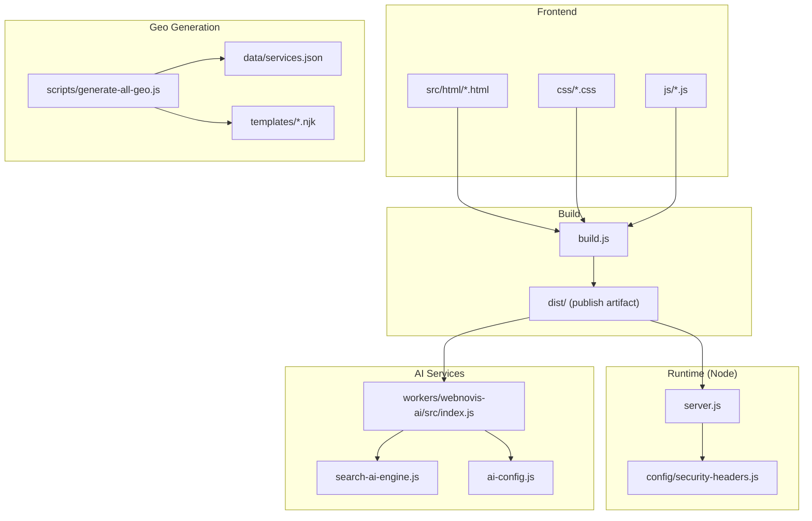
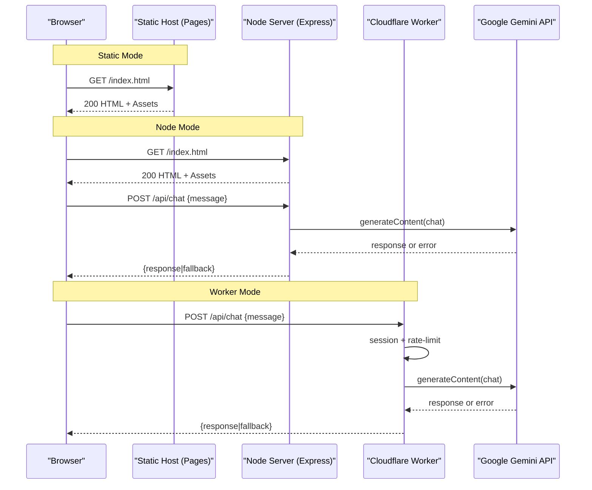
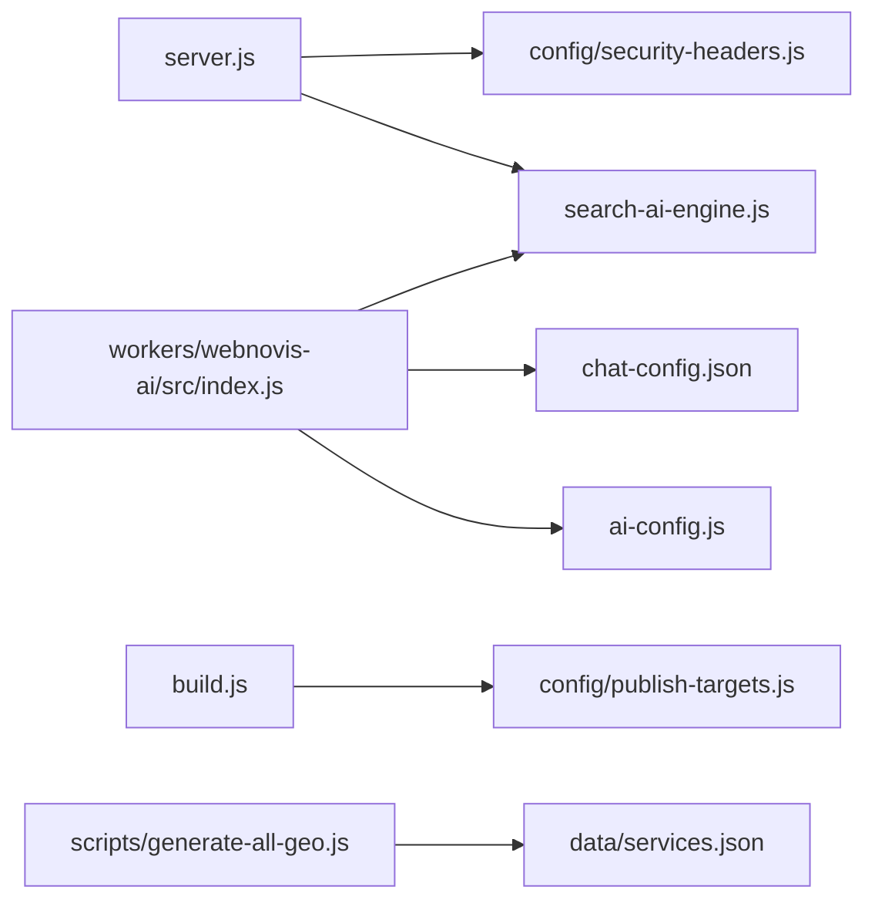

# Project Overview

<cite>
**Referenced Files in This Document**
- [README.md](file://README.md)
- [package.json](file://package.json)
- [server.js](file://server.js)
- [build.js](file://build.js)
- [ai-config.js](file://ai-config.js)
- [chat-config.json](file://chat-config.json)
- [wrangler.jsonc](file://wrangler.jsonc)
- [workers/webnovis-ai/src/index.js](file://workers/webnovis-ai/src/index.js)
- [search-ai-engine.js](file://search-ai-engine.js)
- [config/security-headers.js](file://config/security-headers.js)
- [scripts/generate-all-geo.js](file://scripts/generate-all-geo.js)
- [data/services.json](file://data/services.json)
- [config/publish-targets.js](file://config/publish-targets.js)
</cite>

## Table of Contents
1. [Introduction](#introduction)
2. [Project Structure](#project-structure)
3. [Core Components](#core-components)
4. [Architecture Overview](#architecture-overview)
5. [Detailed Component Analysis](#detailed-component-analysis)
6. [Dependency Analysis](#dependency-analysis)
7. [Performance Considerations](#performance-considerations)
8. [Troubleshooting Guide](#troubleshooting-guide)
9. [Conclusion](#conclusion)
10. [Appendices](#appendices)

## Introduction
WebNovis is a professional digital agency website that showcases Web Development, Graphic Design, and Social Media services with an AI-powered chatbot and intelligent search. It supports two deployment modes:
- Static mode for platforms like GitHub Pages or Cloudflare Pages (HTML/CSS/JS only; no backend endpoints).
- Node.js mode with Express to enable AI features, newsletter automation, security headers, canonical redirects, and more.

The site emphasizes geo-targeted content generation for local SEO, robust build tooling, and secure runtime behavior. The AI layer integrates Google Gemini models via both a Node server and a Cloudflare Worker, providing resilient fallbacks and caching.

What it is and why it was built:
- A modern, responsive digital agency site with advanced UX and performance.
- An AI assistant (“Weby”) to qualify leads and answer service-related questions.
- Intelligent search grounded in the site’s own corpus to reduce hallucinations.
- Geo pages at scale to capture local intent across multiple cities and services.

Practical examples:
- Static deployment: run npm run build and deploy the root folder to GitHub Pages or Cloudflare Pages.
- Backend features: set environment variables, start the Node server, and point the frontend to /api endpoints.

**Section sources**
- [README.md:1-120](file://README.md#L1-L120)
- [README.md:120-220](file://README.md#L120-L220)
- [README.md:220-318](file://README.md#L220-L318)

## Project Structure
At a high level:
- Frontend assets: HTML templates under src/html, CSS under css, JS under js, images under Img.
- Build pipeline: build.js minifies JS/CSS, optionally minifies HTML, and applies SEO transforms.
- Runtime server: server.js serves static files, handles API routes, and enforces security and SEO rules.
- AI services: workers/webnovis-ai provides a Cloudflare Worker for chat/search; search-ai-engine powers search logic.
- Geo generator: scripts/generate-all-geo.js produces pSEO pages from data/services.json and templates.
- Configuration: ai-config.js centralizes model names and parameters; config/security-headers.js defines CSP and headers; wrangler.jsonc configures Cloudflare Workers assets.

**Diagram sources**
- [build.js:1-120](file://build.js#L1-L120)
- [server.js:440-530](file://server.js#L440-L530)
- [workers/webnovis-ai/src/index.js:1-60](file://workers/webnovis-ai/src/index.js#L1-L60)
- [search-ai-engine.js:1-60](file://search-ai-engine.js#L1-L60)
- [ai-config.js:1-38](file://ai-config.js#L1-L38)
- [scripts/generate-all-geo.js:1-58](file://scripts/generate-all-geo.js#L1-L58)
- [data/services.json:1-60](file://data/services.json#L1-L60)

**Section sources**
- [build.js:1-120](file://build.js#L1-L120)
- [server.js:440-530](file://server.js#L440-L530)
- [wrangler.jsonc:1-30](file://wrangler.jsonc#L1-L30)
- [config/publish-targets.js:1-37](file://config/publish-targets.js#L1-L37)

## Core Components
- Dual deployment modes:
  - Static-only: serve HTML/CSS/JS without backend APIs.
  - Node.js Express server: enables /api/chat, /api/search-ai, newsletter endpoints, canonical redirects, and security headers.
- AI-powered chatbot:
  - Local responses by default; optional Gemini integration when keys are configured.
  - Session management and prompt injection guards.
- Intelligent search:
  - In-memory search engine over a JSON corpus with query normalization, tokenization, and scoring.
  - Fallback responses when AI is unavailable or quota exceeded.
- Geo-targeted content generation:
  - Generates “Agenzia Web” and “Realizzazione Siti Web” pages per city/service using centralized data and Nunjucks templates.
- Security and SEO:
  - Strict CSP, HSTS, X-Robots-Tag, trailing-slash normalization, UTM stripping, bot logging, and canonical redirects.

Key configuration:
- ai-config.js centralizes model names and generation parameters.
- chat-config.json contains company info, services catalog, and chatbot instructions.
- config/security-headers.js defines CSP directives and helper functions.

**Section sources**
- [README.md:47-60](file://README.md#L47-L60)
- [ai-config.js:1-38](file://ai-config.js#L1-L38)
- [chat-config.json:1-109](file://chat-config.json#L1-L109)
- [config/security-headers.js:1-113](file://config/security-headers.js#L1-L113)
- [search-ai-engine.js:1-120](file://search-ai-engine.js#L1-L120)
- [scripts/generate-all-geo.js:1-58](file://scripts/generate-all-geo.js#L1-L58)

## Architecture Overview
The system supports two primary runtime paths:

- Static path:
  - Build artifacts (dist/) are served directly by static hosts (GitHub Pages, Cloudflare Pages).
  - No /api endpoints; chatbot uses local responses; search falls back to prebuilt index.

- Node.js path:
  - Express server serves static assets and exposes /api endpoints.
  - AI calls go to Google Gemini via server-side fetch with rate limiting, quota tracking, and prompt-injection protection.
  - Search AI uses search-ai-engine to retrieve relevant docs and build prompts.

- Cloudflare Worker path:
  - A separate worker exposes /api/chat, /api/search-ai, /api/chat-lead with KV-backed sessions and caching.
  - Uses the same search engine logic and Gemini models with fallbacks.

**Diagram sources**
- [server.js:740-820](file://server.js#L740-L820)
- [workers/webnovis-ai/src/index.js:266-368](file://workers/webnovis-ai/src/index.js#L266-L368)
- [search-ai-engine.js:200-270](file://search-ai-engine.js#L200-L270)
- [ai-config.js:1-38](file://ai-config.js#L1-L38)

## Detailed Component Analysis

### Node.js Server (Express)
Responsibilities:
- Serves core public HTML files and directories with appropriate cache headers.
- Implements SEO middleware stack: canonical host redirect, security headers, X-Robots-Tag, trailing slash normalization, UTM stripping, legacy redirects, bot logging.
- Provides /api/chat and /api/search-ai endpoints with rate limiting, prompt injection guards, session store, and Gemini integration.
- Tracks API quotas per key and warns near limits.

Key behaviors:
- Static asset serving with immutable caching in production.
- HTML directories served with short TTL and stale-while-revalidate.
- AI search uses search-ai-engine to retrieve documents and build prompts; caches results and deduplicates concurrent requests.

Security:
- CORS allowlist based on env and defaults.
- IP anonymization for GDPR compliance.
- Prompt injection detection patterns block malicious inputs.

**Section sources**
- [server.js:224-330](file://server.js#L224-L330)
- [server.js:330-440](file://server.js#L330-L440)
- [server.js:440-530](file://server.js#L440-L530)
- [server.js:740-820](file://server.js#L740-L820)
- [config/security-headers.js:1-113](file://config/security-headers.js#L1-L113)

### Cloudflare Worker (AI API)
Responsibilities:
- Exposes /api/chat, /api/search-ai, /api/chat-lead.
- Manages sessions via KV, rate limiting, and caching.
- Calls Gemini with primary/fallback models and returns sanitized responses.
- Integrates Brevo email notifications for lead capture.

Key behaviors:
- CORS handling with configurable origins.
- Anonymized client IP extraction.
- Robust JSON parsing with fallback extraction for truncated outputs.

**Section sources**
- [workers/webnovis-ai/src/index.js:1-120](file://workers/webnovis-ai/src/index.js#L1-L120)
- [workers/webnovis-ai/src/index.js:266-368](file://workers/webnovis-ai/src/index.js#L266-L368)
- [workers/webnovis-ai/src/index.js:370-440](file://workers/webnovis-ai/src/index.js#L370-L440)
- [workers/webnovis-ai/src/index.js:442-506](file://workers/webnovis-ai/src/index.js#L442-L506)

### Intelligent Search Engine
Responsibilities:
- Loads corpus from search-index.json or search-ai-index.json.
- Normalizes text, tokenizes queries, infers intent, and scores documents.
- Builds prompts for Gemini and constructs fallback responses.
- Sanitizes results to allowed URLs and deduplicates suggestions.

Complexity considerations:
- Tokenization and scoring operate over a fixed corpus; typical queries are fast due to in-memory sets and normalized fields.
- Caching and deduplication reduce redundant API calls.

**Section sources**
- [search-ai-engine.js:1-120](file://search-ai-engine.js#L1-L120)
- [search-ai-engine.js:200-270](file://search-ai-engine.js#L200-L270)
- [search-ai-engine.js:270-397](file://search-ai-engine.js#L270-L397)

### Geo Page Generator (pSEO)
Responsibilities:
- Generates “Agenzia Web a {City}” and “Realizzazione Siti Web a {City}” pages.
- Uses centralized data (data/services.json) and Nunjucks templates.
- Produces internal linking graphs, JSON-LD schemas, and validation metrics.

Usage:
- Run node scripts/generate-all-geo.js with flags for dry-run, validate-only, type selection, and output directory.

**Section sources**
- [scripts/generate-all-geo.js:1-58](file://scripts/generate-all-geo.js#L1-L58)
- [data/services.json:1-200](file://data/services.json#L1-L200)

### Build Pipeline
Responsibilities:
- Minifies JS with Terser and CSS with Lightning CSS (fallback to CleanCSS).
- Optionally minifies HTML from src/html and applies SEO transforms.
- Discovers assets referenced by HTML and builds deterministic outputs.

Outputs:
- dist/ folder for publishing; can be directed via --out-dir or PUBLISH_DIR.

**Section sources**
- [build.js:1-120](file://build.js#L1-L120)
- [build.js:373-496](file://build.js#L373-L496)
- [config/publish-targets.js:1-37](file://config/publish-targets.js#L1-L37)

### Deployment Modes
- Static mode:
  - Deploy root or dist/ to GitHub Pages or Cloudflare Pages.
  - No /api endpoints; chatbot uses local responses; search falls back to index.
- Node.js mode:
  - Start server.js with environment variables for Gemini/Brevo.
  - Enables AI endpoints, newsletter automation, and enhanced security headers.
- Cloudflare Workers:
  - Deploy worker with wrangler.jsonc; assets served from dist/.
  - html_handling set to "none" to preserve .html URLs.

**Section sources**
- [README.md:53-120](file://README.md#L53-L120)
- [wrangler.jsonc:1-30](file://wrangler.jsonc#L1-L30)
- [package.json:6-60](file://package.json#L6-L60)

## Dependency Analysis
High-level relationships:
- server.js depends on express, cors, compression, dotenv, node-fetch, nunjucks, and custom modules for security headers and pSEO governance.
- workers/webnovis-ai/src/index.js depends on search-ai-engine.js and chat-config.json.
- search-ai-engine.js loads search indices and provides shared utilities.
- build.js depends on terser, lightningcss/cleancss, and html-minifier-terser.
- scripts/generate-all-geo.js orchestrates geo page generation using data/services.json and templates.

**Diagram sources**
- [server.js:1-20](file://server.js#L1-L20)
- [workers/webnovis-ai/src/index.js:1-20](file://workers/webnovis-ai/src/index.js#L1-L20)
- [search-ai-engine.js:1-20](file://search-ai-engine.js#L1-L20)
- [build.js:1-30](file://build.js#L1-L30)
- [scripts/generate-all-geo.js:1-30](file://scripts/generate-all-geo.js#L1-L30)

**Section sources**
- [package.json:69-90](file://package.json#L69-L90)
- [server.js:1-20](file://server.js#L1-L20)
- [workers/webnovis-ai/src/index.js:1-20](file://workers/webnovis-ai/src/index.js#L1-L20)
- [build.js:1-30](file://build.js#L1-L30)

## Performance Considerations
- Compression enabled in Node server reduces transfer size for text assets.
- Static assets use immutable caching in production; HTML uses short TTL with stale-while-revalidate.
- Search AI includes in-memory cache and request deduplication to minimize API calls.
- Build pipeline minifies JS/CSS and optionally HTML, improving load times.
- Cloudflare Workers leverage KV for session and search caching.

[No sources needed since this section provides general guidance]

## Troubleshooting Guide
Common issues and resolutions:
- Chatbot not responding:
  - Verify chat.js is loaded and endpoint configuration matches your deployment mode.
  - Check browser console for errors; ensure API keys are set if using backend.
- Animations not working:
  - Ensure main.js is loaded and compatible with the browser.
- Layout broken on mobile:
  - Validate viewport meta tag and media queries.
- AI endpoints blocked:
  - Confirm CORS origins and rate limits; check quota warnings and daily caps.
- Geo pages missing:
  - Re-run geo generator with --dry-run and --validate-only to diagnose.

**Section sources**
- [README.md:251-318](file://README.md#L251-L318)
- [server.js:224-330](file://server.js#L224-L330)
- [scripts/generate-all-geo.js:1-58](file://scripts/generate-all-geo.js#L1-L58)

## Conclusion
WebNovis combines a modern static-first architecture with optional Node.js and Cloudflare Worker capabilities to deliver an AI-powered digital agency experience. Its dual deployment modes, robust build pipeline, intelligent search, and scalable geo page generation make it suitable for both simple hosting and advanced feature sets. Security, SEO, and performance are prioritized throughout the stack.

[No sources needed since this section summarizes without analyzing specific files]

## Appendices

### Practical Examples
- Static deployment:
  - Build: npm run build
  - Deploy root or dist/ to GitHub Pages or Cloudflare Pages.
- Enable backend features:
  - Set GEMINI_API_KEY_CHAT, GEMINI_API_KEY_SEARCH, BREVO_API_KEY in .env.
  - Start server: npm start
  - Point frontend to /api endpoints.
- Deploy Cloudflare Worker:
  - Prepare data: npm run ai:prepare
  - Deploy: npm run ai:deploy
  - Configure wrangler.jsonc assets directory and html_handling.

**Section sources**
- [README.md:60-120](file://README.md#L60-L120)
- [package.json:6-60](file://package.json#L6-L60)
- [wrangler.jsonc:1-30](file://wrangler.jsonc#L1-L30)