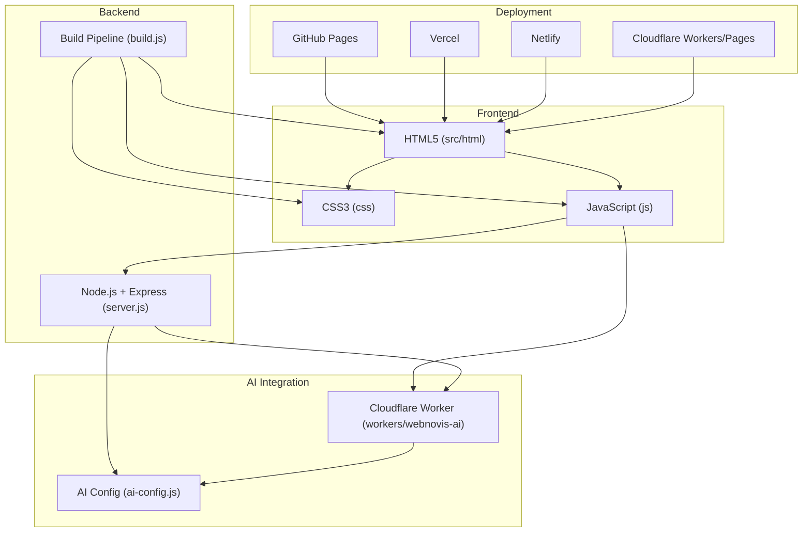
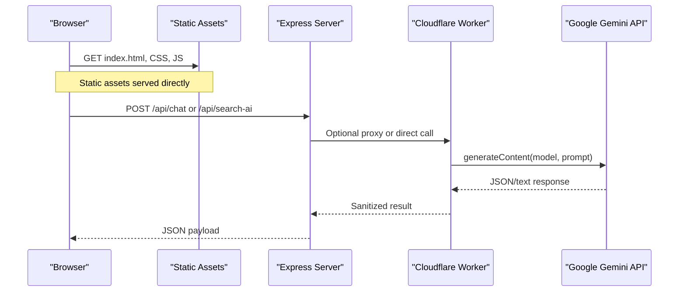
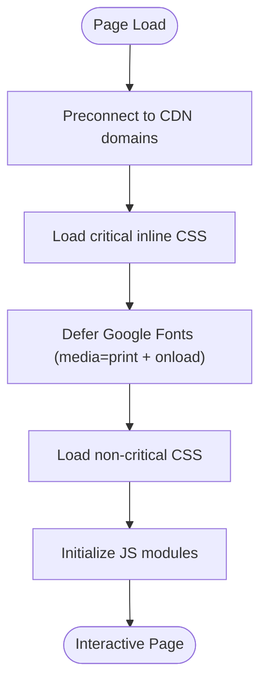
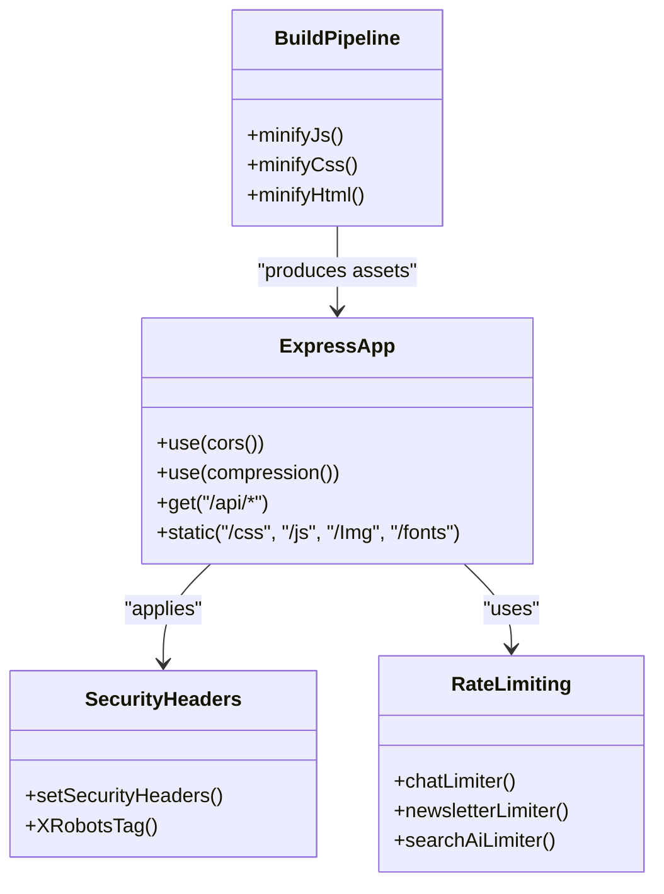
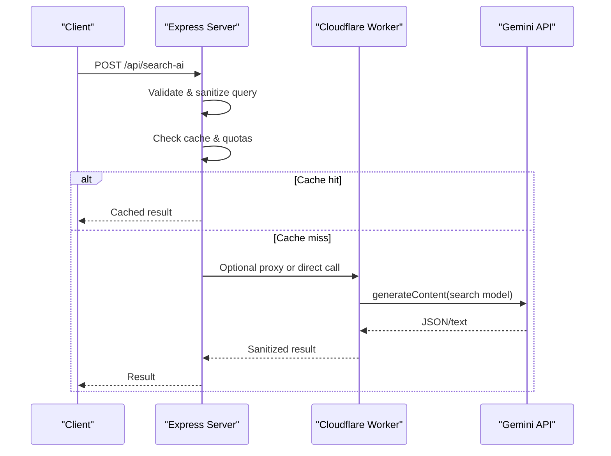
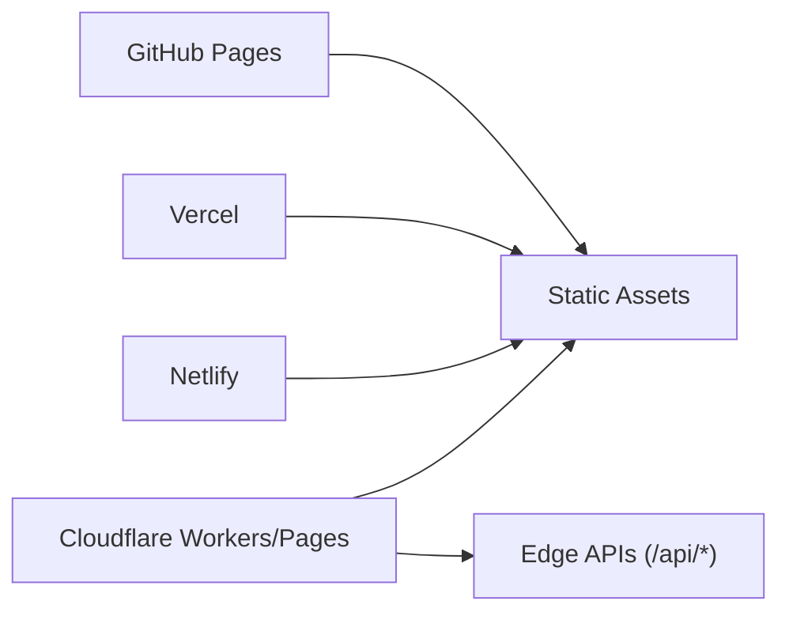
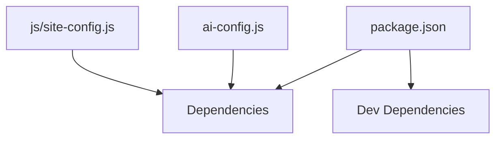

# Technology Stack

<cite>
**Referenced Files in This Document**
- [package.json](file://package.json)
- [README.md](file://README.md)
- [server.js](file://server.js)
- [build.js](file://build.js)
- [ai-config.js](file://ai-config.js)
- [wrangler.jsonc](file://wrangler.jsonc)
- [src/html/index.html](file://src/html/index.html)
- [css/style.css](file://css/style.css)
- [js/site-config.js](file://js/site-config.js)
- [workers/webnovis-ai/src/index.js](file://workers/webnovis-ai/src/index.js)
</cite>

## Table of Contents
1. [Introduction](#introduction)
2. [Project Structure](#project-structure)
3. [Core Components](#core-components)
4. [Architecture Overview](#architecture-overview)
5. [Detailed Component Analysis](#detailed-component-analysis)
6. [Dependency Analysis](#dependency-analysis)
7. [Performance Considerations](#performance-considerations)
8. [Troubleshooting Guide](#troubleshooting-guide)
9. [Conclusion](#conclusion)
10. [Appendices](#appendices)

## Introduction
This section documents the WebNovis technology stack and explains how frontend, backend, AI integration, and deployment platforms work together to deliver both static and dynamic functionality. The site supports two runtime modes:
- Static mode (GitHub Pages, Netlify): serves HTML/CSS/JS only; server endpoints are not available.
- Node mode (Express): enables API features such as AI chat/search, newsletter operations, security headers, canonical redirects, and build-time optimizations.

The stack emphasizes performance, accessibility, and maintainability with a modern but lightweight toolchain.

**Section sources**
- [README.md:33-58](file://README.md#L33-L58)

## Project Structure
At a high level:
- Frontend assets live under src/html, css, js, and Img.
- Backend server is implemented in server.js using Express.
- Build pipeline is defined in build.js for JS/CSS minification and HTML optimization.
- AI configuration is centralized in ai-config.js and consumed by both server and workers.
- Cloudflare Workers provide edge APIs via workers/webnovis-ai.
- Deployment targets include GitHub Pages, Vercel, Netlify, and Cloudflare Workers/Pages.

**Diagram sources**
- [server.js:1-20](file://server.js#L1-L20)
- [build.js:1-30](file://build.js#L1-L30)
- [ai-config.js:1-38](file://ai-config.js#L1-L38)
- [wrangler.jsonc:1-30](file://wrangler.jsonc#L1-L30)
- [src/html/index.html:1-35](file://src/html/index.html#L1-L35)

**Section sources**
- [README.md:192-216](file://README.md#L192-L216)
- [wrangler.jsonc:1-30](file://wrangler.jsonc#L1-L30)

## Core Components
- Frontend:
  - HTML5 semantic structure and meta tags for SEO and social sharing.
  - CSS3 with custom properties, responsive layouts, and deferred styles for performance.
  - JavaScript for interactivity, search, and analytics; no heavy frameworks.
- Backend:
  - Node.js with Express for optional server-side features (APIs, headers, redirects).
  - Build script for minifying JS/CSS and optimizing HTML output.
- AI Integration:
  - Google Gemini API used for chatbot responses and intelligent search.
  - Centralized model selection and parameters in ai-config.js.
  - Edge API via Cloudflare Workers for low-latency interactions.
- Deployment:
  - Static hosting on GitHub Pages, Vercel, Netlify.
  - Edge/static hosting on Cloudflare Workers/Pages with explicit asset handling.

**Section sources**
- [package.json:69-77](file://package.json#L69-L77)
- [package.json:78-90](file://package.json#L78-L90)
- [README.md:33-58](file://README.md#L33-L58)
- [ai-config.js:1-38](file://ai-config.js#L1-L38)
- [wrangler.jsonc:1-30](file://wrangler.jsonc#L1-L30)

## Architecture Overview
The system operates in two primary modes:

- Static Mode:
  - Serves prebuilt HTML/CSS/JS from static hosts.
  - No server endpoints; client-side logic handles UI and local fallbacks.
- Node Mode:
  - Express server provides APIs for AI chat/search, newsletter, and security headers.
  - Canonical redirects, trailing slash normalization, and bot logging.
  - Compression and caching headers optimized for production.

**Diagram sources**
- [server.js:224-287](file://server.js#L224-L287)
- [server.js:643-800](file://server.js#L643-L800)
- [workers/webnovis-ai/src/index.js:198-247](file://workers/webnovis-ai/src/index.js#L198-L247)
- [workers/webnovis-ai/src/index.js:266-368](file://workers/webnovis-ai/src/index.js#L266-L368)
- [workers/webnovis-ai/src/index.js:370-440](file://workers/webnovis-ai/src/index.js#L370-L440)

**Section sources**
- [README.md:53-58](file://README.md#L53-L58)
- [server.js:224-287](file://server.js#L224-L287)
- [server.js:458-526](file://server.js#L458-L526)

## Detailed Component Analysis

### Frontend Technologies
- HTML5:
  - Semantic markup, meta tags for SEO/social, preconnect/preload for fonts and critical resources.
  - Uses media queries and responsive patterns for mobile-first design.
- CSS3:
  - Custom properties, grid/flexbox layouts, animations, deferred styles for performance.
  - Fallback font metrics to prevent layout shifts during font loading.
- JavaScript:
  - Vanilla JS for interactivity; no heavy frameworks.
  - Search, chat, and non-critical loaders improve performance and user experience.
- Fonts and Icons:
  - Google Fonts loaded asynchronously via print media and onload switching.
  - Inline SVGs used for icons to avoid extra requests; Font Awesome is listed as part of the ecosystem in documentation.

**Diagram sources**
- [src/html/index.html:26-31](file://src/html/index.html#L26-L31)
- [css/style.css:150-153](file://css/style.css#L150-L153)

**Section sources**
- [src/html/index.html:1-35](file://src/html/index.html#L1-L35)
- [css/style.css:1-50](file://css/style.css#L1-L50)
- [css/style.css:150-153](file://css/style.css#L150-L153)
- [README.md:33-46](file://README.md#L33-L46)

### Backend Technologies
- Node.js + Express:
  - Provides optional server-side features: API endpoints, security headers, canonical redirects, compression, caching.
  - Rate limiting for chat/search/newsletter endpoints.
  - Bot detection logging and IP anonymization for privacy compliance.
- Build Pipeline:
  - Minifies JS with Terser and CSS with Lightning CSS (fallback to CleanCSS).
  - Applies SEO transforms and HTML minification for source pages.

**Diagram sources**
- [server.js:224-287](file://server.js#L224-L287)
- [server.js:252-262](file://server.js#L252-L262)
- [server.js:625-641](file://server.js#L625-L641)
- [build.js:31-113](file://build.js#L31-L113)
- [build.js:290-371](file://build.js#L290-L371)
- [build.js:428-493](file://build.js#L428-L493)

**Section sources**
- [server.js:224-287](file://server.js#L224-L287)
- [server.js:458-526](file://server.js#L458-L526)
- [build.js:1-30](file://build.js#L1-L30)
- [build.js:31-113](file://build.js#L31-L113)
- [build.js:290-371](file://build.js#L290-L371)
- [build.js:428-493](file://build.js#L428-L493)

### AI Integration (Google Gemini API)
- Model Selection:
  - Centralized in ai-config.js with primary and fallback models for chat and search.
- Server-Side Usage:
  - Express routes call Gemini with rate limiting, quota tracking, and prompt injection guards.
  - In-memory cache and deduplication reduce redundant API calls.
- Edge Usage:
  - Cloudflare Worker exposes /api/chat and /api/search-ai with KV-based caching and rate limiting.
  - Local fallback responses when API keys are missing or errors occur.

**Diagram sources**
- [ai-config.js:1-38](file://ai-config.js#L1-L38)
- [server.js:643-800](file://server.js#L643-L800)
- [workers/webnovis-ai/src/index.js:370-440](file://workers/webnovis-ai/src/index.js#L370-L440)

**Section sources**
- [ai-config.js:1-38](file://ai-config.js#L1-L38)
- [server.js:180-220](file://server.js#L180-L220)
- [server.js:643-800](file://server.js#L643-L800)
- [workers/webnovis-ai/src/index.js:198-247](file://workers/webnovis-ai/src/index.js#L198-L247)
- [workers/webnovis-ai/src/index.js:266-368](file://workers/webnovis-ai/src/index.js#L266-L368)

### Deployment Platforms
- GitHub Pages:
  - Static-only mode; server endpoints unavailable.
- Vercel:
  - Supports static deployments; can also run serverless functions if configured.
- Netlify:
  - Static site publishing with simple build/publish settings.
- Cloudflare Workers/Pages:
  - Explicit asset directory and html_handling set to preserve .html URLs.
  - Edge APIs for AI features with KV storage and rate limiting.

**Diagram sources**
- [README.md:95-122](file://README.md#L95-L122)
- [wrangler.jsonc:1-30](file://wrangler.jsonc#L1-L30)

**Section sources**
- [README.md:95-122](file://README.md#L95-L122)
- [wrangler.jsonc:1-30](file://wrangler.jsonc#L1-L30)

## Dependency Analysis
- Runtime dependencies:
  - Express, cors, compression, dotenv, node-fetch, express-rate-limit, nunjucks.
- Dev dependencies:
  - terser, lightningcss/clean-css, html-minifier-terser, vitest, wrangler, sharp.
- Configuration:
  - ai-config.js centralizes model names and parameters.
  - site-config.js exposes public runtime config for forms and Turnstile.

**Diagram sources**
- [package.json:69-90](file://package.json#L69-L90)
- [ai-config.js:1-38](file://ai-config.js#L1-L38)
- [js/site-config.js:1-19](file://js/site-config.js#L1-L19)

**Section sources**
- [package.json:69-90](file://package.json#L69-L90)
- [ai-config.js:1-38](file://ai-config.js#L1-L38)
- [js/site-config.js:1-19](file://js/site-config.js#L1-L19)

## Performance Considerations
- Asset Optimization:
  - JS minified with Terser; CSS minified with Lightning CSS (fallback to CleanCSS).
  - HTML minification applied to source pages; non-source pages preserved.
- Loading Strategy:
  - Google Fonts deferred via media="print" and onload switching.
  - Critical CSS inlined; non-critical CSS loaded asynchronously.
- Caching:
  - Production headers use long max-age with stale-while-revalidate for HTML and immutable for assets.
  - In-memory cache for search results with TTL and deduplication.
- Compression:
  - Brotli/Gzip enabled via compression middleware.
- Metrics:
  - Lighthouse targets and web-vitals reporter included for monitoring.

**Section sources**
- [build.js:31-113](file://build.js#L31-L113)
- [build.js:290-371](file://build.js#L290-L371)
- [build.js:428-493](file://build.js#L428-L493)
- [src/html/index.html:26-31](file://src/html/index.html#L26-L31)
- [server.js:234-249](file://server.js#L234-L249)
- [server.js:458-526](file://server.js#L458-L526)
- [server.js:646-673](file://server.js#L646-L673)
- [README.md:162-168](file://README.md#L162-L168)

## Troubleshooting Guide
- Chatbot Not Responding:
  - Ensure js/chat.js is loaded and check browser console.
  - Verify API availability and environment variables for backend mode.
- Animations Not Working:
  - Confirm js/main.js is loaded and browser compatibility.
  - Disable interfering browser extensions.
- Layout Issues on Mobile:
  - Check viewport meta tag and media queries in CSS.
  - Test on real devices for accurate rendering.
- AI Features:
  - Confirm GEMINI_API_KEY_* values are set and not exceeding daily quotas.
  - Use fallback responses when API keys are missing or errors occur.

**Section sources**
- [README.md:251-266](file://README.md#L251-L266)
- [server.js:180-220](file://server.js#L180-L220)
- [workers/webnovis-ai/src/index.js:311-320](file://workers/webnovis-ai/src/index.js#L311-L320)

## Conclusion
WebNovis uses a pragmatic, performance-focused stack that balances simplicity with capability:
- Frontend relies on modern HTML5/CSS3/JS with careful loading strategies.
- Backend extends functionality with Node.js/Express when needed.
- AI integration leverages Google Gemini through both server and edge environments.
- Deployment supports multiple platforms, with clear migration paths between static and dynamic modes.

This architecture ensures scalability, maintainability, and strong performance across diverse hosting environments.

## Appendices
- Version Compatibility:
  - Node.js runtime compatible with Express 4.x and modern ES modules where applicable.
  - Wrangler version aligned with Cloudflare Workers compatibility date.
- Migration Paths:
  - From static to Node mode: enable server.js and configure environment variables.
  - From Express to Workers: migrate API logic to workers/webnovis-ai and update client endpoints.
- Examples Throughout Project:
  - Frontend usage: src/html/index.html references Google Fonts and deferred CSS.
  - Backend usage: server.js implements rate limiting, compression, and API endpoints.
  - AI usage: ai-config.js defines models; workers/webnovis-ai/src/index.js implements chat/search flows.

**Section sources**
- [package.json:78-90](file://package.json#L78-L90)
- [wrangler.jsonc:22-28](file://wrangler.jsonc#L22-L28)
- [src/html/index.html:26-31](file://src/html/index.html#L26-L31)
- [server.js:224-287](file://server.js#L224-L287)
- [ai-config.js:1-38](file://ai-config.js#L1-L38)
- [workers/webnovis-ai/src/index.js:266-368](file://workers/webnovis-ai/src/index.js#L266-L368)