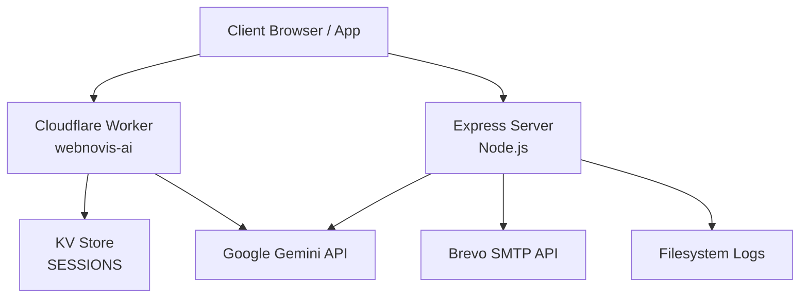
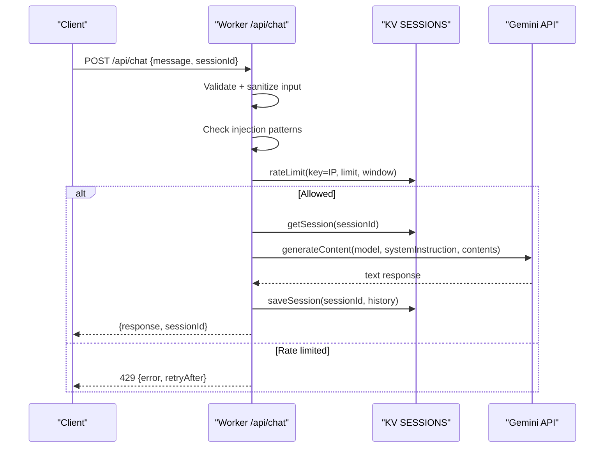
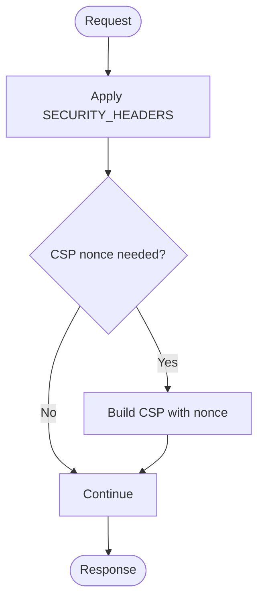
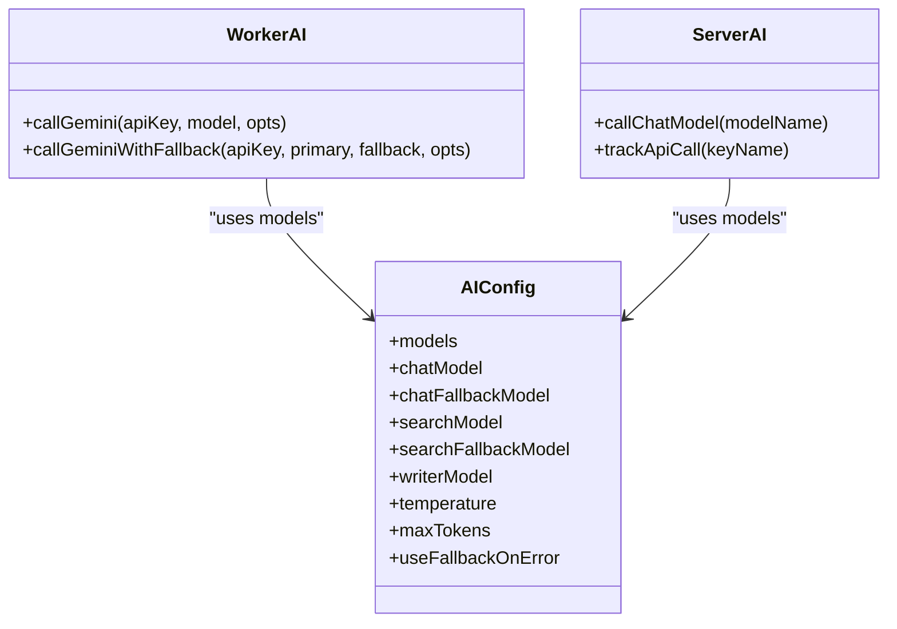
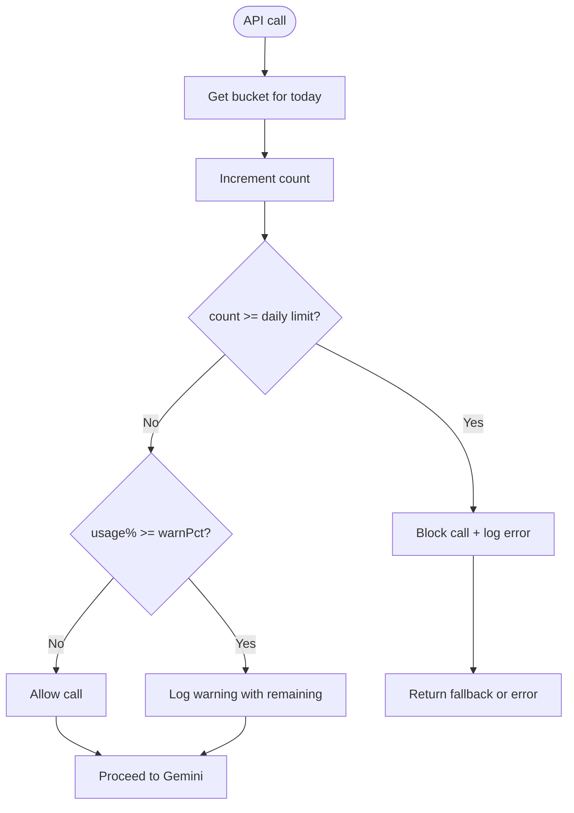
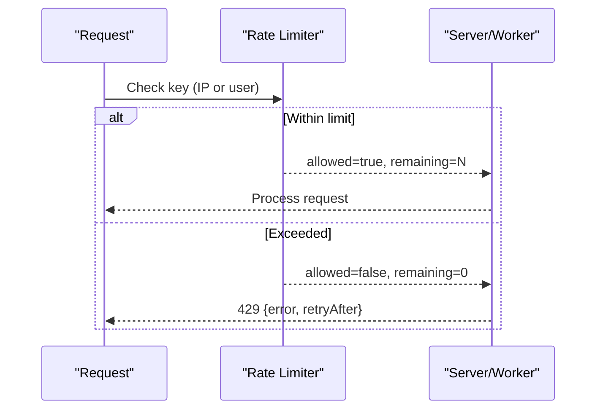
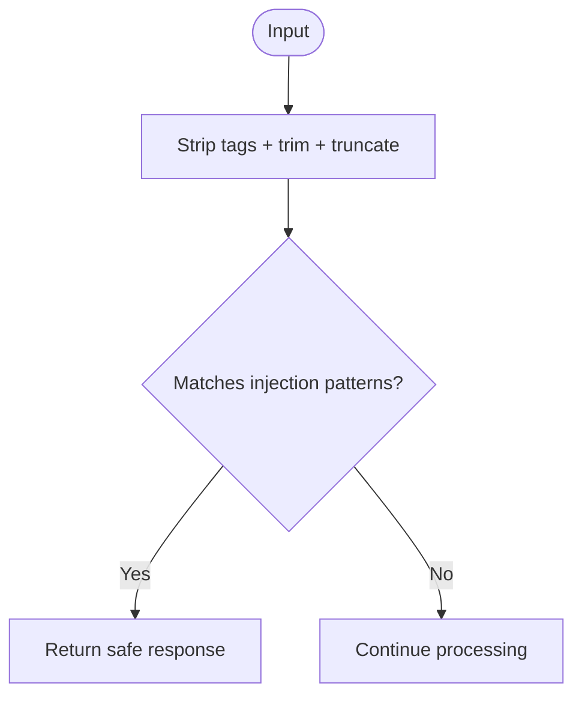
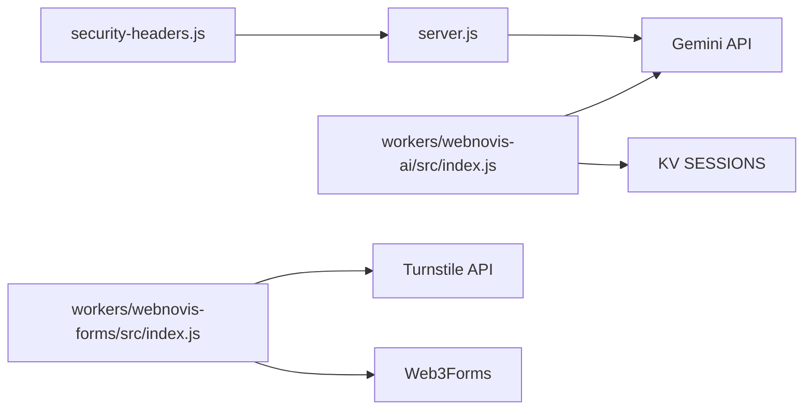

# API Security & Quota Management

<cite>
**Referenced Files in This Document**
- [server.js](file://server.js)
- [config/security-headers.js](file://config/security-headers.js)
- [workers/webnovis-ai/src/index.js](file://workers/webnovis-ai/src/index.js)
- [workers/webnovis-forms/src/index.js](file://workers/webnovis-forms/src/index.js)
- [ai-config.js](file://ai-config.js)
- [scripts/verify-prod-headers.js](file://scripts/verify-prod-headers.js)
- [tests/security-and-legal-regressions.test.js](file://tests/security-and-legal-regressions.test.js)
- [tests/security-header-regressions.test.js](file://tests/security-header-regressions.test.js)
</cite>

## Table of Contents
1. [Introduction](#introduction)
2. [Project Structure](#project-structure)
3. [Core Components](#core-components)
4. [Architecture Overview](#architecture-overview)
5. [Detailed Component Analysis](#detailed-component-analysis)
6. [Dependency Analysis](#dependency-analysis)
7. [Performance Considerations](#performance-considerations)
8. [Troubleshooting Guide](#troubleshooting-guide)
9. [Conclusion](#conclusion)

## Introduction
This document explains the WebNovis API security and quota management systems across both the Node.js server and Cloudflare Workers. It covers:
- API key management for Google Gemini integration
- Daily usage tracking and quota enforcement
- Rate limiting strategies and abuse prevention
- Monitoring and observability for API consumption
- Security headers, CORS policies, and cross-origin request handling
- Endpoint protection patterns, quota checking logic, and error responses
- Performance optimization and caching strategies for high traffic
- Debugging techniques for API security issues

## Project Structure
The system comprises two runtime layers:
- Express-based Node.js server exposing /api endpoints (chat, search-ai, newsletter, lead capture)
- Cloudflare Workers providing edge-hosted AI services (/api/chat, /api/search-ai, /api/chat-lead) with KV-backed rate limiting and session storage

**Diagram sources**
- [workers/webnovis-ai/src/index.js](file://workers/webnovis-ai/src/index.js)
- [server.js](file://server.js)

**Section sources**
- [workers/webnovis-ai/src/index.js](file://workers/webnovis-ai/src/index.js)
- [server.js](file://server.js)

## Core Components
- Security headers and CSP configuration shared between server and static assets
- CORS policy enforcement at both server and worker levels
- API key management for Gemini chat and search
- Daily quota tracking on the server; per-window rate limiting on the worker
- Prompt injection defense patterns
- Health endpoints and structured JSON responses
- Optional Turnstile verification for form submissions

**Section sources**
- [config/security-headers.js](file://config/security-headers.js)
- [server.js](file://server.js)
- [workers/webnovis-ai/src/index.js](file://workers/webnovis-ai/src/index.js)
- [workers/webnovis-forms/src/index.js](file://workers/webnovis-forms/src/index.js)

## Architecture Overview
The architecture enforces defense-in-depth:
- Shared security headers and CORS configuration
- Per-endpoint validation and sanitization
- Server-side prompt injection detection
- Quota guardrails before calling external APIs
- Fallback mechanisms to ensure availability under load or quota exhaustion

**Diagram sources**
- [workers/webnovis-ai/src/index.js](file://workers/webnovis-ai/src/index.js)

## Detailed Component Analysis

### Security Headers and CSP
- Centralized security headers including HSTS, nosniff, X-Frame-Options, Referrer-Policy, Permissions-Policy
- CSP directives allowlist for scripts, styles, images, fonts, and connect endpoints
- Static header generation utility for platforms supporting _headers files
- Tests verify synchronization between generated headers and source policy

**Diagram sources**
- [config/security-headers.js](file://config/security-headers.js)

**Section sources**
- [config/security-headers.js](file://config/security-headers.js)
- [tests/security-header-regressions.test.js](file://tests/security-header-regressions.test.js)

### CORS Policies and Cross-Origin Handling
- Server uses a shared helper to compute allowed origins from environment variables and defaults
- Worker implements per-request CORS logic, allowing configured origins and local development hosts
- OPTIONS preflight handled explicitly in both server and worker

**Section sources**
- [server.js](file://server.js)
- [workers/webnovis-ai/src/index.js](file://workers/webnovis-ai/src/index.js)

### API Key Management for Google Gemini
- Separate keys for chat and search are used to isolate quotas and reduce risk
- Models and fallback models are centrally defined
- Worker constructs requests to Gemini with appropriate generation config and optional JSON mode
- Server calls Gemini via fetch with timeouts and retryable error classification

**Diagram sources**
- [ai-config.js](file://ai-config.js)
- [workers/webnovis-ai/src/index.js](file://workers/webnovis-ai/src/index.js)
- [server.js](file://server.js)

**Section sources**
- [ai-config.js](file://ai-config.js)
- [workers/webnovis-ai/src/index.js](file://workers/webnovis-ai/src/index.js)
- [server.js](file://server.js)

### Daily Usage Tracking and Quota Enforcement
- Server tracks daily usage per key with configurable warn and hard-cap thresholds
- When the daily limit is reached, further calls are blocked and a local fallback is served
- Logging emits warnings when approaching limits and errors when exceeded

**Diagram sources**
- [server.js](file://server.js)

**Section sources**
- [server.js](file://server.js)

### Rate Limiting Strategies
- Worker: per-IP sliding window using KV store with TTL expiration
- Server: express-rate-limit middleware applied to sensitive endpoints
- Both return structured 429 responses with retry guidance

**Diagram sources**
- [workers/webnovis-ai/src/index.js](file://workers/webnovis-ai/src/index.js)
- [server.js](file://server.js)

**Section sources**
- [workers/webnovis-ai/src/index.js](file://workers/webnovis-ai/src/index.js)
- [server.js](file://server.js)

### Abuse Prevention Measures
- Prompt injection detection patterns block malicious inputs early
- Input sanitization strips HTML tags and truncates lengths
- IP anonymization for GDPR compliance in logs
- Turnstile verification for form submissions via forms worker

**Diagram sources**
- [server.js](file://server.js)
- [workers/webnovis-ai/src/index.js](file://workers/webnovis-ai/src/index.js)
- [workers/webnovis-forms/src/index.js](file://workers/webnovis-forms/src/index.js)

**Section sources**
- [server.js](file://server.js)
- [workers/webnovis-ai/src/index.js](file://workers/webnovis-ai/src/index.js)
- [workers/webnovis-forms/src/index.js](file://workers/webnovis-forms/src/index.js)

### Monitoring and Observability
- Structured logging for quota warnings and errors
- Health endpoints expose service status and corpus size
- Verification script checks production headers and expected behavior

**Section sources**
- [server.js](file://server.js)
- [workers/webnovis-ai/src/index.js](file://workers/webnovis-ai/src/index.js)
- [scripts/verify-prod-headers.js](file://scripts/verify-prod-headers.js)

### Endpoint Protection Examples
- Admin-only endpoints protected by timing-safe secret comparison
- Chat endpoints protected by rate limiting and quota checks
- Search endpoints protected by rate limiting and query validation

**Section sources**
- [server.js](file://server.js)
- [workers/webnovis-ai/src/index.js](file://workers/webnovis-ai/src/index.js)

### Error Responses for Exceeded Limits
- 429 responses include error messages and retry guidance
- Quota exceeded triggers local fallback to maintain UX
- Upstream errors result in graceful fallback or structured error payloads

**Section sources**
- [workers/webnovis-ai/src/index.js](file://workers/webnovis-ai/src/index.js)
- [server.js](file://server.js)

## Dependency Analysis
- Server imports shared security headers and CORS helpers
- Worker depends on KV for rate limiting and sessions
- Both components depend on Gemini API for AI responses
- Forms worker integrates Turnstile verification and forwards to Web3Forms

**Diagram sources**
- [config/security-headers.js](file://config/security-headers.js)
- [server.js](file://server.js)
- [workers/webnovis-ai/src/index.js](file://workers/webnovis-ai/src/index.js)
- [workers/webnovis-forms/src/index.js](file://workers/webnovis-forms/src/index.js)

**Section sources**
- [config/security-headers.js](file://config/security-headers.js)
- [server.js](file://server.js)
- [workers/webnovis-ai/src/index.js](file://workers/webnovis-ai/src/index.js)
- [workers/webnovis-forms/src/index.js](file://workers/webnovis-forms/src/index.js)

## Performance Considerations
- Compression middleware enabled on the server for reduced payload sizes
- Static asset caching with immutable headers in production
- Worker-level KV caching for search results reduces Gemini calls
- Timeouts and retries prevent long-pending requests during upstream failures

[No sources needed since this section provides general guidance]

## Troubleshooting Guide
- Verify production headers using the provided verification script
- Inspect logs for quota warnings and errors
- Confirm CORS configuration matches client origins
- Ensure environment variables for API keys and secrets are set correctly

**Section sources**
- [scripts/verify-prod-headers.js](file://scripts/verify-prod-headers.js)
- [server.js](file://server.js)
- [workers/webnovis-ai/src/index.js](file://workers/webnovis-ai/src/index.js)

## Conclusion
WebNovis implements robust API security and quota management through layered controls:
- Centralized security headers and strict CORS policies
- Per-key daily quotas with warnings and hard caps
- Rate limiting at both server and edge layers
- Prompt injection defenses and input sanitization
- Graceful fallbacks and structured error responses
These measures collectively protect against abuse, control costs, and maintain reliability under high traffic.