# Authentication & Authorization

<cite>
**Referenced Files in This Document**
- [server.js](file://server.js)
- [security-headers.js](file://config/security-headers.js)
- [index.js (AI Worker)](file://workers/webnovis-ai/src/index.js)
- [wrangler.jsonc (AI Worker)](file://workers/webnovis-ai/wrangler.jsonc)
- [index.js (Forms Worker)](file://workers/webnovis-forms/src/index.js)
- [.dev.vars.example (AI Worker)](file://workers/webnovis-ai/.dev.vars.example)
- [WORKERS-ASSETS-DIST.md](file://docs/deploy/WORKERS-ASSETS-DIST.md)
- [CLOUDFLARE-AI-SETUP.md](file://docs/CLOUDFLARE-AI-SETUP.md)
- [setup-cloudflare-ai.sh](file://scripts/setup-cloudflare-ai.sh)
- [verify-public-artifact.js](file://scripts/verify-public-artifact.js)
- [sync-security-headers.js](file://scripts/sync-security-headers.js)
- [security-and-legal-regressions.test.js](file://tests/security-and-legal-regressions.test.js)
</cite>

## Table of Contents
1. [Introduction](#introduction)
2. [Project Structure](#project-structure)
3. [Core Components](#core-components)
4. [Architecture Overview](#architecture-overview)
5. [Detailed Component Analysis](#detailed-component-analysis)
6. [Dependency Analysis](#dependency-analysis)
7. [Performance Considerations](#performance-considerations)
8. [Troubleshooting Guide](#troubleshooting-guide)
9. [Conclusion](#conclusion)
10. [Appendices](#appendices)

## Introduction
This document explains the authentication and authorization mechanisms across WebNovis’ Node server and Cloudflare Workers. It covers:
- Admin authentication middleware using timing-safe comparison for secret validation
- API key management patterns and rate limiting
- Session handling patterns for chat and leads
- Role-based access control concepts, protected route configuration, and CORS policies
- Credential storage best practices and environment variable security
- Cloudflare Workers authentication mechanisms, KV-backed sessions, and deployment-specific settings
- Secure flows, token management, and access control patterns
- Common vulnerabilities, mitigations, and audit procedures

## Project Structure
Authentication and authorization are implemented across:
- A Node/Express server with admin middleware, rate limiting, and secure headers
- Two Cloudflare Workers:
  - AI Worker for chat/search endpoints with KV-backed sessions and rate limiting
  - Forms Worker for Turnstile verification and forwarding to Web3Forms
- Centralized security headers and CORS configuration
- Deployment scripts and documentation for secrets management and asset publishing

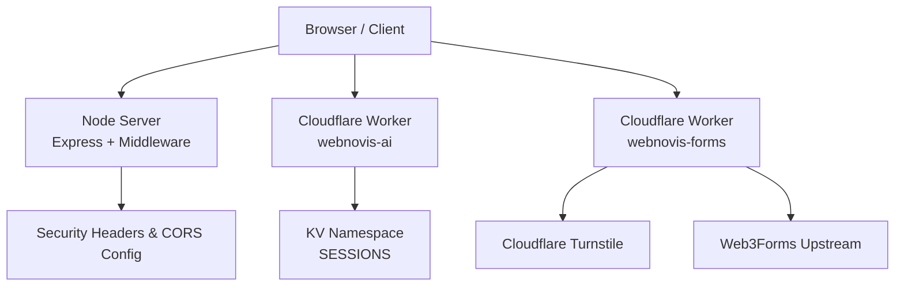

**Diagram sources**
- [server.js](file://server.js)
- [security-headers.js](file://config/security-headers.js)
- [index.js (AI Worker)](file://workers/webnovis-ai/src/index.js)
- [wrangler.jsonc (AI Worker)](file://workers/webnovis-ai/wrangler.jsonc)
- [index.js (Forms Worker)](file://workers/webnovis-forms/src/index.js)

**Section sources**
- [server.js](file://server.js)
- [security-headers.js](file://config/security-headers.js)
- [index.js (AI Worker)](file://workers/webnovis-ai/src/index.js)
- [index.js (Forms Worker)](file://workers/webnovis-forms/src/index.js)
- [wrangler.jsonc (AI Worker)](file://workers/webnovis-ai/wrangler.jsonc)

## Core Components
- Admin authentication middleware on the Node server uses a header-based secret validated with timing-safe comparison to prevent timing attacks.
- Rate limiting is enforced both on the Node server (express-rate-limit) and in the AI Worker via KV buckets.
- Sessions are stored server-side in memory for the Node server and in KV for the AI Worker; client-sent history is ignored for trust.
- CORS is centralized and enforced per-origin; only allowed origins can call APIs.
- Secrets are managed via environment variables and Cloudflare secrets; never committed to code.

**Section sources**
- [server.js](file://server.js)
- [index.js (AI Worker)](file://workers/webnovis-ai/src/index.js)
- [security-headers.js](file://config/security-headers.js)

## Architecture Overview
The system enforces authentication at multiple layers:
- Node server protects sensitive endpoints with an admin secret header and validates it securely.
- Cloudflare Workers enforce rate limits and validate tokens where applicable, persisting state in KV.
- Security headers and CSP are centrally configured and applied consistently.

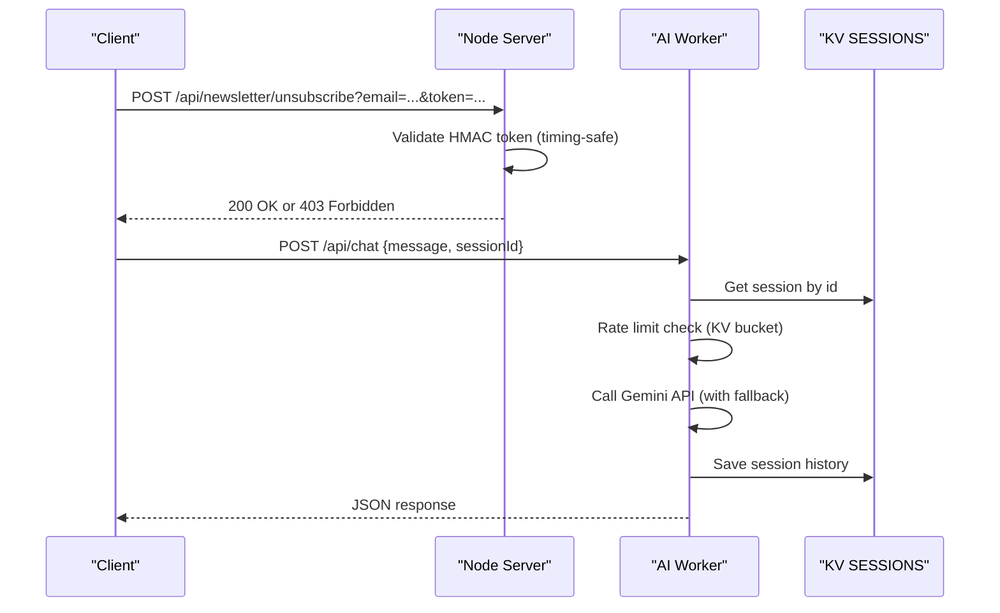

**Diagram sources**
- [server.js](file://server.js)
- [index.js (AI Worker)](file://workers/webnovis-ai/src/index.js)
- [wrangler.jsonc (AI Worker)](file://workers/webnovis-ai/wrangler.jsonc)

## Detailed Component Analysis

### Admin Authentication Middleware (Node Server)
- Protected endpoints require the header x-admin-secret.
- Secret must match the configured environment variable exactly in length and value.
- Comparison uses timing-safe equality to mitigate timing side-channels.
- If the secret is missing or placeholder, requests are rejected.

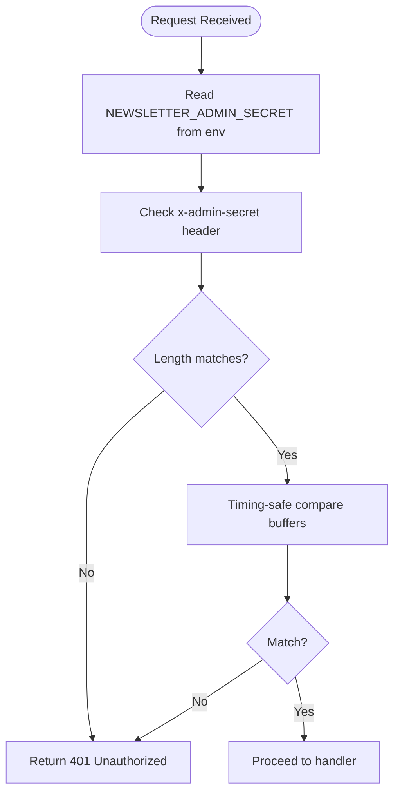

**Diagram sources**
- [server.js](file://server.js)

**Section sources**
- [server.js](file://server.js)

### Unsubscribe Token Validation (Node Server)
- The unsubscribe endpoint validates an HMAC-SHA256 token derived from email and admin secret.
- Tokens must be valid hex strings of expected length; otherwise, a security error is returned.
- This prevents mass unsubscribes and tampering.

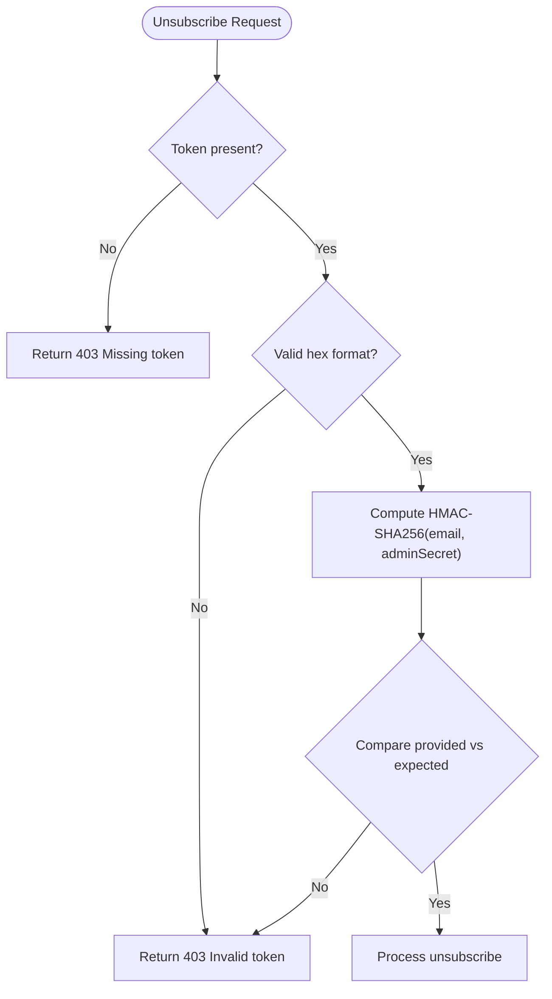

**Diagram sources**
- [server.js](file://server.js)

**Section sources**
- [server.js](file://server.js)

### Cloudflare AI Worker — Sessions, Rate Limiting, and CORS
- Sessions are persisted in KV under keys like chat:{sessionId}, with TTL and message trimming.
- Rate limiting uses KV buckets keyed by IP and time window; returns remaining counts.
- CORS is enforced based on allowed origins from environment and defaults.
- Client-sent conversationHistory is ignored; server tracks history exclusively.

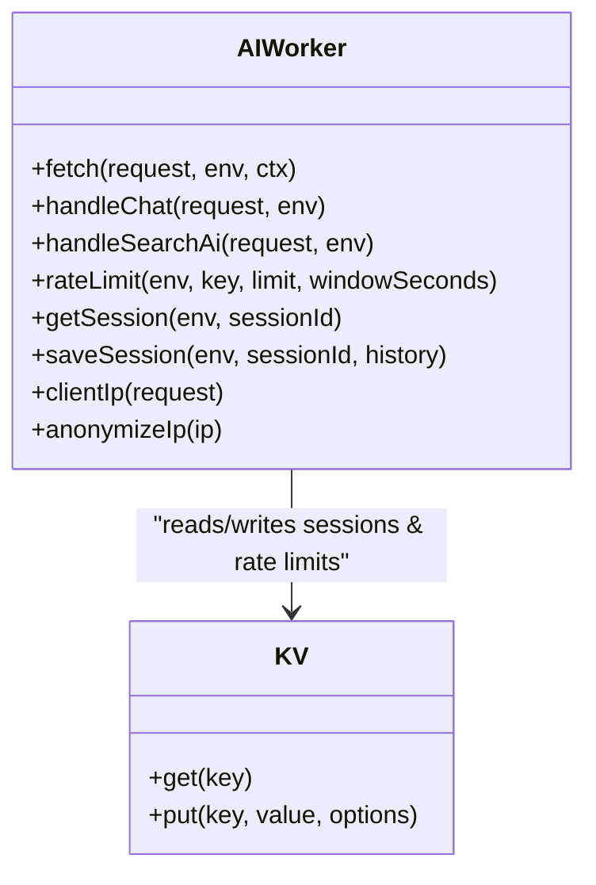

**Diagram sources**
- [index.js (AI Worker)](file://workers/webnovis-ai/src/index.js)
- [wrangler.jsonc (AI Worker)](file://workers/webnovis-ai/wrangler.jsonc)

**Section sources**
- [index.js (AI Worker)](file://workers/webnovis-ai/src/index.js)
- [wrangler.jsonc (AI Worker)](file://workers/webnovis-ai/wrangler.jsonc)

### Cloudflare Forms Worker — Turnstile Verification and Upstream Forwarding
- Validates Turnstile tokens server-side against Cloudflare’s siteverify endpoint.
- Enforces hostname checks and optional action validation.
- Forwards form submissions to Web3Forms with optional access key injection.
- Honeypot field used to filter bots.

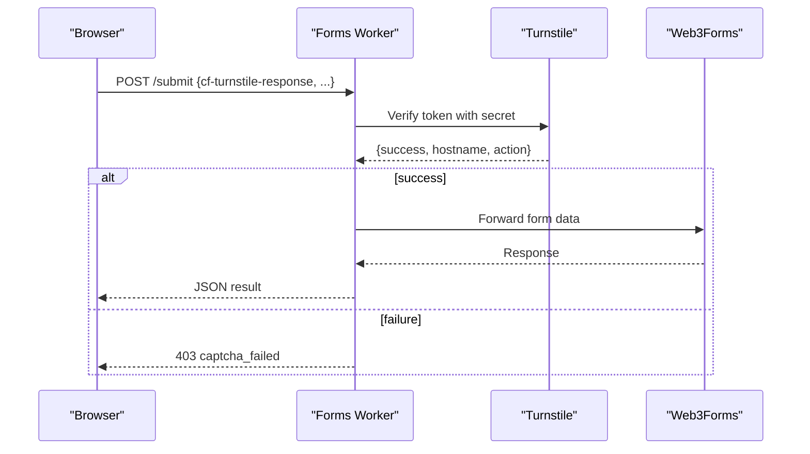

**Diagram sources**
- [index.js (Forms Worker)](file://workers/webnovis-forms/src/index.js)

**Section sources**
- [index.js (Forms Worker)](file://workers/webnovis-forms/src/index.js)

### Security Headers and CORS Configuration
- Centralized security headers include HSTS, X-Content-Type-Options, X-Frame-Options, CSP, Referrer-Policy, Permissions-Policy.
- CSP directives whitelist necessary third-party domains and inline scripts when needed.
- CORS origins are derived from defaults and environment variable CORS_ORIGINS.
- Static _headers file is generated and synced for platforms supporting it.

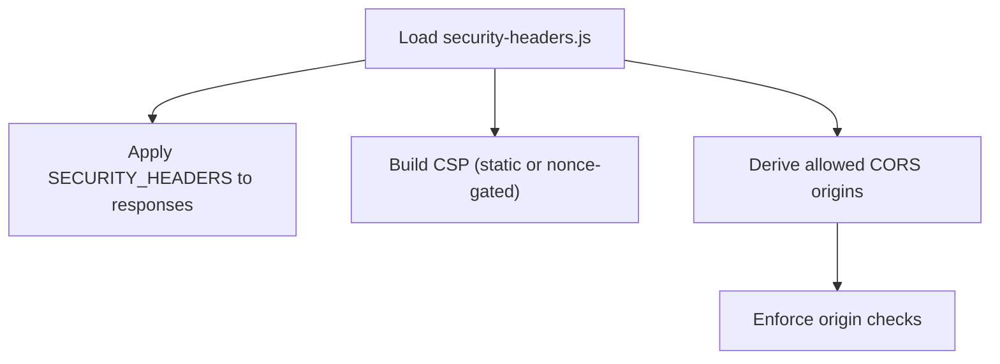

**Diagram sources**
- [security-headers.js](file://config/security-headers.js)
- [sync-security-headers.js](file://scripts/sync-security-headers.js)

**Section sources**
- [security-headers.js](file://config/security-headers.js)
- [sync-security-headers.js](file://scripts/sync-security-headers.js)

### API Key Management Patterns
- Node server tracks daily usage quotas for Gemini keys and warns/blocks near caps.
- AI Worker rotates between primary and fallback models and handles retryable errors.
- Scripts manage API key pools and cooldowns for external services.

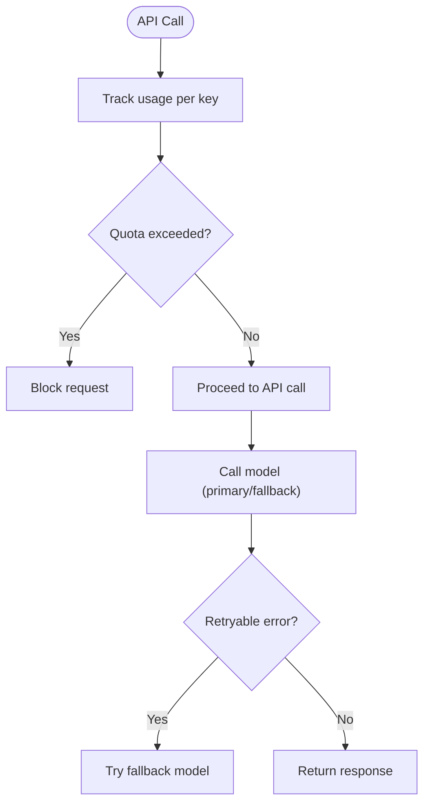

**Diagram sources**
- [server.js](file://server.js)
- [index.js (AI Worker)](file://workers/webnovis-ai/src/index.js)

**Section sources**
- [server.js](file://server.js)
- [index.js (AI Worker)](file://workers/webnovis-ai/src/index.js)

### Session Handling Patterns
- Node server maintains in-memory sessions with max age and concurrent limits.
- AI Worker persists sessions in KV with TTL and trims history to bounded size.
- Client-sent history is ignored to prevent forgery.

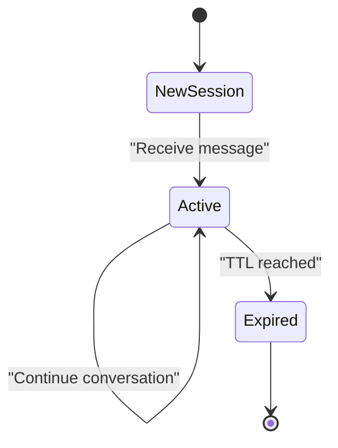

**Diagram sources**
- [server.js](file://server.js)
- [index.js (AI Worker)](file://workers/webnovis-ai/src/index.js)

**Section sources**
- [server.js](file://server.js)
- [index.js (AI Worker)](file://workers/webnovis-ai/src/index.js)

### Protected Route Configuration and Access Control
- Protected routes require specific headers (e.g., x-admin-secret).
- CORS restricts allowed origins; non-browser requests rely on rate limiting and secret checks.
- Tests assert that shared security config is used and static headers are synced.

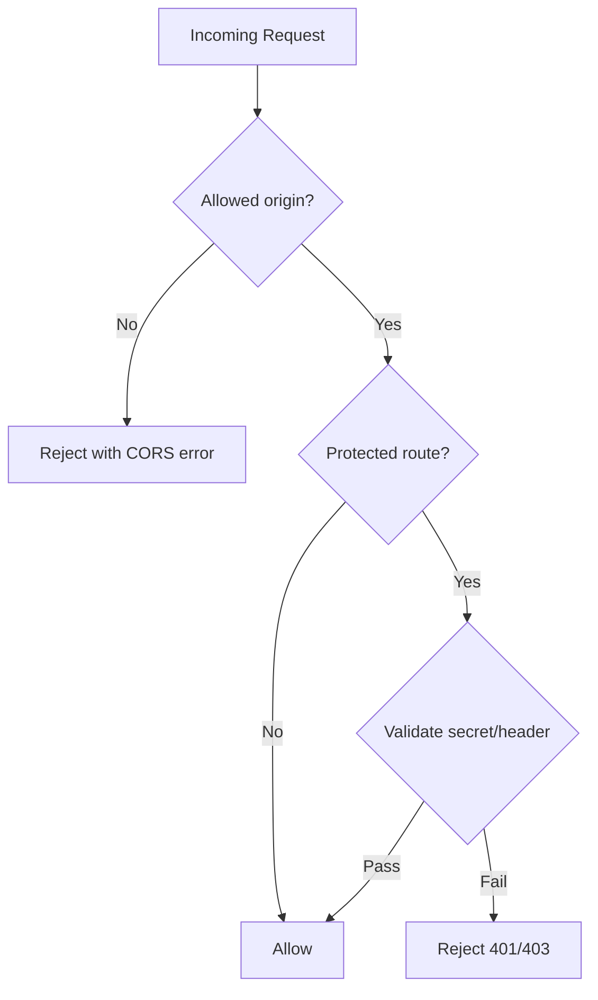

**Diagram sources**
- [server.js](file://server.js)
- [security-and-legal-regressions.test.js](file://tests/security-and-legal-regressions.test.js)

**Section sources**
- [server.js](file://server.js)
- [security-and-legal-regressions.test.js](file://tests/security-and-legal-regressions.test.js)

### Cloudflare Workers Environment Variable Security
- Secrets are set via wrangler secret commands and referenced in workers via env bindings.
- .dev.vars.example documents local development variables; never commit secrets.
- Deployment scripts ensure secrets are provisioned securely.

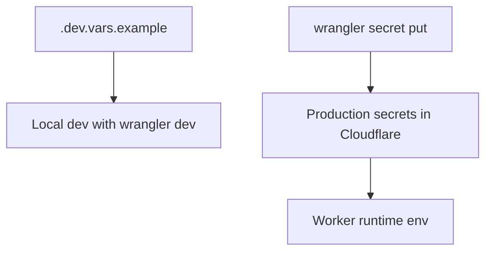

**Diagram sources**
- [.dev.vars.example (AI Worker)](file://workers/webnovis-ai/.dev.vars.example)
- [setup-cloudflare-ai.sh](file://scripts/setup-cloudflare-ai.sh)

**Section sources**
- [.dev.vars.example (AI Worker)](file://workers/webnovis-ai/.dev.vars.example)
- [setup-cloudflare-ai.sh](file://scripts/setup-cloudflare-ai.sh)

### Deployment-Specific Authentication Settings
- Assets are served from dist/ with strict allowlist and no HTML auto-redirects to preserve SEO.
- Wrangler configuration pins compatibility dates and assets directory.
- CI/CD workflows should not deploy without explicit auth and intent.

**Section sources**
- [WORKERS-ASSETS-DIST.md](file://docs/deploy/WORKERS-ASSETS-DIST.md)
- [wrangler.jsonc (AI Worker)](file://workers/webnovis-ai/wrangler.jsonc)

## Dependency Analysis
- Node server depends on express-rate-limit, compression, and shared security headers.
- AI Worker depends on KV namespace for sessions and rate limits, and external Gemini API.
- Forms Worker depends on Turnstile and Web3Forms upstream.
- Tests enforce consistent use of shared security configuration and static headers sync.

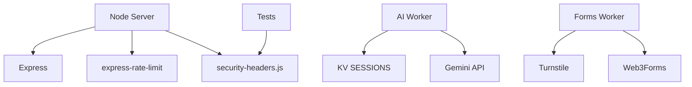

**Diagram sources**
- [server.js](file://server.js)
- [security-headers.js](file://config/security-headers.js)
- [index.js (AI Worker)](file://workers/webnovis-ai/src/index.js)
- [index.js (Forms Worker)](file://workers/webnovis-forms/src/index.js)

**Section sources**
- [server.js](file://server.js)
- [security-headers.js](file://config/security-headers.js)
- [index.js (AI Worker)](file://workers/webnovis-ai/src/index.js)
- [index.js (Forms Worker)](file://workers/webnovis-forms/src/index.js)

## Performance Considerations
- Compression reduces payload sizes for text assets.
- KV-backed rate limiting and sessions scale efficiently in Workers.
- In-memory sessions on Node server are guarded by concurrency limits.
- Quota tracking prevents runaway API spend and abuse.

[No sources needed since this section provides general guidance]

## Troubleshooting Guide
- If newsletter secret is placeholder, server logs critical warnings and rejects requests.
- KV binding absence causes chat memory loss; redeploy with proper binding.
- CSP blocks connect to Worker if not whitelisted; update security headers.
- Secret leaks in artifacts are detected by verify script; fix before deploy.

**Section sources**
- [server.js](file://server.js)
- [CLOUDFLARE-AI-SETUP.md](file://docs/CLOUDFLARE-AI-SETUP.md)
- [verify-public-artifact.js](file://scripts/verify-public-artifact.js)

## Conclusion
WebNovis implements defense-in-depth for authentication and authorization:
- Timing-safe secret validation for admin endpoints
- Centralized security headers and CORS enforcement
- KV-backed sessions and rate limiting in Workers
- Strict credential management via environment variables and secrets
- Automated tests and artifact verification to prevent misconfiguration and leaks

[No sources needed since this section summarizes without analyzing specific files]

## Appendices

### Secure Authentication Flows and Token Management
- Use HMAC-SHA256 tokens for sensitive actions like unsubscribe; validate format and compare securely.
- Rotate API keys and implement cooldowns to handle rate limits gracefully.
- Store session identifiers client-side but maintain authoritative state server-side or in KV.

**Section sources**
- [server.js](file://server.js)
- [index.js (AI Worker)](file://workers/webnovis-ai/src/index.js)

### Common Vulnerabilities and Mitigations
- Timing attacks: Use timing-safe comparisons for secrets.
- CSRF/XSS: Enforce CSP and secure headers; avoid unsafe-inline unless necessary.
- Abuse: Implement rate limiting and quota tracking.
- Secret leakage: Scan artifacts and enforce .gitignore; use platform secrets.

**Section sources**
- [server.js](file://server.js)
- [security-headers.js](file://config/security-headers.js)
- [verify-public-artifact.js](file://scripts/verify-public-artifact.js)

### Security Audit Procedures
- Ensure shared security config is imported and applied.
- Verify static headers file is synced with configuration.
- Confirm environment variables are documented and not committed.
- Test CORS behavior and protected routes with invalid/valid credentials.

**Section sources**
- [security-and-legal-regressions.test.js](file://tests/security-and-legal-regressions.test.js)
- [sync-security-headers.js](file://scripts/sync-security-headers.js)