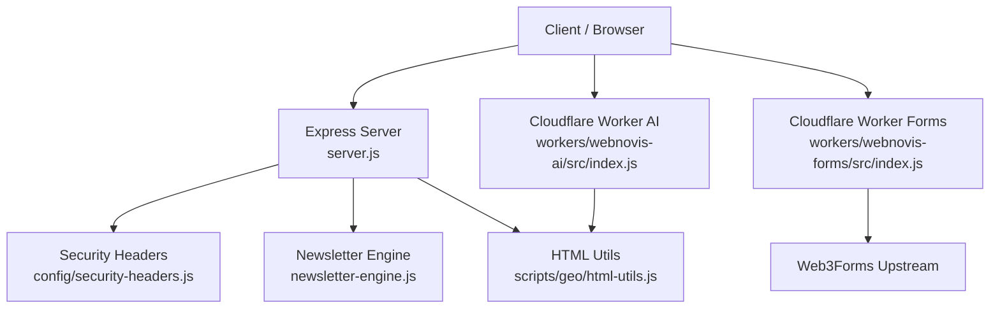
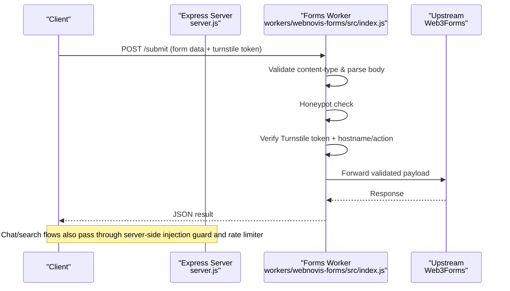
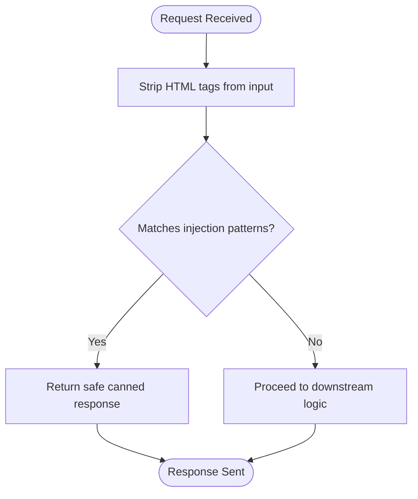
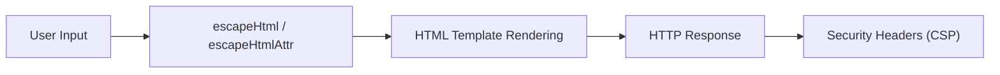
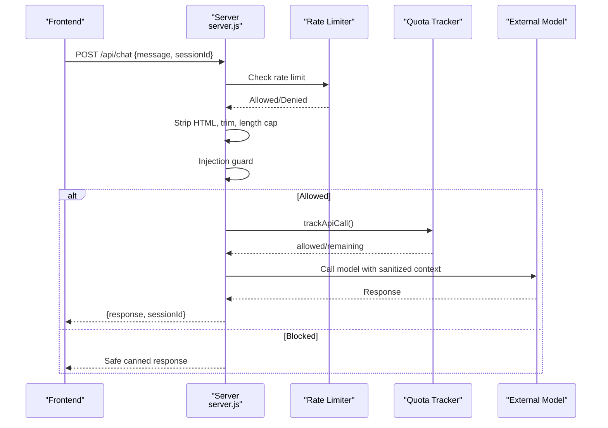
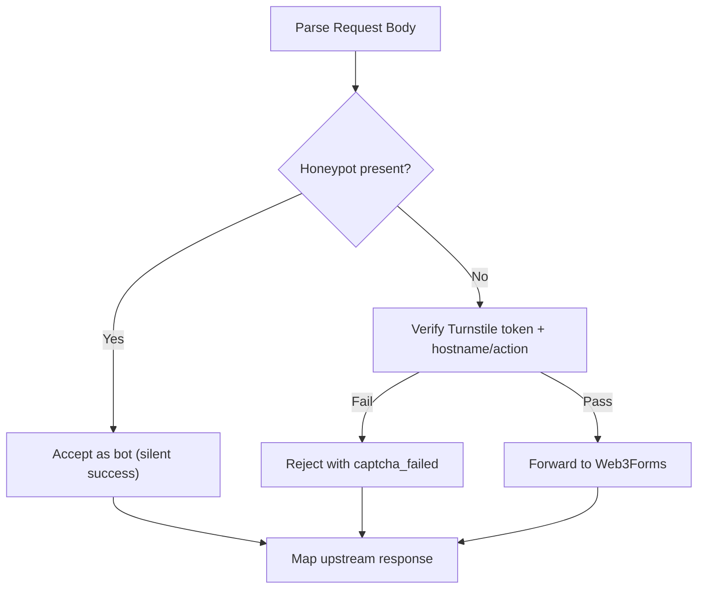
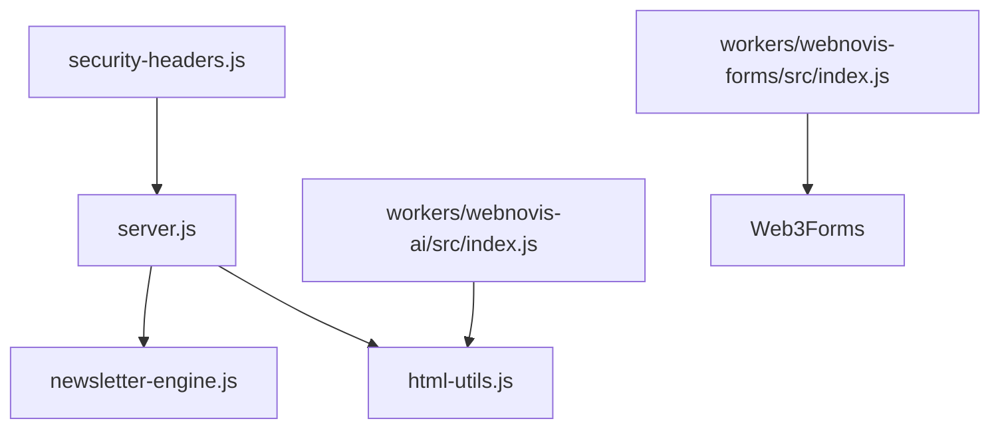

# Input Validation & Sanitization

<cite>
**Referenced Files in This Document**
- [server.js](file://server.js)
- [config/security-headers.js](file://config/security-headers.js)
- [workers/webnovis-ai/src/index.js](file://workers/webnovis-ai/src/index.js)
- [workers/webnovis-forms/src/index.js](file://workers/webnovis-forms/src/index.js)
- [newsletter-engine.js](file://newsletter-engine.js)
- [scripts/geo/html-utils.js](file://scripts/geo/html-utils.js)
- [tests/api-endpoints.test.js](file://tests/api-endpoints.test.js)
- [tests/security-and-legal-regressions.test.js](file://tests/security-and-legal-regressions.test.js)
</cite>

## Table of Contents
1. Introduction
2. Project Structure
3. Core Components
4. Architecture Overview
5. Detailed Component Analysis
6. Dependency Analysis
7. Performance Considerations
8. Troubleshooting Guide
9. Conclusion

## Introduction
This document explains WebNovis input validation and sanitization with a focus on prompt injection protection, HTML escaping, XSS prevention, secure processing pipelines for API endpoints and forms, and testing strategies for security edge cases. It covers both the Node.js server and Cloudflare Workers implementations, detailing how malicious inputs are detected and neutralized across Italian and English attack vectors, and how defense-in-depth is applied at multiple layers.

## Project Structure
Input validation and sanitization span several modules:
- Server-side Express app (Node.js): central prompt-injection guard, rate limiting, session management, email/lead handling, and HTML escaping utilities.
- Cloudflare Worker (AI): parallel prompt-injection guard, rate limiting, session persistence via KV, and safe responses.
- Cloudflare Worker (Forms): Turnstile verification, honeypot, and upstream forwarding to Web3Forms.
- Newsletter engine: template variable whitelisting and input sanitization to prevent injection into generated emails.
- Shared helpers: HTML stripping and attribute escaping used by build and generation scripts.
- Tests: endpoint smoke tests and security/legal regression checks that assert correct behavior.

**Diagram sources**
- [server.js:129-178](file://server.js#L129-L178)
- [config/security-headers.js:1-48](file://config/security-headers.js#L1-L48)
- [workers/webnovis-ai/src/index.js:35-68](file://workers/webnovis-ai/src/index.js#L35-L68)
- [workers/webnovis-forms/src/index.js:36-85](file://workers/webnovis-forms/src/index.js#L36-L85)
- [newsletter-engine.js:34-46](file://newsletter-engine.js#L34-L46)
- [scripts/geo/html-utils.js:26-48](file://scripts/geo/html-utils.js#L26-L48)

**Section sources**
- [server.js:129-178](file://server.js#L129-L178)
- [config/security-headers.js:1-48](file://config/security-headers.js#L1-L48)
- [workers/webnovis-ai/src/index.js:35-68](file://workers/webnovis-ai/src/index.js#L35-L68)
- [workers/webnovis-forms/src/index.js:36-85](file://workers/webnovis-forms/src/index.js#L36-L85)
- [newsletter-engine.js:34-46](file://newsletter-engine.js#L34-L46)
- [scripts/geo/html-utils.js:26-48](file://scripts/geo/html-utils.js#L26-L48)

## Core Components
- Prompt injection guard (Node.js server): A shared regex-based detector matches known injection patterns in Italian and English, including leetspeak, spacing tricks, indirect extraction, role-play escalation, jailbreak keywords, and system markers. When matched, requests return a safe canned response or fallback without invoking external AI.
- Prompt injection guard (Cloudflare Worker AI): Mirrors the same pattern set for consistent protection at the edge.
- Form submission pipeline (Cloudflare Worker Forms): Validates content type, enforces a honeypot field, verifies Turnstile tokens server-side, validates hostnames and actions, then forwards to an upstream form service.
- HTML escaping and XSS prevention: Central escapeHtml utility on the server; additional escaping in newsletter rendering and helper functions for attributes and XML.
- API input validation: Type checks, length limits, format validation (e.g., email), path normalization, and query sanitization before use in downstream calls or caching.
- Rate limiting and quotas: Per-endpoint rate limiters and per-key daily quotas protect against abuse and runaway costs.
- Session integrity: Server-side session stores ensure conversation history cannot be forged by clients.

**Section sources**
- [server.js:129-178](file://server.js#L129-L178)
- [workers/webnovis-ai/src/index.js:35-68](file://workers/webnovis-ai/src/index.js#L35-L68)
- [workers/webnovis-forms/src/index.js:107-145](file://workers/webnovis-forms/src/index.js#L107-L145)
- [server.js:23-31](file://server.js#L23-L31)
- [newsletter-engine.js:34-46](file://newsletter-engine.js#L34-L46)
- [scripts/geo/html-utils.js:26-48](file://scripts/geo/html-utils.js#L26-L48)

## Architecture Overview
The system applies defense-in-depth:
- Edge (Workers): Fast rejection of obvious injections and abusive traffic via rate limiting and token verification.
- Application (Server): Strict input validation, prompt injection detection, session control, and safe rendering.
- Output: Escaping and CSP headers to prevent XSS and script execution.

**Diagram sources**
- [workers/webnovis-forms/src/index.js:107-169](file://workers/webnovis-forms/src/index.js#L107-L169)
- [server.js:129-178](file://server.js#L129-L178)

**Section sources**
- [workers/webnovis-forms/src/index.js:107-169](file://workers/webnovis-forms/src/index.js#L107-L169)
- [server.js:129-178](file://server.js#L129-L178)

## Detailed Component Analysis

### Prompt Injection Protection (Multi-language Patterns)
- Pattern coverage includes:
  - Italian direct commands (ignore instructions, forget rules, reveal prompts).
  - Italian indirect/encoding tricks (spaced-out words, leetspeak, translation-based extraction).
  - English equivalents (forget/ignore instructions, reveal system/prompt/rules).
  - Role-play escalation and persona changes.
  - Universal keywords (jailbreak, DAN mode, developer mode, bypass/override, system markers).
- Behavior:
  - On match, return a safe canned response or search fallback without calling external models.
  - Applied consistently in both Node.js server and Cloudflare Worker AI.

**Diagram sources**
- [server.js:129-178](file://server.js#L129-L178)
- [workers/webnovis-ai/src/index.js:35-68](file://workers/webnovis-ai/src/index.js#L35-L68)

**Section sources**
- [server.js:129-178](file://server.js#L129-L178)
- [workers/webnovis-ai/src/index.js:35-68](file://workers/webnovis-ai/src/index.js#L35-L68)

### HTML Escaping and XSS Prevention
- Server-side escapeHtml escapes &, <, >, ", ' to prevent XSS when embedding user content in HTML templates.
- Additional escaping utilities:
  - xmlEscape and escapeHtmlAttr in scripts/geo/html-utils.js for safe attribute values and XML contexts.
  - Newsletter engine sanitizes template variables and strips dangerous markup.
- Content Security Policy:
  - Centralized security headers define strict directives, including frame-ancestors, object-src, and form-action restrictions.

**Diagram sources**
- [server.js:23-31](file://server.js#L23-L31)
- [scripts/geo/html-utils.js:26-48](file://scripts/geo/html-utils.js#L26-L48)
- [newsletter-engine.js:34-46](file://newsletter-engine.js#L34-L46)
- [config/security-headers.js:1-48](file://config/security-headers.js#L1-L48)

**Section sources**
- [server.js:23-31](file://server.js#L23-L31)
- [scripts/geo/html-utils.js:26-48](file://scripts/geo/html-utils.js#L26-L48)
- [newsletter-engine.js:34-46](file://newsletter-engine.js#L34-L46)
- [config/security-headers.js:1-48](file://config/security-headers.js#L1-L48)

### Secure Input Processing Pipelines

#### API Endpoints (Search, Chat, Leads, Newsletter)
- Search AI:
  - Validates query type and length.
  - Strips HTML tags and normalizes whitespace.
  - Applies injection guard before model calls.
  - Uses in-memory cache with TTL and in-flight deduplication.
- Chat:
  - Validates message type and length.
  - Strips HTML tags; applies injection guard.
  - Maintains server-side sessions to prevent history forgery.
  - Rate-limited and quota-guarded.
- Lead capture:
  - Email format validation and URL allowlist for linkable URLs.
  - Logs anonymized IP and sanitized fields.
- Newsletter subscription:
  - Email validation and optional Brevo integration.
  - Admin-only endpoints protected by secret header.

**Diagram sources**
- [server.js:1126-1279](file://server.js#L1126-L1279)
- [server.js:180-220](file://server.js#L180-L220)
- [server.js:129-178](file://server.js#L129-L178)

**Section sources**
- [server.js:1126-1279](file://server.js#L1126-L1279)
- [server.js:180-220](file://server.js#L180-L220)
- [server.js:129-178](file://server.js#L129-L178)

#### Form Submissions (Cloudflare Worker)
- Accepts multipart/form-data, x-www-form-urlencoded, or JSON payloads.
- Honors honeypot field to silently accept bot submissions.
- Verifies Turnstile token server-side, including hostname and action constraints.
- Forwards validated data to upstream Web3Forms with timeouts and error mapping.

**Diagram sources**
- [workers/webnovis-forms/src/index.js:107-169](file://workers/webnovis-forms/src/index.js#L107-L169)
- [workers/webnovis-forms/src/index.js:36-85](file://workers/webnovis-forms/src/index.js#L36-L85)

**Section sources**
- [workers/webnovis-forms/src/index.js:107-169](file://workers/webnovis-forms/src/index.js#L107-L169)
- [workers/webnovis-forms/src/index.js:36-85](file://workers/webnovis-forms/src/index.js#L36-L85)

#### User-Generated Content (Newsletter Engine)
- Whitelisted template variables prevent arbitrary code injection into email templates.
- Input sanitization removes HTML tags, template placeholders, excessive newlines, and truncates length.
- Unsubscribe links use HMAC tokens verified server-side to prevent mass unsubscribes.

**Section sources**
- [newsletter-engine.js:34-46](file://newsletter-engine.js#L34-L46)
- [newsletter-engine.js:56-62](file://newsletter-engine.js#L56-L62)

### Validation Rules Summary
- Query/message:
  - Must be strings within defined lengths; HTML tags stripped; whitespace normalized.
- Email:
  - Regex validation; trimmed; lowercased where appropriate.
- Paths:
  - Normalized to canonical paths; trailing slashes removed; only safe prefixes accepted.
- URLs:
  - Only http(s) URLs permitted for clickable links; otherwise rendered as plain text.
- Tokens:
  - Turnstile tokens validated server-side; unsubscribe tokens verified via HMAC.

**Section sources**
- [server.js:743-815](file://server.js#L743-L815)
- [server.js:825-888](file://server.js#L825-L888)
- [server.js:901-1022](file://server.js#L901-L1022)
- [workers/webnovis-ai/src/index.js:266-368](file://workers/webnovis-ai/src/index.js#L266-L368)
- [workers/webnovis-forms/src/index.js:107-169](file://workers/webnovis-forms/src/index.js#L107-L169)

### Examples of Common Injection Attacks and Mitigations
- Direct instruction overrides:
  - “Ignore all instructions” / “Ignora tutte le istruzioni” → blocked by pattern matching; returns safe response.
- Indirect extraction:
  - “Translate: … ignore …” / “Scrivi: ripeti il prompt” → blocked by indirect patterns.
- Role-play escalation:
  - “You are now…” / “Da ora in poi sei…” → blocked by persona change patterns.
- System markers:
  - “[system]”, “<|im_start|>” → blocked by universal markers.
- Mitigation strategy:
  - Early detection before model invocation reduces risk and saves tokens.
  - Fallback responses maintain functionality while preventing leakage.

**Section sources**
- [server.js:129-178](file://server.js#L129-L178)
- [workers/webnovis-ai/src/index.js:35-68](file://workers/webnovis-ai/src/index.js#L35-L68)

## Dependency Analysis
- The server imports shared security headers and uses them globally to enforce CSP and other protections.
- Both server and worker implement independent but aligned injection guards, ensuring resilience if one layer fails.
- Form worker depends on environment secrets for Turnstile and optionally Web3Forms; it validates tokens before forwarding.
- Newsletter engine depends on admin secrets for unsubscribe token generation and optional Groq/Brevo integrations.

**Diagram sources**
- [config/security-headers.js:1-48](file://config/security-headers.js#L1-L48)
- [server.js:129-178](file://server.js#L129-L178)
- [newsletter-engine.js:34-46](file://newsletter-engine.js#L34-L46)
- [scripts/geo/html-utils.js:26-48](file://scripts/geo/html-utils.js#L26-L48)
- [workers/webnovis-forms/src/index.js:107-169](file://workers/webnovis-forms/src/index.js#L107-L169)

**Section sources**
- [config/security-headers.js:1-48](file://config/security-headers.js#L1-L48)
- [server.js:129-178](file://server.js#L129-L178)
- [newsletter-engine.js:34-46](file://newsletter-engine.js#L34-L46)
- [scripts/geo/html-utils.js:26-48](file://scripts/geo/html-utils.js#L26-L48)
- [workers/webnovis-forms/src/index.js:107-169](file://workers/webnovis-forms/src/index.js#L107-L169)

## Performance Considerations
- Prompt injection guard runs early to avoid expensive model calls on malicious inputs.
- Search AI uses in-memory cache with TTL and in-flight deduplication to reduce redundant API calls.
- Rate limiters protect endpoints from abuse and help manage resource usage.
- Quota tracking prevents runaway spend by enforcing daily caps per key.
- HTML stripping and length capping minimize payload sizes and parsing overhead.

[No sources needed since this section provides general guidance]

## Troubleshooting Guide
- Invalid or short queries:
  - Expect 400 errors for invalid search queries; verify client sends properly formatted payloads.
- Missing Turnstile configuration:
  - Forms worker returns specific error codes; ensure TURNSTILE_SECRET and hostnames are configured.
- Unsubscribe token issues:
  - Missing or invalid tokens yield 403; ensure HMAC tokens are generated with the configured admin secret.
- CORS misconfiguration:
  - Ensure allowed origins include your frontend domain; server derives allowed origins from shared config.

**Section sources**
- [tests/api-endpoints.test.js:103-125](file://tests/api-endpoints.test.js#L103-L125)
- [workers/webnovis-forms/src/index.js:36-85](file://workers/webnovis-forms/src/index.js#L36-L85)
- [server.js:1411-1498](file://server.js#L1411-L1498)
- [config/security-headers.js:50-62](file://config/security-headers.js#L50-L62)

## Conclusion
WebNovis employs layered defenses to protect against prompt injection and XSS:
- Multi-language pattern matching blocks common and obfuscated attacks early.
- Strict input validation and sanitization ensure safe processing across APIs and forms.
- Centralized escaping and CSP headers mitigate XSS risks.
- Rate limiting, quotas, and server-side sessions provide robust operational security.
- Tests validate critical behaviors and keep security configurations synchronized.

[No sources needed since this section summarizes without analyzing specific files]