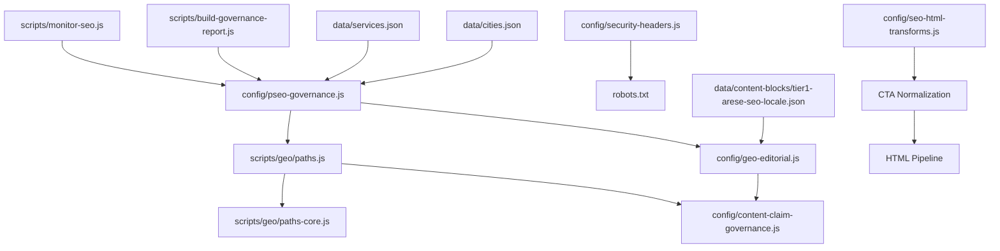
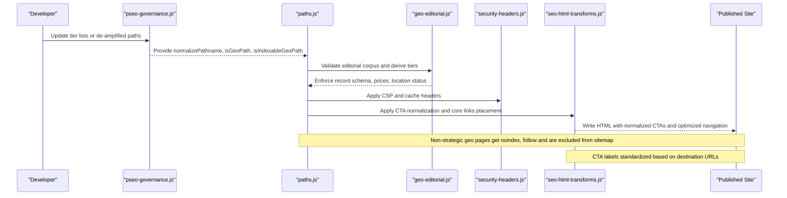
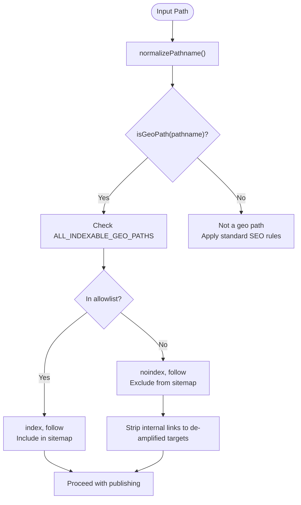
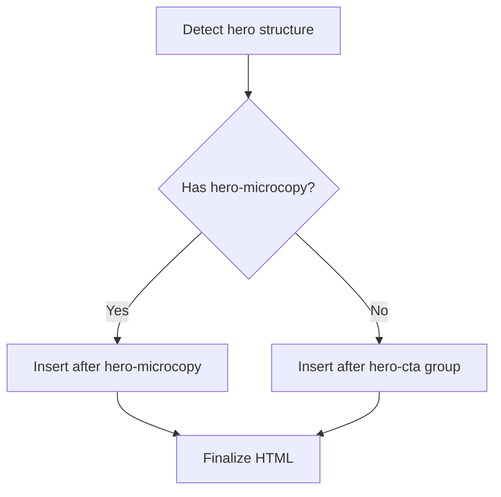
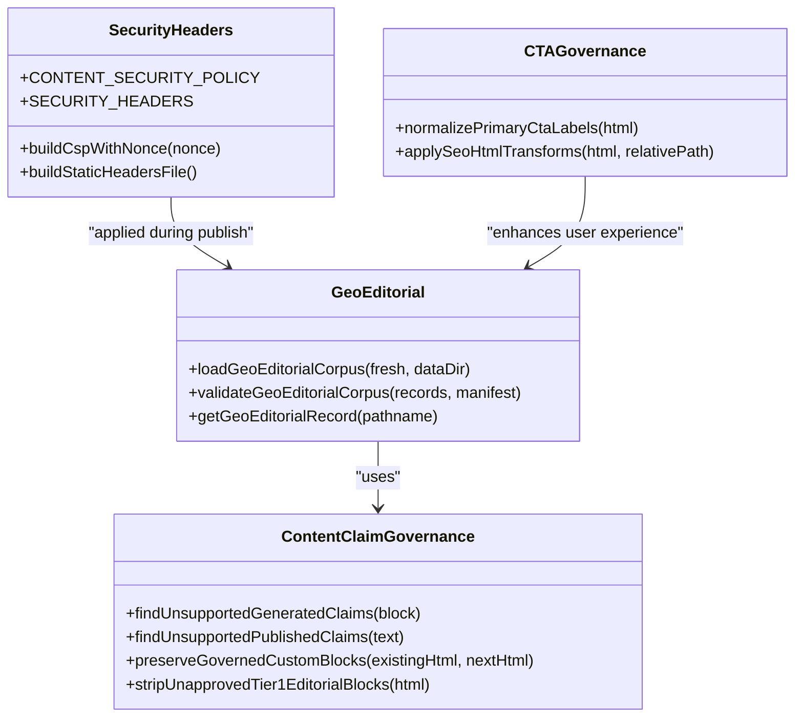
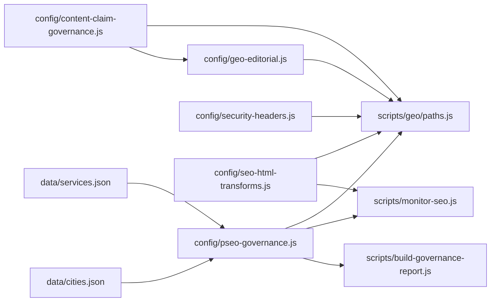

# SEO Governance & Content Security

<cite>
**Referenced Files in This Document**
- [pseo-governance.js](file://config/pseo-governance.js)
- [geo-editorial.js](file://config/geo-editorial.js)
- [paths.js](file://scripts/geo/paths.js)
- [paths-core.js](file://scripts/geo/paths-core.js)
- [security-headers.js](file://config/security-headers.js)
- [content-claim-governance.js](file://config/content-claim-governance.js)
- [validate.js](file://scripts/geo/validate.js)
- [monitor-seo.js](file://scripts/monitor-seo.js)
- [build-governance-report.js](file://scripts/build-governance-report.js)
- [services.json](file://data/services.json)
- [cities.json](file://data/cities.json)
- [tier1-arese-seo-locale.json](file://data/content-blocks/tier1-arese-seo-locale.json)
- [robots.txt](file://robots.txt)
- [seo-html-transforms.js](file://config/seo-html-transforms.js)
</cite>

## Update Summary
**Changes Made**
- Added documentation for the new `normalizePrimaryCtaLabels()` function that standardizes CTA button labels based on destination URLs
- Updated core links placement logic documentation to reflect the new hero microcopy detection and fallback mechanism
- Enhanced CTA governance section with automated label normalization rules
- Updated HTML transformation pipeline documentation to include the new CTA normalization step

## Table of Contents
1. [Introduction](#introduction)
2. [Project Structure](#project-structure)
3. [Core Components](#core-components)
4. [Architecture Overview](#architecture-overview)
5. [Detailed Component Analysis](#detailed-component-analysis)
6. [Dependency Analysis](#dependency-analysis)
7. [Performance Considerations](#performance-considerations)
8. [Troubleshooting Guide](#troubleshooting-guide)
9. [Conclusion](#conclusion)
10. [Appendices](#appendices)

## Introduction
This document explains WebNovis's SEO governance and content security model, focusing on the tiered indexing system that prevents doorway page penalties while preserving strong local SEO performance. It covers:
- Tier 1, Tier 2, and data-validated path classification
- De-amplification strategy for non-strategic geo pages
- Sitemap inclusion controls and indexation directives management
- Path normalization and geo-path detection patterns
- Automated content security rules and editorial validation
- **Enhanced CTA governance with automatic label normalization**
- Monitoring tools and maintenance procedures for updating tier classifications

The system is designed to keep only a curated set of geo pages indexable, concentrate authority on strategic pages, enforce strict content claims and security headers across the site, and ensure consistent user experience through standardized call-to-action labeling.

## Project Structure
WebNovis implements SEO governance through configuration modules, build-time scripts, and runtime checks:
- Governance allowlists and de-amplification logic live in configuration files
- Geo path resolution and HTML finalization run during build
- Content security and claim validation are enforced at build time and via validators
- **CTA normalization and HTML transformations are applied during the build pipeline**
- Monitoring and reporting scripts analyze sitemap, link graph, freshness, and bot activity

**Diagram sources**
- [pseo-governance.js:1-311](file://config/pseo-governance.js#L1-L311)
- [paths.js:1-120](file://scripts/geo/paths.js#L1-L120)
- [paths-core.js:1-26](file://scripts/geo/paths-core.js#L1-L26)
- [geo-editorial.js:1-527](file://config/geo-editorial.js#L1-L527)
- [content-claim-governance.js:1-240](file://config/content-claim-governance.js#L1-L240)
- [security-headers.js:1-113](file://config/security-headers.js#L1-L113)
- [monitor-seo.js:1-415](file://scripts/monitor-seo.js#L1-L415)
- [build-governance-report.js:1-800](file://scripts/build-governance-report.js#L1-L800)
- [services.json:1-200](file://data/services.json#L1-L200)
- [cities.json:1-200](file://data/cities.json#L1-L200)
- [tier1-arese-seo-locale.json:1-32](file://data/content-blocks/tier1-arese-seo-locale.json#L1-L32)
- [robots.txt:1-117](file://robots.txt#L1-L117)
- [seo-html-transforms.js:2198-2205](file://config/seo-html-transforms.js#L2198-L2205)

**Section sources**
- [pseo-governance.js:1-311](file://config/pseo-governance.js#L1-L311)
- [paths.js:1-120](file://scripts/geo/paths.js#L1-L120)
- [geo-editorial.js:1-527](file://config/geo-editorial.js#L1-L527)
- [security-headers.js:1-113](file://config/security-headers.js#L1-L113)
- [content-claim-governance.js:1-240](file://config/content-claim-governance.js#L1-L240)
- [validate.js:1-55](file://scripts/geo/validate.js#L1-L55)
- [monitor-seo.js:1-415](file://scripts/monitor-seo.js#L1-L415)
- [build-governance-report.js:1-800](file://scripts/build-governance-report.js#L1-L800)
- [services.json:1-200](file://data/services.json#L1-L200)
- [cities.json:1-200](file://data/cities.json#L1-L200)
- [tier1-arese-seo-locale.json:1-32](file://data/content-blocks/tier1-arese-seo-locale.json#L1-L32)
- [robots.txt:1-117](file://robots.txt#L1-L117)
- [seo-html-transforms.js:2198-2205](file://config/seo-html-transforms.js#L2198-L2205)

## Core Components
- Tiered indexing allowlists: Tier 1 (hand-crafted strategic geo pages), Tier 2 (supportive commercial clusters), and data-validated paths (reopened based on real search signals).
- De-amplification engine: marks non-strategic geo pages as noindex, follow and excludes them from sitemaps.
- Path normalization and geo detection: canonicalizes URLs and identifies generated geo paths by service-city slug patterns.
- Editorial corpus validation: enforces schema, uniqueness, pricing policy, and location status for geo records.
- Content security: CSP headers, robots.txt policies, and claim validation prevent unsupported guarantees and risky claims.
- **Enhanced CTA governance**: automatic normalization of call-to-action button labels based on destination URLs to ensure consistency and clarity.
- **Smart core links placement**: intelligent insertion of navigation links after hero microcopy or fallback to CTA group positioning.
- Monitoring and reporting: analyzes sitemap freshness, link graph integrity, bot crawl activity, and governance alignment.

**Section sources**
- [pseo-governance.js:18-228](file://config/pseo-governance.js#L18-L228)
- [geo-editorial.js:183-459](file://config/geo-editorial.js#L183-L459)
- [paths.js:68-99](file://scripts/geo/paths.js#L68-L99)
- [security-headers.js:7-48](file://config/security-headers.js#L7-L48)
- [content-claim-governance.js:17-60](file://config/content-claim-governance.js#L17-L60)
- [monitor-seo.js:44-254](file://scripts/monitor-seo.js#L44-L254)
- [seo-html-transforms.js:2198-2205](file://config/seo-html-transforms.js#L2198-L2205)
- [seo-html-transforms.js:1357-1381](file://config/seo-html-transforms.js#L1357-L1381)

## Architecture Overview
The governance pipeline integrates allowlist-driven indexation with editorial validation, enhanced CTA governance, and runtime security:

**Diagram sources**
- [pseo-governance.js:230-287](file://config/pseo-governance.js#L230-L287)
- [paths.js:91-99](file://scripts/geo/paths.js#L91-L99)
- [geo-editorial.js:407-491](file://config/geo-editorial.js#L407-L491)
- [security-headers.js:64-101](file://config/security-headers.js#L64-L101)
- [seo-html-transforms.js:2248-2277](file://config/seo-html-transforms.js#L2248-L2277)

## Detailed Component Analysis

### Tiered Indexing System (Tier 1, Tier 2, Data-Validated Paths)
- Tier 1: Strategic geo pages with hand-crafted content blocks; these receive enriched local content and top priority.
- Tier 2: Supportive commercial clusters used for long-tail and cross-linking without content boost.
- Data-validated: Pages reopened due to observed impressions, positions, and AI citations in Search Console/Bing reports.

Classification functions:
- isTier1Path and isTier2Path check membership in respective allowlists
- isIndexableGeoPath returns true if a path belongs to any indexable tier
- getIndexationDirectivesForPath sets "index, follow" for allowed paths and "noindex, follow" otherwise

Example references:
- Tier 1 example: /seo-locale-arese.html is explicitly listed in the Tier 1 allowlist
- Data-validated example: /seo-locale-rozzano.html is included in the data-validated set

De-amplification rationale:
- Reduces doorway footprint by limiting indexable geo pages to ~60 strategic ones plus validated opportunities
- Prevents dilution of authority and minimizes risk of penalties from large volumes of low-value geo pages

**Section sources**
- [pseo-governance.js:38-153](file://config/pseo-governance.js#L38-L153)
- [pseo-governance.js:263-281](file://config/pseo-governance.js#L263-L281)
- [tier1-arese-seo-locale.json:1-32](file://data/content-blocks/tier1-arese-seo-locale.json#L1-L32)

### Path Normalization and Geo-Path Detection
Normalization ensures consistent URL handling:
- Strips query strings and fragments
- Resolves absolute URLs to pathname
- Ensures leading slash and removes trailing slash except for root

Geo-path detection uses service slugs combined with city slugs:
- Patterns match service-city.html format
- Includes special clusters like agenzia-web and realizzazione-siti-web even if not present in services catalog

Validation flow:
- resolveInternalPathname resolves hrefs to canonical pathnames
- removeDeamplifiedGeoAnchors strips links from indexable pages pointing to de-amplified targets

**Diagram sources**
- [pseo-governance.js:230-257](file://config/pseo-governance.js#L230-L257)
- [paths.js:68-89](file://scripts/geo/paths.js#L68-L89)

**Section sources**
- [pseo-governance.js:190-207](file://config/pseo-governance.js#L190-L207)
- [paths.js:68-99](file://scripts/geo/paths.js#L68-L99)

### Enhanced CTA Governance and Label Normalization
**Updated** The CTA governance system now includes automatic label normalization to ensure consistency across all pages.

The `normalizePrimaryCtaLabels()` function automatically renames CTA buttons based on their destination URLs:
- Links to `/preventivo.html` are renamed to "Richiedi Preventivo" (Request Quote)
- Links to `/contatti.html` are renamed to "Contattaci" (Contact Us)
- All other CTA links remain unchanged

This standardization ensures that users always see contextually appropriate action text that matches the destination page's purpose, improving user experience and conversion rates.

**Section sources**
- [seo-html-transforms.js:2198-2205](file://config/seo-html-transforms.js#L2198-L2205)
- [seo-html-transforms.js:2272](file://config/seo-html-transforms.js#L2272)

### Smart Core Links Placement Logic
**Updated** The core links placement system now features intelligent detection and fallback mechanisms for optimal positioning.

The system detects and prioritizes insertion points in the following order:
1. **Primary target**: After `
` elements when present
2. **Fallback target**: After `
` groups for legacy markup compatibility
3. **Safety measures**: Avoids generic closing tags that might belong to subsequent sections

This approach ensures that core navigation links appear in the most prominent position available while maintaining backward compatibility with existing page structures.

**Diagram sources**
- [seo-html-transforms.js:1357-1381](file://config/seo-html-transforms.js#L1357-L1381)

**Section sources**
- [seo-html-transforms.js:1357-1381](file://config/seo-html-transforms.js#L1357-L1381)

### De-Amplification Strategy and Sitemap Inclusion Controls
De-amplification applies to:
- Explicitly de-amplified legacy paths
- Auto-generated geo paths not in allowlists
- Removed paths scheduled for 301/404 migration

Sitemap control:
- shouldIncludeInSitemapPath excludes removed and de-amplified paths
- Only indexable geo paths and non-geo core pages are included

Indexation directives:
- getIndexationDirectivesForPath returns "index, follow" for allowed paths
- Returns "noindex, follow" for de-amplified or removed paths

**Section sources**
- [pseo-governance.js:25-35](file://config/pseo-governance.js#L25-L35)
- [pseo-governance.js:177-228](file://config/pseo-governance.js#L177-L228)
- [pseo-governance.js:283-287](file://config/pseo-governance.js#L283-L287)

### Automated Content Security Rules and Editorial Validation
Content security includes:
- Strict CSP directives with nonce support for script execution
- Secure headers: HSTS, X-Frame-Options, Referrer-Policy, Permissions-Policy
- Robots.txt policies allowing legitimate crawlers while blocking sensitive directories

Editorial validation enforces:
- Schema compliance for geo records (fields, counts, uniqueness)
- Price policy: all quoted prices must exist in the service catalogue
- Location status: Rho is headquarters; other cities must be marked as area served
- Claim restrictions: block unsupported guarantees, fixed delivery promises, and performance scores

**Diagram sources**
- [content-claim-governance.js:17-60](file://config/content-claim-governance.js#L17-L60)
- [content-claim-governance.js:188-226](file://config/content-claim-governance.js#L188-L226)
- [geo-editorial.js:407-491](file://config/geo-editorial.js#L407-L491)
- [security-headers.js:7-48](file://config/security-headers.js#L7-L48)
- [seo-html-transforms.js:2198-2205](file://config/seo-html-transforms.js#L2198-L2205)

**Section sources**
- [security-headers.js:7-48](file://config/security-headers.js#L7-L48)
- [content-claim-governance.js:17-60](file://config/content-claim-governance.js#L17-L60)
- [geo-editorial.js:339-399](file://config/geo-editorial.js#L339-L399)
- [validate.js:7-49](file://scripts/geo/validate.js#L7-L49)
- [robots.txt:10-117](file://robots.txt#L10-L117)

### Relationship Between Security Measures and SEO Performance
Security and SEO are aligned to protect brand reputation and avoid penalties:
- CSP and secure headers reduce attack surface and improve trust signals
- Claim validation prevents misleading guarantees that could trigger manual actions
- De-amplification reduces doorway risk while concentrating authority on high-value pages
- **Enhanced CTA governance improves user experience and conversion rates**
- Robots.txt guides crawler behavior without blocking essential assets

Monitoring ensures ongoing compliance:
- Freshness checks flag stale pages
- Link graph analysis detects broken links and zero-inbound pages
- Bot log analysis reveals which bots crawl which pages
- Governance report correlates GSC metrics with tier decisions

**Section sources**
- [monitor-seo.js:96-254](file://scripts/monitor-seo.js#L96-L254)
- [build-governance-report.js:595-712](file://scripts/build-governance-report.js#L595-L712)
- [security-headers.js:40-48](file://config/security-headers.js#L40-L48)
- [content-claim-governance.js:158-186](file://config/content-claim-governance.js#L158-L186)

### Maintenance Procedures for Updating Tier Classifications
To update tier classifications safely:
- Add or remove paths in the appropriate allowlist in pseo-governance.js
- Ensure corresponding editorial records exist and pass validation in geo-editorial.js
- Verify sitemap generation excludes de-amplified paths
- Run monitoring scripts to confirm indexation directives and link graph integrity
- Use governance report to assess impact on business value, support strength, and SEO signals

Best practices:
- Only expand data-validated tier with evidence from GSC/Bing signals
- Keep Tier 1 hand-crafted and unique-by-hand to maintain quality
- Avoid returning to mass pSEO generation; prioritize strategic curation
- **Regularly review CTA label effectiveness and adjust normalization rules as needed**

**Section sources**
- [pseo-governance.js:38-153](file://config/pseo-governance.js#L38-L153)
- [geo-editorial.js:407-491](file://config/geo-editorial.js#L407-L491)
- [monitor-seo.js:285-336](file://scripts/monitor-seo.js#L285-L336)
- [build-governance-report.js:904-950](file://scripts/build-governance-report.js#L904-L950)

## Dependency Analysis
Key dependencies and relationships:
- pseo-governance.js depends on services.json and cities.json to build geo-path patterns and allowlists
- paths.js consumes governance functions to finalize HTML and strip de-amplified links
- geo-editorial.js validates editorial corpus against governance tiers and service labels
- security-headers.js provides CSP and static header rules applied during deployment
- **seo-html-transforms.js provides CTA normalization and smart core links placement**
- monitor-seo.js and build-governance-report.js consume governance state to produce insights

**Diagram sources**
- [pseo-governance.js:18-20](file://config/pseo-governance.js#L18-L20)
- [paths.js:4-21](file://scripts/geo/paths.js#L4-L21)
- [geo-editorial.js:5-13](file://config/geo-editorial.js#L5-L13)
- [content-claim-governance.js:1-240](file://config/content-claim-governance.js#L1-L240)
- [security-headers.js:1-113](file://config/security-headers.js#L1-L113)
- [monitor-seo.js:27-31](file://scripts/monitor-seo.js#L27-L31)
- [build-governance-report.js:16-21](file://scripts/build-governance-report.js#L16-L21)
- [seo-html-transforms.js:2248-2277](file://config/seo-html-transforms.js#L2248-L2277)

**Section sources**
- [pseo-governance.js:18-20](file://config/pseo-governance.js#L18-L20)
- [paths.js:4-21](file://scripts/geo/paths.js#L4-L21)
- [geo-editorial.js:5-13](file://config/geo-editorial.js#L5-L13)
- [content-claim-governance.js:1-240](file://config/content-claim-governance.js#L1-L240)
- [security-headers.js:1-113](file://config/security-headers.js#L1-L113)
- [monitor-seo.js:27-31](file://scripts/monitor-seo.js#L27-L31)
- [build-governance-report.js:16-21](file://scripts/build-governance-report.js#L16-L21)
- [seo-html-transforms.js:2248-2277](file://config/seo-html-transforms.js#L2248-L2277)

## Performance Considerations
- Caching base pages and editorial corpus improves build performance
- Path normalization avoids redundant computations during HTML finalization
- CSP nonce generation adds minimal overhead while enhancing security
- **CTA normalization uses efficient regex patterns with minimal processing overhead**
- **Smart core links placement avoids unnecessary DOM manipulation through targeted selectors**
- Monitoring scripts operate on local files and cached structures to minimize I/O

## Troubleshooting Guide
Common issues and resolutions:
- Missing canonical tag or H1: use validate.js to detect critical SEO elements
- Unsupported claims: content-claim-governance.js flags prohibited guarantees and performance scores
- Broken internal links: monitor-seo.js link graph analysis identifies orphan files and mismatches
- Stale content: freshness checks alert when pages exceed thresholds
- De-amplified links still rendered: ensure removeDeamplifiedGeoAnchors runs during finalizePublishedHtml
- **Inconsistent CTA labels: verify normalizePrimaryCtaLabels is applied in the HTML transformation pipeline**
- **Core links not appearing: check hero microcopy detection and fallback logic in alignHomepageBrandExperience**

Steps to diagnose:
- Run monitor-seo.js to generate a full report
- Inspect governance report for bucket assignments and reason codes
- Validate editorial corpus with geo-editorial.js to catch schema mismatches
- Review robots.txt and security headers for crawler and security policies
- **Test CTA normalization by checking specific destination URLs for label consistency**

**Section sources**
- [validate.js:7-49](file://scripts/geo/validate.js#L7-L49)
- [content-claim-governance.js:158-186](file://config/content-claim-governance.js#L158-L186)
- [monitor-seo.js:147-254](file://scripts/monitor-seo.js#L147-L254)
- [paths.js:91-99](file://scripts/geo/paths.js#L91-L99)
- [robots.txt:10-117](file://robots.txt#L10-L117)
- [seo-html-transforms.js:2198-2205](file://config/seo-html-transforms.js#L2198-L2205)
- [seo-html-transforms.js:1357-1381](file://config/seo-html-transforms.js#L1357-L1381)

## Conclusion
WebNovis's SEO governance combines strict tiered indexing, automated content security, enhanced CTA governance, and continuous monitoring to prevent doorway penalties while maximizing local SEO effectiveness. The system curates indexable geo pages, enforces editorial standards, aligns security headers with SEO best practices, and ensures consistent user experience through standardized call-to-action labeling. Regular maintenance and monitoring ensure sustained performance and compliance.

## Appendices

### Example Tier Classification References
- Tier 1: /agenzia-web-rho.html, /seo-locale-arese.html
- Tier 2: /ecommerce-milano.html, /landing-page-rho.html
- Data-validated: /seo-locale-rozzano.html, /realizzazione-siti-web-garbagnate.html

**Section sources**
- [pseo-governance.js:42-146](file://config/pseo-governance.js#L42-L146)

### Path Validation Logic References
- normalizePathname: canonicalizes URLs and handles edge cases
- isGeoPath: detects service-city.html patterns
- removeDeamplifiedGeoAnchors: strips links to de-amplified targets

**Section sources**
- [pseo-governance.js:230-257](file://config/pseo-governance.js#L230-L257)
- [paths.js:68-89](file://scripts/geo/paths.js#L68-L89)

### Enhanced CTA Governance References
- normalizePrimaryCtaLabels: automatically renames CTA buttons based on destination URLs
- applySeoHtmlTransforms: integrates CTA normalization into the HTML pipeline
- Smart core links placement: intelligent detection of hero microcopy and fallback positioning

**Section sources**
- [seo-html-transforms.js:2198-2205](file://config/seo-html-transforms.js#L2198-L2205)
- [seo-html-transforms.js:1357-1381](file://config/seo-html-transforms.js#L1357-L1381)
- [seo-html-transforms.js:2248-2277](file://config/seo-html-transforms.js#L2248-L2277)

### SEO Compliance Checks References
- Content claim validation: blocks unsupported guarantees and performance scores
- Editorial validation: enforces schema, prices, and location status
- Security headers: CSP, HSTS, and permissions policies
- **CTA consistency: ensures standardized action text across all pages**

**Section sources**
- [content-claim-governance.js:17-60](file://config/content-claim-governance.js#L17-L60)
- [geo-editorial.js:339-399](file://config/geo-editorial.js#L339-L399)
- [security-headers.js:7-48](file://config/security-headers.js#L7-L48)
- [seo-html-transforms.js:2198-2205](file://config/seo-html-transforms.js#L2198-L2205)