# Security Implementation

<cite>
**Referenced Files in This Document**
- [config/security-headers.js](file://config/security-headers.js)
- [workers/webnovis-ai/src/index.js](file://workers/webnovis-ai/src/index.js)
- [workers/webnovis-forms/src/index.js](file://workers/webnovis-forms/src/index.js)
- [server.js](file://server.js)
- [wrangler.jsonc](file://wrangler.jsonc)
- [tests/security-header-regressions.test.js](file://tests/security-header-regressions.test.js)
- [tests/security-and-legal-regressions.test.js](file://tests/security-and-legal-regressions.test.js)
- [docs/CLOUDFLARE-AI-SETUP.md](file://docs/CLOUDFLARE-AI-SETUP.md)
- [docs/TURNSTILE-SETUP.md](file://docs/TURNSTILE-SETUP.md)
</cite>

## Table of Contents
1. Introduction
2. Project Structure
3. Core Components
4. Architecture Overview
5. Detailed Component Analysis
6. Dependency Analysis
7. Performance Considerations
8. Troubleshooting Guide
9. Conclusion
10. Appendices

## Introduction
This document explains the WebNovis security implementation across the Node server and Cloudflare Workers. It covers HTTP security headers, CORS configuration, rate limiting, input sanitization, prompt injection protection, API key management, secure communication patterns, authentication and authorization strategies, session management, CSRF protection via Turnstile, Cloudflare-specific security features, deployment settings, vulnerability mitigations, audit procedures, governance for content and SEO compliance, monitoring, incident response, and best practices for development and production.

## Project Structure
Security is implemented in a layered fashion:
- Shared security header policy and CORS allowlist are centralized and reused by both the Node server and static asset deployments.
- The Node server applies middleware for headers, CORS, rate limiting, canonical redirects, and input validation.
- Cloudflare Workers provide edge APIs with per-endpoint rate limiting, KV-backed sessions, and strict input sanitization.
- A form proxy Worker validates Turnstile tokens server-side before forwarding to an email provider.

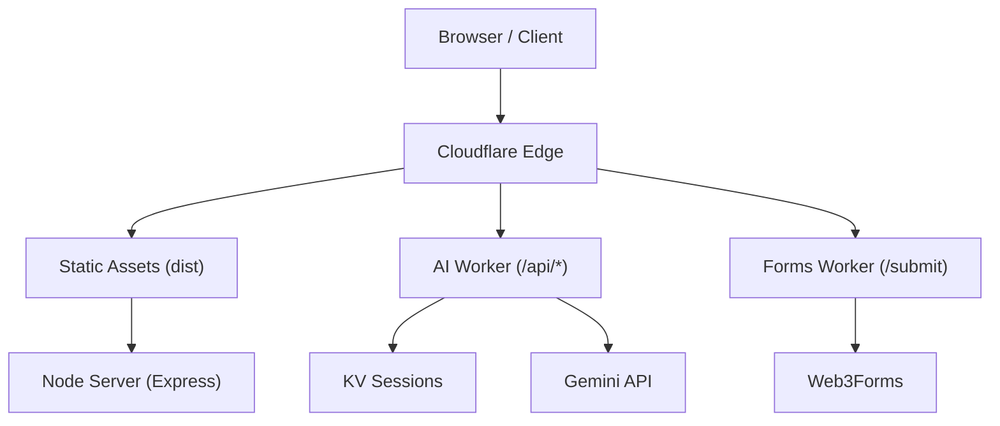

**Diagram sources**
- [wrangler.jsonc:1-30](file://wrangler.jsonc#L1-L30)
- [workers/webnovis-ai/src/index.js:508-543](file://workers/webnovis-ai/src/index.js#L508-L543)
- [workers/webnovis-forms/src/index.js:87-171](file://workers/webnovis-forms/src/index.js#L87-L171)
- [server.js:250-319](file://server.js#L250-L319)

**Section sources**
- [wrangler.jsonc:1-30](file://wrangler.jsonc#L1-L30)
- [server.js:250-319](file://server.js#L250-L319)

## Core Components
- Centralized security headers and CSP directives with nonce support helper and static header generation.
- CORS allowlists derived from environment variables and defaults.
- Node middleware stack: compression, CORS, JSON body size limits, canonical redirects, robots tags, trailing slash normalization, UTM stripping, bot logging, static file serving policies.
- Rate limiting on sensitive endpoints using express-rate-limit.
- Prompt injection detection and safe fallback responses.
- Session storage and TTL controls in Workers KV and Node memory.
- Turnstile verification in the forms proxy Worker.
- Secret management via environment variables and Wrangler secrets.

**Section sources**
- [config/security-headers.js:1-113](file://config/security-headers.js#L1-L113)
- [server.js:224-319](file://server.js#L224-L319)
- [workers/webnovis-ai/src/index.js:141-151](file://workers/webnovis-ai/src/index.js#L141-L151)
- [workers/webnovis-forms/src/index.js:36-85](file://workers/webnovis-forms/src/index.js#L36-L85)

## Architecture Overview
The system enforces defense-in-depth:
- Edge layer (Cloudflare): TLS termination, optional WAF rules, custom domains, and Workers runtime isolation.
- Static assets: served with cache policies; _headers generated from shared config.
- Node server: centralizes application logic, applies security headers, CORS, rate limiting, canonicalization, and input validation.
- Workers: implement stateful chat/search flows with KV-backed sessions and per-IP rate limiting; validate Turnstile tokens for forms.

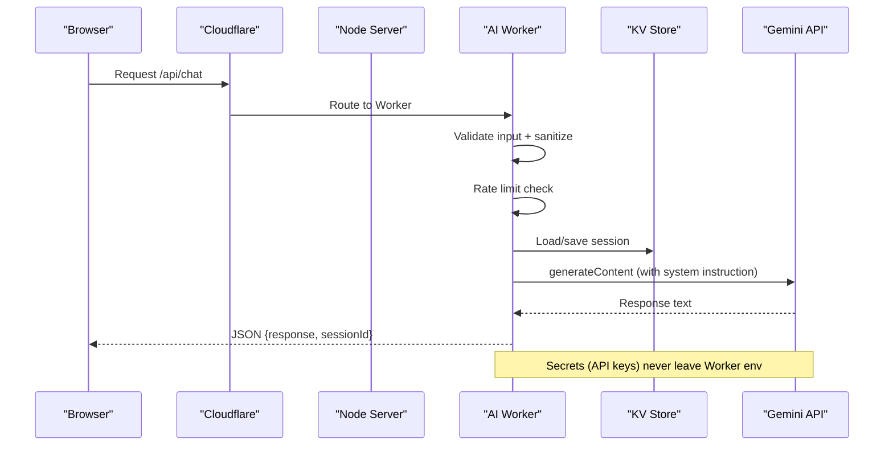

**Diagram sources**
- [workers/webnovis-ai/src/index.js:266-368](file://workers/webnovis-ai/src/index.js#L266-L368)
- [workers/webnovis-ai/src/index.js:141-151](file://workers/webnovis-ai/src/index.js#L141-L151)
- [workers/webnovis-ai/src/index.js:178-196](file://workers/webnovis-ai/src/index.js#L178-L196)
- [workers/webnovis-ai/src/index.js:198-247](file://workers/webnovis-ai/src/index.js#L198-L247)

## Detailed Component Analysis

### HTTP Security Headers and CSP
- Central policy defines HSTS, nosniff, X-Frame-Options, CSP, Referrer-Policy, Permissions-Policy, and legacy XSS protection flag.
- CSP includes strict frame-ancestors and controlled script/style/connect origins; supports per-request nonces for dynamic script execution.
- Static header generator produces platform-compatible _headers rules and caches for assets and HTML.

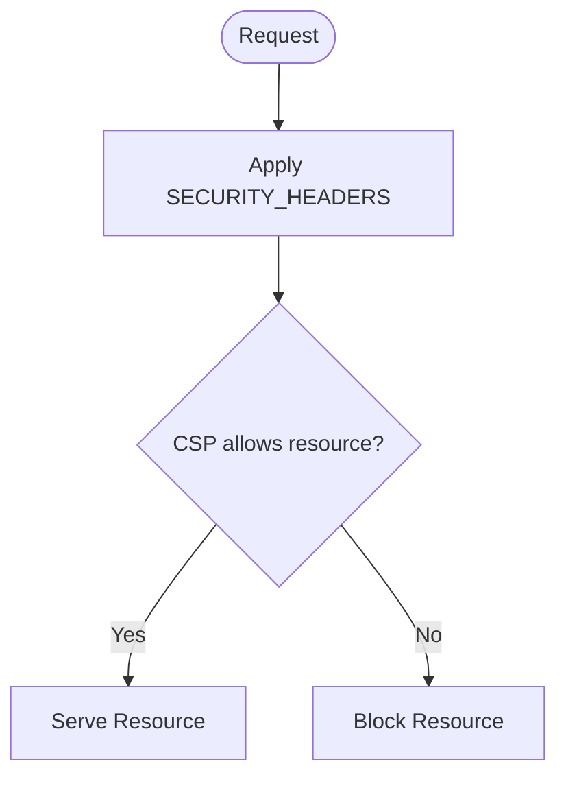

**Diagram sources**
- [config/security-headers.js:40-48](file://config/security-headers.js#L40-L48)
- [config/security-headers.js:64-101](file://config/security-headers.js#L64-L101)

**Section sources**
- [config/security-headers.js:1-113](file://config/security-headers.js#L1-L113)
- [server.js:300-319](file://server.js#L300-L319)
- [tests/security-header-regressions.test.js:16-58](file://tests/security-header-regressions.test.js#L16-L58)

### CORS Configuration
- Shared allowlist combines default trusted origins with environment overrides.
- Node uses cors middleware with explicit allowed methods and headers; local development origins are permitted.
- Workers compute per-request CORS headers based on Origin and environment allowlist.

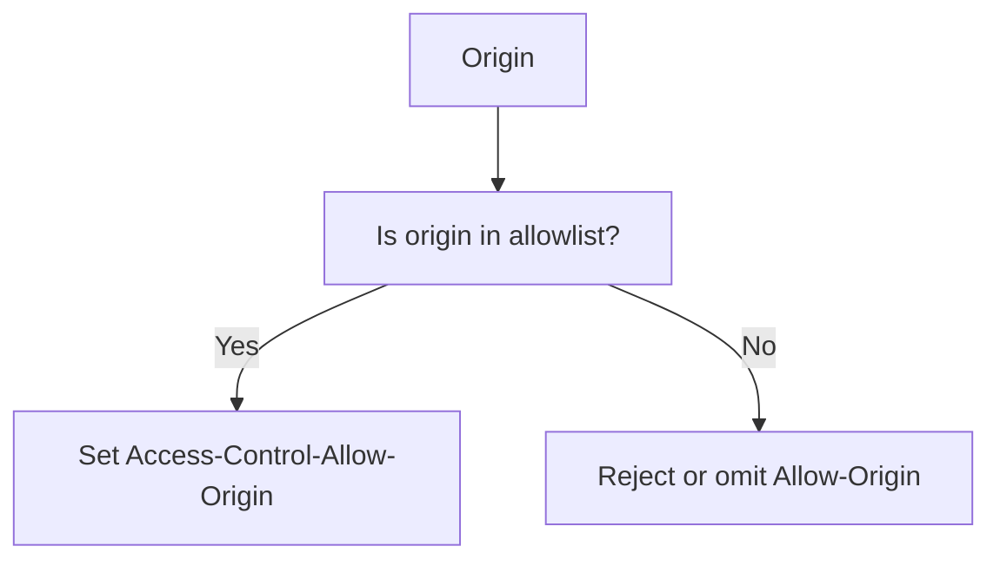

**Diagram sources**
- [config/security-headers.js:50-62](file://config/security-headers.js#L50-L62)
- [workers/webnovis-ai/src/index.js:80-116](file://workers/webnovis-ai/src/index.js#L80-L116)
- [server.js:250-282](file://server.js#L250-L282)

**Section sources**
- [config/security-headers.js:50-62](file://config/security-headers.js#L50-L62)
- [workers/webnovis-ai/src/index.js:80-116](file://workers/webnovis-ai/src/index.js#L80-L116)
- [server.js:250-282](file://server.js#L250-L282)

### Rate Limiting
- Node: express-rate-limit applied to chat and search endpoints with per-IP windows and messages.
- Workers: KV-backed sliding window counters keyed by IP and time bucket; returns remaining counts and 429 when exceeded.
- Quota guard in Node tracks daily usage against configured caps and warns near thresholds.

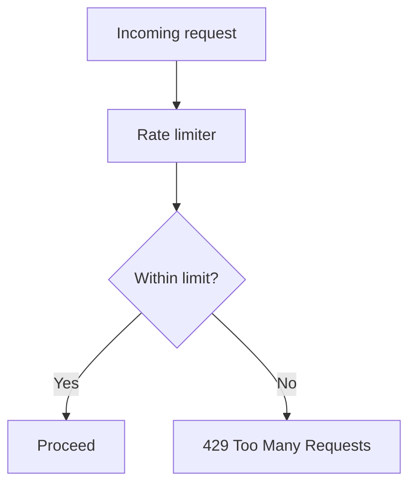

**Diagram sources**
- [server.js:252-262](file://server.js#L252-L262)
- [server.js:625-641](file://server.js#L625-L641)
- [workers/webnovis-ai/src/index.js:141-151](file://workers/webnovis-ai/src/index.js#L141-L151)

**Section sources**
- [server.js:252-262](file://server.js#L252-L262)
- [server.js:625-641](file://server.js#L625-L641)
- [workers/webnovis-ai/src/index.js:141-151](file://workers/webnovis-ai/src/index.js#L141-L151)

### Input Sanitization and Validation
- Strict JSON body size limits on the Node server.
- Chat/search inputs sanitized: strip HTML tags, trim, enforce length bounds, normalize paths.
- Search current page normalized to safe path pattern.
- Output cleaned to remove markdown artifacts and ensure safe rendering.

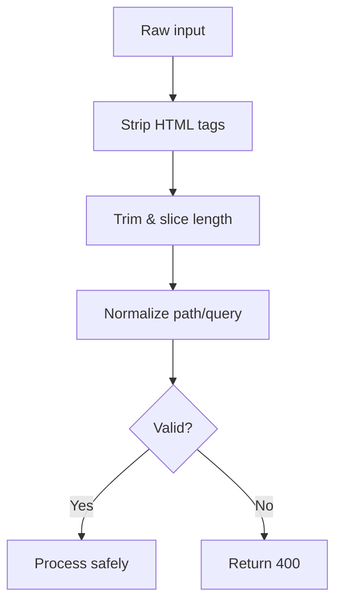

**Diagram sources**
- [server.js:287-287](file://server.js#L287-L287)
- [workers/webnovis-ai/src/index.js:266-278](file://workers/webnovis-ai/src/index.js#L266-L278)
- [workers/webnovis-ai/src/index.js:370-385](file://workers/webnovis-ai/src/index.js#L370-L385)
- [server.js:670-673](file://server.js#L670-L673)

**Section sources**
- [server.js:287-287](file://server.js#L287-L287)
- [workers/webnovis-ai/src/index.js:266-278](file://workers/webnovis-ai/src/index.js#L266-L278)
- [workers/webnovis-ai/src/index.js:370-385](file://workers/webnovis-ai/src/index.js#L370-L385)
- [server.js:670-673](file://server.js#L670-L673)

### Prompt Injection Protection
- Shared regex-based guards detect known injection patterns in Italian and English, including leetspeak, role-play escalation, jailbreak keywords, and system prompt extraction attempts.
- On detection, safe fallback responses are returned instead of invoking external models.
- Guards are applied in both Node and Worker code paths for chat and search.

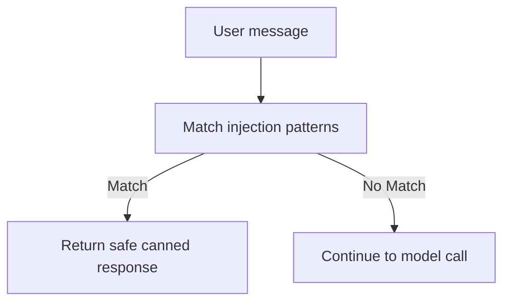

**Diagram sources**
- [server.js:129-178](file://server.js#L129-L178)
- [workers/webnovis-ai/src/index.js:35-69](file://workers/webnovis-ai/src/index.js#L35-L69)
- [workers/webnovis-ai/src/index.js:284-286](file://workers/webnovis-ai/src/index.js#L284-L286)
- [workers/webnovis-ai/src/index.js:388-390](file://workers/webnovis-ai/src/index.js#L388-L390)

**Section sources**
- [server.js:129-178](file://server.js#L129-L178)
- [workers/webnovis-ai/src/index.js:35-69](file://workers/webnovis-ai/src/index.js#L35-L69)
- [workers/webnovis-ai/src/index.js:284-286](file://workers/webnovis-ai/src/index.js#L284-L286)
- [workers/webnovis-ai/src/index.js:388-390](file://workers/webnovis-ai/src/index.js#L388-L390)

### API Key Management and Secure Communication
- API keys are read from environment variables or Wrangler secrets; never embedded in source or client responses.
- External calls use HTTPS with timeouts and structured error handling; retries/fallbacks used where appropriate.
- Node enforces daily quota tracking per key with warnings and hard blocks at limits.

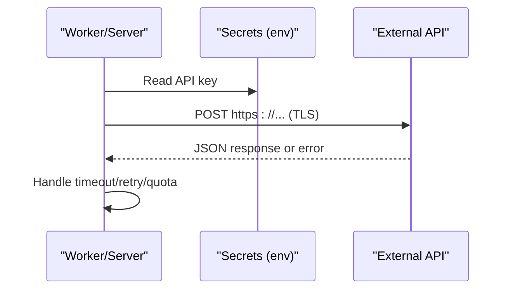

**Diagram sources**
- [workers/webnovis-ai/src/index.js:198-247](file://workers/webnovis-ai/src/index.js#L198-L247)
- [server.js:686-709](file://server.js#L686-L709)
- [server.js:180-220](file://server.js#L180-L220)

**Section sources**
- [workers/webnovis-ai/src/index.js:198-247](file://workers/webnovis-ai/src/index.js#L198-L247)
- [server.js:686-709](file://server.js#L686-L709)
- [server.js:180-220](file://server.js#L180-L220)

### Authentication and Authorization
- Admin-only endpoints protected by a secret header validated with timing-safe comparison; startup checks warn if placeholder values remain in production.
- No traditional session cookies are used for user auth; stateless requests rely on rate limiting and token-based protections (Turnstile).

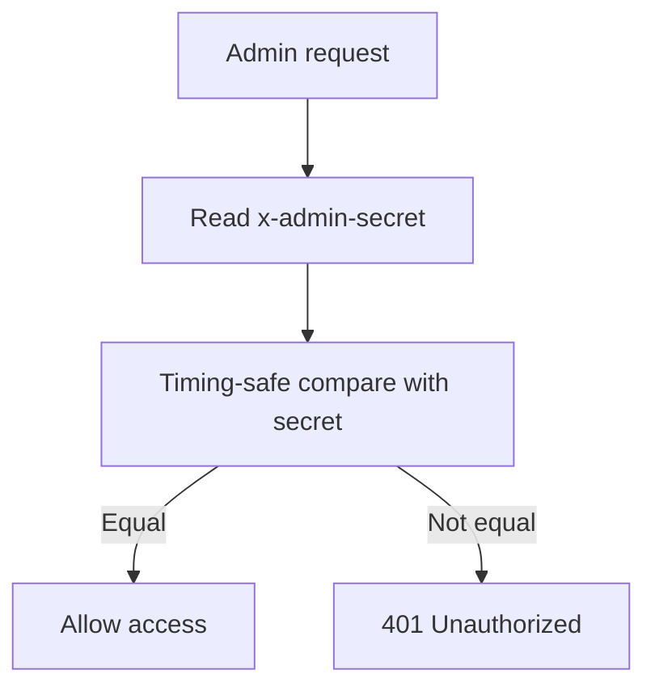

**Diagram sources**
- [server.js:75-93](file://server.js#L75-L93)

**Section sources**
- [server.js:75-93](file://server.js#L75-L93)

### Session Management
- Node: in-memory Map with max concurrent sessions, last activity timestamps, and periodic cleanup.
- Workers: KV-backed sessions with TTL, message history trimming, and deterministic session ID handling.

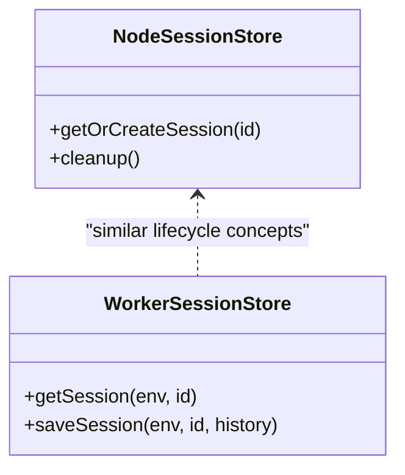

**Diagram sources**
- [server.js:584-619](file://server.js#L584-L619)
- [workers/webnovis-ai/src/index.js:178-196](file://workers/webnovis-ai/src/index.js#L178-L196)

**Section sources**
- [server.js:584-619](file://server.js#L584-L619)
- [workers/webnovis-ai/src/index.js:178-196](file://workers/webnovis-ai/src/index.js#L178-L196)

### CSRF Protection (Turnstile)
- Form submissions validated server-side via Turnstile siteverify; hostname and action checks enforced.
- Fallback to Web3Forms only after successful verification; honeypot field included.

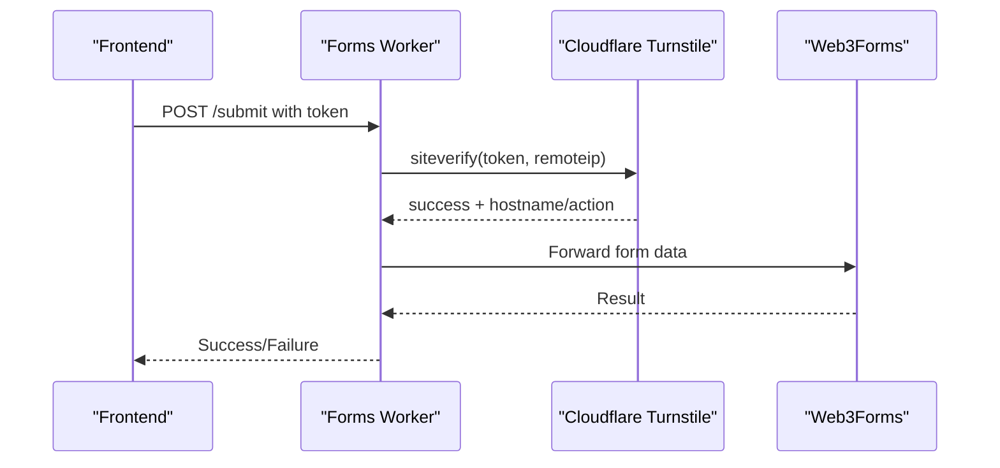

**Diagram sources**
- [workers/webnovis-forms/src/index.js:36-85](file://workers/webnovis-forms/src/index.js#L36-L85)
- [workers/webnovis-forms/src/index.js:125-169](file://workers/webnovis-forms/src/index.js#L125-L169)

**Section sources**
- [workers/webnovis-forms/src/index.js:36-85](file://workers/webnovis-forms/src/index.js#L36-L85)
- [workers/webnovis-forms/src/index.js:125-169](file://workers/webnovis-forms/src/index.js#L125-L169)
- [docs/TURNSTILE-SETUP.md:1-65](file://docs/TURNSTILE-SETUP.md#L1-L65)

### Cloudflare Workers Security Features and Deployment Settings
- Workers isolate secrets via environment bindings; KV used for rate limiting and sessions with TTL.
- wrangler configuration disables automatic HTML handling to preserve canonical URLs and avoid unintended redirects.
- Custom domain setup documented for stable API endpoints.

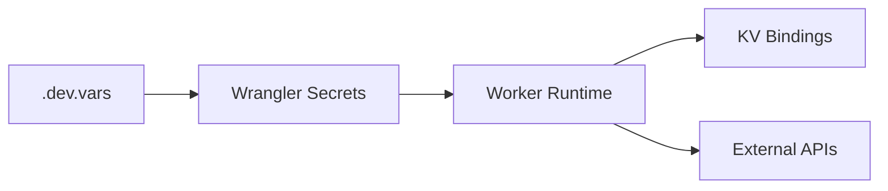

**Diagram sources**
- [wrangler.jsonc:1-30](file://wrangler.jsonc#L1-L30)
- [docs/CLOUDFLARE-AI-SETUP.md:71-111](file://docs/CLOUDFLARE-AI-SETUP.md#L71-L111)

**Section sources**
- [wrangler.jsonc:1-30](file://wrangler.jsonc#L1-L30)
- [docs/CLOUDFLARE-AI-SETUP.md:71-111](file://docs/CLOUDFLARE-AI-SETUP.md#L71-L111)

### Governance Framework: Content Security, SEO Compliance, Regulatory Requirements
- Robots tagging prevents indexing of API/admin routes.
- Canonical host redirect ensures single primary domain.
- Trailing slash normalization and UTM parameter stripping reduce duplicate content risks.
- Legal pages include required landmarks and structured data; regression tests enforce these constraints.

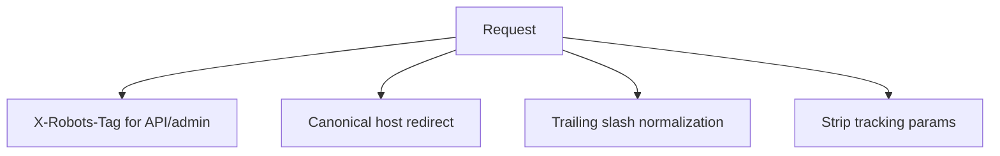

**Diagram sources**
- [server.js:291-319](file://server.js#L291-L319)
- [server.js:358-384](file://server.js#L358-L384)
- [tests/security-and-legal-regressions.test.js:45-80](file://tests/security-and-legal-regressions.test.js#L45-L80)

**Section sources**
- [server.js:291-319](file://server.js#L291-L319)
- [server.js:358-384](file://server.js#L358-L384)
- [tests/security-and-legal-regressions.test.js:45-80](file://tests/security-and-legal-regressions.test.js#L45-L80)

## Dependency Analysis
- Shared security policy is imported by the Node server and referenced by tests to ensure consistency between runtime and static headers.
- Workers depend on KV for persistence and rate limiting; they also depend on external AI providers and email services.
- Tests assert that the server imports and applies the shared security configuration and that generated headers match committed files.

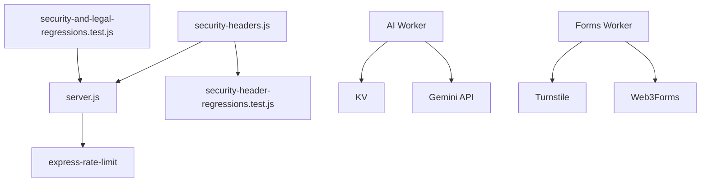

**Diagram sources**
- [server.js:10-11](file://server.js#L10-L11)
- [tests/security-header-regressions.test.js:16-24](file://tests/security-header-regressions.test.js#L16-L24)
- [tests/security-and-legal-regressions.test.js:13-31](file://tests/security-and-legal-regressions.test.js#L13-L31)
- [workers/webnovis-ai/src/index.js:141-151](file://workers/webnovis-ai/src/index.js#L141-L151)
- [workers/webnovis-forms/src/index.js:36-85](file://workers/webnovis-forms/src/index.js#L36-L85)

**Section sources**
- [server.js:10-11](file://server.js#L10-L11)
- [tests/security-header-regressions.test.js:16-24](file://tests/security-header-regressions.test.js#L16-L24)
- [tests/security-and-legal-regressions.test.js:13-31](file://tests/security-and-legal-regressions.test.js#L13-L31)

## Performance Considerations
- Compression reduces payload sizes for text-heavy responses.
- Cache policies differentiate between static assets (immutable in production) and HTML (short TTL with stale-while-revalidate).
- In-memory deduplication and caching for search queries reduce redundant API calls.
- Workers leverage KV with TTLs to keep sessions and rate limit buckets efficient.

[No sources needed since this section provides general guidance]

## Troubleshooting Guide
- If CSP blocks resources, update allowlisted domains and regenerate static headers.
- If chat/search fail, verify Worker secrets, KV binding presence, and upstream API availability; check fallback behavior and logs.
- If forms fail Turnstile, confirm widget domains, secret configuration, and hostname/action checks.
- Use health endpoints to verify service status and configuration readiness.

**Section sources**
- [docs/CLOUDFLARE-AI-SETUP.md:256-274](file://docs/CLOUDFLARE-AI-SETUP.md#L256-L274)
- [workers/webnovis-ai/src/index.js:518-541](file://workers/webnovis-ai/src/index.js#L518-L541)
- [workers/webnovis-forms/src/index.js:95-105](file://workers/webnovis-forms/src/index.js#L95-L105)

## Conclusion
WebNovis implements a robust, layered security posture combining centralized header policies, strict CORS, rate limiting, input sanitization, prompt injection defenses, secret-managed API integrations, and Cloudflare-native features. Continuous testing ensures alignment between runtime behavior and committed policies, while governance measures maintain SEO and regulatory compliance.

[No sources needed since this section summarizes without analyzing specific files]

## Appendices

### Security Monitoring and Incident Response
- Monitor rate limit rejections and KV errors to detect abuse spikes.
- Track API quota usage and set alerts near warning thresholds.
- Maintain logs for bot access and errors; rotate logs to prevent disk pressure.
- For incidents involving leaked secrets, rotate credentials immediately and audit access logs.

[No sources needed since this section provides general guidance]

### Best Practices for Development and Production
- Never commit secrets; use .env.example placeholders and Wrangler secrets for deployment.
- Keep CSP allowlists minimal and synchronized with deployed assets.
- Enforce rate limits in all environments; do not disable them in production.
- Validate all inputs and outputs; prefer server-side processing for sensitive operations.
- Regularly run regression tests to ensure header and policy consistency.

[No sources needed since this section provides general guidance]