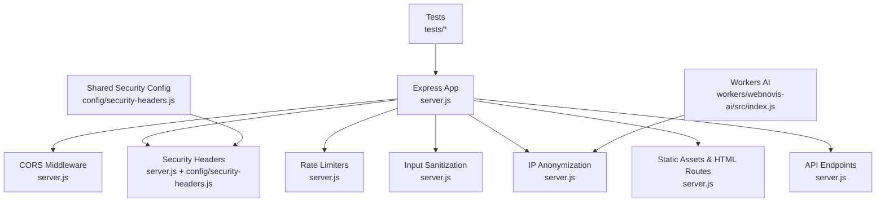
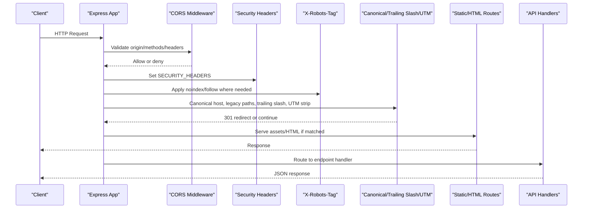
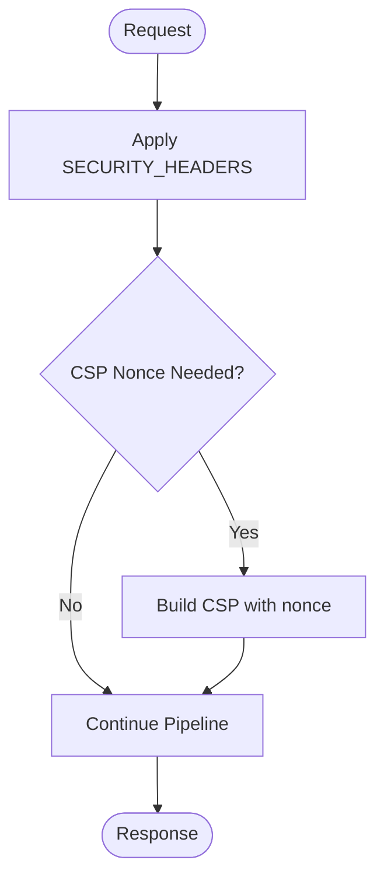
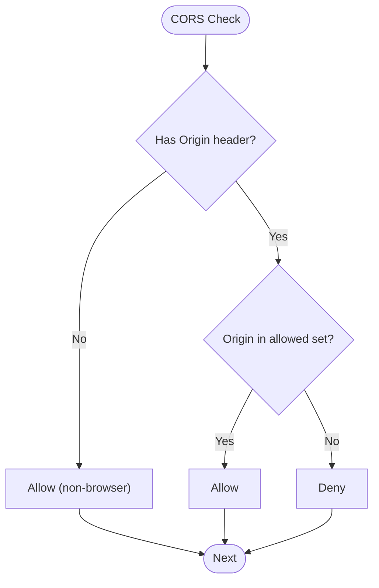
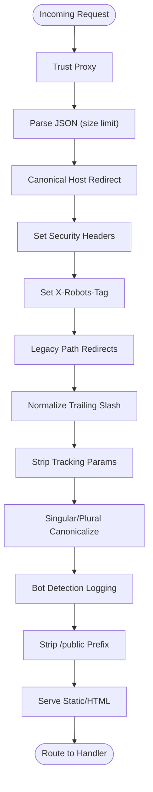
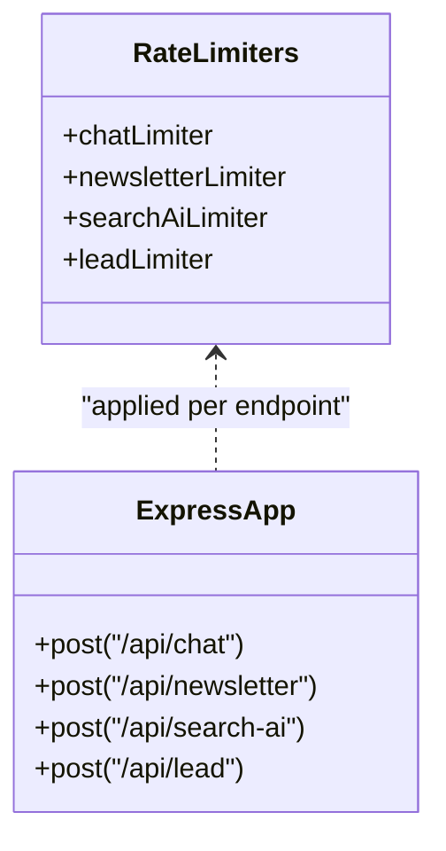
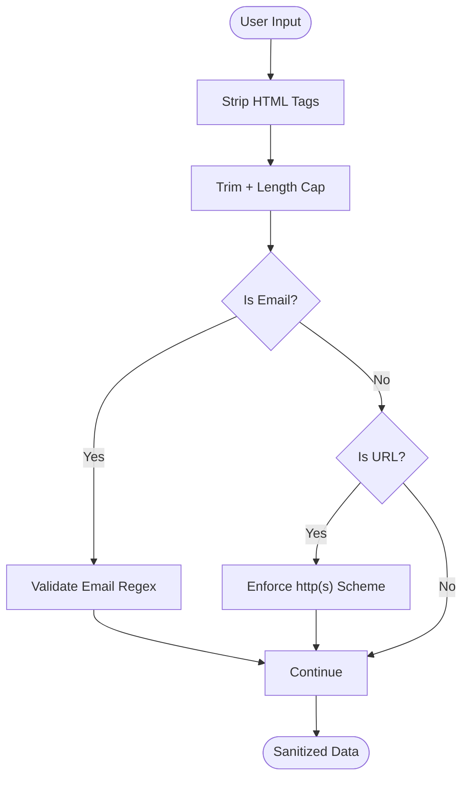
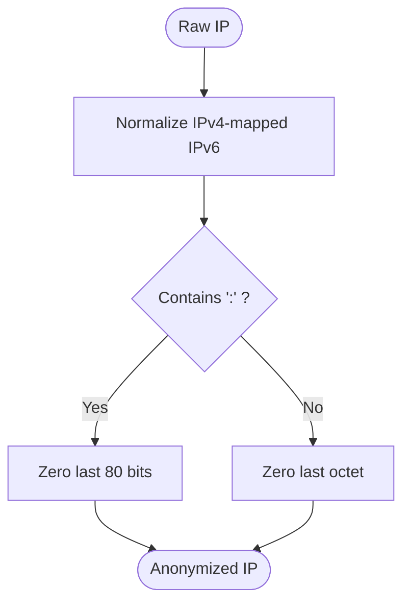
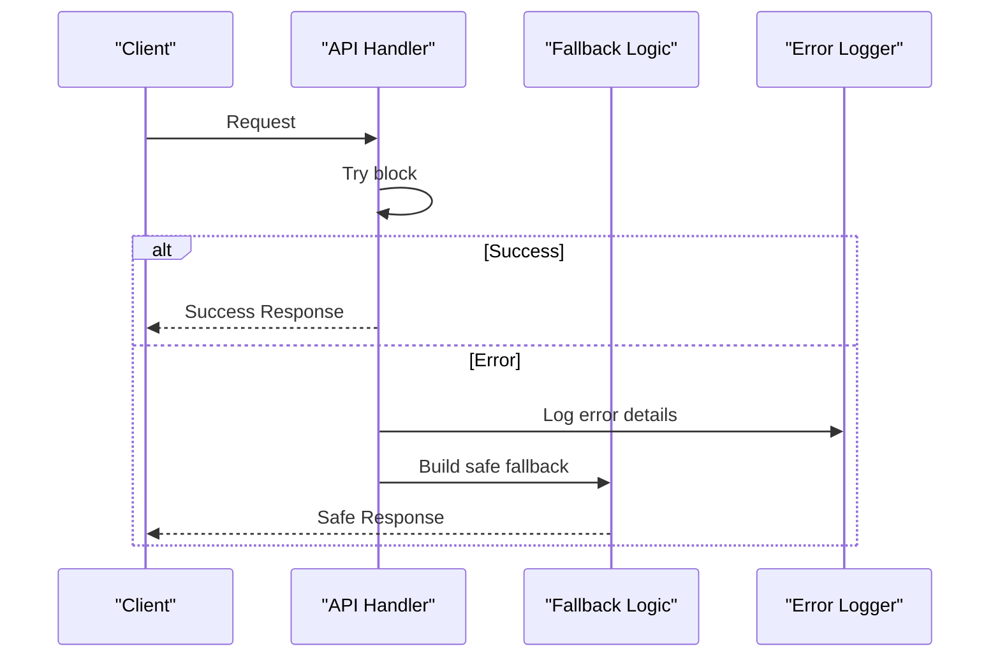
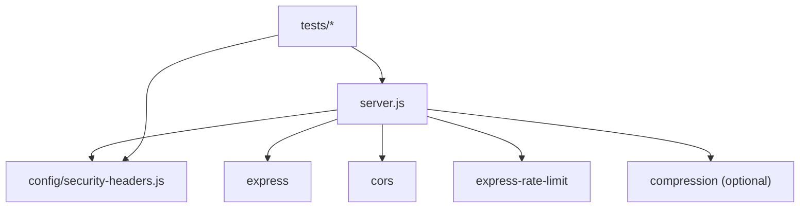

# Security Middleware Stack

<cite>
**Referenced Files in This Document**
- [server.js](file://server.js)
- [security-headers.js](file://config/security-headers.js)
- [security-and-legal-regressions.test.js](file://tests/security-and-legal-regressions.test.js)
- [security-header-regressions.test.js](file://tests/security-header-regressions.test.js)
- [webnovis-ai index.js](file://workers/webnovis-ai/src/index.js)
</cite>

## Table of Contents
1. [Introduction](#introduction)
2. [Project Structure](#project-structure)
3. [Core Components](#core-components)
4. [Architecture Overview](#architecture-overview)
5. [Detailed Component Analysis](#detailed-component-analysis)
6. [Dependency Analysis](#dependency-analysis)
7. [Performance Considerations](#performance-considerations)
8. [Troubleshooting Guide](#troubleshooting-guide)
9. [Conclusion](#conclusion)

## Introduction
This document explains the WebNovis Express.js security middleware stack. It covers HTTP security headers, CORS with dynamic origin validation, request/response processing pipeline, rate limiting via express-rate-limit, input sanitization, and IP anonymization for GDPR compliance. It also documents middleware execution order, error handling patterns, how security layers are applied to routes, concrete configuration examples, performance considerations, best practices, and debugging techniques.

## Project Structure
The security middleware is implemented primarily in the server entrypoint and a shared security configuration module:
- server.js: Express application setup, middleware chain, route handlers, and security utilities (rate limiters, sanitizers, IP anonymizer).
- config/security-headers.js: Centralized security headers policy, CSP directives, CORS helpers, and static header file generator.
- tests/*: Regression tests ensuring the server uses shared security config and that generated headers stay in sync with committed files.
- workers/webnovis-ai/src/index.js: Cloudflare Worker implementation mirroring IP anonymization and rate limiting patterns used by the Node server.

**Diagram sources**
- [server.js:264-306](file://server.js#L264-L306)
- [security-headers.js:40-48](file://config/security-headers.js#L40-L48)

**Section sources**
- [server.js:1-120](file://server.js#L1-L120)
- [security-headers.js:1-113](file://config/security-headers.js#L1-L113)

## Core Components
- HTTP Security Headers: Applied globally via a shared configuration object; includes HSTS, X-Content-Type-Options, X-Frame-Options, CSP, Referrer-Policy, Permissions-Policy, and XSS-Protection.
- CORS: Dynamic origin validation using an allowed set derived from defaults plus environment variable CORS_ORIGINS; local development origins allowed; non-browser requests without Origin are permitted but protected by other controls.
- Rate Limiting: Per-endpoint limiters built with express-rate-limit; chat, newsletter, search AI, and lead capture endpoints each have tailored windows and max values.
- Input Sanitization: Request bodies sanitized (HTML tag stripping, length limits, URL validation), query parameters normalized, and session IDs validated.
- IP Anonymization: IPv4 last octet zeroed; IPv6 last 80 bits zeroed; used when logging PII-sensitive data to comply with GDPR.
- Compression: Optional Brotli/Gzip compression middleware enabled when available.

**Section sources**
- [server.js:234-287](file://server.js#L234-L287)
- [server.js:252-282](file://server.js#L252-L282)
- [server.js:95-127](file://server.js#L95-L127)
- [security-headers.js:40-48](file://config/security-headers.js#L40-L48)

## Architecture Overview
The Express middleware stack applies security early and consistently across all requests. The sequence ensures canonical redirects, strict headers, robots directives, legacy path normalization, trailing slash handling, UTM stripping, bot logging, and static asset serving before reaching API handlers.

**Diagram sources**
- [server.js:264-306](file://server.js#L264-L306)
- [server.js:289-384](file://server.js#L289-L384)
- [server.js:441-526](file://server.js#L441-L526)

## Detailed Component Analysis

### HTTP Security Headers
- Centralized policy defined in a shared module and applied via a global middleware.
- Includes HSTS, nosniff, DENY framing, CSP with whitelisted domains, strict referrer policy, permissions policy disabling camera/microphone/geolocation, and XSS protection disabled in favor of CSP.
- CSP can be extended with per-request nonce generation helper; currently not used because inline script injection must be coordinated across all templates.

**Diagram sources**
- [security-headers.js:40-48](file://config/security-headers.js#L40-L48)
- [security-headers.js:31-38](file://config/security-headers.js#L31-L38)

**Section sources**
- [server.js:300-306](file://server.js#L300-L306)
- [security-headers.js:1-48](file://config/security-headers.js#L1-L48)

### CORS Configuration with Dynamic Origin Validation
- Allowed origins include default production origins plus any additional origins provided via CORS_ORIGINS environment variable.
- Local development origins (localhost/127.0.0.1) are allowed regardless of CORS_ORIGINS.
- Requests without Origin header (e.g., curl, server-to-server) are allowed through CORS but rely on rate limiting and admin authentication for sensitive endpoints.
- Methods and allowed headers are explicitly configured.

**Diagram sources**
- [server.js:264-282](file://server.js#L264-L282)
- [security-headers.js:57-62](file://config/security-headers.js#L57-L62)

**Section sources**
- [server.js:264-282](file://server.js#L264-L282)
- [security-headers.js:57-62](file://config/security-headers.js#L57-L62)

### Request/Response Processing Pipeline
- Trust proxy setting enables correct client IP resolution behind load balancers.
- JSON body parser with size limit prevents oversized payloads.
- Canonical host redirect enforces www in production.
- Security headers applied globally.
- X-Robots-Tag applied to API/admin paths and specific pages based on governance rules.
- Legacy path redirects, trailing slash normalization, UTM parameter stripping, singular/plural page canonicalization, and /public prefix stripping ensure clean URLs.
- Bot detection logs user-agent matches to a rotating log file.
- Static assets served with appropriate cache policies; HTML directories use short cache with stale-while-revalidate.

**Diagram sources**
- [server.js:284-384](file://server.js#L284-L384)
- [server.js:395-439](file://server.js#L395-L439)
- [server.js:441-526](file://server.js#L441-L526)

**Section sources**
- [server.js:284-384](file://server.js#L284-L384)
- [server.js:395-439](file://server.js#L395-L439)
- [server.js:441-526](file://server.js#L441-L526)

### Rate Limiting Implementation
- express-rate-limit is required at startup; in production, missing dependency causes fatal exit to enforce protection.
- Chat limiter: 30 requests per 15 minutes per IP.
- Newsletter limiter: 10 requests per 15 minutes per IP.
- Search AI limiter: 10 requests per minute per IP.
- Lead limiter: 5 requests per 15 minutes per IP.
- All limiters use standard headers and disable legacy headers.

**Diagram sources**
- [server.js:95-107](file://server.js#L95-L107)
- [server.js:252-262](file://server.js#L252-L262)
- [server.js:625-641](file://server.js#L625-L641)
- [server.js:891-897](file://server.js#L891-L897)

**Section sources**
- [server.js:95-107](file://server.js#L95-L107)
- [server.js:252-262](file://server.js#L252-L262)
- [server.js:625-641](file://server.js#L625-L641)
- [server.js:891-897](file://server.js#L891-L897)

### Input Sanitization Functions
- HTML tag stripping on user inputs (messages, queries, URLs).
- Length limits enforced on messages, queries, and URLs.
- Email validation via regex.
- URL linkability check restricts clickable links to http(s) schemes.
- Current page parameter sanitized against path pattern.

**Diagram sources**
- [server.js:747-753](file://server.js#L747-L753)
- [server.js:829-832](file://server.js#L829-L832)
- [server.js:905-915](file://server.js#L905-L915)
- [server.js:670-673](file://server.js#L670-L673)

**Section sources**
- [server.js:747-753](file://server.js#L747-L753)
- [server.js:829-832](file://server.js#L829-L832)
- [server.js:905-915](file://server.js#L905-L915)
- [server.js:670-673](file://server.js#L670-L673)

### IP Anonymization for GDPR Compliance
- IPv4: last octet zeroed.
- IPv6: last 80 bits zeroed while preserving first three groups.
- Used when logging leads and chat intents to avoid storing raw PII.

**Diagram sources**
- [server.js:112-127](file://server.js#L112-L127)

**Section sources**
- [server.js:112-127](file://server.js#L112-L127)

### Error Handling Patterns
- Global try/catch blocks around API handlers return safe fallback responses or JSON errors.
- Graceful fallbacks for AI calls when quotas exceeded or APIs unavailable.
- Custom 404 handler serves branded HTML for browsers and JSON for API clients.
- Admin-only endpoints validate secrets using timing-safe comparison.

**Diagram sources**
- [server.js:805-815](file://server.js#L805-L815)
- [server.js:1263-1278](file://server.js#L1263-L1278)
- [server.js:1569-1579](file://server.js#L1569-L1579)
- [server.js:76-93](file://server.js#L76-L93)

**Section sources**
- [server.js:805-815](file://server.js#L805-L815)
- [server.js:1263-1278](file://server.js#L1263-L1278)
- [server.js:1569-1579](file://server.js#L1569-L1579)
- [server.js:76-93](file://server.js#L76-L93)

### Security Layers Applied to Different Routes
- Global middleware: CORS, headers, robots tags, redirects, static serving.
- Endpoint-specific middleware: rate limiters, admin auth, input validation.
- API endpoints (/api/*): X-Robots-Tag noindex/nofollow enforced.
- Health endpoint: public, no rate limiting.
- Admin endpoints: requireAdminAuth middleware protects configuration and newsletter send/preview/subscribers.

**Section sources**
- [server.js:308-319](file://server.js#L308-L319)
- [server.js:817-820](file://server.js#L817-L820)
- [server.js:1328-1409](file://server.js#L1328-L1409)

## Dependency Analysis
- Express core dependencies: cors, compression (optional), express-rate-limit (required in production).
- Shared security configuration centralizes headers and CORS helpers, ensuring consistency across runtime and static header files.
- Tests assert that server imports shared config and that generated headers match committed _headers file.

**Diagram sources**
- [server.js:234-250](file://server.js#L234-L250)
- [server.js:95-107](file://server.js#L95-L107)
- [security-and-legal-regressions.test.js:13-31](file://tests/security-and-legal-regressions.test.js#L13-L31)
- [security-header-regressions.test.js:26-31](file://tests/security-header-regressions.test.js#L26-L31)

**Section sources**
- [server.js:234-250](file://server.js#L234-L250)
- [server.js:95-107](file://server.js#L95-L107)
- [security-and-legal-regressions.test.js:13-31](file://tests/security-and-legal-regressions.test.js#L13-L31)
- [security-header-regressions.test.js:26-31](file://tests/security-header-regressions.test.js#L26-L31)

## Performance Considerations
- Compression middleware reduces transfer sizes for text assets when installed.
- Static assets use long-lived caching in production; HTML uses short cache with stale-while-revalidate.
- In-memory caches for search AI results reduce external API calls; TTL-based eviction keeps memory bounded.
- In-flight deduplication coalesces concurrent identical queries to minimize redundant work.
- Session store caps concurrent sessions and evicts oldest when capacity reached; periodic cleanup removes expired sessions.
- Quota tracking warns and blocks API usage when daily limits approached or exceeded.

[No sources needed since this section provides general guidance]

## Troubleshooting Guide
- Missing express-rate-limit in production causes fatal startup; install dependency to proceed.
- Verify CORS origins via CORS_ORIGINS environment variable; ensure local development origins are allowed during dev.
- Confirm security headers are applied by checking response headers; ensure _headers file stays synchronized with shared config.
- Debug rate limiting by inspecting Retry-After headers and logs; adjust windowMs/max per endpoint needs.
- Inspect bot-access.log for crawler behavior and potential abuse patterns.
- Use health endpoint to verify server liveness.

**Section sources**
- [server.js:95-107](file://server.js#L95-L107)
- [server.js:264-282](file://server.js#L264-L282)
- [security-header-regressions.test.js:26-31](file://tests/security-header-regressions.test.js#L26-L31)
- [server.js:395-429](file://server.js#L395-L429)
- [server.js:817-820](file://server.js#L817-L820)

## Conclusion
WebNovis implements a robust, layered security middleware stack centered on centralized headers, dynamic CORS validation, per-endpoint rate limiting, thorough input sanitization, and GDPR-compliant IP anonymization. The pipeline enforces canonical URLs, strong security headers, and careful caching strategies while providing resilient error handling and graceful fallbacks. Consistent testing ensures configuration integrity and operational reliability.

[No sources needed since this section summarizes without analyzing specific files]