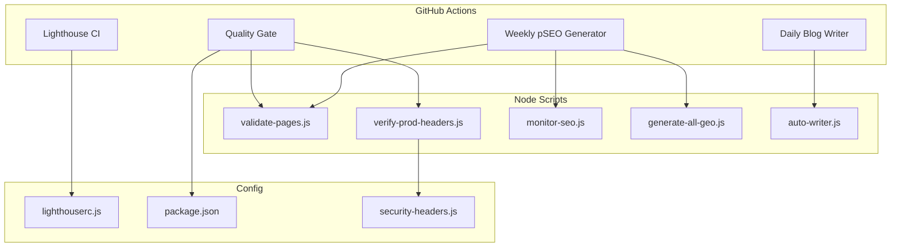
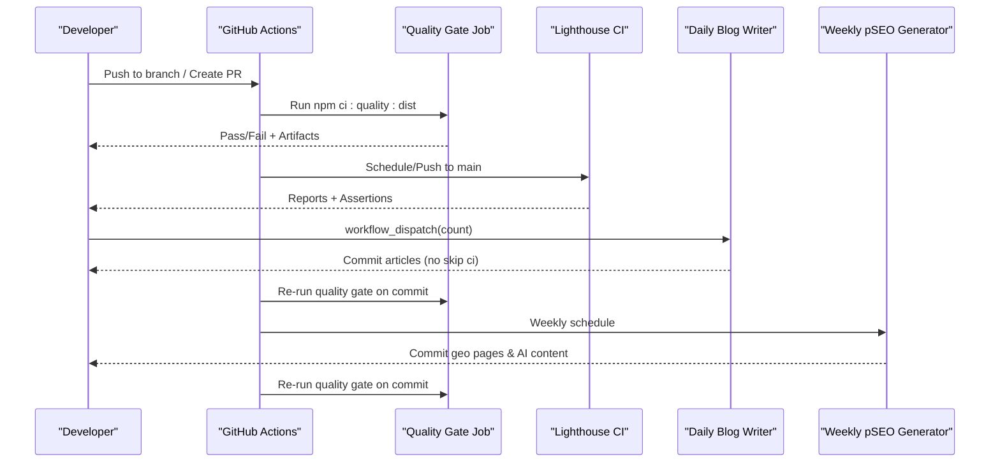
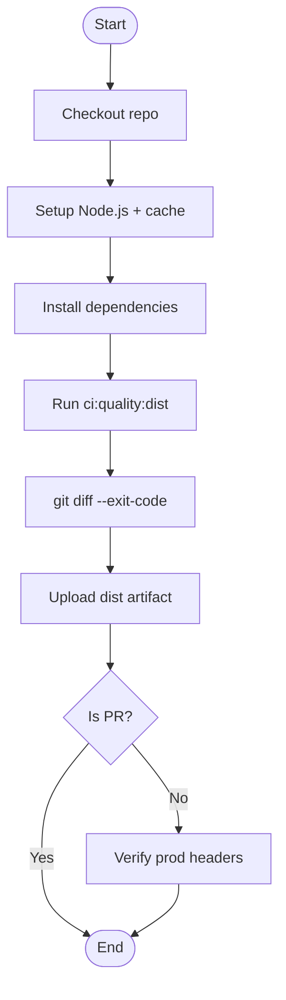
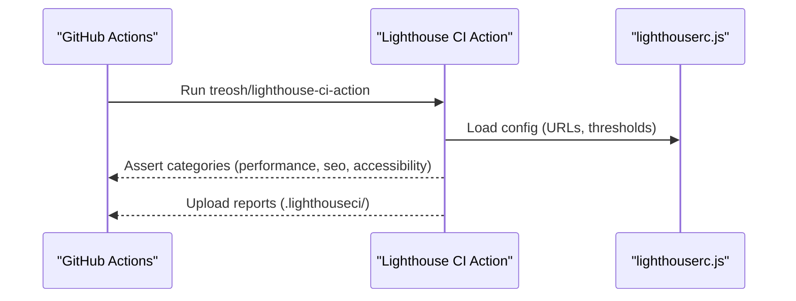
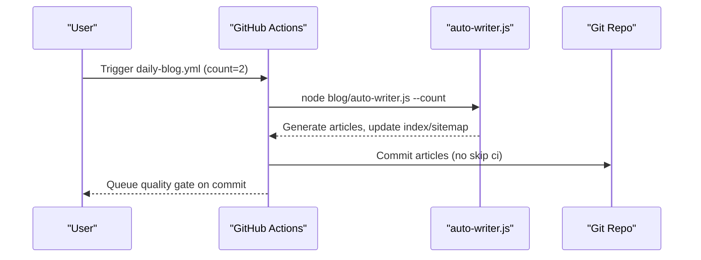
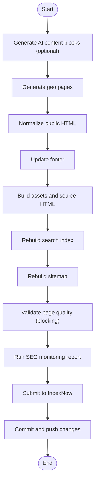
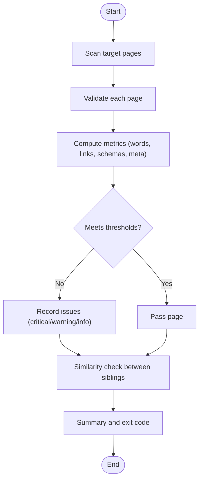
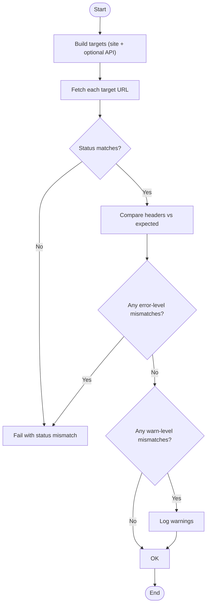
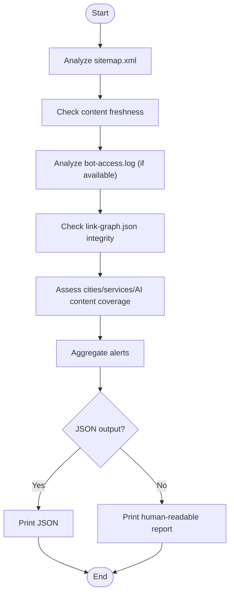
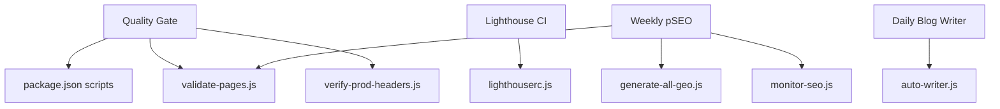

# CI/CD Pipeline & Quality Gates

<cite>
**Referenced Files in This Document**
- [quality-gate.yml](file://.github/workflows/quality-gate.yml)
- [daily-blog.yml](file://.github/workflows/daily-blog.yml)
- [lighthouse-ci.yml](file://.github/workflows/lighthouse-ci.yml)
- [weekly-pseo.yml](file://.github/workflows/weekly-pseo.yml)
- [lighthouserc.js](file://lighthouserc.js)
- [package.json](file://package.json)
- [validate-pages.js](file://scripts/validate-pages.js)
- [verify-prod-headers.js](file://scripts/verify-prod-headers.js)
- [monitor-seo.js](file://scripts/monitor-seo.js)
- [generate-all-geo.js](file://scripts/generate-all-geo.js)
- [auto-writer.js](file://blog/auto-writer.js)
- [security-headers.js](file://config/security-headers.js)
- [build-pipeline-regressions.test.js](file://tests/build-pipeline-regressions.test.js)
- [seo-smoke.test.js](file://tests/seo-smoke.test.js)
</cite>

## Table of Contents
1. [Introduction](#introduction)
2. [Project Structure](#project-structure)
3. [Core Components](#core-components)
4. [Architecture Overview](#architecture-overview)
5. [Detailed Component Analysis](#detailed-component-analysis)
6. [Dependency Analysis](#dependency-analysis)
7. [Performance Considerations](#performance-considerations)
8. [Troubleshooting Guide](#troubleshooting-guide)
9. [Conclusion](#conclusion)
10. [Appendices](#appendices)

## Introduction
This document explains the WebNovis CI/CD pipeline and quality gate automation implemented with GitHub Actions. It covers automated testing, code quality checks, performance auditing via Lighthouse, daily blog generation, weekly Progressive SEO (pSEO) automation, branching strategy, pull request validation, and release preparation. It also provides guidance on configuring new quality gates, adding custom checks, troubleshooting failures, and optimizing build times.

## Project Structure
The CI/CD system is defined primarily under .github/workflows and supported by Node scripts and tests:
- Workflows:
  - quality-gate.yml: Main quality gate for PRs and pushes to main
  - lighthouse-ci.yml: Weekly and push-based Lighthouse audits
  - daily-blog.yml: Manual-triggered AI blog article generator
  - weekly-pseo.yml: Weekly pSEO content and page regeneration
- Scripts:
  - validate-pages.js: Page quality validator enforcing word count, schema, canonical, H1, meta description, similarity thresholds
  - verify-prod-headers.js: Production header verification against a security policy
  - monitor-seo.js: Post-deploy SEO monitoring report
  - generate-all-geo.js: Unified geo page generator for agenzia, realizzazione, and servizio×city pages
  - auto-writer.js: AI-powered blog article writer with Gemini/Groq fallback
- Configuration:
  - lighthouserc.js: Lighthouse targets and thresholds
  - package.json: Build/test/deploy scripts consumed by workflows
  - security-headers.js: Security headers policy used by production header verifier

**Diagram sources**
- [quality-gate.yml:1-47](file://.github/workflows/quality-gate.yml#L1-L47)
- [lighthouse-ci.yml:1-27](file://.github/workflows/lighthouse-ci.yml#L1-L27)
- [daily-blog.yml:1-56](file://.github/workflows/daily-blog.yml#L1-L56)
- [weekly-pseo.yml:1-120](file://.github/workflows/weekly-pseo.yml#L1-L120)
- [validate-pages.js:1-433](file://scripts/validate-pages.js#L1-L433)
- [verify-prod-headers.js:1-172](file://scripts/verify-prod-headers.js#L1-L172)
- [monitor-seo.js:1-415](file://scripts/monitor-seo.js#L1-L415)
- [generate-all-geo.js:1-58](file://scripts/generate-all-geo.js#L1-L58)
- [auto-writer.js:1-800](file://blog/auto-writer.js#L1-L800)
- [lighthouserc.js:1-28](file://lighthouserc.js#L1-L28)
- [package.json:1-92](file://package.json#L1-L92)
- [security-headers.js:1-113](file://config/security-headers.js#L1-L113)

**Section sources**
- [quality-gate.yml:1-47](file://.github/workflows/quality-gate.yml#L1-L47)
- [lighthouse-ci.yml:1-27](file://.github/workflows/lighthouse-ci.yml#L1-L27)
- [daily-blog.yml:1-56](file://.github/workflows/daily-blog.yml#L1-L56)
- [weekly-pseo.yml:1-120](file://.github/workflows/weekly-pseo.yml#L1-L120)
- [lighthouserc.js:1-28](file://lighthouserc.js#L1-L28)
- [package.json:1-92](file://package.json#L1-L92)

## Core Components
- Quality Gate (PR and main):
  - Installs dependencies, runs dist-first build, validates artifact, executes regression tests, smoke tests, API tests, and verifies no tracked source mutations occurred. On non-PR events, it also verifies production headers.
- Lighthouse CI:
  - Runs on push to main, manual trigger, and weekly schedule. Collects metrics for key URLs, asserts minimum scores for performance, SEO, and accessibility, and uploads reports as artifacts.
- Daily Blog Writer:
  - Triggered manually with an input count; generates articles using AI APIs, updates blog index and sitemap, and commits changes without skipping CI so generated content passes the quality gate.
- Weekly pSEO Generator:
  - Scheduled weekly; regenerates AI content blocks, builds geo pages, normalizes HTML, rebuilds search index and sitemap, validates pages, runs SEO monitoring, submits URLs to IndexNow, and commits all changes.

**Section sources**
- [quality-gate.yml:1-47](file://.github/workflows/quality-gate.yml#L1-L47)
- [lighthouse-ci.yml:1-27](file://.github/workflows/lighthouse-ci.yml#L1-L27)
- [daily-blog.yml:1-56](file://.github/workflows/daily-blog.yml#L1-L56)
- [weekly-pseo.yml:1-120](file://.github/workflows/weekly-pseo.yml#L1-L120)

## Architecture Overview
The CI/CD architecture orchestrates multiple jobs across different triggers:
- Pull requests and pushes to main execute the quality gate to enforce coding standards, test coverage, and build integrity.
- Lighthouse CI ensures performance and SEO baselines are maintained over time.
- The daily blog writer produces content on demand and must pass the quality gate before merging.
- The weekly pSEO generator refreshes AI-generated content and geo pages, then commits changes that re-enter the quality gate.

**Diagram sources**
- [quality-gate.yml:1-47](file://.github/workflows/quality-gate.yml#L1-L47)
- [lighthouse-ci.yml:1-27](file://.github/workflows/lighthouse-ci.yml#L1-L27)
- [daily-blog.yml:1-56](file://.github/workflows/daily-blog.yml#L1-L56)
- [weekly-pseo.yml:1-120](file://.github/workflows/weekly-pseo.yml#L1-L120)

## Detailed Component Analysis

### Quality Gate Workflow
- Triggers: push to main, pull_request, workflow_dispatch
- Steps:
  - Checkout repository
  - Setup Node.js with cache
  - Install dependencies
  - Run dist-first quality command
  - Verify no tracked source mutations
  - Upload sanitized public artifact
  - Verify production headers on non-PR events

**Diagram sources**
- [quality-gate.yml:1-47](file://.github/workflows/quality-gate.yml#L1-L47)

**Section sources**
- [quality-gate.yml:1-47](file://.github/workflows/quality-gate.yml#L1-L47)
- [package.json:46-51](file://package.json#L46-L51)

### Lighthouse CI Workflow
- Triggers: push to main, manual dispatch, weekly schedule
- Steps:
  - Checkout and setup Node.js
  - Run Lighthouse CI with config path
  - Upload reports as artifacts with retention

**Diagram sources**
- [lighthouse-ci.yml:1-27](file://.github/workflows/lighthouse-ci.yml#L1-L27)
- [lighthouserc.js:1-28](file://lighthouserc.js#L1-L28)

**Section sources**
- [lighthouse-ci.yml:1-27](file://.github/workflows/lighthouse-ci.yml#L1-L27)
- [lighthouserc.js:1-28](file://lighthouserc.js#L1-L28)

### Daily Blog Writer Workflow
- Trigger: workflow_dispatch with optional count input
- Steps:
  - Checkout and setup Node.js
  - Install dependencies
  - Run auto-writer with environment keys
  - Commit and push generated articles and sitemap updates

**Diagram sources**
- [daily-blog.yml:1-56](file://.github/workflows/daily-blog.yml#L1-L56)
- [auto-writer.js:1-800](file://blog/auto-writer.js#L1-L800)

**Section sources**
- [daily-blog.yml:1-56](file://.github/workflows/daily-blog.yml#L1-L56)
- [auto-writer.js:1-800](file://blog/auto-writer.js#L1-L800)

### Weekly pSEO Generator Workflow
- Trigger: weekly schedule and manual dispatch with force_ai and skip_ai inputs
- Steps:
  - Generate AI content blocks (optional)
  - Generate geo pages (agenzia, realizzazione, servizio×city)
  - Normalize public HTML and update footer
  - Build assets and source HTML
  - Rebuild search index and sitemap
  - Validate page quality (blocking)
  - Run SEO monitoring report
  - Submit URLs to IndexNow
  - Commit and push all changes

**Diagram sources**
- [weekly-pseo.yml:1-120](file://.github/workflows/weekly-pseo.yml#L1-L120)
- [generate-all-geo.js:1-58](file://scripts/generate-all-geo.js#L1-L58)
- [monitor-seo.js:1-415](file://scripts/monitor-seo.js#L1-L415)

**Section sources**
- [weekly-pseo.yml:1-120](file://.github/workflows/weekly-pseo.yml#L1-L120)
- [generate-all-geo.js:1-58](file://scripts/generate-all-geo.js#L1-L58)
- [monitor-seo.js:1-415](file://scripts/monitor-seo.js#L1-L415)

### Page Quality Validator (validate-pages.js)
- Validates HTML pages against thresholds:
  - Word count (unique words), internal links, JSON-LD schemas, canonical tag, H1, meta description length, answer capsule presence, speakable specification
  - Similarity check between sibling geo pages to prevent thin or duplicate content
- Exit codes:
  - Fails on critical issues; strict mode fails on warnings too

**Diagram sources**
- [validate-pages.js:1-433](file://scripts/validate-pages.js#L1-L433)

**Section sources**
- [validate-pages.js:1-433](file://scripts/validate-pages.js#L1-L433)

### Production Header Verification (verify-prod-headers.js)
- Verifies HTTP responses and headers against expected values:
  - Status codes and redirects
  - Security headers (X-Content-Type-Options, X-Frame-Options, Referrer-Policy, Permissions-Policy, X-Robots-Tag, etc.)
  - Edge-managed headers (Strict-Transport-Security, Content-Security-Policy)
- Fails hard on error-level mismatches; warns on soft mismatches

**Diagram sources**
- [verify-prod-headers.js:1-172](file://scripts/verify-prod-headers.js#L1-L172)
- [security-headers.js:1-113](file://config/security-headers.js#L1-L113)

**Section sources**
- [verify-prod-headers.js:1-172](file://scripts/verify-prod-headers.js#L1-L172)
- [security-headers.js:1-113](file://config/security-headers.js#L1-L113)

### SEO Monitoring Report (monitor-seo.js)
- Analyzes sitemap, content freshness, bot crawl logs, link graph integrity, and data layer health
- Outputs JSON for CI/alerting or human-readable report
- Alerts on stale content, broken links, zero-inbound pages, de-amplified GEO links, and missing indexable pages

**Diagram sources**
- [monitor-seo.js:1-415](file://scripts/monitor-seo.js#L1-L415)

**Section sources**
- [monitor-seo.js:1-415](file://scripts/monitor-seo.js#L1-L415)

### Lighthouse Configuration (lighthouserc.js)
- Defines target URLs, number of runs, and assertion thresholds:
  - Performance: warn at minScore 0.85
  - SEO: error at minScore 0.90
  - Accessibility: warn at minScore 0.85
- Uploads results to temporary public storage

**Section sources**
- [lighthouserc.js:1-28](file://lighthouserc.js#L1-L28)

### Package Scripts Integration
- ci:quality:dist: Dist-first build, artifact verification, regression tests, SEO smoke, API tests
- deploy:workers:check: Dry-run Workers deployment after building site dist
- verify:prod-headers: Production header verification script
- validate:pages: Page quality validation with verbose/all modes

**Section sources**
- [package.json:46-51](file://package.json#L46-L51)

## Dependency Analysis
- Workflows depend on Node.js tooling and scripts defined in package.json
- Quality gate depends on:
  - build:site:dist (prepare-public-artifact)
  - verify:artifact (public artifact safety)
  - test:regressions (comprehensive regression suite)
  - test:seo-smoke (sitemap/search-index assertions)
  - test:api (API endpoint checks)
  - verify:prod-headers (production header verification)
- Weekly pSEO depends on:
  - generate-all-geo.js (geo page generation)
  - normalize-public-html.js (HTML normalization)
  - update-footer.js (footer consistency)
  - build-search-index.js (search index rebuild)
  - generate-sitemap.js (sitemap rebuild)
  - validate-pages.js (page quality validation)
  - monitor-seo.js (SEO monitoring)
  - indexnow-submit.js (IndexNow submission)
- Lighthouse CI depends on lighthouserc.js configuration

**Diagram sources**
- [quality-gate.yml:1-47](file://.github/workflows/quality-gate.yml#L1-L47)
- [lighthouse-ci.yml:1-27](file://.github/workflows/lighthouse-ci.yml#L1-L27)
- [weekly-pseo.yml:1-120](file://.github/workflows/weekly-pseo.yml#L1-L120)
- [daily-blog.yml:1-56](file://.github/workflows/daily-blog.yml#L1-L56)
- [package.json:46-51](file://package.json#L46-L51)

**Section sources**
- [quality-gate.yml:1-47](file://.github/workflows/quality-gate.yml#L1-L47)
- [lighthouse-ci.yml:1-27](file://.github/workflows/lighthouse-ci.yml#L1-L27)
- [weekly-pseo.yml:1-120](file://.github/workflows/weekly-pseo.yml#L1-L120)
- [daily-blog.yml:1-56](file://.github/workflows/daily-blog.yml#L1-L56)
- [package.json:46-51](file://package.json#L46-L51)

## Performance Considerations
- Use Node.js caching in workflows to speed up dependency installation
- Prefer dist-first builds to isolate public artifacts from development dependencies
- Limit Lighthouse runs to essential URLs and use numberOfRuns judiciously
- Avoid running heavy AI calls in CI unless necessary; prefer manual triggers for content generation
- Cache large artifacts where appropriate and set retention policies to manage storage

[No sources needed since this section provides general guidance]

## Troubleshooting Guide
- Quality gate failures:
  - Check npm ci:quality:dist output for build or test errors
  - Inspect uploaded dist artifact for unexpected mutations
  - Review production header verification logs if failing on non-PR events
- Lighthouse CI failures:
  - Inspect category-specific assertion failures (performance, SEO, accessibility)
  - Adjust thresholds in lighthouserc.js if legitimate regressions occur
- Daily blog writer failures:
  - Ensure API keys are configured (GEMINI_API_KEY, GROQ_API_KEY, INDEXNOW_KEY)
  - Validate AI response parsing and JSON repair logic
- Weekly pSEO failures:
  - Confirm AI content generation steps succeed or skip appropriately
  - Validate page quality output for critical issues
  - Check IndexNow submission credentials
- Regression tests:
  - Review specific test files for assertions about scripts and workflows
  - Fix any mismatches between package.json scripts and workflow expectations

**Section sources**
- [build-pipeline-regressions.test.js:1-138](file://tests/build-pipeline-regressions.test.js#L1-L138)
- [seo-smoke.test.js:1-99](file://tests/seo-smoke.test.js#L1-L99)
- [verify-prod-headers.js:1-172](file://scripts/verify-prod-headers.js#L1-L172)
- [auto-writer.js:1-800](file://blog/auto-writer.js#L1-L800)
- [weekly-pseo.yml:1-120](file://.github/workflows/weekly-pseo.yml#L1-L120)

## Conclusion
The WebNovis CI/CD pipeline enforces robust quality gates, performance baselines, and SEO health through automated workflows and scripts. By leveraging dist-first builds, comprehensive regression tests, and targeted Lighthouse assertions, the project maintains high standards for code quality, security headers, and content integrity. The daily blog writer and weekly pSEO generator automate content creation while ensuring all outputs pass the quality gate before merging.

[No sources needed since this section summarizes without analyzing specific files]

## Appendices

### Branching Strategy and Pull Request Validation
- Pull requests trigger the quality gate to validate changes before merging
- Pushes to main run the quality gate and optionally verify production headers
- Generated content (blogs, geo pages) commits without skipping CI to ensure they pass the same quality checks

**Section sources**
- [quality-gate.yml:1-47](file://.github/workflows/quality-gate.yml#L1-L47)
- [daily-blog.yml:1-56](file://.github/workflows/daily-blog.yml#L1-L56)
- [weekly-pseo.yml:1-120](file://.github/workflows/weekly-pseo.yml#L1-L120)

### Automated Release Processes
- Deploy scripts are exposed in package.json for dry-run and actual deployments
- Workers deployment uses wrangler with dry-run checks before live deployment
- Site deployment requires authenticated wrangler usage outside CI blind execution

**Section sources**
- [package.json:51-58](file://package.json#L51-L58)

### Configuring New Quality Gates and Custom Checks
- Add new scripts in package.json and reference them in workflows
- Extend validate-pages.js thresholds and rules for new content types
- Update security-headers.js and verify-prod-headers.js targets for new endpoints
- Integrate additional Lighthouse URLs and thresholds in lighthouserc.js

**Section sources**
- [package.json:46-51](file://package.json#L46-L51)
- [validate-pages.js:1-433](file://scripts/validate-pages.js#L1-L433)
- [security-headers.js:1-113](file://config/security-headers.js#L1-L113)
- [lighthouserc.js:1-28](file://lighthouserc.js#L1-L28)

### Test Result Reporting and Failure Notifications
- Workflows upload artifacts (dist, Lighthouse reports) for inspection
- Test outputs provide detailed logs for debugging
- Configure GitHub notifications or external alerting based on workflow statuses

**Section sources**
- [lighthouse-ci.yml:1-27](file://.github/workflows/lighthouse-ci.yml#L1-L27)
- [quality-gate.yml:1-47](file://.github/workflows/quality-gate.yml#L1-L47)

### Rollback Procedures
- Revert commits that introduce breaking changes or quality gate failures
- Restore previous versions of generated content if AI outputs are invalid
- Re-run workflows after fixes to validate restored state

[No sources needed since this section provides general guidance]