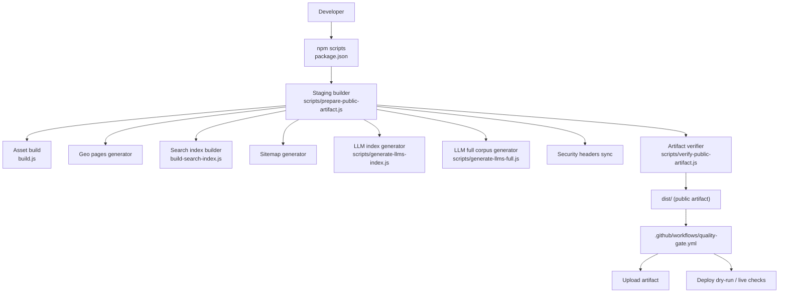
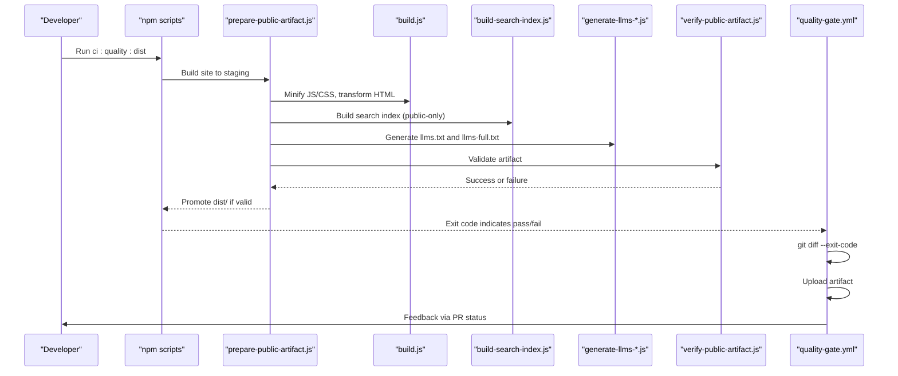
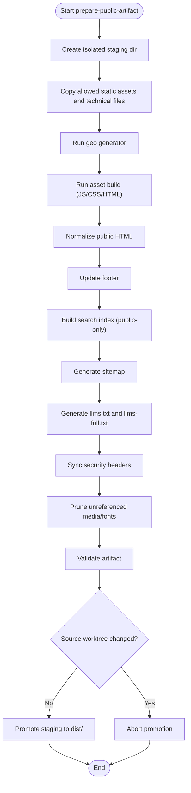
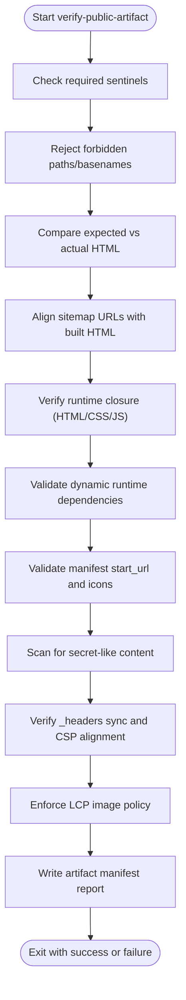
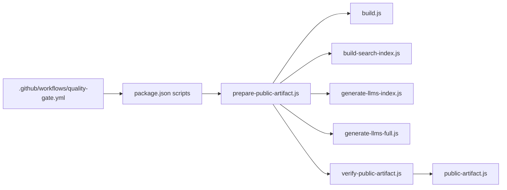

# Build Pipeline Testing

<cite>
**Referenced Files in This Document**
- [package.json](file://package.json)
- [.github/workflows/quality-gate.yml](file://.github/workflows/quality-gate.yml)
- [build.js](file://build.js)
- [scripts/prepare-public-artifact.js](file://scripts/prepare-public-artifact.js)
- [scripts/verify-public-artifact.js](file://scripts/verify-public-artifact.js)
- [scripts/public-artifact.js](file://scripts/public-artifact.js)
- [build-search-index.js](file://build-search-index.js)
- [scripts/generate-llms-index.js](file://scripts/generate-llms-index.js)
- [scripts/generate-llms-full.js](file://scripts/generate-llms-full.js)
- [tests/build-pipeline-regressions.test.js](file://tests/build-pipeline-regressions.test.js)
- [tests/public-artifact-regressions.test.js](file://tests/public-artifact-regressions.test.js)
- [.github/workflows/lighthouse-ci.yml](file://.github/workflows/lighthouse-ci.yml)
</cite>

## Table of Contents
1. [Introduction](#introduction)
2. [Project Structure](#project-structure)
3. [Core Components](#core-components)
4. [Architecture Overview](#architecture-overview)
5. [Detailed Component Analysis](#detailed-component-analysis)
6. [Dependency Analysis](#dependency-analysis)
7. [Performance Considerations](#performance-considerations)
8. [Troubleshooting Guide](#troubleshooting-guide)
9. [Conclusion](#conclusion)

## Introduction
This document explains how the WebNovis build pipeline is tested to ensure that npm scripts, CI/CD workflows, and deployment automation remain correct and safe over time. It focuses on:
- Verifying that package.json scripts are consistent and dist-aware
- Ensuring LLM corpus generation and search index building are isolated correctly
- Validating artifact integrity before deployment
- Enforcing quality gates that prevent broken builds from reaching production
- Detecting common build failures early through regression tests

The goal is to maintain script consistency across development and production environments so that local runs match CI behavior and deployments are predictable.

## Project Structure
At a high level, the build pipeline revolves around a staging-first public artifact process, followed by strict verification and optional deployment checks. The key elements are:
- A canonical dist build command that orchestrates all steps
- A staging-only builder that materializes static assets, generates content, and validates the artifact
- A verifier that enforces security, completeness, and correctness rules
- GitHub Actions workflows that run the same commands as CI to enforce quality gates

**Diagram sources**
- [package.json:6-60](file://package.json#L6-L60)
- [scripts/prepare-public-artifact.js:183-259](file://scripts/prepare-public-artifact.js#L183-L259)
- [build.js:373-495](file://build.js#L373-L495)
- [build-search-index.js:292-324](file://build-search-index.js#L292-L324)
- [scripts/generate-llms-index.js:70-185](file://scripts/generate-llms-index.js#L70-L185)
- [scripts/generate-llms-full.js:151-180](file://scripts/generate-llms-full.js#L151-L180)
- [.github/workflows/quality-gate.yml:14-46](file://.github/workflows/quality-gate.yml#L14-L46)

**Section sources**
- [package.json:6-60](file://package.json#L6-L60)
- [.github/workflows/quality-gate.yml:14-46](file://.github/workflows/quality-gate.yml#L14-L46)

## Core Components
- Dist-aware npm scripts: Provide explicit commands for building artifacts into dist/, including geo generation, footer updates, search indexing, sitemap creation, LLM exports, and validation.
- Staging-first builder: Assembles a clean, isolated staging directory, runs all generators, prunes unreferenced assets, validates the artifact, and promotes it only if no source files were mutated.
- Artifact verifier: Enforces sentinel presence, forbidden paths, runtime closure, manifest integrity, secret scanning, header synchronization, and LCP image policy.
- Regression tests: Assert that critical scripts exist with expected values, that CI uses the canonical dist-first command, and that sensitive data cannot leak into the public artifact.
- Quality gate workflow: Runs the canonical CI command, ensures no tracked files changed during build, uploads the sanitized artifact, and optionally verifies production headers.

**Section sources**
- [package.json:6-60](file://package.json#L6-L60)
- [scripts/prepare-public-artifact.js:183-259](file://scripts/prepare-public-artifact.js#L183-L259)
- [scripts/verify-public-artifact.js:235-393](file://scripts/verify-public-artifact.js#L235-L393)
- [tests/build-pipeline-regressions.test.js:15-129](file://tests/build-pipeline-regressions.test.js#L15-L129)
- [tests/public-artifact-regressions.test.js:12-198](file://tests/public-artifact-regressions.test.js#L12-L198)
- [.github/workflows/quality-gate.yml:14-46](file://.github/workflows/quality-gate.yml#L14-L46)

## Architecture Overview
The pipeline enforces a single, canonical path to produce the public artifact:
- Developers use npm scripts to build, validate, and deploy
- CI runs the same scripts to ensure parity
- The builder isolates outputs in a temporary staging directory and only promotes them after passing all checks
- The verifier performs deep checks on HTML, JS, CSS, media, fonts, manifests, headers, and secrets

**Diagram sources**
- [package.json:46-53](file://package.json#L46-L53)
- [scripts/prepare-public-artifact.js:205-248](file://scripts/prepare-public-artifact.js#L205-L248)
- [build.js:373-495](file://build.js#L373-L495)
- [build-search-index.js:292-324](file://build-search-index.js#L292-L324)
- [scripts/generate-llms-index.js:70-185](file://scripts/generate-llms-index.js#L70-L185)
- [scripts/generate-llms-full.js:151-180](file://scripts/generate-llms-full.js#L151-L180)
- [scripts/verify-public-artifact.js:235-393](file://scripts/verify-public-artifact.js#L235-L393)
- [.github/workflows/quality-gate.yml:27-46](file://.github/workflows/quality-gate.yml#L27-L46)

## Detailed Component Analysis

### Dist-Aware Build Scripts
The npm scripts define a clear contract for building and validating the public artifact:
- build:site:dist orchestrates the entire staging-first build
- verify:artifact runs the verifier against dist/
- ci:quality:dist is the canonical CI command used by the quality gate workflow
- Additional scripts handle geo generation, footer updates, search indexing, sitemap creation, LLM exports, and page validation

These scripts ensure that development and CI execute the same sequence, preventing environment drift.

**Section sources**
- [package.json:6-60](file://package.json#L6-L60)
- [tests/build-pipeline-regressions.test.js:15-129](file://tests/build-pipeline-regressions.test.js#L15-L129)

### Staging-First Public Artifact Builder
The builder:
- Creates an isolated staging directory per run
- Copies only allowed static assets and root technical files
- Runs geo generation, asset build, HTML normalization, footer update, search index build, sitemap generation, LLM exports, and header sync
- Prunes unreferenced media/fonts to keep the artifact lean
- Validates the artifact using the verifier
- Checks that the source worktree was not mutated during build
- Promotes the staging directory to dist/ only if everything passes

This design prevents accidental writes to source and ensures reproducible artifacts.

**Diagram sources**
- [scripts/prepare-public-artifact.js:183-259](file://scripts/prepare-public-artifact.js#L183-L259)

**Section sources**
- [scripts/prepare-public-artifact.js:183-259](file://scripts/prepare-public-artifact.js#L183-L259)

### Artifact Verifier
The verifier enforces multiple safety and correctness properties:
- Required sentinels must be present
- Forbidden paths and basenames are rejected
- Expected HTML vs actual HTML must match declared sets
- Sitemap URLs must align with built HTML and search index
- Runtime references in HTML/CSS/JS must resolve to published files
- Dynamic runtime dependencies must be explicitly declared and referenced
- Manifest start_url and icons must resolve to existing files
- Secret-like content must not appear in the artifact
- Security headers must be synchronized and compliant
- LCP image policy must be preserved on the homepage

If any check fails, the build stops and reports detailed errors.

**Diagram sources**
- [scripts/verify-public-artifact.js:235-393](file://scripts/verify-public-artifact.js#L235-L393)

**Section sources**
- [scripts/verify-public-artifact.js:235-393](file://scripts/verify-public-artifact.js#L235-L393)
- [tests/public-artifact-regressions.test.js:12-198](file://tests/public-artifact-regressions.test.js#L12-L198)

### Search Index Building
The search index builder produces:
- A public search index for client-side search
- A private AI corpus when not running in public-only mode

It extracts titles, descriptions, headings, and snippets from HTML while respecting noindex directives and governance policies. In public builds, the private AI corpus is excluded to avoid leaking sensitive retrieval data.

**Section sources**
- [build-search-index.js:292-324](file://build-search-index.js#L292-L324)
- [package.json:12-13](file://package.json#L12-L13)

### LLM Corpus Generation
Two scripts generate LLM-facing exports:
- llms.txt: A curated index aligned with indexable URLs and governance
- llms-full.txt: A plain-text export of core pages and Tier 1 landing pages

Both scripts read from published HTML and configuration, ensuring consistency with the site’s current state and governance constraints.

**Section sources**
- [scripts/generate-llms-index.js:70-185](file://scripts/generate-llms-index.js#L70-L185)
- [scripts/generate-llms-full.js:151-180](file://scripts/generate-llms-full.js#L151-L180)
- [package.json:15-19](file://package.json#L15-L19)

### Quality Gate Workflow
The quality gate workflow:
- Sets up Node.js and installs dependencies
- Runs the canonical dist-first CI command
- Fails if the build mutates tracked source files
- Uploads the sanitized public artifact
- Optionally verifies production headers on non-PR events

This ensures that every push or pull request is validated against the same standards used locally.

**Section sources**
- [.github/workflows/quality-gate.yml:14-46](file://.github/workflows/quality-gate.yml#L14-L46)
- [tests/build-pipeline-regressions.test.js:114-128](file://tests/build-pipeline-regressions.test.js#L114-L128)

### Regression Tests for Build Pipeline
Regression tests assert:
- Critical npm scripts exist and have expected values
- The CI workflow uses the canonical dist-first command
- Sensitive patterns are excluded from the public artifact
- Root-level safety nets like .assetsignore remain intact
- Asset loaders reference correct minified files and do not retain unsafe paths

These tests catch configuration drift early and prevent regressions from being merged.

**Section sources**
- [tests/build-pipeline-regressions.test.js:15-129](file://tests/build-pipeline-regressions.test.js#L15-L129)
- [tests/public-artifact-regressions.test.js:12-198](file://tests/public-artifact-regressions.test.js#L12-L198)

## Dependency Analysis
The build pipeline has clear dependency boundaries:
- package.json scripts orchestrate the flow
- prepare-public-artifact.js coordinates sub-steps
- build.js handles asset minification and HTML transformation
- build-search-index.js depends on published HTML and governance config
- generate-llms-*.js depend on published HTML and governance config
- verify-public-artifact.js depends on public-artifact.js policies and security headers config
- quality-gate.yml depends on npm scripts and git state

**Diagram sources**
- [package.json:6-60](file://package.json#L6-L60)
- [scripts/prepare-public-artifact.js:205-248](file://scripts/prepare-public-artifact.js#L205-L248)
- [build.js:373-495](file://build.js#L373-L495)
- [build-search-index.js:292-324](file://build-search-index.js#L292-L324)
- [scripts/generate-llms-index.js:70-185](file://scripts/generate-llms-index.js#L70-L185)
- [scripts/generate-llms-full.js:151-180](file://scripts/generate-llms-full.js#L151-L180)
- [scripts/verify-public-artifact.js:235-393](file://scripts/verify-public-artifact.js#L235-L393)
- [scripts/public-artifact.js:1-134](file://scripts/public-artifact.js#L1-L134)
- [.github/workflows/quality-gate.yml:27-46](file://.github/workflows/quality-gate.yml#L27-L46)

**Section sources**
- [package.json:6-60](file://package.json#L6-L60)
- [scripts/public-artifact.js:1-134](file://scripts/public-artifact.js#L1-L134)

## Performance Considerations
- Staging isolation prevents partial or corrupted promotions
- Pruning unreferenced media/fonts reduces artifact size and improves load times
- Asset minification and HTML transformation reduce payload sizes
- Public-only search index excludes large private corpora in CI, speeding builds
- Deterministic output via SOURCE_DATE_EPOCH improves reproducibility

[No sources needed since this section provides general guidance]

## Troubleshooting Guide
Common build pipeline failures and detection mechanisms:

- Missing or incorrect npm scripts
  - Detected by build-pipeline-regressions.test.js asserting exact script values and inclusion of required test suites
  - Fix: Update package.json scripts to match expected commands

- CI not using canonical dist-first command
  - Detected by quality-gate.yml assertion that the workflow runs ci:quality:dist
  - Fix: Ensure workflow step runs the canonical command

- Source worktree mutation during build
  - Detected by git diff --exit-code in quality-gate.yml and staging builder checks
  - Fix: Ensure builders write only to staging/dist and do not modify source files

- Public artifact missing sentinels or containing forbidden paths
  - Detected by verify-public-artifact.js and public-artifact-regressions.test.js
  - Fix: Add missing files or remove forbidden content; adjust allowlists carefully

- Runtime references unresolved in artifact
  - Detected by runtime closure checks in verify-public-artifact.js
  - Fix: Ensure referenced assets are included and paths are correct

- Private AI corpus leaked into public artifact
  - Detected by forbidden basenames and public-only search index behavior
  - Fix: Use public-only flag for search index and ensure forbidden basenames include private files

- Security headers out of sync or non-compliant
  - Detected by header sync and CSP alignment checks
  - Fix: Re-run header sync and ensure CSP includes frame-ancestors 'none'

- LCP image policy violated
  - Detected by homepage LCP checks in verifier
  - Fix: Preserve high-priority hero image and avoid competing fetchpriority on logo

**Section sources**
- [tests/build-pipeline-regressions.test.js:15-129](file://tests/build-pipeline-regressions.test.js#L15-L129)
- [tests/public-artifact-regressions.test.js:12-198](file://tests/public-artifact-regressions.test.js#L12-L198)
- [scripts/verify-public-artifact.js:235-393](file://scripts/verify-public-artifact.js#L235-L393)
- [.github/workflows/quality-gate.yml:27-46](file://.github/workflows/quality-gate.yml#L27-L46)

## Conclusion
WebNovis’ build pipeline testing centers on a staging-first artifact process, strict verification, and CI-enforced quality gates. By asserting npm script contracts, validating artifact integrity, and enforcing security and performance policies, the project prevents broken builds and deployments. Maintaining script consistency across development and production environments is essential to keep local and CI behavior identical, ensuring reliable releases and rapid feedback on changes.

[No sources needed since this section summarizes without analyzing specific files]