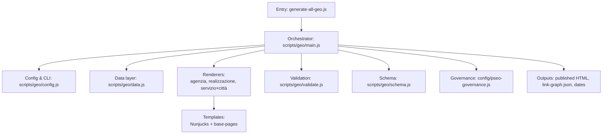
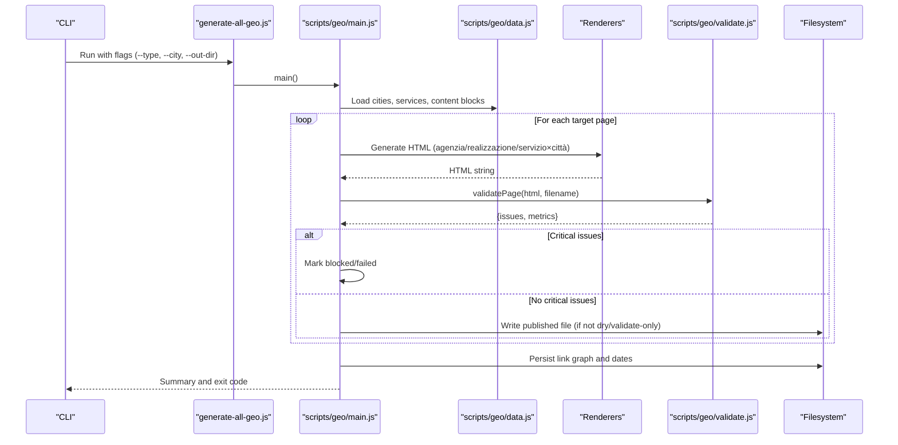
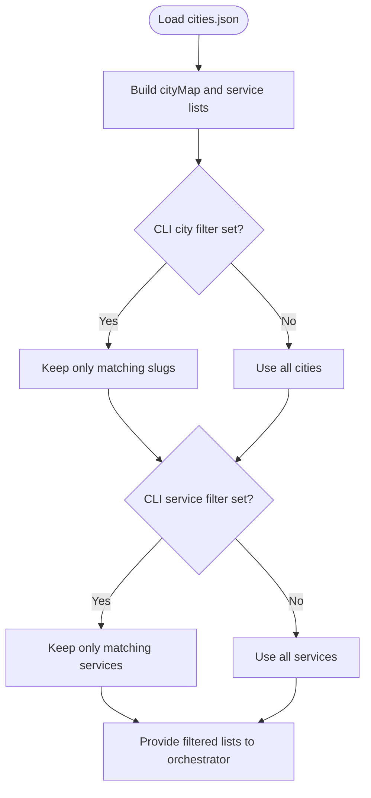
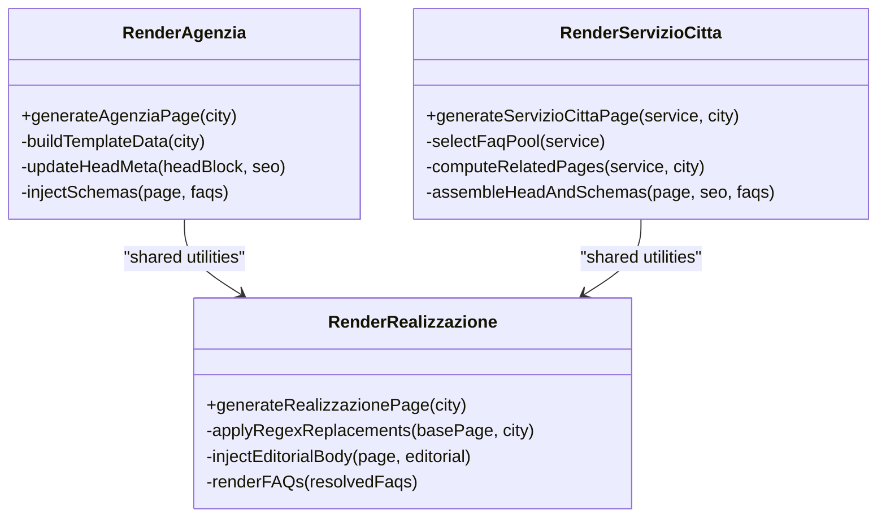
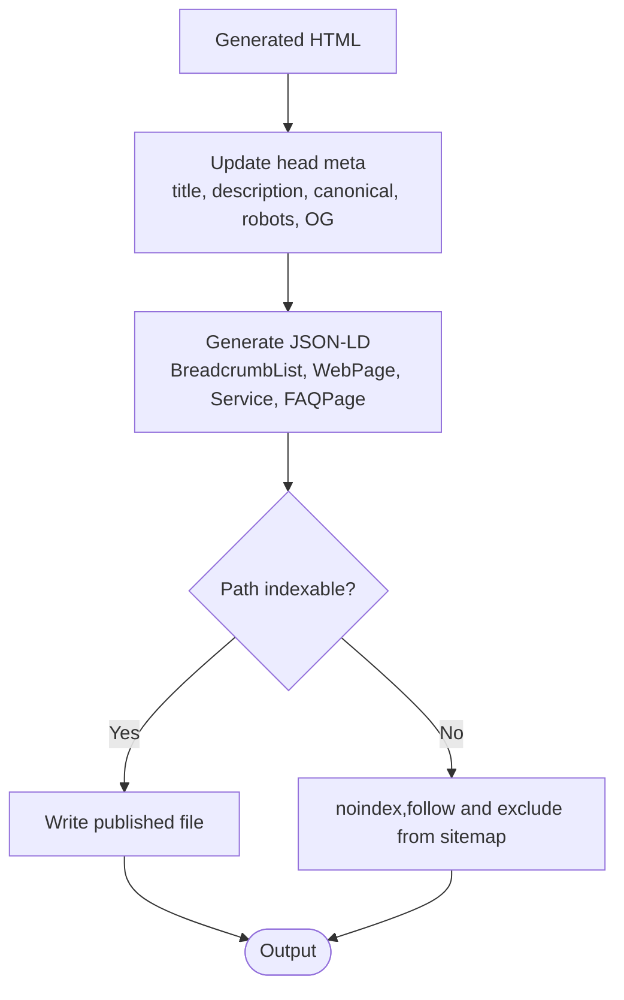
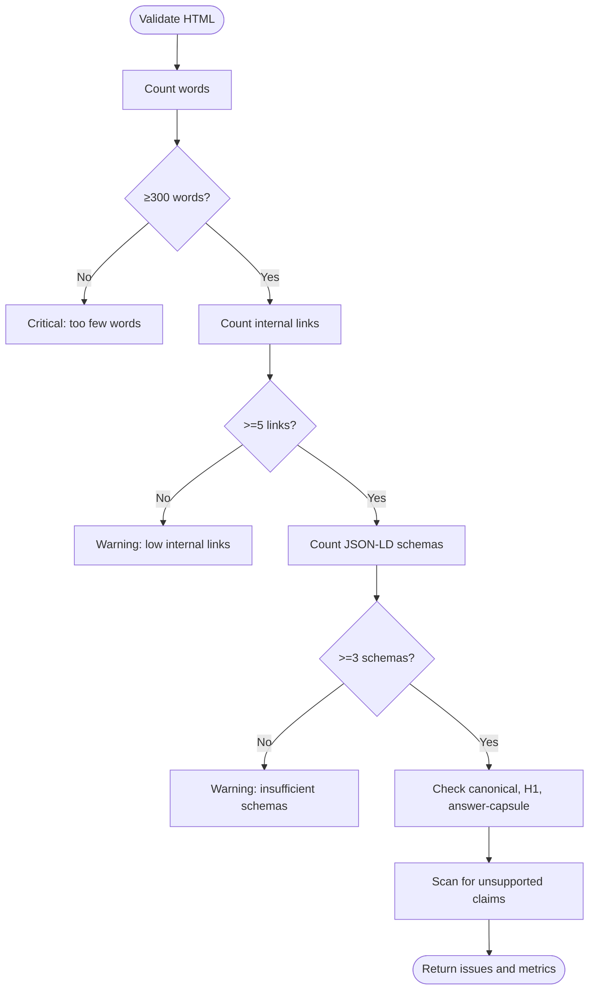
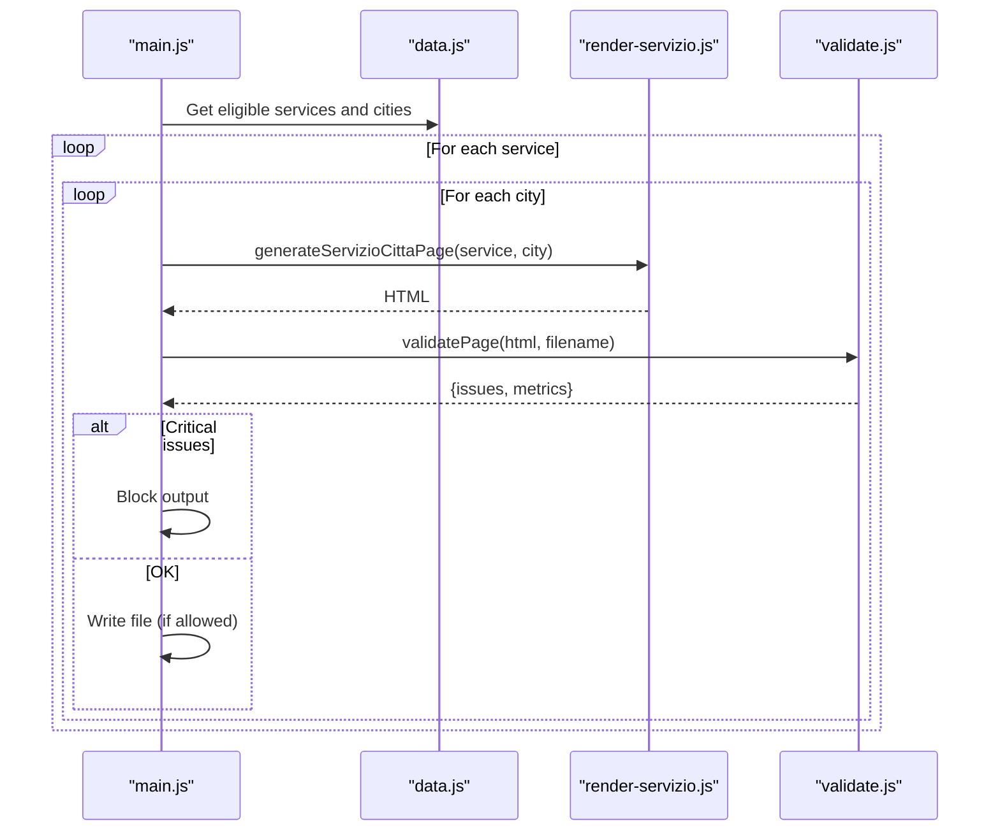
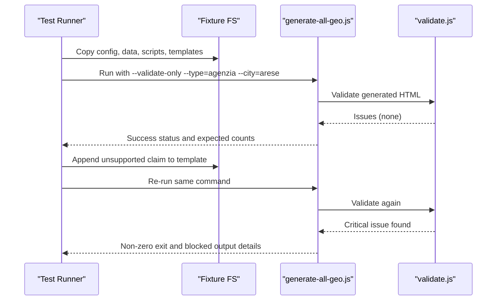
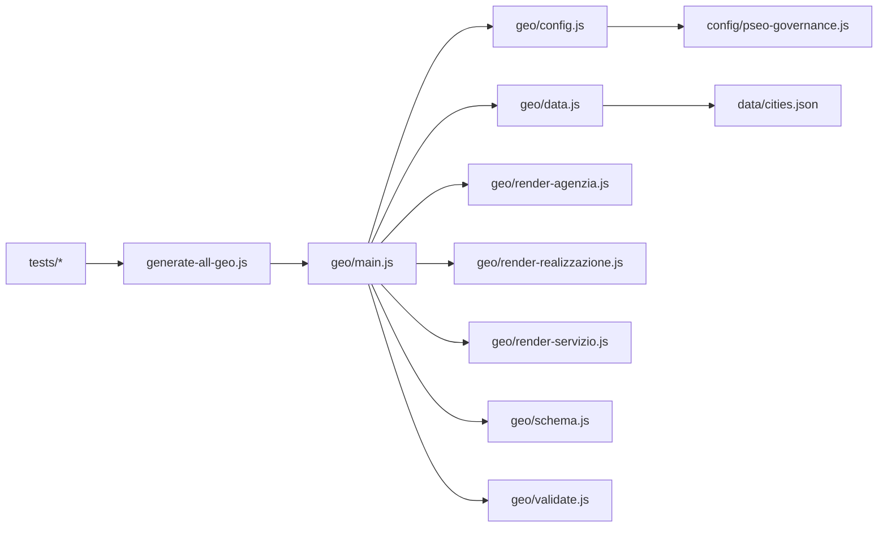

# Geo-Page Generation Testing

<cite>
**Referenced Files in This Document**
- [generate-all-geo.js](file://scripts/generate-all-geo.js)
- [main.js](file://scripts/geo/main.js)
- [config.js](file://scripts/geo/config.js)
- [data.js](file://scripts/geo/data.js)
- [render-agenzia.js](file://scripts/geo/render-agenzia.js)
- [render-servizio.js](file://scripts/geo/render-servizio.js)
- [render-realizzazione.js](file://scripts/geo/render-realizzazione.js)
- [schema.js](file://scripts/geo/schema.js)
- [validate.js](file://scripts/geo/validate.js)
- [pseo-governance.js](file://config/pseo-governance.js)
- [cities.json](file://data/cities.json)
- [geo-generator-regressions.test.js](file://tests/geo-generator-regressions.test.js)
- [geo-generator-fail-closed.test.js](file://tests/geo-generator-fail-closed.test.js)
</cite>

## Table of Contents
1. [Introduction](#introduction)
2. [Project Structure](#project-structure)
3. [Core Components](#core-components)
4. [Architecture Overview](#architecture-overview)
5. [Detailed Component Analysis](#detailed-component-analysis)
6. [Dependency Analysis](#dependency-analysis)
7. [Performance Considerations](#performance-considerations)
8. [Troubleshooting Guide](#troubleshooting-guide)
9. [Conclusion](#conclusion)

## Introduction
This document explains how the WebNovis project tests automated generation of location-specific pages and how integration tests verify data consistency, template rendering, and SEO optimization across geo-targeted content. It covers city data processing, template variable substitution, output file creation, multi-city page generation, content validation, and performance considerations. It also provides guidance on writing effective geo-generation tests and debugging failed page generations.

## Project Structure
The geo-generation pipeline is orchestrated by a single entrypoint that delegates to modular components under scripts/geo. The main flow reads centralized city and service data, renders HTML via Nunjucks or regex-based base templates, validates outputs, writes published files, and persists metadata such as dates and link graphs. Tests validate both source-level invariants and end-to-end behavior using isolated fixtures.

**Diagram sources**
- [generate-all-geo.js:1-58](file://scripts/generate-all-geo.js#L1-L58)
- [main.js:38-289](file://scripts/geo/main.js#L38-L289)
- [config.js:1-114](file://scripts/geo/config.js#L1-L114)
- [data.js:1-197](file://scripts/geo/data.js#L1-L197)
- [schema.js:1-199](file://scripts/geo/schema.js#L1-L199)
- [pseo-governance.js:1-200](file://config/pseo-governance.js#L1-L200)

**Section sources**
- [generate-all-geo.js:1-58](file://scripts/generate-all-geo.js#L1-L58)
- [main.js:38-289](file://scripts/geo/main.js#L38-L289)

## Core Components
- Orchestrator: coordinates generation per type (agenzia, realizzazione, servizio×città, hubs), applies filters for cities/services, runs validation, and writes outputs.
- Data layer: loads cities, services, approved content blocks, blog index, and Nunjucks environment; exposes helpers for pricing, avatar paths, and nearest cities.
- Renderers: produce final HTML per page type with SEO copy, FAQs, schema markup, and editorial overrides.
- Validation: fail-closed checks for word count, internal links, JSON-LD schemas, canonical tags, H1 presence, answer capsule class, and unsupported claims.
- Schema generator: builds BreadcrumbList, WebPage, Service, OfferCatalog, FAQPage, and areaServed entities tied to city data.
- Governance: tiered allowlist controls which generated paths are indexable and robots directives.

**Section sources**
- [main.js:38-289](file://scripts/geo/main.js#L38-L289)
- [data.js:1-197](file://scripts/geo/data.js#L1-L197)
- [validate.js:1-55](file://scripts/geo/validate.js#L1-L55)
- [schema.js:1-199](file://scripts/geo/schema.js#L1-L199)
- [config.js:1-114](file://scripts/geo/config.js#L1-L114)
- [pseo-governance.js:1-200](file://config/pseo-governance.js#L1-L200)

## Architecture Overview
The generation pipeline enforces a fail-closed strategy: any critical validation issue blocks output and marks the run as failed. Each page type follows a consistent sequence: load base template, build context from city/service data, render content, update head/meta, inject schemas, validate, and write if allowed.

**Diagram sources**
- [generate-all-geo.js:28-58](file://scripts/generate-all-geo.js#L28-L58)
- [main.js:38-289](file://scripts/geo/main.js#L38-L289)
- [data.js:1-197](file://scripts/geo/data.js#L1-L197)
- [validate.js:1-55](file://scripts/geo/validate.js#L1-L55)

## Detailed Component Analysis

### City Data Processing and Filtering
- Centralized city definitions include slugs, names, CAP, coordinates, province, distance to headquarters, nearby cities, local context highlights, and per-page-type FAQ sets.
- The data module constructs lookup maps, computes display names, and prepares avatar paths. It also determines whether a service participates in geo generation based on explicit flags.
- Filters applied during generation respect CLI targets and governance tiers to limit scope and ensure only indexable paths are treated as primary targets.

**Diagram sources**
- [data.js:15-197](file://scripts/geo/data.js#L15-L197)
- [config.js:32-74](file://scripts/geo/config.js#L32-L74)

**Section sources**
- [data.js:15-197](file://scripts/geo/data.js#L15-L197)
- [config.js:32-74](file://scripts/geo/config.js#L32-L74)
- [cities.json:1-200](file://data/cities.json#L1-L200)

### Template Rendering and Variable Substitution
- Agenzia pages use a Nunjucks template with dynamic variables derived from city data, approved content blocks, and editorial overrides. Head meta, canonical, robots directives, and social tags are updated before assembly.
- Realizzazione pages use a regex-based base template with targeted replacements for city-specific text, images, addresses, and schema values. Editorial body injection and FAQ sections are rendered consistently.
- Servizio×città pages combine service and city contexts, select FAQ pools by service cluster, and enrich content with AI-derived insights when available. They also compute related city and service pages for internal linking.

**Diagram sources**
- [render-agenzia.js:34-189](file://scripts/geo/render-agenzia.js#L34-L189)
- [render-realizzazione.js:33-200](file://scripts/geo/render-realizzazione.js#L33-L200)
- [render-servizio.js:36-284](file://scripts/geo/render-servizio.js#L36-L284)

**Section sources**
- [render-agenzia.js:34-189](file://scripts/geo/render-agenzia.js#L34-L189)
- [render-realizzazione.js:33-200](file://scripts/geo/render-realizzazione.js#L33-L200)
- [render-servizio.js:36-284](file://scripts/geo/render-servizio.js#L36-L284)

### SEO Optimization and Schema Markup
- Canonical URLs, robots directives, and Open Graph tags are injected into the head block for each generated page.
- JSON-LD schemas include BreadcrumbList, WebPage, Service, OfferCatalog, FAQPage, and areaServed entities aligned with city data and governance tiers.
- Governance rules determine indexability and de-amplification for generated paths, ensuring only strategic pages are promoted while others remain follow but noindex.

**Diagram sources**
- [render-agenzia.js:146-189](file://scripts/geo/render-agenzia.js#L146-L189)
- [render-realizzazione.js:50-99](file://scripts/geo/render-realizzazione.js#L50-L99)
- [render-servizio.js:194-284](file://scripts/geo/render-servizio.js#L194-L284)
- [schema.js:73-192](file://scripts/geo/schema.js#L73-L192)
- [pseo-governance.js:1-200](file://config/pseo-governance.js#L1-L200)

**Section sources**
- [schema.js:73-192](file://scripts/geo/schema.js#L73-L192)
- [pseo-governance.js:1-200](file://config/pseo-governance.js#L1-L200)

### Fail-Closed Validation Strategy
- Word count thresholds enforce minimum content depth; warnings and critical failures are reported.
- Internal link density ensures sufficient cross-linking between geo pages.
- Presence of JSON-LD schemas and required HTML elements (canonical, H1, answer capsule) is verified.
- Unsupported claims are detected and flagged as critical blockers.

**Diagram sources**
- [validate.js:7-50](file://scripts/geo/validate.js#L7-L50)

**Section sources**
- [validate.js:7-50](file://scripts/geo/validate.js#L7-L50)

### Multi-City Page Generation and Content Validation
- The orchestrator generates agenzia and realizzazione pages per city where enabled, and a combinatorial matrix of servizio×città pages for eligible services and cities.
- Per-service FAQ pools and AI-enriched content reduce intra-municipal duplication and improve relevance.
- Related city and service pages are computed to strengthen internal linking and user navigation.

**Diagram sources**
- [main.js:152-195](file://scripts/geo/main.js#L152-L195)
- [render-servizio.js:36-284](file://scripts/geo/render-servizio.js#L36-L284)
- [validate.js:7-50](file://scripts/geo/validate.js#L7-L50)

**Section sources**
- [main.js:152-195](file://scripts/geo/main.js#L152-L195)
- [render-servizio.js:36-284](file://scripts/geo/render-servizio.js#L36-L284)

### Test Scenarios and Strategies
- Source-level regression tests assert that generators do not read legacy base filenames, that date handling uses controlled build timestamps, that placeholders are replaced correctly, and that templates expose markers for preserved custom blocks.
- Integration tests spawn an isolated fixture, run the generator in validate-only mode, confirm baseline success, then inject a critical validation finding into a template and assert failure with precise error reporting and summary counts.
- These tests cover missing city data risks (by validating against real corpus), template errors (by injecting invalid content), and schema markup problems (by asserting schema presence and correctness).

**Diagram sources**
- [geo-generator-fail-closed.test.js:22-85](file://tests/geo-generator-fail-closed.test.js#L22-L85)
- [validate.js:7-50](file://scripts/geo/validate.js#L7-L50)

**Section sources**
- [geo-generator-regressions.test.js:24-157](file://tests/geo-generator-regressions.test.js#L24-L157)
- [geo-generator-fail-closed.test.js:22-85](file://tests/geo-generator-fail-closed.test.js#L22-L85)

## Dependency Analysis
The geo generator depends on centralized configuration, governance rules, and data modules. Renderers rely on shared utilities for HTML manipulation, FAQ resolution, and schema generation. Tests depend on the public entrypoint and modules to assert invariants and simulate failures.

**Diagram sources**
- [generate-all-geo.js:28-58](file://scripts/generate-all-geo.js#L28-L58)
- [main.js:38-289](file://scripts/geo/main.js#L38-L289)
- [config.js:1-114](file://scripts/geo/config.js#L1-L114)
- [data.js:1-197](file://scripts/geo/data.js#L1-L197)
- [pseo-governance.js:1-200](file://config/pseo-governance.js#L1-L200)
- [cities.json:1-200](file://data/cities.json#L1-L200)

**Section sources**
- [generate-all-geo.js:28-58](file://scripts/generate-all-geo.js#L28-L58)
- [main.js:38-289](file://scripts/geo/main.js#L38-L289)

## Performance Considerations
- Use CLI filters to limit generation to specific cities or services for faster iteration during development.
- Prefer validate-only mode to avoid disk I/O when testing logic changes.
- Ensure content blocks and blog indexes are present to avoid fallback computations that can slow rendering.
- Monitor generated HTML size and internal link counts to keep pages performant and well-linked without excessive bloat.

[No sources needed since this section provides general guidance]

## Troubleshooting Guide
Common issues and how to debug them:
- Missing city data: If a city lacks essential fields (slug, name, cap), renderers may fail or produce incomplete pages. Verify entries in cities.json and ensure generate flags are set appropriately.
- Template errors: Injected unsupported claims or malformed content will trigger critical validation failures. Use validate-only mode to identify the exact blocked output and inspect the template markers.
- Schema markup problems: Ensure JSON-LD schemas are present and consistent with city and service data. Check that areaServed entities reference correct cities and administrative areas.
- Indexation issues: Confirm that the generated path is in the allowlist for indexation. De-amplified pages should remain noindex,follow and excluded from sitemaps.

Debugging steps:
- Run with --dry-run and --validate-only to preview outputs and catch issues without writing files.
- Inspect console logs for blocked/failed outputs and validation warnings.
- Review generated link-graph.json to verify internal linking structure.
- Check date persistence to ensure editorial dates are updated only after successful generation.

**Section sources**
- [validate.js:7-50](file://scripts/geo/validate.js#L7-L50)
- [main.js:239-289](file://scripts/geo/main.js#L239-L289)
- [pseo-governance.js:1-200](file://config/pseo-governance.js#L1-L200)

## Conclusion
The WebNovis geo-generation system combines centralized data, modular renderers, strict validation, and governance-driven indexation to produce reliable, SEO-optimized location pages. Integration tests enforce fail-closed behavior, ensuring that critical issues block generation and provide actionable feedback. By following the strategies outlined here—filtering targets, validating outputs, verifying schema markup, and leveraging test fixtures—you can confidently maintain and extend geo-page generation while catching common issues early.

[No sources needed since this section summarizes without analyzing specific files]