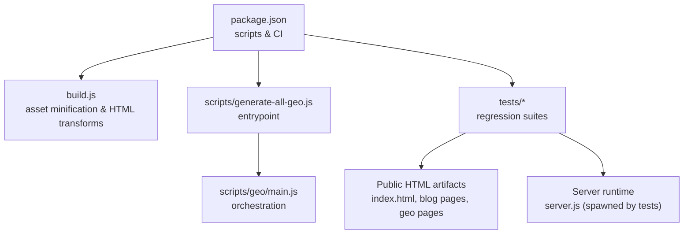
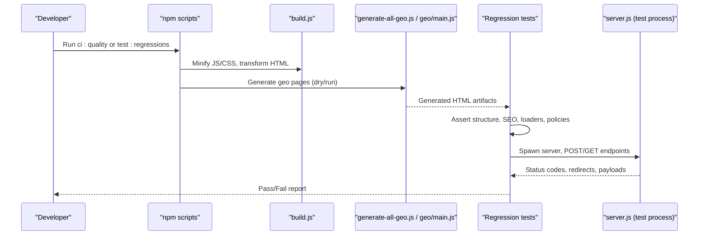
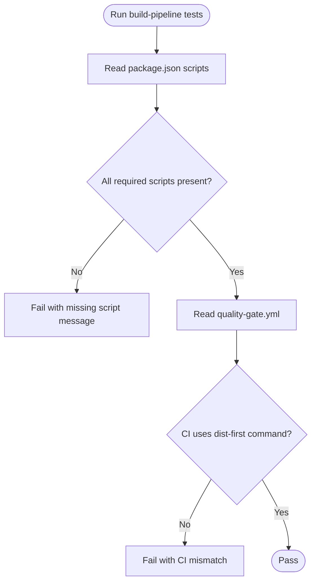
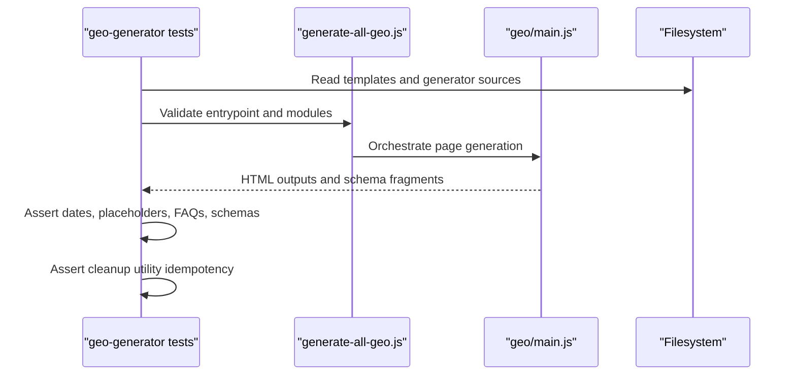
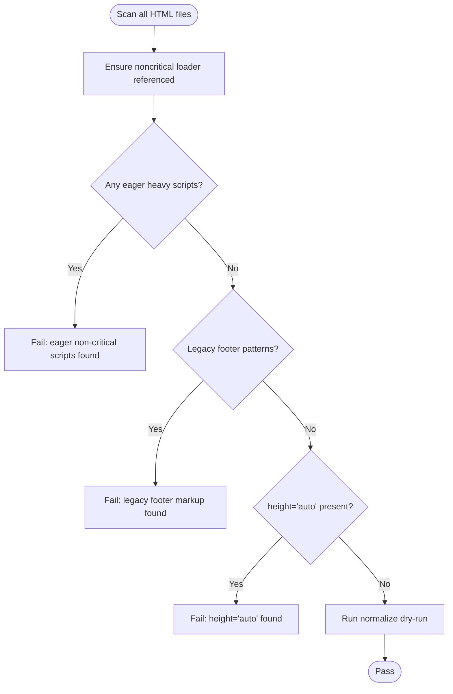
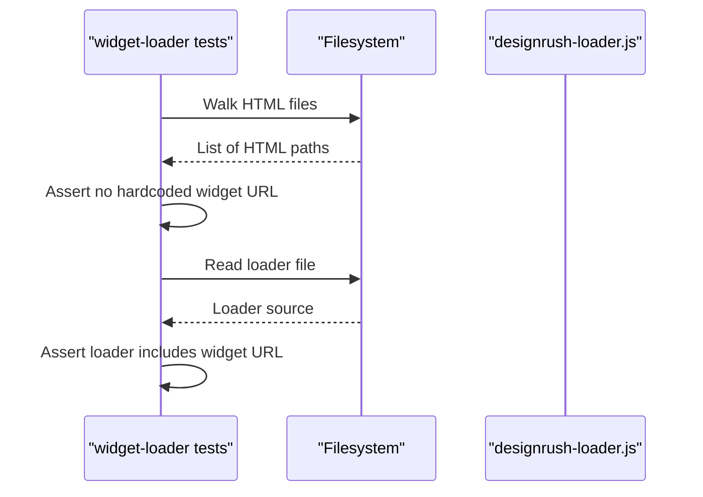
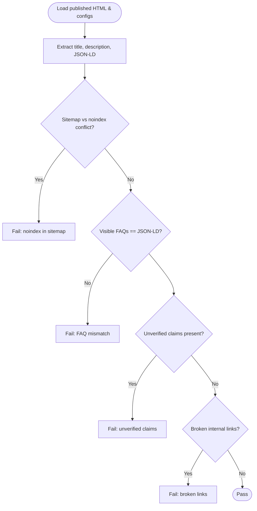
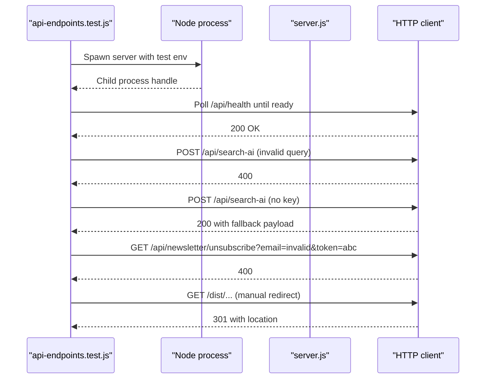
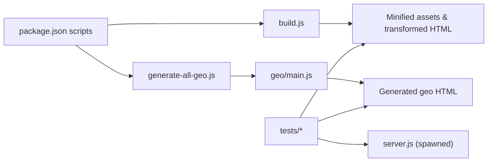

# Integration & Regression Testing

<cite>
**Referenced Files in This Document**
- [package.json](file://package.json)
- [build.js](file://build.js)
- [scripts/generate-all-geo.js](file://scripts/generate-all-geo.js)
- [scripts/geo/main.js](file://scripts/geo/main.js)
- [tests/build-pipeline-regressions.test.js](file://tests/build-pipeline-regressions.test.js)
- [tests/geo-generator-regressions.test.js](file://tests/geo-generator-regressions.test.js)
- [tests/public-html-regressions.test.js](file://tests/public-html-regressions.test.js)
- [tests/widget-loader-regressions.test.js](file://tests/widget-loader-regressions.test.js)
- [tests/seo-regressions.test.js](file://tests/seo-regressions.test.js)
- [tests/api-endpoints.test.js](file://tests/api-endpoints.test.js)
- [tests/health.test.js](file://tests/health.test.js)
</cite>

## Table of Contents
1. Introduction
2. Project Structure
3. Core Components
4. Architecture Overview
5. Detailed Component Analysis
6. Dependency Analysis
7. Performance Considerations
8. Troubleshooting Guide
9. Conclusion

## Introduction
This document explains the integration and regression testing strategy for the WebNovis project. It covers how tests validate build pipeline integrity, geo-page generation, public HTML output quality, widget loading behavior, SEO correctness, and API endpoints. It also provides guidance on environment setup, fixture management, automated regression detection, and strategies to keep tests reliable across multi-module interactions, data flows, and external integrations.

## Project Structure
The test suite is organized into focused regression suites under tests/, each asserting a specific area of the system:
- Build pipeline integrity: package scripts, CI commands, artifact verification
- Geo page generation: templates, data-driven rendering, schema and dates
- Public HTML validation: progressive loading, non-critical script policy, normalization idempotency
- Widget loading: centralized lazy loader enforcement
- SEO governance: titles, descriptions, JSON-LD, canonicalization, content claims
- API smoke tests: server lifecycle, redirects, fallbacks
- Health checks: sitemap, robots, manifest, structured data

**Diagram sources**
- [package.json:6-50](file://package.json#L6-L50)
- [build.js:1-50](file://build.js#L1-L50)
- [scripts/generate-all-geo.js:1-58](file://scripts/generate-all-geo.js#L1-L58)
- [scripts/geo/main.js:1-60](file://scripts/geo/main.js#L1-L60)

**Section sources**
- [package.json:6-50](file://package.json#L6-L50)

## Core Components
- Build pipeline assertions verify that required npm scripts exist with correct flags and that CI uses a dist-first workflow. These tests ensure the build contract remains stable over time.
- Geo generator tests assert template presence, date handling, FAQ resolution, schema generation, and safe replacement of city-specific placeholders. They also validate cleanup utilities for unsupported rating/review markup.
- Public HTML tests enforce progressive loading policies, prevent eager loading of heavy scripts, require the noncritical loader, and run normalization dry-runs to confirm idempotency.
- Widget loader tests ensure third-party widgets are not hardcoded in HTML but loaded via a central lazy loader.
- SEO regression tests validate titles, meta descriptions, JSON-LD consistency between visible FAQs and schemas, canonicalization, noindex rules, editorial exports, and content claims.
- API endpoint tests spawn the server, wait for readiness, and assert redirect behavior, error codes, and graceful fallbacks when external keys are missing.
- Health tests check static assets like sitemap.xml, robots.txt, manifest.json, and key structured data.

**Section sources**
- [tests/build-pipeline-regressions.test.js:15-129](file://tests/build-pipeline-regressions.test.js#L15-L129)
- [tests/geo-generator-regressions.test.js:24-157](file://tests/geo-generator-regressions.test.js#L24-L157)
- [tests/public-html-regressions.test.js:22-112](file://tests/public-html-regressions.test.js#L22-L112)
- [tests/widget-loader-regressions.test.js:22-48](file://tests/widget-loader-regressions.test.js#L22-L48)
- [tests/seo-regressions.test.js:82-484](file://tests/seo-regressions.test.js#L82-L484)
- [tests/api-endpoints.test.js:17-129](file://tests/api-endpoints.test.js#L17-L129)
- [tests/health.test.js:15-109](file://tests/health.test.js#L15-L109)

## Architecture Overview
The testing architecture spans three layers:
- Static artifact validation: file-system scans and regex/assertions against generated HTML, JSON, XML, and configuration files.
- Process-level integration: spawning the Node server, waiting for health, issuing HTTP requests, and validating responses and redirects.
- Pipeline orchestration: verifying that npm scripts and GitHub Actions workflows implement a consistent, dist-first build and verification flow.

**Diagram sources**
- [package.json:42-47](file://package.json#L42-L47)
- [build.js:373-496](file://build.js#L373-L496)
- [scripts/generate-all-geo.js:28-58](file://scripts/generate-all-geo.js#L28-L58)
- [scripts/geo/main.js:38-64](file://scripts/geo/main.js#L38-L64)
- [tests/api-endpoints.test.js:17-129](file://tests/api-endpoints.test.js#L17-L129)

## Detailed Component Analysis

### Build Pipeline Integrity Tests
These tests assert that critical npm scripts exist with exact expected values and that the CI workflow enforces a dist-first build and artifact verification. They also ensure that essential regression suites are included in the aggregate test command.

Key validations include:
- Dist-aware footer update script
- Single staging-first public build transaction
- LLM index and full corpus generation scripts
- Public search build excluding private AI retrieval corpus
- Explicit public artifact verifier
- Inclusion of LCP hero safety checks, image loading policy, build pipeline, public artifact, header verifier, and footer widget loader checks
- CI workflow using canonical dist-first command and failing on tracked source mutations

**Diagram sources**
- [tests/build-pipeline-regressions.test.js:15-129](file://tests/build-pipeline-regressions.test.js#L15-L129)
- [package.json:6-50](file://package.json#L6-L50)

**Section sources**
- [tests/build-pipeline-regressions.test.js:15-129](file://tests/build-pipeline-regressions.test.js#L15-L129)
- [package.json:6-50](file://package.json#L6-L50)

### Geo Page Generation Tests
These tests ensure the geo generator uses dedicated base templates, derives dates from a controlled build instant, replaces city placeholders safely, preserves custom blocks, and generates consistent FAQ and schema data. They also validate cleanup of unsupported rating/review markup and its idempotency.

Important behaviors verified:
- Presence of dedicated base templates for agency and realizzazione pages
- Generator must not read legacy Rho-specific files as templates
- Date derivation via controlled Europe/Rome calendar date
- Safe placeholder replacement for city names
- Preservation of marked custom content blocks during regeneration
- Consistent FAQ resolution and JSON-LD generation
- Removal of unsupported AggregateRating and Review properties without re-injection

**Diagram sources**
- [tests/geo-generator-regressions.test.js:24-157](file://tests/geo-generator-regressions.test.js#L24-L157)
- [scripts/generate-all-geo.js:28-58](file://scripts/generate-all-geo.js#L28-L58)
- [scripts/geo/main.js:38-64](file://scripts/geo/main.js#L38-L64)

**Section sources**
- [tests/geo-generator-regressions.test.js:24-157](file://tests/geo-generator-regressions.test.js#L24-L157)
- [scripts/generate-all-geo.js:28-58](file://scripts/generate-all-geo.js#L28-L58)
- [scripts/geo/main.js:38-64](file://scripts/geo/main.js#L38-L64)

### Public HTML Output Validation
These tests enforce progressive loading policies and prevent performance regressions:
- Noncritical loader existence and behavior requirements
- Main JS analytics attributes preserved in both source and minified builds
- Normalization pipeline idempotency on selected pages
- Prohibition of height="auto", legacy blog footers, eager loading of heavy scripts, and missing loader references

**Diagram sources**
- [tests/public-html-regressions.test.js:22-112](file://tests/public-html-regressions.test.js#L22-L112)

**Section sources**
- [tests/public-html-regressions.test.js:22-112](file://tests/public-html-regressions.test.js#L22-L112)

### Widget Loading Functionality
These tests ensure third-party widgets are centrally managed:
- No hardcoding of external widget URLs in HTML
- Centralized lazy loader exists and contains the widget URL

**Diagram sources**
- [tests/widget-loader-regressions.test.js:22-48](file://tests/widget-loader-regressions.test.js#L22-L48)

**Section sources**
- [tests/widget-loader-regressions.test.js:22-48](file://tests/widget-loader-regressions.test.js#L22-L48)

### SEO Governance and Content Processing
These tests cover end-to-end SEO correctness:
- Sitemap excludes noindex URLs
- Canonicalization and noindex rules enforced
- Editorial export metadata and disclaimers
- Forbidden entity URLs removed
- Organization schema and absence of unverified business hours
- Service catalog alignment in AI exports
- Broken internal links remediation
- Priority snippet retention after geo generation
- Visible FAQ items must match FAQPage JSON-LD exactly
- Title length guardrails and social meta alignment
- Removal of unverified numeric claims and stale estimates

**Diagram sources**
- [tests/seo-regressions.test.js:82-484](file://tests/seo-regressions.test.js#L82-L484)

**Section sources**
- [tests/seo-regressions.test.js:82-484](file://tests/seo-regressions.test.js#L82-L484)

### API Endpoint Integration Tests
These tests start the server in a test process, wait for readiness, and validate:
- Invalid query returns 400
- Graceful fallback when external API keys are missing
- Unauthenticated unsubscribe returns 403
- Invalid email returns 400
- Redirects from legacy/dist paths to canonical URLs
- Blog path redirections

**Diagram sources**
- [tests/api-endpoints.test.js:17-129](file://tests/api-endpoints.test.js#L17-L129)

**Section sources**
- [tests/api-endpoints.test.js:17-129](file://tests/api-endpoints.test.js#L17-L129)

### Health and Static Asset Checks
These tests validate foundational site assets and structured data:
- sitemap.xml validity and exclusions
- robots.txt referencing sitemap
- manifest.json icon uniqueness
- search-index.json validity
- Required meta tags and accessibility markers on main pages
- Security headers presence
- Organization schema and duplicate CollectionPage prevention

**Section sources**
- [tests/health.test.js:15-109](file://tests/health.test.js#L15-L109)

## Dependency Analysis
The test suite depends on:
- Build artifacts produced by build.js (minified assets, transformed HTML)
- Geo-generated pages produced by scripts/generate-all-geo.js and scripts/geo/main.js
- Published HTML files at repository root and subdirectories
- Server runtime spawned by api-endpoints tests
- Configuration and data files consumed by SEO and geo tests

**Diagram sources**
- [package.json:6-50](file://package.json#L6-L50)
- [build.js:373-496](file://build.js#L373-L496)
- [scripts/generate-all-geo.js:28-58](file://scripts/generate-all-geo.js#L28-L58)
- [scripts/geo/main.js:38-64](file://scripts/geo/main.js#L38-L64)

**Section sources**
- [package.json:6-50](file://package.json#L6-L50)
- [build.js:373-496](file://build.js#L373-L496)
- [scripts/generate-all-geo.js:28-58](file://scripts/generate-all-geo.js#L28-L58)
- [scripts/geo/main.js:38-64](file://scripts/geo/main.js#L38-L64)

## Performance Considerations
- Prefer file-system scans and regex-based checks for fast, deterministic assertions on large HTML sets.
- Use dry-run modes where available (e.g., normalization) to avoid mutating outputs during validation.
- Keep API tests minimal and scoped to critical paths; use timeouts and retries only when necessary.
- Avoid network calls in most regression tests; rely on local artifacts and mocked or disabled external dependencies.

[No sources needed since this section provides general guidance]

## Troubleshooting Guide
Common issues and resolutions:
- Missing npm scripts or changed flags: Update package.json scripts or adjust build-pipeline tests accordingly.
- Geo generator failures: Ensure templates exist, dates resolve correctly, and FAQ arrays are consistent; review geo-main logs and validation issues.
- Public HTML regressions: Remove eager script tags, add the noncritical loader, and run normalization to stabilize outputs.
- Widget loader violations: Replace hardcoded widget URLs with the central loader reference.
- SEO mismatches: Align titles, descriptions, and JSON-LD; remove unverified claims and fix broken links.
- API test flakiness: Increase readiness timeout, ensure test environment variables are set, and verify server startup logs.

**Section sources**
- [tests/build-pipeline-regressions.test.js:15-129](file://tests/build-pipeline-regressions.test.js#L15-L129)
- [tests/geo-generator-regressions.test.js:24-157](file://tests/geo-generator-regressions.test.js#L24-L157)
- [tests/public-html-regressions.test.js:22-112](file://tests/public-html-regressions.test.js#L22-L112)
- [tests/widget-loader-regressions.test.js:22-48](file://tests/widget-loader-regressions.test.js#L22-L48)
- [tests/seo-regressions.test.js:82-484](file://tests/seo-regressions.test.js#L82-L484)
- [tests/api-endpoints.test.js:17-129](file://tests/api-endpoints.test.js#L17-L129)

## Conclusion
WebNovis employs a comprehensive, layered testing strategy that safeguards build integrity, geo generation, public HTML quality, widget loading, SEO governance, and API behavior. By anchoring tests to concrete artifacts and processes, the suite detects regressions early and maintains reliability across multi-module interactions. Following the guidelines here will help you write effective integration tests and keep the system robust as it evolves.

[No sources needed since this section summarizes without analyzing specific files]