# Public HTML Output Validation

<cite>
**Referenced Files in This Document**
- [tests/html-structure-regressions.test.js](file://tests/html-structure-regressions.test.js)
- [tests/public-html-regressions.test.js](file://tests/public-html-regressions.test.js)
- [tests/security-header-regressions.test.js](file://tests/security-header-regressions.test.js)
- [tests/audit-seo-a11y-regressions.test.js](file://tests/audit-seo-a11y-regressions.test.js)
- [tests/image-loading-policy.test.js](file://tests/image-loading-policy.test.js)
- [scripts/validate-pages.js](file://scripts/validate-pages.js)
- [scripts/verify-public-artifact.js](file://scripts/verify-public-artifact.js)
- [scripts/public-artifact.js](file://scripts/public-artifact.js)
- [scripts/normalize-public-html.js](file://scripts/normalize-public-html.js)
- [config/security-headers.js](file://config/security-headers.js)
- [scripts/verify-prod-headers.js](file://scripts/verify-prod-headers.js)
- [lighthouserc.js](file://lighthouserc.js)
</cite>

## Table of Contents
1. Introduction
2. Project Structure
3. Core Components
4. Architecture Overview
5. Detailed Component Analysis
6. Dependency Analysis
7. Performance Considerations
8. Troubleshooting Guide
9. Conclusion

## Introduction
This document explains how the project validates generated public HTML for structural integrity, accessibility compliance, and SEO optimization. It covers the test suite strategies, normalization pipeline, artifact verification, security header enforcement, and performance checks. The goal is to ensure that all public artifacts meet quality standards before deployment, including correct HTML structure, meta tag presence, resource loading behavior, responsive design considerations, cross-browser compatibility signals, and security headers.

## Project Structure
The validation system spans tests, scripts, and configuration:
- Tests enforce regression checks on HTML structure, public HTML policies, security headers, SEO/a11y rules, and image loading policy.
- Scripts normalize HTML output, validate page quality thresholds, verify the public artifact closure, and check production headers.
- Configuration defines security headers, image loading policy, and Lighthouse CI assertions.

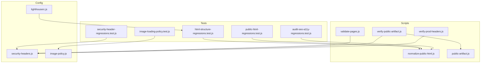

**Diagram sources**
- [tests/html-structure-regressions.test.js](file://tests/html-structure-regressions.test.js)
- [tests/public-html-regressions.test.js](file://tests/public-html-regressions.test.js)
- [tests/security-header-regressions.test.js](file://tests/security-header-regressions.test.js)
- [tests/audit-seo-a11y-regressions.test.js](file://tests/audit-seo-a11y-regressions.test.js)
- [tests/image-loading-policy.test.js](file://tests/image-loading-policy.test.js)
- [scripts/normalize-public-html.js](file://scripts/normalize-public-html.js)
- [scripts/validate-pages.js](file://scripts/validate-pages.js)
- [scripts/verify-public-artifact.js](file://scripts/verify-public-artifact.js)
- [scripts/public-artifact.js](file://scripts/public-artifact.js)
- [config/security-headers.js](file://config/security-headers.js)
- [config/image-policy.js](file://config/image-policy.js)
- [lighthouserc.js](file://lighthouserc.js)

**Section sources**
- [tests/html-structure-regressions.test.js](file://tests/html-structure-regressions.test.js)
- [tests/public-html-regressions.test.js](file://tests/public-html-regressions.test.js)
- [tests/security-header-regressions.test.js](file://tests/security-header-regressions.test.js)
- [tests/audit-seo-a11y-regressions.test.js](file://tests/audit-seo-a11y-regressions.test.js)
- [tests/image-loading-policy.test.js](file://tests/image-loading-policy.test.js)
- [scripts/validate-pages.js](file://scripts/validate-pages.js)
- [scripts/verify-public-artifact.js](file://scripts/verify-public-artifact.js)
- [scripts/public-artifact.js](file://scripts/public-artifact.js)
- [scripts/normalize-public-html.js](file://scripts/normalize-public-html.js)
- [config/security-headers.js](file://config/security-headers.js)
- [config/image-policy.js](file://config/image-policy.js)
- [lighthouserc.js](file://lighthouserc.js)

## Core Components
- HTML structure regressions: Enforces doctype, single html/head/body, required head elements (title, viewport, description, robots, canonical), hreflang consistency, skip-link targets, and idempotent global transforms.
- Public HTML regressions: Ensures progressive non-critical loader usage, prevents eager loading of heavy scripts, forbids height="auto", and requires a central loader script.
- Security header regressions: Verifies _headers synchronization with config, CSP alignment, and path rule formatting.
- Audit SEO/a11y regressions: Validates no inline tracking snippets, noscript fallbacks for async styles, contrast ratios, semantic inputs, and structured data constraints.
- Image loading policy: Ensures non-critical images declare loading attributes; whitelists critical images by class/alt/src patterns.
- Page quality validator: Checks word counts, internal links, JSON-LD schemas, canonical tags, H1, meta description length, and content similarity across sibling pages.
- Public artifact verifier: Asserts file inventory, sitemap/search-index consistency, runtime reference closure, secret scanning, and header sync.
- Production header verifier: Probes live endpoints for expected status codes and header values.

**Section sources**
- [tests/html-structure-regressions.test.js](file://tests/html-structure-regressions.test.js)
- [tests/public-html-regressions.test.js](file://tests/public-html-regressions.test.js)
- [tests/security-header-regressions.test.js](file://tests/security-header-regressions.test.js)
- [tests/audit-seo-a11y-regressions.test.js](file://tests/audit-seo-a11y-regressions.test.js)
- [tests/image-loading-policy.test.js](file://tests/image-loading-policy.test.js)
- [scripts/validate-pages.js](file://scripts/validate-pages.js)
- [scripts/verify-public-artifact.js](file://scripts/verify-public-artifact.js)
- [scripts/public-artifact.js](file://scripts/public-artifact.js)
- [scripts/verify-prod-headers.js](file://scripts/verify-prod-headers.js)

## Architecture Overview
The validation pipeline integrates build-time normalization, post-build artifact verification, and runtime header checks.

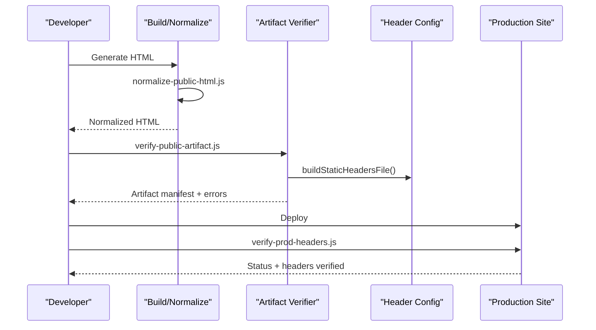

**Diagram sources**
- [scripts/normalize-public-html.js](file://scripts/normalize-public-html.js)
- [scripts/verify-public-artifact.js](file://scripts/verify-public-artifact.js)
- [config/security-headers.js](file://config/security-headers.js)
- [scripts/verify-prod-headers.js](file://scripts/verify-prod-headers.js)

## Detailed Component Analysis

### HTML Structure Regression Tests
- Validates doctype presence and parsing, exactly one html/head/body per document.
- Requires title, viewport, description, robots, and canonical in head.
- Enforces indexable pages have exactly one hreflang set to it-IT matching canonical; noindex pages must not expose hreflang.
- Validates skip-link targets exist and are local fragments.
- Ensures global HTML transform is idempotent.

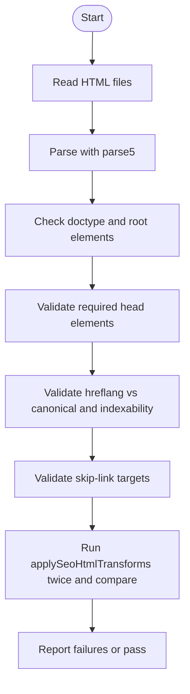

**Diagram sources**
- [tests/html-structure-regressions.test.js](file://tests/html-structure-regressions.test.js)

**Section sources**
- [tests/html-structure-regressions.test.js](file://tests/html-structure-regressions.test.js)

### Public HTML Policy Tests
- Central noncritical loader must exist and schedule low-priority work using requestIdleCallback/setTimeout and activate enhancements based on intent or visibility.
- Heavy decorative scripts must be deferred via the loader; no eager references allowed.
- No height="auto" in public HTML; blog articles must not use legacy footer markup.
- All public HTML must reference the progressive noncritical loader.

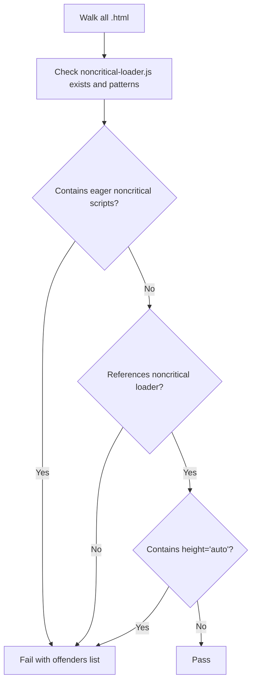

**Diagram sources**
- [tests/public-html-regressions.test.js](file://tests/public-html-regressions.test.js)

**Section sources**
- [tests/public-html-regressions.test.js](file://tests/public-html-regressions.test.js)

### Security Header Regressions
- Verifies _headers file is byte-for-byte synchronized with config/security-headers.js.
- Ensures CSP aligns X-Frame-Options DENY with frame-ancestors 'none'.
- Disallows immutable caching on stable asset paths and enforces path rule format.
- Confirms package.json exposes a verify:prod-headers script.

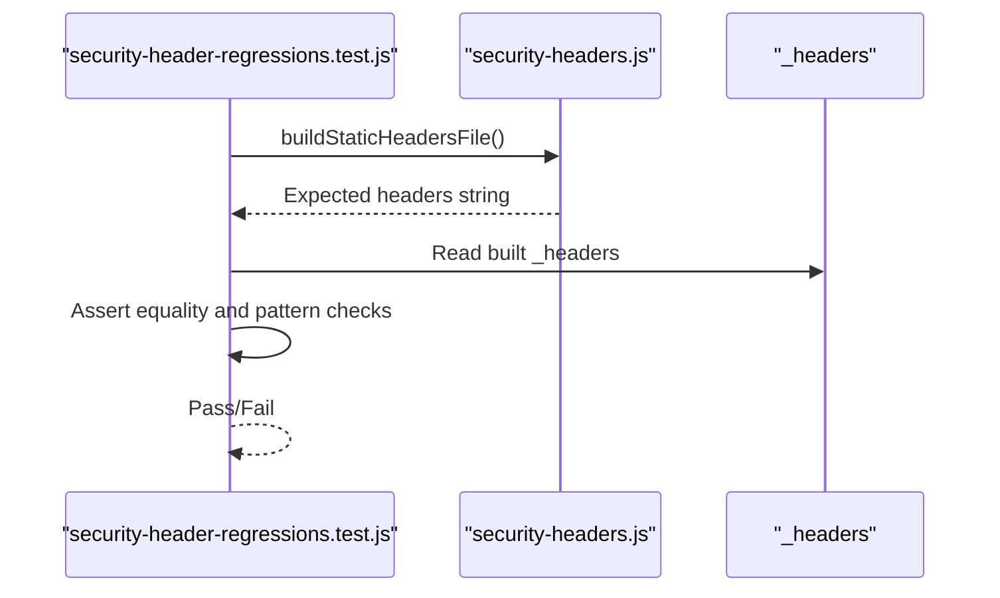

**Diagram sources**
- [tests/security-header-regressions.test.js](file://tests/security-header-regressions.test.js)
- [config/security-headers.js](file://config/security-headers.js)

**Section sources**
- [tests/security-header-regressions.test.js](file://tests/security-header-regressions.test.js)
- [config/security-headers.js](file://config/security-headers.js)

### Audit SEO and Accessibility Regressions
- No inline Clarity/Meta Pixel snippets; consent-gated loading enforced.
- Async CSS/font links must have noscript fallbacks.
- FAQ buttons must carry aria-expanded and aria-controls pointing to existing ids.
- Contrast ratio checks for text color variables against dark backgrounds.
- SearchAction JSON-LD must not be present; portfolio fonts must avoid render-blocking patterns.
- Known og:image URLs must include width/height properties.

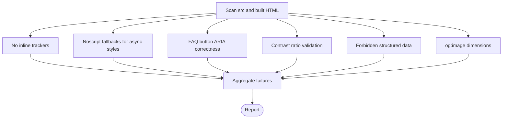

**Diagram sources**
- [tests/audit-seo-a11y-regressions.test.js](file://tests/audit-seo-a11y-regressions.test.js)

**Section sources**
- [tests/audit-seo-a11y-regressions.test.js](file://tests/audit-seo-a11y-regressions.test.js)

### Image Loading Policy
- Non-critical images must declare loading attribute unless whitelisted by class/alt/src keywords.
- Whitelist includes logo-image, hero-image, featured-image, lcp classes and alt/src keywords like logo/hero/cover.

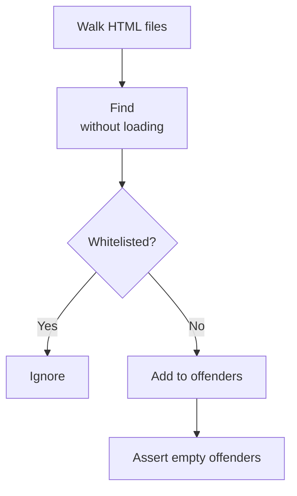

**Diagram sources**
- [tests/image-loading-policy.test.js](file://tests/image-loading-policy.test.js)
- [config/image-policy.js](file://config/image-policy.js)

**Section sources**
- [tests/image-loading-policy.test.js](file://tests/image-loading-policy.test.js)
- [config/image-policy.js](file://config/image-policy.js)

### Page Quality Validator (pSEO)
- Thresholds for unique words, internal links, JSON-LD schemas, canonical, H1, meta description length.
- Per-page overrides for hub and specific paths.
- Similarity detection between sibling geo pages using trigram Jaccard index.
- Exit code indicates pass/fail and strict mode behavior.

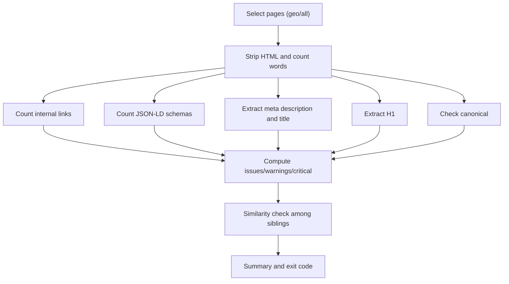

**Diagram sources**
- [scripts/validate-pages.js](file://scripts/validate-pages.js)

**Section sources**
- [scripts/validate-pages.js](file://scripts/validate-pages.js)

### Public Artifact Verifier
- Asserts sentinel files, forbidden paths, and exact HTML inventory match.
- Compares source and built sitemaps; ensures no noindex URLs in sitemap.
- Validates search-index/sitemap consistency.
- Runtime closure checks for HTML/CSS/JS references and dynamic dependencies.
- Secret-like content scan; _headers synchronization and CSP alignment.
- Homepage LCP image priority checks.

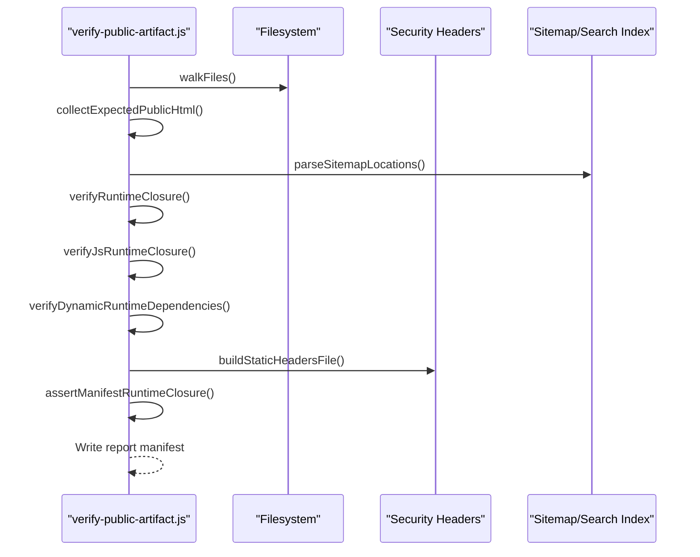

**Diagram sources**
- [scripts/verify-public-artifact.js](file://scripts/verify-public-artifact.js)
- [scripts/public-artifact.js](file://scripts/public-artifact.js)
- [config/security-headers.js](file://config/security-headers.js)

**Section sources**
- [scripts/verify-public-artifact.js](file://scripts/verify-public-artifact.js)
- [scripts/public-artifact.js](file://scripts/public-artifact.js)
- [config/security-headers.js](file://config/security-headers.js)

### Production Header Verifier
- Probes site endpoints for expected status codes and header values.
- Supports API base URL configuration and edge-managed headers.
- Categorizes mismatches into error/warn severity.

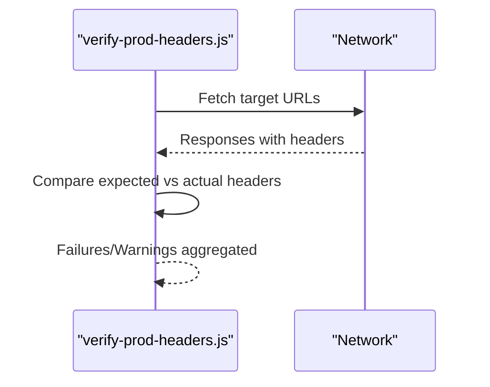

**Diagram sources**
- [scripts/verify-prod-headers.js](file://scripts/verify-prod-headers.js)
- [config/security-headers.js](file://config/security-headers.js)

**Section sources**
- [scripts/verify-prod-headers.js](file://scripts/verify-prod-headers.js)
- [config/security-headers.js](file://config/security-headers.js)

### HTML Normalization Pipeline
- Standardizes footers, widget loaders, noncritical loader injection, web-vitals reporter refs, and legacy link replacements.
- Ensures site-config script is injected before main.min.js once.
- Applies SEO HTML transforms and image loading normalization.

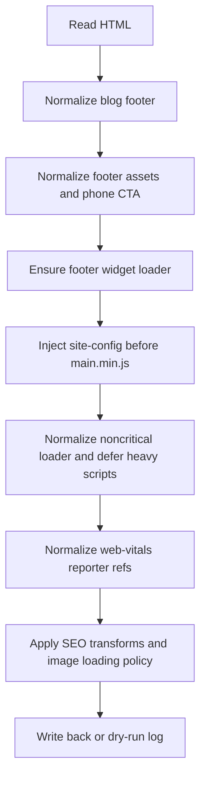

**Diagram sources**
- [scripts/normalize-public-html.js](file://scripts/normalize-public-html.js)

**Section sources**
- [scripts/normalize-public-html.js](file://scripts/normalize-public-html.js)

### Conceptual Overview
- Responsive design validation: Enforced through viewport meta presence, mobile preload patterns, and Lighthouse CI thresholds for performance and accessibility.
- Cross-browser compatibility: Assessed via Lighthouse categories and consistent noscript fallbacks for async styles.
- Security header verification: Centralized in config and validated both statically (_headers) and dynamically (production probes).

[No sources needed since this section doesn't analyze specific files]

## Dependency Analysis
Key relationships:
- Tests depend on scripts and configs to assert behaviors.
- normalize-public-html depends on shared config modules for footer, entity facts, image policy, and SEO transforms.
- verify-public-artifact depends on public-artifact policy module and security headers generator.
- verify-prod-headers depends on security headers config and network fetch.

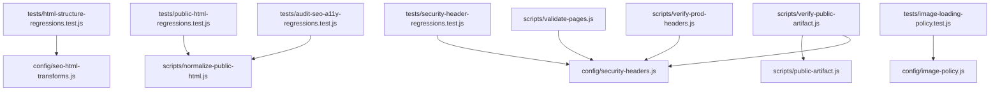

**Diagram sources**
- [tests/html-structure-regressions.test.js](file://tests/html-structure-regressions.test.js)
- [tests/public-html-regressions.test.js](file://tests/public-html-regressions.test.js)
- [tests/security-header-regressions.test.js](file://tests/security-header-regressions.test.js)
- [tests/audit-seo-a11y-regressions.test.js](file://tests/audit-seo-a11y-regressions.test.js)
- [tests/image-loading-policy.test.js](file://tests/image-loading-policy.test.js)
- [scripts/validate-pages.js](file://scripts/validate-pages.js)
- [scripts/verify-public-artifact.js](file://scripts/verify-public-artifact.js)
- [scripts/public-artifact.js](file://scripts/public-artifact.js)
- [scripts/verify-prod-headers.js](file://scripts/verify-prod-headers.js)
- [config/security-headers.js](file://config/security-headers.js)
- [config/image-policy.js](file://config/image-policy.js)

**Section sources**
- [tests/html-structure-regressions.test.js](file://tests/html-structure-regressions.test.js)
- [tests/public-html-regressions.test.js](file://tests/public-html-regressions.test.js)
- [tests/security-header-regressions.test.js](file://tests/security-header-regressions.test.js)
- [tests/audit-seo-a11y-regressions.test.js](file://tests/audit-seo-a11y-regressions.test.js)
- [tests/image-loading-policy.test.js](file://tests/image-loading-policy.test.js)
- [scripts/validate-pages.js](file://scripts/validate-pages.js)
- [scripts/verify-public-artifact.js](file://scripts/verify-public-artifact.js)
- [scripts/public-artifact.js](file://scripts/public-artifact.js)
- [scripts/verify-prod-headers.js](file://scripts/verify-prod-headers.js)
- [config/security-headers.js](file://config/security-headers.js)
- [config/image-policy.js](file://config/image-policy.js)

## Performance Considerations
- Progressive loading: Noncritical loader defers heavy scripts; tests enforce requestIdleCallback/setTimeout and event-driven activation.
- Lighthouse CI: Assertions require minimum scores for performance, SEO, and accessibility across key routes.
- Resource loading: Image loading policy ensures lazy loading for non-critical images; homepage LCP image priority is enforced.

**Section sources**
- [tests/public-html-regressions.test.js](file://tests/public-html-regressions.test.js)
- [lighthouserc.js](file://lighthouserc.js)
- [tests/image-loading-policy.test.js](file://tests/image-loading-policy.test.js)

## Troubleshooting Guide
Common failures and resolutions:
- Missing doctype or extra root elements: Ensure normalized HTML generation and idempotent transforms.
- Missing head elements or mismatched hreflang: Verify SEO transforms and canonical/hreflang pairing.
- Eager noncritical scripts: Remove direct script tags; rely on noncritical loader.
- Missing noncritical loader reference: Ensure every HTML includes the deferred loader.
- Height="auto" images: Replace with explicit dimensions or proper aspect-ratio handling.
- No noscript fallbacks for async styles: Add noscript blocks mirroring async link hrefs.
- Inline trackers: Move to consent-gated loader; remove inline snippets from HTML.
- Incorrect _headers: Rebuild via sync command; ensure CSP/frame-ancestors alignment.
- Missing runtime references: Fix relative paths; ensure JS/CSS references resolve within dist.
- Secrets in artifacts: Remove sensitive strings; update patterns if false positives occur.
- Lighthouse score drops: Optimize critical resources, reduce render-blocking assets, improve accessibility labels.

**Section sources**
- [tests/html-structure-regressions.test.js](file://tests/html-structure-regressions.test.js)
- [tests/public-html-regressions.test.js](file://tests/public-html-regressions.test.js)
- [tests/security-header-regressions.test.js](file://tests/security-header-regressions.test.js)
- [tests/audit-seo-a11y-regressions.test.js](file://tests/audit-seo-a11y-regressions.test.js)
- [scripts/verify-public-artifact.js](file://scripts/verify-public-artifact.js)
- [scripts/normalize-public-html.js](file://scripts/normalize-public-html.js)

## Conclusion
The validation framework comprehensively secures public HTML quality through structural checks, SEO/a11y audits, performance guardrails, and security header enforcement. By integrating normalization, artifact verification, and production probing, the system ensures robust, accessible, and secure public artifacts ready for deployment. Maintaining these tests and scripts keeps the site compliant with evolving standards and reduces risk of regressions.