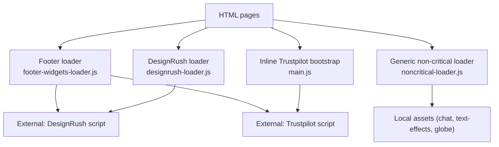
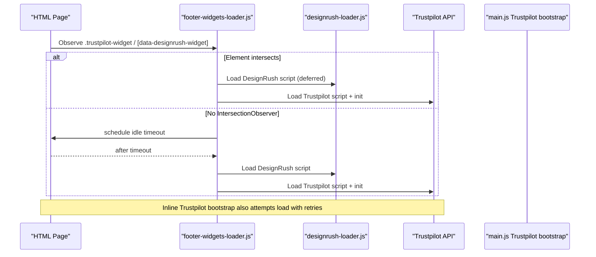
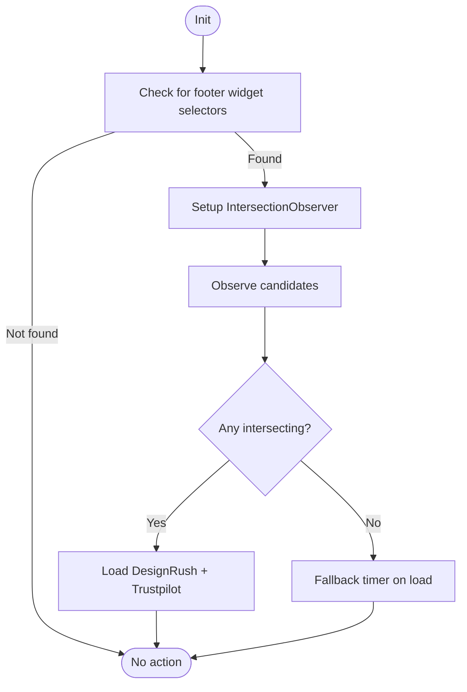
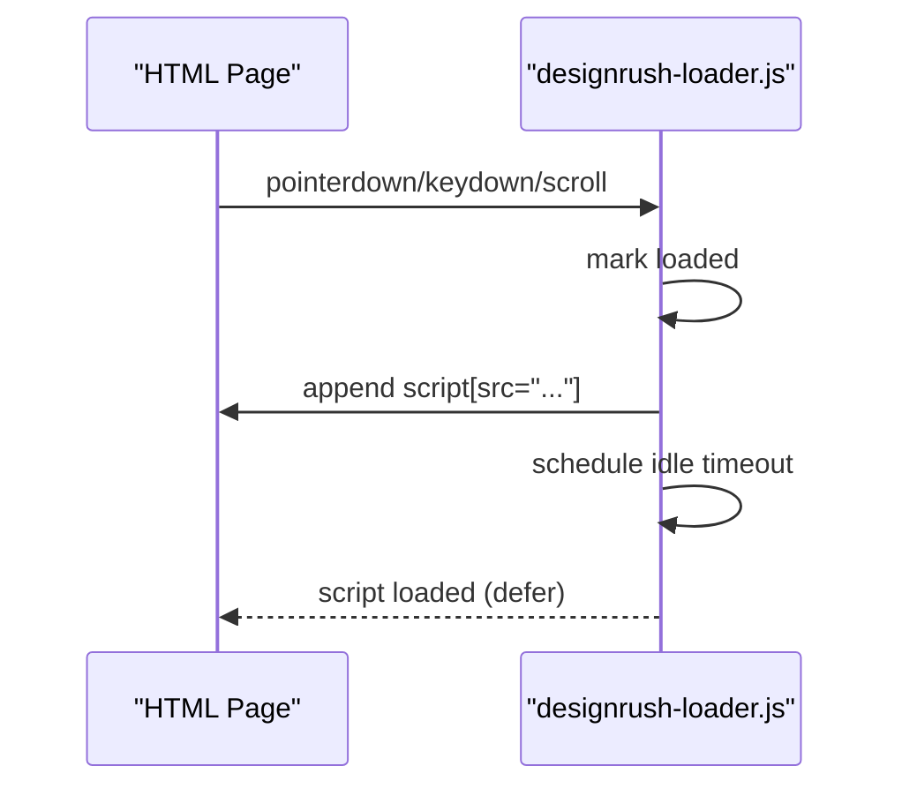
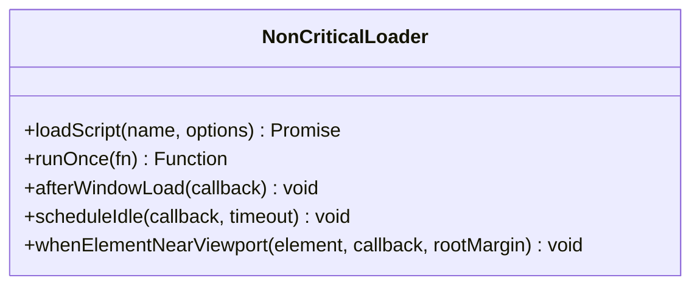
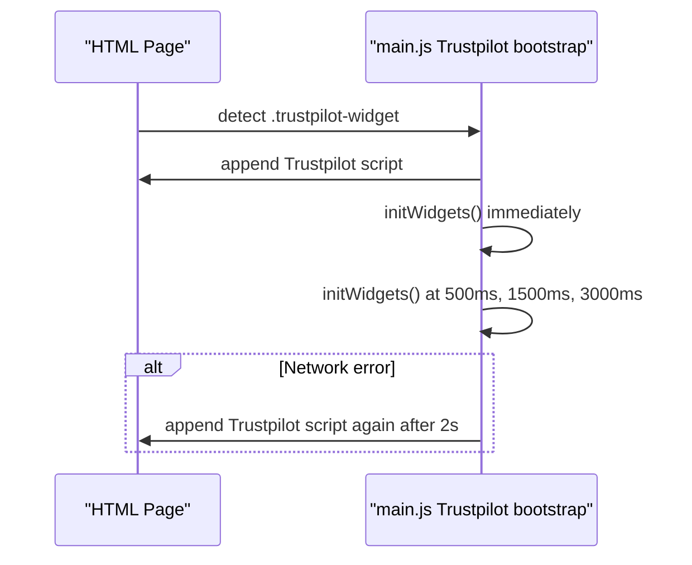
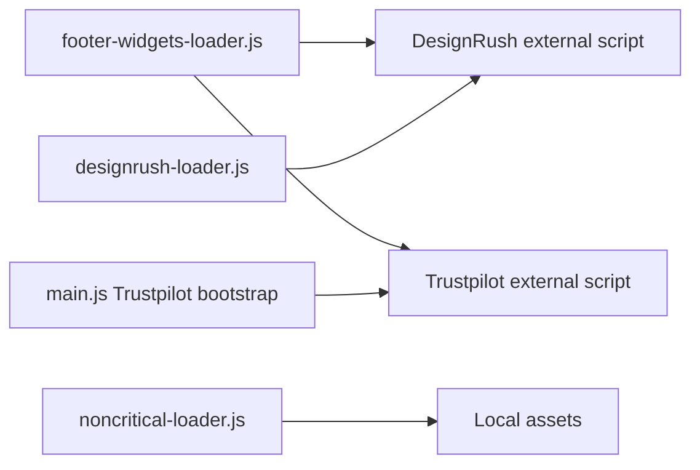

# Widget Loader & Component Testing

<cite>
**Referenced Files in This Document**
- [footer-widgets-loader.js](file://js/footer-widgets-loader.js)
- [designrush-loader.js](file://js/designrush-loader.js)
- [noncritical-loader.js](file://js/noncritical-loader.js)
- [main.js](file://js/main.js)
- [widget-loader-regressions.test.js](file://tests/widget-loader-regressions.test.js)
- [footer-widget-loader-regressions.test.js](file://tests/footer-widget-loader-regressions.test.js)
- [geo-editorial-loader-regressions.test.js](file://tests/geo-editorial-loader-regressions.test.js)
- [seo-smoke.test.js](file://tests/seo-smoke.test.js)
- [package.json](file://package.json)
</cite>

## Table of Contents
1. [Introduction](#introduction)
2. [Project Structure](#project-structure)
3. [Core Components](#core-components)
4. [Architecture Overview](#architecture-overview)
5. [Detailed Component Analysis](#detailed-component-analysis)
6. [Dependency Analysis](#dependency-analysis)
7. [Performance Considerations](#performance-considerations)
8. [Troubleshooting Guide](#troubleshooting-guide)
9. [Conclusion](#conclusion)
10. [Appendices](#appendices)

## Introduction
This document explains how the WebNovis project loads third-party widgets (DesignRush and Trustpilot) and how integration tests ensure correct, performant, and resilient behavior. It focuses on:
- Dynamic widget loading strategies using lazy triggers and fallback timers
- Footer-specific widget loading with intersection-based activation
- Centralized loaders to avoid hardcoding external scripts in HTML
- Test scenarios that verify dependency resolution, asynchronous loading patterns, error handling, and performance safeguards
- Guidance for writing effective widget tests covering responsive behavior, accessibility considerations, and cross-browser compatibility

## Project Structure
The widget loading logic is implemented in JavaScript modules under js/, while regression tests live under tests/. The build and test orchestration is defined in package.json.

**Diagram sources**
- [footer-widgets-loader.js:1-88](file://js/footer-widgets-loader.js#L1-L88)
- [designrush-loader.js:1-28](file://js/designrush-loader.js#L1-L28)
- [noncritical-loader.js:1-166](file://js/noncritical-loader.js#L1-L166)
- [main.js:2194-2242](file://js/main.js#L2194-L2242)

**Section sources**
- [footer-widgets-loader.js:1-88](file://js/footer-widgets-loader.js#L1-L88)
- [designrush-loader.js:1-28](file://js/designrush-loader.js#L1-L28)
- [noncritical-loader.js:1-166](file://js/noncritical-loader.js#L1-L166)
- [main.js:2194-2242](file://js/main.js#L2194-L2242)
- [package.json:44-47](file://package.json#L44-L47)

## Core Components
- Footer widget loader: Detects footer review badges and lazily loads DesignRush and Trustpilot when they enter the viewport; falls back to idle timers if IntersectionObserver is unavailable.
- DesignRush loader: Lazily injects the DesignRush widget script on user interaction or scroll, with a time-bounded idle fallback.
- Non-critical loader: Centralized utility to load local scripts once, with module support, error handling, and viewport-aware scheduling.
- Inline Trustpilot bootstrap: An inline pattern in main.js that loads the Trustpilot script and initializes widgets with retries for mobile browsers.

Key responsibilities:
- Avoid hardcoding third-party scripts directly in HTML where not needed above the fold
- Use IntersectionObserver for early loading when elements are near the viewport
- Provide robust fallbacks using requestIdleCallback and setTimeout
- Ensure idempotent loading and prevent duplicate script injection

**Section sources**
- [footer-widgets-loader.js:8-52](file://js/footer-widgets-loader.js#L8-L52)
- [footer-widgets-loader.js:54-86](file://js/footer-widgets-loader.js#L54-L86)
- [designrush-loader.js:5-26](file://js/designrush-loader.js#L5-L26)
- [noncritical-loader.js:21-41](file://js/noncritical-loader.js#L21-L41)
- [main.js:2194-2242](file://js/main.js#L2194-L2242)

## Architecture Overview
The system uses multiple complementary loaders to balance performance and reliability:
- Footer widgets are loaded only when relevant sections become visible
- Global interactions (pointerdown, keydown, scroll) trigger lightweight loaders
- Non-critical features are deferred until idle or when near the viewport
- Inline bootstraps provide immediate initialization for critical widgets like Trustpilot

**Diagram sources**
- [footer-widgets-loader.js:54-86](file://js/footer-widgets-loader.js#L54-L86)
- [designrush-loader.js:16-26](file://js/designrush-loader.js#L16-L26)
- [main.js:2194-2242](file://js/main.js#L2194-L2242)

## Detailed Component Analysis

### Footer Widgets Loader
Responsibilities:
- Detect presence of footer widgets via selectors
- Dynamically create and append scripts for DesignRush and Trustpilot
- Use IntersectionObserver to trigger loading when elements are near the viewport
- Provide fallback timers using requestIdleCallback and setTimeout

Error handling and resilience:
- Guards against duplicate loading with flags
- Skips loading if no target elements exist
- Gracefully handles missing IntersectionObserver by falling back to timers

**Diagram sources**
- [footer-widgets-loader.js:8-10](file://js/footer-widgets-loader.js#L8-L10)
- [footer-widgets-loader.js:54-86](file://js/footer-widgets-loader.js#L54-L86)

**Section sources**
- [footer-widgets-loader.js:1-88](file://js/footer-widgets-loader.js#L1-L88)

### DesignRush Loader
Responsibilities:
- Inject the DesignRush widget script once per page
- Trigger loading on user interactions (pointerdown, keydown, scroll)
- Schedule an idle-time fallback to ensure eventual loading

Error handling and resilience:
- Prevents duplicate injection with a flag
- Uses defer to avoid blocking rendering
- Time-bounded idle callback ensures loading even without interaction

**Diagram sources**
- [designrush-loader.js:5-26](file://js/designrush-loader.js#L5-L26)

**Section sources**
- [designrush-loader.js:1-28](file://js/designrush-loader.js#L1-L28)

### Non-Critical Loader
Responsibilities:
- Centralized script loading with deduplication
- Support for module scripts and deferred scripts
- Viewport-aware scheduling using IntersectionObserver
- Idle scheduling with timeouts for environments lacking modern APIs

Error handling and resilience:
- Removes failed scripts from cache to allow retry
- Provides runOnce wrappers to avoid repeated work
- Graceful degradation when IntersectionObserver is unavailable

**Diagram sources**
- [noncritical-loader.js:21-41](file://js/noncritical-loader.js#L21-L41)
- [noncritical-loader.js:43-71](file://js/noncritical-loader.js#L43-L71)
- [noncritical-loader.js:73-90](file://js/noncritical-loader.js#L73-L90)

**Section sources**
- [noncritical-loader.js:1-166](file://js/noncritical-loader.js#L1-L166)

### Inline Trustpilot Bootstrap
Responsibilities:
- Load the Trustpilot script and initialize widgets on pages where it is embedded
- Retry initialization multiple times to handle mobile browser quirks
- Handle network errors with a delayed retry

Error handling and resilience:
- Immediate and delayed retries for widget initialization
- Error handler schedules a second attempt after a delay

**Diagram sources**
- [main.js:2194-2242](file://js/main.js#L2194-L2242)

**Section sources**
- [main.js:2194-2242](file://js/main.js#L2194-L2242)

## Dependency Analysis
- Footer loader depends on:
  - DOM selectors for widget placeholders
  - External scripts for DesignRush and Trustpilot
  - Browser APIs: IntersectionObserver, requestIdleCallback
- DesignRush loader depends on:
  - External DesignRush script
  - User interaction events and idle scheduling
- Non-critical loader depends on:
  - Local asset paths and versioned cache busting
  - Browser APIs: IntersectionObserver, requestIdleCallback
- Inline Trustpilot bootstrap depends on:
  - External Trustpilot script
  - Window methods exposed by the Trustpilot library

Potential coupling and risks:
- Heavy reliance on third-party availability; failures must be handled gracefully
- Multiple loaders may target the same widget; ensure idempotency to avoid duplicates
- Fallback timers must be tuned to avoid late UI shifts or wasted requests

**Diagram sources**
- [footer-widgets-loader.js:1-88](file://js/footer-widgets-loader.js#L1-L88)
- [designrush-loader.js:1-28](file://js/designrush-loader.js#L1-L28)
- [noncritical-loader.js:1-166](file://js/noncritical-loader.js#L1-L166)
- [main.js:2194-2242](file://js/main.js#L2194-L2242)

**Section sources**
- [footer-widgets-loader.js:1-88](file://js/footer-widgets-loader.js#L1-L88)
- [designrush-loader.js:1-28](file://js/designrush-loader.js#L1-L28)
- [noncritical-loader.js:1-166](file://js/noncritical-loader.js#L1-L166)
- [main.js:2194-2242](file://js/main.js#L2194-L2242)

## Performance Considerations
- Lazy loading: All widget scripts are deferred or loaded on demand to minimize initial payload
- IntersectionObserver: Early loading when elements are near the viewport reduces perceived latency
- Idle scheduling: requestIdleCallback defers non-critical work until the browser is idle
- Deduplication: Flags and caches prevent duplicate script injections and redundant initialization
- Retries: Controlled retries mitigate transient network issues without excessive requests

[No sources needed since this section provides general guidance]

## Troubleshooting Guide
Common issues and debugging steps:

- Missing dependencies:
  - Verify that HTML pages include the central footer loader when they contain footer widgets
  - Ensure the DesignRush loader exists and contains the expected external URL
  - Confirm that the footer loader references both DesignRush and Trustpilot

- Loading timeouts:
  - Inspect whether IntersectionObserver is available; if not, fallback timers should still trigger
  - Check that idle callbacks have appropriate timeouts and are not blocked by heavy tasks
  - Validate that event listeners (pointerdown, keydown, scroll) are firing as expected

- DOM manipulation errors:
  - Ensure selectors match actual elements (.trustpilot-widget, [data-designrush-widget])
  - Verify that scripts are appended to valid nodes (body/head/documentElement)
  - Confirm that widget initialization functions exist before calling them

- Cross-browser compatibility:
  - For older browsers without IntersectionObserver or requestIdleCallback, confirm fallback timers execute
  - For mobile browsers, rely on multiple initialization attempts to handle delayed APIs

- Accessibility compliance:
  - Ensure widgets do not disrupt keyboard navigation or screen reader announcements
  - Avoid layout shifts that could confuse assistive technologies; use stable placeholders where possible

- Regression tests:
  - Run the widget loader regression tests to enforce centralized loading and absence of hardcoded external scripts in HTML
  - Use the footer widget loader regression tests to ensure pages with footer widgets reference the central loader

**Section sources**
- [widget-loader-regressions.test.js:22-47](file://tests/widget-loader-regressions.test.js#L22-L47)
- [footer-widget-loader-regressions.test.js:21-57](file://tests/footer-widget-loader-regressions.test.js#L21-L57)
- [footer-widgets-loader.js:54-86](file://js/footer-widgets-loader.js#L54-L86)
- [main.js:2194-2242](file://js/main.js#L2194-L2242)

## Conclusion
WebNovis employs a layered approach to widget loading that balances performance and reliability:
- Footer widgets are loaded lazily based on visibility
- Global interactions trigger lightweight loaders
- Non-critical features are deferred until idle or near the viewport
- Inline bootstraps provide immediate initialization for critical widgets

Integration tests enforce best practices:
- Centralized loaders instead of hardcoded external scripts
- Presence and correctness of loader files
- Consistent patterns across pages

By following these strategies and leveraging the provided tests, teams can maintain high performance, graceful error handling, and consistent widget behavior across devices and browsers.

[No sources needed since this section summarizes without analyzing specific files]

## Appendices

### Running Tests
- Execute all regression tests including widget loader checks via the npm script defined in package.json
- Isolate widget-related tests by running specific test files

**Section sources**
- [package.json:44-47](file://package.json#L44-L47)

### Writing Effective Widget Tests
- Assert that HTML does not hardcode external widget URLs; require central loaders
- Verify loader files exist and contain expected external URLs
- Simulate environment conditions:
  - Absence of IntersectionObserver to validate fallback timers
  - Delayed or failed network responses to validate retries and error handling
- Validate DOM state:
  - Ensure placeholder elements exist before loading
  - Confirm scripts are appended once and initialized correctly
- Accessibility checks:
  - Ensure widgets do not break keyboard navigation
  - Verify ARIA attributes remain valid after dynamic updates

**Section sources**
- [widget-loader-regressions.test.js:22-47](file://tests/widget-loader-regressions.test.js#L22-L47)
- [footer-widget-loader-regressions.test.js:21-57](file://tests/footer-widget-loader-regressions.test.js#L21-L57)
- [geo-editorial-loader-regressions.test.js:161-184](file://tests/geo-editorial-loader-regressions.test.js#L161-L184)
- [seo-smoke.test.js:11-39](file://tests/seo-smoke.test.js#L11-L39)